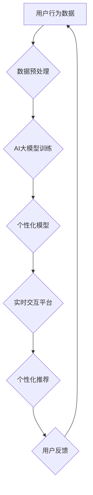

                 

## AI大模型在电商实时个性化中的应用与挑战

> 关键词：AI大模型、电商个性化、推荐系统、自然语言处理、深度学习、实时交互、数据隐私

## 1. 背景介绍

电子商务行业竞争日益激烈，用户对个性化体验的需求也越来越高。传统的电商推荐系统主要依赖于用户历史行为和商品特征，难以捕捉用户瞬时意图和动态变化的偏好。随着人工智能技术的快速发展，特别是大规模语言模型（LLM）的出现，为电商实时个性化提供了新的机遇。

AI大模型，例如GPT-3、LaMDA等，拥有强大的文本理解和生成能力，能够理解用户复杂的需求，并生成个性化的商品推荐、产品描述、营销文案等。结合实时交互技术，AI大模型可以实现对用户行为的实时分析和个性化响应，为用户提供更精准、更及时、更具吸引力的购物体验。

## 2. 核心概念与联系

### 2.1  电商实时个性化

电商实时个性化是指根据用户实时行为、偏好和上下文信息，为用户提供个性化的商品推荐、内容展示、服务交互等，以提升用户体验和转化率。

### 2.2  AI大模型

AI大模型是指在海量数据上训练的深度学习模型，拥有强大的泛化能力和学习能力，能够理解和生成复杂文本。

### 2.3  核心架构

AI大模型在电商实时个性化中的应用主要涉及以下几个环节：



**流程说明：**

1. **用户行为数据：** 收集用户浏览历史、购买记录、搜索关键词、评论点赞等行为数据。
2. **数据预处理：** 对收集到的数据进行清洗、转换、特征提取等预处理，以便于模型训练。
3. **AI大模型训练：** 利用预处理后的数据训练AI大模型，例如BERT、GPT等，使其能够理解用户需求和商品特征。
4. **个性化模型：** 将训练好的AI大模型部署到个性化模型中，用于生成个性化推荐、内容展示等。
5. **实时交互平台：** 建立实时交互平台，接收用户请求并根据个性化模型生成响应。
6. **个性化推荐：** 根据用户实时行为和偏好，生成个性化的商品推荐、内容展示等。
7. **用户反馈：** 收集用户对个性化推荐的反馈，用于模型优化和迭代。

## 3. 核心算法原理 & 具体操作步骤

### 3.1  算法原理概述

AI大模型在电商实时个性化中的应用主要基于以下核心算法：

* **深度学习：** 利用多层神经网络结构，从海量数据中学习用户行为模式和商品特征关系。
* **自然语言处理 (NLP)：** 对用户文本输入进行理解和分析，提取用户意图和需求。
* **推荐系统算法：** 基于用户行为数据和商品特征，预测用户对商品的兴趣和购买可能性。

### 3.2  算法步骤详解

1. **数据收集和预处理：** 收集用户行为数据，例如浏览记录、购买记录、搜索关键词、评论点赞等，并进行清洗、转换、特征提取等预处理。
2. **模型训练：** 利用深度学习算法，例如Transformer网络，训练AI大模型，使其能够理解用户需求和商品特征。
3. **个性化模型构建：** 将训练好的AI大模型部署到个性化模型中，用于生成个性化推荐、内容展示等。
4. **实时交互：** 建立实时交互平台，接收用户请求，并根据个性化模型生成响应。
5. **反馈收集和模型优化：** 收集用户对个性化推荐的反馈，并将其用于模型优化和迭代。

### 3.3  算法优缺点

**优点：**

* **精准度高：** AI大模型能够学习用户复杂的需求，提供更精准的个性化推荐。
* **实时性强：** 基于实时交互平台，能够及时响应用户行为变化，提供更及时个性化的服务。
* **可扩展性强：** AI大模型能够处理海量数据，并适应不断变化的用户需求。

**缺点：**

* **训练成本高：** 训练大型AI模型需要大量的计算资源和时间。
* **数据隐私问题：** AI大模型需要大量用户数据进行训练，需要妥善处理用户隐私问题。
* **解释性差：** AI大模型的决策过程较为复杂，难以解释其推荐结果。

### 3.4  算法应用领域

AI大模型在电商实时个性化中的应用领域非常广泛，例如：

* **商品推荐：** 根据用户历史行为和偏好，推荐个性化的商品。
* **内容推荐：** 根据用户兴趣，推荐个性化的文章、视频、直播等内容。
* **营销文案生成：** 根据用户需求，生成个性化的营销文案。
* **客服机器人：** 利用AI大模型，构建智能客服机器人，为用户提供个性化的服务。

## 4. 数学模型和公式 & 详细讲解 & 举例说明

### 4.1  数学模型构建

在电商实时个性化中，常用的数学模型包括协同过滤模型、内容基模型和混合模型。

* **协同过滤模型：** 基于用户-商品交互矩阵，预测用户对商品的评分或购买可能性。
* **内容基模型：** 基于商品的特征和用户偏好，预测用户对商品的兴趣。
* **混合模型：** 将协同过滤模型和内容基模型相结合，提高推荐精准度。

### 4.2  公式推导过程

协同过滤模型中常用的公式包括：

* **用户相似度计算：**

$$
Sim(u_i, u_j) = \frac{\sum_{m \in M(u_i \cap u_j)} (r_{im} - \bar{r}_i)(\bar{r}_{jm} - \bar{r}_j)}{\sqrt{\sum_{m \in M(u_i)} (r_{im} - \bar{r}_i)^2} \sqrt{\sum_{m \in M(u_j)} (r_{jm} - \bar{r}_j)^2}}
$$

其中：

* $u_i$ 和 $u_j$ 表示两个用户。
* $M(u_i \cap u_j)$ 表示两个用户共同交互过的商品集合。
* $r_{im}$ 表示用户 $u_i$ 对商品 $m$ 的评分。
* $\bar{r}_i$ 表示用户 $u_i$ 的平均评分。

* **商品推荐预测：**

$$
\hat{r}_{ui} = \bar{r}_i + \frac{\sum_{j \in N(u_i)} Sim(u_i, u_j) (r_{uj} - \bar{r}_j)}{\sum_{j \in N(u_i)} Sim(u_i, u_j)}
$$

其中：

* $N(u_i)$ 表示与用户 $u_i$ 相似的用户集合。

### 4.3  案例分析与讲解

假设用户 A 和用户 B 都购买了商品 1 和商品 2，但用户 A 对商品 3 的评分较高，而用户 B 对商品 4 的评分较高。

利用协同过滤模型，可以计算用户 A 和用户 B 的相似度，并预测用户 A 对商品 4 的评分。

如果用户 A 和用户 B 的相似度较高，则预测用户 A 对商品 4 的评分也可能较高。

## 5. 项目实践：代码实例和详细解释说明

### 5.1  开发环境搭建

* **操作系统：** Linux 或 macOS
* **编程语言：** Python
* **深度学习框架：** TensorFlow 或 PyTorch
* **数据存储：** MySQL 或 MongoDB

### 5.2  源代码详细实现

```python
# 导入必要的库
import tensorflow as tf

# 定义模型结构
model = tf.keras.Sequential([
    tf.keras.layers.Embedding(input_dim=vocab_size, output_dim=embedding_dim),
    tf.keras.layers.LSTM(units=128),
    tf.keras.layers.Dense(units=num_classes, activation='softmax')
])

# 编译模型
model.compile(optimizer='adam',
              loss='sparse_categorical_crossentropy',
              metrics=['accuracy'])

# 训练模型
model.fit(x_train, y_train, epochs=10)

# 评估模型
loss, accuracy = model.evaluate(x_test, y_test)
print('Loss:', loss)
print('Accuracy:', accuracy)
```

**代码解释：**

* 该代码示例展示了使用 TensorFlow 框架训练一个简单的文本分类模型。
* 模型结构包括 Embedding 层、LSTM 层和 Dense 层。
* Embedding 层将单词转换为向量表示。
* LSTM 层用于捕捉文本序列中的长距离依赖关系。
* Dense 层用于分类。
* 模型使用 Adam 优化器、稀疏类别交叉熵损失函数和准确率作为评估指标。

### 5.3  代码解读与分析

* 该代码示例展示了使用深度学习框架训练AI模型的基本流程。
* 模型结构可以根据具体任务进行调整。
* 训练过程需要大量的计算资源和时间。
* 模型评估指标需要根据具体任务进行选择。

### 5.4  运行结果展示

* 训练完成后，可以将模型部署到生产环境中，用于实时个性化服务。
* 运行结果展示包括模型的准确率、召回率、F1-score等指标。

## 6. 实际应用场景

### 6.1  个性化商品推荐

AI大模型可以根据用户的浏览历史、购买记录、搜索关键词等数据，推荐个性化的商品。例如，电商平台可以利用AI大模型为用户推荐他们可能感兴趣的商品，提高用户购买意愿。

### 6.2  内容个性化推荐

AI大模型可以根据用户的兴趣爱好、阅读习惯等数据，推荐个性化的文章、视频、直播等内容。例如，新闻网站可以利用AI大模型为用户推荐他们感兴趣的新闻资讯，提高用户粘性。

### 6.3  营销文案生成

AI大模型可以根据用户的需求和偏好，生成个性化的营销文案。例如，电商平台可以利用AI大模型为用户生成个性化的促销信息，提高用户转化率。

### 6.4  未来应用展望

AI大模型在电商实时个性化领域的应用前景广阔，未来可能应用于：

* **虚拟试衣间：** 利用AI大模型，为用户提供虚拟试衣间体验，帮助用户选择合适的服装。
* **个性化客服：** 利用AI大模型，构建智能客服机器人，为用户提供个性化的服务。
* **智能导购：** 利用AI大模型，为用户提供智能导购服务，帮助用户找到心仪的商品。

## 7. 工具和资源推荐

### 7.1  学习资源推荐

* **书籍：**
    * 《深度学习》
    * 《自然语言处理》
    * 《推荐系统》
* **在线课程：**
    * Coursera
    * edX
    * Udacity

### 7.2  开发工具推荐

* **深度学习框架：** TensorFlow、PyTorch
* **数据处理工具：** Pandas、NumPy
* **云计算平台：** AWS、Azure、GCP

### 7.3  相关论文推荐

* **BERT：** Devlin et al. (2018)
* **GPT：** Radford et al. (2019)
* **Transformer：** Vaswani et al. (2017)

## 8. 总结：未来发展趋势与挑战

### 8.1  研究成果总结

AI大模型在电商实时个性化领域的应用取得了显著成果，能够提供更精准、更及时、更具吸引力的购物体验。

### 8.2  未来发展趋势

* **模型规模和能力提升：** 未来AI大模型规模将进一步扩大，能力将更加强大，能够处理更复杂的任务。
* **多模态融合：** AI大模型将融合文本、图像、音频等多模态数据，提供更全面的个性化服务。
* **解释性增强：** 研究者将致力于提高AI大模型的解释性，使模型决策更加透明可信。

### 8.3  面临的挑战

* **数据隐私保护：** AI大模型训练需要大量用户数据，如何保护用户隐私是一个重要挑战。
* **模型可解释性：** AI大模型的决策过程较为复杂，难以解释其推荐结果，需要提高模型的可解释性。
* **计算资源需求：** 训练大型AI模型需要大量的计算资源，成本较高。

### 8.4  研究展望

未来研究将重点关注以下几个方面：

* **隐私保护技术：** 研究更有效的隐私保护技术，保障用户数据安全。
* **可解释性研究：** 研究提高AI大模型可解释性的方法，使模型决策更加透明可信。
* **高效训练算法：** 研究更有效的训练算法，降低训练成本。

## 9. 附录：常见问题与解答

**Q1：AI大模型的训练需要多少数据？**

A1：AI大模型的训练数据量取决于模型规模和任务复杂度。一般来说，需要百万甚至数百万条数据才能训练出效果较好的模型。

**Q2：如何保证AI大模型的公平性？**

A2：AI大模型的公平性是一个重要的研究课题。需要关注模型训练数据中的潜在偏见，并采取措施避免模型输出结果出现歧视。

**Q3：AI大模型的应用会取代人类的工作吗？**

A3：AI大模型可以自动化许多任务，但不会完全取代人类的工作。人类仍然需要发挥创造力、判断力和解决复杂问题的能力。


作者：禅与计算机程序设计艺术 / Zen and the Art of Computer Programming 
<end_of_turn>

