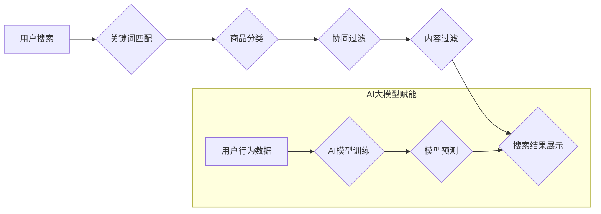

                 

## AI大模型赋能电商搜索推荐的业务创新流程优化工具选型与应用实践

> 关键词：AI大模型、电商搜索、推荐系统、业务流程优化、工具选型、应用实践

## 1. 背景介绍

随着电商行业的蓬勃发展，用户对商品搜索和推荐的需求日益增长。传统的基于规则的搜索和推荐系统难以满足用户个性化、多样化的需求，而基于机器学习的AI大模型则为电商搜索推荐提供了新的解决方案。AI大模型能够通过学习海量用户行为数据和商品信息，精准预测用户兴趣，提供更个性化、更精准的搜索和推荐结果，从而提升用户体验，促进交易转化。

然而，将AI大模型应用于电商搜索推荐并非易事。需要考虑模型选择、数据处理、模型训练、部署上线等多个环节，涉及到技术、业务、数据等多方面的挑战。因此，选择合适的工具和流程，高效地将AI大模型应用于电商搜索推荐，成为电商企业亟需解决的问题。

## 2. 核心概念与联系

### 2.1  电商搜索推荐系统

电商搜索推荐系统是电商平台的核心功能之一，旨在帮助用户快速找到所需商品，并根据用户的兴趣和偏好推荐相关商品。传统的电商搜索推荐系统主要基于以下技术：

* **关键词匹配:** 根据用户输入的关键词，从商品数据库中匹配出相关商品。
* **商品分类:** 将商品按照类别进行分类，方便用户浏览和搜索。
* **协同过滤:** 根据用户的历史购买行为和相似用户的购买行为，推荐用户可能感兴趣的商品。
* **内容过滤:** 根据商品的属性和描述，推荐与用户兴趣相符的商品。

### 2.2  AI大模型

AI大模型是指在海量数据上训练的深度学习模型，具有强大的学习和推理能力。常见的AI大模型包括：

* **Transformer模型:** 擅长处理自然语言文本，例如BERT、GPT-3等。
* **图神经网络:** 擅长处理关系数据，例如知识图谱嵌入、推荐系统等。
* **生成对抗网络(GAN):** 擅长生成新数据，例如图像、文本等。

### 2.3  AI大模型赋能电商搜索推荐

AI大模型可以有效提升电商搜索推荐系统的性能，主要体现在以下方面：

* **更精准的商品搜索:** AI大模型可以理解用户搜索意图，即使用户输入的关键词不完整或模糊，也能精准匹配相关商品。
* **更个性化的商品推荐:** AI大模型可以学习用户的兴趣偏好，并根据用户的历史行为、浏览记录、购买记录等数据，推荐更个性化的商品。
* **更丰富的搜索结果:** AI大模型可以将商品信息、用户评论、商品属性等多种信息融合在一起，提供更丰富、更全面的搜索结果。

**核心概念与联系流程图:**



## 3. 核心算法原理 & 具体操作步骤

### 3.1  算法原理概述

AI大模型赋能电商搜索推荐的核心算法主要包括：

* **深度学习:** 利用多层神经网络学习用户行为数据和商品信息，提取特征，构建预测模型。
* **自然语言处理(NLP):** 处理用户搜索关键词，理解用户意图，提高搜索精准度。
* **推荐算法:** 根据用户兴趣和商品信息，预测用户可能感兴趣的商品，并进行排序推荐。

### 3.2  算法步骤详解

1. **数据收集与预处理:** 收集用户行为数据、商品信息等数据，并进行清洗、转换、特征工程等预处理操作。
2. **模型选择与训练:** 根据业务需求选择合适的AI大模型，并利用训练数据进行模型训练。
3. **模型评估与优化:** 利用测试数据评估模型性能，并根据评估结果进行模型调优。
4. **模型部署与上线:** 将训练好的模型部署到线上环境，并进行监控和维护。

### 3.3  算法优缺点

**优点:**

* **精准度高:** AI大模型能够学习用户行为数据和商品信息，提供更精准的搜索和推荐结果。
* **个性化强:** AI大模型可以根据用户的兴趣偏好，提供更个性化的商品推荐。
* **可扩展性强:** AI大模型可以处理海量数据，并随着数据量的增加不断提升性能。

**缺点:**

* **训练成本高:** AI大模型的训练需要大量的计算资源和时间。
* **数据依赖性强:** AI大模型的性能取决于训练数据的质量和数量。
* **解释性差:** AI大模型的决策过程较为复杂，难以解释其推荐结果背后的逻辑。

### 3.4  算法应用领域

AI大模型在电商搜索推荐领域有着广泛的应用，例如：

* **商品搜索:** 提升商品搜索的精准度和效率。
* **商品推荐:** 提供个性化商品推荐，提升用户体验和转化率。
* **用户画像:** 建立用户画像，精准定位用户需求。
* **营销推广:** 根据用户画像进行精准营销推广。

## 4. 数学模型和公式 & 详细讲解 & 举例说明

### 4.1  数学模型构建

在电商搜索推荐系统中，常用的数学模型包括协同过滤模型、内容过滤模型和混合模型。

**协同过滤模型:**

协同过滤模型基于用户的历史行为数据和相似用户的行为数据，预测用户可能感兴趣的商品。常用的协同过滤算法包括基于用户的协同过滤和基于物品的协同过滤。

**基于用户的协同过滤:**

假设用户u和用户v都购买了商品i，则可以认为用户u和用户v的兴趣相似。基于此，可以预测用户u可能对用户v购买过的其他商品感兴趣。

**基于物品的协同过滤:**

假设商品i和商品j都由用户u购买，则可以认为商品i和商品j之间存在某种关联。基于此，可以预测用户u可能对商品j感兴趣。

**内容过滤模型:**

内容过滤模型基于商品的属性和描述信息，预测用户可能感兴趣的商品。常用的内容过滤算法包括基于词袋模型和基于向量空间模型。

**混合模型:**

混合模型将协同过滤模型和内容过滤模型相结合，利用用户的行为数据和商品信息，提供更精准的商品推荐。

### 4.2  公式推导过程

**协同过滤模型的评分预测公式:**

$$
\hat{r}_{u,i} = \bar{r}_u + \frac{\sum_{v \in N(u)} (r_{v,i} - \bar{r}_v) \cdot sim(u,v)}{\sum_{v \in N(u)} sim(u,v)}
$$

其中:

* $\hat{r}_{u,i}$: 用户u对商品i的预测评分
* $\bar{r}_u$: 用户u的平均评分
* $r_{v,i}$: 用户v对商品i的实际评分
* $N(u)$: 用户u的邻居用户集合
* $sim(u,v)$: 用户u和用户v之间的相似度

**内容过滤模型的相似度计算公式:**

$$
sim(i,j) = \frac{\sum_{k=1}^{n} w_k \cdot x_{i,k} \cdot x_{j,k}}{\sqrt{\sum_{k=1}^{n} w_k^2 \cdot x_{i,k}^2} \cdot \sqrt{\sum_{k=1}^{n} w_k^2 \cdot x_{j,k}^2}}
$$

其中:

* $sim(i,j)$: 商品i和商品j之间的相似度
* $w_k$: 特征k的权重
* $x_{i,k}$: 商品i的特征k的值
* $x_{j,k}$: 商品j的特征k的值

### 4.3  案例分析与讲解

**案例:** 假设电商平台要推荐用户可能感兴趣的书籍。

**协同过滤模型:**

根据用户的历史购买记录，可以找到与当前用户兴趣相似的用户，并推荐这些用户购买过的书籍。

**内容过滤模型:**

根据书籍的分类、作者、主题等信息，可以推荐与用户之前购买的书籍风格相似的书籍。

**混合模型:**

将协同过滤模型和内容过滤模型相结合，可以更精准地推荐用户可能感兴趣的书籍。例如，可以先根据用户的历史购买记录找到与之兴趣相似的用户，然后根据这些用户的购买记录和书籍的属性信息，进行更精准的推荐。

## 5. 项目实践：代码实例和详细解释说明

### 5.1  开发环境搭建

* **操作系统:** Ubuntu 20.04
* **编程语言:** Python 3.8
* **深度学习框架:** TensorFlow 2.0
* **数据处理库:** Pandas, NumPy
* **工具:** Jupyter Notebook

### 5.2  源代码详细实现

```python
import tensorflow as tf
from tensorflow.keras.models import Sequential
from tensorflow.keras.layers import Embedding, Dense

# 数据预处理
# ...

# 模型构建
model = Sequential()
model.add(Embedding(input_dim=vocab_size, output_dim=embedding_dim))
model.add(Dense(units=num_classes, activation='softmax'))

# 模型编译
model.compile(optimizer='adam', loss='categorical_crossentropy', metrics=['accuracy'])

# 模型训练
model.fit(x_train, y_train, epochs=10, batch_size=32)

# 模型评估
loss, accuracy = model.evaluate(x_test, y_test)
print('Loss:', loss)
print('Accuracy:', accuracy)
```

### 5.3  代码解读与分析

* **数据预处理:** 将原始数据转换为模型可识别的格式，例如将文本数据转换为词向量。
* **模型构建:** 使用深度学习框架构建推荐模型，例如使用Embedding层嵌入词向量，使用Dense层进行分类预测。
* **模型编译:** 配置模型的训练参数，例如优化器、损失函数、评价指标。
* **模型训练:** 使用训练数据训练模型，并根据训练结果进行模型调优。
* **模型评估:** 使用测试数据评估模型的性能，例如计算模型的损失值和准确率。

### 5.4  运行结果展示

运行代码后，可以得到模型的训练损失值、准确率以及测试损失值、准确率等指标。

## 6. 实际应用场景

### 6.1  电商搜索推荐系统

AI大模型可以应用于电商平台的搜索推荐系统，提升商品搜索的精准度和推荐的个性化程度。例如，可以利用AI大模型分析用户的搜索关键词、浏览记录、购买记录等数据，预测用户可能感兴趣的商品，并将其推荐给用户。

### 6.2  个性化商品推荐

AI大模型可以根据用户的兴趣偏好、购买历史、浏览记录等数据，提供个性化的商品推荐。例如，可以推荐用户可能喜欢的新品、折扣商品、相关商品等。

### 6.3  用户画像分析

AI大模型可以分析用户的行为数据，构建用户画像，帮助电商平台更精准地了解用户的需求和喜好。例如，可以根据用户的购买记录、浏览记录、评论等数据，构建用户的兴趣爱好、消费习惯、购买偏好等画像。

### 6.4  未来应用展望

随着AI技术的不断发展，AI大模型在电商搜索推荐领域的应用将更加广泛和深入。例如，可以利用AI大模型进行更精准的商品分类、更个性化的商品组合推荐、更智能的营销推广等。

## 7. 工具和资源推荐

### 7.1  学习资源推荐

* **书籍:**
    * 深度学习
    * 自然语言处理
    * 推荐系统
* **在线课程:**
    * Coursera
    * edX
    * Udacity

### 7.2  开发工具推荐

* **深度学习框架:** TensorFlow, PyTorch
* **数据处理库:** Pandas, NumPy
* **云计算平台:** AWS, Azure, GCP

### 7.3  相关论文推荐

* **BERT: Pre-training of Deep Bidirectional Transformers for Language Understanding**
* **Attention Is All You Need**
* **Collaborative Filtering for Recommender Systems**

## 8. 总结：未来发展趋势与挑战

### 8.1  研究成果总结

AI大模型在电商搜索推荐领域取得了显著的成果，提升了搜索精准度、推荐个性化程度和用户体验。

### 8.2  未来发展趋势

* **模型规模和能力的提升:** 未来AI大模型的规模和能力将进一步提升，能够处理更复杂的数据，提供更精准的推荐。
* **多模态融合:** 未来AI大模型将融合文本、图像、视频等多模态数据，提供更丰富的商品信息和更个性化的推荐。
* **解释性增强:** 未来AI大模型的决策过程将更加透明，能够解释其推荐结果背后的逻辑，提升用户信任度。

### 8.3  面临的挑战

* **数据质量和隐私问题:** AI大模型的性能依赖于训练数据的质量，而电商平台的数据往往存在噪声、缺失等问题。此外，用户隐私保护也是一个需要关注的问题。
* **模型训练成本:** AI大模型的训练需要大量的计算资源和时间，这对电商平台的成本是一个挑战。
* **模型部署和维护:** 将AI大模型部署到线上环境，并进行持续的监控和维护，也是一个需要考虑的问题。

### 8.4  研究展望

未来，AI大模型在电商搜索推荐领域将继续发挥重要作用，并与其他技术融合，例如增强现实、虚拟现实等，为用户提供更智能、更便捷的购物体验。


## 9. 附录：常见问题与解答

**Q1: 如何选择合适的AI大模型？**

**A1:** 选择合适的AI大模型需要根据电商平台的业务需求、数据规模、计算资源等因素进行综合考虑。例如，对于数据规模较小的电商平台，可以使用BERT等预训练模型进行微调；对于数据规模较大的电商平台，可以使用Transformer等更大规模的模型进行训练。

**Q2: 如何解决AI大模型的训练成本问题？**

**A2:** 可以利用云计算平台的GPU资源进行模型训练，降低训练成本。此外，还可以采用模型压缩、知识蒸馏等技术，降低模型规模，减少训练时间和资源消耗。

**Q3: 如何保证AI大模型的安全性与隐私性？**

**A3:** 在使用AI大模型进行数据处理时，需要采取相应的安全措施，例如数据加密、访问控制等，保护用户隐私。此外，还可以采用联邦学习等技术，避免将敏感数据上传到云端，降低数据泄露风险。


作者：禅与计算机程序设计艺术 / Zen and the Art of Computer Programming<end_of_turn>

