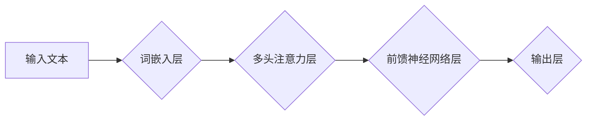

                 

## AI系统底层设计：LLM内核的关键考量

> 关键词：大型语言模型 (LLM)、Transformer、深度学习、自然语言处理 (NLP)、模型架构、参数量、训练数据、推理效率、可解释性

### 1. 背景介绍

近年来，大型语言模型 (LLM) 在自然语言处理 (NLP) 领域取得了令人瞩目的成就，从文本生成、翻译到问答和代码编写，LLM 展现出强大的能力。这些模型的成功离不开其底层架构的创新和海量数据的训练。然而，随着模型规模的不断扩大，LLM 的训练和部署也面临着新的挑战，例如计算资源消耗、模型复杂度和可解释性问题。

本篇文章将深入探讨 LLM 内核的设计关键考量，从模型架构、训练数据、推理效率到可解释性等方面进行分析，并结合实际案例和代码实例，帮助读者理解 LLM 的底层原理和设计挑战。

### 2. 核心概念与联系

LLM 的核心概念是深度学习，特别是 Transformer 架构。Transformer 是一种基于注意力机制的神经网络架构，能够有效捕捉文本序列中的长距离依赖关系。

**Mermaid 流程图：LLM 架构**



**核心概念原理和架构：**

* **词嵌入层:** 将文本中的每个单词映射到一个低维向量空间，使得具有语义相似性的单词拥有相似的向量表示。
* **多头注意力层:** 允许模型关注文本序列中不同位置的单词，并学习它们之间的关系。多头注意力机制通过多个注意力头并行计算，能够捕捉更丰富的语义信息。
* **前馈神经网络层:** 对每个单词的注意力输出进行进一步的处理，提取更深层的语义特征。
* **输出层:** 将模型的最终输出映射到目标任务所需的格式，例如预测下一个单词、生成文本摘要或进行文本分类。

### 3. 核心算法原理 & 具体操作步骤

#### 3.1  算法原理概述

LLM 的训练基于监督学习，目标是学习一个能够将输入文本映射到正确输出的函数。训练过程通常包括以下步骤：

1. **数据预处理:** 将原始文本数据进行清洗、分词、标记等预处理操作，使其能够被模型理解。
2. **模型训练:** 使用训练数据训练模型，通过反向传播算法不断调整模型参数，使得模型的输出与真实标签之间的误差最小化。
3. **模型评估:** 使用测试数据评估模型的性能，例如计算准确率、召回率和 F1 分数等指标。
4. **模型调优:** 根据评估结果，调整模型超参数，例如学习率、批处理大小和训练 epochs 等，以进一步提高模型性能。

#### 3.2  算法步骤详解

1. **词嵌入:** 将每个单词映射到一个低维向量空间，可以使用预训练的词嵌入模型，例如 Word2Vec 或 GloVe，或者使用自训练的方式学习词嵌入。
2. **多头注意力:** 对文本序列中的每个单词进行注意力计算，学习每个单词与其他单词之间的关系。
3. **前馈神经网络:** 对每个单词的注意力输出进行进一步的处理，提取更深层的语义特征。
4. **输出层:** 将模型的最终输出映射到目标任务所需的格式，例如预测下一个单词、生成文本摘要或进行文本分类。

#### 3.3  算法优缺点

**优点:**

* 能够捕捉文本序列中的长距离依赖关系。
* 性能优于传统的 RNN 模型。
* 可并行训练，训练速度更快。

**缺点:**

* 模型规模庞大，训练和部署成本高。
* 训练数据量大，需要大量计算资源。
* 可解释性较差，难以理解模型的决策过程。

#### 3.4  算法应用领域

LLM 在以下领域具有广泛的应用：

* **自然语言理解:** 文本分类、情感分析、问答系统、文本摘要等。
* **自然语言生成:** 文本生成、机器翻译、对话系统、代码生成等。
* **其他领域:** 搜索引擎优化、广告推荐、医疗诊断等。

### 4. 数学模型和公式 & 详细讲解 & 举例说明

#### 4.1  数学模型构建

LLM 的核心数学模型是 Transformer 架构，其主要组件包括词嵌入层、多头注意力层和前馈神经网络层。

#### 4.2  公式推导过程

**词嵌入:**

$$
\mathbf{w}_i = \mathbf{E}(\mathbf{x}_i)
$$

其中，$\mathbf{w}_i$ 是单词 $\mathbf{x}_i$ 的词嵌入向量，$\mathbf{E}$ 是词嵌入矩阵。

**多头注意力:**

$$
\mathbf{Attention}(\mathbf{Q}, \mathbf{K}, \mathbf{V}) = \text{softmax}\left(\frac{\mathbf{Q}\mathbf{K}^T}{\sqrt{d_k}}\right)\mathbf{V}
$$

其中，$\mathbf{Q}$, $\mathbf{K}$ 和 $\mathbf{V}$ 分别是查询矩阵、键矩阵和值矩阵，$d_k$ 是键向量的维度。

**前馈神经网络:**

$$
\mathbf{F}(\mathbf{x}) = \text{ReLU}(\mathbf{W}_1\mathbf{x} + \mathbf{b}_1)
$$

$$
\mathbf{F}(\mathbf{x}) = \mathbf{W}_2\mathbf{F}(\mathbf{x}) + \mathbf{b}_2
$$

其中，$\mathbf{F}(\mathbf{x})$ 是前馈神经网络的输出，$\mathbf{W}_1$, $\mathbf{W}_2$, $\mathbf{b}_1$ 和 $\mathbf{b}_2$ 分别是权重矩阵和偏置向量。

#### 4.3  案例分析与讲解

例如，在文本生成任务中，LLM 可以根据输入文本序列预测下一个单词。模型会将输入文本序列映射到词嵌入向量空间，然后通过多头注意力层学习每个单词与其他单词之间的关系。最后，通过前馈神经网络层和输出层，模型会预测下一个单词的概率分布。

### 5. 项目实践：代码实例和详细解释说明

#### 5.1  开发环境搭建

LLM 的开发环境通常需要包含以下软件：

* Python 编程语言
* TensorFlow 或 PyTorch 深度学习框架
* CUDA 和 cuDNN GPU 加速库

#### 5.2  源代码详细实现

以下是一个使用 TensorFlow 实现简单 LLM 的代码示例：

```python
import tensorflow as tf

# 定义词嵌入层
embedding_layer = tf.keras.layers.Embedding(input_dim=vocab_size, output_dim=embedding_dim)

# 定义多头注意力层
attention_layer = tf.keras.layers.MultiHeadAttention(num_heads=8, key_dim=embedding_dim)

# 定义前馈神经网络层
ffn_layer = tf.keras.layers.Dense(units=embedding_dim, activation='relu')

# 定义模型
model = tf.keras.Sequential([
    embedding_layer,
    attention_layer,
    ffn_layer,
    tf.keras.layers.Dense(units=vocab_size, activation='softmax')
])

# 编译模型
model.compile(optimizer='adam', loss='sparse_categorical_crossentropy', metrics=['accuracy'])

# 训练模型
model.fit(x_train, y_train, epochs=10)
```

#### 5.3  代码解读与分析

* 词嵌入层将每个单词映射到一个低维向量空间。
* 多头注意力层学习每个单词与其他单词之间的关系。
* 前馈神经网络层提取更深层的语义特征。
* 输出层将模型的最终输出映射到目标任务所需的格式。

#### 5.4  运行结果展示

训练完成后，可以使用测试数据评估模型的性能，例如计算准确率、召回率和 F1 分数等指标。

### 6. 实际应用场景

LLM 在各个领域都有着广泛的应用场景，例如：

* **聊天机器人:** 通过 LLMs，可以构建更智能、更自然的聊天机器人，能够理解用户意图并提供更精准的回复。
* **文本摘要:** LLMs 可以自动生成文本摘要，帮助用户快速了解文章内容。
* **机器翻译:** LLMs 可以实现高质量的机器翻译，突破语言障碍。
* **代码生成:** LLMs 可以根据自然语言描述生成代码，提高开发效率。

### 6.4  未来应用展望

随着 LLMs 的不断发展，其应用场景将更加广泛，例如：

* **个性化教育:** 根据学生的学习情况，提供个性化的学习内容和辅导。
* **医疗诊断:** 辅助医生进行疾病诊断，提高诊断准确率。
* **科学研究:** 自动生成研究论文，加速科学发现。

### 7. 工具和资源推荐

#### 7.1  学习资源推荐

* **书籍:**
    * 《深度学习》 by Ian Goodfellow, Yoshua Bengio, and Aaron Courville
    * 《自然语言处理》 by Dan Jurafsky and James H. Martin
* **在线课程:**
    * Coursera: Deep Learning Specialization
    * Stanford CS224N: Natural Language Processing with Deep Learning

#### 7.2  开发工具推荐

* **TensorFlow:** https://www.tensorflow.org/
* **PyTorch:** https://pytorch.org/
* **Hugging Face Transformers:** https://huggingface.co/transformers/

#### 7.3  相关论文推荐

* **Attention Is All You Need:** https://arxiv.org/abs/1706.03762
* **BERT: Pre-training of Deep Bidirectional Transformers for Language Understanding:** https://arxiv.org/abs/1810.04805

### 8. 总结：未来发展趋势与挑战

#### 8.1  研究成果总结

LLM 在 NLP 领域取得了显著的进展，其强大的能力已经应用于多个领域。

#### 8.2  未来发展趋势

* **模型规模的进一步扩大:** 随着计算资源的不断提升，LLM 的模型规模将继续扩大，从而提升模型性能。
* **训练数据的多样化:** 训练数据的多样化将有助于 LLMs 更好地理解和生成不同类型的文本。
* **模型可解释性的提升:** 研究人员将致力于开发更可解释的 LLMs，以便更好地理解模型的决策过程。

#### 8.3  面临的挑战

* **计算资源消耗:** 训练大型 LLMs 需要大量的计算资源，这对于资源有限的机构或个人来说是一个挑战。
* **模型复杂度:** LLMs 的复杂性使得其训练和部署更加困难。
* **数据安全和隐私:** LLMs 的训练数据可能包含敏感信息，需要采取措施保护数据安全和隐私。

#### 8.4  研究展望

未来，LLM 研究将继续朝着更强大、更智能、更安全的方向发展。

### 9. 附录：常见问题与解答

* **什么是 LLMs?**

LLMs 是指大型语言模型，是一种能够理解和生成人类语言的深度学习模型。

* **LLMs 的训练数据是什么?**

LLMs 的训练数据通常是大量的文本数据，例如书籍、文章、网站内容等。

* **LLMs 的应用场景有哪些?**

LLMs 的应用场景非常广泛，例如聊天机器人、文本摘要、机器翻译、代码生成等。


作者：禅与计算机程序设计艺术 / Zen and the Art of Computer Programming 
<end_of_turn>

