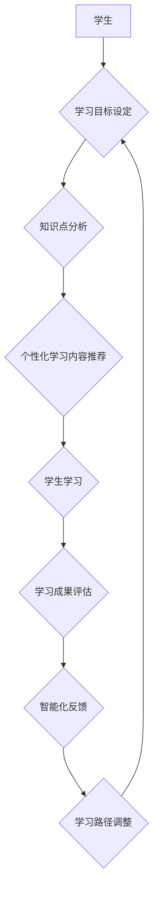

                 

## LLM与语言学习：AI语言教师

> 关键词：LLM, 大语言模型, 语言学习, AI 教师, 自然语言处理, 知识表示, 迁移学习, 教育科技

## 1. 背景介绍

语言是人类最重要的沟通工具，也是理解世界和表达思想的关键。随着人工智能技术的飞速发展，大语言模型（LLM）的出现为语言学习带来了新的可能性。LLM 拥有强大的文本生成、理解和翻译能力，能够模拟人类的语言表达模式，为语言学习提供个性化、智能化的学习体验。

传统的语言学习方法主要依赖于教材、老师和练习，学习过程相对被动。而LLM 作为AI语言教师，能够根据学生的学习进度和需求，提供个性化的学习内容和反馈，提高学习效率和兴趣。

## 2. 核心概念与联系

### 2.1  大语言模型 (LLM)

大语言模型 (LLM) 是一种基于深度学习的强大人工智能模型，能够理解和生成人类语言。它们通过训练海量文本数据，学习语言的语法、语义和上下文关系，从而具备强大的文本处理能力。

常见的LLM架构包括Transformer、GPT、BERT等。这些模型通过自注意力机制和多层神经网络结构，能够捕捉文本中的长距离依赖关系，实现更精准的语言理解和生成。

### 2.2  语言学习

语言学习是指学习一种新的语言，包括语音、词汇、语法和文化等方面的知识。传统的语言学习方法主要包括：

* **课堂学习:** 在学校或培训机构接受语言老师的指导，学习语言知识和技能。
* **自学:** 通过教材、字典、网络资源等方式，独立学习语言知识。
* **沉浸式学习:** 在使用目标语言的环境中生活和学习，通过实践提高语言能力。

### 2.3  AI语言教师

AI语言教师是指利用人工智能技术，特别是LLM，为语言学习提供个性化、智能化的学习体验的系统。

AI语言教师可以提供以下功能：

* **个性化学习路径:** 根据学生的学习进度和需求，定制个性化的学习内容和练习。
* **智能化反馈:** 对学生的学习成果进行评估，并提供针对性的反馈和建议。
* **互动式学习:** 通过对话、游戏等方式，提高学生的学习兴趣和参与度。
* **24/7 可用性:** 学生可以随时随地进行语言学习。

**Mermaid 流程图**



## 3. 核心算法原理 & 具体操作步骤

### 3.1  算法原理概述

LLM 作为AI语言教师的核心算法，主要基于深度学习和自然语言处理技术。

* **深度学习:** 通过多层神经网络结构，学习语言的复杂模式和关系。
* **自然语言处理 (NLP):** 处理和理解人类语言，包括文本分类、情感分析、机器翻译等任务。

LLM 的训练过程主要包括以下步骤：

1. **数据预处理:** 收集和清洗海量文本数据，并将其转换为模型可理解的格式。
2. **模型训练:** 使用深度学习算法，训练 LLM 模型，使其能够理解和生成人类语言。
3. **模型评估:** 使用测试数据评估模型的性能，并进行调优。
4. **模型部署:** 将训练好的模型部署到实际应用场景中。

### 3.2  算法步骤详解

1. **数据预处理:**

* **文本清洗:** 去除文本中的停用词、标点符号、HTML 标签等无关信息。
* **文本分词:** 将文本分割成单词或子词。
* **词向量化:** 将单词或子词映射到向量空间，以便模型进行处理。

2. **模型训练:**

* **选择模型架构:** 根据任务需求选择合适的 LLM 架构，例如 Transformer、GPT、BERT 等。
* **设置超参数:** 调整模型训练的超参数，例如学习率、批处理大小、训练 epochs 等。
* **训练模型:** 使用训练数据训练模型，并通过反向传播算法更新模型参数。

3. **模型评估:**

* **选择评估指标:** 根据任务需求选择合适的评估指标，例如准确率、召回率、F1 值等。
* **使用测试数据评估模型性能:** 将训练好的模型应用于测试数据，并计算模型的评估指标。

4. **模型部署:**

* **选择部署平台:** 根据应用场景选择合适的部署平台，例如云服务器、边缘设备等。
* **部署模型:** 将训练好的模型部署到目标平台，并提供 API 接口供用户调用。

### 3.3  算法优缺点

**优点:**

* **强大的文本处理能力:** LLM 能够理解和生成复杂的文本，并完成各种自然语言处理任务。
* **个性化学习体验:** LLM 可以根据学生的学习进度和需求，提供个性化的学习内容和反馈。
* **提高学习效率:** LLM 可以帮助学生更快地掌握语言知识和技能。

**缺点:**

* **训练成本高:** LLM 的训练需要大量的计算资源和时间。
* **数据依赖性强:** LLM 的性能取决于训练数据的质量和数量。
* **缺乏真实世界理解:** LLM 虽然能够处理语言，但缺乏对真实世界的理解和常识。

### 3.4  算法应用领域

LLM 在语言学习领域具有广泛的应用前景，例如：

* **智能化口语练习:** 通过与 LLM 进行对话练习，提高学生的口语表达能力。
* **个性化写作指导:** LLM 可以根据学生的写作水平和需求，提供写作指导和反馈。
* **语言翻译:** LLM 可以帮助学生理解和翻译外语文本。
* **虚拟语言伙伴:** LLM 可以扮演虚拟语言伙伴，与学生进行互动式语言学习。

## 4. 数学模型和公式 & 详细讲解 & 举例说明

### 4.1  数学模型构建

LLM 的数学模型通常基于 Transformer 架构，其核心是自注意力机制。

自注意力机制能够捕捉文本中的长距离依赖关系，提高模型的理解能力。

**公式:**

$$
Attention(Q, K, V) = \frac{exp(Q \cdot K^T / \sqrt{d_k})}{exp(Q \cdot K^T / \sqrt{d_k})} \cdot V
$$

其中:

* $Q$: 查询矩阵
* $K$: 键矩阵
* $V$: 值矩阵
* $d_k$: 键向量的维度

### 4.2  公式推导过程

自注意力机制的公式通过计算查询向量 $Q$ 与键向量 $K$ 的点积，并将其归一化，得到注意力权重。

注意力权重表示每个键向量对查询向量的重要性。

然后，将注意力权重与值向量 $V$ 进行加权求和，得到最终的输出。

### 4.3  案例分析与讲解

例如，在翻译句子 "The cat sat on the mat" 时，自注意力机制可以帮助模型捕捉 "cat" 和 "sat" 之间的依赖关系，理解 "cat" 是 "sat" 的主语。

## 5. 项目实践：代码实例和详细解释说明

### 5.1  开发环境搭建

* **操作系统:** Ubuntu 20.04
* **编程语言:** Python 3.8
* **深度学习框架:** TensorFlow 2.x
* **其他依赖:** numpy, pandas, matplotlib 等

### 5.2  源代码详细实现

```python
import tensorflow as tf

# 定义 Transformer 模型
class Transformer(tf.keras.Model):
    def __init__(self, vocab_size, embedding_dim, num_heads, num_layers):
        super(Transformer, self).__init__()
        self.embedding = tf.keras.layers.Embedding(vocab_size, embedding_dim)
        self.transformer_layers = [
            tf.keras.layers.MultiHeadAttention(num_heads=num_heads, key_dim=embedding_dim)
            for _ in range(num_layers)
        ]
        self.dense = tf.keras.layers.Dense(vocab_size)

    def call(self, inputs):
        # Embedding
        x = self.embedding(inputs)
        # Transformer Layers
        for layer in self.transformer_layers:
            x = layer(x, x, x)
        # Output
        x = self.dense(x)
        return x

# 实例化模型
model = Transformer(vocab_size=10000, embedding_dim=128, num_heads=8, num_layers=6)

# 训练模型
# ...

```

### 5.3  代码解读与分析

* **Embedding 层:** 将单词映射到向量空间。
* **Transformer 层:** 使用多头注意力机制和前馈神经网络，捕捉文本中的长距离依赖关系。
* **Dense 层:** 将模型输出映射到词汇表大小。

### 5.4  运行结果展示

训练好的模型可以用于各种语言学习任务，例如文本生成、翻译、问答等。

## 6. 实际应用场景

### 6.1  个性化学习路径

AI语言教师可以根据学生的学习进度和需求，定制个性化的学习内容和练习。例如，如果学生在语法方面有困难，AI语言教师可以提供更多的语法练习和讲解。

### 6.2  智能化反馈

AI语言教师可以对学生的学习成果进行评估，并提供针对性的反馈和建议。例如，如果学生在口语练习中犯了错误，AI语言教师可以指出错误并提供纠正建议。

### 6.3  互动式学习

AI语言教师可以通过对话、游戏等方式，提高学生的学习兴趣和参与度。例如，AI语言教师可以与学生进行角色扮演游戏，帮助学生练习口语表达。

### 6.4  未来应用展望

AI语言教师在未来将发挥更重要的作用，例如：

* **跨语言学习:** AI语言教师可以帮助学生学习多种语言。
* **沉浸式语言学习:** AI语言教师可以创建沉浸式的语言学习环境，帮助学生更快地掌握语言。
* **个性化语言教育:** AI语言教师可以根据学生的学习风格和需求，提供个性化的语言教育方案。

## 7. 工具和资源推荐

### 7.1  学习资源推荐

* **斯坦福大学自然语言处理课程:** https://web.stanford.edu/class/cs224n/
* **DeepLearning.AI 自然语言处理课程:** https://www.deeplearning.ai/courses/natural-language-processing-specialization/
* **Hugging Face Transformers 库:** https://huggingface.co/docs/transformers/index

### 7.2  开发工具推荐

* **TensorFlow:** https://www.tensorflow.org/
* **PyTorch:** https://pytorch.org/
* **Jupyter Notebook:** https://jupyter.org/

### 7.3  相关论文推荐

* **Attention Is All You Need:** https://arxiv.org/abs/1706.03762
* **BERT: Pre-training of Deep Bidirectional Transformers for Language Understanding:** https://arxiv.org/abs/1810.04805

## 8. 总结：未来发展趋势与挑战

### 8.1  研究成果总结

LLM 在语言学习领域取得了显著的成果，例如：

* **提高学习效率:** LLM 可以帮助学生更快地掌握语言知识和技能。
* **个性化学习体验:** LLM 可以根据学生的学习进度和需求，提供个性化的学习内容和反馈。
* **互动式学习:** LLM 可以通过对话、游戏等方式，提高学生的学习兴趣和参与度。

### 8.2  未来发展趋势

LLM 在语言学习领域未来的发展趋势包括：

* **更强大的模型:** 研究人员将继续开发更强大的 LLMs，使其能够更好地理解和生成人类语言。
* **更个性化的学习体验:** LLM 将更加个性化，能够根据学生的学习风格和需求，提供定制化的学习方案。
* **更沉浸式的学习环境:** LLM 将帮助创建更沉浸式的语言学习环境，例如虚拟现实和增强现实。

### 8.3  面临的挑战

LLM 在语言学习领域也面临一些挑战：

* **数据偏见:** LLM 的训练数据可能存在偏见，导致模型输出存在偏差。
* **可解释性:** LLM 的决策过程难以解释，这使得很难评估模型的可靠性和安全性。
* **伦理问题:** LLM 的应用可能引发一些伦理问题，例如数据隐私和算法公平性。

### 8.4  研究展望

未来研究将重点关注以下方面：

* **解决数据偏见问题:** 开发新的数据处理方法，减少模型输出的偏差。
* **提高模型的可解释性:** 研究新的模型架构和解释方法，使模型的决策过程更加透明。
* **探讨 LLMs 的伦理问题:** 制定相应的伦理规范和政策，确保 LLMs 的安全和负责任地应用。

## 9. 附录：常见问题与解答

### 9.1  LLM 是否能够完全替代人类教师？

LLM 可以提供个性化、智能化的学习体验，但它无法完全替代人类教师。人类教师能够提供情感支持、个性化指导和批判性思维训练，这些方面是 LLMs 目前无法替代的。

### 9.2  LLM 的训练数据来源？

LLM 的训练数据通常来自公开的文本数据集，例如维基百科、书籍、新闻文章等。

### 9.3  如何评估 LLM 的性能？

LLM 的性能可以通过各种指标进行评估，例如准确率、召回率、F1 值、BLEU 分数等。

### 9.4  LLM 的应用场景有哪些？

LLM 在语言学习领域之外，还有许多其他应用场景，例如文本生成、机器翻译、问答系统、聊天机器人等。

### 9.5  如何学习使用 LLM？

可以通过学习深度学习和自然语言处理相关的课程，以及阅读相关的论文和书籍，来学习使用 LLM。

作者：禅与计算机程序设计艺术 / Zen and the Art of Computer Programming


<end_of_turn>

