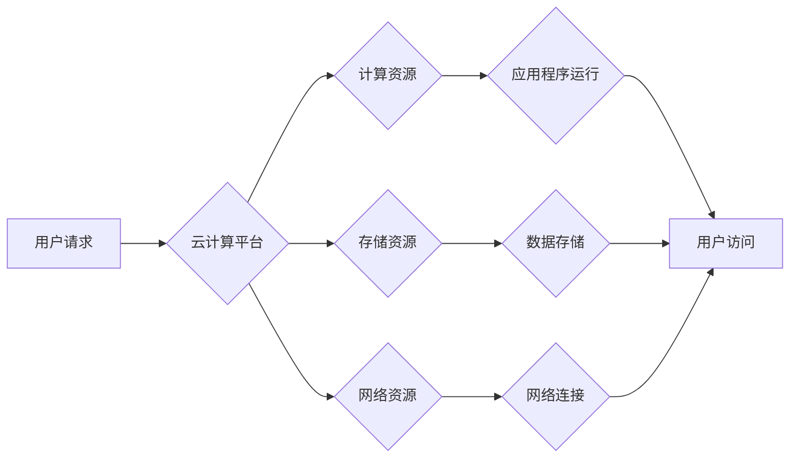

                 

## 云计算在企业数字化转型中的作用：灵活性与可扩展性

> 关键词：云计算、数字化转型、企业架构、弹性伸缩、成本优化、敏捷开发、数据管理、安全保障

## 1. 背景介绍

在当今数字化时代，企业面临着前所未有的挑战和机遇。传统企业架构难以适应快速变化的市场需求和技术发展，而云计算作为一种新型的计算模式，为企业数字化转型提供了强大的支撑。

云计算是指利用互联网将计算资源（如服务器、存储、网络等）提供给用户，用户可以按需使用这些资源，无需购买和维护昂贵的硬件设备。云计算的优势在于其灵活性、可扩展性和成本效益，这些特性使得它成为企业数字化转型的理想选择。

## 2. 核心概念与联系

### 2.1 云计算模型

云计算模型主要分为以下三种类型：

* **Infrastructure as a Service (IaaS):** 提供基础设施资源，如虚拟机、存储、网络等，用户可以自行部署和管理应用程序。
* **Platform as a Service (PaaS):** 提供开发和运行应用程序的平台，用户可以专注于应用程序开发，而无需关心基础设施管理。
* **Software as a Service (SaaS):** 提供完整的软件应用程序，用户可以通过网络访问和使用应用程序，无需安装和维护软件。

### 2.2 云计算架构

云计算架构通常由以下几个关键组件组成：

* **计算资源:** 包括虚拟机、容器等，提供应用程序运行的环境。
* **存储资源:** 包括对象存储、块存储、文件存储等，提供数据存储和管理。
* **网络资源:** 包括虚拟私有云、负载均衡器等，提供网络连接和安全保障。
* **管理平台:** 用于管理云计算资源，包括监控、配置、安全等功能。

**Mermaid 流程图**



## 3. 核心算法原理 & 具体操作步骤

### 3.1 算法原理概述

云计算中常用的算法包括虚拟化技术、负载均衡算法、数据存储算法等。这些算法共同保证了云计算平台的稳定性、可靠性和高效性。

* **虚拟化技术:** 将物理资源虚拟化成多个逻辑资源，每个逻辑资源可以独立运行不同的应用程序，提高资源利用率。
* **负载均衡算法:** 将用户请求分配到不同的服务器，避免单个服务器过载，提高系统性能和可用性。
* **数据存储算法:** 优化数据存储和检索效率，保证数据安全和完整性。

### 3.2 算法步骤详解

以负载均衡算法为例，其具体步骤如下：

1. **接收用户请求:** 负载均衡器接收来自用户的请求。
2. **选择目标服务器:** 根据负载均衡算法，选择一个合适的服务器来处理请求。常见的负载均衡算法包括轮询算法、加权轮询算法、最小连接数算法等。
3. **转发请求:** 将请求转发到选择的服务器。
4. **返回响应:** 服务器处理请求后，返回响应给用户。

### 3.3 算法优缺点

每个算法都有其优缺点，需要根据实际情况选择合适的算法。

* **轮询算法:** 简单易实现，但可能导致服务器负载不均衡。
* **加权轮询算法:** 根据服务器性能分配请求，可以提高负载均衡效果，但需要收集服务器性能数据。
* **最小连接数算法:** 选择连接数最少的服务器，可以提高服务器性能，但可能导致某些服务器过载。

### 3.4 算法应用领域

云计算中的算法广泛应用于各个领域，例如：

* **网站和应用程序部署:** 负载均衡算法可以提高网站和应用程序的可用性和性能。
* **数据存储和检索:** 数据存储算法可以优化数据存储和检索效率。
* **虚拟化和容器化:** 虚拟化技术和容器化技术可以提高资源利用率和应用程序部署效率。

## 4. 数学模型和公式 & 详细讲解 & 举例说明

### 4.1 数学模型构建

云计算中的资源分配和调度可以建模为一个优化问题。目标是最大化资源利用率，同时满足用户需求和服务质量要求。

一个简单的数学模型可以表示为：

$$
\text{最大化} \quad \text{资源利用率} = \frac{\text{实际使用资源}}{\text{总资源}}
$$

其中，实际使用资源是指用户实际使用的计算、存储和网络资源，总资源是指云计算平台拥有的所有资源。

### 4.2 公式推导过程

资源利用率的计算公式可以根据实际情况进行调整。例如，可以考虑不同类型的资源的价值，并赋予不同的权重。

$$
\text{资源利用率} = \sum_{i=1}^{n} w_i \cdot \frac{u_i}{t_i}
$$

其中，$w_i$ 是第 $i$ 种资源的权重，$u_i$ 是用户实际使用的第 $i$ 种资源，$t_i$ 是总的第 $i$ 种资源。

### 4.3 案例分析与讲解

假设一个云计算平台拥有计算资源、存储资源和网络资源，用户需要使用这些资源来运行应用程序。

* 计算资源：100 个虚拟机，用户实际使用 50 个虚拟机。
* 存储资源：1000 TB 存储空间，用户实际使用 200 TB 存储空间。
* 网络资源：10 Gbps 网络带宽，用户实际使用 5 Gbps 网络带宽。

根据上述数据，可以计算出云计算平台的资源利用率：

$$
\text{资源利用率} = 0.5 \cdot \frac{50}{100} + 0.3 \cdot \frac{200}{1000} + 0.2 \cdot \frac{5}{10} = 0.5 + 0.06 + 0.1 = 0.66
$$

因此，云计算平台的资源利用率为 66%。

## 5. 项目实践：代码实例和详细解释说明

### 5.1 开发环境搭建

云计算平台的开发环境通常包括以下组件：

* **虚拟机:** 用于运行应用程序和服务。
* **容器:** 用于打包和部署应用程序。
* **数据库:** 用于存储应用程序数据。
* **网络工具:** 用于管理网络连接和安全。

### 5.2 源代码详细实现

以下是一个简单的云计算平台代码示例，使用 Python 语言实现一个简单的负载均衡器：

```python
import threading

class LoadBalancer:
    def __init__(self, servers):
        self.servers = servers
        self.current_server_index = 0

    def get_server(self):
        server = self.servers[self.current_server_index]
        self.current_server_index = (self.current_server_index + 1) % len(self.servers)
        return server

# 定义服务器列表
servers = ["server1", "server2", "server3"]

# 创建负载均衡器
load_balancer = LoadBalancer(servers)

# 模拟用户请求
def handle_request(server):
    print(f"请求转发到服务器: {server}")

# 处理多个请求
for i in range(10):
    server = load_balancer.get_server()
    threading.Thread(target=handle_request, args=(server,)).start()
```

### 5.3 代码解读与分析

该代码实现了一个简单的轮询负载均衡器。

* `LoadBalancer` 类负责管理服务器列表和轮询算法。
* `get_server()` 方法返回下一个待处理的服务器。
* `handle_request()` 方法模拟用户请求，将请求转发到指定的服务器。

### 5.4 运行结果展示

运行该代码后，将看到 10 个线程并发执行，每个线程模拟一个用户请求，请求将轮流转发到三个服务器。

## 6. 实际应用场景

### 6.1 企业数字化转型

云计算为企业数字化转型提供了强大的支撑，帮助企业实现业务创新、提升运营效率和降低成本。

* **业务创新:** 云计算平台可以提供灵活的资源和服务，帮助企业快速开发和部署新产品和服务。
* **运营效率提升:** 云计算可以帮助企业自动化流程、优化资源利用率和提高工作效率。
* **成本降低:** 云计算可以帮助企业降低硬件采购、维护和管理成本。

### 6.2 数据管理与分析

云计算平台可以提供大数据存储、处理和分析能力，帮助企业更好地管理和利用数据资源。

* **大数据存储:** 云计算平台可以提供海量数据存储空间，满足企业大数据存储需求。
* **数据分析:** 云计算平台可以提供各种数据分析工具和服务，帮助企业挖掘数据价值。
* **数据安全:** 云计算平台可以提供数据加密、访问控制和备份等安全措施，保障数据安全。

### 6.3 敏捷开发与部署

云计算平台可以支持敏捷开发和部署模式，帮助企业更快地响应市场需求。

* **快速部署:** 云计算平台可以快速部署应用程序，缩短开发周期。
* **持续集成和持续交付:** 云计算平台可以支持持续集成和持续交付流程，提高软件开发效率。
* **环境管理:** 云计算平台可以提供多种环境管理工具，方便开发和测试。

### 6.4 未来应用展望

云计算技术将继续发展，并在未来应用于更多领域。

* **人工智能:** 云计算平台可以提供强大的计算资源和数据存储能力，支持人工智能算法的训练和应用。
* **物联网:** 云计算平台可以连接和管理海量物联网设备，提供数据分析和决策支持。
* **边缘计算:** 云计算平台可以扩展到边缘网络，提供更低延迟和更高可靠性的服务。

## 7. 工具和资源推荐

### 7.1 学习资源推荐

* **书籍:**
    * 《云计算：原理、架构和应用》
    * 《云计算：实践指南》
* **在线课程:**
    * Coursera: 云计算基础
    * edX: 云计算架构
* **博客和论坛:**
    * 云计算社区
    * AWS博客

### 7.2 开发工具推荐

* **云平台:**
    * AWS
    * Azure
    * Google Cloud Platform
* **开发工具:**
    * Docker
    * Kubernetes
    * Terraform

### 7.3 相关论文推荐

* **云计算架构和设计:**
    * "A Survey of Cloud Computing Architectures"
* **云计算安全:**
    * "Security Challenges in Cloud Computing"
* **云计算性能优化:**
    * "Performance Optimization Techniques for Cloud Computing"

## 8. 总结：未来发展趋势与挑战

### 8.1 研究成果总结

云计算技术已经取得了长足的进步，为企业数字化转型提供了强大的支撑。

* **灵活性与可扩展性:** 云计算平台可以根据需求灵活调整资源配置，满足企业不断变化的业务需求。
* **成本效益:** 云计算可以帮助企业降低硬件采购、维护和管理成本。
* **安全保障:** 云计算平台提供多种安全措施，保障数据安全和系统稳定性。

### 8.2 未来发展趋势

云计算技术将继续发展，并朝着以下方向发展：

* **Serverless 计算:** 无服务器计算模式，用户无需管理服务器，只需关注应用程序代码。
* **边缘计算:** 将计算能力扩展到边缘网络，提供更低延迟和更高可靠性的服务。
* **人工智能:** 云计算平台将更加深入地融入人工智能领域，提供更智能的应用和服务。

### 8.3 面临的挑战

云计算技术也面临着一些挑战：

* **数据安全:** 云计算平台需要提供更完善的数据安全措施，保障用户数据安全。
* **隐私保护:** 云计算平台需要遵守数据隐私法规，保护用户隐私信息。
* **网络安全:** 云计算平台需要加强网络安全防护，防止网络攻击和数据泄露。

### 8.4 研究展望

未来，云计算技术将继续发展，并与其他新兴技术融合，为企业和个人带来更多创新和价值。

## 9. 附录：常见问题与解答

### 9.1 云计算与传统IT架构的区别是什么？

云计算是一种基于互联网的计算模式，用户可以按需使用计算资源，而无需购买和维护硬件设备。传统IT架构则需要企业自行购买和维护硬件设备，并负责软件安装、配置和管理。

### 9.2 云计算有哪些主要的部署模式？

云计算的主要部署模式包括：

* **公有云:** 云服务提供商为多个用户提供共享的云计算资源。
* **私有云:** 企业为自身使用搭建的独立云计算环境。
* **混合云:** 将公有云和私有云结合在一起，根据不同的业务需求选择不同的云环境。

### 9.3 云计算有哪些主要的安全性问题？

云计算安全性问题主要包括：

* **数据泄露:** 云计算平台需要加强数据加密和访问控制措施，防止数据泄露。
* **网络攻击:** 云计算平台需要加强网络安全防护，防止网络攻击和数据篡改。
* **账户安全:** 云计算平台需要加强账户安全管理，防止账户被盗用。


作者：禅与计算机程序设计艺术 / Zen and the Art of Computer Programming 
<end_of_turn>

