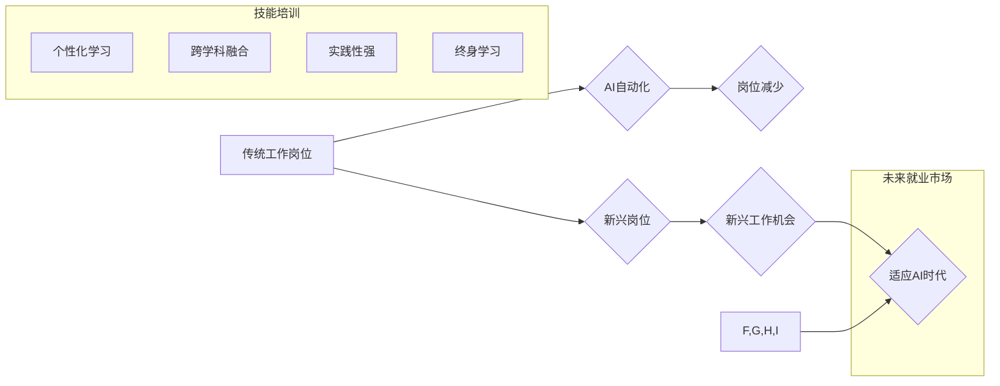

                 

## 人类计算：AI时代的未来就业市场与技能培训发展

> 关键词：人工智能、未来就业、技能培训、人类计算、自动化、机器学习、数据分析、编程、跨学科合作

## 1. 背景介绍

人工智能（AI）正在以惊人的速度发展，其影响力正在深刻地改变着我们生活的方方面面。从自动驾驶汽车到个性化医疗，从智能家居到金融风控，AI技术的应用场景日益广泛。然而，这种快速发展也引发了人们对未来就业市场和技能培训的担忧。

一方面，AI技术的自动化能力将取代一些传统工作岗位，例如数据录入、客服、物流配送等。另一方面，AI技术也创造了大量新的工作机会，例如AI工程师、数据科学家、算法设计师、AI伦理专家等。

因此，在AI时代，我们需要重新思考未来的就业市场和技能培训，以适应不断变化的社会需求。

## 2. 核心概念与联系

**2.1 人类计算**

人类计算是指人类利用自身的认知能力和创造力，与计算机协同工作，共同完成复杂的任务。它强调人机协作的优势，将人类的智慧和情感与计算机的计算能力相结合，以实现更高效、更智能的解决方案。

**2.2 AI时代就业市场变化**

AI技术的普及将导致就业市场发生深刻变化：

* **自动化替代:** AI将自动化许多重复性、规则性工作，例如数据录入、客服、物流配送等，导致相关岗位减少。
* **新兴岗位涌现:** AI技术的发展将催生大量新兴岗位，例如AI工程师、数据科学家、算法设计师、AI伦理专家等，需要具备相关专业知识和技能。
* **技能需求升级:** 传统的技能将不再足够，需要具备数据分析、编程、机器学习等新兴技能，以及跨学科合作、批判性思维、解决问题的能力等。

**2.3 技能培训发展趋势**

在AI时代，技能培训需要适应新的就业市场需求，并注重培养适应未来发展趋势的人才：

* **个性化学习:** 根据个人的兴趣、能力和职业目标，提供个性化的学习路径和内容。
* **跨学科融合:** 融合不同学科的知识和技能，培养具备跨学科思维和解决问题的能力。
* **实践性强:** 注重实践操作和项目经验，培养学生的动手能力和解决实际问题的能力。
* **终身学习:** 鼓励终身学习，不断更新知识和技能，适应不断变化的社会需求。

**2.4 Mermaid 流程图**



## 3. 核心算法原理 & 具体操作步骤

**3.1 算法原理概述**

在AI时代，许多核心算法在推动着技术发展和应用创新。例如：

* **机器学习:** 通过算法训练数据，使机器能够从数据中学习规律，并进行预测或分类。
* **深度学习:** 一种更高级的机器学习方法，利用多层神经网络模拟人类大脑的学习过程，能够处理更复杂的数据和任务。
* **自然语言处理:** 使计算机能够理解和处理人类语言，例如文本分析、机器翻译、语音识别等。
* **计算机视觉:** 使计算机能够“看”图像和视频，例如图像识别、物体检测、场景理解等。

**3.2 算法步骤详解**

以机器学习为例，其基本步骤包括：

1. **数据收集:** 收集大量相关数据，作为算法的训练素材。
2. **数据预处理:** 对数据进行清洗、转换、特征提取等处理，使其适合算法训练。
3. **模型选择:** 根据任务需求选择合适的机器学习算法模型。
4. **模型训练:** 利用训练数据，调整算法模型的参数，使其能够学习数据中的规律。
5. **模型评估:** 使用测试数据评估模型的性能，例如准确率、召回率、F1-score等。
6. **模型部署:** 将训练好的模型部署到实际应用场景中，用于预测或分类。

**3.3 算法优缺点**

每个算法都有其优缺点，需要根据具体应用场景选择合适的算法。例如：

* **机器学习:** 优点是能够自动学习数据规律，无需人工编程；缺点是需要大量数据进行训练，且对数据质量要求较高。
* **深度学习:** 优点是能够处理更复杂的数据和任务，效果更优；缺点是训练时间更长，对计算资源要求更高。

**3.4 算法应用领域**

AI算法广泛应用于各个领域，例如：

* **医疗保健:** 疾病诊断、药物研发、个性化治疗等。
* **金融服务:** 风险评估、欺诈检测、投资决策等。
* **制造业:** 自动化生产、质量控制、 predictive maintenance等。
* **零售业:** 商品推荐、个性化营销、库存管理等。

## 4. 数学模型和公式 & 详细讲解 & 举例说明

**4.1 数学模型构建**

在AI算法中，数学模型是描述算法逻辑和关系的核心。例如，线性回归模型可以用以下公式表示：

$$y = mx + c$$

其中：

* $y$ 是预测值
* $x$ 是输入特征
* $m$ 是斜率
* $c$ 是截距

**4.2 公式推导过程**

线性回归模型的系数 $m$ 和 $c$ 可以通过最小二乘法推导出来，其目标是使预测值与实际值之间的误差最小化。

**4.3 案例分析与讲解**

假设我们想要预测房屋价格，输入特征包括房屋面积、房间数量等。我们可以使用线性回归模型，根据历史房屋交易数据训练模型，并利用训练好的模型预测新房子的价格。

## 5. 项目实践：代码实例和详细解释说明

**5.1 开发环境搭建**

可以使用Python语言和相关库（例如scikit-learn）进行AI算法开发。需要安装Python环境和相关库，并配置开发工具。

**5.2 源代码详细实现**

```python
from sklearn.linear_model import LinearRegression
import pandas as pd

# 加载数据
data = pd.read_csv('house_data.csv')

# 划分训练集和测试集
X = data[['area', 'rooms']]
y = data['price']
from sklearn.model_selection import train_test_split
X_train, X_test, y_train, y_test = train_test_split(X, y, test_size=0.2)

# 创建线性回归模型
model = LinearRegression()

# 训练模型
model.fit(X_train, y_train)

# 预测测试集数据
y_pred = model.predict(X_test)

# 评估模型性能
from sklearn.metrics import mean_squared_error
mse = mean_squared_error(y_test, y_pred)
print('Mean Squared Error:', mse)
```

**5.3 代码解读与分析**

这段代码实现了线性回归模型的训练和预测。首先，加载数据并划分训练集和测试集。然后，创建线性回归模型并使用训练集进行训练。最后，使用训练好的模型预测测试集数据，并评估模型性能。

**5.4 运行结果展示**

运行代码后，会输出模型的平均平方误差（MSE）值，用于评估模型的预测精度。

## 6. 实际应用场景

**6.1 医疗保健**

* **疾病诊断:** 利用机器学习算法分析患者的病历、影像数据等，辅助医生进行疾病诊断。
* **药物研发:** 利用深度学习算法分析药物分子结构和生物活性数据，加速药物研发过程。
* **个性化治疗:** 根据患者的基因信息、生活习惯等，制定个性化的治疗方案。

**6.2 金融服务**

* **风险评估:** 利用机器学习算法分析客户的信用记录、交易行为等，评估客户的贷款风险。
* **欺诈检测:** 利用机器学习算法分析交易数据，识别异常交易行为，防止欺诈行为。
* **投资决策:** 利用机器学习算法分析市场数据，预测股票价格走势，辅助投资决策。

**6.3 制造业**

* **自动化生产:** 利用机器人和人工智能技术，实现自动化生产，提高生产效率。
* **质量控制:** 利用计算机视觉技术，对产品进行质量检测，确保产品质量。
* **预测性维护:** 利用机器学习算法分析设备运行数据，预测设备故障，进行及时维护。

**6.4 未来应用展望**

AI技术的应用场景还在不断扩展，未来将应用于更多领域，例如教育、交通、能源、环境保护等。

## 7. 工具和资源推荐

**7.1 学习资源推荐**

* **在线课程:** Coursera、edX、Udacity等平台提供丰富的AI课程。
* **书籍:** 《深度学习》、《机器学习实战》等书籍是学习AI基础知识的经典教材。
* **开源项目:** TensorFlow、PyTorch等开源项目提供了丰富的AI工具和代码示例。

**7.2 开发工具推荐**

* **Python:** 作为AI开发的主要语言，Python拥有丰富的库和工具，例如NumPy、Pandas、Scikit-learn等。
* **Jupyter Notebook:** 用于编写和运行Python代码的交互式环境，方便进行数据分析和模型开发。
* **云计算平台:** AWS、Azure、GCP等云计算平台提供强大的计算资源和AI服务。

**7.3 相关论文推荐**

* **《ImageNet Classification with Deep Convolutional Neural Networks》:** 介绍了深度学习在图像分类领域的应用。
* **《Attention Is All You Need》:** 介绍了Transformer模型，在自然语言处理领域取得了突破性进展。
* **《Generative Adversarial Networks》:** 介绍了生成对抗网络，能够生成逼真的图像、文本等数据。

## 8. 总结：未来发展趋势与挑战

**8.1 研究成果总结**

近年来，AI技术取得了显著进展，在各个领域都展现出巨大的应用潜力。

**8.2 未来发展趋势**

* **模型更加强大:** AI模型将更加强大，能够处理更复杂的数据和任务。
* **应用更加广泛:** AI技术将应用于更多领域，改变我们的生活方式。
* **伦理问题更加突出:** AI技术的应用也带来了伦理问题，需要加强伦理规范和监管。

**8.3 面临的挑战**

* **数据获取和隐私保护:** AI算法需要大量数据进行训练，如何获取高质量数据并保护用户隐私是一个挑战。
* **算法解释性和可信度:** 许多AI算法是黑箱模型，难以解释其决策过程，如何提高算法的解释性和可信度是一个重要问题。
* **人才培养和技能升级:** AI技术的快速发展需要大量AI人才，如何培养和吸引AI人才是一个关键挑战。

**8.4 研究展望**

未来，AI研究将继续朝着更智能、更安全、更可解释的方向发展。


## 9. 附录：常见问题与解答

**9.1 如何学习AI技术？**

可以学习在线课程、阅读书籍、参与开源项目等方式学习AI技术。

**9.2 AI技术会取代所有工作吗？**

AI技术会改变一些工作岗位，但也会创造新的工作机会。

**9.3 如何应对AI带来的挑战？**

需要加强教育和培训，培养适应AI时代的人才；加强伦理规范和监管，确保AI技术安全可控；鼓励跨学科合作，解决AI带来的社会问题。


作者：禅与计算机程序设计艺术 / Zen and the Art of Computer Programming 
<end_of_turn>

