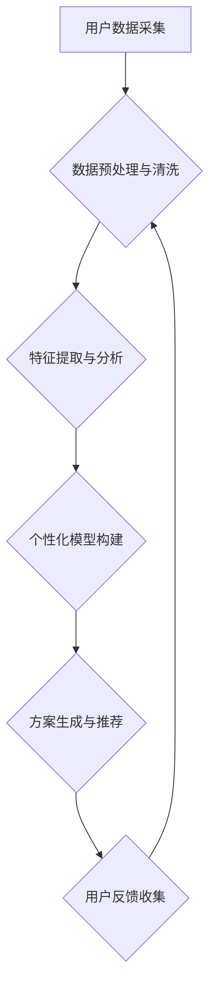

                 

## 体验个性化矩阵：AI定制的生活方案设计

> 关键词：人工智能、个性化定制、生活方案、算法模型、数据分析、机器学习、深度学习、未来趋势

## 1. 背景介绍

当今社会，信息爆炸、生活节奏加快，人们对个性化需求日益强烈。从衣食住行到娱乐休闲，我们都渴望获得更加贴近自身需求的体验。而人工智能（AI）技术的快速发展为满足这一需求提供了强大的工具。

AI算法能够通过对海量数据的分析和学习，识别用户的偏好、习惯和需求，并根据这些信息提供定制化的服务和解决方案。这使得个性化定制不再是遥不可及的梦想，而是可以触手可及的现实。

## 2. 核心概念与联系

**2.1 个性化矩阵的概念**

个性化矩阵是一个基于用户数据构建的动态模型，它包含了用户的各种特征、偏好、行为模式等信息。通过对这些信息的分析和挖掘，我们可以构建出一个独特的“用户画像”，并根据这个画像为用户提供个性化的服务和体验。

**2.2 AI定制生活方案的设计**

AI定制生活方案的设计，本质上是将个性化矩阵与实际生活场景相结合的过程。

通过AI算法的分析和预测，我们可以为用户提供个性化的建议和解决方案，例如：

* **智能家居:** 根据用户的习惯和喜好，自动调节灯光、温度、音乐等环境，打造舒适宜人的居家体验。
* **个性化推荐:** 基于用户的浏览历史、购买记录、兴趣爱好等数据，推荐个性化的商品、服务和内容。
* **健康管理:** 分析用户的生理数据、生活习惯等信息，提供个性化的健康建议和运动方案。
* **教育培训:** 根据用户的学习进度、知识掌握情况等数据，提供个性化的学习计划和辅导。

**2.3  AI定制生活方案设计流程**



## 3. 核心算法原理 & 具体操作步骤

**3.1 算法原理概述**

AI定制生活方案的设计主要依赖于以下核心算法：

* **机器学习:** 通过训练模型，从数据中学习用户特征和模式，并预测用户的未来行为。
* **深度学习:** 利用多层神经网络，对复杂数据进行更深入的分析和理解，提高个性化推荐的准确性。
* **自然语言处理:** 分析用户的文本数据，例如评论、聊天记录等，理解用户的意图和需求。

**3.2 算法步骤详解**

1. **数据采集:** 收集用户的各种数据，例如用户行为数据、兴趣爱好数据、生理数据等。
2. **数据预处理与清洗:** 对收集到的数据进行清洗、转换和格式化，去除噪声和异常值，确保数据质量。
3. **特征提取与分析:** 从原始数据中提取有价值的特征，例如用户年龄、性别、购买历史、浏览记录等，并对这些特征进行分析和挖掘。
4. **个性化模型构建:** 根据提取的特征和用户的行为模式，构建个性化模型，例如协同过滤模型、内容推荐模型、混合推荐模型等。
5. **方案生成与推荐:** 利用构建好的个性化模型，根据用户的当前状态和需求，生成个性化的方案推荐，例如推荐商品、服务、内容等。
6. **用户反馈收集:** 收集用户的反馈信息，例如点击、购买、评价等，并将其反馈到模型中，不断优化模型的准确性和个性化程度。

**3.3 算法优缺点**

**优点:**

* **个性化定制:** 可以根据用户的具体需求和喜好，提供个性化的服务和体验。
* **效率提升:** 自动化推荐和决策，提高用户体验和效率。
* **数据驱动:** 基于数据分析和预测，提供更精准和有效的解决方案。

**缺点:**

* **数据依赖:** 需要大量的数据进行训练和分析，数据质量直接影响算法效果。
* **算法复杂性:** 构建和训练个性化模型需要复杂的算法和技术。
* **隐私安全:** 需要妥善处理用户的个人数据，保障用户隐私安全。

**3.4 算法应用领域**

AI定制生活方案的设计应用领域广泛，包括：

* **电商:** 个性化商品推荐、精准营销
* **教育:** 个性化学习计划、智能辅导
* **医疗:** 个性化健康管理、疾病预测
* **金融:** 个性化理财建议、风险评估
* **娱乐:** 个性化内容推荐、游戏体验

## 4. 数学模型和公式 & 详细讲解 & 举例说明

**4.1 数学模型构建**

个性化矩阵的构建可以基于多种数学模型，例如：

* **协同过滤模型:** 基于用户的行为相似度，推荐用户可能感兴趣的内容。
* **内容推荐模型:** 基于内容的特征和标签，推荐与用户兴趣相符的内容。
* **混合推荐模型:** 结合协同过滤和内容推荐模型，提高推荐的准确性和个性化程度。

**4.2 公式推导过程**

协同过滤模型的推荐算法可以基于以下公式：

$$
r_{u,i} = \frac{\sum_{j \in N(u)} \frac{r_{u,j} * s_{i,j}}{\sum_{k \in N(u)} s_{i,k}}}{\sum_{j \in N(u)} \frac{r_{u,j}}{\sum_{k \in N(u)} s_{i,k}}}
$$

其中：

* $r_{u,i}$: 用户 $u$ 对物品 $i$ 的评分
* $r_{u,j}$: 用户 $u$ 对物品 $j$ 的评分
* $s_{i,j}$: 物品 $i$ 和物品 $j$ 的相似度
* $N(u)$: 用户 $u$ 评分过的物品集合

**4.3 案例分析与讲解**

假设用户 Alice 评分了电影 A 和 B，评分分别为 4 和 5。电影 A 和 C 的相似度为 0.8，电影 B 和 C 的相似度为 0.6。根据上述公式，我们可以计算出 Alice 对电影 C 的评分预测值。

## 5. 项目实践：代码实例和详细解释说明

**5.1 开发环境搭建**

* Python 3.x
* TensorFlow 或 PyTorch
* Jupyter Notebook

**5.2 源代码详细实现**

```python
import numpy as np

# 构建用户-物品评分矩阵
ratings = np.array([
    [0, 4, 5, 0],
    [0, 0, 0, 3],
    [0, 0, 0, 0],
    [0, 0, 0, 0]
])

# 计算物品相似度
# ...

# 根据协同过滤模型预测用户对物品的评分
def predict_rating(user_id, item_id):
    # ...

# 预测用户 Alice 对电影 C 的评分
predicted_rating = predict_rating(0, 2)
print(f"预测用户 Alice 对电影 C 的评分: {predicted_rating}")
```

**5.3 代码解读与分析**

* 代码首先构建了一个用户-物品评分矩阵，其中每个元素代表用户对物品的评分。
* 然后，代码计算了物品之间的相似度，可以使用余弦相似度、皮尔逊相关系数等方法。
* 最后，代码根据协同过滤模型预测用户对物品的评分。

**5.4 运行结果展示**

运行代码后，会输出用户 Alice 对电影 C 的评分预测值。

## 6. 实际应用场景

**6.1 智能家居**

AI定制生活方案可以应用于智能家居，根据用户的习惯和喜好，自动调节灯光、温度、音乐等环境，打造舒适宜人的居家体验。例如，当用户回家时，智能家居系统可以自动打开灯光、调节温度，播放用户喜欢的音乐。

**6.2 个性化推荐**

AI定制生活方案可以应用于个性化推荐，根据用户的浏览历史、购买记录、兴趣爱好等数据，推荐个性化的商品、服务和内容。例如，电商平台可以根据用户的购物记录，推荐用户可能感兴趣的商品。

**6.3 健康管理**

AI定制生活方案可以应用于健康管理，分析用户的生理数据、生活习惯等信息，提供个性化的健康建议和运动方案。例如，健身app可以根据用户的运动数据，制定个性化的运动计划。

**6.4 未来应用展望**

随着人工智能技术的不断发展，AI定制生活方案的应用场景将会更加广泛，例如：

* **个性化教育:** 根据学生的学习进度和知识掌握情况，提供个性化的学习计划和辅导。
* **个性化医疗:** 根据患者的病史和症状，提供个性化的诊断和治疗方案。
* **个性化金融:** 根据用户的财务状况和风险偏好，提供个性化的理财建议。

## 7. 工具和资源推荐

**7.1 学习资源推荐**

* **书籍:**
    * 《深度学习》
    * 《机器学习实战》
    * 《Python机器学习》
* **在线课程:**
    * Coursera
    * edX
    * Udacity

**7.2 开发工具推荐**

* **Python:** 
    * TensorFlow
    * PyTorch
    * Scikit-learn
* **数据可视化工具:**
    * Matplotlib
    * Seaborn
    * Plotly

**7.3 相关论文推荐**

* **协同过滤:**
    * "Collaborative Filtering: A User-Based Approach"
    * "Item-Based Collaborative Filtering Recommendation Algorithms"
* **内容推荐:**
    * "Content-Based Recommendation Systems"
    * "Hybrid Recommender Systems"

## 8. 总结：未来发展趋势与挑战

**8.1 研究成果总结**

AI定制生活方案的设计取得了显著的成果，能够为用户提供更加个性化、便捷、高效的体验。

**8.2 未来发展趋势**

未来，AI定制生活方案的设计将朝着以下方向发展：

* **更精准的个性化推荐:** 利用更先进的算法和更丰富的用户数据，提供更精准的个性化推荐。
* **更智能的交互体验:** 利用自然语言处理和语音识别技术，实现更智能的交互体验。
* **更安全的隐私保护:** 加强用户数据安全保护，确保用户隐私安全。

**8.3 面临的挑战**

AI定制生活方案的设计也面临着一些挑战：

* **数据质量问题:** 数据质量直接影响算法效果，需要不断完善数据采集和处理方法。
* **算法复杂度问题:** 构建和训练个性化模型需要复杂的算法和技术，需要不断探索更有效的算法和模型。
* **伦理道德问题:** AI定制生活方案的设计需要考虑伦理道德问题，例如算法偏见、数据隐私等。

**8.4 研究展望**

未来，我们需要继续加强对AI定制生活方案的设计和研究，探索更先进的算法、更智能的交互体验和更安全的隐私保护机制，为用户提供更加个性化、便捷、高效的生活体验。

## 9. 附录：常见问题与解答

**9.1 如何保证数据隐私安全？**

* 使用加密技术保护用户数据。
* 采用匿名化技术，去除用户个人身份信息。
* 明确用户数据使用协议，获得用户同意。

**9.2 如何解决算法偏见问题？**

* 使用多样化的训练数据，减少算法偏见。
* 定期评估算法的公平性，及时调整算法参数。
* 采用透明化的算法设计，方便用户理解和监督。


作者：禅与计算机程序设计艺术 / Zen and the Art of Computer Programming 
<end_of_turn>

