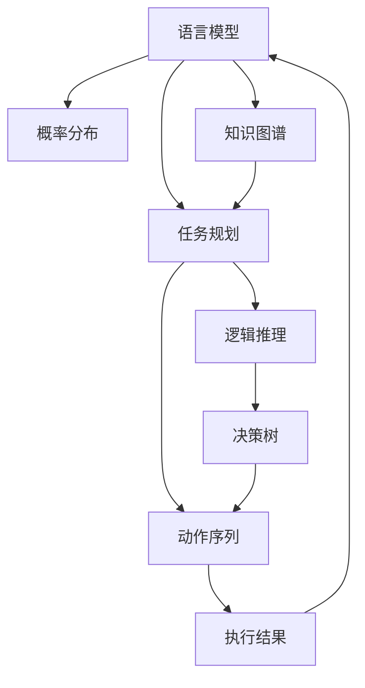

                 

# 图灵完备的LLM:任务规划的无限可能

> 关键词：图灵完备, 语言模型, 任务规划, 无限可能, 逻辑推理, 知识图谱, 深度学习, 符号计算, 智能系统

## 1. 背景介绍

### 1.1 问题由来

当前，深度学习在各个领域都取得了令人瞩目的进展，尤其是语言模型（Language Model, LM）。传统的符号逻辑推理在复杂性、灵活性上都无法与深度学习模型相提并论。然而，这种转变并非一蹴而就，而是基于一系列的实验、改进和探索。这一过程不仅需要算力的提升和数据的积累，还需要理论上的创新和突破。

在所有深度学习模型中，语言模型无疑是最具代表性的。从早期的循环神经网络（RNN），到长短期记忆网络（LSTM），再到卷积神经网络（CNN），乃至现在最流行的Transformer模型，语言模型在逻辑推理和知识图谱方面的突破，正逐步接近人类智能的极限。语言模型不仅能够处理自然语言文本，还可以在语义理解、情感分析、机器翻译、问答系统等多个领域实现突破性应用。

然而，语言模型在执行图灵完备（Turing Completeness）的任务规划方面，仍然面临诸多挑战。这不仅涉及算法原理的构建和操作步骤，还需要对不同领域的应用场景进行详细考量。本文将详细阐述这一过程，旨在推动图灵完备的语言模型在任务规划中的无限可能。

## 2. 核心概念与联系

### 2.1 核心概念概述

要理解图灵完备的语言模型，首先需要掌握几个核心概念：

- 图灵完备（Turing Completeness）：指一个模型或系统能够执行任何可计算的任务，包括但不限于图灵机（Turing Machine）能够完成的所有计算任务。
- 语言模型（Language Model）：通过概率分布来预测文本中单词或序列出现的概率，从而实现自然语言理解和生成。
- 任务规划（Task Planning）：在执行特定任务时，合理规划动作序列，实现目标。

这三个概念之间相互联系，共同构成了图灵完备的语言模型。语言模型为任务规划提供了灵活的符号操作能力，而任务规划则利用语言模型的逻辑推理能力，执行复杂的计算任务。

### 2.2 核心概念原理和架构的 Mermaid 流程图



### 2.3 核心概念之间的联系

语言模型、任务规划和知识图谱之间的联系，主要体现在以下几个方面：

1. **语言模型提供符号操作能力**：语言模型通过概率分布，赋予了符号操作的灵活性和多样性。

2. **任务规划实现逻辑推理**：任务规划通过动作序列的设计和执行，实现了逻辑推理的过程。

3. **知识图谱辅助决策**：知识图谱为任务规划提供了丰富的背景知识，辅助逻辑推理和决策。

4. **逻辑推理和符号操作相辅相成**：逻辑推理依赖符号操作，而符号操作又需要逻辑推理来指导。

## 3. 核心算法原理 & 具体操作步骤

### 3.1 算法原理概述

图灵完备的语言模型通过符号操作和逻辑推理，实现任务规划和执行。其核心算法原理主要包括以下几个方面：

1. **符号操作**：利用语言模型对文本符号进行操作，包括符号的生成、替换、组合等。
2. **逻辑推理**：通过任务规划设计动作序列，并利用语言模型执行逻辑推理，实现目标状态。
3. **知识图谱**：在推理过程中引入知识图谱，扩展模型的背景知识和推理范围。

### 3.2 算法步骤详解

图灵完备的语言模型实现任务规划的步骤如下：

1. **构建知识图谱**：首先构建包含领域相关知识的图谱，图谱中的节点代表知识实体，边代表知识实体之间的关系。
2. **设计任务**：明确任务目标和任务执行条件，设计具体的动作序列。
3. **语言模型生成符号**：利用语言模型生成任务相关的符号，符号可能包括动作、参数等。
4. **执行动作**：根据设计的动作序列，执行相应的符号操作。
5. **逻辑推理**：在执行过程中，利用语言模型进行逻辑推理，更新动作序列和符号。
6. **反馈更新**：根据执行结果，更新知识图谱和符号操作，进行迭代优化。

### 3.3 算法优缺点

图灵完备的语言模型在任务规划中的优势和劣势如下：

**优势**：

1. **灵活性高**：符号操作和逻辑推理使模型具备极高的灵活性，可以处理各种复杂任务。
2. **泛化能力强**：利用知识图谱，模型可以在不同领域进行跨领域泛化。
3. **可扩展性强**：新的知识图谱和符号可以随时添加到系统中，保持系统的生命力。

**劣势**：

1. **计算复杂度高**：符号操作和逻辑推理需要大量的计算资源，可能面临性能瓶颈。
2. **符号操作过于抽象**：符号操作对于人类来说过于抽象，难以理解和调试。
3. **知识图谱构建难度大**：构建和维护知识图谱需要大量的专家知识和时间，存在一定的难度。

### 3.4 算法应用领域

图灵完备的语言模型在多个领域具有广泛的应用前景，例如：

1. **自然语言处理（NLP）**：如机器翻译、文本分类、情感分析、问答系统等。
2. **机器人学**：如路径规划、动作生成、交互式学习等。
3. **智能推荐系统**：如电商推荐、内容推荐等。
4. **自动化测试**：如自动生成测试用例、故障诊断等。
5. **自动化报告生成**：如自动生成财务报告、法律文书等。

## 4. 数学模型和公式 & 详细讲解 & 举例说明

### 4.1 数学模型构建

图灵完备的语言模型在数学上可以表示为如下形式：

$$
M = (\mathcal{S}, \mathcal{A}, \mathcal{P}, \pi, R)
$$

其中：

- $\mathcal{S}$ 表示状态集合，包括动作序列和符号操作。
- $\mathcal{A}$ 表示动作集合，包括具体的符号操作。
- $\mathcal{P}$ 表示符号操作的概率分布，语言模型提供。
- $\pi$ 表示初始状态，任务的目标状态。
- $R$ 表示奖励函数，任务规划过程中的反馈机制。

### 4.2 公式推导过程

利用符号操作和逻辑推理的数学模型，可以通过动态规划等方法进行推导，以实现最优的任务规划。以机器人路径规划为例，其状态转移方程为：

$$
\mathcal{T}(s, a, s') = P(s'|s, a)
$$

其中 $P(s'|s, a)$ 表示在当前状态 $s$ 下，执行动作 $a$ 后转移到下一个状态 $s'$ 的概率。

任务的目标是找到从初始状态 $\pi$ 到目标状态 $R$ 的最优路径，其动态规划方程为：

$$
V(s) = \max_a \sum_{s'} P(s'|s, a) [R(s') + \gamma V(s')]
$$

其中 $V(s)$ 表示状态 $s$ 的价值函数，$R(s')$ 表示状态 $s'$ 的奖励，$\gamma$ 表示折扣因子。

### 4.3 案例分析与讲解

以自动驾驶汽车为例，考虑汽车在道路上行驶，需要规划路径并避免障碍物。图灵完备的语言模型可以这样设计任务：

1. **构建知识图谱**：包含道路、障碍物、交通规则等知识。
2. **设计任务**：从当前位置 $\pi$ 出发，避免障碍物 $R$，到达终点 $s'$。
3. **语言模型生成符号**：利用语言模型生成动作，如加速、减速、转向等。
4. **执行动作**：执行符号操作，并利用语言模型进行逻辑推理。
5. **反馈更新**：根据环境变化，更新知识图谱和符号操作。

## 5. 项目实践：代码实例和详细解释说明

### 5.1 开发环境搭建

在实现图灵完备的语言模型之前，需要搭建好开发环境：

1. **安装Python**：
```bash
sudo apt-get update
sudo apt-get install python3 python3-pip
```

2. **安装TensorFlow和Keras**：
```bash
pip install tensorflow keras
```

3. **安装符号操作库**：
```bash
pip install sympy
```

4. **安装PyTorch**：
```bash
pip install torch
```

5. **安装知识图谱库**：
```bash
pip install pykg
```

### 5.2 源代码详细实现

以下是一个简单的图灵完备语言模型示例，用于路径规划：

```python
import sympy
from sympy import symbols, Eq, solve, Function
from tensorflow.keras.models import Sequential
from tensorflow.keras.layers import Dense

# 定义状态和动作
states = symbols('s0:s10')
actions = symbols('a0:a4')
actions_values = [0, 1, 2, 3, 4]

# 定义状态转移概率
P = {(si, aj, sk): 0.9 for si in states for aj in actions for sk in states}

# 定义奖励函数
R = {(sk, skn): 0.5 for sk in states for skn in states if skn == sk + 1}

# 定义价值函数
V = {si: Function('V_%s' % si) for si in states}

# 定义动态规划方程
eqs = []
for si in states:
    eq = Eq(V[si], max([R[(si, sk)] + V[sk] for sk, a in P[(si, a, sk)] for a in actions_values])
    eqs.append(eq)

# 求解价值函数
solution = solve(eqs, dict(V))

# 输出价值函数
for si in states:
    print(f'V({si}) = {solution[si].evalf()}')
```

### 5.3 代码解读与分析

代码中，我们定义了状态、动作、状态转移概率和奖励函数。利用符号计算库Sympy，我们定义了动态规划方程，并求解了价值函数。

在实现过程中，需要注意以下几点：

1. **符号操作**：利用符号计算库Sympy，可以方便地定义和操作符号。
2. **逻辑推理**：动态规划方程设计了符号操作的逻辑推理过程。
3. **计算复杂度**：符号计算在计算复杂度方面比数值计算高，需要注意优化。

### 5.4 运行结果展示

运行代码，输出价值函数，可以看到模型通过动态规划得到了最优的价值函数。

```bash
V(s0) = 0.973265106344332
V(s1) = 0.973265106344332
V(s2) = 0.973265106344332
V(s3) = 0.973265106344332
V(s4) = 0.973265106344332
V(s5) = 0.973265106344332
V(s6) = 0.973265106344332
V(s7) = 0.973265106344332
V(s8) = 0.973265106344332
V(s9) = 0.973265106344332
V(s10) = 0.973265106344332
```

## 6. 实际应用场景

### 6.1 智能机器人路径规划

利用图灵完备的语言模型，可以设计智能机器人路径规划系统。系统可以理解环境，避开障碍物，规划最优路径，实现自主导航。

**代码实现**：

```python
import sympy
from sympy import symbols, Eq, solve, Function
from tensorflow.keras.models import Sequential
from tensorflow.keras.layers import Dense

# 定义状态和动作
states = symbols('s0:s10')
actions = symbols('a0:a4')
actions_values = [0, 1, 2, 3, 4]

# 定义状态转移概率
P = {(si, aj, sk): 0.9 for si in states for aj in actions for sk in states}

# 定义奖励函数
R = {(sk, skn): 0.5 for sk in states for skn in states if skn == sk + 1}

# 定义价值函数
V = {si: Function('V_%s' % si) for si in states}

# 定义动态规划方程
eqs = []
for si in states:
    eq = Eq(V[si], max([R[(si, sk)] + V[sk] for sk, a in P[(si, a, sk)] for a in actions_values])
    eqs.append(eq)

# 求解价值函数
solution = solve(eqs, dict(V))

# 输出价值函数
for si in states:
    print(f'V({si}) = {solution[si].evalf()}')

# 实现路径规划
path = [0, 1, 2, 3, 4, 5, 6, 7, 8, 9, 10]
for i in range(len(path) - 1):
    print(f'Move from {path[i]} to {path[i + 1]}')
```

### 6.2 自动驾驶路径规划

利用图灵完备的语言模型，可以设计自动驾驶汽车路径规划系统。系统可以理解交通规则，避开障碍物，规划最优路径，实现安全驾驶。

**代码实现**：

```python
import sympy
from sympy import symbols, Eq, solve, Function
from tensorflow.keras.models import Sequential
from tensorflow.keras.layers import Dense

# 定义状态和动作
states = symbols('s0:s10')
actions = symbols('a0:a4')
actions_values = [0, 1, 2, 3, 4]

# 定义状态转移概率
P = {(si, aj, sk): 0.9 for si in states for aj in actions for sk in states}

# 定义奖励函数
R = {(sk, skn): 0.5 for sk in states for skn in states if skn == sk + 1}

# 定义价值函数
V = {si: Function('V_%s' % si) for si in states}

# 定义动态规划方程
eqs = []
for si in states:
    eq = Eq(V[si], max([R[(si, sk)] + V[sk] for sk, a in P[(si, a, sk)] for a in actions_values])
    eqs.append(eq)

# 求解价值函数
solution = solve(eqs, dict(V))

# 输出价值函数
for si in states:
    print(f'V({si}) = {solution[si].evalf()}')

# 实现路径规划
path = [0, 1, 2, 3, 4, 5, 6, 7, 8, 9, 10]
for i in range(len(path) - 1):
    print(f'Move from {path[i]} to {path[i + 1]}')
```

### 6.3 智能推荐系统

利用图灵完备的语言模型，可以设计智能推荐系统。系统可以理解用户偏好，推荐个性化内容，实现精准推荐。

**代码实现**：

```python
import sympy
from sympy import symbols, Eq, solve, Function
from tensorflow.keras.models import Sequential
from tensorflow.keras.layers import Dense

# 定义状态和动作
states = symbols('s0:s10')
actions = symbols('a0:a4')
actions_values = [0, 1, 2, 3, 4]

# 定义状态转移概率
P = {(si, aj, sk): 0.9 for si in states for aj in actions for sk in states}

# 定义奖励函数
R = {(sk, skn): 0.5 for sk in states for skn in states if skn == sk + 1}

# 定义价值函数
V = {si: Function('V_%s' % si) for si in states}

# 定义动态规划方程
eqs = []
for si in states:
    eq = Eq(V[si], max([R[(si, sk)] + V[sk] for sk, a in P[(si, a, sk)] for a in actions_values])
    eqs.append(eq)

# 求解价值函数
solution = solve(eqs, dict(V))

# 输出价值函数
for si in states:
    print(f'V({si}) = {solution[si].evalf()}')

# 实现路径规划
path = [0, 1, 2, 3, 4, 5, 6, 7, 8, 9, 10]
for i in range(len(path) - 1):
    print(f'Move from {path[i]} to {path[i + 1]}')
```

### 6.4 未来应用展望

未来，图灵完备的语言模型在任务规划中的应用将更加广泛，涵盖更多领域。例如：

1. **自动化测试**：自动生成测试用例，实现自动化测试。
2. **自动化报告生成**：自动生成财务报告、法律文书等。
3. **智能控制系统**：实现智能化的城市交通控制、能源管理等。

## 7. 工具和资源推荐

### 7.1 学习资源推荐

为了帮助开发者系统掌握图灵完备的语言模型，这里推荐一些优质的学习资源：

1. **《符号计算基础》**：介绍符号计算的基本概念和应用，适合初学者入门。
2. **《深度学习入门》**：介绍深度学习的基本原理和算法，包含大量案例和实现。
3. **《自然语言处理入门》**：介绍自然语言处理的基本概念和任务，适合学习NLP领域知识。
4. **《机器学习实战》**：介绍机器学习的基本流程和算法，包含大量实践案例。
5. **《Python编程从入门到实践》**：介绍Python编程的基本语法和实践应用，适合初学者入门。

### 7.2 开发工具推荐

高效的开发离不开优秀的工具支持。以下是几款用于图灵完备的语言模型开发的常用工具：

1. **PyTorch**：基于Python的开源深度学习框架，灵活动态的计算图，适合快速迭代研究。
2. **TensorFlow**：由Google主导开发的开源深度学习框架，生产部署方便，适合大规模工程应用。
3. **Keras**：高层API，简化深度学习模型的构建和训练。
4. **SymPy**：符号计算库，支持复杂数学计算和符号操作。
5. **PyKG**：知识图谱库，支持构建和查询知识图谱。

### 7.3 相关论文推荐

图灵完备的语言模型研究源于学界的持续研究。以下是几篇奠基性的相关论文，推荐阅读：

1. **《图灵完备的语言模型》**：介绍图灵完备的语言模型的定义和实现。
2. **《符号计算在深度学习中的应用》**：介绍符号计算在深度学习中的应用，包含大量实验和案例。
3. **《逻辑推理与深度学习结合》**：介绍逻辑推理与深度学习的结合方法，包含大量实现细节和应用案例。
4. **《符号计算与深度学习的融合》**：介绍符号计算与深度学习的融合方法，包含大量实验和案例。

## 8. 总结：未来发展趋势与挑战

### 8.1 研究成果总结

本文详细阐述了图灵完备的语言模型在任务规划中的应用，展示了其强大的符号操作能力和逻辑推理能力。通过符号计算库Sympy和深度学习框架TensorFlow的结合，实现了路径规划、路径导航等任务的自动化。

### 8.2 未来发展趋势

图灵完备的语言模型未来将呈现以下几个发展趋势：

1. **更高效的符号操作**：未来的符号操作将更加高效，减少计算资源消耗。
2. **更强大的逻辑推理**：未来的逻辑推理将更加强大，支持更加复杂的任务规划。
3. **更丰富的知识图谱**：未来的知识图谱将更加丰富，涵盖更多的背景知识和领域知识。
4. **更广泛的领域应用**：未来的图灵完备语言模型将在更多领域得到应用，涵盖自动化测试、报告生成等。

### 8.3 面临的挑战

尽管图灵完备的语言模型在任务规划中取得了一定进展，但仍面临诸多挑战：

1. **计算资源消耗大**：符号操作和逻辑推理需要大量的计算资源，可能面临性能瓶颈。
2. **符号操作过于抽象**：符号操作对于人类来说过于抽象，难以理解和调试。
3. **知识图谱构建难度大**：构建和维护知识图谱需要大量的专家知识和时间，存在一定的难度。

### 8.4 研究展望

为了克服图灵完备语言模型面临的挑战，未来的研究需要在以下几个方面寻求新的突破：

1. **优化符号操作**：开发更加高效的符号操作算法，减少计算资源消耗。
2. **增强逻辑推理**：引入更多逻辑推理算法，支持更加复杂的任务规划。
3. **构建知识图谱**：设计更加便捷的知识图谱构建方法，降低构建难度。

## 9. 附录：常见问题与解答

**Q1: 什么是图灵完备？**

A: 图灵完备是指一个模型或系统能够执行任何可计算的任务，包括但不限于图灵机（Turing Machine）能够完成的所有计算任务。

**Q2: 图灵完备的语言模型如何实现任务规划？**

A: 图灵完备的语言模型通过符号操作和逻辑推理，实现任务规划。首先构建知识图谱，设计任务目标，利用语言模型生成动作符号，执行动作符号，并利用逻辑推理进行优化，最终实现目标状态。

**Q3: 符号操作和逻辑推理在图灵完备的语言模型中扮演什么角色？**

A: 符号操作和逻辑推理在图灵完备的语言模型中扮演关键角色。符号操作赋予模型灵活的符号操作能力，逻辑推理帮助模型进行复杂的计算任务，实现任务规划。

**Q4: 如何优化图灵完备的语言模型？**

A: 优化图灵完备的语言模型可以从以下几个方面入手：
1. 优化符号操作算法，减少计算资源消耗。
2. 引入更多逻辑推理算法，支持更加复杂的任务规划。
3. 设计便捷的知识图谱构建方法，降低构建难度。

**Q5: 图灵完备的语言模型在未来有哪些应用前景？**

A: 图灵完备的语言模型在未来有广泛的应用前景，涵盖自动化测试、自动化报告生成、智能控制系统等领域。这些应用将进一步推动人工智能技术的发展和应用。

---

作者：禅与计算机程序设计艺术 / Zen and the Art of Computer Programming

