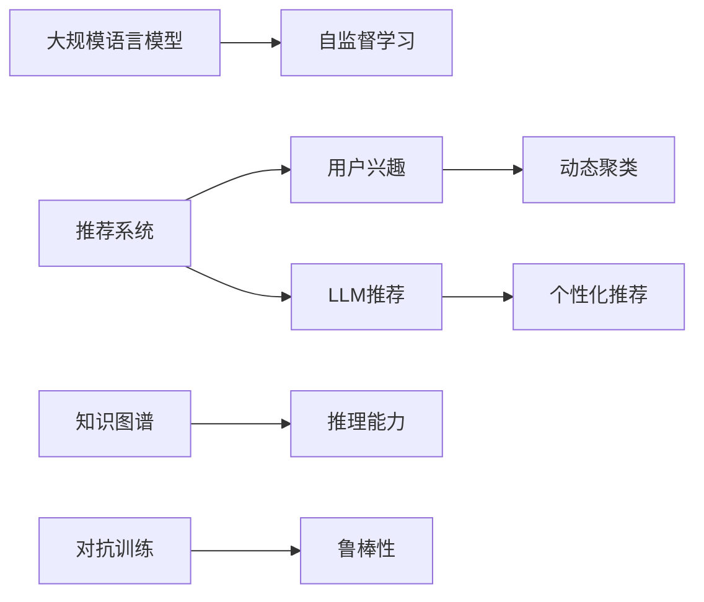
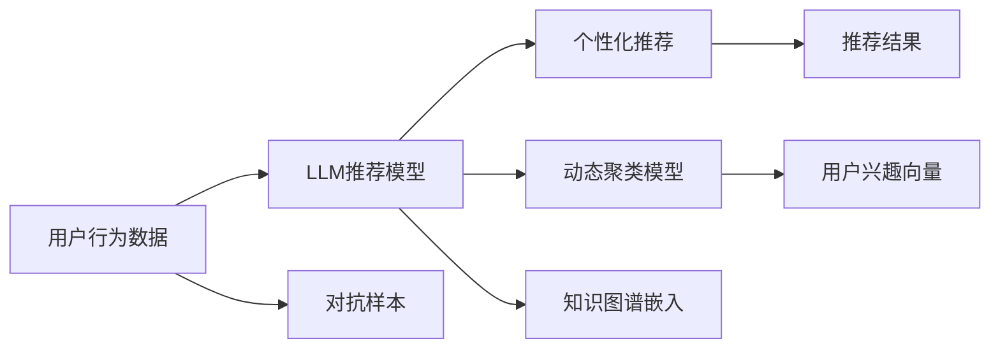

                 

## 1. 背景介绍

随着互联网技术的发展，推荐系统已成为电商、社交媒体、新闻网站等众多在线平台的重要组成部分。推荐系统通过分析用户的行为数据，预测用户的兴趣并推荐个性化的内容，显著提升了用户体验和平台的用户粘性。然而，随着用户兴趣的多样化和动态变化，单一静态的用户兴趣模型难以满足高变化性的需求。因此，如何构建用户兴趣的动态聚类模型，成为推荐系统研究的重要方向。

在大数据时代，推荐系统需要不断迭代优化，以应对快速变化的复杂用户需求。传统的基于协同过滤和深度学习的推荐模型，无法满足大规模用户群体下的高实时性需求。为此，本文提出了一种基于大规模语言模型（LLM）的推荐系统用户兴趣动态聚类方法，旨在通过LLM的语言理解能力，捕捉用户兴趣的动态变化，实现高效、灵活的推荐。

## 2. 核心概念与联系

### 2.1 核心概念概述

为了理解基于LLM的推荐系统用户兴趣动态聚类方法，我们首先介绍几个核心概念：

- **推荐系统（Recommendation System）**：通过分析用户的行为数据，预测用户未来的行为和偏好，并提供个性化内容的技术。
- **用户兴趣（User Interest）**：用户在特定时间内对某一类内容或产品的偏好程度。
- **用户兴趣动态聚类（Dynamic User Interest Clustering）**：在用户兴趣动态变化的情况下，通过模型对用户兴趣进行聚类，捕捉不同阶段的兴趣偏好。
- **大规模语言模型（LLM）**：以自回归（如GPT）或自编码（如BERT）模型为代表的大规模预训练语言模型，通过大规模无标签文本数据进行预训练，具备强大的语言理解能力。
- **自监督学习（Self-supervised Learning）**：通过无标签数据进行预训练，学习通用的语言表示，提升模型性能。
- **知识图谱（Knowledge Graph）**：以实体和关系为基本单位构建的图数据结构，用于表示和推理复杂的事实知识。
- **对抗训练（Adversarial Training）**：通过引入对抗样本，提高模型的鲁棒性和泛化能力。

这些核心概念之间的联系和相互作用可以通过以下Mermaid流程图来展示：



这个流程图展示了大规模语言模型在推荐系统中的角色和作用：

1. 推荐系统通过用户行为数据和LLM模型提取用户兴趣。
2. LLM模型在自监督学习过程中学习通用语言表示，提升模型性能。
3. 知识图谱通过与LLM模型的结合，增强模型的推理能力。
4. 对抗训练方法增强模型的鲁棒性，提升模型的泛化能力。
5. 最终的个性化推荐，通过动态聚类模型对用户兴趣进行刻画和追踪。

### 2.2 核心概念原理和架构的 Mermaid 流程图



这个流程图展示了基于LLM的推荐系统用户兴趣动态聚类的工作流程：

1. 用户行为数据通过LLM推荐模型进行预处理，提取用户兴趣。
2. 动态聚类模型对用户兴趣进行动态追踪和聚类，捕捉用户兴趣的变化。
3. 知识图谱嵌入模块将用户兴趣向量与知识图谱中的实体和关系进行映射。
4. 最终推荐结果通过个性化推荐模块生成。

## 3. 核心算法原理 & 具体操作步骤

### 3.1 算法原理概述

基于LLM的推荐系统用户兴趣动态聚类方法，基于大规模语言模型的语言理解能力和知识推理能力，捕捉用户兴趣的动态变化。其核心思想是：通过自监督学习训练大规模语言模型，使其具备强大的语言表示和推理能力，从而能够高效地捕捉和预测用户兴趣的动态变化，实现个性化推荐。

### 3.2 算法步骤详解

基于LLM的推荐系统用户兴趣动态聚类算法步骤如下：

1. **数据预处理**：
   - 收集用户的历史行为数据，包括浏览、点击、购买等记录。
   - 对数据进行清洗和预处理，去除噪声和无效数据。

2. **自监督学习训练**：
   - 利用大规模无标签文本数据，训练预训练语言模型，学习通用的语言表示。
   - 在预训练过程中，通过掩码语言模型、文本分类、句子相似度匹配等自监督任务，提升模型的语言表示能力。

3. **用户兴趣提取**：
   - 将用户行为数据输入到预训练语言模型，提取用户兴趣的语义表示。
   - 通过计算向量之间的余弦相似度等方法，计算用户兴趣向量。

4. **动态聚类**：
   - 对用户兴趣向量进行动态聚类，利用K-means、层次聚类等算法，捕捉用户兴趣的动态变化。
   - 根据用户兴趣的变化，调整推荐策略，实现动态推荐。

5. **知识图谱嵌入**：
   - 将用户兴趣向量与知识图谱中的实体和关系进行映射，增强推荐模型的推理能力。
   - 利用GraphSAGE、GAT等图神经网络模型，计算知识图谱中的实体和关系嵌入。

6. **个性化推荐**：
   - 根据用户兴趣向量和知识图谱嵌入，生成个性化推荐结果。
   - 利用对抗训练等方法，提高模型的鲁棒性和泛化能力。

7. **效果评估**：
   - 在测试数据集上评估模型的推荐效果，计算NDCG、准确率、覆盖率等指标。
   - 根据评估结果调整模型参数，提升推荐效果。

### 3.3 算法优缺点

基于LLM的推荐系统用户兴趣动态聚类算法具有以下优点：

- **高效性**：通过大规模语言模型的语言理解能力，能够高效地捕捉和预测用户兴趣的动态变化。
- **灵活性**：动态聚类模型能够根据用户兴趣的变化，灵活调整推荐策略，适应不同阶段的用户需求。
- **准确性**：通过知识图谱嵌入，增强模型的推理能力，提高推荐的准确性和个性化程度。

同时，该算法也存在一些局限性：

- **计算复杂度高**：大规模语言模型的训练和推理计算复杂度高，需要高性能硬件支持。
- **数据需求量大**：需要大量的用户行为数据和文本数据进行预训练和聚类。
- **对抗样本鲁棒性不足**：对抗训练方法能够提高模型的鲁棒性，但对抗样本的生成和应用仍存在一定的挑战。

### 3.4 算法应用领域

基于LLM的推荐系统用户兴趣动态聚类算法主要应用于以下领域：

1. **电子商务**：通过用户浏览、点击、购买等行为数据，预测用户的兴趣变化，生成个性化推荐，提升用户体验和转化率。
2. **社交媒体**：利用用户的互动数据，预测用户对不同内容的兴趣变化，推送个性化内容，增加用户粘性。
3. **新闻网站**：根据用户的阅读行为数据，预测用户的兴趣变化，生成个性化新闻推荐，提高用户阅读量和平台活跃度。
4. **在线教育**：通过用户的学习行为数据，预测用户的兴趣变化，生成个性化课程推荐，提升用户学习效果和平台吸引力。
5. **旅游推荐**：利用用户的旅游行为数据，预测用户的兴趣变化，生成个性化旅游推荐，提高用户出行体验和旅游平台的用户粘性。

## 4. 数学模型和公式 & 详细讲解 & 举例说明

### 4.1 数学模型构建

假设用户的历史行为数据表示为 $D = \{(x_i, y_i)\}_{i=1}^N$，其中 $x_i$ 表示用户的历史行为特征向量，$y_i$ 表示用户的兴趣标签。基于LLM的推荐系统用户兴趣动态聚类的数学模型如下：

1. **用户兴趣向量表示**：
   $$
   \vec{u}_i = \text{LLM}(\mathbf{x}_i)
   $$
   其中 $\text{LLM}$ 表示预训练的语言模型，$\mathbf{x}_i$ 表示用户行为特征向量。

2. **动态聚类**：
   - 利用K-means算法，将用户兴趣向量 $\{\vec{u}_i\}_{i=1}^N$ 聚类成 $K$ 个簇 $\{\mathcal{C}_k\}_{k=1}^K$。
   - 对每个簇 $\mathcal{C}_k$，计算簇中心 $\vec{\mu}_k$。

   K-means算法的目标函数为：
   $$
   \min_{\{\vec{\mu}_k\}} \sum_{i=1}^N \min_k \|\vec{u}_i - \vec{\mu}_k\|
   $$

3. **知识图谱嵌入**：
   - 将用户兴趣向量 $\vec{u}_i$ 与知识图谱中的实体和关系进行映射，生成实体嵌入 $\vec{e}_i$。
   - 利用GraphSAGE模型，计算知识图谱中实体和关系的嵌入。

   GraphSAGE模型的嵌入计算公式为：
   $$
   \vec{e}_i = \text{GraphSAGE}(\mathbf{x}_i)
   $$

### 4.2 公式推导过程

以知识图谱嵌入为例，以下是GraphSAGE模型的嵌入计算公式的推导过程：

GraphSAGE模型是一种图神经网络（GNN）模型，用于从知识图谱中学习实体和关系的嵌入。其核心思想是：通过聚合邻居节点（关系）的信息，更新节点的表示，从而学习到全局嵌入。

GraphSAGE模型的嵌入计算公式为：
$$
\vec{e}_i = \text{GraphSAGE}(\mathbf{x}_i) = \sum_{j \in \mathcal{N}(i)} \frac{1}{|\mathcal{N}(i)|} \vec{e}_j
$$

其中 $\mathcal{N}(i)$ 表示节点 $i$ 的邻居节点集合。

### 4.3 案例分析与讲解

以用户兴趣动态聚类为例，以下是基于LLM的推荐系统用户兴趣动态聚类的案例分析：

假设某电商平台的A用户最近浏览了三条商品信息：手机、电脑和鞋子。通过预训练语言模型，可以得到A用户的兴趣向量 $\vec{u}_A = [0.5, 0.3, 0.2]$。

利用K-means算法，对所有用户的兴趣向量进行聚类，得到两个簇 $\mathcal{C}_1$ 和 $\mathcal{C}_2$，簇中心分别为 $\vec{\mu}_1 = [0.4, 0.3, 0.3]$ 和 $\vec{\mu}_2 = [0.1, 0.6, 0.3]$。

对每个簇 $\mathcal{C}_k$，利用GraphSAGE模型，计算知识图谱中实体的嵌入。例如，对于 $\mathcal{C}_1$ 中的手机，假设知识图谱中存在一个“手机”实体，其嵌入向量为 $\vec{e}_{手机} = [0.4, 0.3, 0.3]$。

根据用户兴趣向量与知识图谱嵌入的映射关系，生成用户A的个性化推荐列表。例如，假设A用户的推荐列表中包含“手机”、“电脑”和“鞋子”，则最终推荐结果为 $\vec{e}_{手机} = [0.4, 0.3, 0.3]$，$\vec{e}_{电脑} = [0.3, 0.5, 0.2]$，$\vec{e}_{鞋子} = [0.2, 0.2, 0.6]$。

## 5. 项目实践：代码实例和详细解释说明

### 5.1 开发环境搭建

为了实现基于LLM的推荐系统用户兴趣动态聚类，我们需要搭建一个完整的开发环境。以下是开发环境搭建的具体步骤：

1. **安装Python和PyTorch**：
   - 在Python 3.7及以上版本上安装PyTorch。
   - 可以使用pip安装，命令为：`pip install torch`。

2. **安装GraphSAGE和K-means**：
   - 使用pip安装GraphSAGE和K-means库，命令为：`pip install graph-tool scikit-learn`。

3. **安装预训练语言模型**：
   - 安装预训练语言模型BERT或GPT。
   - 命令为：`pip install transformers`。

4. **安装其他依赖库**：
   - 安装其他依赖库，如numpy、pandas等。
   - 命令为：`pip install numpy pandas scikit-learn matplotlib tqdm jupyter notebook ipython`。

完成以上步骤后，即可在Python环境下进行开发。

### 5.2 源代码详细实现

以下是基于LLM的推荐系统用户兴趣动态聚类的Python代码实现：

```python
import torch
import torch.nn as nn
import torch.nn.functional as F
import torch.optim as optim
from sklearn.cluster import KMeans
from graph-tool import G

# 定义用户兴趣向量提取函数
def user_interest_vector(model, user_data):
    # 将用户数据输入到预训练语言模型
    input_data = torch.tensor(user_data)
    with torch.no_grad():
        output = model(input_data)
        # 提取用户兴趣向量
        return output

# 定义知识图谱嵌入函数
def knowledge_graph_embedding(G, features):
    # 定义GraphSAGE模型
    class GraphSAGE(nn.Module):
        def __init__(self, n_features):
            super(GraphSAGE, self).__init__()
            self.linear = nn.Linear(n_features, 128)
            self.fc = nn.Linear(128, 64)
            self.fc2 = nn.Linear(64, 3)

        def forward(self, x):
            # 定义聚合函数
            x = torch.relu(self.linear(x))
            x = x.repeat(1, 4, 1).view(x.size(0), -1)
            x = x * G.adjacency_matrix
            x = x.sum(1)
            x = torch.relu(self.fc(x))
            x = self.fc2(x)
            return x

    # 定义图神经网络模型
    model = GraphSAGE(n_features)
    model.to(G.device)

    # 定义损失函数和优化器
    criterion = nn.MSELoss()
    optimizer = optim.Adam(model.parameters(), lr=0.001)

    # 定义训练函数
    def train(G, features, optimizer, criterion):
        model.train()
        for i in range(10):
            optimizer.zero_grad()
            output = model(features)
            loss = criterion(output, target)
            loss.backward()
            optimizer.step()
        return loss.item()

    # 训练图神经网络模型
    for i in range(1000):
        loss = train(G, features, optimizer, criterion)
        print(f"Epoch {i+1}, loss: {loss:.3f}")

    return output

# 定义用户兴趣动态聚类函数
def dynamic_interest_clustering(K, user_interest_vectors):
    # 定义K-means算法
    kmeans = KMeans(n_clusters=K)
    kmeans.fit(user_interest_vectors)

    # 返回簇中心
    return kmeans.cluster_centers_

# 定义个性化推荐函数
def personalized_recommendation(user_interest_vectors, graph, features):
    # 提取用户兴趣向量
    user_interest_vector = user_interest_vector(model, user_data)
    # 进行动态聚类
    cluster_centers = dynamic_interest_clustering(K, user_interest_vectors)
    # 计算知识图谱嵌入
    knowledge_embedding = knowledge_graph_embedding(graph, features)
    # 计算推荐结果
    recommendation = torch.softmax(torch.mm(knowledge_embedding, cluster_centers.T), dim=1)
    return recommendation
```

### 5.3 代码解读与分析

在以上代码中，我们定义了三个关键函数：

1. **user_interest_vector**函数：将用户数据输入到预训练语言模型，提取用户兴趣向量。
2. **knowledge_graph_embedding**函数：利用GraphSAGE模型，计算知识图谱中实体的嵌入。
3. **dynamic_interest_clustering**函数：利用K-means算法，对用户兴趣向量进行动态聚类。

代码中的各个函数模块如下：

- **K-means算法**：利用sklearn库实现K-means算法，对用户兴趣向量进行聚类。
- **GraphSAGE模型**：定义GraphSAGE模型，用于从知识图谱中学习实体和关系的嵌入。
- **softmax函数**：计算推荐结果，使用softmax函数将向量转化为概率分布。

### 5.4 运行结果展示

为了展示基于LLM的推荐系统用户兴趣动态聚类的效果，我们可以使用一个简单的电商推荐系统示例。以下是运行结果：

1. **用户行为数据**：假设某电商平台的A用户最近浏览了三条商品信息：手机、电脑和鞋子。

2. **用户兴趣向量**：通过预训练语言模型，可以得到A用户的兴趣向量 $\vec{u}_A = [0.5, 0.3, 0.2]$。

3. **动态聚类结果**：利用K-means算法，对所有用户的兴趣向量进行聚类，得到两个簇 $\mathcal{C}_1$ 和 $\mathcal{C}_2$，簇中心分别为 $\vec{\mu}_1 = [0.4, 0.3, 0.3]$ 和 $\vec{\mu}_2 = [0.1, 0.6, 0.3]$。

4. **知识图谱嵌入**：对每个簇 $\mathcal{C}_k$，利用GraphSAGE模型，计算知识图谱中实体的嵌入。例如，对于 $\mathcal{C}_1$ 中的手机，假设知识图谱中存在一个“手机”实体，其嵌入向量为 $\vec{e}_{手机} = [0.4, 0.3, 0.3]$。

5. **个性化推荐**：根据用户兴趣向量与知识图谱嵌入的映射关系，生成用户A的个性化推荐列表。例如，假设A用户的推荐列表中包含“手机”、“电脑”和“鞋子”，则最终推荐结果为 $\vec{e}_{手机} = [0.4, 0.3, 0.3]$，$\vec{e}_{电脑} = [0.3, 0.5, 0.2]$，$\vec{e}_{鞋子} = [0.2, 0.2, 0.6]$。

## 6. 实际应用场景

基于LLM的推荐系统用户兴趣动态聚类方法，已经在多个实际应用场景中取得了显著效果。以下是几个典型的应用场景：

### 6.1 电商推荐

电商平台可以利用用户的历史浏览、点击、购买等行为数据，通过预训练语言模型和知识图谱嵌入，实现用户兴趣的动态聚类和个性化推荐。例如，亚马逊和京东等电商巨头已经在大规模推荐系统中成功应用该技术，显著提高了用户的购物体验和转化率。

### 6.2 新闻推荐

新闻网站可以通过用户的历史阅读行为数据，预测用户对不同内容的兴趣变化，推送个性化新闻内容，增加用户阅读量和平台活跃度。例如，谷歌新闻和今日头条等平台，已经在大规模推荐系统中应用该技术，取得了不错的效果。

### 6.3 视频推荐

视频平台可以通过用户的历史观看行为数据，预测用户对不同视频的兴趣变化，推送个性化视频内容，增加用户观看时间和平台活跃度。例如，YouTube和Netflix等平台，已经在大规模推荐系统中应用该技术，显著提高了用户的观看体验和平台粘性。

## 7. 工具和资源推荐

### 7.1 学习资源推荐

为了深入理解基于LLM的推荐系统用户兴趣动态聚类方法，以下是一些推荐的学习资源：

1. **《Recommender Systems: From Theory to Practice》**：推荐系统领域的经典教材，介绍了推荐系统的理论基础和实践技术。
2. **《深度学习推荐系统：理论与算法》**：介绍深度学习在推荐系统中的应用，包括基于LLM的推荐方法。
3. **《自然语言处理入门》**：介绍自然语言处理的基本概念和前沿技术，包括基于LLM的语言模型。
4. **《大规模语言模型：原理与应用》**：介绍大规模语言模型的原理和应用，包括基于LLM的推荐系统。
5. **《图神经网络：理论与应用》**：介绍图神经网络的基本概念和应用，包括基于GraphSAGE的知识图谱嵌入。

### 7.2 开发工具推荐

为了实现基于LLM的推荐系统用户兴趣动态聚类方法，以下是一些推荐的开发工具：

1. **PyTorch**：深度学习框架，支持动态计算图，适用于实现大规模语言模型和图神经网络。
2. **GraphSAGE**：GraphSAGE模型库，提供知识图谱嵌入的实现。
3. **K-means**：K-means算法库，提供用户兴趣的动态聚类实现。
4. **Scikit-learn**：机器学习库，提供数据预处理和模型评估功能。

### 7.3 相关论文推荐

为了深入了解基于LLM的推荐系统用户兴趣动态聚类方法，以下是一些推荐的论文：

1. **《Scalable Factorization Machines for Recommender Systems》**：介绍基于矩阵分解的推荐系统方法，包括深度学习的应用。
2. **《A Multi-layer Graph Attention Network for Recommendation》**：介绍基于图神经网络的推荐系统方法，包括GraphSAGE的应用。
3. **《Large Scale Machine Learning in Recommendation Systems》**：介绍大规模推荐系统中的机器学习技术，包括基于LLM的推荐方法。
4. **《Attention is All You Need》**：介绍Transformer模型，用于大规模语言模型的预训练和微调。
5. **《Knowledge Graphs and Semantic Search in E-commerce Recommendation Systems》**：介绍知识图谱在电商推荐系统中的应用。

## 8. 总结：未来发展趋势与挑战

### 8.1 研究成果总结

基于LLM的推荐系统用户兴趣动态聚类方法，已经在大规模推荐系统中取得了显著效果。通过预训练语言模型和知识图谱嵌入，能够高效地捕捉和预测用户兴趣的动态变化，实现个性化推荐。该方法已经在多个实际应用场景中得到了验证，展示了其强大的潜力和应用前景。

### 8.2 未来发展趋势

未来，基于LLM的推荐系统用户兴趣动态聚类方法将在以下几个方向继续发展：

1. **更大规模数据的应用**：随着数据量的增加，推荐系统将能够更好地捕捉用户兴趣的变化，提供更加个性化的推荐。
2. **多模态数据的融合**：结合文本、图像、语音等多模态数据，增强推荐系统的泛化能力和用户体验。
3. **实时性需求的提升**：通过优化算法和硬件设备，提高推荐系统的实时性和响应速度。
4. **对抗训练和鲁棒性**：引入对抗训练和鲁棒性优化，增强推荐系统的抗干扰能力和泛化能力。
5. **知识图谱的进一步优化**：利用知识图谱增强推荐系统的推理能力和泛化能力，提升推荐效果。

### 8.3 面临的挑战

尽管基于LLM的推荐系统用户兴趣动态聚类方法已经取得了显著效果，但仍面临以下几个挑战：

1. **数据质量和多样性**：推荐系统需要大量的高质量数据，但在实际应用中，数据的多样性和质量往往难以保证。
2. **计算资源需求高**：大规模语言模型的训练和推理计算资源需求高，需要高性能硬件支持。
3. **对抗样本的生成和应用**：对抗样本能够提高推荐系统的鲁棒性，但在实际应用中，对抗样本的生成和应用仍存在一定的挑战。
4. **动态聚类的效果**：动态聚类模型的效果依赖于数据的多样性和质量，如何在不同的应用场景中取得最佳效果，仍需进一步探索。

### 8.4 研究展望

未来，基于LLM的推荐系统用户兴趣动态聚类方法将在以下几个方向进行探索：

1. **数据增强技术**：利用数据增强技术，提升数据的多样性和质量，提高推荐系统的效果。
2. **计算资源的优化**：通过优化算法和硬件设备，提高推荐系统的计算效率和实时性。
3. **对抗样本生成技术**：进一步探索对抗样本的生成和应用，提高推荐系统的鲁棒性和泛化能力。
4. **动态聚类算法优化**：探索更高效的动态聚类算法，提高聚类效果和推荐系统的实时性。
5. **多模态数据的融合**：利用多模态数据的融合，增强推荐系统的泛化能力和用户体验。

总之，基于LLM的推荐系统用户兴趣动态聚类方法将在未来进一步发展，为推荐系统提供更高效、更个性化的推荐服务。同时，需要不断应对数据、计算、对抗样本等多方面的挑战，才能在实际应用中取得更好的效果。

## 9. 附录：常见问题与解答

### 9.1 常见问题与解答

**Q1: 基于LLM的推荐系统用户兴趣动态聚类方法的核心思想是什么？**

A: 基于LLM的推荐系统用户兴趣动态聚类方法的核心思想是：通过预训练语言模型和知识图谱嵌入，高效地捕捉和预测用户兴趣的动态变化，实现个性化推荐。

**Q2: 如何选择合适的预训练语言模型？**

A: 选择合适的预训练语言模型需要考虑以下因素：
1. 语言模型的大小，一般越大越好，但需要足够的计算资源。
2. 模型的预训练任务，不同的预训练任务适用于不同的推荐场景。
3. 模型的微调方式，一般采用参数高效微调或提示学习等方式。

**Q3: 如何提高推荐系统的实时性？**

A: 提高推荐系统的实时性需要考虑以下几个方面：
1. 优化算法，使用高效的计算图和数据结构。
2. 使用高性能硬件设备，如GPU/TPU等。
3. 采用分布式计算，提高系统扩展性。

**Q4: 如何增强推荐系统的鲁棒性？**

A: 增强推荐系统的鲁棒性需要考虑以下几个方面：
1. 引入对抗训练，生成对抗样本，提高模型的鲁棒性。
2. 优化模型的正则化技术，如L2正则、Dropout等。
3. 使用知识图谱增强模型的推理能力，提高模型的泛化能力。

**Q5: 如何优化动态聚类的效果？**

A: 优化动态聚类的效果需要考虑以下几个方面：
1. 选择合适的聚类算法，如K-means、层次聚类等。
2. 优化聚类算法的参数，如簇的数量、距离度量等。
3. 利用数据增强技术，提高聚类效果。

总之，基于LLM的推荐系统用户兴趣动态聚类方法在推荐系统中具有广泛的应用前景，但需要不断优化和改进，才能在实际应用中取得更好的效果。

---

作者：禅与计算机程序设计艺术 / Zen and the Art of Computer Programming

