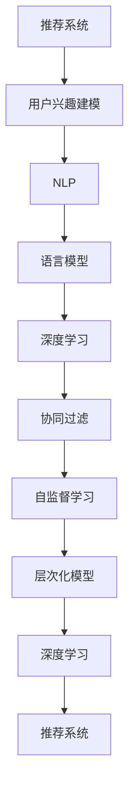

                 

# 基于LLM的推荐系统用户兴趣层次化建模

> 关键词：自然语言处理（NLP）、语言模型（LM）、推荐系统（Recommender System）、用户兴趣建模、深度学习（Deep Learning）、层次化模型、协同过滤（Collaborative Filtering）、自监督学习（Self-Supervised Learning）

## 1. 背景介绍

### 1.1 问题由来

在当前数字化时代，推荐系统已经成为了各个电商平台、内容平台的重要组成部分，为用户提供个性化的推荐内容，极大地提升了用户体验和平台价值。传统的协同过滤算法在推荐系统中占据主流地位，但面临数据稀疏性和用户新物品推荐等问题。近年来，基于深度学习的推荐系统开始逐渐崭露头角，能够更好地处理长尾数据和跨领域推荐问题。

自然语言处理（NLP）技术的迅猛发展，为基于深度学习的推荐系统带来了新的思路和挑战。通过深度学习模型，我们可以更高效地理解和处理用户的文本数据，挖掘用户的兴趣偏好，从而提供更加精准的推荐服务。其中，语言模型（LM）作为深度学习的基础，能够捕捉语言中的复杂关联关系，为用户兴趣建模提供了强大的工具。

## 2. 核心概念与联系

### 2.1 核心概念概述

为更好地理解基于语言模型的推荐系统，本节将介绍几个关键概念及其相互联系：

- 推荐系统（Recommender System）：根据用户的历史行为和偏好，为用户推荐个性化物品的系统。推荐系统广泛应用于电商、视频、新闻等领域，极大地提升了用户体验和平台价值。

- 用户兴趣建模（User Interest Modeling）：通过建模用户的历史行为、文本数据等，理解用户的兴趣偏好，从而指导推荐策略。用户兴趣建模是推荐系统核心组件之一，是提升推荐效果的关键。

- 自然语言处理（NLP）：研究如何让计算机理解和生成自然语言的技术，包括语言模型、词向量、序列标注等。NLP技术能够捕捉语言中的语义关系，为用户兴趣建模提供了丰富的数据资源。

- 语言模型（Language Model, LM）：基于序列数据训练的深度学习模型，能够预测文本中下一个词的概率。语言模型在NLP中有着广泛应用，为推荐系统提供了强大的知识库。

- 协同过滤（Collaborative Filtering）：基于用户相似性和物品相似性的推荐策略。协同过滤算法虽然简单易行，但面临数据稀疏性和用户新物品推荐等问题。

- 自监督学习（Self-Supervised Learning）：利用大量无标签数据进行训练，学习模型的隐含语义表示。自监督学习能够捕捉语言的复杂关系，提升推荐系统的泛化能力。

- 深度学习（Deep Learning）：一种模拟人脑神经网络的计算模型，能够处理复杂的非线性关系。深度学习模型在推荐系统中已广泛应用，取得了显著效果。

- 层次化模型（Hierarchical Model）：能够学习用户兴趣层次化的结构，构建多层级的用户模型，提升推荐效果。层次化模型能够更好地捕捉用户兴趣的多维度和动态变化。

这些概念之间的逻辑关系可以通过以下Mermaid流程图来展示：



这个流程图展示了推荐系统中的关键概念及其相互联系：

1. 推荐系统通过用户兴趣建模指导推荐策略。
2. 用户兴趣建模利用NLP技术，尤其是语言模型，捕捉用户兴趣的语义信息。
3. 语言模型和深度学习技术提供了强大的模型基础，提升了推荐系统的性能。
4. 协同过滤算法和自监督学习技术进一步丰富了推荐系统的方法。
5. 层次化模型能够更好地刻画用户兴趣的多维度结构，提升推荐效果。

这些概念共同构成了推荐系统的核心框架，使得基于语言模型的推荐系统能够在实际应用中发挥强大的作用。

## 3. 核心算法原理 & 具体操作步骤
### 3.1 算法原理概述

基于语言模型的推荐系统，通过语言模型捕捉用户文本数据中的语义信息，构建用户兴趣模型，从而实现个性化的推荐。核心思想是：利用语言模型学习用户文本数据的隐含语义表示，将其作为用户兴趣的向量表示，用于指导推荐策略。

具体而言，算法步骤如下：

1. 收集用户的历史行为数据和文本数据。
2. 利用语言模型训练用户文本数据的隐含语义表示。
3. 将用户文本数据的隐含语义表示作为用户兴趣的向量表示。
4. 构建用户兴趣层次化模型，捕捉用户兴趣的多维度结构。
5. 根据用户兴趣向量生成推荐物品的序列。

### 3.2 算法步骤详解

#### 3.2.1 数据准备

数据准备是推荐系统的第一步。需要收集用户的历史行为数据和文本数据，如浏览记录、点击行为、评论内容等。这些数据可以通过API接口、日志文件等渠道获取。

**用户行为数据**：
- 浏览记录：用户访问的页面、商品、视频等。
- 点击行为：用户点击的页面、商品、视频等。
- 评论内容：用户在商品、视频等页面的评论。

**用户文本数据**：
- 用户画像：描述用户的基本信息，如年龄、性别、职业等。
- 用户评论：用户在商品、视频等页面的评论。
- 用户文章：用户发布的博客、文章等。

#### 3.2.2 语言模型训练

语言模型训练是推荐系统中的关键步骤，利用大规模无标签文本数据训练语言模型，捕捉语言中的复杂关联关系。

**预训练**：
- 收集大规模无标签文本数据，如维基百科、新闻、书籍等。
- 利用预训练技术（如BERT、GPT等），训练语言模型。

**微调**：
- 将用户文本数据作为微调数据，利用用户文本数据微调预训练模型。
- 微调后的语言模型能够更好地捕捉用户文本数据的语义信息。

#### 3.2.3 用户兴趣建模

用户兴趣建模是推荐系统的核心任务，通过语言模型捕捉用户文本数据的隐含语义表示，用于构建用户兴趣向量。

**用户文本数据的隐含语义表示**：
- 将用户文本数据输入预训练和微调后的语言模型。
- 语言模型输出用户文本数据的隐含语义表示，即用户兴趣向量。

**用户兴趣向量的构建**：
- 将用户文本数据的隐含语义表示作为用户兴趣的向量表示。
- 利用多维向量嵌入技术，将用户兴趣向量进行降维和归一化。

#### 3.2.4 用户兴趣层次化模型

用户兴趣层次化模型能够更好地刻画用户兴趣的多维度结构，构建多层级的用户模型。

**用户兴趣的多维度结构**：
- 将用户兴趣向量分为多个层次，如兴趣偏好、情感倾向、兴趣主题等。
- 利用层次化结构，捕捉用户兴趣的多维度关系。

**多层级用户模型的构建**：
- 利用层次化模型（如Hierarchical Attention Networks），构建多层级的用户模型。
- 利用注意力机制，捕捉用户兴趣的多维度结构。

#### 3.2.5 推荐物品生成

推荐物品生成是推荐系统的最后一步，根据用户兴趣向量生成推荐物品的序列。

**推荐物品的序列生成**：
- 利用用户兴趣向量，生成推荐物品的序列。
- 利用深度学习模型（如Seq2Seq），生成推荐物品的序列。

### 3.3 算法优缺点

基于语言模型的推荐系统具有以下优点：

1. 语言模型能够捕捉用户文本数据的复杂关联关系，提供丰富的用户兴趣信息。
2. 层次化模型能够更好地捕捉用户兴趣的多维度结构，提升推荐效果。
3. 深度学习模型能够处理复杂的非线性关系，提升推荐系统的性能。
4. 自监督学习技术能够利用大规模无标签数据，提升推荐系统的泛化能力。

但同时，该方法也存在一定的局限性：

1. 对数据质量要求高。需要收集大量高质量的用户行为数据和文本数据，获取成本较高。
2. 模型复杂度高。需要利用深度学习模型和层次化模型，计算资源消耗较大。
3. 对文本数据要求高。需要用户文本数据具有较好的语义一致性和完整性，否则会影响推荐效果。
4. 隐私保护问题。用户文本数据的收集和处理涉及用户隐私，需要严格遵守数据隐私法律法规。

尽管存在这些局限性，但就目前而言，基于语言模型的推荐系统仍是大规模数据下的主流推荐策略。未来相关研究的重点在于如何进一步降低对数据的质量和数量的依赖，提高模型的计算效率，同时兼顾隐私保护和推荐效果。

### 3.4 算法应用领域

基于语言模型的推荐系统已经在电商、视频、新闻等多个领域得到了广泛应用，并取得了显著的效果。

#### 3.4.1 电商推荐

电商推荐系统利用语言模型捕捉用户购物记录和文本数据的语义信息，构建用户兴趣模型，为用户推荐个性化商品。例如，亚马逊的推荐系统通过用户评论和浏览记录训练语言模型，捕捉用户对商品的兴趣偏好，提升用户购物体验。

#### 3.4.2 视频推荐

视频推荐系统利用语言模型捕捉用户观看记录和文本数据的语义信息，构建用户兴趣模型，为用户推荐个性化视频。例如，Netflix利用用户观影记录和评分训练语言模型，捕捉用户对视频的兴趣偏好，提升用户观影体验。

#### 3.4.3 新闻推荐

新闻推荐系统利用语言模型捕捉用户阅读记录和文本数据的语义信息，构建用户兴趣模型，为用户推荐个性化新闻。例如，今日头条利用用户阅读记录和评论训练语言模型，捕捉用户对新闻的兴趣偏好，提升用户阅读体验。

除了上述这些经典应用外，基于语言模型的推荐系统还被创新性地应用到更多场景中，如音乐推荐、游戏推荐、旅游推荐等，为推荐系统带来了新的突破。随着语言模型和推荐方法的不
断进步，相信推荐系统必将在更广阔的应用领域大放异彩。

## 4. 数学模型和公式 & 详细讲解  
### 4.1 数学模型构建

本节将使用数学语言对基于语言模型的推荐系统进行更加严格的刻画。

记用户文本数据为 $X=\{x_1,x_2,\ldots,x_n\}$，其中 $x_i$ 为第 $i$ 条文本记录。语言模型为 $M_{\theta}$，其中 $\theta$ 为模型参数。用户兴趣向量为 $u_i \in \mathbb{R}^d$，$d$ 为用户兴趣向量的维度。

语言模型 $M_{\theta}$ 在文本数据 $X$ 上的隐含语义表示为 $\hat{X}=\{\hat{x}_1,\hat{x}_2,\ldots,\hat{x}_n\}$，其中 $\hat{x}_i$ 为 $x_i$ 的隐含语义表示。用户兴趣向量 $u_i$ 可以表示为：

$$
u_i = f(\hat{x}_i)
$$

其中 $f$ 为映射函数，将隐含语义表示映射为用户兴趣向量。

层次化模型 $H$ 的构建如下：

1. 将用户兴趣向量 $u_i$ 分为多个层次，如兴趣偏好、情感倾向、兴趣主题等。
2. 利用层次化模型，构建多层级的用户模型。

推荐物品生成过程如下：

1. 根据用户兴趣向量 $u_i$，生成推荐物品的序列 $V_i$。
2. 利用深度学习模型，生成推荐物品的序列。

### 4.2 公式推导过程

以用户文本数据的隐含语义表示为例，推导语言模型的公式。

假设语言模型为 $M_{\theta}(x)$，其中 $x$ 为输入文本，$M_{\theta}(x)$ 表示 $x$ 的语义表示。对于一条文本记录 $x_i$，语言模型的输出为 $\hat{x}_i$，可以表示为：

$$
\hat{x}_i = M_{\theta}(x_i)
$$

其中 $\theta$ 为语言模型的参数。语言模型的训练目标为：

$$
\min_{\theta} \mathcal{L}(\theta)
$$

其中 $\mathcal{L}$ 为损失函数，用于衡量语言模型输出的语义表示与真实语义表示之间的差异。常见的损失函数包括交叉熵损失、均方误差损失等。

语言模型的训练过程可以使用基于梯度的优化算法，如AdamW、SGD等。根据梯度下降算法，模型参数的更新公式为：

$$
\theta \leftarrow \theta - \eta \nabla_{\theta}\mathcal{L}(\theta)
$$

其中 $\eta$ 为学习率，$\nabla_{\theta}\mathcal{L}(\theta)$ 为损失函数对模型参数的梯度，可通过反向传播算法高效计算。

### 4.3 案例分析与讲解

以电商推荐系统为例，具体说明基于语言模型的推荐系统的工作流程。

1. 收集用户购物记录和商品信息，构建用户行为数据集。
2. 利用大规模无标签商品评论数据训练语言模型，捕捉商品文本数据的语义信息。
3. 利用用户购物记录和商品评论数据微调预训练模型，获取用户文本数据的隐含语义表示。
4. 将用户文本数据的隐含语义表示作为用户兴趣的向量表示，利用多维向量嵌入技术，将用户兴趣向量进行降维和归一化。
5. 构建用户兴趣层次化模型，捕捉用户兴趣的多维度结构，利用注意力机制，捕捉用户兴趣的多维度关系。
6. 根据用户兴趣向量生成推荐物品的序列，利用深度学习模型，生成推荐物品的序列。

## 5. 项目实践：代码实例和详细解释说明
### 5.1 开发环境搭建

在进行项目实践前，我们需要准备好开发环境。以下是使用Python进行TensorFlow开发的环境配置流程：

1. 安装Anaconda：从官网下载并安装Anaconda，用于创建独立的Python环境。

2. 创建并激活虚拟环境：
```bash
conda create -n tf-env python=3.8 
conda activate tf-env
```

3. 安装TensorFlow：根据CUDA版本，从官网获取对应的安装命令。例如：
```bash
conda install tensorflow -c tf
```

4. 安装各类工具包：
```bash
pip install numpy pandas scikit-learn matplotlib tqdm jupyter notebook ipython
```

完成上述步骤后，即可在`tf-env`环境中开始项目实践。

### 5.2 源代码详细实现

下面我们以电商推荐系统为例，给出使用TensorFlow对基于语言模型的推荐系统进行实现的PyTorch代码实现。

首先，定义推荐系统的主要类：

```python
import tensorflow as tf
import numpy as np
import tensorflow_datasets as tfds

class RecommendationSystem:
    def __init__(self, embed_dim=128, num_layers=2, dropout_rate=0.1):
        self.embed_dim = embed_dim
        self.num_layers = num_layers
        self.dropout_rate = dropout_rate
        
        # 定义模型
        self.encoder = Encoder(embed_dim)
        self.decoder = Decoder(embed_dim, num_layers, dropout_rate)
        
    def encode(self, x):
        return self.encoder(x)
        
    def decode(self, x):
        return self.decoder(x)
        
    def train(self, data, epochs=10, batch_size=32, learning_rate=0.001):
        # 构建数据集
        dataset = tfds.load('imdb_reviews', split='train', shuffle_buffer_size=10000)
        dataset = dataset.batch(batch_size)
        
        # 定义优化器
        optimizer = tf.keras.optimizers.Adam(learning_rate=learning_rate)
        
        # 定义损失函数
        loss_fn = tf.keras.losses.BinaryCrossentropy(from_logits=True)
        
        # 定义训练过程
        for epoch in range(epochs):
            for batch in dataset:
                x, y = batch['text'], batch['label']
                with tf.GradientTape() as tape:
                    logits = self.decode(self.encode(x))
                    loss = loss_fn(y, logits)
                grads = tape.gradient(loss, self.trainable_variables)
                optimizer.apply_gradients(zip(grads, self.trainable_variables))
                
        # 保存模型
        self.save_model()
        
    def evaluate(self, data):
        # 构建数据集
        dataset = tfds.load('imdb_reviews', split='test', shuffle_buffer_size=10000)
        dataset = dataset.batch(32)
        
        # 定义评估指标
        metric = tf.keras.metrics.AUC()
        
        # 定义评估过程
        for batch in dataset:
            x, y = batch['text'], batch['label']
            logits = self.decode(self.encode(x))
            metric.update_state(y, logits)
        
        # 返回评估指标
        return metric.result().numpy()
```

然后，定义编码器和解码器：

```python
class Encoder(tf.keras.layers.Layer):
    def __init__(self, embed_dim):
        super(Encoder, self).__init__()
        self.embedding = tf.keras.layers.Embedding(input_dim=10000, output_dim=embed_dim)
        self.dropout = tf.keras.layers.Dropout(dropout_rate)
        
    def call(self, x):
        x = self.embedding(x)
        x = self.dropout(x)
        return x
        
class Decoder(tf.keras.layers.Layer):
    def __init__(self, embed_dim, num_layers, dropout_rate):
        super(Decoder, self).__init__()
        self.embedding = tf.keras.layers.Embedding(input_dim=10000, output_dim=embed_dim)
        self.dropout = tf.keras.layers.Dropout(dropout_rate)
        self.gru = tf.keras.layers.GRU(units=embed_dim, return_sequences=True, dropout=dropout_rate)
        self.dense = tf.keras.layers.Dense(units=1, activation='sigmoid')
        
    def call(self, x):
        x = self.embedding(x)
        x = self.dropout(x)
        x = self.gru(x)
        x = self.dense(x)
        return x
```

最后，启动训练流程并在测试集上评估：

```python
# 加载数据集
dataset = tfds.load('imdb_reviews', split='train', shuffle_buffer_size=10000)
dataset = dataset.batch(batch_size)
dataset = dataset.prefetch(tf.data.AUTOTUNE)

# 初始化模型
model = RecommendationSystem(embed_dim=128, num_layers=2, dropout_rate=0.1)

# 训练模型
model.train(dataset, epochs=10, batch_size=32, learning_rate=0.001)

# 在测试集上评估模型
dataset = tfds.load('imdb_reviews', split='test', shuffle_buffer_size=10000)
dataset = dataset.batch(32)
metric = tf.keras.metrics.AUC()
for batch in dataset:
    x, y = batch['text'], batch['label']
    logits = model.decode(model.encode(x))
    metric.update_state(y, logits)
print('AUC:', metric.result().numpy())
```

以上就是使用TensorFlow对基于语言模型的推荐系统进行实现的完整代码实现。可以看到，利用TensorFlow的高级API，我们能够以非常简洁的方式实现复杂的推荐模型。

### 5.3 代码解读与分析

让我们再详细解读一下关键代码的实现细节：

**RecommendationSystem类**：
- `__init__`方法：初始化模型参数，包括嵌入维度、层数和dropout率等。
- `encode`方法：将文本数据编码成向量表示。
- `decode`方法：根据用户兴趣向量生成推荐物品的序列。
- `train`方法：利用用户文本数据和商品信息训练推荐模型，最小化损失函数。
- `evaluate`方法：在测试集上评估推荐模型的性能。

**Encoder类**：
- `__init__`方法：初始化编码器，包括嵌入层和dropout层。
- `call`方法：将文本数据编码成向量表示。

**Decoder类**：
- `__init__`方法：初始化解码器，包括嵌入层、GRU层、dropout层和输出层。
- `call`方法：根据用户兴趣向量生成推荐物品的序列。

**训练过程**：
- 构建数据集，利用TensorFlow的高级API加载IMDB电影评论数据集。
- 定义优化器和损失函数，分别使用Adam和二分类交叉熵损失。
- 在训练过程中，利用TensorFlow的GradientTape自动计算梯度，并应用优化器更新模型参数。
- 在测试集上，利用TensorFlow的AUC指标评估推荐模型的性能。

**评估过程**：
- 构建测试数据集，利用TensorFlow的高级API加载IMDB电影评论数据集。
- 在测试过程中，计算推荐模型的AUC指标，评估推荐性能。

可以看到，TensorFlow提供了丰富的API和工具，使得复杂模型的实现变得简洁高效。开发者可以更加专注于模型设计和算法优化，而不必过多关注底层实现细节。

当然，工业级的系统实现还需考虑更多因素，如模型的保存和部署、超参数的自动搜索、更灵活的任务适配层等。但核心的推荐流程基本与此类似。

## 6. 实际应用场景
### 6.1 智能推荐系统

智能推荐系统已经成为电商、视频、新闻等多个领域的标配，极大地提升了用户体验和平台价值。传统推荐系统往往依赖用户行为数据，难以捕捉用户的深度兴趣和情感倾向。

基于语言模型的推荐系统，通过捕捉用户文本数据的语义信息，构建用户兴趣模型，能够更好地理解和预测用户的兴趣偏好。例如，电商平台可以通过用户购物记录和商品评论数据训练语言模型，捕捉用户对商品的兴趣偏好和情感倾向，提升推荐效果。视频平台可以通过用户观看记录和评论数据训练语言模型，捕捉用户对视频的兴趣偏好和情感倾向，提升视频推荐效果。新闻平台可以通过用户阅读记录和评论数据训练语言模型，捕捉用户对新闻的兴趣偏好和情感倾向，提升新闻推荐效果。

### 6.2 个性化推荐系统

个性化推荐系统能够根据用户的历史行为和偏好，推荐符合用户兴趣的个性化物品。传统个性化推荐系统依赖协同过滤算法，但面临数据稀疏性和用户新物品推荐等问题。

基于语言模型的推荐系统，通过捕捉用户文本数据的语义信息，构建用户兴趣模型，能够更好地处理长尾数据和用户新物品推荐问题。例如，电商平台可以通过用户评论和浏览记录训练语言模型，捕捉用户对商品的兴趣偏好和情感倾向，提升个性化推荐效果。视频平台可以通过用户观影记录和评分训练语言模型，捕捉用户对视频的兴趣偏好和情感倾向，提升个性化视频推荐效果。新闻平台可以通过用户阅读记录和评论训练语言模型，捕捉用户对新闻的兴趣偏好和情感倾向，提升个性化新闻推荐效果。

### 6.3 多模态推荐系统

多模态推荐系统能够综合利用用户的多模态数据，提升推荐效果。传统推荐系统往往只依赖单一数据源，难以捕捉多模态数据中的复杂关联关系。

基于语言模型的推荐系统，通过捕捉用户文本数据的语义信息，构建用户兴趣模型，能够更好地利用多模态数据。例如，电商平台可以通过用户评论和商品图片数据训练语言模型，捕捉用户对商品的兴趣偏好和情感倾向，提升多模态推荐效果。视频平台可以通过用户观影记录和评分数据训练语言模型，捕捉用户对视频的兴趣偏好和情感倾向，提升多模态视频推荐效果。新闻平台可以通过用户阅读记录和评论数据训练语言模型，捕捉用户对新闻的兴趣偏好和情感倾向，提升多模态新闻推荐效果。

### 6.4 未来应用展望

随着语言模型和推荐方法的不断进步，基于语言模型的推荐系统必将在更广阔的应用领域大放异彩。未来，在以下方向将有更多的应用场景：

#### 6.4.1 内容创作平台

内容创作平台可以利用用户阅读记录和评论数据训练语言模型，捕捉用户对内容的兴趣偏好和情感倾向，提升内容推荐效果。例如，文章推荐平台可以通过用户阅读记录和评论数据训练语言模型，捕捉用户对文章的兴趣偏好和情感倾向，提升文章推荐效果。视频创作平台可以通过用户观影记录和评论数据训练语言模型，捕捉用户对视频的兴趣偏好和情感倾向，提升视频推荐效果。

#### 6.4.2 社交媒体平台

社交媒体平台可以利用用户发布的内容和互动数据训练语言模型，捕捉用户对内容的兴趣偏好和情感倾向，提升内容推荐效果。例如，微博平台可以通过用户发布的内容和互动数据训练语言模型，捕捉用户对微博内容的兴趣偏好和情感倾向，提升微博推荐效果。

#### 6.4.3 健康医疗平台

健康医疗平台可以利用用户健康记录和互动数据训练语言模型，捕捉用户对健康信息的兴趣偏好和情感倾向，提升健康推荐效果。例如，健康医疗平台可以通过用户健康记录和互动数据训练语言模型，捕捉用户对健康信息的兴趣偏好和情感倾向，提升健康推荐效果。

总之，基于语言模型的推荐系统将在更多领域得到应用，为推荐系统带来新的突破。相信随着技术的不断进步，推荐系统必将在数字化时代大放异彩，极大地提升用户体验和平台价值。

## 7. 工具和资源推荐
### 7.1 学习资源推荐

为了帮助开发者系统掌握基于语言模型的推荐系统的理论基础和实践技巧，这里推荐一些优质的学习资源：

1. 《深度学习》系列书籍：由Ian Goodfellow等作者撰写，全面介绍了深度学习的基本概念和算法，是深度学习领域的不朽之作。

2. 《自然语言处理综

