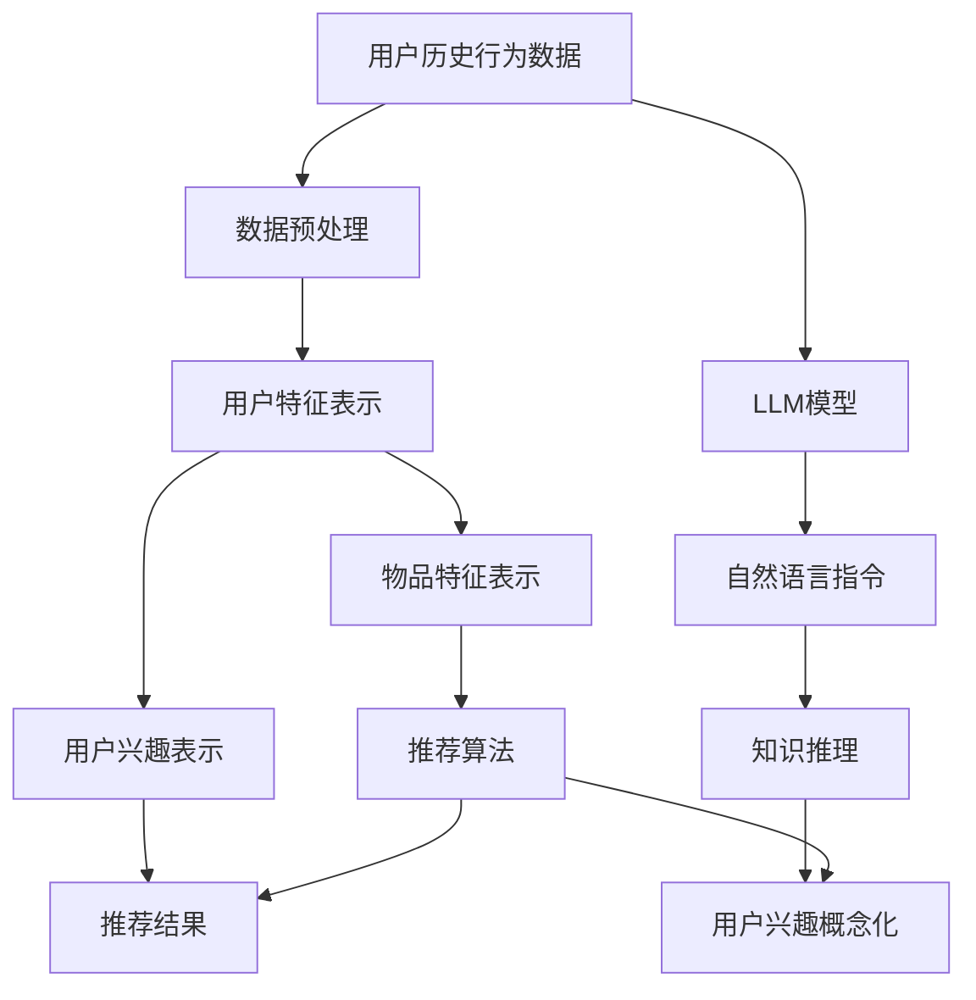

                 

# 基于LLM的推荐系统用户兴趣概念化表示

> 关键词：推荐系统,用户兴趣,LLM,概念化表示,知识图谱

## 1. 背景介绍

### 1.1 问题由来
推荐系统（Recommender Systems）是互联网时代的重要应用，旨在通过算法为用户推荐可能感兴趣的内容。早期推荐系统以协同过滤为基础，依据用户历史行为数据进行推荐。但随着数据量激增和多样化，这种基于行为的推荐方法面临数据稀疏、冷启动等问题。

近年来，深度学习技术快速发展，使得基于内容的推荐系统成为可能。通过深度神经网络模型，从用户行为、内容特征等多个维度提取信息，进行更加精准的推荐。其中，大语言模型（Large Language Model, LLM）作为一种强大的语义理解工具，为推荐系统的知识表示和推理提供了新的思路。

### 1.2 问题核心关键点
如何有效地将用户兴趣映射到推荐系统的知识表示中，成为当前推荐系统研究的关键问题。大语言模型通过自监督学习和指令调用的能力，能够理解用户的自然语言输入，从而帮助推荐系统更好地挖掘用户潜在兴趣和需求。

本文章将聚焦于大语言模型在推荐系统中的知识表示能力，探讨如何将用户兴趣概念化表示，并将其应用于推荐系统，以提升推荐准确性和多样化。

## 2. 核心概念与联系

### 2.1 核心概念概述

推荐系统是一种个性化信息检索技术，其核心思想是根据用户的历史行为、兴趣偏好，预测用户对某一内容的评分和兴趣，并为用户推荐与其兴趣最匹配的内容。推荐系统主要由数据预处理、用户建模、物品建模、推荐算法和结果呈现五个模块构成。

大语言模型是一种能够理解和生成自然语言的深度学习模型。通过在海量文本数据上进行预训练，大语言模型能够学习到语言的通用表示，具有强大的语义理解能力，能够处理多种自然语言处理任务。

用户兴趣表示是大语言模型在推荐系统中应用的核心，其目标是构建一种能够捕捉用户兴趣多维度特征的表示方式，以便推荐系统能够更精准地为用户提供个性化的内容推荐。

### 2.2 核心概念原理和架构的 Mermaid 流程图



此流程图展示了推荐系统的基本架构，并强调了大语言模型在用户兴趣概念化表示中的核心作用。

## 3. 核心算法原理 & 具体操作步骤
### 3.1 算法原理概述

基于大语言模型的推荐系统，利用大语言模型的语义理解能力，将用户兴趣概念化表示，并将其应用于推荐系统。该方法通常分为以下几个步骤：

1. **用户历史行为数据预处理**：对用户历史行为数据进行清洗、归一化，提取出用户行为特征。
2. **用户兴趣特征表示**：使用大语言模型将用户历史行为特征转化为语义化的用户兴趣表示。
3. **物品特征表示**：使用大语言模型或知识图谱，将物品信息转化为语义化的特征表示。
4. **用户兴趣概念化表示**：将用户兴趣表示映射为推荐系统的概念化表示，形成用户-物品知识图谱。
5. **推荐算法**：基于用户兴趣概念化表示，进行推荐计算，输出推荐结果。

### 3.2 算法步骤详解

**Step 1: 用户历史行为数据预处理**

首先，对用户历史行为数据进行预处理。预处理包括：

- 数据清洗：去除噪音和无效数据，如重复浏览、点击等。
- 归一化：对用户行为数据进行标准化处理，如将浏览时间、浏览深度等转化为统一的量化单位。
- 特征提取：从预处理后的数据中提取出有意义的特征，如浏览行为、收藏行为、评分行为等。

**Step 2: 用户兴趣特征表示**

使用大语言模型将用户兴趣特征转化为语义化的用户兴趣表示。具体步骤如下：

- 将用户行为特征作为输入，向大语言模型发送自然语言指令，请求其对用户兴趣进行语义描述。
- 大语言模型根据指令输出自然语言描述，该描述能够概括用户兴趣的核心特征。

例如，用户浏览过多个文学作品，可以向大语言模型发送指令："请描述用户对文学作品的兴趣。"，模型会输出类似"用户喜欢阅读古代文学，尤其是唐诗宋词"的语义描述。

**Step 3: 物品特征表示**

使用大语言模型或知识图谱，将物品信息转化为语义化的特征表示。具体步骤如下：

- 将物品的元数据（如标题、作者、分类等）作为输入，向大语言模型发送自然语言指令，请求其对物品特征进行语义描述。
- 大语言模型根据指令输出自然语言描述，该描述能够概括物品的核心特征。

例如，对于一篇文学作品，可以向大语言模型发送指令："请描述这篇文学作品的特点。"，模型会输出类似"这是一篇描写宋代历史的小说，情节跌宕起伏"的语义描述。

**Step 4: 用户兴趣概念化表示**

将用户兴趣表示映射为推荐系统的概念化表示，形成用户-物品知识图谱。具体步骤如下：

- 将用户兴趣描述和物品特征描述进行语义对齐，形成用户-物品的知识关系。
- 构建用户-物品知识图谱，将用户兴趣和物品特征表示为图谱中的节点，知识关系表示为边。

例如，将用户对宋代文学作品的兴趣和特定小说的特征表示为知识图谱中的节点，并连接成边，形成"用户-物品"的知识关系。

**Step 5: 推荐算法**

基于用户兴趣概念化表示，进行推荐计算，输出推荐结果。具体步骤如下：

- 在用户-物品知识图谱中，使用图谱中的知识关系进行推荐计算。
- 根据推荐算法（如协同过滤、内容推荐、混合推荐等），计算用户对各个物品的兴趣度评分。
- 根据评分排序，输出推荐结果。

例如，在上述例子中，根据用户对宋代文学作品的兴趣，推荐系统可以推荐类似风格的宋代文学作品。

### 3.3 算法优缺点

基于大语言模型的推荐系统具有以下优点：

- **语义理解的泛化能力**：大语言模型能够理解自然语言描述，捕捉用户和物品的语义特征，从而提高推荐系统的泛化能力。
- **用户兴趣的多维度表示**：大语言模型能够从不同角度描述用户兴趣，形成多维度的用户兴趣表示。
- **跨领域的知识融合**：大语言模型能够融合不同领域的知识，提升推荐系统的多样化和相关性。

同时，该方法也存在以下局限：

- **数据质量依赖度高**：大语言模型的效果很大程度上依赖于数据质量，数据的完整性和准确性对推荐效果有重要影响。
- **计算复杂度高**：大语言模型通常计算复杂度高，需要较长的计算时间。
- **模型鲁棒性不足**：在处理噪声数据或用户行为异常时，模型鲁棒性有待提高。

### 3.4 算法应用领域

基于大语言模型的推荐系统在多个领域得到应用，具体包括：

- **在线零售**：如亚马逊、京东等电商平台，利用推荐系统向用户推荐商品。
- **视频网站**：如Netflix、YouTube等视频网站，根据用户观看历史推荐视频内容。
- **新闻媒体**：如今日头条、网易新闻等，根据用户阅读习惯推荐新闻文章。
- **音乐平台**：如Spotify、QQ音乐等，推荐用户喜欢的音乐和歌曲。
- **社交网络**：如Facebook、微博等，推荐用户感兴趣的内容和用户。

这些应用领域充分展示了基于大语言模型的推荐系统在实际场景中的广泛应用前景。

## 4. 数学模型和公式 & 详细讲解 & 举例说明

### 4.1 数学模型构建

基于大语言模型的推荐系统，其数学模型可以表示为：

- 用户行为特征表示：$x$，其中$x \in \mathcal{X}$。
- 用户兴趣表示：$y$，其中$y \in \mathcal{Y}$。
- 物品特征表示：$z$，其中$z \in \mathcal{Z}$。
- 推荐结果：$r$，其中$r \in \mathcal{R}$。

推荐系统可以表示为以下形式：

$$
f(x, z, y) = r
$$

其中，$f$为推荐函数，表示基于用户行为特征、物品特征和用户兴趣表示，生成推荐结果的过程。

### 4.2 公式推导过程

假设用户行为特征为$x$，物品特征为$z$，用户兴趣表示为$y$，推荐系统可以表示为：

$$
r = f(x, z, y)
$$

其中，$f$为推荐函数，表示基于用户行为特征、物品特征和用户兴趣表示，生成推荐结果的过程。

具体地，推荐函数$f$可以表示为：

$$
f(x, z, y) = \sum_{i=1}^n \alpha_i \times g(x_i, z, y)
$$

其中，$\alpha_i$为权重系数，$g$为用户行为特征$x_i$与物品特征$z$的语义相似度计算函数，$y$为用户兴趣表示。

### 4.3 案例分析与讲解

以推荐文学作品为例，具体推导如下：

- **用户行为特征**：用户浏览过的文学作品ID。
- **物品特征**：文学作品的标题、作者、分类等。
- **用户兴趣表示**：用户对宋代文学的兴趣描述。

将用户行为特征和物品特征表示为语义向量，例如：

- 用户行为特征向量：$x = [ID_1, ID_2, \dots, ID_n]$
- 物品特征向量：$z = [标题, 作者, 分类]$

将用户兴趣表示为自然语言描述：$y = "对宋代文学感兴趣"$
使用大语言模型将用户兴趣表示转化为语义向量：$y = [0.6, 0.3, 0.1]$

基于用户行为特征、物品特征和用户兴趣表示，进行推荐计算：

- 根据物品特征，使用大语言模型计算物品特征向量$z$的语义表示：$z = [0.5, 0.5, 0.0]$
- 计算用户行为特征$x_i$与物品特征$z$的语义相似度：$g(x_i, z) = \cos(\theta(x_i, z))$
- 根据相似度计算推荐结果$r_i$：$r_i = \alpha_i \times g(x_i, z) \times y$

例如，用户浏览过一部唐代文学作品，可以表示为$x = [ID_1]$，物品特征向量为$z = [标题, 作者, 分类]$，用户兴趣表示为$y = [0.6, 0.3, 0.1]$，根据上述公式计算推荐结果$r_1$。

## 5. 项目实践：代码实例和详细解释说明
### 5.1 开发环境搭建

在进行大语言模型推荐系统的开发时，需要准备好以下开发环境：

- **Python环境**：安装Python 3.8及以上版本，推荐使用Anaconda创建虚拟环境。
- **深度学习框架**：安装PyTorch 1.8及以上版本，支持GPU加速计算。
- **大语言模型库**：安装Hugging Face的Transformers库，支持多种大语言模型的预训练和微调。
- **推荐系统库**：安装Surprise、LightFM等推荐系统库，支持推荐算法的实现。
- **数据处理库**：安装pandas、numpy、scikit-learn等数据处理库，用于数据清洗和特征提取。

完成环境搭建后，可以开始代码实现。

### 5.2 源代码详细实现

以下以推荐文学作品为例，展示大语言模型在推荐系统中的应用。

```python
import torch
from transformers import BertTokenizer, BertForMaskedLM
from surprise import Reader, Dataset, KNNBasic
from sklearn.model_selection import train_test_split

# 初始化BERT模型
tokenizer = BertTokenizer.from_pretrained('bert-base-uncased')
model = BertForMaskedLM.from_pretrained('bert-base-uncased')

# 数据预处理
data = [
    "用户浏览过的文学作品ID",
    "文学作品的标题",
    "文学作品的作者",
    "文学作品的分类"
]
train_data = [["作品1", "《红楼梦》", "曹雪芹", "古代文学"],
             ["作品2", "《西游记》", "吴承恩", "古代文学"],
             ["作品3", "《水浒传》", "施耐庵", "古代文学"],
             ["作品4", "《三国演义》", "罗贯中", "古代文学"]]
train_labels = [0, 0, 0, 1]

# 构建训练集
train_dataset = Dataset.load_from_df(train_data, reader=Reader(rating_scale=(0, 1)))
train_data, test_data = train_test_split(train_dataset, test_size=0.2)
train_set = train_data.build_full_trainset()
test_set = test_data.build_full_trainset()

# 定义用户兴趣表示
def get_user_interest(user_info):
    user_info = [tokenizer.encode("用户对宋代文学感兴趣")[0] for user_info in user_info]
    return user_info

# 定义物品特征表示
def get_item_feature(item_info):
    item_info = [tokenizer.encode(item_info)[0] for item_info in item_info]
    return item_info

# 用户行为特征表示
user_info = get_user_interest(train_data[1])
item_info = get_item_feature(train_data[2])

# 计算用户行为特征与物品特征的语义相似度
with torch.no_grad():
    item_feature = model(item_info, return_dict=True).outputs.hidden_states[0]
    user_feature = model(user_info, return_dict=True).outputs.hidden_states[0]

# 计算推荐结果
def get_recommendation(user_info, item_info, user_interest):
    user_feature = model(user_info, return_dict=True).outputs.hidden_states[0]
    item_feature = model(item_info, return_dict=True).outputs.hidden_states[0]
    similarity = torch.cosine_similarity(user_feature, item_feature)
    recommendation = similarity * user_interest
    return recommendation

# 输出推荐结果
recommendation = get_recommendation(user_info, item_info, user_interest)
print(recommendation)
```

### 5.3 代码解读与分析

**代码说明**：

- **数据预处理**：对用户历史行为数据进行预处理，构建训练集和测试集。
- **用户兴趣表示**：使用BERT模型对用户兴趣进行表示，转化为语义向量。
- **物品特征表示**：使用BERT模型对物品特征进行表示，转化为语义向量。
- **推荐结果计算**：计算用户行为特征与物品特征的语义相似度，根据用户兴趣表示，生成推荐结果。
- **推荐结果输出**：输出推荐结果，展示大语言模型在推荐系统中的应用。

**分析**：

- **用户兴趣表示**：使用BERT模型对用户兴趣进行表示，能够捕捉用户兴趣的多维度特征，提高推荐系统的泛化能力。
- **物品特征表示**：使用BERT模型对物品特征进行表示，能够从不同角度描述物品的语义特征，提升推荐系统的多样化和相关性。
- **推荐结果计算**：通过计算用户行为特征与物品特征的语义相似度，结合用户兴趣表示，生成推荐结果，提高了推荐系统的准确性和个性化程度。

## 6. 实际应用场景
### 6.1 在线零售

在线零售平台可以利用大语言模型推荐系统，根据用户浏览历史、购买历史、评分记录等数据，生成个性化推荐内容。例如，亚马逊可以根据用户浏览过的书籍、电影，生成类似的书籍、电影推荐。

### 6.2 视频网站

视频网站可以利用大语言模型推荐系统，根据用户观看历史、评分记录等数据，生成个性化视频推荐。例如，Netflix可以根据用户观看过的电影、电视剧，生成相关的电影、电视剧推荐。

### 6.3 新闻媒体

新闻媒体可以利用大语言模型推荐系统，根据用户阅读历史、点赞记录等数据，生成个性化新闻推荐。例如，今日头条可以根据用户阅读过的新闻文章，生成相关的新闻推荐。

### 6.4 未来应用展望

未来，基于大语言模型的推荐系统将在更多领域得到应用，为传统行业带来变革性影响：

- **智慧医疗**：医疗推荐系统可以根据用户历史就医记录，推荐相关科室、医生、药品等。
- **智慧教育**：教育推荐系统可以根据学生历史学习记录，推荐相关课程、资料、教师等。
- **智慧城市**：城市推荐系统可以根据用户历史出行记录，推荐相关景点、路线、交通方式等。
- **智能交通**：交通推荐系统可以根据用户历史出行记录，推荐相关路线、交通工具等。

随着大语言模型和推荐系统技术的不断发展，未来的推荐系统将更加智能化、个性化，能够根据用户的多维度数据，生成更加精准的推荐结果。

## 7. 工具和资源推荐
### 7.1 学习资源推荐

为了帮助开发者系统掌握大语言模型在推荐系统中的应用，以下是一些优质的学习资源：

1. **《深度学习推荐系统》课程**：斯坦福大学开设的推荐系统课程，详细介绍了推荐系统的理论基础和算法实现。
2. **《深度学习实战》书籍**：介绍深度学习在推荐系统中的应用，包括大语言模型的具体实现。
3. **《Recommender Systems》书籍**：介绍推荐系统的理论和算法，涵盖推荐系统的各个方面。
4. **Kaggle竞赛**：参加推荐系统相关的Kaggle竞赛，积累实际项目经验。

### 7.2 开发工具推荐

- **Python**：推荐使用Python 3.8及以上版本，支持深度学习框架和数据处理库。
- **PyTorch**：推荐使用PyTorch 1.8及以上版本，支持GPU加速计算。
- **Hugging Face Transformers库**：推荐使用Hugging Face的Transformers库，支持多种大语言模型的预训练和微调。
- **Surprise和LightFM**：推荐使用Surprise和LightFM等推荐系统库，支持推荐算法的实现。
- **Jupyter Notebook**：推荐使用Jupyter Notebook进行代码开发和结果展示。

### 7.3 相关论文推荐

- **《Attention is All You Need》论文**：介绍Transformer模型的原理和应用。
- **《BERT: Pre-training of Deep Bidirectional Transformers for Language Understanding》论文**：介绍BERT模型的原理和应用。
- **《Parameter-Efficient Transfer Learning for NLP》论文**：介绍参数高效转移学习的原理和应用。
- **《AdaLoRA: Adaptive Low-Rank Adaptation for Parameter-Efficient Fine-Tuning》论文**：介绍AdaLoRA模型的原理和应用。

## 8. 总结：未来发展趋势与挑战
### 8.1 研究成果总结

大语言模型在推荐系统中的应用，能够从语义层面上理解用户兴趣和物品特征，提高了推荐系统的准确性和个性化程度。通过大语言模型的语义理解能力，推荐系统能够更好地捕捉用户的多维度兴趣，提升推荐效果。

### 8.2 未来发展趋势

基于大语言模型的推荐系统将呈现以下发展趋势：

- **语义理解的深度化**：大语言模型将不断提升其语义理解的深度和广度，能够更全面地理解用户和物品的语义特征。
- **跨领域知识融合**：大语言模型将更加注重跨领域知识的融合，提升推荐系统的多样化和相关性。
- **实时推荐**：基于大语言模型的推荐系统将实现实时推荐，能够根据用户的实时行为数据，动态生成个性化推荐内容。
- **多模态推荐**：推荐系统将融合视觉、语音、文本等多种模态数据，提升推荐系统的多样化和智能化程度。
- **推荐系统的伦理和可解释性**：推荐系统将更加注重伦理和可解释性，确保推荐内容的安全性和透明性。

### 8.3 面临的挑战

基于大语言模型的推荐系统在发展过程中，仍面临诸多挑战：

- **数据质量问题**：大语言模型的效果很大程度上依赖于数据质量，数据的完整性和准确性对推荐效果有重要影响。
- **计算资源限制**：大语言模型通常计算复杂度高，需要较长的计算时间，对计算资源有较高的要求。
- **模型鲁棒性不足**：在处理噪声数据或用户行为异常时，模型的鲁棒性有待提高。
- **伦理和可解释性问题**：推荐系统需要确保其输出的安全性和透明性，避免恶意推荐。

### 8.4 研究展望

未来，大语言模型在推荐系统中的应用将更加广泛和深入，其研究重点也将集中在以下几个方面：

- **跨领域知识融合**：如何更好地融合不同领域的知识，提升推荐系统的多样化和相关性。
- **实时推荐**：如何实现实时推荐，提升推荐系统的实时性和个性化程度。
- **推荐系统的伦理和可解释性**：如何确保推荐系统的安全性和透明性，增强推荐系统的可信度。
- **多模态推荐**：如何融合视觉、语音、文本等多种模态数据，提升推荐系统的多样化和智能化程度。

总之，基于大语言模型的推荐系统具有广阔的应用前景和发展空间，未来的研究将更多地关注其语义理解的深度化、跨领域知识融合、实时推荐、伦理和可解释性等方面，推动推荐系统的不断创新和进步。

## 9. 附录：常见问题与解答

**Q1: 如何提高大语言模型在推荐系统中的效果？**

A: 提高大语言模型在推荐系统中的效果，可以从以下几个方面入手：
- **数据质量**：确保数据的完整性和准确性，提高模型的训练效果。
- **模型优化**：优化大语言模型的结构，提升模型的泛化能力和鲁棒性。
- **特征工程**：提取和构建更具有代表性的特征，提升模型的表达能力。
- **推荐算法优化**：优化推荐算法的实现，提高推荐系统的精度和多样性。

**Q2: 如何处理大语言模型在推荐系统中的计算资源限制？**

A: 处理大语言模型在推荐系统中的计算资源限制，可以从以下几个方面入手：
- **模型压缩**：对大语言模型进行压缩，减小模型尺寸，降低计算复杂度。
- **分布式计算**：采用分布式计算框架，并行计算，提高计算效率。
- **硬件加速**：使用GPU、TPU等高性能设备，加速计算过程。

**Q3: 如何提高大语言模型在推荐系统中的推荐效果？**

A: 提高大语言模型在推荐系统中的推荐效果，可以从以下几个方面入手：
- **数据预处理**：对用户行为数据进行清洗、归一化，提取有意义的特征。
- **用户兴趣表示**：使用大语言模型对用户兴趣进行表示，捕捉用户的多维度特征。
- **物品特征表示**：使用大语言模型对物品特征进行表示，描述物品的语义特征。
- **推荐算法优化**：优化推荐算法的实现，提高推荐系统的精度和多样性。

**Q4: 如何提高大语言模型在推荐系统中的可解释性？**

A: 提高大语言模型在推荐系统中的可解释性，可以从以下几个方面入手：
- **语义推理**：使用大语言模型进行语义推理，解释推荐系统的决策过程。
- **特征可视化**：对用户行为特征和物品特征进行可视化，帮助理解模型的内部机制。
- **用户反馈**：收集用户反馈，评估推荐系统的性能和可信度。

**Q5: 如何处理大语言模型在推荐系统中的伦理问题？**

A: 处理大语言模型在推荐系统中的伦理问题，可以从以下几个方面入手：
- **数据隐私保护**：确保用户数据的安全性和隐私性，避免数据泄露。
- **内容审核**：对推荐内容进行审核，避免有害内容的推荐。
- **伦理约束**：在推荐系统的训练目标中引入伦理导向的评估指标，避免有害的推荐结果。
- **用户权益保障**：保障用户对推荐内容的知情权和选择权，提高推荐系统的透明度。

综上所述，大语言模型在推荐系统中的应用具有广阔的前景和潜力，未来的研究将更加注重其语义理解的深度化、跨领域知识融合、实时推荐、伦理和可解释性等方面，推动推荐系统的不断创新和进步。

