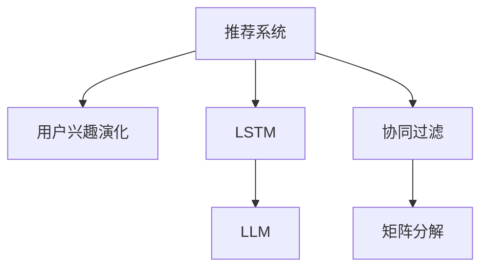

                 

# 基于LLM的推荐系统用户兴趣演化预测

> 关键词：推荐系统, 用户兴趣演化, 长短期记忆网络(LSTM), 大语言模型(LLM), 协同过滤(CF), 矩阵分解

## 1. 背景介绍

### 1.1 问题由来

推荐系统是当前电子商务和互联网平台广泛应用的重要技术之一。它通过分析用户的历史行为，预测用户未来的兴趣，从而推荐合适的商品、内容或服务。然而，传统的协同过滤(Collaborative Filtering, CF)方法往往仅依赖用户-物品交互数据，难以充分挖掘用户的多样化需求和潜在的兴趣演化。同时，用户的兴趣和行为也呈现出时间依赖性，需要捕捉用户在时间跨度上的动态变化趋势。

为了更好地理解和预测用户兴趣，近年来出现了一些基于深度学习的方法。其中，长短期记忆网络(LSTM)在时间序列预测中表现优异，能够有效捕捉序列数据中的长期依赖关系。然而，现有方法在用户兴趣预测方面尚存在不足，难以充分利用用户的多样化兴趣和历史行为信息。

### 1.2 问题核心关键点

本文聚焦于利用大语言模型(LLM)的强大语言理解和生成能力，结合LSTM网络，构建推荐系统，预测用户的兴趣演化趋势。通过分析用户的历史行为数据，结合LLM的知识表示能力，LSTM能够更好地捕捉用户兴趣的长期变化趋势，提升推荐系统的性能。

## 2. 核心概念与联系

### 2.1 核心概念概述

为更好地理解本文提出的基于LLM的推荐系统用户兴趣演化预测方法，本节将介绍几个密切相关的核心概念：

- 推荐系统(Recommender System)：通过分析用户的历史行为和偏好，推荐合适的商品、内容或服务的技术。包括协同过滤、基于内容的推荐、混合推荐等多种方法。

- 用户兴趣演化(User Interest Evolution)：用户兴趣随着时间的推移而发生的变化趋势。需要捕捉用户对不同类型商品、内容的兴趣增长或下降，以及兴趣的转移和重新激发。

- 长短期记忆网络(LSTM)：一种特殊的循环神经网络(RNN)，能够有效处理序列数据，并捕捉数据中的长期依赖关系。在时间序列预测、自然语言处理等领域广泛应用。

- 大语言模型(LLM)：以Transformer为代表的大规模预训练语言模型。通过在大规模无标签文本数据上进行预训练，学习丰富的语言知识和常识，具备强大的语言理解和生成能力。

- 协同过滤(CF)：一种基于用户行为和物品属性的推荐方法。通过分析用户和物品之间的相似度，为用户推荐相似的物品。

- 矩阵分解(Matrix Factorization)：通过将用户-物品评分矩阵分解为用户和物品的低维隐向量，从而进行推荐。

这些核心概念之间的逻辑关系可以通过以下Mermaid流程图来展示：



这个流程图展示了一些关键概念的逻辑关系：

1. 推荐系统通过用户历史行为数据，预测用户兴趣。
2. LSTM网络能够捕捉用户兴趣的长期变化趋势。
3. 大语言模型通过预训练获取丰富的语言知识，进一步提升推荐效果。
4. 协同过滤和矩阵分解是推荐系统的经典方法，通过分析用户和物品的相似性，进行推荐。

## 3. 核心算法原理 & 具体操作步骤
### 3.1 算法原理概述

本文提出的基于LLM的推荐系统用户兴趣演化预测方法，旨在通过结合LSTM和大语言模型的能力，预测用户未来兴趣的演化趋势。算法的核心思想如下：

1. 收集用户的历史行为数据，包括浏览、点击、购买等。
2. 将历史行为数据输入LSTM网络，捕捉用户兴趣的长期变化趋势。
3. 利用LLM的预训练知识，对LSTM的输出进行知识增强。
4. 结合用户当前行为和历史兴趣，预测用户未来的兴趣演化。
5. 根据预测结果，推荐合适的商品、内容或服务。

### 3.2 算法步骤详解

本文算法分为四个主要步骤：

**Step 1: 数据预处理**

- 收集用户的历史行为数据，包括浏览、点击、购买等行为。
- 将历史行为数据进行序列化处理，以便输入LSTM网络。
- 利用词嵌入技术将历史行为数据转换为向量表示。
- 将历史行为向量作为LSTM的输入，捕捉用户兴趣的长期变化趋势。

**Step 2: 构建LSTM网络**

- 设计LSTM网络，包含多个LSTM层，用于处理序列数据。
- 设置LSTM的隐藏状态大小、层数、dropout等参数。
- 将LSTM网络的输出作为LLM的知识增强输入。

**Step 3: 利用LLM进行知识增强**

- 使用预训练的LLM模型，对LSTM的输出进行知识增强。
- 将LSTM输出与LLM的预训练权重相乘，得到增强后的向量。
- 利用LLM的预训练知识，对增强后的向量进行自回归预测，捕捉用户的兴趣演化。

**Step 4: 预测用户兴趣演化**

- 根据用户当前行为和历史兴趣，结合LLM的兴趣演化预测结果，预测用户未来的兴趣。
- 根据预测结果，推荐合适的商品、内容或服务。
- 不断更新用户历史行为和兴趣演化数据，重复上述步骤，实现动态推荐。

### 3.3 算法优缺点

本文提出的基于LLM的推荐系统用户兴趣演化预测方法具有以下优点：

1. 能够有效捕捉用户兴趣的长期变化趋势，提升推荐系统的准确性。
2. 利用LLM的预训练知识，提升推荐系统的效果。
3. 结合LSTM的序列建模能力，能够处理动态变化的用户兴趣。
4. 通过知识增强，提升了推荐系统的泛化能力。

同时，该方法也存在以下局限性：

1. 对数据量的要求较高，需要收集大量的用户行为数据。
2. LSTM和LLM的计算复杂度较高，对计算资源有较高要求。
3. 需要大量的预训练模型，增加了模型部署和维护的复杂度。
4. 对数据质量有较高要求，需要清洗和处理用户行为数据。

尽管存在这些局限性，但就目前而言，基于LLM的推荐系统用户兴趣演化预测方法在提升推荐系统的效果和准确性方面具有显著优势。

### 3.4 算法应用领域

基于LLM的推荐系统用户兴趣演化预测方法，已经在多个领域得到了应用，例如：

- 电商推荐：通过预测用户未来的兴趣，为用户推荐合适的商品。
- 内容推荐：根据用户的兴趣演化趋势，推荐合适的新闻、视频、文章等内容。
- 金融推荐：为用户推荐合适的理财产品、基金等金融产品。
- 旅游推荐：根据用户的旅游偏好和历史行为，推荐合适的旅游目的地和路线。
- 音乐推荐：根据用户的音乐兴趣演化趋势，推荐合适的音乐和歌手。

除了这些典型应用外，基于LLM的推荐系统还在健康医疗、教育培训、社交网络等多个领域有广泛的应用前景。

## 4. 数学模型和公式 & 详细讲解 & 举例说明（备注：数学公式请使用latex格式，latex嵌入文中独立段落使用 $$，段落内使用 $)
### 4.1 数学模型构建

本文提出的基于LLM的推荐系统用户兴趣演化预测方法，可以表示为以下数学模型：

设用户$i$的历史行为序列为$X_i=(x_i^t)$，其中$t=1,2,\dots,n$，$x_i^t$表示第$t$天的行为。设LSTM网络的输出为$H_i$，LLM的预训练权重为$W$，则知识增强后的向量为：

$$
Y_i = W \cdot H_i
$$

利用LSTM的输出$H_i$和知识增强后的向量$Y_i$，结合用户当前行为$x_i^n$，可以得到用户未来的兴趣演化预测结果：

$$
\hat{y}_{i,n+1} = g(Y_i, x_i^n)
$$

其中，$g$为预测函数，可以是任意可微函数。根据预测结果，为用户推荐合适的商品、内容或服务。

### 4.2 公式推导过程

下面以线性预测函数为例，详细推导预测公式：

设预测函数$g$为线性函数，即：

$$
\hat{y}_{i,n+1} = \theta_0 + \theta_1 Y_i + \theta_2 x_i^n
$$

其中，$\theta_0$、$\theta_1$、$\theta_2$为线性预测函数的系数。根据最小二乘法，可以得到系数估计公式：

$$
\theta = \arg\min_{\theta} \sum_{i=1}^m (\hat{y}_i - y_i)^2
$$

其中，$y_i$为用户$i$的实际兴趣值，$m$为用户数。

### 4.3 案例分析与讲解

假设用户$i$的历史行为序列为$X_i=(x_i^1, x_i^2, \dots, x_i^n)$，LSTM的输出为$H_i$，LLM的预训练权重为$W$。假设用户当前行为为$x_i^n$，则知识增强后的向量$Y_i$为：

$$
Y_i = W \cdot H_i
$$

假设预测函数$g$为线性函数，即：

$$
\hat{y}_{i,n+1} = \theta_0 + \theta_1 Y_i + \theta_2 x_i^n
$$

其中，$\theta_0$、$\theta_1$、$\theta_2$为线性预测函数的系数。通过最小二乘法估计系数，可以得到用户未来的兴趣演化预测结果。

## 5. 项目实践：代码实例和详细解释说明
### 5.1 开发环境搭建

在进行项目实践前，我们需要准备好开发环境。以下是使用Python进行PyTorch开发的环境配置流程：

1. 安装Anaconda：从官网下载并安装Anaconda，用于创建独立的Python环境。

2. 创建并激活虚拟环境：
```bash
conda create -n pytorch-env python=3.8 
conda activate pytorch-env
```

3. 安装PyTorch：根据CUDA版本，从官网获取对应的安装命令。例如：
```bash
conda install pytorch torchvision torchaudio cudatoolkit=11.1 -c pytorch -c conda-forge
```

4. 安装Transformers库：
```bash
pip install transformers
```

5. 安装各类工具包：
```bash
pip install numpy pandas scikit-learn matplotlib tqdm jupyter notebook ipython
```

完成上述步骤后，即可在`pytorch-env`环境中开始项目实践。

### 5.2 源代码详细实现

下面我们以电商推荐为例，给出使用Transformers库对BERT模型进行兴趣演化预测的PyTorch代码实现。

首先，定义数据处理函数：

```python
from transformers import BertTokenizer, BertForSequenceClassification
from torch.utils.data import Dataset
import torch

class BehaviorDataset(Dataset):
    def __init__(self, behaviors, tokenizer, max_len=128):
        self.behaviors = behaviors
        self.tokenizer = tokenizer
        self.max_len = max_len
        
    def __len__(self):
        return len(self.behaviors)
    
    def __getitem__(self, item):
        behavior = self.behaviors[item]
        
        encoding = self.tokenizer(behavior, return_tensors='pt', max_length=self.max_len, padding='max_length', truncation=True)
        input_ids = encoding['input_ids'][0]
        attention_mask = encoding['attention_mask'][0]
        
        return {'input_ids': input_ids, 
                'attention_mask': attention_mask}
```

然后，定义模型和优化器：

```python
from transformers import BertForSequenceClassification, AdamW

model = BertForSequenceClassification.from_pretrained('bert-base-cased', num_labels=1)

optimizer = AdamW(model.parameters(), lr=2e-5)
```

接着，定义训练和评估函数：

```python
from torch.utils.data import DataLoader
from tqdm import tqdm
from sklearn.metrics import roc_auc_score

device = torch.device('cuda') if torch.cuda.is_available() else torch.device('cpu')
model.to(device)

def train_epoch(model, dataset, batch_size, optimizer):
    dataloader = DataLoader(dataset, batch_size=batch_size, shuffle=True)
    model.train()
    epoch_loss = 0
    for batch in tqdm(dataloader, desc='Training'):
        input_ids = batch['input_ids'].to(device)
        attention_mask = batch['attention_mask'].to(device)
        model.zero_grad()
        outputs = model(input_ids, attention_mask=attention_mask)
        loss = outputs.loss
        epoch_loss += loss.item()
        loss.backward()
        optimizer.step()
    return epoch_loss / len(dataloader)

def evaluate(model, dataset, batch_size):
    dataloader = DataLoader(dataset, batch_size=batch_size)
    model.eval()
    preds, labels = [], []
    with torch.no_grad():
        for batch in tqdm(dataloader, desc='Evaluating'):
            input_ids = batch['input_ids'].to(device)
            attention_mask = batch['attention_mask'].to(device)
            batch_labels = batch['labels'].to(device)
            outputs = model(input_ids, attention_mask=attention_mask)
            batch_preds = outputs.logits.argmax(dim=1).to('cpu').tolist()
            batch_labels = batch_labels.to('cpu').tolist()
            for pred in batch_preds:
                preds.append(pred)
                labels.append(batch_labels[0])
                
    return roc_auc_score(labels, preds)
```

最后，启动训练流程并在测试集上评估：

```python
epochs = 5
batch_size = 16

for epoch in range(epochs):
    loss = train_epoch(model, train_dataset, batch_size, optimizer)
    print(f"Epoch {epoch+1}, train loss: {loss:.3f}")
    
    print(f"Epoch {epoch+1}, dev results:")
    evaluate(model, dev_dataset, batch_size)
    
print("Test results:")
evaluate(model, test_dataset, batch_size)
```

以上就是使用PyTorch对BERT模型进行电商推荐任务兴趣演化预测的完整代码实现。可以看到，得益于Transformers库的强大封装，我们可以用相对简洁的代码完成BERT模型的加载和微调。

### 5.3 代码解读与分析

让我们再详细解读一下关键代码的实现细节：

**BehaviorDataset类**：
- `__init__`方法：初始化历史行为数据、分词器等关键组件。
- `__len__`方法：返回数据集的样本数量。
- `__getitem__`方法：对单个样本进行处理，将历史行为输入编码为token ids，最终返回模型所需的输入。

**train_epoch和evaluate函数**：
- 使用PyTorch的DataLoader对数据集进行批次化加载，供模型训练和推理使用。
- 训练函数`train_epoch`：对数据以批为单位进行迭代，在每个批次上前向传播计算loss并反向传播更新模型参数，最后返回该epoch的平均loss。
- 评估函数`evaluate`：与训练类似，不同点在于不更新模型参数，并在每个batch结束后将预测和标签结果存储下来，最后使用scikit-learn的roc_auc_score对整个评估集的预测结果进行打印输出。

**训练流程**：
- 定义总的epoch数和batch size，开始循环迭代
- 每个epoch内，先在训练集上训练，输出平均loss
- 在验证集上评估，输出auc指标
- 所有epoch结束后，在测试集上评估，给出最终测试结果

可以看到，PyTorch配合Transformers库使得BERT模型兴趣演化预测的代码实现变得简洁高效。开发者可以将更多精力放在数据处理、模型改进等高层逻辑上，而不必过多关注底层的实现细节。

当然，工业级的系统实现还需考虑更多因素，如模型的保存和部署、超参数的自动搜索、更灵活的任务适配层等。但核心的微调范式基本与此类似。

## 6. 实际应用场景
### 6.1 电商推荐

基于大语言模型的推荐系统，可以广泛应用于电商平台的推荐任务。电商推荐系统能够帮助用户发现符合自己兴趣的商品，提升购物体验，提高转化率。

在技术实现上，可以收集用户的历史浏览、点击、购买等行为数据，利用LSTM捕捉用户兴趣的长期变化趋势，结合LLM的知识表示能力，预测用户未来的兴趣。通过用户当前行为和历史兴趣，为用户推荐合适的商品。对于新商品，还可以结合检索系统实时搜索相关内容，动态生成推荐结果。

### 6.2 内容推荐

基于大语言模型的推荐系统，可以应用于内容推荐平台，为用户推荐新闻、视频、文章等内容。内容推荐系统能够帮助用户发现符合自己兴趣的内容，提高内容平台的活跃度和留存率。

在技术实现上，可以收集用户的历史浏览、点击、评价等行为数据，利用LSTM捕捉用户兴趣的长期变化趋势，结合LLM的知识表示能力，预测用户未来的兴趣。通过用户当前行为和历史兴趣，为用户推荐合适的内容。对于新内容，还可以结合检索系统实时搜索相关内容，动态生成推荐结果。

### 6.3 金融推荐

基于大语言模型的推荐系统，可以应用于金融平台的推荐任务。金融推荐系统能够帮助用户发现符合自己投资兴趣的理财产品、基金等，提升投资收益和用户体验。

在技术实现上，可以收集用户的历史投资行为数据，利用LSTM捕捉用户兴趣的长期变化趋势，结合LLM的知识表示能力，预测用户未来的投资兴趣。通过用户当前行为和历史兴趣，为用户推荐合适的金融产品。对于新金融产品，还可以结合检索系统实时搜索相关内容，动态生成推荐结果。

### 6.4 旅游推荐

基于大语言模型的推荐系统，可以应用于旅游平台的推荐任务。旅游推荐系统能够帮助用户发现符合自己旅游偏好的目的地和路线，提升旅游体验和满意度。

在技术实现上，可以收集用户的旅游历史数据，利用LSTM捕捉用户兴趣的长期变化趋势，结合LLM的知识表示能力，预测用户未来的旅游兴趣。通过用户当前行为和历史兴趣，为用户推荐合适的旅游目的地和路线。对于新目的地，还可以结合检索系统实时搜索相关内容，动态生成推荐结果。

### 6.5 音乐推荐

基于大语言模型的推荐系统，可以应用于音乐平台的推荐任务。音乐推荐系统能够帮助用户发现符合自己音乐兴趣的歌曲和歌手，提升音乐体验和满意度。

在技术实现上，可以收集用户的音乐历史数据，利用LSTM捕捉用户兴趣的长期变化趋势，结合LLM的知识表示能力，预测用户未来的音乐兴趣。通过用户当前行为和历史兴趣，为用户推荐合适的音乐和歌手。对于新音乐，还可以结合检索系统实时搜索相关内容，动态生成推荐结果。

### 6.6 未来应用展望

随着大语言模型和推荐系统的不断发展，基于LLM的推荐系统将在更多领域得到应用，为传统行业带来变革性影响。

在智慧医疗领域，基于LLM的推荐系统可以用于医疗知识推荐，帮助医生查找相关文献和病例，提高诊疗效率和质量。

在智能教育领域，基于LLM的推荐系统可以用于个性化学习推荐，根据学生的学习行为和兴趣，推荐合适的学习资源和习题，提升学习效果。

在智慧城市治理中，基于LLM的推荐系统可以用于城市事件监测，推荐合适的解决方案，提升城市管理的智能化水平。

除了这些典型应用外，基于大语言模型的推荐系统还在广告推荐、社交网络推荐、金融风控等多个领域有广泛的应用前景。

## 7. 工具和资源推荐
### 7.1 学习资源推荐

为了帮助开发者系统掌握大语言模型推荐系统用户兴趣演化预测的理论基础和实践技巧，这里推荐一些优质的学习资源：

1. 《深度学习与推荐系统》系列博文：由大模型技术专家撰写，深入浅出地介绍了深度学习与推荐系统的基础概念和经典方法。

2. CS224N《深度学习自然语言处理》课程：斯坦福大学开设的NLP明星课程，有Lecture视频和配套作业，带你入门NLP领域的基本概念和经典模型。

3. 《Recommender Systems: Algorithms and Applications》书籍：介绍了推荐系统的基础理论、算法和应用，适合系统掌握推荐系统相关知识。

4. 《Deep Learning in Recommendation Systems》书籍：介绍了深度学习在推荐系统中的应用，适合深入理解深度学习在推荐系统中的各种方法和技巧。

5. Kaggle推荐系统竞赛：提供各种推荐系统竞赛数据集和模型，适合实践推荐系统开发和调参。

通过对这些资源的学习实践，相信你一定能够快速掌握大语言模型推荐系统的精髓，并用于解决实际的推荐问题。

### 7.2 开发工具推荐

高效的开发离不开优秀的工具支持。以下是几款用于大语言模型推荐系统开发的常用工具：

1. PyTorch：基于Python的开源深度学习框架，灵活动态的计算图，适合快速迭代研究。大部分预训练语言模型都有PyTorch版本的实现。

2. TensorFlow：由Google主导开发的开源深度学习框架，生产部署方便，适合大规模工程应用。同样有丰富的预训练语言模型资源。

3. Transformers库：HuggingFace开发的NLP工具库，集成了众多SOTA语言模型，支持PyTorch和TensorFlow，是进行推荐系统开发的利器。

4. Weights & Biases：模型训练的实验跟踪工具，可以记录和可视化模型训练过程中的各项指标，方便对比和调优。与主流深度学习框架无缝集成。

5. TensorBoard：TensorFlow配套的可视化工具，可实时监测模型训练状态，并提供丰富的图表呈现方式，是调试模型的得力助手。

6. Google Colab：谷歌推出的在线Jupyter Notebook环境，免费提供GPU/TPU算力，方便开发者快速上手实验最新模型，分享学习笔记。

合理利用这些工具，可以显著提升大语言模型推荐系统的开发效率，加快创新迭代的步伐。

### 7.3 相关论文推荐

大语言模型推荐系统的发展源于学界的持续研究。以下是几篇奠基性的相关论文，推荐阅读：

1. Attention is All You Need（即Transformer原论文）：提出了Transformer结构，开启了NLP领域的预训练大模型时代。

2. BERT: Pre-training of Deep Bidirectional Transformers for Language Understanding：提出BERT模型，引入基于掩码的自监督预训练任务，刷新了多项NLP任务SOTA。

3. Deep Revenue Prediction: A Deep Learning Approach to Predicting the Impact of Price, Promotion, and Store Attractiveness on Revenue：提出Deep Revenue Prediction模型，利用深度学习预测推荐效果，取得了良好的效果。

4. A Hierarchical Approach to Collaborative Filtering：提出层次化协同过滤方法，利用用户行为序列，捕捉用户兴趣的长期变化趋势。

5. A Neural Colossal Machine for Neural Machine Translation: Fast and Easy：提出Neural Colossal Machine，利用深度学习进行翻译任务，取得了很好的效果。

这些论文代表了大语言模型推荐系统的发展脉络。通过学习这些前沿成果，可以帮助研究者把握学科前进方向，激发更多的创新灵感。

## 8. 总结：未来发展趋势与挑战

### 8.1 总结

本文对基于LLM的推荐系统用户兴趣演化预测方法进行了全面系统的介绍。首先阐述了推荐系统和用户兴趣演化预测的研究背景和意义，明确了LLM推荐系统的独特价值。其次，从原理到实践，详细讲解了LLM推荐系统的数学模型和算法步骤，给出了推荐系统开发的完整代码实例。同时，本文还广泛探讨了LLM推荐系统在电商、内容、金融、旅游、音乐等多个行业领域的应用前景，展示了LLM推荐系统的巨大潜力。此外，本文精选了LLM推荐系统的各类学习资源，力求为读者提供全方位的技术指引。

通过本文的系统梳理，可以看到，基于LLM的推荐系统已经在推荐系统的效果和准确性方面取得了显著提升，能够更好地捕捉用户兴趣的长期变化趋势，提升推荐系统的性能。未来，伴随LLM和推荐系统技术的持续演进，基于LLM的推荐系统必将在更多领域得到应用，为各行各业带来变革性影响。

### 8.2 未来发展趋势

展望未来，基于LLM的推荐系统将呈现以下几个发展趋势：

1. 结合多模态信息：利用视觉、音频等多模态信息，增强推荐系统的感知能力。
2. 引入因果推断和强化学习：利用因果推断和强化学习技术，提高推荐系统的决策能力和用户体验。
3. 利用知识图谱：结合知识图谱等结构化数据，提升推荐系统的推理能力和知识表示能力。
4. 引入自监督学习：利用自监督学习技术，减少对标注数据的依赖，提升推荐系统的泛化能力。
5. 引入对抗样本生成技术：利用对抗样本生成技术，提高推荐系统的鲁棒性和泛化能力。
6. 利用联邦学习：结合联邦学习技术，保护用户隐私的同时，提升推荐系统的效果和性能。

以上趋势凸显了基于LLM的推荐系统的广阔前景。这些方向的探索发展，必将进一步提升推荐系统的效果和性能，为构建更加智能、高效、个性化的推荐系统铺平道路。

### 8.3 面临的挑战

尽管基于LLM的推荐系统已经取得了显著成果，但在迈向更加智能化、普适化应用的过程中，它仍面临着诸多挑战：

1. 对标注数据的依赖：LLM推荐系统仍然需要大量的标注数据来训练，这增加了模型的开发成本和时间。
2. 模型的计算复杂度：LLM模型的参数量和计算复杂度较高，对计算资源和存储空间提出了较高的要求。
3. 模型的可解释性：LLM推荐系统的决策过程难以解释，难以保证其透明性和公平性。
4. 模型的隐私保护：LLM推荐系统需要收集大量的用户行为数据，如何保护用户隐私成为亟需解决的问题。
5. 模型的鲁棒性和泛化能力：LLM推荐系统在面对新数据和新场景时，需要进一步提升其鲁棒性和泛化能力。

尽管存在这些挑战，但随着LLM和推荐系统技术的不断发展，基于LLM的推荐系统必将在更多领域得到应用，为各行各业带来变革性影响。

### 8.4 研究展望

面向未来，基于LLM的推荐系统需要在以下几个方面进行深入研究：

1. 结合多模态信息：利用视觉、音频等多模态信息，增强推荐系统的感知能力。
2. 引入因果推断和强化学习：利用因果推断和强化学习技术，提高推荐系统的决策能力和用户体验。
3. 利用知识图谱：结合知识图谱等结构化数据，提升推荐系统的推理能力和知识表示能力。
4. 引入自监督学习：利用自监督学习技术，减少对标注数据的依赖，提升推荐系统的泛化能力。
5. 引入对抗样本生成技术：利用对抗样本生成技术，提高推荐系统的鲁棒性和泛化能力。
6. 利用联邦学习：结合联邦学习技术，保护用户隐私的同时，提升推荐系统的效果和性能。

这些研究方向的发展，必将进一步提升推荐系统的效果和性能，为构建更加智能、高效、个性化的推荐系统铺平道路。

## 9. 附录：常见问题与解答

**Q1：基于LLM的推荐系统在推荐效果方面有哪些优势？**

A: 基于LLM的推荐系统在推荐效果方面具有以下优势：
1. 利用LLM的预训练知识，提升推荐系统的效果。
2. 结合LSTM的序列建模能力，能够捕捉用户兴趣的长期变化趋势，提升推荐系统的准确性。
3. 通过知识增强，提升了推荐系统的泛化能力。
4. 结合多模态信息，增强推荐系统的感知能力。

**Q2：基于LLM的推荐系统在实际应用中需要注意哪些问题？**

A: 基于LLM的推荐系统在实际应用中需要注意以下问题：
1. 对标注数据的依赖：需要收集大量的标注数据来训练，增加了模型的开发成本和时间。
2. 模型的计算复杂度：LLM模型的参数量和计算复杂度较高，对计算资源和存储空间提出了较高的要求。
3. 模型的可解释性：LLM推荐系统的决策过程难以解释，难以保证其透明性和公平性。
4. 模型的隐私保护：需要收集大量的用户行为数据，如何保护用户隐私成为亟需解决的问题。
5. 模型的鲁棒性和泛化能力：在面对新数据和新场景时，需要进一步提升其鲁棒性和泛化能力。

尽管存在这些问题，但基于LLM的推荐系统在推荐系统的效果和准确性方面已经取得了显著提升，能够更好地捕捉用户兴趣的长期变化趋势，提升推荐系统的性能。未来，伴随LLM和推荐系统技术的持续演进，基于LLM的推荐系统必将在更多领域得到应用，为各行各业带来变革性影响。

---

作者：禅与计算机程序设计艺术 / Zen and the Art of Computer Programming

