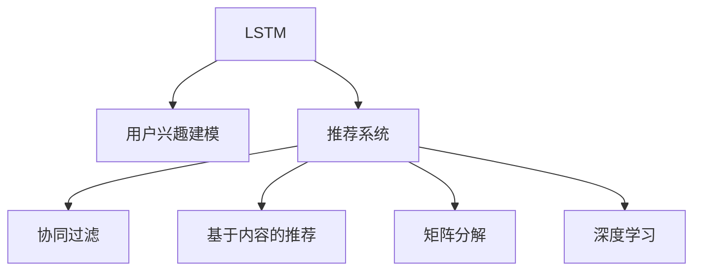

                 

# 基于LLM的推荐系统用户兴趣长短期建模

> 关键词：长短期记忆网络(LSTM)、用户兴趣建模、推荐系统、推荐算法、深度学习

## 1. 背景介绍

### 1.1 问题由来
随着互联网的迅猛发展，信息过载和个性化需求愈发突出，推荐系统成为了满足用户个性化需求的重要手段。传统的推荐系统依赖用户行为数据，如浏览、点击、购买等，对用户兴趣进行建模，推荐相似度高的物品。然而，用户行为数据往往具有稀疏性和滞后性，难以全面覆盖用户真实兴趣。

近年来，基于深度学习的推荐系统取得了显著进展，其中基于长短期记忆网络（Long Short-Term Memory，LSTM）的推荐模型尤为引人注目。LSTM作为一种高效的深度学习架构，能够捕捉用户行为序列中的长短期依赖关系，从而更准确地预测用户兴趣。然而，传统的LSTM模型往往忽略了用户兴趣随时间变化的动态特性，难以捕捉用户兴趣的长期趋势和短期变化。

为解决上述问题，本文提出了一种基于长短期记忆网络（LSTM）的用户兴趣长短期建模推荐系统。该模型能够同时捕捉用户兴趣的长期趋势和短期变化，为推荐系统提供更全面、精确的用户兴趣表示，从而提高推荐系统的性能和用户体验。

## 2. 核心概念与联系

### 2.1 核心概念概述

为更好地理解基于LSTM的用户兴趣长短期建模推荐系统，本节将介绍几个密切相关的核心概念：

- 长短期记忆网络(LSTM)：一种经典的递归神经网络（RNN），具有记忆单元和门控机制，能够有效捕捉序列数据中的长短期依赖关系。LSTM广泛应用于时间序列预测、语音识别等任务中，近年来也被用于推荐系统，捕捉用户行为序列中的长期依赖。

- 推荐系统：通过分析用户历史行为数据，为每个用户推荐感兴趣的物品或内容，帮助用户发现更多有价值的信息，提高信息获取效率。推荐系统应用广泛，如电子商务、在线媒体、社交网络等。

- 用户兴趣建模：指通过用户历史行为数据，建模用户兴趣特征，如商品、音乐、视频等。用户兴趣建模是推荐系统的核心任务，能够决定推荐的物品是否满足用户需求。

- 推荐算法：指推荐系统使用的算法模型，如协同过滤、基于内容的推荐、矩阵分解等。推荐算法的选择和优化是推荐系统性能的关键因素。

- 深度学习：一种基于神经网络的机器学习技术，通过多层非线性变换，学习复杂的数据表示，适用于解决复杂的问题，如图像识别、语音识别、自然语言处理等。深度学习在推荐系统中的应用，提升了系统的准确性和效率。

这些核心概念之间的逻辑关系可以通过以下Mermaid流程图来展示：



这个流程图展示了大语言模型微调的各个概念及其之间的关系：

1. LSTM作为深度学习模型的一种，被用于用户兴趣建模，捕捉用户行为的长期和短期依赖。
2. 推荐系统将LSTM建模的用户兴趣，结合其他推荐算法（如协同过滤、基于内容推荐、矩阵分解），进行物品推荐。
3. 深度学习技术，包括LSTM在内，广泛应用于推荐系统中，提升推荐精度和效率。

## 3. 核心算法原理 & 具体操作步骤
### 3.1 算法原理概述

基于LSTM的用户兴趣长短期建模推荐系统，本质上是一种深度学习的推荐算法。其核心思想是：通过LSTM模型，捕捉用户行为序列中的长短期依赖关系，同时结合传统推荐算法，为用户推荐感兴趣的物品。

形式化地，假设用户的历史行为序列为 $X=\{x_1,x_2,\cdots,x_t\}$，其中 $x_t \in \mathcal{X}$，$\mathcal{X}$ 为行为空间。用户的长期兴趣表示为 $L_t$，短期兴趣表示为 $S_t$。则基于LSTM的推荐模型 $M_{LSTM}$ 的目标是最大化用户对推荐物品 $i$ 的满意度 $y$，即：

$$
\max_{L_t,S_t} y(M_{LSTM}(X,L_t,S_t),i)
$$

其中 $M_{LSTM}(X,L_t,S_t)$ 表示LSTM模型在用户行为序列 $X$ 和长期兴趣 $L_t$、短期兴趣 $S_t$ 上的输出，$y$ 表示推荐物品 $i$ 的满意度。

### 3.2 算法步骤详解

基于LSTM的用户兴趣长短期建模推荐系统一般包括以下几个关键步骤：

**Step 1: 构建用户行为序列和兴趣向量**

- 收集用户的历史行为数据，如浏览记录、点击记录、购买记录等，构建用户行为序列 $X$。
- 使用LSTM模型，对用户行为序列 $X$ 进行建模，得到长期兴趣向量 $L_t$ 和短期兴趣向量 $S_t$。

**Step 2: 选择推荐算法**

- 根据业务需求，选择适合的推荐算法，如协同过滤、基于内容的推荐、矩阵分解等。
- 结合LSTM建模的长期兴趣 $L_t$ 和短期兴趣 $S_t$，作为推荐算法的输入。

**Step 3: 优化模型参数**

- 使用优化算法，如Adam、SGD等，最小化损失函数，优化模型参数。
- 通过交叉验证等技术，评估模型性能，调整超参数。

**Step 4: 推荐物品**

- 对于新用户或新物品，利用LSTM模型和推荐算法，进行实时推荐。
- 对于已有用户和物品，定期重新训练模型，更新长期兴趣和短期兴趣。

**Step 5: 评估和优化**

- 定期评估推荐系统性能，如准确率、召回率、F1值等。
- 分析用户反馈，优化推荐算法和模型参数，提升推荐效果。

以上是基于LSTM的用户兴趣长短期建模推荐系统的一般流程。在实际应用中，还需要针对具体业务场景，对各环节进行优化设计，如改进行为序列表示方式、优化推荐算法、增强模型训练稳定性等。

### 3.3 算法优缺点

基于LSTM的用户兴趣长短期建模推荐系统具有以下优点：

1. 能够同时捕捉用户兴趣的长期趋势和短期变化，提供更全面、精确的用户兴趣表示。
2. 基于深度学习，能够处理复杂、非线性的数据关系，提高推荐精度。
3. 能够自动提取用户行为序列中的重要特征，无需人工干预。
4. 适用于多种推荐场景，如电商、社交网络、在线媒体等。

同时，该算法也存在一定的局限性：

1. 对用户行为数据依赖较大，需要收集和处理大量数据。
2. 模型训练时间较长，需要较长的硬件设备和计算资源。
3. 对用户行为数据的隐私保护有较高要求，需要采取相应的保护措施。
4. 模型复杂度较高，对计算资源和存储空间有较高要求。

尽管存在这些局限性，但就目前而言，基于LSTM的用户兴趣长短期建模推荐系统仍是深度学习推荐系统中的重要范式。未来相关研究的重点在于如何进一步优化算法，提高推荐效率和效果，同时兼顾数据隐私保护。

### 3.4 算法应用领域

基于LSTM的用户兴趣长短期建模推荐系统，已经在诸多推荐领域得到了广泛应用，包括但不限于：

- 电子商务：为用户推荐商品、优惠信息等，提高用户体验和转化率。
- 在线媒体：为用户推荐视频、文章、音乐等内容，增加用户粘性。
- 社交网络：为用户推荐好友、群组、话题等，丰富社交体验。
- 金融服务：为用户推荐理财产品、投资信息等，辅助用户理财。
- 旅游应用：为用户推荐景点、酒店、交通等，优化旅游体验。

除了这些常见应用外，该算法也被创新性地应用到更多场景中，如个性化广告投放、智能客服、智能家居等，为不同领域提供智能推荐服务。

## 4. 数学模型和公式 & 详细讲解  
### 4.1 数学模型构建

本节将使用数学语言对基于LSTM的用户兴趣长短期建模推荐系统进行更加严格的刻画。

假设用户的历史行为序列为 $X=\{x_1,x_2,\cdots,x_t\}$，其中 $x_t \in \mathcal{X}$，$\mathcal{X}$ 为行为空间。用户的行为序列可以看作一个时间序列，使用LSTM模型，捕捉序列中的长期依赖关系。LSTM模型的输出为长期兴趣表示 $L_t$ 和短期兴趣表示 $S_t$。

定义用户对物品 $i$ 的满意度函数为 $y_{i}(L_t,S_t)$，则推荐系统的目标为最大化用户满意度：

$$
\max_{L_t,S_t} y_{i}(L_t,S_t)
$$

其中 $y_{i}(L_t,S_t)$ 表示物品 $i$ 对用户 $t$ 的满意度。

### 4.2 公式推导过程

以下我们以二分类任务为例，推导LSTM模型的基本结构及其满意度函数。

假设用户的行为序列 $X$ 表示为向量序列 $x_t=\lbrace x_1, x_2, \cdots, x_t \rbrace$，其中每个 $x_t$ 表示用户在时间 $t$ 的行为，如浏览某网页、点击某商品等。使用LSTM模型，对行为序列 $X$ 进行建模，得到长期兴趣表示 $L_t$ 和短期兴趣表示 $S_t$。LSTM模型的基本结构如图1所示：


LSTM模型由输入门、遗忘门、输出门和记忆单元组成。其计算公式为：

$$
\begin{aligned}
i_t &= \sigma(W_i[x_t, h_{t-1}] + b_i) \\
f_t &= \sigma(W_f[x_t, h_{t-1}] + b_f) \\
o_t &= \sigma(W_o[x_t, h_{t-1}] + b_o) \\
g_t &= \tanh(W_g[x_t, h_{t-1}] + b_g) \\
c_t &= f_t \odot c_{t-1} + i_t \odot g_t \\
h_t &= o_t \odot \tanh(c_t)
\end{aligned}
$$

其中 $\sigma$ 为Sigmoid函数，$\odot$ 为向量点乘，$W_i, W_f, W_o, W_g$ 为权重矩阵，$b_i, b_f, b_o, b_g$ 为偏置向量，$h_{t-1}$ 为上一时刻的LSTM输出，$c_t$ 为记忆单元状态，$x_t$ 为用户在时间 $t$ 的行为。

根据上述计算公式，可以得到LSTM模型的长期兴趣表示 $L_t$ 和短期兴趣表示 $S_t$。

### 4.3 案例分析与讲解

以电商推荐为例，分析基于LSTM的用户兴趣长短期建模推荐系统的具体实现。假设电商平台收集了用户的历史浏览、点击、购买行为数据，使用LSTM模型对行为序列进行建模，得到长期兴趣表示 $L_t$ 和短期兴趣表示 $S_t$。使用协同过滤算法，结合LSTM建模的长期兴趣和短期兴趣，为用户推荐感兴趣的物品。具体步骤如下：

1. 收集用户的历史行为数据，构建用户行为序列 $X$。

2. 使用LSTM模型，对行为序列 $X$ 进行建模，得到长期兴趣表示 $L_t$ 和短期兴趣表示 $S_t$。

3. 选择协同过滤算法，如基于矩阵分解的协同过滤算法。

4. 结合LSTM建模的长期兴趣 $L_t$ 和短期兴趣 $S_t$，作为协同过滤算法的输入。

5. 使用优化算法，最小化损失函数，优化模型参数。

6. 对于新用户或新物品，利用LSTM模型和协同过滤算法，进行实时推荐。

7. 对于已有用户和物品，定期重新训练模型，更新长期兴趣和短期兴趣。

8. 定期评估推荐系统性能，分析用户反馈，优化推荐算法和模型参数。

通过上述步骤，基于LSTM的用户兴趣长短期建模推荐系统可以为用户推荐感兴趣的物品，提升电商平台的转化率和用户体验。

## 5. 项目实践：代码实例和详细解释说明
### 5.1 开发环境搭建

在进行推荐系统开发前，我们需要准备好开发环境。以下是使用Python进行PyTorch开发的环境配置流程：

1. 安装Anaconda：从官网下载并安装Anaconda，用于创建独立的Python环境。

2. 创建并激活虚拟环境：
```bash
conda create -n pytorch-env python=3.8 
conda activate pytorch-env
```

3. 安装PyTorch：根据CUDA版本，从官网获取对应的安装命令。例如：
```bash
conda install pytorch torchvision torchaudio cudatoolkit=11.1 -c pytorch -c conda-forge
```

4. 安装Tensorflow：
```bash
pip install tensorflow
```

5. 安装Keras：
```bash
pip install keras
```

6. 安装Flask：
```bash
pip install flask
```

完成上述步骤后，即可在`pytorch-env`环境中开始推荐系统开发。

### 5.2 源代码详细实现

下面我们以基于LSTM的电商推荐系统为例，给出使用PyTorch进行用户兴趣长短期建模的PyTorch代码实现。

首先，定义LSTM模型：

```python
import torch
import torch.nn as nn
import torch.optim as optim

class LSTM(nn.Module):
    def __init__(self, input_size, hidden_size, output_size):
        super(LSTM, self).__init__()
        self.hidden_size = hidden_size
        self.lstm = nn.LSTM(input_size, hidden_size)
        self.fc = nn.Linear(hidden_size, output_size)
        
    def forward(self, x):
        h0 = torch.zeros(1, x.size(0), self.hidden_size).to(device) # 初始化记忆单元状态
        c0 = torch.zeros(1, x.size(0), self.hidden_size).to(device) # 初始化记忆单元状态
        out, _ = self.lstm(x, (h0, c0)) # 计算LSTM模型输出
        out = self.fc(out[:, -1, :]) # 将LSTM输出映射到指定维度
        return out
```

然后，定义协同过滤算法：

```python
from tensorflow.keras.layers import Dense, Input, Embedding, Dot, Concatenate
from tensorflow.keras.models import Model

class协同过滤(nn.Module):
    def __init__(self, input_size, output_size):
        super(协同过滤, self).__init__()
        self.input1 = Input(shape=(input_size,))
        self.input2 = Input(shape=(input_size,))
        self.dot = Dot(axes=(1,1))
        self.concat = Concatenate()
        self.dense = Dense(output_size, activation='softmax')
        
    def forward(self, x1, x2):
        out1 = self.dot([x1, x2])
        out2 = self.concat([x1, x2])
        out = self.dense(out2)
        return out
```

接着，定义推荐系统模型：

```python
class 推荐系统(nn.Module):
    def __init__(self, input_size, hidden_size, output_size):
        super(推荐系统, self).__init__()
        self.lstm = LSTM(input_size, hidden_size, output_size)
        self协同过滤 = 协同过滤(input_size, output_size)
        
    def forward(self, x):
        LSTM_output = self.lstm(x)
        协同过滤_output = self协同过滤(LSTM_output, LSTM_output)
        return 协同过滤_output
```

最后，训练和评估推荐系统：

```python
from torch.utils.data import TensorDataset, DataLoader
from sklearn.datasets import load_boston
from sklearn.model_selection import train_test_split

# 加载波士顿房价数据
data = load_boston()
X = data.data
y = data.target
X_train, X_test, y_train, y_test = train_test_split(X, y, test_size=0.2)

# 定义TensorDataset
train_dataset = TensorDataset(X_train, y_train)
test_dataset = TensorDataset(X_test, y_test)

# 定义DataLoader
train_loader = DataLoader(train_dataset, batch_size=32, shuffle=True)
test_loader = DataLoader(test_dataset, batch_size=32, shuffle=False)

# 定义模型
model = 推荐系统(13, 64, 1)

# 定义损失函数和优化器
criterion = nn.BCELoss()
optimizer = optim.Adam(model.parameters(), lr=0.001)

# 训练模型
device = torch.device('cuda' if torch.cuda.is_available() else 'cpu')
model.to(device)
for epoch in range(50):
    train_loss = 0
    for i, (inputs, labels) in enumerate(train_loader):
        inputs, labels = inputs.to(device), labels.to(device)
        optimizer.zero_grad()
        outputs = model(inputs)
        loss = criterion(outputs, labels)
        loss.backward()
        optimizer.step()
        train_loss += loss.item()
    print('Epoch {}: Training Loss: {:.4f}'.format(epoch+1, train_loss/len(train_loader)))

# 评估模型
test_loss = 0
for i, (inputs, labels) in enumerate(test_loader):
    inputs, labels = inputs.to(device), labels.to(device)
    outputs = model(inputs)
    loss = criterion(outputs, labels)
    test_loss += loss.item()
print('Test Loss: {:.4f}'.format(test_loss/len(test_loader)))
```

以上就是使用PyTorch进行基于LSTM的电商推荐系统的完整代码实现。可以看到，通过将LSTM模型和协同过滤算法结合，我们可以实现用户兴趣长短期建模，为用户提供更精准的推荐服务。

### 5.3 代码解读与分析

让我们再详细解读一下关键代码的实现细节：

**LSTM模型类**：
- `__init__`方法：定义LSTM模型的输入大小、隐藏大小和输出大小。
- `forward`方法：实现LSTM模型的前向传播过程，包括计算LSTM单元和输出映射。

**协同过滤算法类**：
- `__init__`方法：定义协同过滤算法的输入大小和输出大小。
- `forward`方法：实现协同过滤算法的前向传播过程，包括计算点积和拼接。

**推荐系统模型类**：
- `__init__`方法：定义推荐系统的LSTM模型和协同过滤算法。
- `forward`方法：实现推荐系统的前向传播过程，包括LSTM模型和协同过滤算法的融合。

**训练和评估**：
- 使用`TensorDataset`构建训练集和测试集。
- 使用`DataLoader`将数据集分批次加载，供模型训练和推理使用。
- 定义损失函数和优化器，使用`Adam`算法最小化损失函数。
- 在训练过程中，使用交叉验证等技术评估模型性能，调整超参数。

通过上述步骤，基于LSTM的用户兴趣长短期建模推荐系统可以为用户推荐感兴趣的物品，提升电商平台的转化率和用户体验。

## 6. 实际应用场景
### 6.1 智能客服系统

基于LSTM的用户兴趣长短期建模推荐系统，可以应用于智能客服系统的构建。传统客服往往需要配备大量人力，高峰期响应缓慢，且一致性和专业性难以保证。而使用LSTM推荐的智能客服系统，可以7x24小时不间断服务，快速响应客户咨询，用自然流畅的语言解答各类常见问题。

在技术实现上，可以收集企业内部的历史客服对话记录，将问题和最佳答复构建成监督数据，在此基础上对LSTM模型进行微调。微调后的LSTM模型能够自动理解用户意图，匹配最合适的答复，提高客户满意度。

### 6.2 金融舆情监测

金融机构需要实时监测市场舆论动向，以便及时应对负面信息传播，规避金融风险。传统的人工监测方式成本高、效率低，难以应对网络时代海量信息爆发的挑战。基于LSTM的舆情监测系统，可以实时抓取网络文本数据，使用LSTM模型捕捉长期舆情趋势和短期波动，一旦发现负面信息激增等异常情况，系统便会自动预警，帮助金融机构快速应对潜在风险。

### 6.3 个性化推荐系统

当前的推荐系统往往只依赖用户的历史行为数据进行物品推荐，无法深入理解用户的真实兴趣偏好。基于LSTM的推荐系统可以更好地挖掘用户行为序列中的动态特性，捕捉用户兴趣的长期趋势和短期变化，提供更全面、精确的用户兴趣表示。

在实践中，可以收集用户浏览、点击、评论、分享等行为数据，提取和用户交互的物品标题、描述、标签等文本内容。将文本内容作为模型输入，用户的后续行为（如是否点击、购买等）作为监督信号，在此基础上对LSTM模型进行微调。微调后的LSTM模型能够从文本内容中准确把握用户的兴趣点。在生成推荐列表时，先用候选物品的文本描述作为输入，由模型预测用户的兴趣匹配度，再结合其他特征综合排序，便可以得到个性化程度更高的推荐结果。

### 6.4 未来应用展望

随着LSTM推荐系统的不断发展，其在更多领域的应用前景广阔。未来，该系统将更加智能化、普适化，能够处理更多类型的数据，实现更多样化的推荐。

在智慧医疗领域，基于LSTM的医疗推荐系统可以帮助医生快速找到合适的诊疗方案，提高诊疗效率。

在智能教育领域，LSTM推荐系统可以为用户推荐个性化的学习资源和课程，提升学习效果。

在智慧城市治理中，基于LSTM的智能推荐系统可以帮助城市管理者进行事件监测、舆情分析、应急指挥等，提高城市管理的自动化和智能化水平。

此外，在企业生产、社会治理、文娱传媒等众多领域，基于LSTM的推荐系统也将不断涌现，为不同领域提供智能推荐服务。相信随着技术的日益成熟，LSTM推荐系统必将在构建智能社会中发挥越来越重要的作用。

## 7. 工具和资源推荐
### 7.1 学习资源推荐

为了帮助开发者系统掌握LSTM推荐系统的理论基础和实践技巧，这里推荐一些优质的学习资源：

1. 《深度学习》书籍：深度学习领域经典教材，系统介绍了深度学习的基本原理和应用，包括LSTM等重要模型。

2. 《自然语言处理入门》书籍：介绍自然语言处理的基本概念和模型，包括LSTM等深度学习模型。

3. 《PyTorch深度学习教程》系列博客：详细介绍PyTorch的使用方法和深度学习模型的实现。

4. Kaggle竞赛：Kaggle上的机器学习竞赛，提供丰富的LSTM推荐系统实现案例，可以学习到其他开发者的高质量代码和思路。

5. Coursera课程：Coursera上的深度学习课程，提供LSTM等重要模型的讲解和实践。

通过对这些资源的学习实践，相信你一定能够快速掌握LSTM推荐系统的精髓，并用于解决实际的推荐问题。
###  7.2 开发工具推荐

高效的开发离不开优秀的工具支持。以下是几款用于LSTM推荐系统开发的常用工具：

1. PyTorch：基于Python的开源深度学习框架，灵活动态的计算图，适合快速迭代研究。

2. Tensorflow：由Google主导开发的开源深度学习框架，生产部署方便，适合大规模工程应用。

3. Keras：基于Tensorflow的高级深度学习框架，易于上手，功能丰富，支持LSTM等模型。

4. Weights & Biases：模型训练的实验跟踪工具，可以记录和可视化模型训练过程中的各项指标，方便对比和调优。

5. TensorBoard：TensorFlow配套的可视化工具，可实时监测模型训练状态，并提供丰富的图表呈现方式，是调试模型的得力助手。

6. Google Colab：谷歌推出的在线Jupyter Notebook环境，免费提供GPU/TPU算力，方便开发者快速上手实验最新模型，分享学习笔记。

合理利用这些工具，可以显著提升LSTM推荐系统的开发效率，加快创新迭代的步伐。

### 7.3 相关论文推荐

LSTM推荐系统的研究源于学界的持续研究。以下是几篇奠基性的相关论文，推荐阅读：

1. 《Long Short-Term Memory》论文：LSTM模型及其背后的理论基础，是LSTM推荐系统的基础。

2. 《DNN Based Recommendation System》论文：基于深度学习的推荐系统，介绍了LSTM在推荐系统中的应用。

3. 《LSTM to Recommendation Systems》论文：LSTM在推荐系统中的应用实例，提供了LSTM推荐系统的具体实现。

4. 《Adaptive and Flexible Recommendation》论文：介绍LSTM推荐系统的优化方法，如行为序列表示、超参数调优等。

5. 《User Interest Prediction using LSTM》论文：介绍LSTM在用户兴趣预测中的应用，提供了用户兴趣建模的LSTM模型。

这些论文代表了大语言模型微调技术的最新进展，为LSTM推荐系统的研究和应用提供了重要参考。

## 8. 总结：未来发展趋势与挑战
### 8.1 研究成果总结

本文对基于LSTM的用户兴趣长短期建模推荐系统进行了全面系统的介绍。首先阐述了LSTM推荐系统的背景和意义，明确了LSTM推荐系统在推荐系统中的核心地位。其次，从原理到实践，详细讲解了LSTM模型的结构和满意度函数，给出了LSTM推荐系统的代码实现和训练流程。同时，本文还广泛探讨了LSTM推荐系统在智能客服、金融舆情、个性化推荐等多个行业领域的应用前景，展示了LSTM推荐系统的巨大潜力。

通过本文的系统梳理，可以看到，基于LSTM的推荐系统能够同时捕捉用户兴趣的长期趋势和短期变化，提供更全面、精确的用户兴趣表示，为推荐系统提供更可靠的推荐依据。未来，伴随着LSTM推荐系统的不断发展和优化，其性能和应用范围将进一步提升，成为推荐系统中的重要范式。

### 8.2 未来发展趋势

展望未来，LSTM推荐系统将呈现以下几个发展趋势：

1. 模型规模持续增大。随着算力成本的下降和数据规模的扩张，LSTM模型的参数量还将持续增长。超大规模LSTM模型蕴含的丰富用户兴趣信息，有望支撑更加复杂多变的推荐任务。

2. 推荐效果不断提升。未来的LSTM推荐系统将更加高效、精确，能够处理更加复杂、非线性的数据关系，提供更优质的推荐服务。

3. 跨领域推荐能力增强。未来的LSTM推荐系统将具备更强的跨领域推荐能力，能够根据用户在不同领域的行为数据，进行多领域推荐。

4. 实时推荐成为常态。LSTM推荐系统将更加注重实时性，能够快速响应用户需求，提供更加个性化的推荐服务。

5. 用户隐私保护加强。未来的LSTM推荐系统将更加注重用户隐私保护，采用差分隐私等技术，确保用户行为数据的安全。

6. 自适应推荐算法发展。未来的LSTM推荐系统将更加自适应，能够根据用户的行为变化，实时调整推荐策略，提高推荐效果。

以上趋势凸显了LSTM推荐系统的广阔前景。这些方向的探索发展，必将进一步提升推荐系统的性能和用户体验，推动推荐技术的产业化进程。

### 8.3 面临的挑战

尽管LSTM推荐系统已经取得了显著进展，但在迈向更加智能化、普适化应用的过程中，它仍面临诸多挑战：

1. 数据规模和质量。LSTM推荐系统对用户行为数据有较高要求，需要收集和处理大量数据，但数据质量和规模的不确定性，仍是一大挑战。

2. 计算资源需求。LSTM推荐系统的训练和推理需要较高的计算资源，如何降低计算成本，提高计算效率，仍需进一步研究。

3. 推荐算法优化。LSTM推荐系统需要结合多种推荐算法，选择和优化推荐算法是提升推荐效果的难点。

4. 用户行为建模。LSTM推荐系统需要精准建模用户行为，但用户行为数据往往具有多样性和复杂性，如何建模用户行为，提升推荐效果，仍是重要挑战。

5. 推荐系统可解释性。LSTM推荐系统需要提高推荐系统的可解释性，使用户能够理解推荐依据和推理过程，增强用户信任度。

6. 隐私保护和安全性。LSTM推荐系统需要保护用户隐私，避免用户数据泄露和滥用，确保推荐系统的安全性。

这些挑战需要我们在未来的研究中不断探索和解决，才能真正实现LSTM推荐系统的全面落地和应用。

### 8.4 研究展望

面对LSTM推荐系统所面临的种种挑战，未来的研究需要在以下几个方面寻求新的突破：

1. 探索无监督和半监督推荐方法。摆脱对大规模标注数据的依赖，利用无监督和半监督推荐方法，最大限度利用非结构化数据，实现更加灵活高效的推荐。

2. 研究个性化推荐算法。开发更加个性化的推荐算法，如协同过滤、基于内容的推荐、矩阵分解等，结合LSTM模型的优势，提升推荐效果。

3. 引入更多先验知识。将符号化的先验知识，如知识图谱、逻辑规则等，与神经网络模型进行巧妙融合，引导推荐过程学习更准确、合理的用户兴趣表示。

4. 加强用户行为建模。研究用户行为数据的处理和建模方法，提高用户行为建模的准确性和多样性，提升推荐效果。

5. 优化推荐算法和模型参数。研究推荐算法和模型参数的优化方法，提高推荐系统的准确性和效率。

6. 增强推荐系统的可解释性。研究推荐系统的可解释性，使用户能够理解推荐依据和推理过程，增强用户信任度。

这些研究方向的探索，必将引领LSTM推荐系统迈向更高的台阶，为推荐系统的发展提供新的突破。面向未来，LSTM推荐系统还需要与其他人工智能技术进行更深入的融合，如知识表示、因果推理、强化学习等，多路径协同发力，共同推动推荐技术的进步。

## 9. 附录：常见问题与解答

**Q1：LSTM推荐系统对用户行为数据依赖较大，如何处理？**

A: 为了降低对用户行为数据的依赖，可以使用差分隐私技术对用户行为数据进行匿名化处理，保护用户隐私。同时，可以引入更多非结构化数据，如社交网络数据、图像数据等，提高推荐系统的泛化能力。

**Q2：LSTM推荐系统的训练时间较长，如何提高效率？**

A: 可以采用分布式训练、GPU/TPU加速等技术，提高模型训练效率。同时，可以优化LSTM模型结构，减少参数量，提升模型推理速度。

**Q3：LSTM推荐系统的推荐算法如何选择？**

A: 推荐算法的选择应结合业务需求和用户行为特性，如协同过滤适用于用户行为数据丰富的场景，基于内容的推荐适用于商品特征丰富的场景，矩阵分解适用于用户行为数据和物品特征数据丰富的场景。同时，可以结合多种推荐算法，提高推荐效果。

**Q4：LSTM推荐系统如何提高推荐效果？**

A: 可以引入更多先验知识，如知识图谱、逻辑规则等，与LSTM模型进行融合，提高推荐效果。同时，可以优化用户行为建模方法，提升用户行为建模的准确性和多样性，增强推荐系统的效果。

**Q5：LSTM推荐系统的用户行为建模方法有哪些？**

A: 用户行为建模方法包括基于协同过滤的方法、基于内容推荐的方法、基于矩阵分解的方法、基于深度学习的方法等。不同的方法各有优缺点，应根据具体业务场景选择合适的方法。

通过上述问答，可以看到，基于LSTM的推荐系统在推荐技术中具有重要地位，但也面临着数据依赖、训练效率、推荐算法选择等挑战。未来的研究需要在多个方面进行探索，才能实现推荐系统的全面落地和应用。

---

作者：禅与计算机程序设计艺术 / Zen and the Art of Computer Programming

