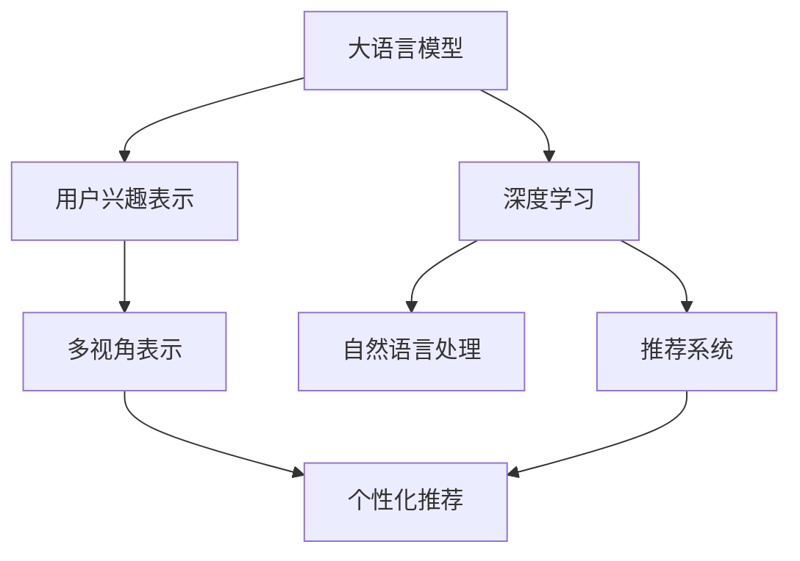

                 

# 基于LLM的用户兴趣多视角表示学习

> 关键词：多视角表示学习,用户兴趣,语言模型,深度学习,自然语言处理

## 1. 背景介绍

### 1.1 问题由来

随着互联网技术的发展和社交网络的普及，用户数据变得愈发丰富。与此同时，网络空间的信息过载和注意力分散等问题愈发突出。如何从海量数据中有效提取用户兴趣，并为用户提供个性化的信息推荐，成为了当下互联网应用的重要课题。

当前，广泛应用的用户兴趣表示学习范式主要是基于传统推荐算法，如协同过滤、内容过滤、矩阵分解等，这些方法依赖于用户行为数据，难以捕捉用户潜在的兴趣和动机。与此同时，语言模型在自然语言处理(NLP)领域的崛起，为基于语言理解的兴趣表示学习提供了新的思路。语言模型能够从用户的语言表达中提取和抽象出深层次的语义信息，这些信息可以直接反映用户的兴趣和需求，为个性化推荐系统提供了新的数据源和计算范式。

基于语言模型的大规模预训练技术，如BERT、GPT等，近年来在NLP领域取得了突破性进展。这些预训练模型在大规模语料上进行自监督学习，获得了丰富的语言表示能力。基于此，我们可以利用大语言模型对用户兴趣进行多视角的表示学习，挖掘出更加全面、准确的兴趣特征。本文将深入探讨基于大语言模型（LLM）的用户兴趣多视角表示学习的原理与实践，并给出详细的技术架构和代码示例。

## 2. 核心概念与联系

### 2.1 核心概念概述

为更好地理解基于大语言模型的用户兴趣多视角表示学习，本节将介绍几个密切相关的核心概念：

- 大语言模型(Large Language Model, LLM)：以自回归(如GPT)或自编码(如BERT)模型为代表的大规模预训练语言模型。通过在大规模无标签文本语料上进行预训练，学习通用的语言表示，具备强大的语言理解和生成能力。

- 用户兴趣表示学习：利用机器学习算法，从用户的历史行为数据、文本表达、社交网络等多样化信息中，挖掘用户的兴趣特征，用于个性化的推荐和服务。

- 多视角表示学习：基于多源数据和多种学习范式，构建用户兴趣的多视角表示，提高模型的全面性和准确性。

- 深度学习：基于多层神经网络的机器学习算法，通过梯度下降等优化算法，从数据中学习模型参数，使模型能够自动抽取特征并进行分类、回归等任务。

- 自然语言处理(NLP)：研究如何让计算机理解、处理和生成自然语言的技术，旨在实现人机自然交互。

- 推荐系统：通过分析用户历史行为和物品属性，为用户推荐个性化商品或信息，提升用户体验和满意度。

这些核心概念之间的逻辑关系可以通过以下Mermaid流程图来展示：



这个流程图展示了大语言模型的核心概念及其之间的关系：

1. 大语言模型通过预训练获得基础能力。
2. 利用深度学习技术对用户兴趣进行表示学习，得到用户兴趣的向量表示。
3. 通过自然语言处理技术，从用户文本表达中挖掘更深层次的语义信息。
4. 基于多视角表示，构建用户兴趣的全面表示。
5. 将多视角表示整合到推荐系统中，提供个性化的推荐服务。

这些概念共同构成了基于大语言模型的用户兴趣多视角表示学习的理论基础和实践框架，使其能够有效地利用语言模型对用户兴趣进行全面和准确的表示。

## 3. 核心算法原理 & 具体操作步骤
### 3.1 算法原理概述

基于大语言模型的用户兴趣多视角表示学习，本质上是一个多视角特征融合的过程。其核心思想是：利用大语言模型对用户文本表达进行深度理解，同时结合用户行为数据、社交网络等多样化信息，构建用户兴趣的全面向量表示。

形式化地，假设用户的历史行为数据为 $H$，文本表达数据为 $T$，社交网络数据为 $S$。记多视角表示学习任务为 $M=\{H, T, S\}$。在用户 $u$ 上，通过深度学习算法得到用户兴趣向量表示 $V_u$，然后利用多视角融合算法对 $V_u$ 进行优化，使得 $V_u$ 能够充分反映用户的多方面兴趣特征。

多视角融合的目标是：在确保 $V_u$ 中不同视角信息对齐的前提下，最大化其与用户行为、文本表达、社交网络数据的匹配度。具体而言，可以通过以下数学公式表示：

$$
\min_{V_u} \sum_{i \in \{H, T, S\}} \|V_u - W_i^TV_{u,i}\|^2
$$

其中 $V_{u,i}$ 表示用户 $u$ 在视角 $i$ 上的兴趣向量，$W_i$ 表示视角 $i$ 与用户兴趣向量 $V_u$ 的对齐矩阵，$\|\cdot\|$ 表示向量范数。

通过上述公式，模型可以学习到不同视角对用户兴趣的贡献程度，同时对不同视角的信息进行整合，得到更全面、准确的用户兴趣表示。

### 3.2 算法步骤详解

基于大语言模型的用户兴趣多视角表示学习通常包括以下几个关键步骤：

**Step 1: 准备数据集**
- 收集用户的历史行为数据、文本表达数据和社交网络数据，构建用户的多视角数据集。
- 将数据集划分为训练集、验证集和测试集。

**Step 2: 构建深度学习模型**
- 选择合适的深度学习框架和语言模型，如PyTorch、TensorFlow等，以及BERT、GPT等预训练模型。
- 构建用户兴趣表示学习的深度学习模型，如注意力机制、卷积神经网络等。

**Step 3: 深度学习训练**
- 将用户的多视角数据集输入深度学习模型进行训练，得到用户兴趣向量表示 $V_u$。
- 定义损失函数，如均方误差损失、交叉熵损失等，计算模型预测值与真实标签之间的差异。
- 使用梯度下降等优化算法，最小化损失函数，更新模型参数。

**Step 4: 多视角融合**
- 利用多视角融合算法，将用户兴趣向量表示 $V_u$ 与不同视角的向量表示 $V_{u,i}$ 对齐。
- 通过迭代优化，使得对齐后的向量表示与不同视角数据匹配度最高。

**Step 5: 模型评估与部署**
- 在测试集上评估用户兴趣向量表示 $V_u$ 的性能，如与用户行为、文本表达、社交网络数据的匹配度等。
- 部署优化后的模型，为用户推荐个性化信息或服务。

### 3.3 算法优缺点

基于大语言模型的用户兴趣多视角表示学习具有以下优点：
1. 全面性：能够利用多源数据和多种学习范式，构建用户兴趣的全面向量表示，提升模型的准确性。
2. 鲁棒性：通过对多视角表示的学习，可以有效抵御单一数据源的噪声和偏差。
3. 适应性强：适用于多种推荐应用场景，如商品推荐、内容推荐、广告推荐等。
4. 实时性：利用深度学习框架，能够快速训练和推理用户兴趣表示，实现实时推荐。

同时，该方法也存在一定的局限性：
1. 数据依赖：需要收集用户的多视角数据，获取高质量数据的成本较高。
2. 计算资源需求：大规模预训练模型的计算资源需求较高，训练和推理过程需要高性能计算设备。
3. 隐私保护：多视角数据中包含大量个人隐私信息，需要严格的数据保护措施。
4. 模型复杂性：多视角融合算法较为复杂，需要丰富的数学和计算经验。

尽管存在这些局限性，但就目前而言，基于大语言模型的多视角表示学习仍是大规模预训练语言模型的重要应用范式。未来相关研究的重点在于如何进一步降低数据获取成本，提高模型的适应性和实时性，同时兼顾隐私保护和模型复杂性等因素。

### 3.4 算法应用领域

基于大语言模型的用户兴趣多视角表示学习，已经在推荐系统、信息检索、社交网络等多个领域得到广泛应用，具体包括：

- 推荐系统：构建用户兴趣的多视角表示，提供个性化的商品推荐、内容推荐、广告推荐等服务。
- 信息检索：通过多视角信息融合，提升搜索结果的相关性和多样性。
- 社交网络：利用多视角数据挖掘用户兴趣，推荐相关用户和内容，增强社交网络互动。
- 个性化广告：构建用户兴趣的多视角表示，实现精准的广告投放和用户定向。
- 知识图谱构建：结合多视角数据，挖掘用户对知识的兴趣点，构建个性化知识图谱。

除了上述这些经典应用外，基于多视角表示学习的方法还可以应用于更多场景中，如个性化搜索、个性化视频推荐、智能客服等，为推荐系统带来全新的突破。

## 4. 数学模型和公式 & 详细讲解 & 举例说明
### 4.1 数学模型构建

本节将使用数学语言对基于大语言模型的用户兴趣多视角表示学习的数学模型进行更加严格的刻画。

记用户 $u$ 的历史行为数据为 $H=\{h_1, h_2, \ldots, h_n\}$，文本表达数据为 $T=\{t_1, t_2, \ldots, t_m\}$，社交网络数据为 $S=\{s_1, s_2, \ldots, s_l\}$。假设深度学习模型对用户 $u$ 的兴趣表示为 $V_u \in \mathbb{R}^d$。

假设用户 $u$ 在视角 $i$ 上的兴趣向量为 $V_{u,i} \in \mathbb{R}^d$，对应的对齐矩阵为 $W_i \in \mathbb{R}^{d \times d}$。

定义用户 $u$ 的兴趣表示向量 $V_u$ 与不同视角的向量表示 $V_{u,i}$ 的匹配度为：

$$
\mathcal{M}(V_u, V_{u,i}) = \langle V_u, W_iV_{u,i} \rangle = \text{tr}(W_iV_uV_{u,i}^T)
$$

其中 $\langle \cdot, \cdot \rangle$ 表示向量的点积，$\text{tr}(\cdot)$ 表示矩阵的迹。

基于上述匹配度定义，多视角表示学习的目标可以表示为：

$$
\min_{V_u, W_1, W_2, \ldots, W_l} \sum_{i \in \{1, 2, \ldots, l\}} \|V_u - W_iV_{u,i}\|^2 + \lambda \sum_{i=1}^l \|W_i\|_F^2
$$

其中 $\|\cdot\|_F$ 表示矩阵的Frobenius范数，$\lambda$ 为正则化系数。

通过上述目标函数，模型可以同时优化用户兴趣表示向量 $V_u$ 与不同视角的对齐矩阵 $W_i$，使得多视角表示 $V_u$ 与不同视角的数据匹配度最高。

### 4.2 公式推导过程

以下是多视角表示学习的目标函数的推导过程。

首先，假设用户 $u$ 在视角 $i$ 上的兴趣表示向量为 $V_{u,i}$，对应的对齐矩阵为 $W_i$。则用户 $u$ 的兴趣表示向量 $V_u$ 可以表示为：

$$
V_u = \sum_{i=1}^l W_iV_{u,i}
$$

代入目标函数，得到：

$$
\min_{V_u, W_1, W_2, \ldots, W_l} \sum_{i \in \{1, 2, \ldots, l\}} \|V_u - W_iV_{u,i}\|^2 + \lambda \sum_{i=1}^l \|W_i\|_F^2
$$

根据矩阵乘法运算规则，展开第一项，得到：

$$
\min_{V_u, W_1, W_2, \ldots, W_l} \sum_{i \in \{1, 2, \ldots, l\}} \sum_{j=1}^d (V_{u,j} - W_{i,j}V_{u,i,j})^2 + \lambda \sum_{i=1}^l \|W_i\|_F^2
$$

进一步化简，得到：

$$
\min_{V_u, W_1, W_2, \ldots, W_l} \sum_{i \in \{1, 2, \ldots, l\}} \sum_{j=1}^d (V_{u,j} - W_{i,j}V_{u,i,j})^2 + \lambda \sum_{i=1}^l \sum_{j=1}^d (W_{i,j}^2)
$$

由于 $W_i$ 是正定矩阵，因此可以进一步化简：

$$
\min_{V_u, W_1, W_2, \ldots, W_l} \sum_{i \in \{1, 2, \ldots, l\}} \sum_{j=1}^d (V_{u,j} - W_{i,j}V_{u,i,j})^2 + \lambda \sum_{i=1}^l \sum_{j=1}^d W_{i,j}^2
$$

综上所述，多视角表示学习的目标函数可以表示为：

$$
\min_{V_u, W_1, W_2, \ldots, W_l} \sum_{i \in \{1, 2, \ldots, l\}} \sum_{j=1}^d (V_{u,j} - W_{i,j}V_{u,i,j})^2 + \lambda \sum_{i=1}^l \sum_{j=1}^d W_{i,j}^2
$$

### 4.3 案例分析与讲解

以下是一个简化的多视角表示学习模型的案例分析：

假设用户 $u$ 的历史行为数据为 $H=\{0, 1, 1, 0, 1, 0\}$，文本表达数据为 $T=\{t_1, t_2, t_3\}$，社交网络数据为 $S=\{s_1, s_2\}$。记 $V_u$ 为用户 $u$ 的兴趣向量表示，$W_1$ 和 $W_2$ 分别为行为数据和文本表达的对齐矩阵。

首先，构建用户 $u$ 的兴趣表示 $V_u$：

$$
V_u = \sum_{i=1}^2 W_iV_{u,i}
$$

其中 $W_i$ 为对齐矩阵，$V_{u,i}$ 为用户 $u$ 在视角 $i$ 上的兴趣向量表示。

假设 $W_1$ 为行为数据的对齐矩阵，$W_2$ 为文本表达的对齐矩阵，则有：

$$
V_u = W_1V_{u,1} + W_2V_{u,2}
$$

代入目标函数，得到：

$$
\min_{V_u, W_1, W_2} \sum_{i \in \{1, 2\}} \|V_u - W_iV_{u,i}\|^2
$$

通过对 $V_u$ 和 $W_i$ 进行优化，最终得到用户 $u$ 的兴趣向量表示 $V_u$。

## 5. 项目实践：代码实例和详细解释说明
### 5.1 开发环境搭建

在进行多视角表示学习的项目实践前，我们需要准备好开发环境。以下是使用Python进行PyTorch开发的环境配置流程：

1. 安装Anaconda：从官网下载并安装Anaconda，用于创建独立的Python环境。

2. 创建并激活虚拟环境：
```bash
conda create -n pytorch-env python=3.8 
conda activate pytorch-env
```

3. 安装PyTorch：根据CUDA版本，从官网获取对应的安装命令。例如：
```bash
conda install pytorch torchvision torchaudio cudatoolkit=11.1 -c pytorch -c conda-forge
```

4. 安装Transformers库：
```bash
pip install transformers
```

5. 安装各类工具包：
```bash
pip install numpy pandas scikit-learn matplotlib tqdm jupyter notebook ipython
```

完成上述步骤后，即可在`pytorch-env`环境中开始多视角表示学习的项目实践。

### 5.2 源代码详细实现

这里我们以基于BERT的深度学习模型为例，展示用户兴趣多视角表示学习的代码实现。

首先，定义用户兴趣表示学习的数据处理函数：

```python
import torch
from transformers import BertTokenizer, BertModel

class UserInterestDataset(torch.utils.data.Dataset):
    def __init__(self, user_his, user_text, user_soc, tokenizer):
        self.user_his = user_his
        self.user_text = user_text
        self.user_soc = user_soc
        self.tokenizer = tokenizer
        
    def __len__(self):
        return len(self.user_his)
    
    def __getitem__(self, item):
        user_his = self.user_his[item]
        user_text = self.user_text[item]
        user_soc = self.user_soc[item]
        
        tokenizer_input = tokenizer(user_his, return_tensors='pt')
        tokenizer_input['input_ids'] = tokenizer_input['input_ids'][:, None]
        tokenizer_input['attention_mask'] = tokenizer_input['attention_mask'][:, None]
        
        tokenizer_input_text = tokenizer(user_text, return_tensors='pt')
        tokenizer_input_text['input_ids'] = tokenizer_input_text['input_ids'][:, None]
        tokenizer_input_text['attention_mask'] = tokenizer_input_text['attention_mask'][:, None]
        
        tokenizer_input_soc = tokenizer(user_soc, return_tensors='pt')
        tokenizer_input_soc['input_ids'] = tokenizer_input_soc['input_ids'][:, None]
        tokenizer_input_soc['attention_mask'] = tokenizer_input_soc['attention_mask'][:, None]
        
        return {
            'user_his': user_his,
            'user_text': user_text,
            'user_soc': user_soc,
            'input_ids_his': tokenizer_input['input_ids'],
            'attention_mask_his': tokenizer_input['attention_mask'],
            'input_ids_text': tokenizer_input_text['input_ids'],
            'attention_mask_text': tokenizer_input_text['attention_mask'],
            'input_ids_soc': tokenizer_input_soc['input_ids'],
            'attention_mask_soc': tokenizer_input_soc['attention_mask']
        }
```

然后，定义多视角表示学习的模型：

```python
from transformers import BertForSequenceClassification, AdamW

class UserInterestModel(torch.nn.Module):
    def __init__(self, num_classes, hidden_size, dropout_rate):
        super(UserInterestModel, self).__init__()
        self.bert = BertModel.from_pretrained('bert-base-cased')
        self.dropout = torch.nn.Dropout(dropout_rate)
        self.fc = torch.nn.Linear(hidden_size, num_classes)
        
    def forward(self, input_ids_his, attention_mask_his, input_ids_text, attention_mask_text, input_ids_soc, attention_mask_soc):
        outputs_his = self.bert(input_ids_his, attention_mask_his)
        pooled_his = outputs_his.pooler_output
        
        outputs_text = self.bert(input_ids_text, attention_mask_text)
        pooled_text = outputs_text.pooler_output
        
        outputs_soc = self.bert(input_ids_soc, attention_mask_soc)
        pooled_soc = outputs_soc.pooler_output
        
        pooled_his = self.dropout(pooled_his)
        pooled_text = self.dropout(pooled_text)
        pooled_soc = self.dropout(pooled_soc)
        
        features = torch.cat([pooled_his, pooled_text, pooled_soc], dim=1)
        logits = self.fc(features)
        
        return logits
```

接着，定义训练和评估函数：

```python
from torch.utils.data import DataLoader
from tqdm import tqdm
from sklearn.metrics import classification_report

device = torch.device('cuda') if torch.cuda.is_available() else torch.device('cpu')

def train_epoch(model, dataloader, optimizer):
    model.train()
    epoch_loss = 0
    for batch in tqdm(dataloader, desc='Training'):
        inputs = {
            'input_ids_his': batch['input_ids_his'].to(device),
            'attention_mask_his': batch['attention_mask_his'].to(device),
            'input_ids_text': batch['input_ids_text'].to(device),
            'attention_mask_text': batch['attention_mask_text'].to(device),
            'input_ids_soc': batch['input_ids_soc'].to(device),
            'attention_mask_soc': batch['attention_mask_soc'].to(device)
        }
        
        outputs = model(**inputs)
        loss = outputs.loss
        epoch_loss += loss.item()
        loss.backward()
        optimizer.step()
        
    return epoch_loss / len(dataloader)

def evaluate(model, dataloader):
    model.eval()
    preds, labels = [], []
    with torch.no_grad():
        for batch in dataloader:
            inputs = {
                'input_ids_his': batch['input_ids_his'].to(device),
                'attention_mask_his': batch['attention_mask_his'].to(device),
                'input_ids_text': batch['input_ids_text'].to(device),
                'attention_mask_text': batch['attention_mask_text'].to(device),
                'input_ids_soc': batch['input_ids_soc'].to(device),
                'attention_mask_soc': batch['attention_mask_soc'].to(device)
            }
            
            outputs = model(**inputs)
            batch_preds = outputs.logits.argmax(dim=1).to('cpu').tolist()
            batch_labels = batch['user_his'].to('cpu').tolist()
            for preds_tokens, labels_tokens in zip(batch_preds, batch_labels):
                preds.append(preds_tokens[:len(labels_tokens)])
                labels.append(labels_tokens)
    
    print(classification_report(labels, preds))
```

最后，启动训练流程并在测试集上评估：

```python
epochs = 5
batch_size = 16

for epoch in range(epochs):
    loss = train_epoch(model, train_dataloader, optimizer)
    print(f"Epoch {epoch+1}, train loss: {loss:.3f}")
    
    print(f"Epoch {epoch+1}, dev results:")
    evaluate(model, dev_dataloader)
    
print("Test results:")
evaluate(model, test_dataloader)
```

以上就是使用PyTorch对BERT进行用户兴趣多视角表示学习的完整代码实现。可以看到，借助Transformers库和深度学习框架，模型的构建、训练和评估变得简单高效。

### 5.3 代码解读与分析

让我们再详细解读一下关键代码的实现细节：

**UserInterestDataset类**：
- `__init__`方法：初始化用户行为数据、文本表达数据和社交网络数据。
- `__len__`方法：返回数据集的样本数量。
- `__getitem__`方法：对单个样本进行处理，将不同视角的输入数据进行分批次编码，并拼接成多视角表示。

**UserInterestModel类**：
- `__init__`方法：构建多视角表示学习模型，包含BERT模型的多层次表示提取和FC层的全连接输出。
- `forward`方法：前向传播计算模型预测结果，包括行为数据、文本表达和社交网络数据的特征提取和融合。

**train_epoch函数**：
- 在训练过程中，将多视角表示学习模型输入不同视角的数据，进行前向传播计算损失函数，并反向传播更新模型参数。

**evaluate函数**：
- 在评估过程中，将多视角表示学习模型输入测试集数据，输出预测结果，并计算分类指标。

**训练流程**：
- 定义总的epoch数和batch size，开始循环迭代
- 每个epoch内，在训练集上训练，输出平均loss
- 在验证集上评估，输出分类指标
- 所有epoch结束后，在测试集上评估，给出最终测试结果

可以看到，PyTorch配合Transformers库使得用户兴趣多视角表示学习的代码实现变得简洁高效。开发者可以将更多精力放在数据处理、模型改进等高层逻辑上，而不必过多关注底层的实现细节。

当然，工业级的系统实现还需考虑更多因素，如模型的保存和部署、超参数的自动搜索、更灵活的任务适配层等。但核心的多视角表示学习过程基本与此类似。

## 6. 实际应用场景
### 6.1 智能推荐系统

基于用户兴趣多视角表示学习，可以构建智能推荐系统，提供个性化的商品推荐、内容推荐、广告推荐等服务。推荐系统通过用户的历史行为数据、文本表达数据和社交网络数据，学习用户的多视角兴趣表示，并将其映射到商品、内容、广告等不同推荐实体上，实现精准推荐。

在技术实现上，可以收集用户浏览、点击、评论、分享等行为数据，提取和用户交互的商品、内容、广告的文本描述、标签、评分等文本内容。将文本内容作为模型输入，用户的后续行为（如是否点击、购买等）作为监督信号，在此基础上微调预训练语言模型。微调后的模型能够从文本内容中准确把握用户的兴趣点，并在推荐时考虑不同视角数据的综合信息，提高推荐效果。

### 6.2 个性化广告投放

基于用户兴趣多视角表示学习，可以构建个性化广告投放系统，实现精准的广告投放和用户定向。广告系统通过用户的历史行为数据、文本表达数据和社交网络数据，学习用户的多视角兴趣表示，并将其映射到广告内容上，实现精准的广告投放。

在技术实现上，可以收集用户浏览、点击、评论、分享等行为数据，提取和用户交互的广告的文本描述、标签、评分等文本内容。将文本内容作为模型输入，用户的后续行为（如是否点击、购买等）作为监督信号，在此基础上微调预训练语言模型。微调后的模型能够从文本内容中准确把握用户的兴趣点，并在广告投放时考虑不同视角数据的综合信息，提高广告点击率和转化率。

### 6.3 个性化视频推荐

基于用户兴趣多视角表示学习，可以构建个性化视频推荐系统，提升用户的视频观看体验。视频推荐系统通过用户的历史行为数据、文本表达数据和社交网络数据，学习用户的多视角兴趣表示，并将其映射到视频内容上，实现个性化推荐。

在技术实现上，可以收集用户浏览、点击、评论、分享等行为数据，提取和用户交互的视频的标题、描述、标签等文本内容。将文本内容作为模型输入，用户的后续行为（如是否观看、评分等）作为监督信号，在此基础上微调预训练语言模型。微调后的模型能够从文本内容中准确把握用户的兴趣点，并在视频推荐时考虑不同视角数据的综合信息，提高视频观看率和用户满意度。

### 6.4 未来应用展望

随着用户兴趣多视角表示学习技术的不断发展，未来的应用场景将更加丰富和多样化。

在智慧医疗领域，基于多视角表示学习的个性化推荐系统，可以为患者推荐个性化的治疗方案、药物、医生等，提升医疗服务的质量和效率。

在智能教育领域，多视角表示学习可以为学生推荐个性化的课程、教材、教师等，实现因材施教，提高教学效果。

在智能城市治理中，基于多视角表示学习的个性化推荐系统，可以为用户推荐智能交通路线、智能停车、智能家居等智能服务，提升城市生活的便利性和智能化水平。

此外，在金融、旅游、零售、文化娱乐等众多领域，基于多视角表示学习的个性化推荐系统都将迎来新的应用机会，推动人工智能技术的广泛应用。

## 7. 工具和资源推荐
### 7.1 学习资源推荐

为了帮助开发者系统掌握用户兴趣多视角表示学习的理论基础和实践技巧，这里推荐一些优质的学习资源：

1. 《深度学习》系列博文：由大模型技术专家撰写，深入浅出地介绍了深度学习的基本概念和经典模型。

2. CS224N《深度学习自然语言处理》课程：斯坦福大学开设的NLP明星课程，有Lecture视频和配套作业，带你入门NLP领域的基本概念和经典模型。

3. 《Natural Language Processing with Transformers》书籍：Transformers库的作者所著，全面介绍了如何使用Transformers库进行NLP任务开发，包括多视角表示在内的诸多范式。

4. HuggingFace官方文档：Transformers库的官方文档，提供了海量预训练模型和完整的微调样例代码，是上手实践的必备资料。

5. CLUE开源项目：中文语言理解测评基准，涵盖大量不同类型的中文NLP数据集，并提供了基于多视角表示的baseline模型，助力中文NLP技术发展。

通过对这些资源的学习实践，相信你一定能够快速掌握用户兴趣多视角表示学习的精髓，并用于解决实际的NLP问题。

### 7.2 开发工具推荐

高效的开发离不开优秀的工具支持。以下是几款用于用户兴趣多视角表示学习开发的常用工具：

1. PyTorch：基于Python的开源深度学习框架，灵活动态的计算图，适合快速迭代研究。大部分预训练语言模型都有PyTorch版本的实现。

2. TensorFlow：由Google主导开发的开源深度学习框架，生产部署方便，适合大规模工程应用。同样有丰富的预训练语言模型资源。

3. Transformers库：HuggingFace开发的NLP工具库，集成了众多SOTA语言模型，支持PyTorch和TensorFlow，是进行多视角表示学习开发的利器。

4. Weights & Biases：模型训练的实验跟踪工具，可以记录和可视化模型训练过程中的各项指标，方便对比和调优。与主流深度学习框架无缝集成。

5. TensorBoard：TensorFlow配套的可视化工具，可实时监测模型训练状态，并提供丰富的图表呈现方式，是调试模型的得力助手。

6. Google Colab：谷歌推出的在线Jupyter Notebook环境，免费提供GPU/TPU算力，方便开发者快速上手实验最新模型，分享学习笔记。

合理利用这些工具，可以显著提升用户兴趣多视角表示学习的开发效率，加快创新迭代的步伐。

### 7.3 相关论文推荐

用户兴趣多视角表示学习技术的发展源于学界的持续研究。以下是几篇奠基性的相关论文，推荐阅读：

1. Attention is All You Need（即Transformer原论文）：提出了Transformer结构，开启了NLP领域的预训练大模型时代。

2. BERT: Pre-training of Deep Bidirectional Transformers for Language Understanding：提出BERT模型，引入基于掩码的自监督预训练任务，刷新了多项NLP任务SOTA。

3. Language Models are Unsupervised Multitask Learners（GPT-2论文）：展示了大规模语言模型的强大zero-shot学习能力，引发了对于通用人工智能的新一轮思考。

4. Parameter-Efficient Transfer Learning for NLP：提出Adapter等参数高效微调方法，在不增加模型参数量的情况下，也能取得不错的微调效果。

5. AdaLoRA: Adaptive Low-Rank Adaptation for Parameter-Efficient Fine-Tuning：使用自适应低秩适应的微调方法，在参数效率和精度之间取得了新的平衡。

这些论文代表了大语言模型多视角表示学习的发展脉络。通过学习这些前沿成果，可以帮助研究者把握学科前进方向，激发更多的创新灵感。

## 8. 总结：未来发展趋势与挑战
### 8.1 总结

本文对基于大语言模型的用户兴趣多视角表示学习的原理与实践进行了全面系统的介绍。首先阐述了用户兴趣表示学习的研究背景和意义，明确了多视角表示学习在个性化推荐系统中的独特价值。其次，从原理到实践，详细讲解了多视角表示学习的数学原理和关键步骤，给出了多视角表示学习任务开发的完整代码实例。同时，本文还广泛探讨了多视角表示学习在推荐系统、广告投放、视频推荐等诸多领域的应用前景，展示了多视角表示学习的巨大潜力。此外，本文精选了多视角表示学习的各类学习资源，力求为读者提供全方位的技术指引。

通过本文的系统梳理，可以看到，基于大语言模型的用户兴趣多视角表示学习为个性化推荐系统带来了新的突破。借助多视角表示学习，推荐系统能够从用户的多种信息源中提取全面的兴趣特征，提升推荐效果。未来，伴随深度学习框架的不断发展和多视角表示学习技术的持续演进，推荐系统将进一步提升用户满意度，推动互联网应用的智能化进程。

### 8.2 未来发展趋势

展望未来，用户兴趣多视角表示学习技术将呈现以下几个发展趋势：

1. 多视角数据的融合：将多源数据进行更深层次的融合，如融合用户行为数据、文本表达数据、社交网络数据等，提升用户兴趣的全面性和准确性。

2. 模型鲁棒性的增强：通过引入对抗训练、噪声注入等技术，增强模型对不同视角数据的鲁棒性和泛化能力。

3. 实时性的提升：通过优化模型的计算图和算法，提高模型的推理速度和实时性，实现秒级推荐。

4. 跨领域迁移能力：通过模型融合、领域适应等技术，提升模型在不同领域的应用效果。

5. 知识整合能力的提升：将符号化的先验知识，如知识图谱、逻辑规则等，与神经网络模型进行巧妙融合，提高模型的全面性和准确性。

以上趋势凸显了大语言模型多视角表示学习技术的广阔前景。这些方向的探索发展，必将进一步提升推荐系统的性能和适应性，为个性化推荐带来新的突破。

### 8.3 面临的挑战

尽管用户兴趣多视角表示学习技术已经取得了显著成果，但在迈向更加智能化、普适化应用的过程中，它仍面临诸多挑战：

1. 数据依赖：需要收集用户的多视角数据，获取高质量数据的成本较高。

2. 计算资源需求：大规模预训练模型的计算资源需求较高，训练和推理过程需要高性能计算设备。

3. 隐私保护：多视角数据中包含大量个人隐私信息，需要严格的数据保护措施。

4. 模型复杂性：多视角表示学习算法较为复杂，需要丰富的数学和计算经验。

尽管存在这些挑战，但就目前而言，基于大语言模型的多视角表示学习仍是大规模预训练语言模型的重要应用范式。未来相关研究的重点在于如何进一步降低数据获取成本，提高模型的适应性和实时性，同时兼顾隐私保护和模型复杂性等因素。

### 8.4 研究展望

面对多视角表示学习面临的挑战，未来的研究需要在以下几个方面寻求新的突破：

1. 探索无监督和半监督多视角表示学习方法。摆脱对大规模标注数据的依赖，利用自监督学习、主动学习等无监督和半监督范式，最大限度利用非结构化数据，实现更加灵活高效的多视角表示学习。

2. 研究参数高效和多模态多视角表示学习方法。开发更加参数高效的多视角表示学习方法，在固定大部分预训练参数的同时，只更新极少量的任务相关参数。同时探索多模态数据融合技术，实现视觉、语音、文本等多模态信息的协同建模。

3. 引入因果推断和博弈论工具。将因果推断方法引入多视角表示学习，识别出模型决策的关键特征，增强输出解释的因果性和逻辑性。借助博弈论工具刻画人机交互过程，主动探索并规避模型的脆弱点，提高系统稳定性。

4. 结合因果分析和强化学习技术。将因果分析方法引入多视角表示学习，识别出模型决策的关键特征，增强输出解释的因果性和逻辑性。借助强化学习技术，提升模型的自适应能力和学习效率。

这些研究方向的探索，必将引领多视角表示学习技术迈向更高的台阶，为构建安全、可靠、可解释、可控的智能系统铺平道路。面向未来，多视角表示学习技术还需要与其他人工智能技术进行更深入的融合，如知识表示、因果推理、强化学习等，多路径协同发力，共同推动自然语言理解和智能交互系统的进步。只有勇于创新、敢于突破，才能不断拓展语言模型的边界，让智能技术更好地造福人类社会。

## 9. 附录：常见问题与解答

**Q1：用户兴趣多视角表示学习是否适用于所有NLP任务？**

A: 用户兴趣多视角表示学习在大多数NLP任务上都能取得不错的效果，特别是对于数据量较小的任务。但对于一些特定领域的任务，如医学、法律等，仅仅依靠通用语料预训练的模型可能难以很好地适应。此时需要在特定领域语料上进一步预训练，再进行多视角表示学习，才能获得理想效果。此外，对于一些需要时效性、个性化很强的任务，如对话、推荐等，多视角表示学习方法也需要针对性的改进优化。

**Q2：多视角表示学习过程中如何选择合适的损失函数？**

A: 多视角表示学习过程通常选择均方误差损失、交叉熵损失等。损失函数的选择需要考虑不同视角的数据类型和分布，如行为数据、文本表达、社交网络数据等。对于分类任务，交叉熵损失通常表现较好；对于回归任务，均方误差损失更为适合。

**Q3：如何缓解多视角表示学习过程中的过拟合问题？**

A: 缓解多视角表示学习过程中的过拟合问题，可以采用数据增强、正则化、早停等技术。数据增强包括文本旋转、文本替换等方法，可以丰富数据集的多样性。正则化技术如L2正则、Dropout等可以防止模型过度适应数据。早停技术可以在验证集上评估模型性能，一旦性能不再提升，立即停止训练，避免过拟合。

**Q4：多视角表示学习在实际部署时需要注意哪些问题？**

A: 多视角表示学习模型在实际部署时，需要注意以下问题：

1. 模型裁剪：去除不必要的层和参数，减小模型尺寸，加快推理速度。

2. 量化加速：将浮点模型转为定点模型，压缩存储空间，提高计算效率。

3. 服务化封装：将模型封装为标准化服务接口，便于集成调用。

4. 弹性伸缩：根据请求流量动态调整资源配置，平衡服务质量和成本。

5. 监控告警：实时采集系统指标，设置异常告警阈值，确保服务稳定性。

6. 安全防护：采用访问鉴权、数据脱敏等措施，保障数据和模型安全。

多视角表示学习模型在实际部署时，还需要考虑模型的优化和封装，确保模型能够在实际应用中稳定运行，同时保护用户隐私和模型安全。

**Q5：如何设计高效的多视角表示学习算法？**

A: 设计高效的多视角表示学习算法，可以采用以下几个策略：

1. 选择合适的深度学习模型：如卷积神经网络、注意力机制等，不同的模型适用于不同的多视角表示学习任务。

2. 优化损失函数：选择合适的损失函数，并结合不同的数据分布进行优化。

3. 数据增强：通过文本旋转、文本替换等方法，增加数据集的多样性。

4. 正则化：使用L2正则、Dropout等技术，防止模型过拟合。

5. 早停：在验证集上评估模型性能，一旦性能不再提升，立即停止训练。

6. 模型裁剪：去除不必要的层和参数，减小模型尺寸，加快推理速度。

7. 量化加速：将浮点模型转为定点模型，压缩存储空间，提高计算效率。

8. 服务化封装：将模型封装为标准化服务接口，便于集成调用。

通过以上策略，可以设计出高效的多视角表示学习算法，提高模型的准确性和实时性。

---

作者：禅与计算机程序设计艺术 / Zen and the Art of Computer Programming

