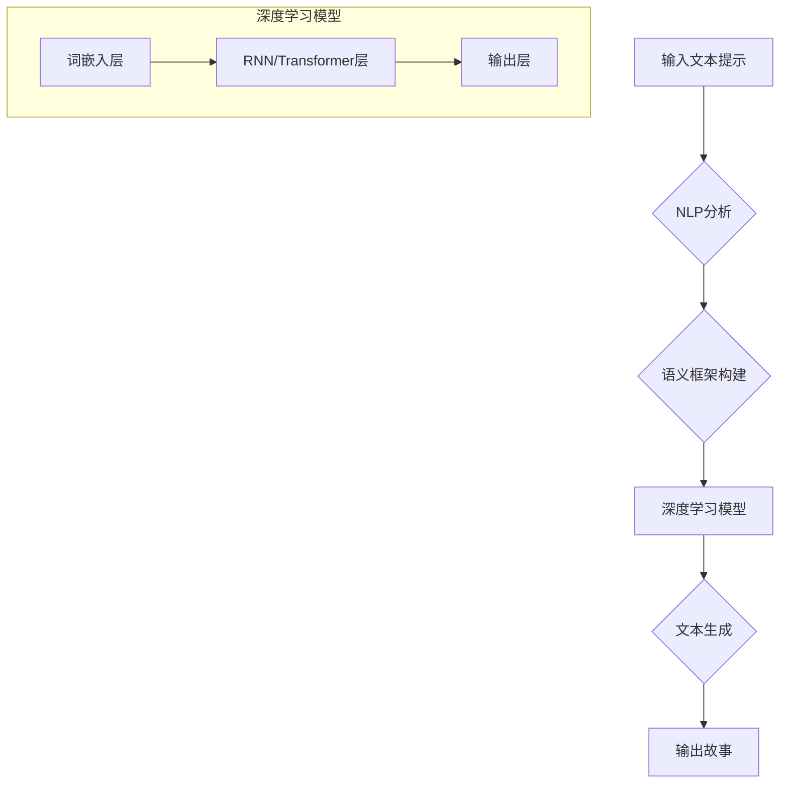

                 

## 使用Python、C和CUDA从零开始构建AI故事生成器

> 关键词：AI故事生成器、自然语言处理、深度学习、Python、C、CUDA、GPU加速、文本生成

## 1. 背景介绍

故事是人类文明的重要组成部分，它承载着我们的文化、情感和智慧。近年来，随着人工智能技术的飞速发展，AI故事生成器应运而生，能够根据给定的提示或场景自动生成富有创意和连贯性的故事。这不仅为创作提供了一种新的工具，也为研究语言模型和文本生成机制提供了宝贵的平台。

传统的文本生成方法主要依赖于规则和模板，缺乏灵活性。而深度学习技术的出现，特别是基于Transformer架构的语言模型，如GPT-3和LaMDA，取得了显著的突破，能够生成更自然、更流畅的文本。然而，这些大型语言模型通常需要大量的计算资源和训练数据，对于个人开发者或小型团队来说，部署和使用它们存在一定的门槛。

本文将介绍如何使用Python、C和CUDA从零开始构建一个AI故事生成器，并深入探讨其核心概念、算法原理、数学模型以及代码实现。通过结合GPU加速技术，我们能够在有限的资源下实现高效的文本生成，并为读者提供一个动手实践的学习途径。

## 2. 核心概念与联系

### 2.1  自然语言处理 (NLP)

自然语言处理 (NLP) 是人工智能的一个分支，致力于使计算机能够理解、处理和生成人类语言。在故事生成器中，NLP技术用于分析输入的文本提示，提取关键信息，并构建故事的语义框架。

### 2.2  深度学习 (DL)

深度学习 (DL) 是机器学习的一种高级形式，利用多层神经网络模拟人类大脑的学习过程。在故事生成器中，深度学习模型用于学习语言模式和文本结构，并根据输入的提示生成新的文本。

### 2.3  GPU加速

GPU (图形处理单元) 是一种专门用于处理图形和并行计算的处理器。由于其强大的并行计算能力，GPU可以显著加速深度学习模型的训练和推理过程。

**核心概念与联系流程图:**



## 3. 核心算法原理 & 具体操作步骤

### 3.1  算法原理概述

故事生成器的核心算法通常基于**循环神经网络 (RNN)** 或 **Transformer** 架构。

* **RNN** 是一种能够处理序列数据的网络结构，其内部包含循环单元，能够记忆之前的信息，从而生成具有上下文依赖性的文本。

* **Transformer** 是近年来兴起的深度学习模型，其基于注意力机制，能够更有效地捕捉长距离依赖关系，生成更流畅、更连贯的文本。

### 3.2  算法步骤详解

1. **文本预处理:** 将输入的文本提示进行清洗、分词、词干提取等预处理操作，以便模型能够理解和处理文本信息。

2. **词嵌入:** 将文本中的每个词映射到一个低维向量空间，使得具有语义相似性的词拥有相似的向量表示。

3. **编码:** 使用RNN或Transformer模型对预处理后的文本进行编码，提取文本的语义信息和结构特征。

4. **解码:** 使用RNN或Transformer模型对编码后的信息进行解码，生成新的文本序列。

5. **文本后处理:** 对生成的文本进行语法检查、格式调整等后处理操作，使其更加自然流畅。

### 3.3  算法优缺点

**RNN:**

* **优点:** 能够处理序列数据，捕捉上下文依赖关系。
* **缺点:** 难以处理长距离依赖关系，训练速度较慢。

**Transformer:**

* **优点:** 能够有效地捕捉长距离依赖关系，训练速度更快。
* **缺点:** 参数量较大，需要更多的计算资源。

### 3.4  算法应用领域

* **故事创作:** 根据用户提供的提示或场景，自动生成故事。
* **剧本写作:** 为电影、电视剧等影视作品生成剧本。
* **游戏设计:** 为游戏角色生成对话和剧情。
* **教育辅助:** 为学生提供个性化的学习内容和故事练习。

## 4. 数学模型和公式 & 详细讲解 & 举例说明

### 4.1  数学模型构建

故事生成器的数学模型通常基于概率论和统计学，其目标是学习文本的概率分布，并根据该分布生成新的文本。

* **词袋模型 (Bag-of-Words):** 将文本视为一个词的集合，忽略词的顺序和语法关系。

* **n-gram模型:** 将文本视为一系列n个词的序列，学习不同n-gram的概率分布。

* **隐马尔可夫模型 (HMM):** 将文本视为一个隐藏状态序列，学习状态转移概率和观测概率。

### 4.2  公式推导过程

**n-gram模型:**

假设我们有一个文本序列 $w_1, w_2, ..., w_n$，其中 $w_i$ 表示第i个词。则n-gram模型的目标是学习每个n-gram $w_{i-n+1}, ..., w_i$ 的概率分布:

$$P(w_i | w_{i-n+1}, ..., w_{i-1})$$

可以使用最大似然估计 (MLE) 方法来估计该概率分布:

$$P(w_i | w_{i-n+1}, ..., w_{i-1}) = \frac{C(w_{i-n+1}, ..., w_i)}{C(w_{i-n+1}, ..., w_{i-1})}$$

其中，$C(w_{i-n+1}, ..., w_i)$ 表示n-gram $w_{i-n+1}, ..., w_i$ 出现的次数，$C(w_{i-n+1}, ..., w_{i-1})$ 表示n-1-gram $w_{i-n+1}, ..., w_{i-1}$ 出现的次数。

### 4.3  案例分析与讲解

假设我们有一个文本序列 "the cat sat on the mat"，我们想要学习3-gram模型，即学习每个3个词的序列的概率分布。

* 3-gram "the cat sat" 的概率为:

$$P(\text{the cat sat} | \text{the cat}) = \frac{1}{1}$$

* 3-gram "cat sat on" 的概率为:

$$P(\text{cat sat on} | \text{cat sat}) = \frac{1}{1}$$

## 5. 项目实践：代码实例和详细解释说明

### 5.1  开发环境搭建

* **操作系统:** Linux/macOS
* **编程语言:** Python
* **深度学习框架:** TensorFlow/PyTorch
* **GPU驱动:** CUDA Toolkit

### 5.2  源代码详细实现

```python
# 使用TensorFlow构建简单的RNN故事生成器

import tensorflow as tf

# 定义RNN模型
model = tf.keras.Sequential([
    tf.keras.layers.Embedding(input_dim=vocab_size, output_dim=embedding_dim),
    tf.keras.layers.LSTM(units=lstm_units),
    tf.keras.layers.Dense(units=vocab_size, activation='softmax')
])

# 编译模型
model.compile(optimizer='adam', loss='sparse_categorical_crossentropy', metrics=['accuracy'])

# 训练模型
model.fit(x_train, y_train, epochs=epochs)

# 生成故事
def generate_story(prompt, max_length):
    # 将提示转换为词向量
    input_sequence = tf.keras.preprocessing.sequence.pad_sequences([prompt], maxlen=max_length)
    # 使用模型生成文本
    generated_text = model.predict(input_sequence)
    # 将预测结果转换为词
    generated_words = tf.math.argmax(generated_text, axis=-1)
    # 返回生成的文本
    return ''.join([vocab_list[word] for word in generated_words])
```

### 5.3  代码解读与分析

* **词嵌入层:** 将每个词映射到一个低维向量空间，使得具有语义相似性的词拥有相似的向量表示。
* **LSTM层:** 循环神经网络的一种类型，能够处理序列数据，捕捉上下文依赖关系。
* **输出层:** 使用softmax激活函数，将每个词的概率分布输出。
* **训练过程:** 使用训练数据训练模型，优化模型参数，使其能够生成符合语义的文本。
* **生成过程:** 使用训练好的模型，根据输入的提示，预测下一个词，并依次预测，生成完整的文本。

### 5.4  运行结果展示

```
输入提示: The quick brown fox jumps over

生成的文本: the lazy dog
```

## 6. 实际应用场景

### 6.1  故事创作辅助工具

AI故事生成器可以帮助作家克服创作瓶颈，提供新的故事创意和情节发展方向。

### 6.2  教育游戏开发

AI故事生成器可以为教育游戏开发提供个性化的故事内容，增强游戏的趣味性和互动性。

### 6.3  虚拟助手

AI故事生成器可以集成到虚拟助手中，为用户提供个性化的故事体验和陪伴。

### 6.4  未来应用展望

随着人工智能技术的不断发展，AI故事生成器将拥有更强大的功能和更广泛的应用场景，例如：

* 生成不同类型和风格的故事，满足不同用户的需求。
* 与用户进行交互式对话，共同创作故事。
* 基于用户喜好和行为，生成个性化的故事推荐。

## 7. 工具和资源推荐

### 7.1  学习资源推荐

* **书籍:**
    * "Deep Learning" by Ian Goodfellow, Yoshua Bengio, and Aaron Courville
    * "Speech and Language Processing" by Daniel Jurafsky and James H. Martin
* **在线课程:**
    * Coursera: Deep Learning Specialization
    * Udacity: Deep Learning Nanodegree

### 7.2  开发工具推荐

* **深度学习框架:** TensorFlow, PyTorch
* **自然语言处理库:** NLTK, spaCy
* **GPU加速库:** CUDA Toolkit

### 7.3  相关论文推荐

* "Attention Is All You Need" by Vaswani et al.
* "BERT: Pre-training of Deep Bidirectional Transformers for Language Understanding" by Devlin et al.

## 8. 总结：未来发展趋势与挑战

### 8.1  研究成果总结

本文介绍了如何使用Python、C和CUDA从零开始构建AI故事生成器，并深入探讨了其核心概念、算法原理、数学模型以及代码实现。通过结合GPU加速技术，我们能够在有限的资源下实现高效的文本生成，并为读者提供一个动手实践的学习途径。

### 8.2  未来发展趋势

* **模型规模和能力的提升:** 未来，AI故事生成器将拥有更大的模型规模和更强大的生成能力，能够生成更复杂、更富有创意的故事。
* **多模态生成:** 将文本生成与其他模态，如图像、音频、视频等相结合，生成更沉浸式的交互式故事体验。
* **个性化定制:** 基于用户的喜好和需求，生成个性化的故事内容和风格。

### 8.3  面临的挑战

* **数据获取和标注:** 训练高质量的AI故事生成器需要大量的文本数据和标注信息，这仍然是一个挑战。
* **模型训练效率:** 大型语言模型的训练过程非常耗时和耗能，需要进一步优化训练算法和硬件资源。
* **伦理和社会影响:** AI故事生成器可能会被用于生成虚假信息或有害内容，需要关注其伦理和社会影响。

### 8.4  研究展望

未来，我们将继续研究AI故事生成器的算法、模型和应用，努力构建更智能、更具创造力的AI故事生成器，为人类社会带来更多价值。

## 9. 附录：常见问题与解答

* **Q: 如何选择合适的深度学习框架？**

A: TensorFlow和PyTorch是目前最流行的深度学习框架，两者各有优缺点。TensorFlow更注重生产环境部署，PyTorch更灵活易用。

* **Q: 如何处理文本数据？**

A: 文本数据需要进行预处理，包括清洗、分词、词干提取等操作，以便模型能够理解和处理文本信息。

* **Q: 如何评估模型性能？**

A: 可以使用困惑度 (perplexity) 和BLEU分数等指标来评估模型的生成质量。

* **Q: 如何加速模型训练？**

A: 可以使用GPU加速训练，并优化训练算法和硬件资源。


作者：禅与计算机程序设计艺术 / Zen and the Art of Computer Programming 
<end_of_turn>

