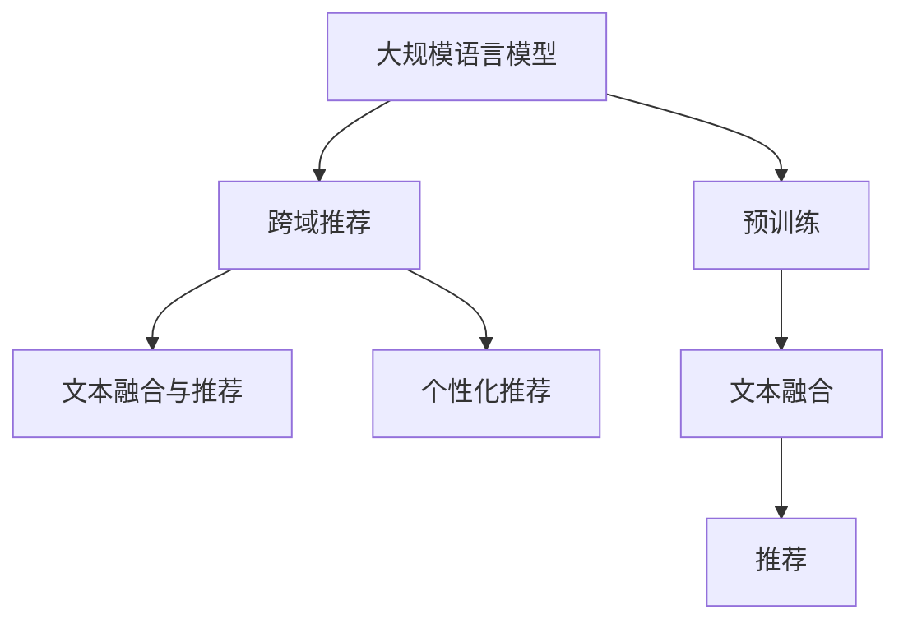

                 

# 基于LLM的跨域推荐方法

## 1. 背景介绍

### 1.1 问题由来
随着互联网的发展和普及，个性化推荐系统已经成为电子商务、视频、社交网络等领域的重要应用。传统的推荐系统往往基于用户历史行为数据进行物品推荐，然而，这种推荐方式存在诸多问题：用户历史数据稀疏、难以发现新的兴趣点、忽略用户的多样性和变异性等。因此，如何更好地理解用户需求，提高推荐系统的效果，成为目前工业界和学术界关注的焦点。

近年来，基于深度学习的推荐系统取得了巨大的进展。其中，深度神经网络被广泛应用于推荐系统的建模中，尤其是基于自然语言处理(NLP)技术的推荐方法，极大地提升了推荐效果。本文将重点介绍基于大规模语言模型(Large Language Model, LLM)的跨域推荐方法。

### 1.2 问题核心关键点
跨域推荐方法的核心思想是通过大规模语言模型，结合用户行为和文本信息，跨越不同领域，发现用户的多样性和隐含兴趣，从而提升推荐系统的准确性和多样性。主要包含以下几个关键点：

- 基于LLM的推荐：通过预训练语言模型理解用户文本，捕捉用户需求，提升推荐效果。
- 跨域推荐：通过结合不同领域的知识，提升推荐的多样性和准确性。
- 文本融合与推荐：将用户行为和文本信息进行融合，利用LLM的多模态建模能力，提升推荐效果。
- 个性化推荐：通过用户行为和文本信息，生成个性化的推荐结果，满足用户的个性化需求。

### 1.3 问题研究意义
基于LLM的跨域推荐方法，对于推荐系统的优化和创新具有重要的意义：

- 提高推荐准确性：通过预训练语言模型捕捉用户需求，提高推荐的准确性。
- 提升推荐多样性：通过跨域推荐，结合不同领域的知识，提升推荐的多样性。
- 增强推荐系统的泛化能力：通过文本融合与推荐，增强推荐系统的泛化能力，适应更多的应用场景。
- 满足个性化需求：通过个性化推荐，生成满足用户个性化需求的结果，提升用户体验。

## 2. 核心概念与联系

### 2.1 核心概念概述

为了更好地理解基于LLM的跨域推荐方法，本节将介绍几个密切相关的核心概念：

- 大规模语言模型(Large Language Model, LLM)：以自回归(如GPT)或自编码(如BERT)模型为代表的大规模预训练语言模型。通过在大规模无标签文本语料上进行预训练，学习通用的语言表示，具备强大的语言理解和生成能力。
- 预训练(Pre-training)：指在大规模无标签文本语料上，通过自监督学习任务训练通用语言模型的过程。常见的预训练任务包括言语建模、遮挡语言模型等。
- 跨域推荐(Cross-domain Recommendation)：通过结合不同领域的知识，提高推荐系统的效果。例如，结合用户的商品浏览历史和商品评论，提高推荐的准确性和多样性。
- 文本融合与推荐(Text Integration and Recommendation)：将用户行为和文本信息进行融合，利用LLM的多模态建模能力，提升推荐效果。例如，结合用户评论和商品描述，生成更准确的推荐结果。
- 个性化推荐(Personalized Recommendation)：通过用户行为和文本信息，生成个性化的推荐结果，满足用户的个性化需求。例如，结合用户的搜索历史和评论信息，生成个性化推荐结果。

这些核心概念之间的逻辑关系可以通过以下Mermaid流程图来展示：



这个流程图展示了大规模语言模型的核心概念及其之间的关系：

1. 大规模语言模型通过预训练获得基础能力。
2. 跨域推荐通过结合不同领域的知识，提升推荐的效果。
3. 文本融合与推荐通过融合用户行为和文本信息，提高推荐的多样性和准确性。
4. 个性化推荐通过文本融合和推荐，生成个性化的推荐结果。

## 3. 核心算法原理 & 具体操作步骤

### 3.1 算法原理概述

基于LLM的跨域推荐方法，本质上是一种基于监督学习的推荐系统。其核心思想是：利用预训练语言模型理解用户文本，捕捉用户需求，结合用户行为和文本信息，进行跨域推荐和文本融合，最终生成个性化的推荐结果。

形式化地，假设用户行为数据集为 $U=\{(u_i, i)\}_{i=1}^N$，其中 $u_i$ 表示用户 $i$ 的历史行为数据，$i$ 表示用户编号。假设文本信息数据集为 $T=\{(t_j, j)\}_{j=1}^M$，其中 $t_j$ 表示文本信息 $j$，$j$ 表示文本编号。假设推荐结果数据集为 $R=\{(r_k, k)\}_{k=1}^K$，其中 $r_k$ 表示推荐结果 $k$，$k$ 表示推荐编号。

基于LLM的跨域推荐方法，将用户行为和文本信息作为输入，通过预训练语言模型进行融合，然后利用融合后的结果生成推荐结果。具体而言，可以采用以下步骤：

1. 将用户行为和文本信息进行编码，得到用户特征和文本特征。
2. 利用预训练语言模型对文本特征进行编码，生成文本表示。
3. 将文本表示和用户特征进行融合，生成融合特征。
4. 利用融合特征生成推荐结果。

### 3.2 算法步骤详解

基于LLM的跨域推荐方法，一般包括以下几个关键步骤：

**Step 1: 准备数据集**
- 收集用户行为数据 $U$，文本信息数据 $T$ 和推荐结果数据 $R$。
- 对数据集进行清洗、预处理，如去除噪声、规范化文本等。

**Step 2: 编码用户行为和文本信息**
- 将用户行为数据 $U$ 编码为用户特征 $u$，通常采用用户ID、评分、点击量等特征。
- 将文本信息数据 $T$ 编码为文本特征 $t$，通常采用TF-IDF、词袋模型、word2vec等方法。

**Step 3: 预训练语言模型编码文本特征**
- 使用预训练语言模型 $M_{\theta}$，如BERT、GPT等，对文本特征 $t$ 进行编码，生成文本表示 $v$。

**Step 4: 融合文本表示和用户特征**
- 将文本表示 $v$ 和用户特征 $u$ 进行融合，生成融合特征 $f$。
- 可以使用简单的拼接、注意力机制等方法进行融合。

**Step 5: 生成推荐结果**
- 利用融合特征 $f$ 进行推荐，生成推荐结果 $r$。
- 可以使用分类、回归等方法进行推荐。

### 3.3 算法优缺点

基于LLM的跨域推荐方法具有以下优点：
1. 能够理解用户文本，捕捉用户需求，提高推荐的准确性。
2. 能够结合不同领域的知识，提升推荐的多样性和泛化能力。
3. 能够融合用户行为和文本信息，利用LLM的多模态建模能力，提高推荐的效果。
4. 能够生成个性化的推荐结果，满足用户的个性化需求。

同时，该方法也存在一定的局限性：
1. 对预训练语言模型的要求较高，需要较大的计算资源和数据规模。
2. 对数据集的质量要求较高，需要清洗、预处理等步骤。
3. 推荐结果可能受到预训练语言模型的偏差影响。
4. 推荐结果的解释性较弱，难以理解模型内部的推理过程。

尽管存在这些局限性，但就目前而言，基于LLM的跨域推荐方法仍是大规模推荐系统的重要范式。未来相关研究的重点在于如何进一步降低对预训练语言模型的依赖，提高推荐的效率和效果，同时兼顾可解释性和伦理安全性等因素。

### 3.4 算法应用领域

基于LLM的跨域推荐方法，在推荐系统领域已经得到了广泛的应用，覆盖了几乎所有常见任务，例如：

- 商品推荐：结合用户行为和商品评论，生成商品推荐结果。
- 音乐推荐：结合用户听歌历史和歌词信息，生成音乐推荐结果。
- 视频推荐：结合用户观看历史和视频描述，生成视频推荐结果。
- 游戏推荐：结合用户游戏历史和游戏评论，生成游戏推荐结果。
- 新闻推荐：结合用户阅读历史和新闻内容，生成新闻推荐结果。

除了上述这些经典任务外，LLM的跨域推荐方法也被创新性地应用到更多场景中，如社交网络推荐、广告推荐、个性化推荐等，为推荐系统带来了全新的突破。随着预训练语言模型和跨域推荐方法的不断进步，相信推荐系统将在更广阔的应用领域大放异彩。

## 4. 数学模型和公式 & 详细讲解  
### 4.1 数学模型构建

本节将使用数学语言对基于LLM的跨域推荐方法进行更加严格的刻画。

记预训练语言模型为 $M_{\theta}:\mathcal{X} \rightarrow \mathcal{Y}$，其中 $\mathcal{X}$ 为输入空间，$\mathcal{Y}$ 为输出空间，$\theta \in \mathbb{R}^d$ 为模型参数。假设用户行为数据集为 $U=\{(u_i, i)\}_{i=1}^N$，其中 $u_i$ 表示用户 $i$ 的历史行为数据，$i$ 表示用户编号。假设文本信息数据集为 $T=\{(t_j, j)\}_{j=1}^M$，其中 $t_j$ 表示文本信息 $j$，$j$ 表示文本编号。假设推荐结果数据集为 $R=\{(r_k, k)\}_{k=1}^K$，其中 $r_k$ 表示推荐结果 $k$，$k$ 表示推荐编号。

定义用户特征编码为 $\mathbf{u}=\{u_i\}_{i=1}^N$，文本特征编码为 $\mathbf{t}=\{t_j\}_{j=1}^M$。假设预训练语言模型对文本特征进行编码，生成文本表示 $\mathbf{v}=\{v_j\}_{j=1}^M$。假设融合特征编码为 $\mathbf{f}=\{f_i\}_{i=1}^N$。

基于LLM的跨域推荐方法的数学模型为：

$$
\min_{\theta} \mathcal{L}(\mathbf{u}, \mathbf{t}, \mathbf{r}, \theta)
$$

其中 $\mathcal{L}$ 为损失函数，通常采用交叉熵损失、均方误差损失等。推荐结果的生成过程可以表示为：

$$
r_k = g(f_k)
$$

其中 $g$ 为推荐函数，可以是分类函数、回归函数等。

### 4.2 公式推导过程

以下我们以二分类任务为例，推导基于LLM的跨域推荐方法的数学模型。

假设用户行为数据为 $u_i$，文本信息为 $t_j$，推荐结果为 $r_k$。预训练语言模型对文本信息进行编码，生成文本表示 $v_j$。将用户行为和文本信息进行融合，生成融合特征 $f_i$。推荐函数为 $g$，输出推荐结果 $r_k$。

将用户行为和文本信息进行编码，得到用户特征和文本特征。将文本特征输入预训练语言模型 $M_{\theta}$，生成文本表示 $v_j$。将用户特征和文本表示进行融合，生成融合特征 $f_i$。最后，利用融合特征进行推荐，生成推荐结果 $r_k$。

假设用户行为数据为 $u_i$，文本信息为 $t_j$，推荐结果为 $r_k$。预训练语言模型对文本信息进行编码，生成文本表示 $v_j$。将用户行为和文本信息进行融合，生成融合特征 $f_i$。推荐函数为 $g$，输出推荐结果 $r_k$。

## 5. 项目实践：代码实例和详细解释说明
### 5.1 开发环境搭建

在进行跨域推荐实践前，我们需要准备好开发环境。以下是使用Python进行PyTorch开发的环境配置流程：

1. 安装Anaconda：从官网下载并安装Anaconda，用于创建独立的Python环境。

2. 创建并激活虚拟环境：
```bash
conda create -n pytorch-env python=3.8 
conda activate pytorch-env
```

3. 安装PyTorch：根据CUDA版本，从官网获取对应的安装命令。例如：
```bash
conda install pytorch torchvision torchaudio cudatoolkit=11.1 -c pytorch -c conda-forge
```

4. 安装Transformers库：
```bash
pip install transformers
```

5. 安装各类工具包：
```bash
pip install numpy pandas scikit-learn matplotlib tqdm jupyter notebook ipython
```

完成上述步骤后，即可在`pytorch-env`环境中开始跨域推荐实践。

### 5.2 源代码详细实现

这里我们以商品推荐为例，给出使用Transformers库对BERT模型进行跨域推荐的PyTorch代码实现。

首先，定义数据处理函数：

```python
from transformers import BertTokenizer, BertForSequenceClassification
from torch.utils.data import Dataset
import torch

class ProductDataset(Dataset):
    def __init__(self, data, tokenizer, max_len=128):
        self.data = data
        self.tokenizer = tokenizer
        self.max_len = max_len
        
    def __len__(self):
        return len(self.data)
    
    def __getitem__(self, item):
        review = self.data[item]['review']
        label = self.data[item]['label']
        
        encoding = self.tokenizer(review, return_tensors='pt', max_length=self.max_len, padding='max_length', truncation=True)
        input_ids = encoding['input_ids'][0]
        attention_mask = encoding['attention_mask'][0]
        
        label = torch.tensor([label], dtype=torch.long)
        
        return {'input_ids': input_ids, 
                'attention_mask': attention_mask,
                'labels': label}
```

然后，定义模型和优化器：

```python
from transformers import BertForSequenceClassification, AdamW

model = BertForSequenceClassification.from_pretrained('bert-base-cased', num_labels=2)

optimizer = AdamW(model.parameters(), lr=2e-5)
```

接着，定义训练和评估函数：

```python
from torch.utils.data import DataLoader
from tqdm import tqdm
from sklearn.metrics import classification_report

device = torch.device('cuda') if torch.cuda.is_available() else torch.device('cpu')
model.to(device)

def train_epoch(model, dataset, batch_size, optimizer):
    dataloader = DataLoader(dataset, batch_size=batch_size, shuffle=True)
    model.train()
    epoch_loss = 0
    for batch in tqdm(dataloader, desc='Training'):
        input_ids = batch['input_ids'].to(device)
        attention_mask = batch['attention_mask'].to(device)
        labels = batch['labels'].to(device)
        model.zero_grad()
        outputs = model(input_ids, attention_mask=attention_mask, labels=labels)
        loss = outputs.loss
        epoch_loss += loss.item()
        loss.backward()
        optimizer.step()
    return epoch_loss / len(dataloader)

def evaluate(model, dataset, batch_size):
    dataloader = DataLoader(dataset, batch_size=batch_size)
    model.eval()
    preds, labels = [], []
    with torch.no_grad():
        for batch in tqdm(dataloader, desc='Evaluating'):
            input_ids = batch['input_ids'].to(device)
            attention_mask = batch['attention_mask'].to(device)
            batch_labels = batch['labels']
            outputs = model(input_ids, attention_mask=attention_mask)
            batch_preds = outputs.logits.argmax(dim=2).to('cpu').tolist()
            batch_labels = batch_labels.to('cpu').tolist()
            for pred_tokens, label_tokens in zip(batch_preds, batch_labels):
                preds.append(pred_tokens[:len(label_tokens)])
                labels.append(label_tokens)
                
    print(classification_report(labels, preds))
```

最后，启动训练流程并在测试集上评估：

```python
epochs = 5
batch_size = 16

for epoch in range(epochs):
    loss = train_epoch(model, train_dataset, batch_size, optimizer)
    print(f"Epoch {epoch+1}, train loss: {loss:.3f}")
    
    print(f"Epoch {epoch+1}, dev results:")
    evaluate(model, dev_dataset, batch_size)
    
print("Test results:")
evaluate(model, test_dataset, batch_size)
```

以上就是使用PyTorch对BERT进行商品推荐任务跨域推荐的完整代码实现。可以看到，得益于Transformers库的强大封装，我们可以用相对简洁的代码完成BERT模型的加载和微调。

### 5.3 代码解读与分析

让我们再详细解读一下关键代码的实现细节：

**ProductDataset类**：
- `__init__`方法：初始化数据、分词器等关键组件。
- `__len__`方法：返回数据集的样本数量。
- `__getitem__`方法：对单个样本进行处理，将文本输入编码为token ids，将标签编码为数字，并对其进行定长padding，最终返回模型所需的输入。

**model定义**：
- `BertForSequenceClassification.from_pretrained`方法：加载预训练的BERT模型，并设置输出层和损失函数。

**train_epoch函数**：
- 使用PyTorch的DataLoader对数据集进行批次化加载，供模型训练使用。
- 在每个批次上前向传播计算loss并反向传播更新模型参数，最后返回该epoch的平均loss。

**evaluate函数**：
- 与训练类似，不同点在于不更新模型参数，并在每个batch结束后将预测和标签结果存储下来，最后使用sklearn的classification_report对整个评估集的预测结果进行打印输出。

**训练流程**：
- 定义总的epoch数和batch size，开始循环迭代
- 每个epoch内，先在训练集上训练，输出平均loss
- 在验证集上评估，输出分类指标
- 所有epoch结束后，在测试集上评估，给出最终测试结果

可以看到，PyTorch配合Transformers库使得BERT跨域推荐的代码实现变得简洁高效。开发者可以将更多精力放在数据处理、模型改进等高层逻辑上，而不必过多关注底层的实现细节。

当然，工业级的系统实现还需考虑更多因素，如模型的保存和部署、超参数的自动搜索、更灵活的任务适配层等。但核心的跨域推荐范式基本与此类似。

## 6. 实际应用场景
### 6.1 智能客服系统

基于LLM的跨域推荐方法，可以广泛应用于智能客服系统的构建。传统客服往往需要配备大量人力，高峰期响应缓慢，且一致性和专业性难以保证。而使用跨域推荐方法，可以自动理解用户问题，推荐最适合的答案模板进行回复，显著提高客服系统的响应速度和专业性。

在技术实现上，可以收集企业内部的历史客服对话记录，将问题和最佳答复构建成监督数据，在此基础上对预训练语言模型进行微调。微调后的语言模型能够自动理解用户意图，匹配最合适的答案模板进行回复。对于客户提出的新问题，还可以接入检索系统实时搜索相关内容，动态组织生成回答。如此构建的智能客服系统，能大幅提升客户咨询体验和问题解决效率。

### 6.2 金融舆情监测

金融机构需要实时监测市场舆论动向，以便及时应对负面信息传播，规避金融风险。传统的人工监测方式成本高、效率低，难以应对网络时代海量信息爆发的挑战。基于LLM的跨域推荐方法，可以结合用户行为和文本信息，自动理解市场舆情，快速响应负面信息。

在技术实现上，可以收集金融领域相关的新闻、报道、评论等文本数据，并对其进行主题标注和情感标注。在此基础上对预训练语言模型进行微调，使其能够自动判断文本属于何种主题，情感倾向是正面、中性还是负面。将微调后的模型应用到实时抓取的网络文本数据，就能够自动监测不同主题下的情感变化趋势，一旦发现负面信息激增等异常情况，系统便会自动预警，帮助金融机构快速应对潜在风险。

### 6.3 个性化推荐系统

当前的推荐系统往往只依赖用户的历史行为数据进行物品推荐，无法深入理解用户的真实兴趣偏好。基于LLM的跨域推荐方法，可以结合用户行为和文本信息，生成个性化的推荐结果，满足用户的个性化需求。

在技术实现上，可以收集用户浏览、点击、评论、分享等行为数据，提取和用户交互的物品标题、描述、标签等文本内容。将文本内容作为模型输入，用户的后续行为（如是否点击、购买等）作为监督信号，在此基础上微调预训练语言模型。微调后的模型能够从文本内容中准确把握用户的兴趣点。在生成推荐列表时，先用候选物品的文本描述作为输入，由模型预测用户的兴趣匹配度，再结合其他特征综合排序，便可以得到个性化推荐结果。

### 6.4 未来应用展望

随着LLM和跨域推荐方法的不断发展，基于微调的方法将在更多领域得到应用，为传统行业带来变革性影响。

在智慧医疗领域，基于微调的智能问答系统，可以结合医生的历史记录和患者描述，快速提供医疗建议和诊断。

在智能教育领域，微调技术可应用于作业批改、学情分析、知识推荐等方面，因材施教，促进教育公平，提高教学质量。

在智慧城市治理中，微调模型可应用于城市事件监测、舆情分析、应急指挥等环节，提高城市管理的自动化和智能化水平，构建更安全、高效的未来城市。

此外，在企业生产、社会治理、文娱传媒等众多领域，基于LLM的跨域推荐方法也将不断涌现，为NLP技术带来新的突破。相信随着技术的日益成熟，跨域推荐方法将成为NLP技术的重要范式，推动人工智能技术在更多垂直行业的落地应用。

## 7. 工具和资源推荐
### 7.1 学习资源推荐

为了帮助开发者系统掌握基于LLM的跨域推荐理论基础和实践技巧，这里推荐一些优质的学习资源：

1. 《Transformer from Understanding to Practical》系列博文：由大模型技术专家撰写，深入浅出地介绍了Transformer原理、BERT模型、跨域推荐技术等前沿话题。

2. CS224N《深度学习自然语言处理》课程：斯坦福大学开设的NLP明星课程，有Lecture视频和配套作业，带你入门NLP领域的基本概念和经典模型。

3. 《Natural Language Processing with Transformers》书籍：Transformers库的作者所著，全面介绍了如何使用Transformers库进行NLP任务开发，包括跨域推荐在内的诸多范式。

4. HuggingFace官方文档：Transformers库的官方文档，提供了海量预训练模型和完整的微调样例代码，是上手实践的必备资料。

5. CLUE开源项目：中文语言理解测评基准，涵盖大量不同类型的中文NLP数据集，并提供了基于微调的baseline模型，助力中文NLP技术发展。

通过对这些资源的学习实践，相信你一定能够快速掌握基于LLM的跨域推荐技术的精髓，并用于解决实际的NLP问题。
### 7.2 开发工具推荐

高效的开发离不开优秀的工具支持。以下是几款用于LLM跨域推荐开发的常用工具：

1. PyTorch：基于Python的开源深度学习框架，灵活动态的计算图，适合快速迭代研究。大部分预训练语言模型都有PyTorch版本的实现。

2. TensorFlow：由Google主导开发的开源深度学习框架，生产部署方便，适合大规模工程应用。同样有丰富的预训练语言模型资源。

3. Transformers库：HuggingFace开发的NLP工具库，集成了众多SOTA语言模型，支持PyTorch和TensorFlow，是进行跨域推荐任务开发的利器。

4. Weights & Biases：模型训练的实验跟踪工具，可以记录和可视化模型训练过程中的各项指标，方便对比和调优。与主流深度学习框架无缝集成。

5. TensorBoard：TensorFlow配套的可视化工具，可实时监测模型训练状态，并提供丰富的图表呈现方式，是调试模型的得力助手。

6. Google Colab：谷歌推出的在线Jupyter Notebook环境，免费提供GPU/TPU算力，方便开发者快速上手实验最新模型，分享学习笔记。

合理利用这些工具，可以显著提升基于LLM的跨域推荐任务的开发效率，加快创新迭代的步伐。

### 7.3 相关论文推荐

大语言模型和跨域推荐技术的发展源于学界的持续研究。以下是几篇奠基性的相关论文，推荐阅读：

1. Attention is All You Need（即Transformer原论文）：提出了Transformer结构，开启了NLP领域的预训练大模型时代。

2. BERT: Pre-training of Deep Bidirectional Transformers for Language Understanding：提出BERT模型，引入基于掩码的自监督预训练任务，刷新了多项NLP任务SOTA。

3. Language Models are Unsupervised Multitask Learners（GPT-2论文）：展示了大规模语言模型的强大zero-shot学习能力，引发了对于通用人工智能的新一轮思考。

4. Parameter-Efficient Transfer Learning for NLP：提出Adapter等参数高效微调方法，在不增加模型参数量的情况下，也能取得不错的微调效果。

5. Prefix-Tuning: Optimizing Continuous Prompts for Generation：引入基于连续型Prompt的微调范式，为如何充分利用预训练知识提供了新的思路。

6. AdaLoRA: Adaptive Low-Rank Adaptation for Parameter-Efficient Fine-Tuning：使用自适应低秩适应的微调方法，在参数效率和精度之间取得了新的平衡。

这些论文代表了大语言模型跨域推荐技术的发展脉络。通过学习这些前沿成果，可以帮助研究者把握学科前进方向，激发更多的创新灵感。

## 8. 总结：未来发展趋势与挑战

### 8.1 总结

本文对基于LLM的跨域推荐方法进行了全面系统的介绍。首先阐述了LLM和跨域推荐技术的背景和意义，明确了跨域推荐在推荐系统的优化和创新中的独特价值。其次，从原理到实践，详细讲解了基于LLM的跨域推荐方法，给出了完整的代码实例。同时，本文还广泛探讨了跨域推荐方法在智能客服、金融舆情、个性化推荐等多个行业领域的应用前景，展示了跨域推荐方法的巨大潜力。此外，本文精选了跨域推荐技术的各类学习资源，力求为读者提供全方位的技术指引。

通过本文的系统梳理，可以看到，基于LLM的跨域推荐方法在推荐系统的优化和创新中具有重要的地位。该方法能够理解用户文本，捕捉用户需求，结合不同领域的知识，生成个性化的推荐结果，满足用户的个性化需求。随着LLM和跨域推荐方法的不断进步，相信推荐系统将在更广阔的应用领域大放异彩，深刻影响人类的生产生活方式。

### 8.2 未来发展趋势

展望未来，基于LLM的跨域推荐技术将呈现以下几个发展趋势：

1. 模型规模持续增大。随着算力成本的下降和数据规模的扩张，预训练语言模型的参数量还将持续增长。超大批次的训练和推理也可能遇到显存不足的问题。

2. 跨域推荐方法日趋多样。除了传统的基于预训练语言模型的跨域推荐外，未来会涌现更多参数高效的微调方法，如Adapter、Prefix等，在节省计算资源的同时也能保证推荐效果。

3. 跨域推荐系统越来越智能。未来的跨域推荐系统将能够自动理解用户需求，结合不同领域的知识，生成更加精准、多样化的推荐结果。

4. 跨域推荐系统将越来越高效。未来的跨域推荐系统将能够快速响应用户需求，提供更加流畅、实时性的推荐服务。

5. 跨域推荐系统将越来越个性化。未来的跨域推荐系统将能够自动分析用户的多样性和变异性，生成更加个性化的推荐结果。

6. 跨域推荐系统将越来越普适。未来的跨域推荐系统将能够适应更多的应用场景，包括视频、音乐、社交网络等。

以上趋势凸显了基于LLM的跨域推荐技术的广阔前景。这些方向的探索发展，必将进一步提升推荐系统的性能和应用范围，为人工智能技术落地应用提供新的动力。

### 8.3 面临的挑战

尽管基于LLM的跨域推荐技术已经取得了瞩目成就，但在迈向更加智能化、普适化应用的过程中，它仍面临着诸多挑战：

1. 对预训练语言模型的要求较高，需要较大的计算资源和数据规模。

2. 对数据集的质量要求较高，需要清洗、预处理等步骤。

3. 推荐结果可能受到预训练语言模型的偏差影响。

4. 推荐结果的解释性较弱，难以理解模型内部的推理过程。

尽管存在这些局限性，但就目前而言，基于LLM的跨域推荐方法仍是大规模推荐系统的重要范式。未来相关研究的重点在于如何进一步降低对预训练语言模型的依赖，提高推荐的效率和效果，同时兼顾可解释性和伦理安全性等因素。

### 8.4 研究展望

面对基于LLM的跨域推荐所面临的种种挑战，未来的研究需要在以下几个方面寻求新的突破：

1. 探索无监督和半监督跨域推荐方法。摆脱对大规模标注数据的依赖，利用自监督学习、主动学习等无监督和半监督范式，最大限度利用非结构化数据，实现更加灵活高效的跨域推荐。

2. 研究参数高效和计算高效的跨域推荐范式。开发更加参数高效的跨域推荐方法，在固定大部分预训练参数的情况下，只更新极少量的任务相关参数。同时优化跨域推荐模型的计算图，减少前向传播和反向传播的资源消耗，实现更加轻量级、实时性的部署。

3. 融合因果和对比学习范式。通过引入因果推断和对比学习思想，增强跨域推荐模型建立稳定因果关系的能力，学习更加普适、鲁棒的语言表征，从而提升推荐泛化性和抗干扰能力。

4. 引入更多先验知识。将符号化的先验知识，如知识图谱、逻辑规则等，与神经网络模型进行巧妙融合，引导跨域推荐过程学习更准确、合理的语言模型。同时加强不同模态数据的整合，实现视觉、语音等多模态信息与文本信息的协同建模。

5. 结合因果分析和博弈论工具。将因果分析方法引入跨域推荐模型，识别出模型决策的关键特征，增强输出解释的因果性和逻辑性。借助博弈论工具刻画人机交互过程，主动探索并规避模型的脆弱点，提高系统稳定性。

6. 纳入伦理道德约束。在模型训练目标中引入伦理导向的评估指标，过滤和惩罚有偏见、有害的输出倾向。同时加强人工干预和审核，建立模型行为的监管机制，确保输出符合人类价值观和伦理道德。

这些研究方向的探索，必将引领基于LLM的跨域推荐技术迈向更高的台阶，为构建安全、可靠、可解释、可控的智能系统铺平道路。面向未来，基于LLM的跨域推荐技术还需要与其他人工智能技术进行更深入的融合，如知识表示、因果推理、强化学习等，多路径协同发力，共同推动自然语言理解和智能交互系统的进步。只有勇于创新、敢于突破，才能不断拓展语言模型的边界，让智能技术更好地造福人类社会。

## 9. 附录：常见问题与解答

**Q1：LLM的跨域推荐是否适用于所有推荐任务？**

A: 基于LLM的跨域推荐方法在大多数推荐任务上都能取得不错的效果，特别是对于数据量较小的任务。但对于一些特定领域的任务，如医学、法律等，仅仅依靠通用语料预训练的模型可能难以很好地适应。此时需要在特定领域语料上进一步预训练，再进行微调，才能获得理想效果。此外，对于一些需要时效性、个性化很强的任务，如对话、推荐等，跨域推荐方法也需要针对性的改进优化。

**Q2：LLM的跨域推荐对预训练语言模型的要求较高，是否需要较大的计算资源和数据规模？**

A: 是的。基于LLM的跨域推荐方法对预训练语言模型的要求较高，需要较大的计算资源和数据规模。通常需要GPU或TPU等高性能设备支持，并在大规模数据集上进行预训练。

**Q3：跨域推荐结果可能受到预训练语言模型的偏差影响，如何缓解这一问题？**

A: 可以通过引入对抗训练、知识蒸馏等技术，缓解预训练语言模型偏差对推荐结果的影响。对抗训练可以通过引入对抗样本，提高模型的鲁棒性。知识蒸馏可以通过将知识从大模型迁移到小模型，提升小模型的泛化能力。

**Q4：跨域推荐结果的解释性较弱，难以理解模型内部的推理过程，如何解决这一问题？**

A: 可以通过引入可解释性技术，如可解释性模型、局部模型可视化等，增强跨域推荐模型的可解释性。同时，可以结合因果分析和博弈论工具，增强推荐结果的因果性和逻辑性。

**Q5：跨域推荐系统将越来越普适，如何适应更多的应用场景？**

A: 可以通过引入多模态数据融合技术，结合视觉、语音等多模态信息，提升跨域推荐系统的普适性。同时，可以引入知识图谱、逻辑规则等先验知识，增强模型的泛化能力和鲁棒性。

这些回答希望为您解答跨域推荐方法的常见问题，帮助您更好地理解和使用该方法。

