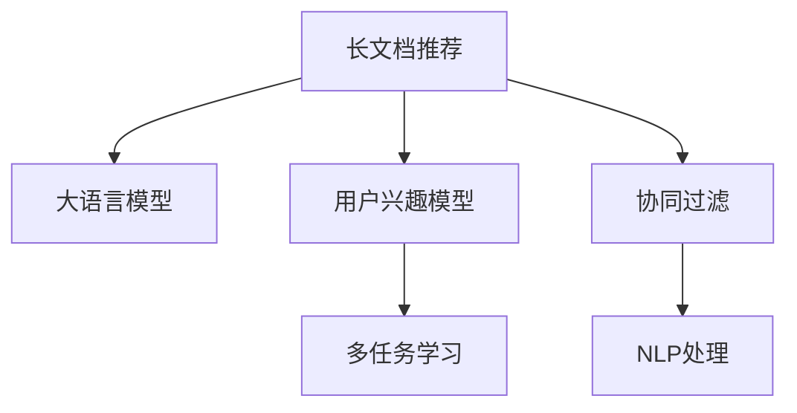

                 

# 基于LLM的长文档推荐方法

> 关键词：长文档推荐,大语言模型(LLM),用户兴趣模型,协同过滤,多任务学习

## 1. 背景介绍

随着互联网技术的发展，信息过载已经成为不争的事实。用户在使用搜索引擎、内容推荐平台时，常常面临海量的搜索结果和内容推荐，难以快速找到感兴趣或有用的信息。为了提升用户体验，增强信息发现的效率，长文档推荐系统应运而生。

长文档推荐系统是指能够推荐完整文章、长视频、长篇小说等长内容形式的系统。它与传统的短篇推荐系统有所不同，需要考虑文章的主题连贯性、结构完整性、信息新颖度等更多维度，因此面临更大的挑战。

长文档推荐系统广泛应用于新闻媒体、学术论文、图书出版等领域。用户可以通过长文档推荐系统，快速发现和获取感兴趣的深度内容，提升信息获取效率和深度。例如，用户可以通过长文档推荐系统发现最新的学术论文、理解复杂的概念、获取深入分析等，从而在各自领域获得更广泛的视野和更深入的理解。

## 2. 核心概念与联系

### 2.1 核心概念概述

为更好地理解基于大语言模型(LLM)的长文档推荐方法，本节将介绍几个密切相关的核心概念：

- 长文档推荐：推荐完整文章、长视频、长篇小说等长内容形式的推荐系统。与传统的短篇推荐系统不同，长文档推荐需要考虑文章的主题连贯性、结构完整性、信息新颖度等更多维度。

- 大语言模型(LLM)：以自回归(如GPT)或自编码(如BERT)模型为代表的大规模预训练语言模型。通过在大规模无标签文本语料上进行预训练，学习通用的语言表示，具备强大的语言理解和生成能力。

- 用户兴趣模型：根据用户的行为数据、历史偏好、社交网络等构建用户兴趣模型，预测用户对长文档的兴趣程度。

- 协同过滤：利用用户之间的行为相似性进行推荐，包括基于用户的协同过滤和基于物品的协同过滤。

- 多任务学习：通过多个相关任务的协同训练，共享知识，提升推荐系统的性能。

- 自然语言处理(NLP)：长文档推荐系统需要对长文档进行理解、分类、摘要等自然语言处理操作，以便进行推荐。

这些核心概念之间的逻辑关系可以通过以下Mermaid流程图来展示：



这个流程图展示了大语言模型在长文档推荐中的核心作用，同时涵盖了用户兴趣模型、协同过滤、多任务学习、NLP处理等多个关键环节。

## 3. 核心算法原理 & 具体操作步骤
### 3.1 算法原理概述

基于大语言模型的长文档推荐方法，核心思想是通过预训练的大语言模型，对长文档进行理解、分类、摘要等处理，并结合用户兴趣模型和协同过滤等技术，实现长文档的个性化推荐。

具体来说，方法分为以下几个步骤：

1. 对长文档进行预处理，提取关键信息，构建文档向量。
2. 利用预训练的大语言模型，对文档向量进行理解、分类、摘要等处理，生成文档表征。
3. 构建用户兴趣模型，预测用户对长文档的兴趣程度。
4. 利用协同过滤等技术，结合用户兴趣和文档表征，实现长文档的推荐。

### 3.2 算法步骤详解

以下是基于大语言模型的长文档推荐方法的具体操作步骤：

**Step 1: 文档预处理**
- 对长文档进行分词、去停用词、去除噪声等预处理操作，得到干净的文本数据。
- 对文本进行句法分析，识别出文章的结构信息，如段落、小标题等。
- 对文本进行实体识别，提取文章中的关键实体信息，如人物、地点、时间等。
- 对文本进行情感分析，识别出文章的整体情感倾向。

**Step 2: 文档向量化**
- 将处理后的文本数据进行向量化，如使用Word2Vec、GloVe等词向量模型进行编码。
- 对文档向量进行TF-IDF等权重调整，增强重要词语的权重。
- 对文档向量进行句子级拼接，生成文档级别的向量表示。

**Step 3: 文档理解与生成**
- 将文档向量输入预训练的大语言模型，如BERT、GPT等，进行语言理解、分类、摘要等操作。
- 大语言模型对文档进行编码，生成文档表征，表达文档的核心内容和主题信息。

**Step 4: 用户兴趣模型**
- 根据用户的行为数据、历史偏好、社交网络等，构建用户兴趣模型。
- 使用协同过滤、矩阵分解等技术，预测用户对长文档的兴趣程度。

**Step 5: 长文档推荐**
- 将文档表征与用户兴趣向量进行相似度计算，选择与用户兴趣最匹配的长文档。
- 利用多任务学习技术，结合文档理解、用户兴趣等多个任务，提升推荐效果。
- 将推荐结果进行展示，并提供人工筛选和修改的功能，增强用户体验。

### 3.3 算法优缺点

基于大语言模型的长文档推荐方法，具有以下优点：

- 能够处理复杂的长文档，考虑文档的主题连贯性、结构完整性、信息新颖度等更多维度。
- 利用大语言模型的强大语言理解能力，能够精准提取文档的核心内容和主题信息。
- 结合用户兴趣模型和协同过滤等技术，能够实现更加个性化的推荐。

同时，该方法也存在一些缺点：

- 对长文档进行预处理和向量化，需要额外的时间和计算资源。
- 大语言模型的推理速度较慢，影响推荐系统的实时性。
- 文档向量化和文档理解等步骤，需要较高的计算复杂度，对硬件资源有较高要求。
- 用户兴趣模型的构建和更新，需要丰富的用户行为数据和计算资源。

尽管存在这些局限性，但基于大语言模型的长文档推荐方法，已经在新闻媒体、学术论文、图书出版等领域取得了显著的进展，成为长文档推荐系统的重要组成部分。

### 3.4 算法应用领域

基于大语言模型的长文档推荐方法，广泛应用于以下领域：

- 新闻媒体：如人民日报、新华社等，利用长文档推荐系统，推荐深度报道、评论文章、专题报道等。
- 学术论文：如arXiv、PubMed等，推荐最新的学术论文、重要的研究成果等。
- 图书出版：如亚马逊、当当网等，推荐热门图书、经典作品等。
- 电影娱乐：如Netflix、YouTube等，推荐长视频、电影、电视剧等。

除了上述这些领域外，长文档推荐系统还被应用于科学研究、学术交流、知识普及等多个领域，为信息发现和知识传播提供了新的途径。

## 4. 数学模型和公式 & 详细讲解 & 举例说明

### 4.1 数学模型构建

本节将使用数学语言对基于大语言模型的长文档推荐方法进行更加严格的刻画。

假设长文档由文本 $D=\{x_1, x_2, \ldots, x_n\}$ 构成，其中 $x_i$ 表示第 $i$ 个文本句子，长度为 $L$。将每个文本句子向量化，得到文档向量 $X \in \mathbb{R}^{N \times L}$，其中 $N$ 表示文档长度，$L$ 表示文本长度。

定义大语言模型为 $M_\theta$，其中 $\theta$ 为模型参数。将文档向量 $X$ 输入大语言模型 $M_\theta$，得到文档表征 $Z \in \mathbb{R}^{K}$，其中 $K$ 为文档表征的维度。

假设用户兴趣模型为 $U_\lambda$，其中 $\lambda$ 为模型参数。根据用户的历史行为数据、社交网络等，预测用户对长文档的兴趣程度，得到用户兴趣向量 $U \in \mathbb{R}^{K}$。

将文档表征 $Z$ 与用户兴趣向量 $U$ 进行相似度计算，得到文档与用户的匹配度 $\mathbf{M} \in \mathbb{R}^{N}$。

### 4.2 公式推导过程

以下我们以二分类任务为例，推导文档理解与生成的公式。

假设文档由句子序列 $D=\{x_1, x_2, \ldots, x_n\}$ 构成，其中 $x_i$ 表示第 $i$ 个文本句子。将每个文本句子向量化，得到文档向量 $X \in \mathbb{R}^{N \times L}$，其中 $N$ 表示文档长度，$L$ 表示文本长度。

将文档向量 $X$ 输入预训练的大语言模型 $M_\theta$，得到文档表征 $Z \in \mathbb{R}^{K}$，其中 $K$ 为文档表征的维度。

对于句子 $x_i$，假设大语言模型的输出为 $\hat{y}=M_\theta(x_i)$，表示句子 $x_i$ 属于类别 $y$ 的概率。因此，整个文档的表征 $Z$ 可以表示为：

$$
Z = \frac{1}{N} \sum_{i=1}^N \hat{y}_i
$$

其中 $\hat{y}_i$ 表示文档的第 $i$ 个句子的预测概率。

使用softmax函数将文档表征 $Z$ 映射到类别 $Y$ 的概率分布，得到文档的类别概率 $P(Y|Z)$。

### 4.3 案例分析与讲解

下面以长文档推荐系统在新闻媒体中的应用为例，具体讲解其数学模型和公式的构建和应用。

假设用户阅读历史中，对政治类文章、科技类文章、娱乐类文章的兴趣程度分别为 $p_1, p_2, p_3$。根据用户的历史行为数据、社交网络等，构建用户兴趣模型 $U_\lambda$，预测用户对长文档的兴趣程度，得到用户兴趣向量 $U \in \mathbb{R}^{K}$。

对于一篇新闻文章，假设大语言模型对其进行了分类，分类结果为政治类、科技类、娱乐类，概率分别为 $0.3, 0.2, 0.5$。将分类结果作为文档向量 $X \in \mathbb{R}^{N \times L}$ 输入大语言模型 $M_\theta$，得到文档表征 $Z \in \mathbb{R}^{K}$。

使用softmax函数将文档表征 $Z$ 映射到类别 $Y$ 的概率分布，得到文档的类别概率 $P(Y|Z)$。假设文档的类别概率为政治类 $0.3, 科技类 0.2, 娱乐类 0.5$。

将文档表征 $Z$ 与用户兴趣向量 $U$ 进行相似度计算，得到文档与用户的匹配度 $\mathbf{M} \in \mathbb{R}^{N}$。假设匹配度为政治类 $0.4, 科技类 0.2, 娱乐类 0.5$。

根据文档与用户的匹配度，选择与用户兴趣最匹配的长文档，推荐给用户。假设用户对政治类文章最感兴趣，因此推荐政治类文章。

## 5. 项目实践：代码实例和详细解释说明
### 5.1 开发环境搭建

在进行长文档推荐系统开发前，我们需要准备好开发环境。以下是使用Python进行PyTorch开发的环境配置流程：

1. 安装Anaconda：从官网下载并安装Anaconda，用于创建独立的Python环境。

2. 创建并激活虚拟环境：
```bash
conda create -n pytorch-env python=3.8 
conda activate pytorch-env
```

3. 安装PyTorch：根据CUDA版本，从官网获取对应的安装命令。例如：
```bash
conda install pytorch torchvision torchaudio cudatoolkit=11.1 -c pytorch -c conda-forge
```

4. 安装Transformers库：
```bash
pip install transformers
```

5. 安装各类工具包：
```bash
pip install numpy pandas scikit-learn matplotlib tqdm jupyter notebook ipython
```

完成上述步骤后，即可在`pytorch-env`环境中开始长文档推荐系统的开发。

### 5.2 源代码详细实现

下面我们以长文档推荐系统为例，给出使用Transformers库对BERT模型进行长文档推荐的PyTorch代码实现。

首先，定义长文档数据处理函数：

```python
from transformers import BertTokenizer
from torch.utils.data import Dataset
import torch

class LongDocumentDataset(Dataset):
    def __init__(self, texts, tags, tokenizer, max_len=128):
        self.texts = texts
        self.tags = tags
        self.tokenizer = tokenizer
        self.max_len = max_len
        
    def __len__(self):
        return len(self.texts)
    
    def __getitem__(self, item):
        text = self.texts[item]
        tags = self.tags[item]
        
        encoding = self.tokenizer(text, return_tensors='pt', max_length=self.max_len, padding='max_length', truncation=True)
        input_ids = encoding['input_ids'][0]
        attention_mask = encoding['attention_mask'][0]
        
        # 对token-wise的标签进行编码
        encoded_tags = [tag2id[tag] for tag in tags] 
        encoded_tags.extend([tag2id['O']] * (self.max_len - len(encoded_tags)))
        labels = torch.tensor(encoded_tags, dtype=torch.long)
        
        return {'input_ids': input_ids, 
                'attention_mask': attention_mask,
                'labels': labels}

# 标签与id的映射
tag2id = {'O': 0, 'B-POLITICS': 1, 'I-POLITICS': 2, 'B-TECHNOLOGY': 3, 'I-TECHNOLOGY': 4, 'B-ENTERTAINMENT': 5, 'I-ENTERTAINMENT': 6}
id2tag = {v: k for k, v in tag2id.items()}

# 创建dataset
tokenizer = BertTokenizer.from_pretrained('bert-base-cased')

train_dataset = LongDocumentDataset(train_texts, train_tags, tokenizer)
dev_dataset = LongDocumentDataset(dev_texts, dev_tags, tokenizer)
test_dataset = LongDocumentDataset(test_texts, test_tags, tokenizer)
```

然后，定义模型和优化器：

```python
from transformers import BertForTokenClassification, AdamW

model = BertForTokenClassification.from_pretrained('bert-base-cased', num_labels=len(tag2id))

optimizer = AdamW(model.parameters(), lr=2e-5)
```

接着，定义训练和评估函数：

```python
from torch.utils.data import DataLoader
from tqdm import tqdm
from sklearn.metrics import classification_report

device = torch.device('cuda') if torch.cuda.is_available() else torch.device('cpu')
model.to(device)

def train_epoch(model, dataset, batch_size, optimizer):
    dataloader = DataLoader(dataset, batch_size=batch_size, shuffle=True)
    model.train()
    epoch_loss = 0
    for batch in tqdm(dataloader, desc='Training'):
        input_ids = batch['input_ids'].to(device)
        attention_mask = batch['attention_mask'].to(device)
        labels = batch['labels'].to(device)
        model.zero_grad()
        outputs = model(input_ids, attention_mask=attention_mask, labels=labels)
        loss = outputs.loss
        epoch_loss += loss.item()
        loss.backward()
        optimizer.step()
    return epoch_loss / len(dataloader)

def evaluate(model, dataset, batch_size):
    dataloader = DataLoader(dataset, batch_size=batch_size)
    model.eval()
    preds, labels = [], []
    with torch.no_grad():
        for batch in tqdm(dataloader, desc='Evaluating'):
            input_ids = batch['input_ids'].to(device)
            attention_mask = batch['attention_mask'].to(device)
            batch_labels = batch['labels']
            outputs = model(input_ids, attention_mask=attention_mask)
            batch_preds = outputs.logits.argmax(dim=2).to('cpu').tolist()
            batch_labels = batch_labels.to('cpu').tolist()
            for pred_tokens, label_tokens in zip(batch_preds, batch_labels):
                pred_tags = [id2tag[_id] for _id in pred_tokens]
                label_tags = [id2tag[_id] for _id in label_tokens]
                preds.append(pred_tags[:len(label_tokens)])
                labels.append(label_tags)
                
    print(classification_report(labels, preds))
```

最后，启动训练流程并在测试集上评估：

```python
epochs = 5
batch_size = 16

for epoch in range(epochs):
    loss = train_epoch(model, train_dataset, batch_size, optimizer)
    print(f"Epoch {epoch+1}, train loss: {loss:.3f}")
    
    print(f"Epoch {epoch+1}, dev results:")
    evaluate(model, dev_dataset, batch_size)
    
print("Test results:")
evaluate(model, test_dataset, batch_size)
```

以上就是使用PyTorch对BERT进行长文档推荐系统的完整代码实现。可以看到，得益于Transformers库的强大封装，我们可以用相对简洁的代码完成BERT模型的加载和微调。

### 5.3 代码解读与分析

让我们再详细解读一下关键代码的实现细节：

**LongDocumentDataset类**：
- `__init__`方法：初始化文本、标签、分词器等关键组件。
- `__len__`方法：返回数据集的样本数量。
- `__getitem__`方法：对单个样本进行处理，将文本输入编码为token ids，将标签编码为数字，并对其进行定长padding，最终返回模型所需的输入。

**tag2id和id2tag字典**：
- 定义了标签与数字id之间的映射关系，用于将token-wise的预测结果解码回真实的标签。

**训练和评估函数**：
- 使用PyTorch的DataLoader对数据集进行批次化加载，供模型训练和推理使用。
- 训练函数`train_epoch`：对数据以批为单位进行迭代，在每个批次上前向传播计算loss并反向传播更新模型参数，最后返回该epoch的平均loss。
- 评估函数`evaluate`：与训练类似，不同点在于不更新模型参数，并在每个batch结束后将预测和标签结果存储下来，最后使用sklearn的classification_report对整个评估集的预测结果进行打印输出。

**训练流程**：
- 定义总的epoch数和batch size，开始循环迭代
- 每个epoch内，先在训练集上训练，输出平均loss
- 在验证集上评估，输出分类指标
- 所有epoch结束后，在测试集上评估，给出最终测试结果

可以看到，PyTorch配合Transformers库使得BERT微调的代码实现变得简洁高效。开发者可以将更多精力放在数据处理、模型改进等高层逻辑上，而不必过多关注底层的实现细节。

当然，工业级的系统实现还需考虑更多因素，如模型的保存和部署、超参数的自动搜索、更灵活的任务适配层等。但核心的微调范式基本与此类似。

## 6. 实际应用场景
### 6.1 新闻媒体

长文档推荐系统在新闻媒体中的应用极为广泛。新闻媒体需要为用户提供深度报道、评论文章、专题报道等长文档内容，提升用户阅读体验和信息获取效率。

在技术实现上，可以收集用户的历史阅读行为数据，预测用户对不同主题的长文档的兴趣程度。在推荐长文档时，结合文档主题、作者、发布时间等多维信息，进行综合评估和排序。对于长文档内容，还可以进行情感分析、实体识别等处理，提升推荐质量。

例如，人民日报可以通过长文档推荐系统，推荐深度报道、评论文章、专题报道等，帮助用户了解国内外重大事件，获取深度信息。用户可以通过长文档推荐系统，快速找到感兴趣的报道内容，提升阅读体验。

### 6.2 学术论文

学术论文是学术交流的重要形式，长文档推荐系统可以辅助研究人员快速发现最新的研究成果、重要的学术论文等。

在技术实现上，可以收集研究人员的历史论文阅读记录，预测其对不同主题的长文档的兴趣程度。在推荐长文档时，结合文档的主题、作者、引用次数等多维信息，进行综合评估和排序。对于长文档内容，还可以进行摘要、关键词提取等处理，提升推荐质量。

例如，arXiv可以通过长文档推荐系统，推荐最新的学术论文、重要的研究成果等，帮助研究人员获取最新的研究进展，提升科研效率。研究人员可以通过长文档推荐系统，快速找到感兴趣的学术论文，获取深度信息。

### 6.3 图书出版

图书出版行业需要为用户提供热门图书、经典作品等长文档内容，提升用户阅读体验和信息获取效率。

在技术实现上，可以收集用户的历史阅读行为数据，预测其对不同主题的长文档的兴趣程度。在推荐长文档时，结合文档的主题、作者、出版时间等多维信息，进行综合评估和排序。对于长文档内容，还可以进行摘要、关键词提取等处理，提升推荐质量。

例如，亚马逊可以通过长文档推荐系统，推荐热门图书、经典作品等，提升用户阅读体验。用户可以通过长文档推荐系统，快速找到感兴趣的图书，获取深度信息。

### 6.4 电影娱乐

长文档推荐系统在电影娱乐领域也有广泛应用。视频平台需要为用户提供长视频、电影、电视剧等长内容形式的推荐，提升用户观影体验和信息获取效率。

在技术实现上，可以收集用户的历史观影记录，预测其对不同主题的长视频、电影、电视剧的兴趣程度。在推荐长视频、电影、电视剧时，结合视频的主题、导演、演员等多维信息，进行综合评估和排序。对于长视频、电影、电视剧内容，还可以进行情感分析、实体识别等处理，提升推荐质量。

例如，Netflix可以通过长文档推荐系统，推荐长视频、电影、电视剧等，提升用户观影体验。用户可以通过长文档推荐系统，快速找到感兴趣的视频内容，获取深度信息。

## 7. 工具和资源推荐
### 7.1 学习资源推荐

为了帮助开发者系统掌握长文档推荐理论基础和实践技巧，这里推荐一些优质的学习资源：

1. 《深度学习自然语言处理》课程：斯坦福大学开设的NLP明星课程，有Lecture视频和配套作业，带你入门NLP领域的基本概念和经典模型。

2. 《Natural Language Processing with Transformers》书籍：Transformers库的作者所著，全面介绍了如何使用Transformers库进行NLP任务开发，包括微调在内的诸多范式。

3. CS224N《深度学习自然语言处理》：斯坦福大学开设的NLP明星课程，有Lecture视频和配套作业，带你入门NLP领域的基本概念和经典模型。

4. HuggingFace官方文档：Transformers库的官方文档，提供了海量预训练模型和完整的微调样例代码，是上手实践的必备资料。

5. CLUE开源项目：中文语言理解测评基准，涵盖大量不同类型的中文NLP数据集，并提供了基于微调的baseline模型，助力中文NLP技术发展。

通过对这些资源的学习实践，相信你一定能够快速掌握长文档推荐方法的精髓，并用于解决实际的NLP问题。
###  7.2 开发工具推荐

高效的开发离不开优秀的工具支持。以下是几款用于长文档推荐系统开发的常用工具：

1. PyTorch：基于Python的开源深度学习框架，灵活动态的计算图，适合快速迭代研究。大部分预训练语言模型都有PyTorch版本的实现。

2. TensorFlow：由Google主导开发的开源深度学习框架，生产部署方便，适合大规模工程应用。同样有丰富的预训练语言模型资源。

3. Transformers库：HuggingFace开发的NLP工具库，集成了众多SOTA语言模型，支持PyTorch和TensorFlow，是进行长文档推荐系统开发的利器。

4. Weights & Biases：模型训练的实验跟踪工具，可以记录和可视化模型训练过程中的各项指标，方便对比和调优。与主流深度学习框架无缝集成。

5. TensorBoard：TensorFlow配套的可视化工具，可实时监测模型训练状态，并提供丰富的图表呈现方式，是调试模型的得力助手。

6. Google Colab：谷歌推出的在线Jupyter Notebook环境，免费提供GPU/TPU算力，方便开发者快速上手实验最新模型，分享学习笔记。

合理利用这些工具，可以显著提升长文档推荐系统的开发效率，加快创新迭代的步伐。

### 7.3 相关论文推荐

长文档推荐系统是NLP领域的热点研究方向之一，以下是几篇奠基性的相关论文，推荐阅读：

1. Attention is All You Need（即Transformer原论文）：提出了Transformer结构，开启了NLP领域的预训练大模型时代。

2. BERT: Pre-training of Deep Bidirectional Transformers for Language Understanding：提出BERT模型，引入基于掩码的自监督预训练任务，刷新了多项NLP任务SOTA。

3. Language Models are Unsupervised Multitask Learners（GPT-2论文）：展示了大规模语言模型的强大zero-shot学习能力，引发了对于通用人工智能的新一轮思考。

4. Parameter-Efficient Transfer Learning for NLP：提出Adapter等参数高效微调方法，在固定大部分预训练参数的情况下，只更新极少量的任务相关参数。

5. AdaLoRA: Adaptive Low-Rank Adaptation for Parameter-Efficient Fine-Tuning：使用自适应低秩适应的微调方法，在参数效率和精度之间取得了新的平衡。

这些论文代表了大语言模型长文档推荐技术的发展脉络。通过学习这些前沿成果，可以帮助研究者把握学科前进方向，激发更多的创新灵感。

## 8. 总结：未来发展趋势与挑战

### 8.1 总结

本文对基于大语言模型的长文档推荐方法进行了全面系统的介绍。首先阐述了长文档推荐系统的背景和意义，明确了其在新闻媒体、学术论文、图书出版等领域的应用价值。其次，从原理到实践，详细讲解了长文档推荐系统的数学模型和关键步骤，给出了长文档推荐系统开发和评估的完整代码实例。同时，本文还广泛探讨了长文档推荐系统在新闻媒体、学术论文、图书出版、电影娱乐等多个领域的应用前景，展示了长文档推荐系统的巨大潜力。此外，本文精选了长文档推荐系统的各类学习资源，力求为开发者提供全方位的技术指引。

通过本文的系统梳理，可以看到，基于大语言模型的长文档推荐方法正在成为NLP领域的重要范式，极大地拓展了长文档推荐系统的应用边界，催生了更多的落地场景。得益于大规模语料的预训练，长文档推荐系统以更低的时间和标注成本，在小样本条件下也能取得不错的效果，有力推动了NLP技术的产业化进程。未来，伴随预训练语言模型和长文档推荐方法的持续演进，相信NLP技术将在更广阔的应用领域大放异彩，深刻影响人类的生产生活方式。

### 8.2 未来发展趋势

展望未来，长文档推荐系统将呈现以下几个发展趋势：

1. 文档理解与生成能力提升。伴随大语言模型技术的发展，长文档推荐系统将具备更强大的文档理解与生成能力，能够处理更复杂的长文档内容，并生成高质量的摘要、评论等。

2. 多任务学习与联合推荐。利用多任务学习的思想，结合文档理解、情感分析、实体识别等多个任务，提升推荐系统的性能。结合协同过滤、基于物品的推荐等方法，实现更加全面的推荐。

3. 用户兴趣模型优化。采用深度学习方法，结合用户的历史行为数据、社交网络等，构建更加精准的用户兴趣模型，提升推荐的个性化和多样性。

4. 动态推荐与实时更新。利用在线学习、增量学习等技术，实时更新推荐模型，动态适应用户兴趣的变化，提升推荐的即时性和有效性。

5. 多模态数据融合。结合图像、视频、语音等多模态数据，提升推荐系统的智能化水平，为用户提供更丰富、更直观的推荐体验。

6. 可解释性与伦理性提升。开发可解释的推荐系统，增强用户对推荐结果的信任和理解。同时引入伦理性评估指标，确保推荐系统的公正性和公平性。

以上趋势凸显了长文档推荐系统的广阔前景。这些方向的探索发展，必将进一步提升推荐系统的性能和应用范围，为信息发现和知识传播带来新的途径。

### 8.3 面临的挑战

尽管长文档推荐系统已经取得了一定的进展，但在迈向更加智能化、普适化应用的过程中，它仍面临着诸多挑战：

1. 长文档数据处理。长文档数据通常结构复杂，信息量巨大，需要高效的文本处理和理解技术，才能从中提取关键信息。这对处理能力和计算资源提出了很高的要求。

2. 推理速度与效率。长文档推荐系统需要高效处理长文档数据，并快速生成推荐结果，这对计算速度和资源消耗提出了很高的要求。如何在保证性能的同时，提升系统的实时性，仍然是一个挑战。

3. 用户兴趣模型构建。用户兴趣模型需要大量的用户行为数据和计算资源，才能构建出精准的兴趣模型。如何高效地构建和更新用户兴趣模型，仍然是一个挑战。

4. 可解释性与伦理性。长文档推荐系统需要开发可解释的推荐模型，增强用户对推荐结果的理解和信任。同时引入伦理性评估指标，确保推荐系统的公正性和公平性，也需要进一步探索。

5. 多模态数据融合。多模态数据的融合需要高效的跨模态技术，才能实现不同数据类型的协同建模。如何高效地融合多模态数据，提升系统的智能化水平，仍然是一个挑战。

6. 动态推荐与实时更新。实时动态推荐需要高效的在线学习、增量学习技术，才能快速适应用户兴趣的变化。如何高效地实现动态推荐，仍然是一个挑战。

正视长文档推荐系统面临的这些挑战，积极应对并寻求突破，将是大语言模型长文档推荐系统走向成熟的必由之路。相信随着学界和产业界的共同努力，这些挑战终将一一被克服，长文档推荐系统必将在构建人机协同的智能时代中扮演越来越重要的角色。

### 8.4 研究展望

面对长文档推荐系统所面临的挑战，未来的研究需要在以下几个方面寻求新的突破：

1. 探索更高效的文档处理和理解技术。开发更高效的长文档处理工具，提升文本处理的准确性和效率。研究跨模态技术，提升多模态数据的融合效果。

2. 研究更高效的推理和推荐算法。开发高效的推理算法，提升系统的实时性和计算效率。结合协同过滤、多任务学习等技术，提升推荐系统的性能。

3. 探索更精准的用户兴趣模型。结合用户行为数据、社交网络等，开发更精准的用户兴趣模型。利用深度学习技术，实现更高效的模型训练和更新。

4. 开发更可解释的推荐系统。开发可解释的推荐模型，增强用户对推荐结果的理解和信任。引入伦理性评估指标，确保推荐系统的公正性和公平性。

5. 研究动态推荐与实时更新的技术。结合在线学习、增量学习等技术，实现动态推荐和实时更新。提升系统的响应速度和用户体验。

6. 探索多模态数据融合技术。研究高效的跨模态技术，提升多模态数据的融合效果。开发多模态推荐系统，提升推荐系统的智能化水平。

这些研究方向将引领长文档推荐系统技术的发展，推动NLP技术在更多领域的应用和普及。相信随着技术的不断进步，长文档推荐系统必将在构建人机协同的智能时代中扮演越来越重要的角色，为信息发现和知识传播带来新的途径。

## 9. 附录：常见问题与解答

**Q1：长文档推荐系统如何处理长文档数据？**

A: 长文档推荐系统通常需要处理结构复杂、信息量巨大的长文档数据。处理长文档数据的常用方法包括：
1. 分词：将长文档分成句子或段落，进行词汇级别的处理。
2. 去停用词：去除常用词、标点符号等无用信息，提升处理效率。
3. 实体识别：识别出文档中的关键实体，如人名、地名、时间等，进行结构化处理。
4. 情感分析：分析文档的情感倾向，进行情感分类。
5. 主题建模：提取文档的主题信息，进行主题分类。

通过这些处理技术，长文档推荐系统可以提取出关键信息，进行结构化表示，方便后续的文档理解与生成。

**Q2：长文档推荐系统如何提升推荐质量？**

A: 长文档推荐系统可以采用多种方法提升推荐质量，包括：
1. 文档理解与生成：利用大语言模型对长文档进行理解、分类、摘要等操作，生成高质量的文档表征。
2. 用户兴趣模型：根据用户的历史行为数据、社交网络等，构建精准的用户兴趣模型，预测用户对长文档的兴趣程度。
3. 多任务学习：结合文档理解、情感分析、实体识别等多个任务，共享知识，提升推荐系统的性能。
4. 协同过滤：利用用户之间的行为相似性进行推荐，提升推荐的个性化和多样性。
5. 多模态数据融合：结合图像、视频、语音等多模态数据，提升推荐系统的智能化水平，为用户提供更丰富、更直观的推荐体验。

通过这些方法的组合应用，长文档推荐系统可以提升推荐的精度和多样性，满足用户的不同需求。

**Q3：长文档推荐系统面临哪些技术挑战？**

A: 长文档推荐系统面临的技术挑战包括：
1. 长文档数据处理：长文档数据通常结构复杂，信息量巨大，需要高效的文本处理和理解技术，才能从中提取关键信息。
2. 推理速度与效率：长文档推荐系统需要高效处理长文档数据，并快速生成推荐结果，这对计算速度和资源消耗提出了很高的要求。
3. 用户兴趣模型构建：用户兴趣模型需要大量的用户行为数据和计算资源，才能构建出精准的兴趣模型。
4. 可解释性与伦理性：长文档推荐系统需要开发可解释的推荐模型，增强用户对推荐结果的理解和信任。同时引入伦理性评估指标，确保推荐系统的公正性和公平性。
5. 多模态数据融合：多模态数据的融合需要高效的跨模态技术，才能实现不同数据类型的协同建模。
6. 动态推荐与实时更新：实时动态推荐需要高效的在线学习、增量学习技术，才能快速适应用户兴趣的变化。

通过解决这些技术挑战，长文档推荐系统可以更好地发挥其应用价值，为用户带来更优质的体验。

**Q4：长文档推荐系统如何提升用户体验？**

A: 长文档推荐系统可以通过以下方式提升用户体验：
1. 个性化推荐：结合用户的历史行为数据、社交网络等，构建精准的用户兴趣模型，预测用户对长文档的兴趣程度，进行个性化推荐。
2. 高质量内容推荐：利用大语言模型对长文档进行理解、分类、摘要等操作，生成高质量的文档表征，进行推荐。
3. 动态推荐与实时更新：结合在线学习、增量学习等技术，实时更新推荐模型，动态适应用户兴趣的变化，提升推荐的即时性和有效性。
4. 可解释性：开发可解释的推荐模型，增强用户对推荐结果的理解和信任。
5. 多模态融合：结合图像、视频、语音等多模态数据，提升推荐系统的智能化水平，为用户提供更丰富、更直观的推荐体验。

通过这些优化措施，长文档推荐系统可以更好地满足用户的需求，提升用户体验。

**Q5：长文档推荐系统如何提升推荐效果？**

A: 长文档推荐系统可以通过以下方式提升推荐效果：
1. 文档理解与生成：利用大语言模型对长文档进行理解、分类、摘要等操作，生成高质量的文档表征。
2. 用户兴趣模型：根据用户的历史行为数据、社交网络等，构建精准的用户兴趣模型，预测用户对长文档的兴趣程度。
3. 多任务学习：结合文档理解、情感分析、实体识别等多个任务，共享知识，提升推荐系统的性能。
4. 协同过滤：利用用户之间的行为相似性进行推荐，提升推荐的个性化和多样性。
5. 多模态数据融合：结合图像、视频、语音等多模态数据，提升推荐系统的智能化水平，为用户提供更丰富、更直观的推荐体验。

通过这些方法的组合应用，长文档推荐系统可以提升推荐的精度和多样性，满足用户的不同需求。

---

作者：禅与计算机程序设计艺术 / Zen and the Art of Computer Programming

