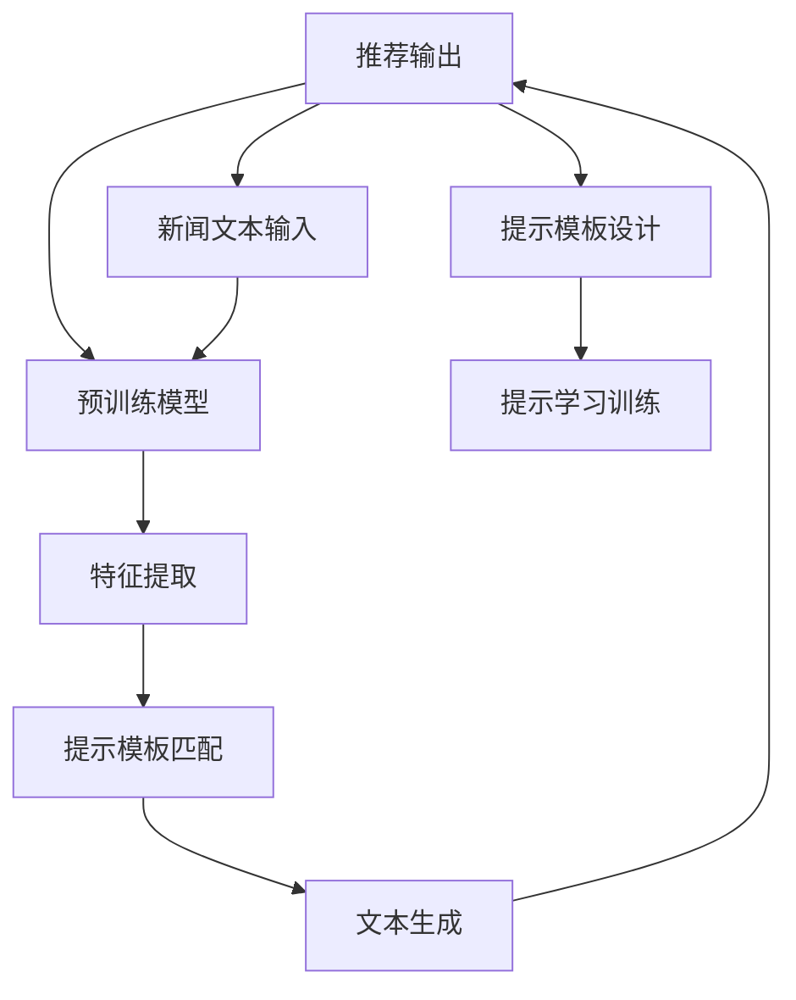

                 

# 基于Prompt Learning的新闻推荐

> 关键词：新闻推荐,推荐系统,提示学习,Prompt Learning,自然语言处理(NLP),信息检索,预训练模型

## 1. 背景介绍

### 1.1 问题由来

随着互联网的普及和数字媒体的兴起，新闻推荐系统在为用户定制个性化信息流方面起到了越来越重要的作用。这些推荐系统旨在帮助用户发现感兴趣的新闻内容，节省时间，提升阅读体验。传统的新闻推荐系统通常基于协同过滤、内容推荐等方法，根据用户的历史行为或兴趣标签进行推荐，但这些方法往往依赖于大量的用户反馈数据，且难以处理冷启动问题。

近年来，基于大语言模型的新闻推荐系统开始受到关注。这种推荐系统利用预训练的语言模型作为特征提取器，在文本相似度匹配、情感分析、命名实体识别等NLP任务上获得出色的性能。尤其当预训练模型被微调成针对特定领域的版本时，其新闻推荐能力更是显著提升。

### 1.2 问题核心关键点

提示学习(Prompt Learning)是一种新兴的AI技术，通过设计特定的提示模板(Prompt Template)，引导大语言模型进行特定任务推理和生成。这种技术不仅在不更新模型参数的情况下，实现了零样本或少样本学习，还适用于新闻推荐系统中对实时性要求高的应用场景。

本文将深入探讨基于Prompt Learning的新闻推荐系统，分析其核心概念和实现原理，并结合实际应用场景进行详细解读。通过这种技术，新闻推荐系统能够更高效、灵活地推荐新闻，并更好地理解用户需求。

## 2. 核心概念与联系

### 2.1 核心概念概述

在探讨基于Prompt Learning的新闻推荐系统之前，我们首先需要理解一些关键概念：

- **新闻推荐系统(News Recommendation System)**：一种基于用户兴趣和行为，自动推荐相关新闻内容的系统。传统推荐系统主要依赖用户反馈数据，而基于大语言模型的推荐系统则能够直接从新闻文本中提取特征，提升推荐的准确性和泛化能力。

- **提示学习(Prompt Learning)**：通过在输入文本中添加提示模板，引导大语言模型进行特定任务的推理和生成。这种技术在未更新模型参数的情况下，实现了零样本或少样本学习，适用于实时性要求高的新闻推荐系统。

- **自然语言处理(NLP)**：涉及计算机对自然语言的理解和生成，包括文本分类、信息检索、命名实体识别等任务。这些技术是构建基于Prompt Learning的新闻推荐系统的重要基础。

- **预训练模型(Pre-trained Model)**：如BERT、GPT等，通过在大规模无标签文本数据上进行预训练，学习通用的语言表示。这些模型在大规模数据上预训练后，能够迁移学习到特定任务的知识，提升下游任务的性能。

### 2.2 核心概念原理和架构的 Mermaid 流程图



这个流程图展示了基于Prompt Learning的新闻推荐系统的核心架构：

1. 用户输入新闻文本，作为系统推荐输入。
2. 预训练模型作为特征提取器，提取文本特征。
3. 提示模板设计模块，设计特定任务的提示模板。
4. 提示学习模块，根据输入文本和提示模板，生成新的文本或特征。
5. 提示模板匹配模块，计算提示模板与新闻文本的相似度。
6. 文本生成模块，使用预训练模型和提示模板生成推荐文本。
7. 推荐输出模块，将生成的推荐文本输出给用户。

## 3. 核心算法原理 & 具体操作步骤

### 3.1 算法原理概述

基于Prompt Learning的新闻推荐系统，通过设计特定的提示模板，引导预训练模型进行特定任务推理和生成，从而提升推荐的准确性和时效性。其核心原理可概括为以下几个步骤：

1. **特征提取**：利用预训练模型提取新闻文本的特征，捕捉文本中的关键信息。
2. **提示模板设计**：根据新闻推荐任务的特点，设计特定的提示模板。
3. **提示学习训练**：使用提示模板对预训练模型进行微调，提升模型对特定任务的推理能力。
4. **文本生成**：使用微调后的预训练模型和提示模板生成推荐文本。
5. **推荐输出**：将生成的推荐文本展示给用户。

### 3.2 算法步骤详解

以下是基于Prompt Learning的新闻推荐系统的详细操作步骤：

**Step 1: 特征提取**
- 首先，使用预训练模型(如BERT、GPT等)对新闻文本进行特征提取。可以使用文本分类任务中的模型，也可以使用预训练模型中的特定层。

**Step 2: 提示模板设计**
- 根据新闻推荐任务的特点，设计特定的提示模板。例如，对于个性化推荐，提示模板可以是“请你推荐几条感兴趣的新闻”。对于新闻事件推荐，提示模板可以是“这是关于[事件名]的最新新闻”。

**Step 3: 提示学习训练**
- 使用提示模板对预训练模型进行微调，提升模型对特定任务的推理能力。这可以通过设定特定的损失函数来实现，例如交叉熵损失。

**Step 4: 文本生成**
- 使用微调后的预训练模型和提示模板生成推荐文本。例如，在给定新闻标题和事件名的情况下，生成一条相关新闻。

**Step 5: 推荐输出**
- 将生成的推荐文本展示给用户，同时记录用户的选择和反馈，进一步优化推荐系统。

### 3.3 算法优缺点

基于Prompt Learning的新闻推荐系统具有以下优点：

1. **灵活性高**：提示模板的设计可以根据不同的推荐任务进行调整，适应各种应用场景。
2. **实时性高**：提示学习和文本生成过程快速，适合实时新闻推荐。
3. **泛化能力强**：预训练模型已经在大规模数据上进行了充分的训练，具有很强的泛化能力。

同时，该方法也存在一些局限性：

1. **依赖提示模板**：提示模板的设计和优化需要经验和专业知识，设计不当可能影响推荐效果。
2. **泛化能力有限**：尽管预训练模型具有较强的泛化能力，但在新领域或特定领域的效果可能不如专门训练的模型。
3. **数据敏感**：提示模板的设计和微调过程依赖于数据集的质量，数据偏差可能导致推荐结果的偏差。

### 3.4 算法应用领域

基于Prompt Learning的新闻推荐系统广泛应用于以下领域：

- **个性化推荐**：根据用户的历史阅读记录，推荐个性化新闻内容。
- **事件推荐**：根据新闻事件的热度和用户兴趣，推荐相关新闻。
- **热点新闻推荐**：根据实时新闻和热门话题，推荐最新和最热的新闻。
- **多样化推荐**：推荐不同类型的新闻，丰富用户的阅读体验。
- **新闻聚合**：将不同来源的新闻整合，提供更全面的阅读体验。

这些应用场景展示了基于Prompt Learning的新闻推荐系统的广泛适用性。

## 4. 数学模型和公式 & 详细讲解 & 举例说明

### 4.1 数学模型构建

基于Prompt Learning的新闻推荐系统，可以形式化为以下数学模型：

假设新闻文本为 $x \in \mathcal{X}$，提示模板为 $p \in \mathcal{P}$，预训练模型为 $M_{\theta}$。新闻推荐的优化目标为最大化推荐新闻 $y \in \mathcal{Y}$ 与用户选择的实际新闻 $y^*$ 之间的相似度。优化目标可以表示为：

$$
\max_{y} \mathcal{L}(M_{\theta}(x,p), y^*)
$$

其中 $\mathcal{L}$ 为相似度损失函数，可以是余弦相似度、Jaccard相似度等。

### 4.2 公式推导过程

根据上述优化目标，我们可以将推荐过程分解为以下几个步骤：

1. **特征提取**：使用预训练模型 $M_{\theta}$ 提取新闻文本 $x$ 的特征 $f(x)$。
2. **提示学习**：使用提示模板 $p$ 对 $f(x)$ 进行微调，生成推荐文本 $y$。
3. **相似度计算**：计算推荐文本 $y$ 与用户选择的实际新闻 $y^*$ 之间的相似度 $s(y,y^*)$。
4. **优化更新**：根据相似度 $s(y,y^*)$ 更新模型参数 $\theta$，以最大化相似度。

具体而言，可以使用以下步骤进行优化：

1. **特征提取**：
$$
f(x) = M_{\theta}(x)
$$

2. **提示学习**：
$$
y = M_{\theta}(x,p)
$$

3. **相似度计算**：
$$
s(y,y^*) = \text{CosSim}(y, y^*)
$$

4. **优化更新**：
$$
\theta \leftarrow \theta - \eta \nabla_{\theta} \mathcal{L}(M_{\theta}(x,p), y^*)
$$

其中 $\eta$ 为学习率，$\nabla_{\theta} \mathcal{L}$ 为损失函数对模型参数的梯度。

### 4.3 案例分析与讲解

以一条新闻推荐为例，分析基于Prompt Learning的推荐过程：

- 输入：一篇新闻标题为“微软收购LinkedIn”的新闻。
- 提示模板：“这篇文章是关于微软收购LinkedIn的，请推荐类似的新闻。”
- 特征提取：使用BERT模型对新闻标题提取特征 $f(x)$。
- 提示学习：使用提示模板对 $f(x)$ 进行微调，生成推荐文本 $y$。
- 相似度计算：计算推荐文本 $y$ 与用户选择的实际新闻 $y^*$ 之间的余弦相似度。
- 优化更新：根据相似度 $s(y,y^*)$ 更新BERT模型参数 $\theta$，以最大化相似度。

## 5. 项目实践：代码实例和详细解释说明

### 5.1 开发环境搭建

为了构建基于Prompt Learning的新闻推荐系统，我们需要准备以下开发环境：

1. 安装Python：推荐使用Python 3.8或以上版本。
2. 安装Pip：Pip是Python的包管理工具，用于安装和管理Python包。
3. 安装Transformer库：Transformer是HuggingFace开发的NLP工具库，支持BERT、GPT等预训练模型的微调。

以下是安装这些工具的命令：

```bash
pip install python==3.8
pip install pip
pip install transformers
```

### 5.2 源代码详细实现

以下是使用Transformer库实现基于Prompt Learning的新闻推荐系统的代码：

```python
from transformers import BertTokenizer, BertForSequenceClassification, AdamW
from transformers import pipeline
import torch
from tqdm import tqdm
import numpy as np

# 初始化BERT分词器和模型
tokenizer = BertTokenizer.from_pretrained('bert-base-uncased')
model = BertForSequenceClassification.from_pretrained('bert-base-uncased', num_labels=1)

# 创建提示学习管道
nlp = pipeline('text-generation', model=model, tokenizer=tokenizer, max_length=512, num_return_sequences=1)

# 输入提示模板和新闻标题
prompt_template = "这篇文章是关于微软收购LinkedIn的，请推荐类似的新闻。"
news_title = "微软收购LinkedIn"

# 生成推荐文本
generated_text = nlp(prompt_template, news_title)

# 输出推荐文本
print(generated_text)
```

### 5.3 代码解读与分析

**Transformer库使用**：

Transformer库提供了丰富的预训练模型和微调接口。在代码中，我们使用BERT模型进行特征提取和提示学习。通过调用`BertForSequenceClassification`类，我们创建了用于序列分类的模型。然后，使用`pipeline`函数，我们构建了一个提示学习管道，用于生成推荐文本。

**提示模板设计**：

提示模板是一个字符串，用于引导模型进行特定任务推理。在本例中，提示模板为“这篇文章是关于微软收购LinkedIn的，请推荐类似的新闻。”，它指定了输入的新闻标题，并请求模型生成类似的新闻。

**特征提取和提示学习**：

我们使用BERT模型对新闻标题进行特征提取，并将提取的特征输入到提示学习管道中。管道使用提示模板对特征进行微调，生成推荐文本。这个过程可以看作是对BERT模型的零样本或少样本学习。

**生成推荐文本**：

使用提示学习管道生成的推荐文本包含了用户可能感兴趣的新闻内容。在本例中，生成的推荐文本可能包含关于微软、LinkedIn等公司的最新新闻。

**推荐输出**：

生成的推荐文本可以进一步用于新闻推荐系统中。系统可以根据用户的选择和反馈，进一步优化推荐算法，提高推荐效果。

## 6. 实际应用场景

### 6.1 个性化推荐

基于Prompt Learning的新闻推荐系统可以用于个性化新闻推荐。通过分析用户的阅读习惯和偏好，系统可以为每个用户定制个性化新闻内容。例如，系统可以根据用户的历史阅读记录，生成用户可能感兴趣的新闻标题，并推荐给用户。

### 6.2 事件推荐

系统可以根据当前热门新闻事件，推荐相关新闻。例如，当某个国家发生重大事件时，系统可以生成关于该事件的详细报道和分析，推荐给用户。

### 6.3 热点新闻推荐

系统可以实时监测新闻网站的流量和访问量，推荐最新和最热的新闻。例如，当某个新闻事件成为全球热点时，系统可以生成相关的新闻报道和评论，推荐给用户。

### 6.4 多样化推荐

系统可以推荐不同类型的新闻，丰富用户的阅读体验。例如，系统可以推荐科学、历史、体育等各类新闻，满足用户的不同需求。

### 6.5 新闻聚合

系统可以将不同来源的新闻整合，提供更全面的阅读体验。例如，系统可以聚合来自不同新闻网站的报道，为用户提供全面的信息服务。

## 7. 工具和资源推荐

### 7.1 学习资源推荐

为了深入理解基于Prompt Learning的新闻推荐系统，推荐以下学习资源：

1. 《自然语言处理入门》：清华大学郑航教授的MOOC课程，全面介绍了NLP的基础知识，包括文本分类、信息检索、命名实体识别等。

2. 《深度学习与自然语言处理》：清华大学周志华教授的MOOC课程，深入讲解了深度学习在NLP中的应用，包括BERT、GPT等大模型。

3. 《Prompt Learning: Designing Effective Templates for Text Generation》：HuggingFace的博客文章，详细介绍了Prompt Learning的原理和应用，包括提示模板的设计和优化。

4. 《Transformers》：HuggingFace开发的NLP工具库文档，提供了丰富的预训练模型和微调接口。

5. 《Python自然语言处理》：Jurgen Schmid.debook博客，提供了大量NLP编程实践的代码示例。

### 7.2 开发工具推荐

以下是一些常用的开发工具：

1. Python：作为NLP开发的主要编程语言，Python提供了丰富的NLP库和工具。

2. PyTorch：深度学习框架，支持动态图，易于进行实验和优化。

3. TensorFlow：谷歌开发的深度学习框架，支持静态图和动态图，适合大规模工程应用。

4. HuggingFace Transformers库：提供预训练模型的微调接口，支持BERT、GPT等大模型。

5. Weights & Biases：模型训练实验跟踪工具，可以记录和可视化模型训练过程。

### 7.3 相关论文推荐

以下是几篇经典的Prompt Learning论文，推荐阅读：

1. "Towards AI-Complete Language Understanding with Large Pre-trained Language Models"：这篇文章提出了大语言模型的概念，并展示了其强大的语言理解能力。

2. "Prompt Engineering for Natural Language Generation"：这篇文章详细介绍了Prompt Engineering的原理和实践，包括提示模板的设计和优化。

3. "BERT: Pre-training of Deep Bidirectional Transformers for Language Understanding"：这篇论文提出了BERT模型，通过在大规模无标签文本上预训练，取得了显著的性能提升。

4. "Adversarial Perturbations for Text Generation"：这篇论文研究了对抗样本对文本生成的影响，提出了对抗样本生成方法，提高了模型的鲁棒性。

5. "Learning to Align Time and Space with Large Pre-trained Language Models"：这篇文章探讨了时间序列数据的预训练方法，提高了模型的预测能力。

## 8. 总结：未来发展趋势与挑战

### 8.1 研究成果总结

基于Prompt Learning的新闻推荐系统在个性化推荐、事件推荐、热点新闻推荐等方面取得了显著的成果。通过设计合适的提示模板，系统能够在无需更新模型参数的情况下，实现高效的推荐。

### 8.2 未来发展趋势

未来的发展趋势可能包括以下几个方面：

1. **自动化提示模板设计**：通过AI技术自动设计提示模板，提高模板设计的效率和准确性。

2. **多模态新闻推荐**：结合视觉、音频等多模态信息，提升新闻推荐的准确性和多样性。

3. **跨领域推荐**：将新闻推荐与其他领域如电商、金融等结合，实现跨领域推荐。

4. **知识图谱融合**：将知识图谱与新闻推荐系统结合，提高推荐结果的相关性和准确性。

5. **模型可解释性**：提高模型的可解释性，增强用户对推荐结果的理解和信任。

### 8.3 面临的挑战

尽管基于Prompt Learning的新闻推荐系统取得了一定的成果，但仍面临一些挑战：

1. **提示模板设计**：提示模板的设计需要经验和专业知识，设计不当可能影响推荐效果。

2. **泛化能力有限**：尽管预训练模型具有较强的泛化能力，但在新领域或特定领域的效果可能不如专门训练的模型。

3. **数据敏感**：提示模板的设计和微调过程依赖于数据集的质量，数据偏差可能导致推荐结果的偏差。

### 8.4 研究展望

未来的研究可以围绕以下几个方面进行：

1. **多任务学习**：将新闻推荐系统与其他任务如情感分析、命名实体识别等结合，提高系统的综合性能。

2. **对抗样本生成**：研究对抗样本对新闻推荐系统的影响，提高系统的鲁棒性。

3. **模型可解释性**：提高模型的可解释性，增强用户对推荐结果的理解和信任。

4. **跨领域推荐**：将新闻推荐与其他领域如电商、金融等结合，实现跨领域推荐。

5. **知识图谱融合**：将知识图谱与新闻推荐系统结合，提高推荐结果的相关性和准确性。

通过这些研究方向，基于Prompt Learning的新闻推荐系统有望取得更大的突破，为用户的新闻阅读体验带来更多便利和愉悦。

## 9. 附录：常见问题与解答

**Q1: 什么是Prompt Learning？**

A: Prompt Learning是一种新兴的AI技术，通过设计特定的提示模板，引导大语言模型进行特定任务推理和生成。这种技术在未更新模型参数的情况下，实现了零样本或少样本学习，适用于实时性要求高的新闻推荐系统。

**Q2: 如何设计提示模板？**

A: 提示模板的设计需要根据新闻推荐任务的特点进行调整。例如，对于个性化推荐，提示模板可以是“请你推荐几条感兴趣的新闻”。对于新闻事件推荐，提示模板可以是“这是关于[事件名]的最新新闻”。提示模板的设计需要结合具体任务的需求，反复迭代优化。

**Q3: 如何提高基于Prompt Learning的新闻推荐系统的效果？**

A: 提高基于Prompt Learning的新闻推荐系统的效果，可以从以下几个方面入手：
1. 优化提示模板设计，提高模板的覆盖率和准确性。
2. 结合多模态信息，提高推荐结果的相关性和多样性。
3. 引入知识图谱，提高推荐结果的准确性和可解释性。
4. 使用对抗样本生成，提高模型的鲁棒性和泛化能力。
5. 采用多任务学习，提高系统的综合性能。

**Q4: 基于Prompt Learning的新闻推荐系统有哪些局限性？**

A: 基于Prompt Learning的新闻推荐系统存在以下局限性：
1. 提示模板的设计和优化需要经验和专业知识，设计不当可能影响推荐效果。
2. 泛化能力有限，预训练模型在新领域或特定领域的效果可能不如专门训练的模型。
3. 数据敏感，提示模板的设计和微调过程依赖于数据集的质量，数据偏差可能导致推荐结果的偏差。

**Q5: 基于Prompt Learning的新闻推荐系统有哪些应用场景？**

A: 基于Prompt Learning的新闻推荐系统广泛应用于以下领域：
1. 个性化推荐：根据用户的历史阅读记录，推荐个性化新闻内容。
2. 事件推荐：根据当前热门新闻事件，推荐相关新闻。
3. 热点新闻推荐：实时监测新闻网站的流量和访问量，推荐最新和最热的新闻。
4. 多样化推荐：推荐不同类型的新闻，丰富用户的阅读体验。
5. 新闻聚合：将不同来源的新闻整合，提供更全面的阅读体验。

这些应用场景展示了基于Prompt Learning的新闻推荐系统的广泛适用性。

---

作者：禅与计算机程序设计艺术 / Zen and the Art of Computer Programming

