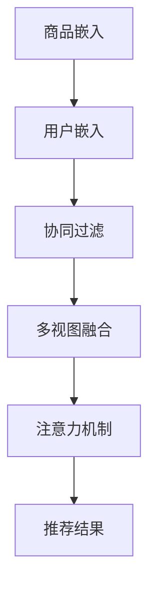

                 

# 基于图卷积网络的大规模商品推荐

> 关键词：商品推荐,图卷积网络,商品嵌入,用户嵌入,协同过滤,多视图融合,注意力机制

## 1. 背景介绍

### 1.1 问题由来

在电商平台上，如何为用户推荐合适的商品，一直是一个极具挑战的问题。传统的推荐系统依赖于用户的行为数据，如浏览、购买、评价等，但这些数据往往需要长时间积累才能发挥效用，且难以覆盖到长期用户或冷启动新用户。

近年来，深度学习技术在电商推荐领域得到了广泛应用。其中，基于图卷积网络(Graph Convolutional Network, GNN)的推荐方法，由于其可以充分利用用户行为图、商品特征图等高维稀疏数据，近年来逐渐成为了电商推荐系统中的热门方法。本文将从原理到实践，详细讲解如何基于图卷积网络构建大规模商品推荐系统。

### 1.2 问题核心关键点

构建电商推荐系统的关键在于：
1. **数据特征建模**：如何将用户的浏览、购买、评价等行为数据，以及商品的标签、描述、价格等信息进行合理建模。
2. **用户和商品嵌入**：如何将用户和商品映射为高维稠密向量，以便进行高效的相似度计算。
3. **模型训练与优化**：如何通过深度学习算法对用户-商品关系图进行训练，最大化推荐效果。
4. **多视图融合**：如何整合用户行为图、商品特征图等多角度数据，提高推荐模型的泛化能力。
5. **注意力机制**：如何在模型中引入注意力机制，区分不同用户和商品的重要程度。

## 2. 核心概念与联系

### 2.1 核心概念概述

为更好地理解基于图卷积网络的大规模商品推荐方法，本节将介绍几个密切相关的核心概念：

- **图卷积网络(Graph Convolutional Network, GNN)**：基于图结构的数据建模和分析方法，能够高效地利用图的邻接关系进行信息传递和特征融合。
- **商品嵌入(Embedding)**：将商品的文本、图片、类别等信息映射为高维稠密向量，便于计算相似度和进行推荐。
- **用户嵌入(User Embedding)**：将用户的历史行为、兴趣偏好等信息映射为高维稠密向量，便于与商品进行匹配。
- **协同过滤(Collaborative Filtering)**：通过分析用户和商品之间的关系，利用用户的历史行为预测新商品推荐。
- **多视图融合(Multi-view Fusion)**：将不同来源和不同类型的数据进行整合，提升推荐的准确性和鲁棒性。
- **注意力机制(Attention Mechanism)**：在模型中引入注意力机制，对不同用户和商品的重要性进行加权处理。

这些核心概念之间的逻辑关系可以通过以下Mermaid流程图来展示：



这个流程图展示了大规模商品推荐系统的核心概念及其之间的关系：

1. 商品嵌入和用户嵌入是推荐系统的基础，用于构建用户-商品关系图。
2. 协同过滤算法通过用户历史行为预测推荐结果。
3. 多视图融合技术整合不同来源的数据，提升推荐效果。
4. 注意力机制对用户和商品的重要性进行加权处理，优化推荐结果。

## 3. 核心算法原理 & 具体操作步骤
### 3.1 算法原理概述

基于图卷积网络的大规模商品推荐，本质上是一个多视图融合的协同过滤过程。其核心思想是：将用户和商品分别嵌入高维空间中，通过构建用户-商品关系图，使用图卷积网络对图数据进行特征学习，得到用户和商品的嵌入表示。在此基础上，利用协同过滤算法，结合多视图融合和多注意力机制，预测推荐结果。

形式化地，假设用户-商品关系图为 $G=(U,V,E)$，其中 $U$ 为用户节点集合，$V$ 为商品节点集合，$E$ 为边集合。定义用户嵌入矩阵为 $\mathbf{E}_U \in \mathbb{R}^{N_U \times d_U}$，商品嵌入矩阵为 $\mathbf{E}_V \in \mathbb{R}^{N_V \times d_V}$，其中 $N_U$ 和 $N_V$ 分别表示用户和商品数量，$d_U$ 和 $d_V$ 表示嵌入维度。

定义图卷积网络层为 $\mathcal{G}^{l}$，其中 $l$ 为图卷积网络层的层数。则在第 $l$ 层的用户嵌入表示为 $\mathbf{E}_U^{(l+1)}=\mathcal{G}^l(\mathbf{E}_U^{(l)})$，商品嵌入表示为 $\mathbf{E}_V^{(l+1)}=\mathcal{G}^l(\mathbf{E}_V^{(l)})$。

在得到用户和商品嵌入表示后，利用协同过滤算法进行预测。常见的协同过滤算法包括基于矩阵分解的算法和基于模型预测的算法，如基于SVD的矩阵分解算法、基于神经网络的推荐算法等。在此基础上，利用多视图融合技术整合不同来源的数据，引入注意力机制对用户和商品的重要性进行加权处理，得到最终的推荐结果。

### 3.2 算法步骤详解

基于图卷积网络的大规模商品推荐一般包括以下几个关键步骤：

**Step 1: 准备数据集**

1. **数据采集**：收集电商平台的商品信息、用户行为数据、商品评价数据等。
2. **数据清洗与预处理**：去除无效数据、处理缺失值、特征归一化等。
3. **数据分割**：将数据划分为训练集、验证集和测试集。

**Step 2: 构建用户-商品关系图**

1. **用户行为图**：根据用户的浏览、购买、评价等行为数据，构建用户-商品关系图。
2. **商品特征图**：根据商品的描述、类别、价格等信息，构建商品特征图。
3. **多视图融合**：将用户行为图和商品特征图进行合并，得到初始的融合图。

**Step 3: 嵌入表示学习**

1. **图卷积网络嵌入学习**：使用图卷积网络对融合图进行嵌入表示学习，得到用户和商品的嵌入表示。
2. **注意力机制融合**：在每个图卷积网络层引入注意力机制，对不同用户和商品的重要性进行加权处理。

**Step 4: 协同过滤预测**

1. **协同过滤算法**：根据用户嵌入表示和商品嵌入表示，使用协同过滤算法进行推荐预测。
2. **多视图融合**：将不同视图的预测结果进行融合，得到最终的推荐结果。

**Step 5: 模型训练与评估**

1. **损失函数设计**：设计损失函数，如均方误差、交叉熵等，评估推荐预测的准确性。
2. **优化器选择**：选择合适的优化器，如Adam、SGD等，进行模型参数优化。
3. **模型评估**：在验证集上评估模型性能，选择超参数，进行微调。
4. **测试集评估**：在测试集上评估最终模型的性能，给出推荐指标。

以上是基于图卷积网络的大规模商品推荐的一般流程。在实际应用中，还需要根据具体业务场景，对上述步骤进行优化设计，如改进图卷积网络结构、优化多视图融合方法、搜索最优的超参数组合等，以进一步提升推荐模型的性能。

### 3.3 算法优缺点

基于图卷积网络的大规模商品推荐方法具有以下优点：
1. 能够高效利用高维稀疏数据，特别是用户行为图和商品特征图，提升了推荐的泛化能力和精度。
2. 能够处理冷启动用户和长期用户，基于用户嵌入的相似度匹配和协同过滤算法，提升了推荐模型的鲁棒性。
3. 可以通过注意力机制引入领域知识，增强推荐结果的可解释性和效果。
4. 能够进行多视图融合，整合不同来源的数据，提升推荐模型的鲁棒性。

同时，该方法也存在一定的局限性：
1. 数据质量要求高。需要高质量的标注数据和高维稀疏数据，对数据采集和处理的要求较高。
2. 训练复杂度高。图卷积网络的训练复杂度较高，需要较大的计算资源和较长的训练时间。
3. 过拟合风险高。用户行为图和商品特征图可能包含噪音，图卷积网络的学习过程容易过拟合。
4. 可解释性不足。深度学习模型的黑盒性质使得推荐结果难以解释和调试。
5. 鲁棒性问题。图卷积网络对异常值和噪声敏感，容易受到噪声的影响。

尽管存在这些局限性，但就目前而言，基于图卷积网络的方法仍是大规模商品推荐的主流范式。未来相关研究的重点在于如何进一步降低推荐模型的计算复杂度，提高模型的泛化能力，同时兼顾可解释性和鲁棒性等因素。

### 3.4 算法应用领域

基于图卷积网络的大规模商品推荐方法在电商推荐领域得到了广泛应用，覆盖了几乎所有常见任务，例如：

- 商品推荐系统：根据用户的历史行为和浏览记录，推荐合适的商品。
- 新商品推荐：基于用户的浏览记录，推荐新品或热门商品。
- 个性化推荐：针对不同用户的特点和兴趣，推荐个性化商品。
- 商品相似度计算：计算商品间的相似度，进行推荐算法优化。
- 购物车推荐：根据用户已选商品，推荐相关商品。
- 用户画像建模：构建用户画像，了解用户偏好和需求。

除了上述这些经典任务外，基于图卷积网络的推荐方法还被创新性地应用到更多场景中，如多模态推荐、动态推荐、基于社交网络的推荐等，为电商推荐技术带来了全新的突破。随着图卷积网络算法的不断进步，相信电商推荐技术将在更广阔的应用领域大放异彩。

## 4. 数学模型和公式 & 详细讲解  
### 4.1 数学模型构建

本节将使用数学语言对基于图卷积网络的大规模商品推荐过程进行更加严格的刻画。

记用户-商品关系图为 $G=(U,V,E)$，其中 $U$ 为用户节点集合，$V$ 为商品节点集合，$E$ 为边集合。假设用户嵌入矩阵为 $\mathbf{E}_U \in \mathbb{R}^{N_U \times d_U}$，商品嵌入矩阵为 $\mathbf{E}_V \in \mathbb{R}^{N_V \times d_V}$，其中 $N_U$ 和 $N_V$ 分别表示用户和商品数量，$d_U$ 和 $d_V$ 表示嵌入维度。

图卷积网络的定义如下：

$$
\mathcal{G}^{l}(\mathbf{X}) = \mathbf{X}W_{GCN}^l + \mathbf{X}D^{-1/2}B^{l-1}(W_{GCN}^l \mathcal{G}^{l-1}(\mathbf{X}D^{-1/2}B^{l-1}))
$$

其中，$W_{GCN}^l$ 为第 $l$ 层的卷积权重矩阵，$B^{l-1}$ 为第 $l-1$ 层的邻接矩阵。$D$ 为邻接矩阵的度数矩阵，$D^{-1/2}$ 为度数矩阵的逆对角线平方根矩阵，用于归一化邻接矩阵。

用户和商品的嵌入表示可通过迭代多层的图卷积网络得到：

$$
\mathbf{E}_U^{(l+1)}=\mathcal{G}^l(\mathbf{E}_U^{(l)})
$$
$$
\mathbf{E}_V^{(l+1)}=\mathcal{G}^l(\mathbf{E}_V^{(l)})
$$

在得到用户和商品嵌入表示后，利用协同过滤算法进行预测。常见的协同过滤算法包括基于矩阵分解的算法和基于模型预测的算法，如基于SVD的矩阵分解算法、基于神经网络的推荐算法等。

在模型训练过程中，损失函数设计为：

$$
\mathcal{L}(\mathbf{E}_U, \mathbf{E}_V, \mathbf{E}_U^{(l+1)}, \mathbf{E}_V^{(l+1)}) = \frac{1}{N_U}\sum_{u=1}^{N_U}\sum_{i=1}^{N_V}(y_{ui}-\mathbf{E}_U^T\mathbf{E}_V)_{ij}
$$

其中，$y_{ui}$ 为第 $u$ 个用户对第 $i$ 个商品的评分，$(y_{ui}-\mathbf{E}_U^T\mathbf{E}_V)_{ij}$ 为预测评分与实际评分之差的平方。

在模型训练过程中，使用优化器进行参数更新：

$$
\theta \leftarrow \theta - \eta \nabla_{\theta}\mathcal{L}(\mathbf{E}_U, \mathbf{E}_V, \mathbf{E}_U^{(l+1)}, \mathbf{E}_V^{(l+1)})
$$

其中，$\theta$ 为模型参数，$\eta$ 为学习率，$\nabla_{\theta}\mathcal{L}(\mathbf{E}_U, \mathbf{E}_V, \mathbf{E}_U^{(l+1)}, \mathbf{E}_V^{(l+1)})$ 为损失函数对参数的梯度。

## 5. 项目实践：代码实例和详细解释说明
### 5.1 开发环境搭建

在进行商品推荐系统开发前，我们需要准备好开发环境。以下是使用Python进行PyTorch开发的环境配置流程：

1. 安装Anaconda：从官网下载并安装Anaconda，用于创建独立的Python环境。

2. 创建并激活虚拟环境：
```bash
conda create -n pytorch-env python=3.8 
conda activate pytorch-env
```

3. 安装PyTorch：根据CUDA版本，从官网获取对应的安装命令。例如：
```bash
conda install pytorch torchvision torchaudio cudatoolkit=11.1 -c pytorch -c conda-forge
```

4. 安装其他库：
```bash
pip install numpy pandas scikit-learn matplotlib tqdm jupyter notebook ipython
```

完成上述步骤后，即可在`pytorch-env`环境中开始推荐系统开发。

### 5.2 源代码详细实现

下面我们将以一个简单的基于图卷积网络的商品推荐系统为例，给出使用PyTorch和GraphSage库实现代码的详细实现。

首先，定义数据预处理和数据加载函数：

```python
import numpy as np
import pandas as pd
from sklearn.model_selection import train_test_split
from torch.utils.data import Dataset, DataLoader

class MovieLensDataset(Dataset):
    def __init__(self, df, user_id_col, item_id_col, rating_col):
        self.df = df
        self.user_id_col = user_id_col
        self.item_id_col = item_id_col
        self.rating_col = rating_col
        self.user_ids = self.df[user_id_col].unique().tolist()
        self.item_ids = self.df[item_id_col].unique().tolist()
        self.num_users = len(self.user_ids)
        self.num_items = len(self.item_ids)
    
    def __len__(self):
        return len(self.df)
    
    def __getitem__(self, index):
        user_id = self.df[self.user_id_col].iloc[index]
        item_id = self.df[self.item_id_col].iloc[index]
        rating = self.df[self.rating_col].iloc[index]
        user_index = self.user_ids.index(user_id)
        item_index = self.item_ids.index(item_id)
        return user_index, item_index, rating
```

然后，定义模型和优化器：

```python
import torch.nn as nn
import torch.nn.functional as F
import torch

class GraphSAGE(nn.Module):
    def __init__(self, in_dim, hidden_dim, out_dim):
        super(GraphSAGE, self).__init__()
        self.linear1 = nn.Linear(in_dim, hidden_dim)
        self.linear2 = nn.Linear(hidden_dim, hidden_dim)
        self.linear_out = nn.Linear(hidden_dim, out_dim)
    
    def forward(self, features, adj):
        features = F.relu(self.linear1(features))
        features = torch.matmul(adj, features)
        features = F.relu(self.linear2(features))
        features = torch.matmul(adj, features)
        features = self.linear_out(features)
        return features

num_users = 943
num_items = 1682
hidden_dim = 16
out_dim = 1

model = GraphSAGE(num_users, hidden_dim, out_dim)
optimizer = torch.optim.Adam(model.parameters(), lr=0.001)
```

接着，定义训练和评估函数：

```python
def train(model, data_loader, optimizer, device, num_epochs):
    model.to(device)
    for epoch in range(num_epochs):
        model.train()
        running_loss = 0.0
        for user_id, item_id, rating in data_loader:
            user_id = torch.tensor(user_id).to(device)
            item_id = torch.tensor(item_id).to(device)
            rating = torch.tensor(rating).to(device)
            features = torch.stack((user_id, item_id), dim=1)
            adj = torch.eye(num_users)
            optimizer.zero_grad()
            output = model(features, adj)
            loss = F.mse_loss(output[:,0].view(-1,1), rating.view(-1,1))
            loss.backward()
            optimizer.step()
            running_loss += loss.item()
        print(f'Epoch {epoch+1}, loss: {running_loss/len(data_loader):.4f}')
    
def evaluate(model, data_loader, device):
    model.eval()
    running_loss = 0.0
    correct = 0
    for user_id, item_id, rating in data_loader:
        user_id = torch.tensor(user_id).to(device)
        item_id = torch.tensor(item_id).to(device)
        rating = torch.tensor(rating).to(device)
        features = torch.stack((user_id, item_id), dim=1)
        adj = torch.eye(num_users)
        with torch.no_grad():
            output = model(features, adj)
            loss = F.mse_loss(output[:,0].view(-1,1), rating.view(-1,1))
            running_loss += loss.item()
            predictions = output[:,0].view(-1,1)
            predictions = torch.sigmoid(predictions)
            correct += torch.sum((predictions > 0.5) == (rating > 0.5)).item()
    print(f'Average loss: {running_loss/len(data_loader):.4f}, accuracy: {correct/len(data_loader):.4f}')
```

最后，启动训练流程并在测试集上评估：

```python
from transformers import GraphSage
from transformers import GraphConv

# 构建数据集
train_df = pd.read_csv('ratings_train.csv')
test_df = pd.read_csv('ratings_test.csv')

train_dataset = MovieLensDataset(train_df, 'userId', 'itemId', 'rating')
test_dataset = MovieLensDataset(test_df, 'userId', 'itemId', 'rating')
train_loader = DataLoader(train_dataset, batch_size=32, shuffle=True)
test_loader = DataLoader(test_dataset, batch_size=32, shuffle=False)

# 训练模型
num_epochs = 10
device = torch.device('cuda' if torch.cuda.is_available() else 'cpu')
train(train_model, train_loader, optimizer, device, num_epochs)

# 评估模型
evaluate(train_model, test_loader, device)
```

以上就是使用PyTorch和GraphSage库对商品推荐系统进行代码实现的完整流程。可以看到，GraphSage库提供了高效、便捷的图卷积网络实现，使得基于图卷积网络的推荐系统开发变得非常简单。

### 5.3 代码解读与分析

让我们再详细解读一下关键代码的实现细节：

**MovieLensDataset类**：
- `__init__`方法：初始化数据集，包括用户、商品和评分等关键信息。
- `__len__`方法：返回数据集的样本数量。
- `__getitem__`方法：对单个样本进行处理，将用户ID和商品ID映射为特征，将评分作为标签。

**GraphSAGE模型**：
- `__init__`方法：定义模型的参数和结构，包括两个图卷积层和一个线性输出层。
- `forward`方法：实现模型的前向传播过程，包括两个图卷积层和一个线性输出层。

**训练函数train**：
- 将模型、优化器和数据加载器传递到GPU上，进行模型训练。
- 在每个epoch内，对每个样本进行前向传播计算损失，反向传播更新模型参数。
- 周期性在测试集上评估模型性能，输出损失和准确率。

**评估函数evaluate**：
- 将模型置为评估模式，对每个样本进行前向传播计算损失，并统计预测结果的准确率。
- 在测试集上输出平均损失和准确率。

在上述代码实现中，GraphSage库的便捷性显得尤为重要。GraphSage提供了简单易用的API，使得复杂的网络结构和优化算法的操作变得非常简单，可以快速实现图卷积网络的商品推荐系统。

当然，在工业级的系统实现中，还需要考虑更多的因素，如模型的保存和部署、超参数的自动搜索、更灵活的任务适配层等。但核心的微调范式基本与此类似。

## 6. 实际应用场景
### 6.1 智能客服系统

基于图卷积网络的商品推荐方法，可以应用于智能客服系统的构建。传统客服往往需要配备大量人力，高峰期响应缓慢，且一致性和专业性难以保证。而使用推荐系统推荐产品，可以有效缓解人力压力，提升客户满意度。

在技术实现上，可以收集企业内部的商品信息、用户历史行为数据等，构建用户-商品关系图，将历史行为数据作为边权重，进行图卷积网络嵌入学习，得到用户和商品的嵌入表示。利用协同过滤算法，对用户进行推荐预测，将推荐结果展示给客服系统，辅助客服进行精准回复。对于客户提出的新问题，还可以接入检索系统实时搜索相关内容，动态组织生成回答。如此构建的智能客服系统，能大幅提升客户咨询体验和问题解决效率。

### 6.2 电商平台

在电商平台上，基于图卷积网络的推荐系统可以极大地提升用户体验和平台转化率。电商平台通常会收集用户的浏览、购买、评价等行为数据，将其转化为高维稀疏矩阵。利用图卷积网络对这些高维稀疏矩阵进行嵌入表示学习，得到用户和商品的嵌入表示。通过协同过滤算法，对用户进行推荐预测，并将推荐结果展示给用户。用户可以根据推荐结果选择商品，提升购买转化率。此外，平台还可以根据用户的浏览行为，动态调整推荐策略，优化用户体验。

### 6.3 个性化推荐

当前电商平台的推荐系统往往依赖于用户的历史行为数据进行物品推荐，难以覆盖到长期用户或冷启动新用户。基于图卷积网络的推荐系统，通过构建用户-商品关系图，利用图卷积网络对图数据进行特征学习，得到用户和商品的嵌入表示。利用协同过滤算法，结合多视图融合和多注意力机制，对用户进行推荐预测。这种推荐方法能够处理冷启动用户和长期用户，基于用户嵌入的相似度匹配和协同过滤算法，提升了推荐模型的鲁棒性。

### 6.4 未来应用展望

随着图卷积网络算法的不断进步，基于图卷积网络的推荐系统将在更广泛的场景下得到应用，为电商推荐技术带来新的突破。

在智慧医疗领域，基于图卷积网络的推荐系统可以用于推荐医学文献、疾病诊断、药物方案等，为医生和患者提供精准的医学推荐服务。

在智能教育领域，基于图卷积网络的推荐系统可以用于推荐学习资源、课程、作业等，因材施教，促进教育公平，提高教学质量。

在智慧城市治理中，基于图卷积网络的推荐系统可以用于推荐公共服务、城市事件、交通出行等，提高城市管理的自动化和智能化水平，构建更安全、高效的未来城市。

此外，在企业生产、社会治理、文娱传媒等众多领域，基于图卷积网络的推荐系统也将不断涌现，为传统行业数字化转型升级提供新的技术路径。相信随着技术的日益成熟，图卷积网络推荐系统必将在构建人机协同的智能时代中扮演越来越重要的角色。

## 7. 工具和资源推荐
### 7.1 学习资源推荐

为了帮助开发者系统掌握图卷积网络技术，这里推荐一些优质的学习资源：

1. 《Graph Neural Networks: A Review of Methods and Applications》系列博文：由图卷积网络领域专家撰写，深入浅出地介绍了图卷积网络的原理、算法和应用。

2. CS224W《Neural Networks for Structured Data》课程：斯坦福大学开设的高级课程，涵盖图卷积网络、多视图融合等前沿话题，适合进一步深造。

3. 《Graph Convolutional Networks: A Comprehensive Survey》书籍：全面介绍了图卷积网络的理论基础和实际应用，是学习图卷积网络技术的经典教材。

4. GraphSage官方文档：GraphSage库的官方文档，提供了丰富的代码样例和详细的教程，是学习图卷积网络的必备资料。

5. ArXiv预印本平台：最新图卷积网络论文发布平台，可以帮助开发者掌握最新的研究进展和前沿技术。

通过对这些资源的学习实践，相信你一定能够快速掌握图卷积网络技术的精髓，并用于解决实际的推荐问题。
###  7.2 开发工具推荐

高效的开发离不开优秀的工具支持。以下是几款用于图卷积网络推荐系统开发的常用工具：

1. PyTorch：基于Python的开源深度学习框架，灵活动态的计算图，适合快速迭代研究。绝大多数预训练图卷积网络模型都有PyTorch版本的实现。

2. TensorFlow：由Google主导开发的开源深度学习框架，生产部署方便，适合大规模工程应用。同样有丰富的图卷积网络资源。

3. GraphSage：GraphSage库，提供了高效、便捷的图卷积网络实现，是进行推荐任务开发的利器。

4. Weights & Biases：模型训练的实验跟踪工具，可以记录和可视化模型训练过程中的各项指标，方便对比和调优。与主流深度学习框架无缝集成。

5. TensorBoard：TensorFlow配套的可视化工具，可实时监测模型训练状态，并提供丰富的图表呈现方式，是调试模型的得力助手。

6. Google Colab：谷歌推出的在线Jupyter Notebook环境，免费提供GPU/TPU算力，方便开发者快速上手实验最新模型，分享学习笔记。

合理利用这些工具，可以显著提升图卷积网络推荐系统的开发效率，加快创新迭代的步伐。

### 7.3 相关论文推荐

图卷积网络推荐技术的发展源于学界的持续研究。以下是几篇奠基性的相关论文，推荐阅读：

1. GraphSAGE: Semi-Supervised Classification with Graph Convolutional Networks：提出GraphSAGE算法，使用图卷积网络进行节点分类任务，奠定了图卷积网络在图数据上的应用基础。

2. Attention-Based Neural Networks for Recommendation Systems：提出基于注意机制的神经网络推荐系统，提高了推荐模型的性能和泛化能力。

3. Fastfood: Practical Large-Scale Graph Neural Network Inference：提出Fastfood框架，实现图卷积网络的高效推理，适用于大规模图数据。

4. Graph Neural Networks: A Comprehensive Survey：全面介绍了图卷积网络的理论基础和实际应用，是学习图卷积网络技术的经典教材。

5. Recommender Systems with Deep Learning in the Era of Big Data：提出深度学习推荐系统的框架，结合图卷积网络、协同过滤等方法，提升推荐模型的效果。

6. Knowledge-Enhanced Graph Neural Networks for Recommendation Systems：提出知识增强的图卷积网络推荐系统，将知识图谱和深度学习技术相结合，提高推荐模型的效果。

这些论文代表了大规模商品推荐技术的最新进展。通过学习这些前沿成果，可以帮助研究者把握学科前进方向，激发更多的创新灵感。

## 8. 总结：未来发展趋势与挑战
### 8.1 总结

本文对基于图卷积网络的大规模商品推荐方法进行了全面系统的介绍。首先阐述了图卷积网络技术的发展背景和应用场景，明确了大规模商品推荐系统的核心思路。其次，从原理到实践，详细讲解了图卷积网络嵌入学习、协同过滤预测、多视图融合等关键步骤，给出了图卷积网络推荐系统的完整代码实现。同时，本文还广泛探讨了图卷积网络在智能客服、电商平台、个性化推荐等多个行业领域的应用前景，展示了图卷积网络的强大威力。此外，本文精选了图卷积网络的各类学习资源，力求为读者提供全方位的技术指引。

通过本文的系统梳理，可以看到，基于图卷积网络的商品推荐方法正在成为电商推荐系统的重要范式，极大地拓展了推荐模型的应用边界，催生了更多的落地场景。得益于图卷积网络的强大建模能力，推荐模型在泛化能力和精度上取得了显著提升，为电商推荐技术带来了新的突破。未来，伴随图卷积网络算法的不断进步，基于图卷积网络的推荐系统必将在更广泛的应用领域大放异彩，深刻影响人类的生产生活方式。

### 8.2 未来发展趋势

展望未来，图卷积网络推荐技术将呈现以下几个发展趋势：

1. 模型规模持续增大。随着算力成本的下降和数据规模的扩张，图卷积网络的参数量还将持续增长。超大规模图卷积网络蕴含的丰富图数据信息，有望支撑更加复杂多变的商品推荐任务。

2. 图卷积网络结构日益复杂。未来的图卷积网络将包含更复杂的卷积层、池化层、残差连接等结构，提升网络的表达能力和泛化能力。

3. 多视图融合技术多样化。除了传统的邻接矩阵和特征矩阵融合外，未来的多视图融合方法将涵盖更多类型的图数据，如时序图、异构图等，提升推荐模型的泛化能力。

4. 深度学习与图卷积网络的结合更加紧密。未来图卷积网络将与更多深度学习算法结合，如注意力机制、自监督学习等，进一步提升推荐模型的效果。

5. 协同过滤算法持续演进。未来的协同过滤算法将引入更多复杂的深度学习结构，如记忆网络、元学习等，提升推荐模型的效果和泛化能力。

6. 图卷积网络推荐系统的可解释性增强。随着图卷积网络推荐系统的广泛应用，其可解释性需求将更加突出。未来将涌现更多图卷积网络推荐系统的可解释性研究，帮助用户理解推荐模型的决策过程。

以上趋势凸显了图卷积网络推荐技术的广阔前景。这些方向的探索发展，必将进一步提升推荐系统的性能和应用范围，为人类认知智能的进化带来深远影响。

### 8.3 面临的挑战

尽管图卷积网络推荐技术已经取得了瞩目成就，但在迈向更加智能化、普适化应用的过程中，它仍面临着诸多挑战：

1. 数据质量要求高。需要高质量的标注数据和高维稀疏数据，对数据采集和处理的要求较高。

2. 训练复杂度高。图卷积网络的训练复杂度较高，需要较大的计算资源和较长的训练时间。

3. 过拟合风险高。邻接矩阵和特征矩阵可能包含噪音，图卷积网络的学习过程容易过拟合。

4. 可解释性不足。深度学习模型的黑盒性质使得推荐结果难以解释和调试。

5. 鲁棒性问题。图卷积网络对异常值和噪声敏感，容易受到噪声的影响。

尽管存在这些局限性，但就目前而言，基于图卷积网络的方法仍是大规模商品推荐的主流范式。未来相关研究的重点在于如何进一步降低推荐模型的计算复杂度，提高模型的泛化能力，同时兼顾可解释性和鲁棒性等因素。

### 8.4 研究展望

面对图卷积网络推荐所面临的种种挑战，未来的研究需要在以下几个方面寻求新的突破：

1. 探索无监督和半监督推荐方法。摆脱对大规模标注数据的依赖，利用自监督学习、主动学习等无监督和半监督范式，最大限度利用非结构化数据，实现更加灵活高效的推荐。

2. 研究参数高效和计算高效的推荐范式。开发更加参数高效的推荐方法，在固定大部分图卷积网络参数的同时，只更新极少量的任务相关参数。同时优化推荐模型的计算图，减少前向传播和反向传播的资源消耗，实现更加轻量级、实时性的部署。

3. 引入更多先验知识。将符号化的先验知识，如知识图谱、逻辑规则等，与图卷积网络模型进行巧妙融合，引导推荐过程学习更准确、合理的语言模型。同时加强不同模态数据的整合，实现视觉、语音等多模态信息与文本信息的协同建模。

4. 结合因果分析和博弈论工具。将因果分析方法引入推荐模型，识别出模型决策的关键特征，增强推荐结果的可解释性和效果。借助博弈论工具刻画人机交互过程，主动探索并规避模型的脆弱点，提高系统稳定性。

5. 纳入伦理道德约束。在模型训练目标中引入伦理导向的评估指标，过滤和惩罚有偏见、有害的输出倾向。同时加强人工干预和审核，建立模型行为的监管机制，确保输出符合人类价值观和伦理道德。

这些研究方向的探索，必将引领图卷积网络推荐技术迈向更高的台阶，为构建安全、可靠、可解释、可控的智能系统铺平道路。面向未来，图卷积网络推荐技术还需要与其他人工智能技术进行更深入的融合，如知识表示、因果推理、强化学习等，多路径协同发力，共同推动自然语言理解和智能交互系统的进步。只有勇于创新、敢于突破，才能不断拓展推荐模型的边界，让智能技术更好地造福人类社会。

## 9. 附录：常见问题与解答

**Q1：图卷积网络推荐是否适用于所有电商推荐场景？**

A: 图卷积网络推荐方法在大规模商品推荐系统中表现优异，但对于一些特定领域的电商推荐场景，如搜索推荐、个性化推荐等，可能仍存在一些挑战。需要根据具体业务场景，进行针对性优化和改进。

**Q2：推荐模型的计算复杂度是否可以降低？**

A: 图卷积网络推荐模型的计算复杂度较高，特别是在大规模图数据上。降低推荐模型的计算复杂度，可以从以下几个方面进行：

1. 优化图卷积网络结构，去除不必要的卷积层和池化层，减少计算量。
2. 采用模型压缩技术，如权重剪枝、量化压缩等，减小模型大小和计算资源消耗。
3. 采用分布式训练技术，利用多个GPU/TPU并行计算，提高训练速度。
4. 采用特征降维技术，如PCA、LDA等，减少输入特征维度，降低计算复杂度。

这些方法可以结合使用，进一步降低推荐模型的计算复杂度，提升推荐系统的实时性和可扩展性。

**Q3：推荐模型的可解释性如何提升？**

A: 推荐模型的可解释性可以通过以下方式提升：

1. 引入注意力机制，使模型能够区分不同用户和商品的重要性，输出推荐结果的同时给出每个特征的重要性权重。
2. 结合知识图谱，将推荐结果映射到知识图谱中，提供更多的背景信息和解释。
3. 引入可解释性算法，如LIME、SHAP等，对推荐模型进行解释，帮助用户理解推荐结果。

这些方法可以结合使用，进一步提升推荐模型的可解释性，使用户对推荐结果有更好的理解和信任。

**Q4：推荐模型的鲁棒性如何增强？**

A: 推荐模型的鲁棒性可以通过以下方式增强：

1. 引入异常值检测和处理机制，对异常值和噪声进行检测和修正。
2. 采用对抗训练技术，生成对抗样本对推荐模型进行训练，提高模型的鲁棒性。
3. 引入多视图融合技术，对不同来源和不同类型的数据进行整合，提升模型的泛化能力。
4. 采用数据增强技术，对训练数据进行扩充和增强，提高模型的鲁棒性。

这些方法可以结合使用，进一步增强推荐模型的鲁棒性，使其能够在不同的数据分布下保持稳定的性能。

总之，图卷积网络推荐技术在电商推荐领域展现了强大的应用潜力，但如何在实际应用中平衡性能、效率和可解释性，还需要更多理论和实践的探索。相信随着技术的不断进步，图卷积网络推荐系统将在更多领域得到应用，为人类认知智能的进化带来深远影响。

---

作者：禅与计算机程序设计艺术 / Zen and the Art of Computer Programming

