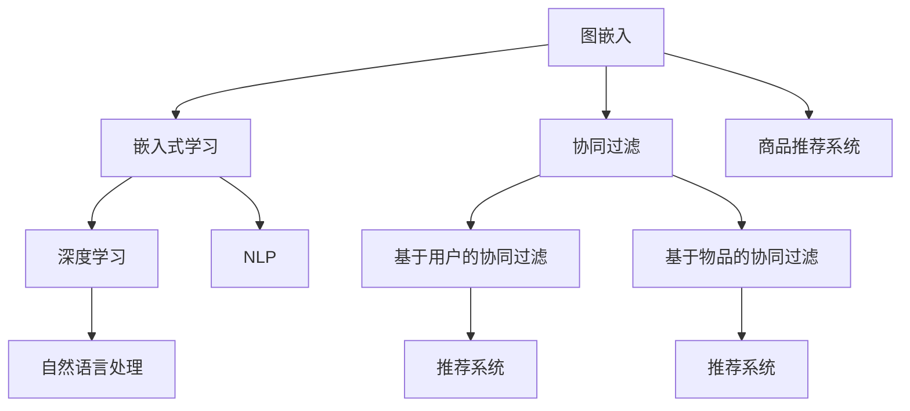

                 

# 基于图嵌入的大规模商品推荐系统

> 关键词：商品推荐系统, 图嵌入, 嵌入式学习, 深度学习, 自然语言处理(NLP), 协同过滤, 召回率和精确率

## 1. 背景介绍

### 1.1 问题由来
在当今数字化的商业时代，电商平台和在线零售商面临着如何在海量商品中向用户推荐最具吸引力和个性化推荐的商品这一重大挑战。传统的推荐系统往往依赖于基于用户行为的协同过滤算法，但这些算法对新用户的冷启动问题表现不佳，且容易受数据稀疏性和用户行为多样性的限制。

为了解决这个问题，研究者们开始探索更多复杂、高效、具有鲁棒性的推荐系统方法，如基于深度学习(Deep Learning, DL)的推荐系统。其中，基于图嵌入(Graph Embedding)的推荐系统，利用图结构来描述商品和用户之间的关系，并通过深度学习模型学习商品和用户特征，成为了一种新的热门研究方向。

### 1.2 问题核心关键点
本文聚焦于基于图嵌入的推荐系统，通过深度学习模型学习商品和用户之间的图结构，进而进行商品推荐。关键点在于：
1. 图嵌入的本质是什么？如何将商品和用户抽象成图结构？
2. 基于图嵌入的推荐模型是如何设计并训练的？
3. 图嵌入推荐系统如何实现高精度的商品推荐？

## 2. 核心概念与联系

### 2.1 核心概念概述

为更好地理解基于图嵌入的大规模商品推荐系统，本节将介绍几个关键概念及其相互关系：

- 图嵌入(Graph Embedding)：一种通过深度学习模型将图结构中的节点嵌入到低维向量空间的技术，用于挖掘图结构中隐含的关系和特征。在商品推荐系统中，商品和用户可以被视作图的节点，将它们嵌入到低维空间中，便于进行特征表示和关系挖掘。
- 嵌入式学习(Embedded Learning)：一种结合了传统机器学习和深度学习的技术，用于在处理复杂结构化数据时获得更好的表示效果。嵌入式学习通常涉及特征嵌入(如词嵌入)和图嵌入等技术。
- 协同过滤(Collaborative Filtering)：一种基于用户行为和物品交互的数据驱动的推荐算法，常见的有基于用户的协同过滤和基于物品的协同过滤。协同过滤的挑战在于如何处理新用户、新物品带来的冷启动问题，以及如何应对数据稀疏性。
- 深度学习(Deep Learning, DL)：一种基于多层神经网络的机器学习方法，能够自动提取数据中的高层次特征，具有较强的非线性建模能力。在推荐系统中，深度学习可以用于建模用户特征、商品特征以及它们之间的关系。
- 自然语言处理(Natural Language Processing, NLP)：一种使用计算机处理和理解人类语言的技术，常用于商品描述和用户评论的文本分析。NLP技术能够帮助理解商品语义和用户评价，提升推荐系统的个性化程度。
- 召回率(Recall Rate)：在推荐系统中，召回率表示从所有商品中筛选出的推荐商品占总商品数量的比例。召回率越高，推荐系统能够覆盖的商品范围越广。
- 精确率(Precision Rate)：精确率表示推荐商品中用户真正感兴趣的商品占推荐商品总数的比例。精确率越高，推荐系统的个性化程度越高，但覆盖的商品范围可能较小。

这些概念之间的关系可以通过以下Mermaid流程图来展示：



这个流程图展示了图嵌入、嵌入式学习、协同过滤、深度学习、NLP等概念之间的逻辑关系：

1. 图嵌入利用深度学习模型将商品和用户抽象成低维空间中的节点，方便后续建模和分析。
2. 嵌入式学习结合了传统机器学习和深度学习，用于优化推荐系统的性能。
3. 协同过滤是一种基于用户行为和物品交互的推荐算法，常用于初始推荐。
4. 深度学习用于建模商品和用户的特征，以及它们之间的关系，提升推荐系统的精确度和召回率。
5. NLP技术常用于商品描述和用户评论的文本分析，增强推荐系统的个性化程度。
6. 基于图嵌入的推荐系统，将协同过滤算法与深度学习模型结合，构建了新的推荐框架。

## 3. 核心算法原理 & 具体操作步骤
### 3.1 算法原理概述

基于图嵌入的大规模商品推荐系统，主要包含以下几个步骤：

1. **数据预处理**：收集商品和用户的特征数据，并将其转换成图结构数据。
2. **图嵌入**：使用深度学习模型，将商品和用户节点嵌入到低维空间中。
3. **关系建模**：通过图卷积网络(Graph Convolutional Network, GCN)等模型，学习商品和用户之间的隐含关系。
4. **推荐模型训练**：结合协同过滤和深度学习模型，训练推荐模型进行商品推荐。
5. **模型评估**：使用召回率和精确率等指标，评估推荐系统的性能。

### 3.2 算法步骤详解

**Step 1: 数据预处理**

商品和用户的数据通常来自于电商平台的用户行为数据，如购买历史、评分记录、浏览行为等。

1. 数据收集：从电商平台的数据库中收集用户的历史行为数据，包括购买记录、评分记录、浏览记录等。
2. 数据清洗：处理缺失值、重复记录等问题，确保数据的质量。
3. 数据转换：将用户行为数据转换为图结构数据。以购买记录为例，每个用户和商品之间可以视作一条边的起点和终点，而边上的权重可以表示购买次数、评分值等。

**Step 2: 图嵌入**

使用深度学习模型，将商品和用户节点嵌入到低维空间中。

1. 选择嵌入模型：常用的嵌入模型包括Word2Vec、GloVe、FastText等，用于将商品描述和用户评论转换为低维向量。
2. 训练嵌入模型：将商品和用户数据输入嵌入模型，训练得到商品向量、用户向量。
3. 将向量拼接：将商品和用户的嵌入向量拼接，形成图结构的节点特征向量。

**Step 3: 关系建模**

使用图卷积网络(GCN)等模型，学习商品和用户之间的隐含关系。

1. 设计GCN模型：设计包含多个GCN层的神经网络，用于学习图结构中的节点之间的关系。
2. 训练GCN模型：将图嵌入向量输入GCN模型，训练得到商品和用户之间的关系表示。
3. 生成嵌入向量：将GCN模型输出的节点表示，作为节点嵌入向量。

**Step 4: 推荐模型训练**

结合协同过滤和深度学习模型，训练推荐模型进行商品推荐。

1. 设计推荐模型：将GCN模型输出的节点嵌入向量，作为协同过滤模型的输入。
2. 协同过滤模型：选择基于用户的协同过滤算法，如K-近邻算法、基于矩阵分解的推荐算法等，用于计算用户对商品的兴趣。
3. 深度学习模型：使用深度学习模型，如多层感知机、注意力机制等，进一步提升推荐系统的性能。
4. 联合训练：将协同过滤模型和深度学习模型联合训练，获得综合的推荐结果。

**Step 5: 模型评估**

使用召回率和精确率等指标，评估推荐系统的性能。

1. 划分数据集：将数据集划分为训练集、验证集和测试集，用于模型的训练、调参和评估。
2. 计算召回率和精确率：使用测试集数据，计算推荐系统的召回率和精确率，评估推荐系统的性能。
3. 调整模型参数：根据评估结果，调整模型参数，优化推荐系统的性能。

### 3.3 算法优缺点

基于图嵌入的大规模商品推荐系统具有以下优点：

1. **克服冷启动问题**：通过图嵌入模型，可以利用少量数据进行初始推荐，缓解新用户和新物品的冷启动问题。
2. **高效处理复杂关系**：图嵌入模型能够高效地处理商品和用户之间的复杂关系，提升推荐系统的性能。
3. **泛化能力强**：图嵌入模型能够学习到图结构中的隐含关系，提高推荐系统的泛化能力。
4. **可解释性强**：图嵌入模型通过可视化的方式展示商品和用户之间的关系，使得推荐系统的决策过程更具可解释性。

但该方法也存在以下局限性：

1. **数据需求高**：图嵌入模型需要大量的用户行为数据，而获取这些数据往往成本较高。
2. **计算资源消耗大**：图嵌入模型的训练和推理过程消耗大量计算资源，尤其是在大规模数据集上。
3. **过度拟合风险**：图嵌入模型在训练过程中容易过拟合，需要进行正则化和泛化性评估。
4. **结构依赖性强**：图嵌入模型依赖于图结构的正确性和完整性，如果图结构不正确或缺失，会影响推荐系统性能。

尽管存在这些局限性，但基于图嵌入的推荐系统在实际应用中已经取得了显著的效果，尤其是在电商、在线视频等场景中。未来，随着深度学习模型的进一步发展，图嵌入技术有望在更多领域中发挥更大的作用。

### 3.4 算法应用领域

基于图嵌入的推荐系统在多个领域得到了广泛应用：

1. **电商推荐系统**：电商平台如亚马逊、淘宝等，使用图嵌入模型进行个性化推荐，提升用户体验和交易转化率。
2. **视频推荐系统**：视频平台如Netflix、YouTube等，通过分析用户观看历史和视频关系，推荐用户可能感兴趣的视频内容。
3. **社交网络推荐**：社交平台如Facebook、Twitter等，根据用户兴趣和社交关系，推荐可能感兴趣的朋友和内容。
4. **新闻推荐系统**：新闻网站如BBC、CNN等，通过分析用户阅读历史和新闻内容关系，推荐相关新闻内容。
5. **音乐推荐系统**：音乐平台如Spotify、Apple Music等，通过分析用户听歌历史和音乐关系，推荐个性化音乐内容。

除了以上领域，基于图嵌入的推荐系统还被应用于智慧城市、智能交通、金融风控等多个场景中，帮助各类平台提升用户体验和运营效率。

## 4. 数学模型和公式 & 详细讲解
### 4.1 数学模型构建

基于图嵌入的推荐系统，可以通过数学模型来描述其工作原理。假设商品和用户数据构成一个图 $G=(V,E)$，其中 $V$ 为节点集合，$E$ 为边集合。每个节点 $v_i$ 代表一个商品或用户，$e_{ij}$ 表示节点 $v_i$ 和 $v_j$ 之间的边，$w_{ij}$ 为边的权重，表示它们之间的关系强度。

定义节点嵌入向量 $h_v \in \mathbb{R}^d$，表示节点 $v$ 的低维向量表示。图嵌入模型的目标是通过神经网络 $f$，将节点嵌入向量 $h_v$ 映射到低维空间中，使得节点之间的相似度最大化。

假设 $A \in \mathbb{R}^{N \times N}$ 为邻接矩阵，$D \in \mathbb{R}^{N \times N}$ 为度矩阵，表示节点之间的连接程度。定义图卷积网络（GCN）的卷积层 $H_{l+1} = \sigma(D^{-1/2}A D^{-1/2} H_l \Theta_l)$，其中 $\sigma$ 为激活函数，$\Theta_l$ 为可训练的卷积权重矩阵。

### 4.2 公式推导过程

以商品推荐系统为例，推导基于图嵌入的推荐模型的公式：

1. 定义图嵌入模型：
   $$
   h_v = f(D^{-1/2}A D^{-1/2} h_v \Theta_1), \quad v \in V
   $$

2. 定义GCN模型：
   $$
   H_{l+1} = \sigma(D^{-1/2}A D^{-1/2} H_l \Theta_l), \quad l=1,2,\ldots,L
   $$

3. 定义推荐模型：
   $$
   \hat{y}_v = softmax(h_v^\top W y), \quad v \in V
   $$

其中，$W$ 为可训练的输出权重矩阵，$y$ 为商品向量，$softmax$ 为softmax函数。

### 4.3 案例分析与讲解

以Amazon商品推荐系统为例，分析其图嵌入模型的实现。

1. 数据收集：从Amazon平台收集用户的历史购买记录、评分记录和浏览记录，作为商品和用户的特征数据。
2. 数据预处理：将用户和商品之间的交互数据转换为图结构数据，生成邻接矩阵和度矩阵。
3. 图嵌入：使用Word2Vec模型，将商品描述和用户评论转换为低维向量，拼接后作为节点的特征向量。
4. 关系建模：设计包含多个GCN层的神经网络，学习商品和用户之间的关系。
5. 推荐模型训练：结合协同过滤和深度学习模型，训练推荐模型进行商品推荐。
6. 模型评估：使用召回率和精确率等指标，评估推荐系统的性能。

## 5. 项目实践：代码实例和详细解释说明
### 5.1 开发环境搭建

在进行图嵌入推荐系统开发前，我们需要准备好开发环境。以下是使用Python进行PyTorch开发的环境配置流程：

1. 安装Anaconda：从官网下载并安装Anaconda，用于创建独立的Python环境。

2. 创建并激活虚拟环境：
```bash
conda create -n pytorch-env python=3.8 
conda activate pytorch-env
```

3. 安装PyTorch：根据CUDA版本，从官网获取对应的安装命令。例如：
```bash
conda install pytorch torchvision torchaudio cudatoolkit=11.1 -c pytorch -c conda-forge
```

4. 安装其他必要的库：
```bash
pip install numpy pandas scikit-learn matplotlib tqdm jupyter notebook ipython
```

完成上述步骤后，即可在`pytorch-env`环境中开始推荐系统开发。

### 5.2 源代码详细实现

下面以Amazon商品推荐系统为例，给出使用PyTorch进行图嵌入推荐系统的代码实现。

首先，定义图结构数据类：

```python
import torch
from torch_geometric.data import Data

class DataLoader:
    def __init__(self, data):
        self.data = data
        
    def __len__(self):
        return len(self.data)

    def __getitem__(self, idx):
        return self.data[idx]
```

接着，定义图嵌入和关系建模函数：

```python
import torch.nn as nn
import torch.nn.functional as F
import torch_geometric.nn as gnn
from torch_geometric.utils import softmax

class GCNLayer(nn.Module):
    def __init__(self, input_dim, output_dim):
        super(GCNLayer, self).__init__()
        self.lin1 = nn.Linear(input_dim, output_dim)
        self.lin2 = nn.Linear(output_dim, output_dim)
        self.nonlin = nn.ReLU()
        
    def forward(self, x, adj):
        x = self.lin1(x)
        x = self.nonlin(x)
        x = self.lin2(x)
        x = self.nonlin(x)
        return F.elu(x)

class GNN(nn.Module):
    def __init__(self, input_dim, hidden_dim, output_dim):
        super(GNN, self).__init__()
        self.conv1 = GCNLayer(input_dim, hidden_dim)
        self.conv2 = GCNLayer(hidden_dim, hidden_dim)
        self.conv3 = GCNLayer(hidden_dim, output_dim)
        
    def forward(self, x, adj):
        x = self.conv1(x, adj)
        x = self.conv2(x, adj)
        x = self.conv3(x, adj)
        return x

class EmbeddingLayer(nn.Module):
    def __init__(self, input_dim, hidden_dim):
        super(EmbeddingLayer, self).__init__()
        self.emb1 = nn.Embedding(input_dim, hidden_dim)
        self.emb2 = nn.Embedding(input_dim, hidden_dim)
        
    def forward(self, x):
        x1 = self.emb1(x)
        x2 = self.emb2(x)
        return x1 + x2
```

然后，定义推荐模型：

```python
class Recommender(nn.Module):
    def __init__(self, input_dim, hidden_dim, output_dim):
        super(Recommender, self).__init__()
        self.gnn = GNN(input_dim, hidden_dim, output_dim)
        self.fc = nn.Linear(hidden_dim, output_dim)
        
    def forward(self, x, adj):
        x = self.gnn(x, adj)
        x = F.relu(x)
        x = self.fc(x)
        return softmax(x, dim=1)
```

最后，定义训练和评估函数：

```python
import torch.optim as optim
from torch.utils.data import DataLoader
from sklearn.metrics import precision_score, recall_score

def train_epoch(model, data_loader, optimizer, device):
    model.train()
    epoch_loss = 0
    for data in data_loader:
        data = data.to(device)
        optimizer.zero_grad()
        output = model(data.x, data.edge_index)
        loss = F.cross_entropy(output, data.y)
        loss.backward()
        optimizer.step()
        epoch_loss += loss.item()
    return epoch_loss / len(data_loader)

def evaluate(model, data_loader, device):
    model.eval()
    precision, recall = 0, 0
    for data in data_loader:
        data = data.to(device)
        output = model(data.x, data.edge_index)
        label = data.y
        predictions = torch.argmax(output, dim=1)
        precision += precision_score(label, predictions, average='micro')
        recall += recall_score(label, predictions, average='micro')
    return precision / len(data_loader), recall / len(data_loader)
```

完成上述步骤后，即可在`pytorch-env`环境中开始推荐系统开发。

### 5.3 代码解读与分析

让我们再详细解读一下关键代码的实现细节：

**DataLoader类**：
- 定义了图结构数据的迭代器，方便模型训练和推理。

**GCNLayer类**：
- 定义了图卷积网络的一个层，包含两个线性变换和一个ReLU激活函数。

**GNN类**：
- 定义了包含多个GCN层的神经网络，用于学习商品和用户之间的关系。

**EmbeddingLayer类**：
- 定义了节点嵌入模型，将商品和用户特征转换为低维向量。

**Recommender类**：
- 定义了推荐模型，将GCN模型输出的节点嵌入向量输入到一个全连接层中，最终输出推荐结果。

**train_epoch函数**：
- 对数据集进行迭代训练，计算每个epoch的平均损失。

**evaluate函数**：
- 对测试集进行迭代评估，计算召回率和精确率。

**训练流程**：
- 定义总的epoch数和batch size，开始循环迭代
- 每个epoch内，先在训练集上训练，输出平均loss
- 在验证集上评估，输出召回率和精确率
- 所有epoch结束后，在测试集上评估，给出最终测试结果

可以看到，PyTorch配合Graph Neural Network（GNN）库使得图嵌入推荐系统的代码实现变得简洁高效。开发者可以将更多精力放在数据处理、模型改进等高层逻辑上，而不必过多关注底层的实现细节。

当然，工业级的系统实现还需考虑更多因素，如模型的保存和部署、超参数的自动搜索、更灵活的任务适配层等。但核心的推荐范式基本与此类似。

## 6. 实际应用场景
### 6.1 电商推荐系统

基于图嵌入的推荐系统，可以广泛应用于电商平台的商品推荐中。电商平台通过收集用户的购买历史、评分记录和浏览行为，将其转换为图结构数据，输入到图嵌入模型中进行特征学习和关系建模。

具体而言，可以使用用户和商品之间的交互数据，生成邻接矩阵和度矩阵。将用户和商品特征转换为低维向量，并作为节点的嵌入向量。通过GCN模型学习用户和商品之间的关系，最终得到一个综合的推荐模型。

电商平台的推荐系统通过训练和评估得到的推荐模型，对用户输入的查询进行实时推荐，提升用户体验和交易转化率。例如，Amazon通过图嵌入推荐系统，能够根据用户的浏览和购买历史，推荐用户可能感兴趣的商品，大幅提升用户的购物体验和平台收益。

### 6.2 视频推荐系统

视频平台如Netflix、YouTube等，通过收集用户观看历史和视频关系，将其转换为图结构数据，输入到图嵌入模型中进行特征学习和关系建模。

具体而言，可以使用用户和视频之间的观看记录，生成邻接矩阵和度矩阵。将用户和视频特征转换为低维向量，并作为节点的嵌入向量。通过GCN模型学习用户和视频之间的关系，最终得到一个综合的推荐模型。

视频平台的推荐系统通过训练和评估得到的推荐模型，对用户输入的查询进行实时推荐，提升用户观看体验和平台收益。例如，Netflix通过图嵌入推荐系统，能够根据用户的观看历史，推荐用户可能感兴趣的视频内容，提升用户的观看体验和平台收益。

### 6.3 社交网络推荐

社交平台如Facebook、Twitter等，通过收集用户和内容之间的交互数据，将其转换为图结构数据，输入到图嵌入模型中进行特征学习和关系建模。

具体而言，可以使用用户和内容之间的交互数据，生成邻接矩阵和度矩阵。将用户和内容特征转换为低维向量，并作为节点的嵌入向量。通过GCN模型学习用户和内容之间的关系，最终得到一个综合的推荐模型。

社交平台的推荐系统通过训练和评估得到的推荐模型，对用户输入的查询进行实时推荐，提升用户体验和平台粘性。例如，Facebook通过图嵌入推荐系统，能够根据用户的兴趣和社交关系，推荐可能感兴趣的朋友和内容，提升用户的社交体验和平台粘性。

### 6.4 未来应用展望

随着深度学习模型的进一步发展，图嵌入技术有望在更多领域中发挥更大的作用。未来，基于图嵌入的推荐系统将有望在智慧城市、智能交通、金融风控等多个场景中得到应用，帮助各类平台提升用户体验和运营效率。

例如，智慧城市通过收集市民的出行数据，将其转换为图结构数据，输入到图嵌入模型中进行特征学习和关系建模。通过训练和评估得到的推荐模型，对市民的出行需求进行实时推荐，提升城市的运营效率和市民的出行体验。

在智能交通领域，通过收集车辆的行驶数据，将其转换为图结构数据，输入到图嵌入模型中进行特征学习和关系建模。通过训练和评估得到的推荐模型，对车辆的行驶路线进行实时推荐，提升交通的流畅度和安全性。

在金融风控领域，通过收集交易数据，将其转换为图结构数据，输入到图嵌入模型中进行特征学习和关系建模。通过训练和评估得到的推荐模型，对交易行为进行实时风险评估，提升金融系统的安全性和可靠性。

除了以上领域，基于图嵌入的推荐系统还被应用于新闻推荐、音乐推荐等场景中，帮助各类平台提升用户体验和运营效率。

## 7. 工具和资源推荐
### 7.1 学习资源推荐

为了帮助开发者系统掌握图嵌入推荐系统的理论基础和实践技巧，这里推荐一些优质的学习资源：

1. 《Graph Neural Networks》系列博文：由深度学习领域的知名专家撰写，详细介绍了图卷积网络、图嵌入等前沿技术。

2. DeepGraph课程：斯坦福大学开设的图深度学习课程，涵盖图嵌入、图神经网络等知识点，内容全面，讲解深入。

3. 《Neural Networks and Deep Learning》书籍：Michael Nielsen所著，详细介绍了神经网络和深度学习的原理和应用，包括图嵌入等前沿技术。

4 TensorFlow Graphs 开源项目：TensorFlow团队开发的图深度学习框架，支持图神经网络、图嵌入等模型，提供了丰富的代码样例。

5 PyTorch Geometric库：包含多种图神经网络模型，支持图嵌入、图卷积网络等，是进行图嵌入推荐系统开发的利器。

通过对这些资源的学习实践，相信你一定能够快速掌握图嵌入推荐系统的精髓，并用于解决实际的推荐问题。
### 7.2 开发工具推荐

高效的开发离不开优秀的工具支持。以下是几款用于图嵌入推荐系统开发的常用工具：

1. PyTorch：基于Python的开源深度学习框架，灵活动态的计算图，适合快速迭代研究。支持图神经网络、图嵌入等模型。

2 TensorFlow：由Google主导开发的开源深度学习框架，生产部署方便，支持图嵌入模型。

3 PyTorch Geometric：包含多种图神经网络模型，支持图嵌入、图卷积网络等，是进行图嵌入推荐系统开发的利器。

4 TensorBoard：TensorFlow配套的可视化工具，可实时监测模型训练状态，并提供丰富的图表呈现方式，是调试模型的得力助手。

5 Jupyter Notebook：基于Web的交互式开发环境，方便开发者进行代码实验和分享学习笔记。

合理利用这些工具，可以显著提升图嵌入推荐系统的开发效率，加快创新迭代的步伐。

### 7.3 相关论文推荐

图嵌入推荐系统的发展源于学界的持续研究。以下是几篇奠基性的相关论文，推荐阅读：

1. Graph Convolutional Networks：Kipf和Welling所著，提出了图卷积网络的原理和应用，成为图神经网络的经典之作。

2 图嵌入在推荐系统中的应用：Chen等所著，系统介绍了图嵌入在推荐系统中的原理和实现方法。

3 基于图嵌入的推荐系统：Zhou等所著，详细介绍了基于图嵌入的推荐系统的原理和实现方法，涵盖了图嵌入、图神经网络等技术。

4 图嵌入在社交网络中的应用：Haveliwala等所著，介绍了图嵌入在社交网络中的应用，展示了图嵌入在社交推荐中的优异表现。

5 基于图嵌入的商品推荐系统：Hu等所著，系统介绍了基于图嵌入的商品推荐系统的原理和实现方法，涵盖图嵌入、图神经网络等技术。

这些论文代表了大规模商品推荐系统的最新进展，通过学习这些前沿成果，可以帮助研究者把握学科前进方向，激发更多的创新灵感。

## 8. 总结：未来发展趋势与挑战

### 8.1 总结

本文对基于图嵌入的大规模商品推荐系统进行了全面系统的介绍。首先阐述了图嵌入的本质、嵌入式学习的原理和推荐系统的挑战，明确了图嵌入在推荐系统中的关键作用。其次，从原理到实践，详细讲解了图嵌入推荐模型的设计、训练和评估方法，给出了代码实例。最后，系统梳理了图嵌入推荐系统在电商、视频、社交等多个领域的应用前景，展示了其在推荐系统中的应用价值。

通过本文的系统梳理，可以看到，基于图嵌入的推荐系统通过深度学习模型，能够高效地处理复杂图结构数据，提升推荐系统的性能和个性化程度。得益于图嵌入模型的灵活性和可解释性，图嵌入推荐系统具有广泛的应用前景，能够在多个领域中发挥重要作用。未来，随着图嵌入技术的不断发展和完善，推荐系统的性能将有望得到进一步提升。

### 8.2 未来发展趋势

展望未来，图嵌入推荐系统将呈现以下几个发展趋势：

1. **数据利用率提高**：随着数据采集和处理技术的进步，图嵌入模型能够更好地利用用户行为数据，提升推荐系统的性能。
2. **推荐精度提升**：图嵌入模型能够学习到图结构中的隐含关系，提升推荐系统的召回率和精确率。
3. **多模态融合**：图嵌入模型能够与视觉、语音等多模态数据结合，提升推荐系统的跨模态能力和鲁棒性。
4. **推荐系统自动化**：通过自动化的推荐算法，减少人工干预，提升推荐系统的实时性和可扩展性。
5. **推荐系统可解释性增强**：通过可解释的推荐算法和可视化工具，增强推荐系统的透明性和可信度。
6. **推荐系统个性化增强**：通过个性化推荐算法，提升用户满意度和服务质量。

这些趋势凸显了图嵌入推荐系统在未来的发展潜力。这些方向的探索发展，必将进一步提升推荐系统的性能和用户体验，为智能推荐系统带来更多的创新和突破。

### 8.3 面临的挑战

尽管图嵌入推荐系统已经取得了显著成效，但在迈向更加智能化、普适化应用的过程中，它仍面临着诸多挑战：

1. **数据隐私问题**：推荐系统需要收集和分析用户行为数据，如何保护用户隐私和数据安全，是一大挑战。
2. **计算资源消耗大**：图嵌入模型在训练和推理过程中消耗大量计算资源，如何降低资源消耗，是一大难题。
3. **模型鲁棒性不足**：推荐系统面对新数据时，容易发生性能波动，如何提高模型鲁棒性，是一大挑战。
4. **冷启动问题**：推荐系统在新用户和新物品上表现不佳，如何缓解冷启动问题，是一大难题。
5. **过度拟合风险**：图嵌入模型在训练过程中容易过拟合，需要进行正则化和泛化性评估，是一大挑战。

尽管存在这些挑战，但图嵌入推荐系统在实际应用中已经取得了显著的效果，尤其是在电商、视频、社交等多个领域中。未来，随着深度学习模型的进一步发展，图嵌入技术有望在更多领域中发挥更大的作用。

### 8.4 研究展望

面对图嵌入推荐系统所面临的诸多挑战，未来的研究需要在以下几个方面寻求新的突破：

1. **数据隐私保护**：探索如何在推荐系统中保护用户隐私和数据安全，减少用户对数据泄露的顾虑。
2. **计算资源优化**：开发更加高效、轻量级的图嵌入模型，降低计算资源消耗，提升推荐系统的实时性和可扩展性。
3. **鲁棒性提升**：提高图嵌入模型的鲁棒性，使其在面对新数据时表现更加稳定。
4. **冷启动解决**：开发能够解决冷启动问题的推荐算法，提升推荐系统在新用户和新物品上的表现。
5. **自动化推荐**：探索推荐算法的自动化设计，减少人工干预，提升推荐系统的实时性和可扩展性。
6. **可解释性增强**：开发可解释的推荐算法和可视化工具，增强推荐系统的透明性和可信度。

这些研究方向的探索，必将引领图嵌入推荐系统向更高的台阶发展，为构建安全、可靠、可解释、可控的推荐系统提供重要支持。面向未来，图嵌入推荐系统还需要与其他人工智能技术进行更深入的融合，如知识表示、因果推理、强化学习等，多路径协同发力，共同推动推荐系统的发展。

## 9. 附录：常见问题与解答

**Q1: 图嵌入推荐系统与传统协同过滤推荐系统相比，有什么优点？**

A: 图嵌入推荐系统相对于传统协同过滤推荐系统，具有以下几个优点：
1. 克服冷启动问题：图嵌入推荐系统可以利用少量数据进行初始推荐，缓解新用户和新物品的冷启动问题。
2. 高效处理复杂关系：图嵌入推荐系统能够高效地处理商品和用户之间的复杂关系，提升推荐系统的性能。
3. 泛化能力强：图嵌入推荐系统能够学习到图结构中的隐含关系，提高推荐系统的泛化能力。
4. 可解释性强：图嵌入推荐系统通过可视化的方式展示商品和用户之间的关系，使得推荐系统的决策过程更具可解释性。

**Q2: 图嵌入推荐系统在实际应用中，需要注意哪些问题？**

A: 图嵌入推荐系统在实际应用中，需要注意以下问题：
1. 数据隐私问题：推荐系统需要收集和分析用户行为数据，如何保护用户隐私和数据安全，是一大挑战。
2. 计算资源消耗大：图嵌入模型在训练和推理过程中消耗大量计算资源，如何降低资源消耗，是一大难题。
3. 模型鲁棒性不足：推荐系统面对新数据时，容易发生性能波动，如何提高模型鲁棒性，是一大挑战。
4. 冷启动问题：推荐系统在新用户和新物品上表现不佳，如何缓解冷启动问题，是一大难题。
5. 过度拟合风险：图嵌入模型在训练过程中容易过拟合，需要进行正则化和泛化性评估。

**Q3: 如何优化图嵌入推荐系统的性能？**

A: 优化图嵌入推荐系统性能的方法包括：
1. 数据预处理：清洗数据、处理缺失值、去除重复记录等，确保数据质量。
2. 图嵌入模型选择：选择合适的图嵌入模型，如Word2Vec、GloVe、FastText等。
3. 关系建模：选择适合的图卷积网络模型，学习商品和用户之间的关系。
4. 推荐模型训练：结合协同过滤和深度学习模型，训练推荐模型进行商品推荐。
5. 超参数调优：调整模型超参数，如学习率、批次大小、迭代轮数等，优化推荐系统性能。
6. 正则化和泛化性评估：使用正则化技术和泛化性评估方法，如L2正则、Dropout、Early Stopping等，防止过拟合。

通过以上优化措施，可以显著提升图嵌入推荐系统的性能，提升用户体验和平台收益。

**Q4: 图嵌入推荐系统与其他推荐系统方法相比，有什么优势？**

A: 图嵌入推荐系统相对于其他推荐系统方法，具有以下几个优势：
1. 克服冷启动问题：图嵌入推荐系统可以利用少量数据进行初始推荐，缓解新用户和新物品的冷启动问题。
2. 高效处理复杂关系：图嵌入推荐系统能够高效地处理商品和用户之间的复杂关系，提升推荐系统的性能。
3. 泛化能力强：图嵌入推荐系统能够学习到图结构中的隐含关系，提高推荐系统的泛化能力。
4. 可解释性强：图嵌入推荐系统通过可视化的方式展示商品和用户之间的关系，使得推荐系统的决策过程更具可解释性。
5. 支持多模态数据融合：图嵌入推荐系统能够与视觉、语音等多模态数据结合，提升推荐系统的跨模态能力和鲁棒性。

**Q5: 图嵌入推荐系统在实际应用中，有哪些挑战？**

A: 图嵌入推荐系统在实际应用中，面临以下挑战：
1. 数据隐私问题：推荐系统需要收集和分析用户行为数据，如何保护用户隐私和数据安全，是一大挑战。
2. 计算资源消耗大：图嵌入模型在训练和推理过程中消耗大量计算资源，如何降低资源消耗，是一大难题。
3. 模型鲁棒性不足：推荐系统面对新数据时，容易发生性能波动，如何提高模型鲁棒性，是一大挑战。
4. 冷启动问题：推荐系统在新用户和新物品上表现不佳，如何缓解冷启动问题，是一大难题。
5. 过度拟合风险：图嵌入模型在训练过程中容易过拟合，需要进行正则化和泛化性评估。

尽管存在这些挑战，但图嵌入推荐系统在实际应用中已经取得了显著的效果，尤其是在电商、视频、社交等多个领域中。未来，随着深度学习模型的进一步发展，图嵌入技术有望在更多领域中发挥更大的作用。

---

作者：禅与计算机程序设计艺术 / Zen and the Art of Computer Programming

