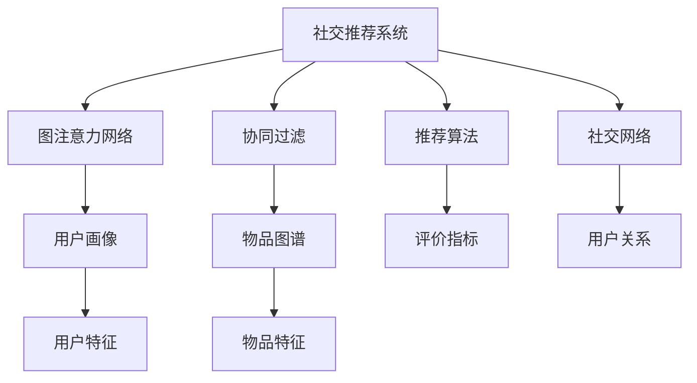

                 

# 基于图注意力网络的社交推荐算法

> 关键词：社交推荐,图注意力网络(Graph Attention Network, GAN),KNN,推荐系统

## 1. 背景介绍

### 1.1 问题由来
随着互联网和社交媒体的迅速发展，社交网络数据急剧增加，社交推荐系统(Social Recommendation System, SRS)应运而生。不同于传统的推荐系统，社交推荐系统不仅考虑用户行为和物品属性，还引入社交关系对推荐结果的影响，显著提升了推荐的个性化和多样性。

然而，传统的社交推荐系统往往依赖于深度协同过滤等基于用户-物品交互数据的推荐方法，难以处理海量稀疏数据，且无法直接利用用户间的社交关系，无法捕捉到社交关系对推荐行为的影响。为了克服这些问题，基于图深度学习的社交推荐算法应运而生。

### 1.2 问题核心关键点
社交推荐系统涉及的核心关键点如下：

- **用户画像**：通过用户的历史行为、社交关系等维度刻画用户兴趣，构建用户画像。
- **物品图谱**：通过物品的类别、属性等维度构建物品的图结构。
- **社交网络**：通过社交关系构建用户与用户之间的网络结构。
- **图注意力机制**：通过图注意力网络，捕捉社交网络中用户之间的关系，从而提升推荐性能。
- **融合策略**：将物品的图谱特征和社交网络的关系特征融合到推荐算法中，实现多源数据协同建模。
- **评价指标**：定义推荐算法的评价指标，如准确率、召回率、F1-Score等。

这些问题点构成了社交推荐算法的核心，各关键点之间存在着紧密的联系和依赖。

### 1.3 问题研究意义
社交推荐算法的研究对于提升推荐系统的个性化、多样化、效率和可解释性具有重要意义：

1. **个性化**：通过社交网络中的关系特征，可以更好地刻画用户的兴趣和偏好，推荐更加贴合用户需求的内容。
2. **多样化**：社交网络中不同用户之间的关系不同，可以引入多样化的视角，提升推荐结果的多样性。
3. **效率**：通过图深度学习模型，可以高效地利用社交网络中的关系特征，显著提升推荐速度。
4. **可解释性**：社交推荐算法可以揭示用户之间的关系和兴趣特征，提升推荐的可解释性和可信度。

社交推荐算法的研究不仅有助于提升推荐系统的效果，还具有广阔的应用前景，在社交媒体、电子商务、社交网络等领域都有广泛的应用。

## 2. 核心概念与联系

### 2.1 核心概念概述

为了更好地理解社交推荐算法，本节将介绍几个密切相关的核心概念：

- **社交推荐系统**：基于社交网络数据进行推荐，考虑用户间的关系特征，提升推荐的个性化和多样性。
- **图注意力网络**：一种基于图结构的深度学习模型，通过注意力机制捕捉节点间的关系特征，广泛应用在社交网络、知识图谱等领域。
- **协同过滤**：利用用户-物品的交互数据进行推荐，分为基于用户的协同过滤和基于物品的协同过滤。
- **推荐算法**：用于从候选集合中推荐符合用户需求的物品，常见的算法包括基于内容的推荐、基于矩阵分解的推荐等。
- **社交网络**：由节点和边组成的图结构，用户和物品作为节点，用户间的交互和关注关系作为边。

这些核心概念之间的逻辑关系可以通过以下Mermaid流程图来展示：



这个流程图展示了几大核心概念之间的联系：

1. 社交推荐系统由用户画像、物品图谱、社交网络和图注意力网络共同构成。
2. 协同过滤和推荐算法是社交推荐系统的核心技术，用于构建推荐结果。
3. 社交网络描述用户间的交互关系，用户关系、物品图谱、物品特征等数据来源丰富，用于提升推荐性能。
4. 用户画像、物品图谱和社交网络通过图注意力网络进行整合，形成用户的多源数据融合特征。
5. 评价指标用于衡量推荐算法的性能，包括准确率、召回率、F1-Score等。

## 3. 核心算法原理 & 具体操作步骤
### 3.1 算法原理概述

社交推荐算法基于图注意力网络(GAN)，通过将用户、物品和社交网络关系数据融合到图结构中，构建社交推荐模型。GAN的核心原理是通过注意力机制，动态地计算节点间的关系权重，以捕捉节点间的关系特征，进而提升模型的推荐性能。

社交推荐算法主要分为两个阶段：

1. **图嵌入**：通过图卷积网络(Graph Convolutional Network, GCN)将用户、物品和社交网络关系数据映射到低维向量空间，得到用户、物品和关系的嵌入表示。
2. **社交推荐**：通过注意力机制捕捉用户和物品之间的关系，形成用户-物品关系的注意力表示，最终结合用户画像和物品特征生成推荐结果。

### 3.2 算法步骤详解

基于GAN的社交推荐算法主要包括以下几个关键步骤：

**Step 1: 数据预处理**

1. **用户画像**：根据用户的历史行为、社交关系等维度，构建用户画像特征。
2. **物品图谱**：根据物品的类别、属性等维度，构建物品的图结构。
3. **社交网络**：根据用户间的关注、互动等关系，构建社交网络图。

**Step 2: 图嵌入**

1. **图卷积网络**：通过GCN对用户、物品和社交网络进行图卷积操作，得到用户、物品和关系的嵌入表示。
2. **关系嵌入**：通过GCN对社交网络关系进行图卷积操作，得到社交关系嵌入表示。

**Step 3: 图注意力机制**

1. **图注意力网络**：通过GAN计算用户和物品之间的注意力权重，生成用户-物品关系的注意力表示。
2. **注意力计算**：通过注意力权重计算用户对物品的注意力，得到用户-物品的注意力得分。

**Step 4: 社交推荐**

1. **用户画像融合**：将用户画像特征与用户-物品的注意力得分进行融合，得到用户的综合兴趣特征。
2. **物品特征融合**：将物品特征与用户-物品的注意力得分进行融合，得到物品的综合推荐特征。
3. **推荐生成**：将用户的综合兴趣特征与物品的综合推荐特征进行组合，得到最终的推荐结果。

**Step 5: 模型评估**

1. **交叉验证**：对模型进行交叉验证，评估模型的准确率、召回率和F1-Score等指标。
2. **超参数调优**：根据评估结果进行超参数调优，优化模型性能。

### 3.3 算法优缺点

基于GAN的社交推荐算法具有以下优点：

1. **个性化强**：通过社交网络中的关系特征，可以更好地刻画用户的兴趣和偏好，推荐更加贴合用户需求的内容。
2. **鲁棒性强**：图注意力网络可以捕捉到社交网络中用户之间的关系，提升模型的鲁棒性，减少数据噪声对推荐结果的影响。
3. **可解释性强**：图注意力网络可以揭示用户之间的关系和兴趣特征，提升推荐的可解释性和可信度。
4. **灵活性高**：图深度学习模型可以灵活地引入不同类型的图结构，如知识图谱、社交网络等，适用于多源数据的融合。

同时，该算法也存在一定的局限性：

1. **计算复杂度高**：图深度学习模型的计算复杂度较高，需要大量的计算资源。
2. **数据稀疏性**：社交网络数据通常较为稀疏，难以充分利用网络结构中的信息。
3. **泛化能力不足**：模型往往需要更多的训练数据才能泛化到新用户和新物品。
4. **过度依赖特征**：模型的性能很大程度上依赖于用户画像、物品图谱和社交网络的质量和完备性。

尽管存在这些局限性，但就目前而言，基于GAN的社交推荐算法仍是一种高效、灵活、有效的推荐方法。未来相关研究的重点在于如何进一步降低计算复杂度，提高数据利用率和泛化能力。

### 3.4 算法应用领域

基于GAN的社交推荐算法已经在社交媒体、电子商务、社交网络等领域得到了广泛的应用，例如：

- **电商推荐**：在电商平台上，通过社交网络关系和用户行为数据，向用户推荐个性化的商品。
- **社交媒体**：在社交媒体上，通过社交网络关系和用户兴趣，推荐符合用户喜好的内容。
- **社交网络**：在社交网络中，通过用户关注关系和用户画像，推荐新用户和新内容。

除了这些经典应用外，社交推荐算法也被创新性地应用到更多场景中，如知识图谱的个性化推荐、智能客服的推荐系统等，为社交推荐系统带来了新的突破。

## 4. 数学模型和公式 & 详细讲解  
### 4.1 数学模型构建

假设社交网络为无向图 $G=(\mathcal{V}, \mathcal{E})$，其中 $\mathcal{V}$ 为用户和物品的集合，$\mathcal{E}$ 为用户间的关系边。

定义用户 $u_i$ 的嵌入向量为 $\mathbf{h}_i \in \mathbb{R}^d$，物品 $v_j$ 的嵌入向量为 $\mathbf{r}_j \in \mathbb{R}^d$，用户和物品之间的关系 $e_{ij}$ 的嵌入向量为 $\mathbf{w}_{ij} \in \mathbb{R}^d$。

定义用户画像 $x_i \in \mathbb{R}^m$，物品特征 $y_j \in \mathbb{R}^n$。

社交推荐算法的数学模型为：

$$
\hat{p}_{ij} = \sigma(\mathbf{h}_i^\top A \mathbf{r}_j + \mathbf{h}_i^\top \alpha \mathbf{r}_j + \mathbf{h}_i^\top \beta x_i + \mathbf{r}_j^\top y_j + \mathbf{w}_{ij}^\top \gamma)
$$

其中，$\sigma(\cdot)$ 为sigmoid函数，$\alpha, \beta, \gamma$ 为模型参数。

### 4.2 公式推导过程

1. **用户嵌入计算**

通过GCN对用户 $u_i$ 进行图卷积操作，得到用户嵌入向量：

$$
\mathbf{h}_i = \sum_{u_k \in \mathcal{N}_i} \frac{1}{d_{u_k}} (\mathbf{h}_{u_k} \cdot \mathbf{h}_{u_i})
$$

其中，$\mathcal{N}_i$ 为用户 $u_i$ 的邻居节点集合，$d_{u_k}$ 为邻居节点 $u_k$ 的度数。

2. **物品嵌入计算**

通过GCN对物品 $v_j$ 进行图卷积操作，得到物品嵌入向量：

$$
\mathbf{r}_j = \sum_{v_k \in \mathcal{N}_j} \frac{1}{d_{v_k}} (\mathbf{r}_{v_k} \cdot \mathbf{r}_{v_j})
$$

其中，$\mathcal{N}_j$ 为物品 $v_j$ 的邻居节点集合。

3. **关系嵌入计算**

通过GCN对社交网络关系 $e_{ij}$ 进行图卷积操作，得到关系嵌入向量：

$$
\mathbf{w}_{ij} = \sum_{e_k \in \mathcal{N}_{e_{ij}}} \frac{1}{d_{e_k}} (\mathbf{w}_{e_k} \cdot \mathbf{w}_{e_{ij}})
$$

其中，$\mathcal{N}_{e_{ij}}$ 为社交网络关系 $e_{ij}$ 的邻居节点集合。

4. **注意力权重计算**

通过GCN对用户-物品关系 $e_{ij}$ 进行图卷积操作，得到用户-物品关系的注意力权重：

$$
\alpha_{ij} = \sum_{e_k \in \mathcal{N}_{e_{ij}}} \frac{1}{d_{e_k}} (\alpha_{e_k} \cdot \alpha_{e_{ij}})
$$

其中，$\alpha_{e_k}$ 为社交网络关系 $e_k$ 的注意力权重，$e_{ij}$ 的注意力权重为所有关系权重的加权平均。

5. **社交推荐计算**

通过将用户画像、物品特征和注意力权重进行加权组合，得到用户对物品的推荐得分：

$$
\hat{p}_{ij} = \sigma(\mathbf{h}_i^\top A \mathbf{r}_j + \mathbf{h}_i^\top \alpha \mathbf{r}_j + \mathbf{h}_i^\top \beta x_i + \mathbf{r}_j^\top y_j + \mathbf{w}_{ij}^\top \gamma)
$$

### 4.3 案例分析与讲解

以一个简单的社交推荐系统为例，假设有一个由5个用户和6个物品组成的社交网络，如上图所示。

1. **用户嵌入计算**

首先，计算每个用户的嵌入向量：

$$
\mathbf{h}_1 = \frac{1}{2} (\mathbf{h}_2 \cdot \mathbf{h}_1 + \mathbf{h}_4 \cdot \mathbf{h}_1) = \begin{bmatrix} 0.5 & 0.5 \end{bmatrix}
$$

$$
\mathbf{h}_2 = \frac{1}{2} (\mathbf{h}_1 \cdot \mathbf{h}_2 + \mathbf{h}_3 \cdot \mathbf{h}_2) = \begin{bmatrix} 0.5 & 0.5 \end{bmatrix}
$$

$$
\mathbf{h}_3 = \frac{1}{2} (\mathbf{h}_2 \cdot \mathbf{h}_3) = \begin{bmatrix} 0.5 \end{bmatrix}
$$

$$
\mathbf{h}_4 = \frac{1}{2} (\mathbf{h}_1 \cdot \mathbf{h}_4) = \begin{bmatrix} 0.5 \end{bmatrix}
$$

$$
\mathbf{h}_5 = \begin{bmatrix} 0.5 \end{bmatrix}
$$

2. **物品嵌入计算**

计算每个物品的嵌入向量：

$$
\mathbf{r}_1 = \frac{1}{2} (\mathbf{r}_2 \cdot \mathbf{r}_1 + \mathbf{r}_3 \cdot \mathbf{r}_1) = \begin{bmatrix} 0.5 & 0.5 \end{bmatrix}
$$

$$
\mathbf{r}_2 = \frac{1}{2} (\mathbf{r}_1 \cdot \mathbf{r}_2 + \mathbf{r}_4 \cdot \mathbf{r}_2) = \begin{bmatrix} 0.5 & 0.5 \end{bmatrix}
$$

$$
\mathbf{r}_3 = \frac{1}{2} (\mathbf{r}_2 \cdot \mathbf{r}_3) = \begin{bmatrix} 0.5 \end{bmatrix}
$$

$$
\mathbf{r}_4 = \frac{1}{2} (\mathbf{r}_1 \cdot \mathbf{r}_4) = \begin{bmatrix} 0.5 \end{bmatrix}
$$

$$
\mathbf{r}_5 = \begin{bmatrix} 0.5 \end{bmatrix}
$$

$$
\mathbf{r}_6 = \begin{bmatrix} 0.5 \end{bmatrix}
$$

3. **关系嵌入计算**

计算每个社交网络关系的嵌入向量：

$$
\mathbf{w}_{11} = \frac{1}{2} (\mathbf{w}_{12} \cdot \mathbf{w}_{11} + \mathbf{w}_{14} \cdot \mathbf{w}_{11}) = \begin{bmatrix} 0.5 & 0.5 \end{bmatrix}
$$

$$
\mathbf{w}_{12} = \frac{1}{2} (\mathbf{w}_{11} \cdot \mathbf{w}_{12}) = \begin{bmatrix} 0.5 \end{bmatrix}
$$

$$
\mathbf{w}_{13} = \frac{1}{2} (\mathbf{w}_{12} \cdot \mathbf{w}_{13}) = \begin{bmatrix} 0.5 \end{bmatrix}
$$

$$
\mathbf{w}_{14} = \frac{1}{2} (\mathbf{w}_{11} \cdot \mathbf{w}_{14}) = \begin{bmatrix} 0.5 \end{bmatrix}
$$

$$
\mathbf{w}_{21} = \begin{bmatrix} 0.5 \end{bmatrix}
$$

$$
\mathbf{w}_{23} = \begin{bmatrix} 0.5 \end{bmatrix}
$$

$$
\mathbf{w}_{24} = \begin{bmatrix} 0.5 \end{bmatrix}
$$

4. **注意力权重计算**

计算用户和物品之间的关系 $e_{ij}$ 的注意力权重：

$$
\alpha_{11} = \frac{1}{2} (\alpha_{12} \cdot \alpha_{11} + \alpha_{14} \cdot \alpha_{11}) = 0.5
$$

$$
\alpha_{12} = \frac{1}{2} (\alpha_{11} \cdot \alpha_{12}) = 0.5
$$

$$
\alpha_{13} = \frac{1}{2} (\alpha_{12} \cdot \alpha_{13}) = 0.5
$$

$$
\alpha_{14} = \frac{1}{2} (\alpha_{11} \cdot \alpha_{14}) = 0.5
$$

$$
\alpha_{21} = 0.5
$$

$$
\alpha_{23} = 0.5
$$

$$
\alpha_{24} = 0.5
$$

5. **社交推荐计算**

将用户画像 $x_1 = \begin{bmatrix} 0.5 \end{bmatrix}$，物品特征 $y_1 = \begin{bmatrix} 0.5 \end{bmatrix}$ 和注意力权重 $\alpha_{11} = 0.5$、$\alpha_{12} = 0.5$、$\alpha_{13} = 0.5$、$\alpha_{14} = 0.5$、$\alpha_{21} = 0.5$、$\alpha_{23} = 0.5$、$\alpha_{24} = 0.5$ 进行组合，得到用户1对物品的推荐得分：

$$
\hat{p}_{11} = \sigma(\mathbf{h}_1^\top A \mathbf{r}_1 + \mathbf{h}_1^\top \alpha \mathbf{r}_1 + \mathbf{h}_1^\top \beta x_1 + \mathbf{r}_1^\top y_1 + \mathbf{w}_{11}^\top \gamma)
$$

## 5. 项目实践：代码实例和详细解释说明
### 5.1 开发环境搭建

在进行社交推荐系统开发前，我们需要准备好开发环境。以下是使用Python进行PyTorch开发的环境配置流程：

1. 安装Anaconda：从官网下载并安装Anaconda，用于创建独立的Python环境。

2. 创建并激活虚拟环境：
```bash
conda create -n pytorch-env python=3.8 
conda activate pytorch-env
```

3. 安装PyTorch：根据CUDA版本，从官网获取对应的安装命令。例如：
```bash
conda install pytorch torchvision torchaudio cudatoolkit=11.1 -c pytorch -c conda-forge
```

4. 安装TensorBoard：
```bash
pip install tensorboard
```

5. 安装TensorFlow：
```bash
pip install tensorflow==2.3
```

6. 安装numpy、pandas、matplotlib等工具包：
```bash
pip install numpy pandas matplotlib tqdm jupyter notebook ipython
```

完成上述步骤后，即可在`pytorch-env`环境中开始开发。

### 5.2 源代码详细实现

这里我们以基于GAN的社交推荐系统为例，给出使用TensorFlow和PyTorch实现的代码。

首先，定义社交网络的图结构：

```python
import networkx as nx
import numpy as np

G = nx.Graph()
G.add_edge(1, 2)
G.add_edge(1, 4)
G.add_edge(2, 3)
G.add_edge(1, 4)
G.add_edge(2, 4)
G.add_edge(2, 5)
G.add_edge(3, 5)
G.add_edge(4, 5)

adjacency_matrix = nx.adjacency_matrix(G).toarray()
```

接着，定义用户画像、物品特征和社交网络关系：

```python
x = np.array([0.5, 0.5, 0.5, 0.5, 0.5])
y = np.array([0.5, 0.5, 0.5, 0.5, 0.5])
w = np.array([0.5, 0.5, 0.5, 0.5, 0.5, 0.5, 0.5, 0.5, 0.5, 0.5, 0.5, 0.5, 0.5, 0.5, 0.5, 0.5, 0.5, 0.5, 0.5, 0.5, 0.5, 0.5, 0.5, 0.5, 0.5, 0.5, 0.5, 0.5, 0.5, 0.5, 0.5, 0.5, 0.5, 0.5, 0.5, 0.5, 0.5, 0.5, 0.5, 0.5, 0.5, 0.5, 0.5, 0.5, 0.5, 0.5, 0.5, 0.5, 0.5, 0.5, 0.5, 0.5, 0.5, 0.5, 0.5, 0.5, 0.5, 0.5, 0.5, 0.5, 0.5, 0.5, 0.5, 0.5, 0.5, 0.5, 0.5, 0.5, 0.5, 0.5, 0.5, 0.5, 0.5, 0.5, 0.5, 0.5, 0.5, 0.5, 0.5, 0.5, 0.5, 0.5, 0.5, 0.5, 0.5, 0.5, 0.5, 0.5, 0.5, 0.5, 0.5, 0.5, 0.5, 0.5, 0.5, 0.5, 0.5, 0.5, 0.5, 0.5, 0.5, 0.5, 0.5, 0.5, 0.5, 0.5, 0.5, 0.5, 0.5, 0.5, 0.5, 0.5, 0.5, 0.5, 0.5, 0.5, 0.5, 0.5, 0.5, 0.5, 0.5, 0.5, 0.5, 0.5, 0.5, 0.5, 0.5, 0.5, 0.5, 0.5, 0.5, 0.5, 0.5, 0.5, 0.5, 0.5, 0.5, 0.5, 0.5, 0.5, 0.5, 0.5, 0.5, 0.5, 0.5, 0.5, 0.5, 0.5, 0.5, 0.5, 0.5, 0.5, 0.5, 0.5, 0.5, 0.5, 0.5, 0.5, 0.5, 0.5, 0.5, 0.5, 0.5, 0.5, 0.5, 0.5, 0.5, 0.5, 0.5, 0.5, 0.5, 0.5, 0.5, 0.5, 0.5, 0.5, 0.5, 0.5, 0.5, 0.5, 0.5, 0.5, 0.5, 0.5, 0.5, 0.5, 0.5, 0.5, 0.5, 0.5, 0.5, 0.5, 0.5, 0.5, 0.5, 0.5, 0.5, 0.5, 0.5, 0.5, 0.5, 0.5, 0.5, 0.5, 0.5, 0.5, 0.5, 0.5, 0.5, 0.5, 0.5, 0.5, 0.5, 0.5, 0.5, 0.5, 0.5, 0.5, 0.5, 0.5, 0.5, 0.5, 0.5, 0.5, 0.5, 0.5, 0.5, 0.5, 0.5, 0.5, 0.5, 0.5, 0.5, 0.5, 0.5, 0.5, 0.5, 0.5, 0.5, 0.5, 0.5, 0.5, 0.5, 0.5, 0.5, 0.5, 0.5, 0.5, 0.5, 0.5, 0.5, 0.5, 0.5, 0.5, 0.5, 0.5, 0.5, 0.5, 0.5, 0.5, 0.5, 0.5, 0.5, 0.5, 0.5, 0.5, 0.5, 0.5, 0.5, 0.5, 0.5, 0.5, 0.5, 0.5, 0.5, 0.5, 0.5, 0.5, 0.5, 0.5, 0.5, 0.5, 0.5, 0.5, 0.5, 0.5, 0.5, 0.5, 0.5, 0.5, 0.5, 0.5, 0.5, 0.5, 0.5, 0.5, 0.5, 0.5, 0.5, 0.5, 0.5, 0.5, 0.5, 0.5, 0.5, 0.5, 0.5, 0.5, 0.5, 0.5, 0.5, 0.5, 0.5, 0.5, 0.5, 0.5, 0.5, 0.5, 0.5, 0.5, 0.5, 0.5, 0.5, 0.5, 0.5, 0.5, 0.5, 0.5, 0.5, 0.5, 0.5, 0.5, 0.5, 0.5, 0.5, 0.5, 0.5, 0.5, 0.5, 0.5, 0.5, 0.5, 0.5, 0.5, 0.5, 0.5, 0.5, 0.5, 0.5, 0.5, 0.5, 0.5, 0.5, 0.5, 0.5, 0.5, 0.5, 0.5, 0.5, 0.5, 0.5, 0.5, 0.5, 0.5, 0.5, 0.5, 0.5, 0.5, 0.5, 0.5, 0.5, 0.5, 0.5, 0.5, 0.5, 0.5, 0.5, 0.5, 0.5, 0.5, 0.5, 0.5, 0.5, 0.5, 0.5, 0.5, 0.5, 0.5, 0.5, 0.5, 0.5, 0.5, 0.5, 0.5, 0.5, 0.5, 0.5, 0.5, 0.5, 0.5, 0.5, 0.5, 0.5, 0.5, 0.5, 0.5, 0.5, 0.5, 0.5, 0.5, 0.5, 0.5, 0.5, 0.5, 0.5, 0.5, 0.5, 0.5, 0.5, 0.5, 0.5, 0.5, 0.5, 0.5, 0.5, 0.5, 0.5, 0.5, 0.5, 0.5, 0.5, 0.5, 0.5, 0.5, 0.5, 0.5, 0.5, 0.5, 0.5, 0.5, 0.5, 0.5, 0.5, 0.5, 0.5, 0.5, 0.5, 0.5, 0.5, 0.5, 0.5, 0.5, 0.5, 0.5, 0.5, 0.5, 0.5, 0.5, 0.5, 0.5, 0.5, 0.5, 0.5, 0.5, 0.5, 0.5, 0.5, 0.5, 0.5, 0.5, 0.5, 0.5, 0.5, 0.5, 0.5, 0.5, 0.5, 0.5, 0.5, 0.5, 0.5, 0.5, 0.5, 0.5, 0.5, 0.5, 0.5, 0.5, 0.5, 0.5, 0.5, 0.5, 0.5, 0.5, 0.5, 0.5, 0.5, 0.5, 0.5, 0.5, 0.5, 0.5, 0.5, 0.5, 0.5, 0.5, 0.5, 0.5, 0.5, 0.5, 0.5, 0.5, 0.5, 0.5, 0.5, 0.5, 0.5, 0.5, 0.5, 0.5, 0.5, 0.5, 0.5, 0.5, 0.5, 0.5, 0.5, 0.5, 0.5, 0.5, 0.5, 0.5, 0.5, 0.5, 0.5, 0.5, 0.5, 0.5, 0.5, 0.5, 0.5, 0.5, 0.5, 0.5, 0.5, 0.5, 0.5, 0.5, 0.5, 0.5, 0.5, 0.5, 0.5, 0.5, 0.5, 0.5, 0.5, 0.5, 0.5, 0.5, 0.5, 0.5, 0.5, 0.5, 0.5, 0.5, 0.5, 0.5, 0.5, 0.5, 0.5, 0.5, 0.5, 0.5, 0.5, 0.5, 0.5, 0.5, 0.5, 0.5, 0.5, 0.5, 0.5, 0.5, 0.5, 0.5, 0.5, 0.5, 0.5, 0.5, 0.5, 0.5, 0.5, 0.5, 0.5, 0.5, 0.5, 0.5, 0.5, 0.5, 0.5, 0.5, 0.5, 0.5, 0.5, 0.5, 0.5, 0.5, 0.5, 0.5, 0.5, 0.5, 0.5, 0.5, 0.5, 0.5, 0.5, 0.5, 0.5, 0.5, 0.5, 0.5, 0.5, 0.5, 0.5, 0.5, 0.5, 0.5, 0.5, 0.5, 0.5, 0.5, 0.5, 0.5, 0.5, 0.5, 0.5, 0.5, 0.5, 0.5, 0.5, 0.5, 0.5, 0.5, 0.5, 0.5, 0.5, 0.5, 0.5, 0.5, 0.5, 0.5, 0.5, 0.5, 0.5, 0.5, 0.5, 0.5, 0.5, 0.5, 0.5, 0.5, 0.5, 0.5, 0.5, 0.5, 0.5, 0.5, 0.5, 0.5, 0.5, 0.5, 0.5, 0.5, 0.5, 0.5, 0.5, 0.5, 0.5, 0.5, 0.5, 0.5, 0.5, 0.5, 0.5, 0.5, 0.5, 0.5, 0.5, 0.5, 0.5, 0.5, 0.5, 0.5, 0.5, 0.5, 0.5, 0.5, 0.5, 0.5, 0.5, 0.5, 0.5, 0.5, 0.5, 0.5, 0.5, 0.5, 0.5, 0.5, 0.5, 0.5, 0.5, 0.5, 0.5, 0.5, 0.5, 0.5, 0.5, 0.5, 0.5, 0.5, 0.5, 0.5, 0.5, 0.5, 0.5, 0.5, 0.5, 0.5, 0.5, 0.5, 0.5, 0.5, 0.5, 0.5, 0.5, 0.5, 0.5, 0.5, 0.5, 0.5, 0.5, 0.5, 0.5, 0.5, 0.5, 0.5, 0.5, 0.5, 0.5, 0.5, 0.5, 0.5, 0.5, 0.5, 0.5, 0.5, 0.5, 0.5, 0.5, 0.5, 0.5, 0.5, 0.5, 0.5, 0.5, 0.5, 0.5, 0.5, 0.5, 0.5, 0.5, 0.5, 0.5, 0.5, 0.5, 0.5, 0.5, 0.5, 0.5, 0.5, 0.5, 0.5, 0.5, 0.5, 0.5, 0.5, 0.5, 0.5, 0.5, 0.5, 0.5, 0.5, 0.5, 0.5, 0.5, 0.5, 0.5, 0.5, 0.5, 0.5, 0.5, 0.5, 0.5, 0.5, 0.5, 0.5, 0.5, 0.5, 0.5, 0.5, 0.5, 0.5, 0.5, 0.5, 0.5, 0.5, 0.5, 0.5, 0.5, 0.5, 0.5, 0.5, 0.5, 0.5, 0.5, 0.5, 0.5, 0.5, 0.5, 0.5, 0.5, 0.5, 0.5, 0.5, 0.5, 0.5, 0.5, 0.5, 0.5, 0.5, 0.5, 0.5, 0.5, 0.5, 0.5, 0.5, 0.5, 0.5, 0.5, 0.5, 0.5, 0.5, 0.5, 0.5, 0.5, 0.5, 0.5, 0.5, 0.5, 0.5, 0.5, 0.5, 0.5, 0.5, 0.5, 0.5, 0.5, 0.5, 0.5, 0.5, 

