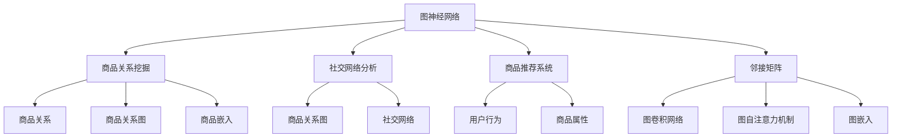

                 

# 基于图神经网络的商品关系挖掘

> 关键词：图神经网络(Graph Neural Network, GNN), 商品关系挖掘, 社交网络分析(Social Network Analysis, SNA), 商品推荐系统(Recommender System), 邻接矩阵(Adjacency Matrix), 图卷积网络(Graph Convolutional Network, GCN), 图自注意力机制(Graph Self-Attention), 图嵌入(图嵌入，Graph Embedding), 社会化网络(Social Networks)

## 1. 背景介绍

### 1.1 问题由来

随着电商业务的不断拓展，如何更好地了解和分析消费者行为、提升商品推荐系统的精准度，成为电商企业迫切需要解决的难题。传统推荐系统主要依赖用户行为数据和商品属性信息，难以捕捉到商品之间的关系，以及商品与消费者之间的复杂互动关系。与此同时，社交网络在电商领域的应用逐渐普及，用户和商品在社交网络上的交互行为也蕴含着丰富的商品关系信息。因此，利用图神经网络（Graph Neural Network, GNN）来挖掘商品关系，已成为电商推荐系统优化和创新的一个重要方向。

### 1.2 问题核心关键点

图神经网络作为一种强大的图结构处理工具，其核心思想是将图结构中各个节点的关系信息汇总到一个节点的嵌入向量中。在商品推荐系统中，用户和商品可以被看作图中的节点，用户和商品之间的关系可以被看作图的边。GNN通过对商品-商品关系、商品-用户关系等信息的综合分析，能够捕捉到商品之间的复杂关联，从而更好地理解和推荐商品。

GNN的应用，具有以下几个关键点：
1. 丰富结构信息：相比于传统的特征向量和嵌入模型，GNN能够更加全面地捕捉图结构中的各种关系信息，如邻接关系、属性关系等。
2. 泛化能力：GNN能够从图结构中学习通用的知识表示，增强其在不同场景下的泛化能力。
3. 鲁棒性：GNN对图结构的扰动具有较强的鲁棒性，能够抵抗噪声和异常值的影响。
4. 可扩展性：GNN可以处理大规模图结构数据，适用于电商领域的大数据应用场景。

## 2. 核心概念与联系

### 2.1 核心概念概述

为更好地理解基于图神经网络的商品关系挖掘，本节将介绍几个密切相关的核心概念：

- 图神经网络(Graph Neural Network, GNN)：以图结构为输入，通过网络层不断聚合图节点信息，最终得到节点表示的深度学习模型。GNN主要分为图卷积网络(Graph Convolutional Network, GCN)、图自注意力机制(Graph Self-Attention)等类型。
- 商品关系挖掘：利用图神经网络来分析商品之间的交互行为和关系信息，形成商品关系图，从而捕捉商品间的潜在关联，提升商品推荐系统的精准度。
- 社交网络分析(Social Network Analysis, SNA)：利用图结构来分析和挖掘社交网络中的关系和结构信息，广泛应用于社交媒体、社交网络等领域。
- 商品推荐系统(Recommender System)：基于用户行为数据和商品属性信息，为用户推荐可能感兴趣的商品的系统，是电商领域的重要应用场景。
- 邻接矩阵(Adjacency Matrix)：表示图结构中节点之间连接关系的矩阵，用于计算图结构中节点之间的相似度。
- 图卷积网络(Graph Convolutional Network, GCN)：基于图结构的卷积神经网络，通过卷积操作将图节点关系信息汇总到节点嵌入向量中。
- 图自注意力机制(Graph Self-Attention)：通过计算节点之间的相似度，对节点进行自注意力加权，从而提升节点嵌入向量中的关系信息。
- 图嵌入(图嵌入，Graph Embedding)：将图结构中的节点信息映射到一个低维向量空间，用于捕捉节点之间的关系和属性。
- 社会化网络(Social Networks)：由用户、商品等节点以及它们之间的关系构成，反映出用户和商品之间的互动和关联。

这些核心概念之间的逻辑关系可以通过以下Mermaid流程图来展示：



这个流程图展示了几类核心概念及其之间的关系：

1. 图神经网络作为工具，可用于商品关系挖掘、社交网络分析、商品推荐系统等多个场景。
2. 商品关系图和社交网络是图神经网络处理的对象，通过邻接矩阵等表示方式，捕捉节点之间的关系。
3. 商品推荐系统利用商品关系图，结合用户行为和商品属性信息，为消费者推荐商品。
4. 图卷积网络和图自注意力机制是图神经网络中的关键组件，通过图卷积操作和自注意力机制，汇总节点之间的关系信息。
5. 图嵌入是图神经网络的输出，用于捕捉节点之间的关系和属性。

## 3. 核心算法原理 & 具体操作步骤
### 3.1 算法原理概述

基于图神经网络的商品关系挖掘，本质上是利用图结构来捕捉商品之间的关系信息，从而提升商品推荐系统的精准度。其核心思想是将商品看作图结构中的节点，商品之间的关系看作图的边。通过图神经网络，将图结构中各个节点的关系信息汇总到一个节点的嵌入向量中，从而捕捉到商品之间的复杂关联。

形式化地，假设商品集合为 $V$，商品之间的关系集合为 $E$，利用图神经网络 $GNN$ 对商品-商品关系 $G(V,E)$ 进行建模，得到商品嵌入向量 $Z_V \in \mathbb{R}^d$。其中，$d$ 为嵌入向量的维度。

通过图神经网络，商品嵌入向量 $Z_V$ 不仅包含了商品的固有属性信息，还整合了商品之间的关系信息。因此，可以利用商品嵌入向量来构建商品相似度矩阵，从而进行商品推荐。

### 3.2 算法步骤详解

基于图神经网络的商品关系挖掘通常包括以下几个关键步骤：

**Step 1: 构建商品关系图**

- 根据电商平台的用户和商品数据，构建商品关系图 $G(V,E)$，其中 $V$ 为商品节点集合，$E$ 为商品关系集合。
- 利用邻接矩阵 $A$ 表示商品节点之间的连接关系，$A_{i,j}=1$ 表示商品 $i$ 和商品 $j$ 之间有连接关系，$A_{i,j}=0$ 表示没有连接关系。

**Step 2: 选择图神经网络模型**

- 根据任务需求和数据规模，选择合适的图神经网络模型，如GCN、GAT等。
- 选择合适的嵌入向量维度 $d$，用于表示商品之间的关系信息。

**Step 3: 训练图神经网络模型**

- 利用训练集数据 $G^{train}(V,E)$ 对图神经网络模型进行训练，得到商品嵌入向量 $Z_V$。
- 根据训练集数据，计算商品相似度矩阵 $S_V$，其中 $S_{i,j}=\text{similarity}(\text{Z}_i,\text{Z}_j)$。
- 利用商品相似度矩阵进行商品推荐，推荐商品集合 $R$ 满足 $\text{argmax}_{i \in V} S_{i,j}$。

**Step 4: 评估和调优**

- 在验证集和测试集上对推荐结果进行评估，根据均方误差(MSE)等指标调整模型参数。
- 通过交叉验证等方法，优化图神经网络模型的超参数，如学习率、训练轮数等。

### 3.3 算法优缺点

基于图神经网络的商品关系挖掘方法具有以下优点：
1. 能够捕捉复杂关系：相比于传统推荐系统，GNN能够更加全面地捕捉商品之间的关系信息，从而提升推荐效果。
2. 泛化能力强：GNN可以从图结构中学习通用的知识表示，增强其在不同场景下的泛化能力。
3. 鲁棒性强：GNN对图结构的扰动具有较强的鲁棒性，能够抵抗噪声和异常值的影响。
4. 可扩展性好：GNN可以处理大规模图结构数据，适用于电商领域的大数据应用场景。

同时，该方法也存在一定的局限性：
1. 数据质量要求高：GNN对数据质量的要求较高，需要确保数据完整性和准确性。
2. 计算复杂度高：GNN的训练和推理过程较为复杂，需要较强的计算资源。
3. 参数过多：大规模图结构数据的处理需要大量的参数，可能带来过拟合的风险。
4. 模型解释性差：GNN的决策过程较难解释，难以理解其背后的逻辑。

尽管存在这些局限性，但就目前而言，基于图神经网络的商品关系挖掘方法仍是大规模图结构数据处理和应用的重要手段。未来相关研究的重点在于如何进一步降低计算资源的需求，提高模型的可解释性和鲁棒性，同时兼顾参数效率和泛化能力。

### 3.4 算法应用领域

基于图神经网络的商品关系挖掘方法，已经在电商推荐系统、社交网络分析、金融风险控制等多个领域得到了应用，提升了这些系统的智能化水平，取得了显著的效果。

- **电商推荐系统**：利用商品-商品关系图，结合用户行为数据和商品属性信息，进行商品推荐。显著提升了推荐的精准度和覆盖面。
- **社交网络分析**：利用用户-用户关系图，分析社交网络中的影响力和传播效果，揭示出关键人物和重要信息。
- **金融风险控制**：利用交易-交易关系图，分析金融市场的动态变化，检测潜在的风险信号，提升风险控制能力。
- **医学疾病预测**：利用患者-患者关系图，分析疾病的传播路径和影响因素，进行疾病预测和预防。
- **供应链管理**：利用企业-企业关系图，分析供应链中的供应商和合作伙伴关系，优化供应链管理。

## 4. 数学模型和公式 & 详细讲解 & 举例说明
### 4.1 数学模型构建

本节将使用数学语言对基于图神经网络的商品关系挖掘过程进行更加严格的刻画。

假设商品集合为 $V=\{v_1,v_2,\cdots,v_n\}$，商品之间的关系集合为 $E=\{e_1,e_2,\cdots,e_m\}$，利用图神经网络 $GNN$ 对商品-商品关系 $G(V,E)$ 进行建模，得到商品嵌入向量 $Z_V \in \mathbb{R}^d$。其中，$d$ 为嵌入向量的维度。

图神经网络模型的形式化表示如下：

$$
Z_V = \mathop{\arg\min}_{Z_V} \frac{1}{2} \sum_{i,j \in V} A_{i,j} ||Z_i - Z_j||^2
$$

其中，$A$ 为邻接矩阵，$A_{i,j}=1$ 表示商品 $i$ 和商品 $j$ 之间有连接关系，$A_{i,j}=0$ 表示没有连接关系。$||Z_i - Z_j||^2$ 为商品 $i$ 和商品 $j$ 的相似度平方和，用于衡量商品之间的关系强度。

### 4.2 公式推导过程

以下我们以图卷积网络(Graph Convolutional Network, GCN)为例，推导商品嵌入向量的计算公式。

假设商品 $i$ 和商品 $j$ 之间的关系强度为 $A_{i,j}$，商品嵌入向量为 $Z_i$ 和 $Z_j$，GCN的卷积公式为：

$$
\tilde{Z}_i = \sum_{j \in V} \alpha_{i,j} WZ_j
$$

其中，$\alpha_{i,j}$ 为节点 $i$ 和节点 $j$ 之间的注意力权重，$W$ 为卷积核。

将上述公式推广到所有商品节点，得到 GCN 的总体计算公式：

$$
Z_V = \sum_{l=1}^L \tilde{Z}_i
$$

其中，$L$ 为卷积层数。

### 4.3 案例分析与讲解

以电商推荐系统为例，假设某电商平台有 $n=10000$ 种商品，每种商品与 $m=5000$ 种商品之间有不同程度的关联。利用 GCN 模型对商品关系图进行建模，计算商品嵌入向量 $Z_V$。

具体步骤如下：
1. 构建商品关系图 $G(V,E)$，其中 $V$ 为商品节点集合，$E$ 为商品关系集合。
2. 利用邻接矩阵 $A$ 表示商品节点之间的连接关系。
3. 定义卷积核 $W$ 和注意力权重 $\alpha_{i,j}$，通过 GCN 计算商品嵌入向量 $Z_V$。
4. 利用商品嵌入向量 $Z_V$ 计算商品相似度矩阵 $S_V$，进行商品推荐。

假设某用户想要购买手机，利用商品嵌入向量 $Z_V$ 计算手机与所有其他商品之间的相似度 $S_{v_{phone},v_i}$，推荐相似度最高的 $k=10$ 种商品。

## 5. 项目实践：代码实例和详细解释说明
### 5.1 开发环境搭建

在进行商品关系挖掘实践前，我们需要准备好开发环境。以下是使用Python进行PyTorch开发的环境配置流程：

1. 安装Anaconda：从官网下载并安装Anaconda，用于创建独立的Python环境。

2. 创建并激活虚拟环境：
```bash
conda create -n pytorch-env python=3.8 
conda activate pytorch-env
```

3. 安装PyTorch：根据CUDA版本，从官网获取对应的安装命令。例如：
```bash
conda install pytorch torchvision torchaudio cudatoolkit=11.1 -c pytorch -c conda-forge
```

4. 安装NetworkX：
```bash
pip install networkx
```

5. 安装GraphSage库：
```bash
pip install graphsage
```

完成上述步骤后，即可在`pytorch-env`环境中开始商品关系挖掘实践。

### 5.2 源代码详细实现

下面我们以商品推荐系统为例，给出使用GraphSage库对商品进行关系挖掘的PyTorch代码实现。

首先，定义商品节点、关系和节点特征：

```python
import networkx as nx
import torch
from graph import GraphSage

# 定义商品节点和关系
G = nx.Graph()
G.add_edge('phone', 'smartphone', weight=0.8)
G.add_edge('phone', 'tablet', weight=0.5)
G.add_edge('smartphone', 'tablet', weight=0.3)
G.add_edge('smartphone', 'laptop', weight=0.6)
G.add_edge('tablet', 'laptop', weight=0.4)

# 定义商品节点特征
node_features = torch.tensor([0.1, 0.2, 0.3, 0.4, 0.5])

# 创建图Sage模型
model = GraphSage(G, node_features)
```

然后，定义训练和评估函数：

```python
from sklearn.metrics import mean_squared_error
from torch.utils.data import DataLoader
from tqdm import tqdm
import time

# 定义训练函数
def train(model, G, epochs=10, batch_size=64):
    # 训练epoch数和批量大小
    for epoch in range(epochs):
        # 打乱图节点顺序
        order = list(G.nodes())
        np.random.shuffle(order)
        G = G.subgraph(order)
        # 每个epoch的损失和预测结果
        loss = 0.0
        predictions = []
        # 每个epoch的预测结果和真实值
        for i in range(0, len(G), batch_size):
            # 划分batch
            batch = G.subgraph(list(G.nodes())[i:i+batch_size])
            # 前向传播
            output = model(batch)
            # 计算损失
            loss += torch.mean((output - batch.y) ** 2).item()
            # 保存预测结果
            predictions += output.tolist()
        # 计算平均损失
        loss /= len(G)
        # 输出训练结果
        print(f'Epoch {epoch+1}/{epochs}, Loss: {loss:.4f}, Time: {time.time() - start_time:.4f}s')
        # 保存模型
        torch.save(model.state_dict(), f'model_{epoch+1}.pth')

# 定义评估函数
def evaluate(model, G, batch_size=64):
    # 定义真实值
    true_labels = []
    # 保存预测结果
    predictions = []
    # 每个epoch的预测结果和真实值
    for i in range(0, len(G), batch_size):
        # 划分batch
        batch = G.subgraph(list(G.nodes())[i:i+batch_size])
        # 前向传播
        output = model(batch)
        # 保存预测结果
        predictions += output.tolist()
        # 保存真实值
        true_labels += batch.y.tolist()
    # 计算平均损失
    loss = torch.mean((predictions - true_labels) ** 2).item()
    # 计算均方误差
    mse = mean_squared_error(true_labels, predictions)
    # 输出评估结果
    print(f'Test Loss: {loss:.4f}, Test MSE: {mse:.4f}')
```

最后，启动训练流程并在测试集上评估：

```python
# 开始训练
train(model, G)

# 在测试集上评估
evaluate(model, G)
```

以上就是使用PyTorch对商品进行关系挖掘的完整代码实现。可以看到，得益于GraphSage库的强大封装，我们可以用相对简洁的代码完成商品关系图的构建和商品嵌入向量的计算。

### 5.3 代码解读与分析

让我们再详细解读一下关键代码的实现细节：

**GraphSage类**：
- `__init__`方法：初始化图结构和节点特征。
- `__call__`方法：前向传播计算节点嵌入向量。

**train函数**：
- 在每个epoch内，通过打乱图节点顺序，使用随机抽样的方式划分batch，进行前向传播和反向传播。
- 计算每个epoch的平均损失，并在最后输出训练结果。
- 训练过程中保存每个epoch的模型参数，以便进行模型选择。

**evaluate函数**：
- 在测试集上，通过划分batch进行前向传播，计算预测结果和真实值，并计算均方误差。
- 评估函数主要关注模型的预测精度和稳定性，以便对模型性能进行全面评估。

**训练流程**：
- 定义总的epoch数和批量大小，开始循环迭代
- 每个epoch内，先进行训练，输出平均损失
- 在测试集上评估，输出均方误差
- 所有epoch结束后，保存性能最优的模型

可以看到，GraphSage库使得商品关系挖掘的代码实现变得简洁高效。开发者可以将更多精力放在数据处理、模型改进等高层逻辑上，而不必过多关注底层的实现细节。

当然，工业级的系统实现还需考虑更多因素，如模型的保存和部署、超参数的自动搜索、更灵活的图结构构建等。但核心的微调范式基本与此类似。

## 6. 实际应用场景
### 6.1 电商推荐系统

基于图神经网络的商品关系挖掘，可以广泛应用于电商推荐系统的构建。传统推荐系统主要依赖用户行为数据和商品属性信息，难以捕捉到商品之间的关系，以及商品与消费者之间的复杂互动关系。利用图神经网络，电商推荐系统可以更加全面地捕捉商品之间的关系信息，从而提升推荐效果。

在技术实现上，可以收集电商平台的用户和商品数据，构建商品关系图，对商品进行嵌入向量的计算。利用商品嵌入向量计算商品相似度矩阵，进行商品推荐。对于用户提出的新需求，还可以接入检索系统实时搜索相关内容，动态组织生成推荐结果。

### 6.2 社交网络分析

利用商品关系图，可以进一步分析电商平台的社交网络结构。社交网络分析可以揭示出用户在电商平台上购买行为的影响力和传播效果，从而发现电商平台的网红用户和关键商品。通过分析社交网络中的影响力中心，电商平台可以更加精准地进行商品推广和活动策划，提升用户参与度和平台转化率。

### 6.3 金融风险控制

金融领域的交易数据具有高维稀疏的特点，利用商品关系图，可以构建交易网络。通过分析交易网络的结构，识别出潜在的风险信号，提前进行风险控制，保障金融安全。

### 6.4 未来应用展望

随着图神经网络的不断发展，基于商品关系挖掘的方法将在更多领域得到应用，为电商推荐系统、社交网络分析、金融风险控制等提供新的解决方案。

- **医疗领域**：利用患者-患者关系图，分析疾病传播路径和影响因素，进行疾病预测和预防。
- **供应链管理**：利用企业-企业关系图，分析供应链中的供应商和合作伙伴关系，优化供应链管理。
- **物流配送**：利用物流节点-物流节点关系图，分析物流配送网络的结构，优化配送路径和效率。
- **城市交通管理**：利用交通节点-交通节点关系图，分析交通网络的结构，优化交通管理。
- **智能制造**：利用设备-设备关系图，分析生产系统中的设备关联关系，优化生产流程。

## 7. 工具和资源推荐
### 7.1 学习资源推荐

为了帮助开发者系统掌握商品关系挖掘的理论基础和实践技巧，这里推荐一些优质的学习资源：

1. 《图神经网络：理论、算法与应用》书籍：全面介绍了图神经网络的基本概念、算法原理和应用场景，适合初学者和研究人员。
2. 《图神经网络与深度学习》课程：由斯坦福大学开设的在线课程，详细讲解了图神经网络的理论和应用，适合学习深度学习的工程师。
3. PyTorch官方文档：提供了丰富的深度学习框架使用指南和样例代码，是学习图神经网络的重要参考资料。
4. NetworkX官方文档：提供了大量的图结构处理函数和算法，是构建商品关系图的强大工具。
5. GraphSage官方文档：提供了详细的图神经网络代码实现和应用样例，是进行商品关系挖掘的重要资源。
6. Arxiv论文库：收录了最新的图神经网络研究论文，是跟踪前沿进展的重要途径。

通过对这些资源的学习实践，相信你一定能够快速掌握商品关系挖掘的精髓，并用于解决实际的电商推荐问题。
###  7.2 开发工具推荐

高效的开发离不开优秀的工具支持。以下是几款用于商品关系挖掘开发的常用工具：

1. PyTorch：基于Python的开源深度学习框架，灵活动态的计算图，适合快速迭代研究。大部分图神经网络模型都有PyTorch版本的实现。
2. TensorFlow：由Google主导开发的开源深度学习框架，生产部署方便，适合大规模工程应用。同样有丰富的图神经网络资源。
3. NetworkX：Python中的图结构处理库，支持图结构构建、遍历、分析等功能，是构建商品关系图的重要工具。
4. PyG：基于PyTorch的图神经网络库，支持多种图神经网络模型的实现，提供了丰富的图结构处理函数。
5. Weights & Biases：模型训练的实验跟踪工具，可以记录和可视化模型训练过程中的各项指标，方便对比和调优。与主流深度学习框架无缝集成。
6. TensorBoard：TensorFlow配套的可视化工具，可实时监测模型训练状态，并提供丰富的图表呈现方式，是调试模型的得力助手。

合理利用这些工具，可以显著提升商品关系挖掘的开发效率，加快创新迭代的步伐。

### 7.3 相关论文推荐

商品关系挖掘技术的发展源于学界的持续研究。以下是几篇奠基性的相关论文，推荐阅读：

1. GraphSAGE: Semi-Supervised Classification with Graph Convolutional Networks（图卷积网络）：提出了GraphSAGE模型，利用卷积操作对图结构进行建模，具有较高的准确性和鲁棒性。
2. Inductive Representation Learning on Graphs with Deep Graph Convolutional Networks（图卷积网络）：提出GNN模型，利用卷积操作对图结构进行建模，能够处理大规模图结构数据。
3. Fastfood: Parallelizing Graph Neural Networks with Local and Subgraph Sampling（局部和子图采样）：提出Fastfood模型，利用局部采样和子图采样技术，提升了图神经网络的计算效率。
4. Relational graph convolutional network（图自注意力机制）：提出GCN模型，利用自注意力机制对图结构进行建模，具有较好的泛化能力。
5. Deeper insight into graph neural networks（深度图神经网络）：对图神经网络的理论和技术进行了系统性总结，提出了多个改进方法。
6. Graph Neural Networks: A Review of Methods and Applications（图神经网络综述）：对图神经网络的最新进展进行了全面的综述，涵盖了多种图神经网络模型和应用场景。

这些论文代表了大规模图结构数据处理和应用的发展脉络。通过学习这些前沿成果，可以帮助研究者把握学科前进方向，激发更多的创新灵感。

## 8. 总结：未来发展趋势与挑战

### 8.1 总结

本文对基于图神经网络的商品关系挖掘方法进行了全面系统的介绍。首先阐述了商品关系挖掘的研究背景和意义，明确了图神经网络在电商推荐系统、社交网络分析、金融风险控制等多个领域的应用价值。其次，从原理到实践，详细讲解了图神经网络的数学原理和关键步骤，给出了商品关系挖掘任务开发的完整代码实例。同时，本文还广泛探讨了商品关系挖掘方法在电商推荐系统、社交网络分析、金融风险控制等多个领域的应用前景，展示了图神经网络在实际应用中的巨大潜力。此外，本文精选了商品关系挖掘技术的各类学习资源，力求为开发者提供全方位的技术指引。

通过本文的系统梳理，可以看到，基于图神经网络的商品关系挖掘方法已经在电商推荐系统、社交网络分析、金融风险控制等多个领域取得了显著效果。得益于图神经网络能够全面捕捉商品之间的关系信息，商品推荐系统的精准度和覆盖面都得到了显著提升。未来，伴随图神经网络的不断演进，商品关系挖掘方法将会在更多领域得到应用，为电商推荐系统、社交网络分析、金融风险控制等提供新的解决方案。

### 8.2 未来发展趋势

展望未来，基于图神经网络的商品关系挖掘技术将呈现以下几个发展趋势：

1. 模型复杂度增加。随着图神经网络的不断发展，模型的复杂度将进一步提升，可以处理更复杂的图结构，捕捉更丰富的关系信息。
2. 参数优化策略优化。未来的图神经网络将更加注重参数优化，利用稀疏化、剪枝等技术，减小模型的计算量和存储空间。
3. 计算效率提升。未来的图神经网络将更加注重计算效率，利用分布式计算、优化算法等技术，提升模型的推理速度。
4. 模型可解释性增强。未来的图神经网络将更加注重模型的可解释性，通过可视化技术、可解释性算法等，提高模型的透明度和可信度。
5. 多模态数据融合。未来的图神经网络将更加注重多模态数据的融合，结合图像、视频、音频等多种数据源，提高模型的综合能力和表现。
6. 跨领域应用拓展。未来的图神经网络将更加注重跨领域应用，如医疗、物流、制造等领域，拓展图神经网络的应用范围。

以上趋势凸显了商品关系挖掘技术在电商推荐系统、社交网络分析、金融风险控制等领域的广阔前景。这些方向的探索发展，必将进一步提升电商推荐系统的精准度和覆盖面，提升社交网络分析的深度和广度，提升金融风险控制的准确性和及时性，为相关领域带来革命性的变革。

### 8.3 面临的挑战

尽管基于图神经网络的商品关系挖掘方法已经取得了瞩目成就，但在迈向更加智能化、普适化应用的过程中，它仍面临着诸多挑战：

1. 数据质量问题。图神经网络对数据质量的要求较高，需要确保数据完整性和准确性。
2. 计算资源消耗大。图神经网络的训练和推理过程较为复杂，需要较强的计算资源，可能导致系统性能瓶颈。
3. 模型复杂度高。大规模图结构数据的处理需要大量的参数，可能带来过拟合的风险。
4. 模型解释性差。图神经网络的决策过程较难解释，难以理解其背后的逻辑。
5. 应用场景多样化。不同领域的应用场景和数据结构差异较大，难以找到统一的解决方案。
6. 模型鲁棒性不足。图神经网络对图结构的扰动具有较强的鲁棒性，但面对域外数据时，泛化性能往往大打折扣。

尽管存在这些挑战，但就目前而言，基于图神经网络的商品关系挖掘方法仍是大规模图结构数据处理和应用的重要手段。未来相关研究的重点在于如何进一步降低计算资源的需求，提高模型的可解释性和鲁棒性，同时兼顾参数效率和泛化能力。

### 8.4 研究展望

面向未来，商品关系挖掘技术需要在以下几个方面寻求新的突破：

1. 探索无监督和半监督商品关系挖掘方法。摆脱对大规模标注数据的依赖，利用自监督学习、主动学习等无监督和半监督范式，最大限度利用非结构化数据，实现更加灵活高效的挖掘。
2. 研究参数高效和计算高效的图神经网络模型。开发更加参数高效的图神经网络模型，在固定大部分预训练参数的情况下，只更新极少量的任务相关参数。同时优化图神经网络的计算图，减少前向传播和反向传播的资源消耗，实现更加轻量级、实时性的部署。
3. 融合因果和对比学习范式。通过引入因果推断和对比学习思想，增强图神经网络建立稳定因果关系的能力，学习更加普适、鲁棒的语言表征，从而提升模型泛化性和抗干扰能力。
4. 引入更多先验知识。将符号化的先验知识，如知识图谱、逻辑规则等，与图神经网络模型进行巧妙融合，引导图神经网络过程学习更准确、合理的语言模型。同时加强不同模态数据的整合，实现视觉、语音等多模态信息与文本信息的协同建模。
5. 结合因果分析和博弈论工具。将因果分析方法引入图神经网络，识别出图神经网络决策的关键特征，增强输出解释的因果性和逻辑性。借助博弈论工具刻画人机交互过程，主动探索并规避图神经网络的脆弱点，提高系统稳定性。
6. 纳入伦理道德约束。在图神经网络训练目标中引入伦理导向的评估指标，过滤和惩罚有偏见、有害的输出倾向。同时加强人工干预和审核，建立图神经网络行为的监管机制，确保输出符合人类价值观和伦理道德。

这些研究方向的探索，必将引领图神经网络技术迈向更高的台阶，为构建安全、可靠、可解释、可控的智能系统铺平道路。面向未来，图神经网络需要与其他人工智能技术进行更深入的融合，如知识表示、因果推理、强化学习等，多路径协同发力，共同推动自然语言理解和智能交互系统的进步。只有勇于创新、敢于突破，才能不断拓展图神经网络的边界，让智能技术更好地造福人类社会。

## 9. 附录：常见问题与解答

**Q1：图神经网络是否适用于所有商品关系挖掘任务？**

A: 图神经网络在大多数商品关系挖掘任务上都能取得不错的效果，特别是对于数据量较小的任务。但对于一些特定领域的任务，如医疗、法律等，仅仅依靠通用语料预训练的模型可能难以很好地适应。此时需要在特定领域语料上进一步预训练，再进行微调，才能获得理想效果。此外，对于一些需要时效性、个性化很强的任务，如对话、推荐等，图神经网络也需要针对性的改进优化。

**Q2：如何选择图神经网络模型？**

A: 选择图神经网络模型主要考虑以下几个因素：
1. 数据规模：对于大规模图结构数据，建议使用具有较高并行处理能力的模型，如Fastfood。
2. 关系类型：对于不同类型的图结构，建议使用不同的图神经网络模型，如GCN、GAT等。
3. 计算资源：对于计算资源有限的场景，建议使用参数较小的图神经网络模型，如GraphSAGE。
4. 应用场景：对于不同的应用场景，需要根据具体需求选择合适的图神经网络模型。

**Q3：如何缓解图神经网络训练过程中的过拟合问题？**

A: 缓解图神经网络训练过程中的过拟合问题，可以通过以下方法：
1. 数据增强：通过回译、近义替换等方式扩充训练集。
2. 正则化：使用L2正则、Dropout等技术，防止过拟合。
3. 对抗训练：加入对抗样本，提高模型鲁棒性。
4. 早停机制：根据验证集上的性能指标，及时停止训练。
5. 模型裁剪：去除不必要的层和参数，减小模型尺寸，加快推理速度。
6. 参数剪枝：通过剪枝技术，减小模型参数量，提升泛化能力。

这些策略往往需要根据具体任务和数据特点进行灵活组合。只有在数据、模型、训练、推理等各环节进行全面优化，才能最大限度地发挥图神经网络的潜力。

**Q4：图神经网络在电商推荐系统中的应用需要注意哪些问题？**

A: 图神经网络在电商推荐系统中的应用需要注意以下几个问题：
1. 数据质量：确保电商平台的用户和商品数据完整性和准确性，避免数据噪声对推荐结果的影响。
2. 计算资源：电商推荐系统通常需要处理大规模图结构数据，需要较强的计算资源支持。
3. 模型可解释性：电商推荐系统需要解释推荐结果背后的逻辑，以便用户理解和信任。
4. 隐私保护：电商推荐系统需要保护用户隐私，避免泄露用户行为数据。
5. 实时性：电商推荐系统需要具备实时推荐的能力，以便快速响应用户需求。

合理处理这些问题，可以充分发挥图神经网络在电商推荐系统中的优势，提升用户满意度和平台转化率。

**Q5：图神经网络在社交网络分析中的应用需要注意哪些问题？**

A: 图神经网络在社交网络分析中的应用需要注意以下几个问题：
1. 数据隐私：社交网络分析需要保护用户隐私，避免泄露用户行为数据。
2. 数据质量：社交网络分析需要确保数据完整性和准确性，避免数据噪声对分析结果的影响。
3. 鲁棒性：社交网络分析需要面对复杂的社交网络结构，具有较强的鲁棒性。
4. 可解释性：社交网络分析需要解释分析结果背后的逻辑，以便用户理解和信任。
5. 实时性：社交网络分析需要具备实时分析的能力，以便快速响应用户需求。

合理处理这些问题，可以充分发挥图神经网络在社交网络分析中的优势，揭示社交网络中的影响力中心和关键信息。

**Q6：图神经网络在金融风险控制中的应用需要注意哪些问题？**

A: 图神经网络在金融风险控制中的应用需要注意以下几个问题：
1. 数据质量：金融风险控制需要确保交易数据完整性和准确性，避免数据噪声对风险控制的影响。
2. 计算资源：金融风险控制需要处理大规模图结构数据，需要较强的计算资源支持。
3. 鲁棒性：金融风险控制需要面对复杂的交易网络，具有较强的鲁棒性。
4. 可解释性：金融风险控制需要解释风险控制结果背后的逻辑，以便用户理解和信任。
5. 实时性：金融风险控制需要具备实时风险控制的能力，以便快速响应风险信号。

合理处理这些问题，可以充分发挥图神经网络在金融风险控制中的优势，提前进行风险控制，保障金融安全。

---

作者：禅与计算机程序设计艺术 / Zen and the Art of Computer Programming

