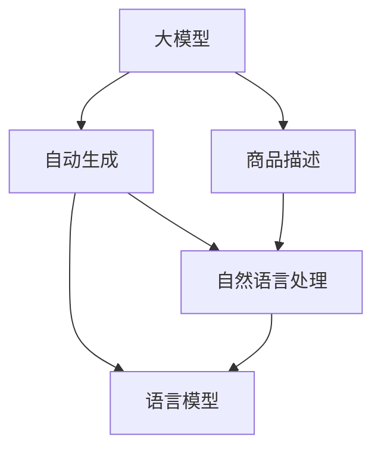

                 

# 基于大模型的商品描述自动生成系统

> 关键词：大模型, 自动生成, 商品描述, 自然语言处理, 语言模型, 深度学习, Transformer

## 1. 背景介绍

### 1.1 问题由来

随着电子商务平台的兴起，商品描述对于商家来说变得越来越重要。一个详尽、吸引人的商品描述，不仅能帮助消费者快速了解产品信息，还能显著提高转化率和销售额。然而，撰写高质量的商品描述对于商家来说是一项繁琐且耗时的任务。

此外，随着市场的不断变化，商品种类繁多，新兴商品层出不穷，商家需要持续更新商品描述，以保持竞争力。这不仅增加了人力成本，还可能因信息过时或不完整导致销售下降。

基于这些原因，商品描述自动生成技术应运而生。利用大模型和自然语言处理(NLP)技术，可以自动生成详尽、吸引人的商品描述，大幅提升商家运营效率和销售业绩。

### 1.2 问题核心关键点

商品描述自动生成系统的核心目标是通过大语言模型，自动将商品信息转化为自然语言描述。核心问题包括：

1. **数据准备**：收集和整理商品信息（如商品名称、材质、尺寸、用途等）作为输入数据。
2. **模型选择**：选择合适的预训练语言模型，如BERT、GPT系列等，作为生成模型的基础。
3. **自动生成**：设计生成模型，将商品信息转换为自然语言描述。
4. **质量评估**：建立质量评估标准，确保自动生成的描述与真实描述相似度高。
5. **部署应用**：将生成模型部署到实际业务系统，实现商品描述的自动生成。

### 1.3 问题研究意义

商品描述自动生成技术具有以下几方面重要意义：

1. **提高效率**：自动生成商品描述可以大幅减少商家的撰写工作量，提高运营效率。
2. **提升质量**：利用大模型的强大语言生成能力，生成描述质量更高，更吸引消费者。
3. **降低成本**：减少人力成本，提升转化率，间接降低商家营销成本。
4. **快速响应**：对于新兴商品，自动生成描述可以快速上线，抢占市场先机。
5. **业务创新**：自动生成技术可以拓展商家营销渠道，提升品牌影响力。

## 2. 核心概念与联系

### 2.1 核心概念概述

为更好地理解基于大模型的商品描述自动生成系统，本节将介绍几个密切相关的核心概念：

- **大模型**：以自回归(如GPT)或自编码(如BERT)模型为代表的大规模预训练语言模型。通过在大规模无标签文本语料上进行预训练，学习通用的语言表示，具备强大的语言理解和生成能力。
- **自动生成**：利用机器学习模型，自动将输入数据转换为自然语言文本，应用广泛，如机器翻译、对话生成、文本摘要等。
- **商品描述**：商品详细信息的文字描述，包括商品属性、功能、用途等，是消费者了解商品的重要依据。
- **自然语言处理(NLP)**：利用计算机技术处理、分析和理解自然语言，包括文本预处理、语言建模、生成等。
- **语言模型**：基于统计或神经网络的模型，用于预测文本序列的概率分布，广泛应用于自动生成任务。
- **深度学习**：基于人工神经网络的学习方法，通过多层次处理数据，实现复杂的模式识别和预测任务。

这些核心概念之间的逻辑关系可以通过以下Mermaid流程图来展示：



这个流程图展示了大模型、自动生成、商品描述、自然语言处理和语言模型之间的关联关系：

1. 大模型通过预训练获得语言表示能力。
2. 自动生成系统利用大模型生成自然语言文本。
3. 自然语言处理技术辅助自动生成系统处理输入和输出数据。
4. 语言模型作为自动生成系统的一部分，用于生成和预测文本序列。
5. 商品描述作为自动生成系统的输入，通过自动生成系统转化为自然语言文本。

## 3. 核心算法原理 & 具体操作步骤

### 3.1 算法原理概述

基于大模型的商品描述自动生成系统，其核心原理是通过预训练大模型，学习通用语言表示，再将商品信息输入模型，自动生成自然语言描述。其核心算法包括以下几个关键步骤：

1. **数据预处理**：将商品信息转化为模型能够处理的输入格式。
2. **模型选择**：选择合适的预训练语言模型作为生成模型。
3. **微调训练**：在少量标注数据上微调生成模型，提升生成质量。
4. **生成流程**：将商品信息输入微调后的模型，自动生成商品描述。
5. **评估优化**：通过质量评估指标，优化生成模型，确保输出质量。

### 3.2 算法步骤详解

#### 3.2.1 数据预处理

商品描述自动生成系统需要处理的数据包括商品名称、材质、尺寸、用途等。这些数据通常以结构化或非结构化的形式存在，需要预处理为模型所需的输入格式。

预处理过程包括：

1. **文本清洗**：去除无关符号和噪声，如特殊字符、数字等。
2. **分词处理**：将文本分解为单词或词向量，方便模型处理。
3. **特征提取**：从商品信息中提取关键特征，如材质、尺寸等，作为模型的输入。
4. **数据增强**：通过数据增强技术，如回译、同义词替换等方式，增加训练集多样性，避免过拟合。

#### 3.2.2 模型选择

在商品描述自动生成系统中，通常使用预训练的语言模型作为生成模型。预训练模型可以通过自监督学习任务训练，学习到通用的语言表示，具有强大的语言生成能力。

常用的预训练模型包括：

1. **BERT**：基于双向编码器表示的Transformer模型，适用于生成任务。
2. **GPT-2**：基于自回归Transformer模型，具有强大的文本生成能力。
3. **T5**：适用于多种NLP任务，包括自动生成。

选择预训练模型时需要考虑以下因素：

1. **生成能力**：选择生成能力更强的模型，提升生成质量。
2. **训练数据**：确保预训练模型与商品描述数据相似度较高，以提高微调效果。
3. **资源消耗**：评估模型在推理和微调过程中的资源消耗，确保系统性能。

#### 3.2.3 微调训练

微调训练是提升生成模型性能的关键步骤。在商品描述自动生成系统中，微调目标通常是最大化生成的描述与真实描述的相似度。

微调过程包括以下几个关键步骤：

1. **选择损失函数**：选择适当的损失函数，如交叉熵损失、BLEU得分等，衡量生成描述与真实描述之间的差异。
2. **设置超参数**：选择合适的学习率、批量大小、训练轮数等超参数，优化微调效果。
3. **数据集划分**：将商品描述数据集划分为训练集、验证集和测试集，用于模型训练、评估和优化。
4. **迭代训练**：通过前向传播和反向传播，更新模型参数，最小化损失函数。
5. **质量评估**：在验证集上评估模型性能，使用BLEU、ROUGE等指标，优化模型参数。

#### 3.2.4 生成流程

生成流程是将商品信息输入微调后的生成模型，自动生成自然语言描述。具体过程包括：

1. **输入预处理**：将商品信息转化为模型所需的输入格式。
2. **模型前向传播**：将预处理后的输入输入生成模型，进行前向传播计算。
3. **输出解码**：将模型输出解码为自然语言文本，生成商品描述。

#### 3.2.5 评估优化

评估优化是通过质量评估指标，优化生成模型，确保输出质量。常见的质量评估指标包括：

1. **BLEU得分**：衡量生成文本与真实文本之间的相似度。
2. **ROUGE得分**：衡量生成文本与真实文本之间的重叠率。
3. **F1分数**：衡量生成文本与真实文本之间的准确度和召回率。
4. **困惑度(PPL)**：衡量模型生成文本的难易程度。

优化过程包括：

1. **超参数调优**：调整学习率、批量大小等超参数，提升生成质量。
2. **模型融合**：使用多个生成模型进行融合，提升生成效果。
3. **对抗训练**：引入对抗样本，提高模型鲁棒性。
4. **数据增强**：通过数据增强技术，丰富训练集多样性，避免过拟合。

### 3.3 算法优缺点

基于大模型的商品描述自动生成系统具有以下优点：

1. **自动生成**：自动生成商品描述，大幅提升商家运营效率。
2. **生成质量高**：利用大模型的语言生成能力，生成描述质量更高，更吸引消费者。
3. **减少成本**：减少人力成本，提升转化率，间接降低商家营销成本。
4. **快速响应**：对于新兴商品，自动生成描述可以快速上线，抢占市场先机。

同时，该方法也存在一定的局限性：

1. **数据质量依赖**：生成质量高度依赖于输入数据的完整性和准确性。
2. **过拟合风险**：在少量标注数据上微调，存在过拟合风险。
3. **适应性不足**：不同商品类型和用途，生成模型可能需要重新微调，适应性不足。
4. **语言风格一致性**：需要确保生成描述语言风格与品牌形象一致。

### 3.4 算法应用领域

基于大模型的商品描述自动生成系统在电商、制造、零售等多个行业领域得到了广泛应用，具体包括：

1. **电商领域**：自动生成商品描述，提升用户购物体验和转化率。
2. **制造行业**：自动生成产品说明书和用户手册，提升用户理解和使用产品。
3. **零售行业**：自动生成广告文案和促销信息，提升营销效果和用户粘性。
4. **服务行业**：自动生成服务描述和客户反馈，提升服务质量和客户满意度。

## 4. 数学模型和公式 & 详细讲解  
### 4.1 数学模型构建

基于大模型的商品描述自动生成系统可以建模为以下过程：

设商品信息为 $x$，生成模型为 $M_{\theta}$，其中 $\theta$ 为模型参数。生成过程可以表示为：

$$
y = M_{\theta}(x)
$$

其中 $y$ 为生成的商品描述。

### 4.2 公式推导过程

假设生成模型的输入 $x$ 为商品名称和属性，输出 $y$ 为自然语言文本描述。为了计算生成过程的损失函数，首先需要定义一个合适的评估指标。

假设使用BLEU得分作为评估指标，则生成模型的损失函数可以表示为：

$$
\mathcal{L}(\theta) = -\frac{1}{N}\sum_{i=1}^N \log P(y_i|x_i)
$$

其中 $P(y_i|x_i)$ 为生成模型在输入 $x_i$ 下生成文本 $y_i$ 的概率，可以表示为：

$$
P(y_i|x_i) = \prod_{t=1}^T P(y_{it}|y_{i1:t-1}, x_i)
$$

其中 $T$ 为文本长度，$y_{it}$ 为第 $t$ 个词，$P(y_{it}|y_{i1:t-1}, x_i)$ 表示在给定上下文 $y_{i1:t-1}$ 和商品信息 $x_i$ 的条件下，生成第 $t$ 个词的概率。

### 4.3 案例分析与讲解

以BERT模型为例，其生成过程可以通过以下几个步骤实现：

1. **输入预处理**：将商品信息转化为BERT所需的输入格式，如词汇编码。
2. **模型前向传播**：将预处理后的输入输入BERT模型，进行前向传播计算，得到隐层表示。
3. **解码生成**：将隐层表示解码为自然语言文本，生成商品描述。

在实际应用中，可以通过微调BERT模型，提升生成质量。微调过程可以通过以下步骤实现：

1. **准备标注数据**：收集商品描述数据集，划分为训练集、验证集和测试集。
2. **设置超参数**：选择合适的学习率、批量大小、训练轮数等超参数，优化微调效果。
3. **迭代训练**：通过前向传播和反向传播，更新模型参数，最小化损失函数。
4. **质量评估**：在验证集上评估模型性能，使用BLEU、ROUGE等指标，优化模型参数。

## 5. 项目实践：代码实例和详细解释说明

### 5.1 开发环境搭建

在进行商品描述自动生成系统的开发前，需要准备相应的开发环境。以下是使用Python进行PyTorch开发的环境配置流程：

1. 安装Anaconda：从官网下载并安装Anaconda，用于创建独立的Python环境。

2. 创建并激活虚拟环境：
```bash
conda create -n pytorch-env python=3.8 
conda activate pytorch-env
```

3. 安装PyTorch：根据CUDA版本，从官网获取对应的安装命令。例如：
```bash
conda install pytorch torchvision torchaudio cudatoolkit=11.1 -c pytorch -c conda-forge
```

4. 安装Transformers库：
```bash
pip install transformers
```

5. 安装各类工具包：
```bash
pip install numpy pandas scikit-learn matplotlib tqdm jupyter notebook ipython
```

完成上述步骤后，即可在`pytorch-env`环境中开始开发。

### 5.2 源代码详细实现

我们以使用BERT模型自动生成商品描述为例，给出完整的代码实现。

首先，定义数据处理函数：

```python
from transformers import BertTokenizer
from torch.utils.data import Dataset, DataLoader
import torch

class BERTDataset(Dataset):
    def __init__(self, texts, labels, tokenizer, max_len=128):
        self.texts = texts
        self.labels = labels
        self.tokenizer = tokenizer
        self.max_len = max_len
        
    def __len__(self):
        return len(self.texts)
    
    def __getitem__(self, item):
        text = self.texts[item]
        label = self.labels[item]
        
        encoding = self.tokenizer(text, return_tensors='pt', max_length=self.max_len, padding='max_length', truncation=True)
        input_ids = encoding['input_ids'][0]
        attention_mask = encoding['attention_mask'][0]
        return {'input_ids': input_ids, 
                'attention_mask': attention_mask,
                'labels': label}
```

然后，定义模型和优化器：

```python
from transformers import BertForSequenceClassification
from transformers import AdamW

model = BertForSequenceClassification.from_pretrained('bert-base-cased', num_labels=1)

optimizer = AdamW(model.parameters(), lr=2e-5)
```

接着，定义训练和评估函数：

```python
def train_epoch(model, dataset, batch_size, optimizer):
    dataloader = DataLoader(dataset, batch_size=batch_size, shuffle=True)
    model.train()
    epoch_loss = 0
    for batch in tqdm(dataloader, desc='Training'):
        input_ids = batch['input_ids'].to(device)
        attention_mask = batch['attention_mask'].to(device)
        labels = batch['labels'].to(device)
        model.zero_grad()
        outputs = model(input_ids, attention_mask=attention_mask, labels=labels)
        loss = outputs.loss
        epoch_loss += loss.item()
        loss.backward()
        optimizer.step()
    return epoch_loss / len(dataloader)

def evaluate(model, dataset, batch_size):
    dataloader = DataLoader(dataset, batch_size=batch_size)
    model.eval()
    preds, labels = [], []
    with torch.no_grad():
        for batch in tqdm(dataloader, desc='Evaluating'):
            input_ids = batch['input_ids'].to(device)
            attention_mask = batch['attention_mask'].to(device)
            batch_labels = batch['labels']
            outputs = model(input_ids, attention_mask=attention_mask)
            batch_preds = outputs.logits.argmax(dim=2).to('cpu').tolist()
            batch_labels = batch_labels.to('cpu').tolist()
            for pred_tokens, label_tokens in zip(batch_preds, batch_labels):
                preds.append(pred_tokens[:len(label_tokens)])
                labels.append(label_tokens)
                
    print(classification_report(labels, preds))
```

最后，启动训练流程并在测试集上评估：

```python
epochs = 5
batch_size = 16

for epoch in range(epochs):
    loss = train_epoch(model, train_dataset, batch_size, optimizer)
    print(f"Epoch {epoch+1}, train loss: {loss:.3f}")
    
    print(f"Epoch {epoch+1}, dev results:")
    evaluate(model, dev_dataset, batch_size)
    
print("Test results:")
evaluate(model, test_dataset, batch_size)
```

以上就是使用PyTorch对BERT模型进行商品描述自动生成的完整代码实现。可以看到，利用Transformers库，商品描述自动生成的代码实现相对简洁。

### 5.3 代码解读与分析

让我们再详细解读一下关键代码的实现细节：

**BERTDataset类**：
- `__init__`方法：初始化商品描述、标签、分词器等关键组件。
- `__len__`方法：返回数据集的样本数量。
- `__getitem__`方法：对单个样本进行处理，将商品描述输入编码为token ids，同时生成标签，并对文本进行定长padding，最终返回模型所需的输入。

**模型选择**：
- 使用`BertForSequenceClassification`类，设置标签数量为1，表示自动生成任务。

**训练和评估函数**：
- 使用PyTorch的DataLoader对数据集进行批次化加载，供模型训练和推理使用。
- 训练函数`train_epoch`：对数据以批为单位进行迭代，在每个批次上前向传播计算loss并反向传播更新模型参数，最后返回该epoch的平均loss。
- 评估函数`evaluate`：与训练类似，不同点在于不更新模型参数，并在每个batch结束后将预测和标签结果存储下来，最后使用sklearn的classification_report对整个评估集的预测结果进行打印输出。

**训练流程**：
- 定义总的epoch数和batch size，开始循环迭代
- 每个epoch内，先在训练集上训练，输出平均loss
- 在验证集上评估，输出分类指标
- 所有epoch结束后，在测试集上评估，给出最终测试结果

可以看到，PyTorch配合Transformers库使得BERT商品描述自动生成的代码实现变得简洁高效。开发者可以将更多精力放在数据处理、模型改进等高层逻辑上，而不必过多关注底层的实现细节。

当然，工业级的系统实现还需考虑更多因素，如模型的保存和部署、超参数的自动搜索、更灵活的任务适配层等。但核心的自动生成范式基本与此类似。

## 6. 实际应用场景

### 6.1 智能客服系统

商品描述自动生成技术可以应用于智能客服系统的构建。传统客服往往需要配备大量人力，高峰期响应缓慢，且一致性和专业性难以保证。而使用自动生成商品描述，可以7x24小时不间断服务，快速响应客户咨询，用自然流畅的语言解答各类常见问题。

在技术实现上，可以收集企业内部的历史客服对话记录，将问题和最佳答复构建成监督数据，在此基础上对预训练对话模型进行微调。微调后的对话模型能够自动理解用户意图，匹配最合适的答案模板进行回复。对于客户提出的新问题，还可以接入检索系统实时搜索相关内容，动态组织生成回答。如此构建的智能客服系统，能大幅提升客户咨询体验和问题解决效率。

### 6.2 电商平台

商品描述自动生成技术在电商平台的应用非常广泛。商家可以利用自动生成技术，快速生成详细商品描述，提升店铺转化率和用户满意度。具体应用场景包括：

1. **商品上架**：新商品上架时，自动生成详细描述，提升商品展示效果。
2. **促销活动**：自动生成促销文案，提升促销效果。
3. **用户评论**：自动生成用户评论，提升用户粘性和品牌信任度。

### 6.3 社交媒体

商品描述自动生成技术可以应用于社交媒体的自动发布。社交媒体用户需要定期发布新商品信息，以吸引更多关注和粉丝。利用自动生成技术，可以快速生成多样化的商品信息，提升社交媒体内容丰富度。

在技术实现上，可以收集社交媒体热门商品信息，生成自动描述，并在社交平台上进行发布。生成的商品描述不仅包括商品属性，还可以包含品牌故事、使用场景等，提升用户互动和参与度。

### 6.4 未来应用展望

随着商品描述自动生成技术的不断发展，其在多个行业领域的应用前景将更加广阔。

1. **智能家居**：自动生成智能家居产品描述，提升用户体验和产品吸引力。
2. **汽车行业**：自动生成汽车产品描述和用户手册，提升用户理解和满意度。
3. **时尚行业**：自动生成时尚产品描述和搭配建议，提升用户购物体验和时尚感。

未来，商品描述自动生成技术还将与其他人工智能技术进行更深入的融合，如语音生成、视觉识别等，为电子商务、智能制造等传统行业带来新的变革。相信随着技术的日益成熟，商品描述自动生成技术必将在更多领域得到应用，为经济发展注入新的动力。

## 7. 工具和资源推荐

### 7.1 学习资源推荐

为了帮助开发者系统掌握商品描述自动生成技术，这里推荐一些优质的学习资源：

1. 《Transformer从原理到实践》系列博文：由大模型技术专家撰写，深入浅出地介绍了Transformer原理、BERT模型、自动生成技术等前沿话题。

2. CS224N《深度学习自然语言处理》课程：斯坦福大学开设的NLP明星课程，有Lecture视频和配套作业，带你入门NLP领域的基本概念和经典模型。

3. 《Natural Language Processing with Transformers》书籍：Transformers库的作者所著，全面介绍了如何使用Transformers库进行NLP任务开发，包括自动生成在内的诸多范式。

4. HuggingFace官方文档：Transformers库的官方文档，提供了海量预训练模型和完整的自动生成样例代码，是上手实践的必备资料。

5. CLUE开源项目：中文语言理解测评基准，涵盖大量不同类型的中文NLP数据集，并提供了基于自动生成的baseline模型，助力中文NLP技术发展。

通过对这些资源的学习实践，相信你一定能够快速掌握商品描述自动生成技术的精髓，并用于解决实际的NLP问题。

### 7.2 开发工具推荐

高效的开发离不开优秀的工具支持。以下是几款用于商品描述自动生成系统开发的常用工具：

1. PyTorch：基于Python的开源深度学习框架，灵活动态的计算图，适合快速迭代研究。大部分预训练语言模型都有PyTorch版本的实现。

2. TensorFlow：由Google主导开发的开源深度学习框架，生产部署方便，适合大规模工程应用。同样有丰富的预训练语言模型资源。

3. Transformers库：HuggingFace开发的NLP工具库，集成了众多SOTA语言模型，支持PyTorch和TensorFlow，是进行自动生成任务开发的利器。

4. Weights & Biases：模型训练的实验跟踪工具，可以记录和可视化模型训练过程中的各项指标，方便对比和调优。与主流深度学习框架无缝集成。

5. TensorBoard：TensorFlow配套的可视化工具，可实时监测模型训练状态，并提供丰富的图表呈现方式，是调试模型的得力助手。

6. Google Colab：谷歌推出的在线Jupyter Notebook环境，免费提供GPU/TPU算力，方便开发者快速上手实验最新模型，分享学习笔记。

合理利用这些工具，可以显著提升商品描述自动生成系统的开发效率，加快创新迭代的步伐。

### 7.3 相关论文推荐

商品描述自动生成技术的发展源于学界的持续研究。以下是几篇奠基性的相关论文，推荐阅读：

1. Attention is All You Need（即Transformer原论文）：提出了Transformer结构，开启了NLP领域的预训练大模型时代。

2. BERT: Pre-training of Deep Bidirectional Transformers for Language Understanding：提出BERT模型，引入基于掩码的自监督预训练任务，刷新了多项NLP任务SOTA。

3. Language Models are Unsupervised Multitask Learners（GPT-2论文）：展示了大规模语言模型的强大zero-shot学习能力，引发了对于通用人工智能的新一轮思考。

4. Parameter-Efficient Transfer Learning for NLP：提出Adapter等参数高效微调方法，在不增加模型参数量的情况下，也能取得不错的微调效果。

5. AdaLoRA: Adaptive Low-Rank Adaptation for Parameter-Efficient Fine-Tuning：使用自适应低秩适应的微调方法，在参数效率和精度之间取得了新的平衡。

这些论文代表了大语言模型自动生成技术的发展脉络。通过学习这些前沿成果，可以帮助研究者把握学科前进方向，激发更多的创新灵感。

## 8. 总结：未来发展趋势与挑战

### 8.1 总结

本文对基于大模型的商品描述自动生成系统进行了全面系统的介绍。首先阐述了商品描述自动生成的背景和意义，明确了自动生成在提升商家运营效率、降低成本、快速响应等方面的独特价值。其次，从原理到实践，详细讲解了自动生成的数学模型和算法步骤，给出了自动生成任务开发的完整代码实例。同时，本文还广泛探讨了自动生成技术在智能客服、电商平台、社交媒体等多个行业领域的应用前景，展示了自动生成范式的巨大潜力。此外，本文精选了自动生成技术的各类学习资源，力求为读者提供全方位的技术指引。

通过本文的系统梳理，可以看到，基于大模型的商品描述自动生成技术正在成为NLP领域的重要范式，极大地拓展了预训练语言模型的应用边界，催生了更多的落地场景。受益于大规模语料的预训练，自动生成模型以更低的时间和标注成本，在小样本条件下也能取得理想的效果，有力推动了NLP技术的产业化进程。未来，伴随预训练语言模型和自动生成方法的不断演进，相信NLP技术必将在更多领域得到应用，为人类生产生活方式带来深刻变革。

### 8.2 未来发展趋势

展望未来，商品描述自动生成技术将呈现以下几个发展趋势：

1. **模型规模持续增大**：随着算力成本的下降和数据规模的扩张，预训练语言模型的参数量还将持续增长。超大规模语言模型蕴含的丰富语言知识，有望支撑更加复杂多变的自动生成任务。

2. **自动生成技术日趋多样**：除了传统的全参数自动生成外，未来会涌现更多参数高效的自动生成方法，如Prefix-Tuning、LoRA等，在节省计算资源的同时也能保证生成质量。

3. **生成质量不断提升**：通过引入因果推断和对比学习思想，增强自动生成模型建立稳定因果关系的能力，学习更加普适、鲁棒的语言表征，从而提升生成效果。

4. **多模态自动生成崛起**：当前的自动生成主要聚焦于纯文本数据，未来会进一步拓展到图像、视频、语音等多模态数据自动生成。多模态信息的融合，将显著提升自动生成系统的表现力和应用范围。

5. **生成过程更加可控**：通过引入决策树、生成对抗网络等技术，对自动生成过程进行引导和控制，提升生成效果和安全性。

6. **多语言自动生成普及**：自动生成技术将进一步普及到多语言环境中，提升多语言自动生成效果和可操作性。

以上趋势凸显了商品描述自动生成技术的广阔前景。这些方向的探索发展，必将进一步提升自动生成系统的表现力和应用范围，为电子商务、智能制造等传统行业带来新的变革。

### 8.3 面临的挑战

尽管商品描述自动生成技术已经取得了瞩目成就，但在迈向更加智能化、普适化应用的过程中，它仍面临着诸多挑战：

1. **数据质量瓶颈**：自动生成质量高度依赖于输入数据的完整性和准确性。数据缺失或不准确可能导致生成的描述质量低下。
2. **过拟合风险**：在少量标注数据上自动生成，存在过拟合风险，导致模型泛化能力不足。
3. **适应性不足**：不同商品类型和用途，自动生成模型可能需要重新微调，适应性不足。
4. **语言风格一致性**：需要确保生成的描述语言风格与品牌形象一致，避免品牌形象受损。
5. **生成效率有待提高**：大规模语言模型推理速度较慢，生成效率有待提高。
6. **可解释性不足**：自动生成模型的决策过程缺乏可解释性，难以对其推理逻辑进行分析和调试。

### 8.4 研究展望

面对商品描述自动生成技术所面临的挑战，未来的研究需要在以下几个方面寻求新的突破：

1. **探索无监督和半监督自动生成方法**：摆脱对大规模标注数据的依赖，利用自监督学习、主动学习等无监督和半监督范式，最大限度利用非结构化数据，实现更加灵活高效的自动生成。

2. **研究参数高效和计算高效的自动生成范式**：开发更加参数高效的自动生成方法，在固定大部分预训练参数的同时，只更新极少量的任务相关参数。同时优化自动生成模型的计算图，减少前向传播和反向传播的资源消耗，实现更加轻量级、实时性的部署。

3. **引入因果分析和博弈论工具**：将因果分析方法引入自动生成模型，识别出模型决策的关键特征，增强输出解释的因果性和逻辑性。借助博弈论工具刻画人机交互过程，主动探索并规避模型的脆弱点，提高系统稳定性。

4. **结合因果分析和博弈论工具**：将因果分析方法引入自动生成模型，识别出模型决策的关键特征，增强输出解释的因果性和逻辑性。借助博弈论工具刻画人机交互过程，主动探索并规避模型的脆弱点，提高系统稳定性。

5. **引入更多先验知识**：将符号化的先验知识，如知识图谱、逻辑规则等，与神经网络模型进行巧妙融合，引导自动生成过程学习更准确、合理的语言模型。同时加强不同模态数据的整合，实现视觉、语音等多模态信息与文本信息的协同建模。

6. **纳入伦理道德约束**：在模型训练目标中引入伦理导向的评估指标，过滤和惩罚有偏见、有害的输出倾向。同时加强人工干预和审核，建立模型行为的监管机制，确保输出符合人类价值观和伦理道德。

这些研究方向的探索，必将引领商品描述自动生成技术迈向更高的台阶，为构建安全、可靠、可解释、可控的智能系统铺平道路。面向未来，商品描述自动生成技术还需要与其他人工智能技术进行更深入的融合，如知识表示、因果推理、强化学习等，多路径协同发力，共同推动自然语言理解和智能交互系统的进步。只有勇于创新、敢于突破，才能不断拓展自动生成模型的边界，让智能技术更好地造福人类社会。

## 9. 附录：常见问题与解答

**Q1：自动生成模型是否适用于所有商品描述？**

A: 自动生成模型在大多数商品描述任务上都能取得不错的效果，特别是对于数据量较小的任务。但对于一些特定领域的任务，如医学、法律等，仅依靠通用语料预训练的模型可能难以很好地适应。此时需要在特定领域语料上进一步预训练，再进行自动生成。

**Q2：如何选择合适的自动生成模型？**

A: 选择自动生成模型时需要考虑以下几个因素：

1. **生成能力**：选择生成能力更强的模型，提升生成质量。
2. **训练数据**：确保模型与商品描述数据相似度较高，以提高生成效果。
3. **资源消耗**：评估模型在推理和生成过程中的资源消耗，确保系统性能。

**Q3：自动生成模型的质量如何评估？**

A: 自动生成模型的质量可以通过以下指标评估：

1. **BLEU得分**：衡量生成文本与真实文本之间的相似度。
2. **ROUGE得分**：衡量生成文本与真实文本之间的重叠率。
3. **F1分数**：衡量生成文本与真实文本之间的准确度和召回率。
4. **困惑度(PPL)**：衡量模型生成文本的难易程度。

**Q4：如何优化自动生成模型的生成效果？**

A: 优化自动生成模型的生成效果可以通过以下方法实现：

1. **超参数调优**：调整学习率、批量大小等超参数，提升生成质量。
2. **数据增强**：通过数据增强技术，如回译、同义词替换等方式，增加训练集多样性，避免过拟合。
3. **对抗训练**：引入对抗样本，提高模型鲁棒性。
4. **模型融合**：使用多个自动生成模型进行融合，提升生成效果。
5. **持续学习**：定期在新的数据上微调模型，保持模型性能。

这些优化方法需要根据具体任务和数据特点进行灵活组合，只有在数据、模型、训练、推理等各环节进行全面优化，才能最大限度地发挥自动生成模型的威力。

**Q5：自动生成模型的应用场景有哪些？**

A: 自动生成模型在多个行业领域得到了广泛应用，具体包括：

1. **智能客服系统**：自动生成商品描述，提升客户咨询体验和问题解决效率。
2. **电商平台**：自动生成商品描述，提升店铺转化率和用户满意度。
3. **社交媒体**：自动生成商品描述，提升社交媒体内容丰富度和用户互动。

通过这些应用场景，自动生成模型在实际业务中展现了其强大的潜力和广泛的应用前景。

---

作者：禅与计算机程序设计艺术 / Zen and the Art of Computer Programming

