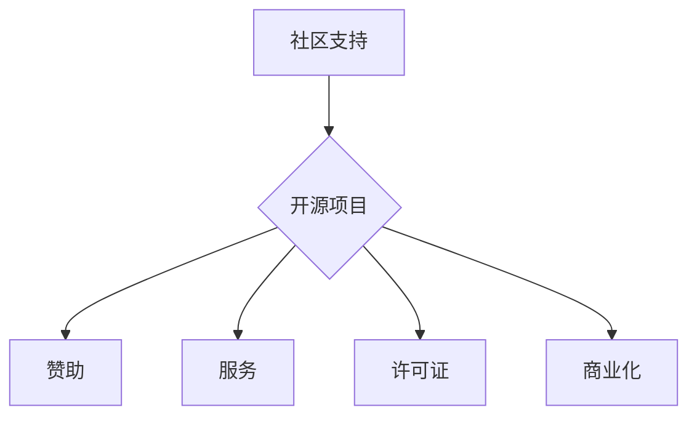

                 

## 开源项目的收入多元化：降低风险的策略

> 关键词：开源项目、收入多元化、风险管理、商业模式、社区支持、赞助、服务、许可证

## 1. 背景介绍

开源软件已经成为现代软件开发不可或缺的一部分，其灵活、透明和协作的特性吸引了越来越多的开发者和用户。然而，开源项目面临着持续的挑战，其中之一就是如何实现可持续发展和财务稳定。传统的依赖捐赠和赞助的模式难以满足开源项目的长期需求，因此探索新的收入来源和多元化商业模式成为开源社区的迫切课题。

开源项目收入多元化是指开源项目通过多种方式获取资金，以支持其开发、维护和运营。这种多元化的商业模式可以帮助开源项目降低风险，提高财务稳定性，并更好地服务于社区和用户。

## 2. 核心概念与联系

开源项目的收入多元化涉及多个核心概念，包括：

* **社区支持:** 开源项目的核心价值在于社区，社区成员的参与和贡献是项目的生命力。社区支持可以包括代码贡献、文档撰写、测试和反馈等。
* **赞助:** 企业或个人可以为开源项目提供资金支持，以换取项目的使用权、定制服务或其他权益。
* **服务:** 开源项目可以提供付费服务，例如技术支持、培训、定制开发和咨询等。
* **许可证:** 开源项目可以使用不同的许可证，例如GPL、MIT和Apache，这些许可证规定了项目的使用、修改和分发规则，并可能包含商业用途的条款。
* **商业化:** 开源项目可以基于其核心技术开发商业产品或服务，例如云服务、SaaS和硬件设备。

这些概念相互关联，共同构成了开源项目的收入多元化策略。

**Mermaid 流程图:**



## 3. 核心算法原理 & 具体操作步骤

开源项目的收入多元化并非一个简单的算法，而是需要综合考虑多种因素的策略制定。

### 3.1  算法原理概述

开源项目的收入多元化策略的核心在于平衡社区利益和商业利益，并找到可持续发展的模式。

* **社区利益:** 开源项目应优先考虑社区成员的利益，例如提供透明的财务信息、鼓励社区参与和贡献，以及尊重社区的决策。
* **商业利益:** 开源项目需要探索多种收入来源，以确保其财务稳定，并能够持续发展。

### 3.2  算法步骤详解

1. **评估项目现状:** 了解项目的技术实力、社区规模、用户需求和市场环境。
2. **确定收入目标:** 明确项目的财务目标，例如每月收入、年度预算或项目生命周期内的总收入。
3. **选择收入来源:** 根据项目的特点和目标，选择合适的收入来源，例如赞助、服务、许可证或商业化。
4. **制定收入策略:** 制定具体的收入计划，包括定价策略、营销策略、销售策略和客户服务策略。
5. **建立财务管理体系:** 建立透明的财务管理体系，确保资金的合理使用和财务报告的公开透明。
6. **持续评估和调整:** 定期评估收入策略的有效性，并根据实际情况进行调整。

### 3.3  算法优缺点

* **优点:** 降低风险、提高财务稳定性、促进项目可持续发展。
* **缺点:** 需要投入更多时间和精力、需要平衡社区利益和商业利益、需要不断调整和优化。

### 3.4  算法应用领域

开源项目的收入多元化策略适用于所有类型的开源项目，包括软件、硬件、数据和工具等。

## 4. 数学模型和公式 & 详细讲解 & 举例说明

开源项目的收入多元化可以抽象为一个数学模型，其中收入是多个收入来源的总和。

$$
R = S + Z + F + L + B
$$

其中：

* $R$ 代表开源项目的总收入。
* $S$ 代表社区支持的收入，例如捐赠和赞助。
* $Z$ 代表赞助的收入。
* $F$ 代表服务的收入。
* $L$ 代表许可证的收入。
* $B$ 代表商业化的收入。

这个模型可以帮助开源项目进行收入预测和分析，并制定相应的策略。

**举例说明:**

假设一个开源项目通过以下方式获取收入：

* 社区支持：$10,000/年
* 赞助：$20,000/年
* 服务：$30,000/年
* 许可证：$5,000/年
* 商业化：$15,000/年

根据公式，该项目的总收入为：

$$
R = 10,000 + 20,000 + 30,000 + 5,000 + 15,000 = 80,000/年
$$

## 5. 项目实践：代码实例和详细解释说明

开源项目的收入多元化需要结合实际项目进行实践和探索。以下是一个简单的代码实例，演示如何使用开源平台进行赞助和捐赠。

**代码语言:** Python

**开源平台:** GitHub

**代码实例:**

```python
# 使用 GitHub API 获取赞助信息
import requests

url = "https://api.github.com/repos/your-username/your-repo/sponsors"
headers = {"Authorization": "token your-github-token"}
response = requests.get(url, headers=headers)

if response.status_code == 200:
    sponsors = response.json()
    for sponsor in sponsors:
        print(f"Sponsor: {sponsor['login']}, Amount: {sponsor['monthly_price']}")
else:
    print(f"Error: {response.status_code}")

# 使用 Stripe API 处理捐赠
# ...
```

**代码解读与分析:**

* 该代码使用 GitHub API 获取开源项目的赞助信息，并打印出赞助者的用户名和每月捐赠金额。
* 为了使用 GitHub API，需要获取一个 GitHub personal access token。
* 该代码还演示了如何使用 Stripe API 处理捐赠，但具体实现需要根据 Stripe 的文档进行配置。

**运行结果展示:**

运行该代码后，将输出当前开源项目的赞助信息。

## 6. 实际应用场景

开源项目的收入多元化在实际应用场景中有很多例子。

* **Linux:** Linux 操作系统是一个典型的开源项目，它通过社区支持、赞助和服务等多种方式获得收入。
* **Apache HTTP Server:** Apache HTTP Server 是世界上最流行的 Web 服务器软件，它也通过赞助和服务等方式获得收入。
* **WordPress:** WordPress 是世界上最流行的博客平台，它通过插件和主题销售、托管服务和培训等方式获得收入。

## 7. 工具和资源推荐

### 7.1  学习资源推荐

* **开源商业化指南:** https://opensource.guide/business/
* **GitHub Sponsors:** https://github.com/sponsors
* **Open Collective:** https://opencollective.com

### 7.2  开发工具推荐

* **Stripe:** https://stripe.com
* **PayPal:** https://www.paypal.com
* **GitLab:** https://about.gitlab.com

### 7.3  相关论文推荐

* **The Economics of Open Source Software:** https://dl.acm.org/doi/10.1145/1048777.1048801
* **Open Source Software Licensing: A Survey:** https://dl.acm.org/doi/10.1145/2939672.2939703

## 8. 总结：未来发展趋势与挑战

开源项目的收入多元化是一个不断发展的领域，未来将出现更多新的商业模式和技术创新。

### 8.1  研究成果总结

开源项目的收入多元化已经取得了一些成果，例如社区支持、赞助和服务等模式已经得到广泛应用。

### 8.2  未来发展趋势

* **更智能化的收入管理系统:** 利用人工智能和机器学习技术，自动分析项目收入和支出，并提供个性化的建议。
* **更灵活的许可证模式:** 探索新的许可证模式，以更好地平衡社区利益和商业利益。
* **更广泛的商业化应用:** 开源项目将更多地应用于商业领域，例如云计算、物联网和人工智能等。

### 8.3  面临的挑战

* **社区参与度:** 确保社区成员积极参与到收入多元化策略中，并维护社区的利益。
* **商业模式创新:** 探索新的商业模式，以满足开源项目的长期发展需求。
* **技术挑战:** 开发更智能化的收入管理系统和更灵活的许可证模式需要克服技术挑战。

### 8.4  研究展望

未来研究将重点关注以下几个方面：

* **开源项目的价值评估:** 如何更好地评估开源项目的价值，并将其转化为收入。
* **社区治理和激励机制:** 如何设计有效的社区治理机制和激励机制，鼓励社区成员参与到收入多元化策略中。
* **开源项目的可持续发展模型:** 如何构建一个可持续发展的开源项目生态系统，确保开源项目的长期发展。

## 9. 附录：常见问题与解答

**常见问题:**

* 如何选择合适的收入来源？
* 如何平衡社区利益和商业利益？
* 如何建立透明的财务管理体系？

**解答:**

* 选择合适的收入来源需要根据项目的特点和目标进行评估。
* 平衡社区利益和商业利益需要制定合理的策略，并确保社区成员的参与和反馈。
* 建立透明的财务管理体系需要公开财务信息，并定期进行财务报告。


作者：禅与计算机程序设计艺术 / Zen and the Art of Computer Programming 
<end_of_turn>

