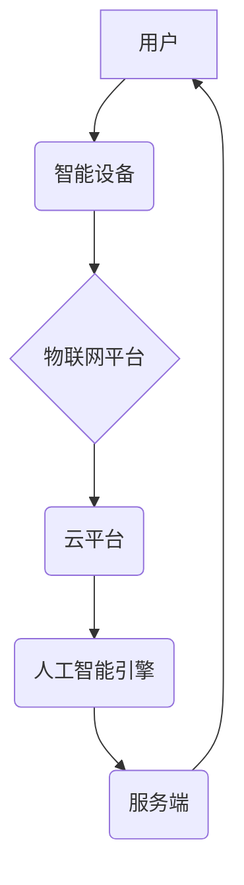

                 

## 智能养老创业：科技助力的老年生活

> 关键词：人工智能、机器学习、深度学习、物联网、云计算、智慧养老、健康监测、远程医疗、生活辅助

## 1. 背景介绍

随着全球人口老龄化进程的加速，老年人数量持续增长，对养老服务的需求日益迫切。传统养老模式面临着资源短缺、服务质量参差不齐等问题，难以满足老年人日益增长的需求。而智能科技的快速发展为智慧养老提供了新的机遇和可能性。

智能养老是指利用人工智能、物联网、云计算等先进技术，为老年人提供个性化、智能化的养老服务，提升老年人的生活质量和健康水平。它涵盖了多个领域，包括健康监测、远程医疗、生活辅助、社会陪伴等。

## 2. 核心概念与联系

**2.1 核心概念**

* **人工智能 (AI):**  指模拟人类智能行为的计算机系统，包括机器学习、深度学习、自然语言处理等技术。
* **机器学习 (ML):**  一种人工智能技术，通过算法学习数据，发现模式并做出预测或决策。
* **深度学习 (DL):**  一种机器学习的子集，利用多层神经网络模拟人类大脑的学习过程，能够处理更复杂的数据和任务。
* **物联网 (IoT):**  指通过传感器、网络和数据分析技术，将物理设备和网络连接起来，实现万物互联。
* **云计算 (Cloud Computing):**  指通过互联网提供计算资源、存储空间和软件服务，实现按需使用和弹性扩展。

**2.2 架构关系**



**2.3 核心联系**

智能养老系统通过将上述核心技术有机结合，实现以下功能：

* **数据采集:** 智能设备（如智能手表、传感器等）收集老年人的健康数据、生活数据等。
* **数据传输:** 物联网平台将数据传输到云平台。
* **数据分析:** 云平台利用人工智能引擎对数据进行分析，识别异常情况、预测健康风险等。
* **智能服务:**  根据分析结果，系统提供个性化的健康建议、生活提醒、远程医疗服务等。

## 3. 核心算法原理 & 具体操作步骤

**3.1 算法原理概述**

智能养老系统中常用的算法包括：

* **机器学习算法:** 用于分析健康数据、生活数据，识别异常情况、预测健康风险等。常见的算法包括决策树、支持向量机、神经网络等。
* **自然语言处理算法:** 用于理解老年人的语音指令、文本信息，提供更人性化的服务。
* **计算机视觉算法:** 用于识别老年人的面部表情、身体动作，判断其情绪状态、生活安全等。

**3.2 算法步骤详解**

以机器学习算法为例，其基本步骤如下：

1. **数据收集:** 收集老年人的健康数据、生活数据等。
2. **数据预处理:** 对数据进行清洗、转换、特征提取等处理，使其适合机器学习算法的训练。
3. **模型选择:** 根据具体任务选择合适的机器学习算法。
4. **模型训练:** 利用训练数据训练机器学习模型，使其能够学习数据中的模式。
5. **模型评估:** 利用测试数据评估模型的性能，并进行调参优化。
6. **模型部署:** 将训练好的模型部署到云平台，提供智能服务。

**3.3 算法优缺点**

* **优点:** 能够自动学习数据，发现隐藏的模式，提供个性化服务。
* **缺点:** 需要大量的数据进行训练，算法的解释性较差，容易受到数据偏差的影响。

**3.4 算法应用领域**

* **健康监测:**  预测老年人的健康风险、识别疾病早期症状。
* **远程医疗:** 提供远程诊断、治疗、康复服务。
* **生活辅助:**  帮助老年人完成日常生活中的各种任务，如提醒服药、控制家电等。
* **社会陪伴:**  通过聊天机器人、虚拟助手等方式，陪伴老年人，缓解孤独感。

## 4. 数学模型和公式 & 详细讲解 & 举例说明

**4.1 数学模型构建**

智能养老系统中，可以使用数学模型来描述老年人的健康状态、生活行为等。例如，可以使用线性回归模型来预测老年人的血压、血糖等指标。

**4.2 公式推导过程**

假设我们想要预测老年人的血压，可以使用以下线性回归模型：

$$
y = \beta_0 + \beta_1 x_1 + \beta_2 x_2 + \epsilon
$$

其中：

* $y$：老年人的血压
* $x_1$：老年人的年龄
* $x_2$：老年人的体重
* $\beta_0$：截距
* $\beta_1$：年龄系数
* $\beta_2$：体重系数
* $\epsilon$：误差项

通过最小二乘法，可以求解出模型参数 $\beta_0$、$\beta_1$ 和 $\beta_2$。

**4.3 案例分析与讲解**

假设我们收集了 100 名老年人的血压、年龄和体重数据，并使用线性回归模型进行训练。训练结果显示，年龄系数为 0.5，体重系数为 0.2。这意味着，老年人的年龄每增加 1 岁，血压平均会增加 0.5 mmHg；老年人的体重每增加 1 kg，血压平均会增加 0.2 mmHg。

## 5. 项目实践：代码实例和详细解释说明

**5.1 开发环境搭建**

* 操作系统：Windows/Linux/macOS
* 编程语言：Python
* 开发工具：PyCharm/VS Code
* 库依赖：TensorFlow/PyTorch、NumPy、Pandas、Scikit-learn

**5.2 源代码详细实现**

```python
import pandas as pd
from sklearn.linear_model import LinearRegression

# 加载数据
data = pd.read_csv('elderly_data.csv')

# 划分训练集和测试集
X = data[['age', 'weight']]
y = data['blood_pressure']
from sklearn.model_selection import train_test_split
X_train, X_test, y_train, y_test = train_test_split(X, y, test_size=0.2, random_state=42)

# 创建线性回归模型
model = LinearRegression()

# 训练模型
model.fit(X_train, y_train)

# 预测测试集数据
y_pred = model.predict(X_test)

# 评估模型性能
from sklearn.metrics import mean_squared_error
mse = mean_squared_error(y_test, y_pred)
print(f'Mean Squared Error: {mse}')
```

**5.3 代码解读与分析**

* 代码首先加载数据，并划分训练集和测试集。
* 然后创建线性回归模型，并使用训练集进行模型训练。
* 训练完成后，使用测试集数据进行模型预测，并计算模型性能指标。

**5.4 运行结果展示**

运行代码后，会输出模型的均方误差 (MSE) 值。MSE 值越小，模型的预测精度越高。

## 6. 实际应用场景

**6.1 健康监测**

* 智能手表可以监测老年人的心率、血压、睡眠质量等数据，并及时提醒医生或家人。
* 智能传感器可以监测老年人的跌倒、异常行为等情况，并自动报警。

**6.2 远程医疗**

* 通过视频通话、远程诊断等技术，为老年人提供远程医疗服务，解决医疗资源短缺的问题。
* 智能语音助手可以帮助老年人预约医生、查询病情等。

**6.3 生活辅助**

* 智能家居设备可以帮助老年人控制家电、调节温度、照明等，提高生活便利性。
* 智能机器人可以帮助老年人完成一些简单的家务活，如扫地、擦桌子等。

**6.4 社会陪伴**

* 聊天机器人、虚拟助手可以陪伴老年人聊天、娱乐，缓解孤独感。
* 社交平台可以帮助老年人与家人朋友保持联系，扩大社交圈。

**6.5 未来应用展望**

* **更精准的健康监测:** 利用人工智能技术，对老年人的健康数据进行更精准的分析，预测疾病风险，提供个性化的健康建议。
* **更智能化的生活辅助:**  开发更智能的机器人、智能家居设备，帮助老年人更好地生活。
* **更丰富的社会陪伴:** 利用虚拟现实、增强现实等技术，为老年人提供更丰富的社会陪伴服务。

## 7. 工具和资源推荐

**7.1 学习资源推荐**

* **在线课程:** Coursera、edX、Udacity 等平台提供人工智能、机器学习等方面的在线课程。
* **书籍:** 《深度学习》、《机器学习实战》等书籍。
* **开源项目:** TensorFlow、PyTorch 等开源项目可以帮助学习者深入了解人工智能技术。

**7.2 开发工具推荐**

* **编程语言:** Python、Java、C++ 等。
* **开发框架:** TensorFlow、PyTorch、Keras 等。
* **云平台:** AWS、Azure、Google Cloud 等。

**7.3 相关论文推荐**

* **ACL:** Association for Computational Linguistics
* **ICML:** International Conference on Machine Learning
* **NeurIPS:** Neural Information Processing Systems

## 8. 总结：未来发展趋势与挑战

**8.1 研究成果总结**

智能养老技术取得了显著的进展，为老年人的健康、生活和社会参与提供了新的机遇。

**8.2 未来发展趋势**

* **更智能化:** 利用更先进的人工智能技术，开发更智能的养老机器人、智能家居设备等。
* **更个性化:**  根据老年人的个人需求和健康状况，提供更个性化的养老服务。
* **更融合:** 将智能养老技术与医疗、社会保障等其他领域融合，构建更完善的养老体系。

**8.3 面临的挑战**

* **数据安全:**  老年人的健康数据非常敏感，需要采取有效的措施保障数据安全。
* **技术可访问性:**  智能养老技术需要易于使用，方便老年人上手。
* **伦理问题:**  人工智能技术在养老领域的应用，需要考虑伦理问题，例如算法偏见、隐私保护等。

**8.4 研究展望**

未来，智能养老技术将继续发展，为老年人提供更优质、更便捷的养老服务。


## 9. 附录：常见问题与解答

* **Q1: 智能养老系统需要哪些硬件设备？**

* **A1:** 智能养老系统需要一些硬件设备，例如智能手表、传感器、智能音箱、智能机器人等。

* **Q2: 智能养老系统如何保障老年人的隐私安全？**

* **A2:** 智能养老系统需要采用严格的数据加密、访问控制等措施，保障老年人的隐私安全。

* **Q3: 智能养老系统是否适合所有老年人？**

* **A3:** 智能养老系统可以为大多数老年人提供帮助，但对于一些身体状况较差、认知能力较弱的老年人，可能需要进行个性化的配置和服务。


作者：禅与计算机程序设计艺术 / Zen and the Art of Computer Programming 
<end_of_turn>

