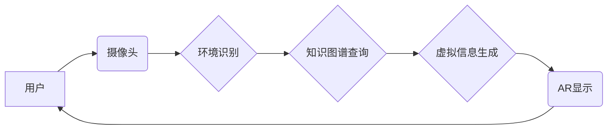

                 

## 知识的增强现实应用：实时信息叠加的学习体验

> 关键词：增强现实 (AR)、信息叠加、学习体验、实时交互、知识图谱、计算机视觉、深度学习

## 1. 背景介绍

随着移动设备和互联网技术的飞速发展，增强现实 (AR) 技术逐渐从科幻小说走向现实生活。AR 技术通过将虚拟信息叠加到现实世界中，为用户提供一种全新的交互体验。在教育领域，AR 技术的应用潜力巨大，它可以打破传统的学习模式，创造更加沉浸式、互动性和直观性的学习体验。

传统的学习方式往往局限于静态的文本、图片和视频，难以激发学生的学习兴趣和主动性。而AR技术可以将抽象的知识概念转化为生动的虚拟场景，让学生身临其境地体验学习内容，从而提高学习效率和理解深度。

## 2. 核心概念与联系

**2.1 增强现实 (AR)**

增强现实 (AR) 是指在现实世界中叠加虚拟信息，以增强用户对现实世界的感知和理解的技术。AR 技术通过摄像头、传感器和计算机视觉算法，识别现实环境中的物体和场景，并根据识别结果，在用户的视野中叠加虚拟图像、文本、音频等信息。

**2.2 信息叠加**

信息叠加是指将虚拟信息实时地叠加到现实世界中，并与现实世界的信息进行融合。信息叠加可以是静态的，也可以是动态的。静态信息叠加是指将虚拟信息固定地叠加到现实世界中，例如在书籍上叠加电子书的链接。动态信息叠加是指根据用户的动作和环境变化，实时地更新虚拟信息，例如在博物馆中，根据用户的移动轨迹，实时地显示相关文物的信息。

**2.3 学习体验**

学习体验是指学生在学习过程中所感受到的各种情感、认知和行为体验。良好的学习体验可以激发学生的学习兴趣、提高学习效率和理解深度。

**2.4 知识图谱**

知识图谱是一种结构化的知识表示形式，它将知识表示为实体和关系的网络结构。知识图谱可以帮助AR系统理解和推理知识，并为用户提供更加智能化的信息叠加体验。

**2.5 核心架构**



**2.6 核心概念联系**

AR技术通过摄像头捕捉现实世界信息，结合计算机视觉算法进行环境识别，并利用知识图谱查询相关知识，最终生成虚拟信息并叠加到现实世界中，为用户提供更加沉浸式的学习体验。

## 3. 核心算法原理 & 具体操作步骤

**3.1 算法原理概述**

AR技术的核心算法包括环境识别、物体跟踪、虚拟信息生成和渲染等。

* **环境识别:** 利用计算机视觉算法，识别现实环境中的物体和场景，例如识别书桌、椅子、墙壁等。
* **物体跟踪:** 跟踪现实世界中物体的运动轨迹，确保虚拟信息与现实物体保持同步。
* **虚拟信息生成:** 根据环境识别结果和知识图谱查询结果，生成虚拟信息，例如生成虚拟书籍、虚拟模型、虚拟动画等。
* **渲染:** 将虚拟信息渲染到用户的视野中，实现虚拟信息与现实世界的叠加。

**3.2 算法步骤详解**

1. **环境采集:** 使用摄像头捕捉现实世界图像。
2. **图像预处理:** 对图像进行预处理，例如灰度化、降噪、边缘检测等，以提高算法的精度。
3. **特征提取:** 从预处理后的图像中提取特征，例如角点、边缘、纹理等。
4. **环境识别:** 利用机器学习算法，识别图像中的物体和场景。
5. **物体跟踪:** 利用运动跟踪算法，跟踪现实世界中物体的运动轨迹。
6. **知识图谱查询:** 根据环境识别结果，查询知识图谱，获取相关知识信息。
7. **虚拟信息生成:** 根据知识图谱查询结果，生成虚拟信息，例如生成虚拟书籍、虚拟模型、虚拟动画等。
8. **虚拟信息渲染:** 将虚拟信息渲染到用户的视野中，实现虚拟信息与现实世界的叠加。

**3.3 算法优缺点**

**优点:**

* 增强现实体验更加沉浸式和互动性。
* 可以将抽象的知识概念转化为生动的虚拟场景，提高学习效率和理解深度。
* 可以为用户提供个性化的学习体验。

**缺点:**

* 算法复杂度高，计算资源需求大。
* 需要大量的训练数据，训练成本高。
* 目前AR技术还处于发展阶段，存在一些技术瓶颈。

**3.4 算法应用领域**

* 教育领域：AR可以用于创造更加沉浸式的学习体验，例如虚拟实验室、虚拟博物馆、虚拟历史场景等。
* 游戏领域：AR可以增强游戏体验，例如将游戏场景叠加到现实世界中，让玩家身临其境地体验游戏。
* 商业领域：AR可以用于产品展示、虚拟试衣、虚拟家居装修等。

## 4. 数学模型和公式 & 详细讲解 & 举例说明

**4.1 数学模型构建**

AR系统中的信息叠加可以看作是一个三维空间坐标变换的过程。

假设现实世界中的物体坐标为 (x, y, z)，虚拟信息坐标为 (x', y', z')，则可以通过以下公式进行坐标变换：

$$
\begin{bmatrix}
x' \\
y' \\
z'
\end{bmatrix} = \begin{bmatrix}
R_{11} & R_{12} & R_{13} \\
R_{21} & R_{22} & R_{23} \\
R_{31} & R_{32} & R_{33}
\end{bmatrix}
\begin{bmatrix}
x \\
y \\
z
\end{bmatrix} + \begin{bmatrix}
t_x \\
t_y \\
t_z
\end{bmatrix}
$$

其中：

* R 是旋转矩阵，用于旋转虚拟信息。
* t 是平移向量，用于平移虚拟信息。

**4.2 公式推导过程**

旋转矩阵和平移向量可以通过以下方法获得：

* **旋转矩阵:** 利用欧拉角或四元数表示旋转角度和方向，然后根据旋转矩阵公式计算旋转矩阵。
* **平移向量:** 根据用户的手势或其他输入信息，计算虚拟信息的平移向量。

**4.3 案例分析与讲解**

例如，在AR游戏中，玩家可以通过移动手机摄像头，观察虚拟角色在现实世界中的位置和移动轨迹。

在这个场景中，AR系统需要实时地跟踪玩家手机的运动轨迹，并根据跟踪结果，更新虚拟角色的坐标。

通过公式推导和计算，AR系统可以将虚拟角色的坐标与现实世界中的坐标进行映射，实现虚拟角色在现实世界中的叠加。

## 5. 项目实践：代码实例和详细解释说明

**5.1 开发环境搭建**

AR开发环境搭建需要以下软件和硬件：

* **移动设备:** 支持AR技术的手机或平板电脑。
* **AR开发框架:** 例如ARKit (iOS)、ARCore (Android)。
* **编程语言:** 例如Swift (iOS)、Java/Kotlin (Android)。
* **计算机视觉库:** 例如OpenCV。

**5.2 源代码详细实现**

以下是一个简单的AR信息叠加的代码示例，使用ARKit框架开发，在iOS平台上实现：

```swift
import UIKit
import ARKit

class ViewController: UIViewController, ARSCNViewDelegate {

    @IBOutlet var sceneView: ARSCNView!

    override func viewDidLoad() {
        super.viewDidLoad()

        // Set the view's delegate
        sceneView.delegate = self

        // Show statistics such as fps and timing information
        sceneView.showsStatistics = true

        // Create a new scene
        let scene = SCNScene()

        // Set the scene to the view
        sceneView.scene = scene
    }

    func renderer(_ renderer: SCNSceneRenderer, didAdd node: SCNNode, for anchor: ARAnchor) {
        guard let imageAnchor = anchor as? ARImageAnchor else { return }

        // Create a new node for the virtual object
        let node = SCNNode()

        // Set the virtual object's geometry
        let geometry = SCNBox(width: 0.1, height: 0.1, length: 0.1, chamferRadius: 0.01)
        node.geometry = geometry

        // Set the virtual object's position
        node.position = SCNVector3(x: imageAnchor.referenceImage.physicalSize.width / 2, y: 0, z: 0)

        // Add the node to the scene
        node.name = "virtualObject"
        sceneView.scene.rootNode.addChildNode(node)
    }
}
```

**5.3 代码解读与分析**

这段代码实现了ARKit框架的基本功能，通过识别图像锚点，将虚拟物体叠加到现实世界中。

* `renderer(_:didAdd:for:)` 方法是ARSCNViewDelegate协议中的方法，当AR场景中添加新的节点时，会调用该方法。
* `ARImageAnchor` 是ARKit框架中用于识别图像的锚点类型。
* `SCNBox` 是SCNGeometry类型，用于创建立方体几何体。
* `SCNVector3` 是SCNVector类型，用于表示三维空间中的坐标。

**5.4 运行结果展示**

运行这段代码后，用户可以通过手机摄像头识别预先定义的图像，并在识别到的图像位置叠加虚拟立方体。

## 6. 实际应用场景

**6.1 教育领域**

* **虚拟实验室:** 学生可以通过AR技术，在虚拟实验室中进行实验操作，例如模拟化学反应、生物细胞结构等。
* **虚拟博物馆:** 学生可以通过AR技术，参观虚拟博物馆，并与虚拟文物互动，例如查看文物内部结构、了解文物历史等。
* **虚拟历史场景:** 学生可以通过AR技术，体验历史场景，例如参观古罗马斗兽场、体验古代埃及文明等。

**6.2 游戏领域**

* **增强现实游戏:** 例如Pokemon GO，玩家可以通过手机摄像头，在现实世界中捕捉虚拟宠物。
* **虚拟试衣:** 玩家可以通过AR技术，在虚拟试衣间中试穿虚拟服装，并查看不同服装的效果。

**6.3 商业领域**

* **产品展示:** 商家可以通过AR技术，展示虚拟产品，例如虚拟家具、虚拟汽车等。
* **虚拟家居装修:** 用户可以通过AR技术，在现实家中虚拟装修，并查看不同装修效果。

**6.4 未来应用展望**

随着AR技术的不断发展，其应用场景将会更加广泛，例如：

* **远程医疗:** 医生可以通过AR技术，远程指导患者进行手术操作。
* **远程教育:** 教师可以通过AR技术，为学生提供更加沉浸式的远程教学体验。
* **工业维修:** 工人可以通过AR技术，在现实世界中查看虚拟维修指南，并进行远程维修操作。

## 7. 工具和资源推荐

**7.1 学习资源推荐**

* **ARKit官方文档:** https://developer.apple.com/documentation/arkit
* **ARCore官方文档:** https://developers.google.com/ar/develop/
* **Unity AR Foundation:** https://docs.unity3d.com/Packages/com.unity.xr.arfoundation@latest/manual/index.html

**7.2 开发工具推荐**

* **Xcode:** iOS开发工具
* **Android Studio:** Android开发工具
* **Unity:** 游戏引擎，支持AR开发

**7.3 相关论文推荐**

* **A Survey of Augmented Reality (AR) Technologies:** https://ieeexplore.ieee.org/document/8808247
* **Augmented Reality: A Survey:** https://www.researchgate.net/publication/329845750_Augmented_Reality_A_Survey

## 8. 总结：未来发展趋势与挑战

**8.1 研究成果总结**

AR技术近年来取得了显著进展，从早期简单的图像叠加，发展到如今能够实现更加逼真的虚拟场景和交互体验。

**8.2 未来发展趋势**

* **更逼真的虚拟场景:** 利用更先进的计算机视觉算法和渲染技术，创造更加逼真的虚拟场景。
* **更智能化的交互体验:** 利用人工智能技术，实现更加智能化的交互体验，例如语音控制、手势识别等。
* **更广泛的应用场景:** AR技术将应用于更多领域，例如医疗、教育、工业等。

**8.3 面临的挑战**

* **计算资源需求:** AR技术计算资源需求大，需要更高效的算法和硬件支持。
* **用户体验:** AR体验需要更加舒适和自然，需要解决眩晕、疲劳等问题。
* **隐私安全:** AR技术收集用户大量数据，需要保障用户隐私安全。

**8.4 研究展望**

未来AR技术的发展将更加注重用户体验、隐私安全和应用场景的拓展，并与其他新兴技术，例如人工智能、云计算、5G等融合发展，创造更加智能、便捷、丰富的数字体验。

## 9. 附录：常见问题与解答

**9.1 Q: AR技术和VR技术有什么区别？**

**A:** AR技术将虚拟信息叠加到现实世界中，而VR技术则创造一个完全虚拟的沉浸式环境。

**9.2 Q: AR技术有哪些应用场景？**

**A:** AR技术应用场景广泛，例如教育、游戏、商业、医疗等。

**9.3 Q: 如何学习AR技术？**

**A:** 可以学习ARKit、ARCore等官方文档，使用Unity等游戏引擎进行开发，并阅读相关论文和书籍。


作者：禅与计算机程序设计艺术 / Zen and the Art of Computer Programming<end_of_turn>

