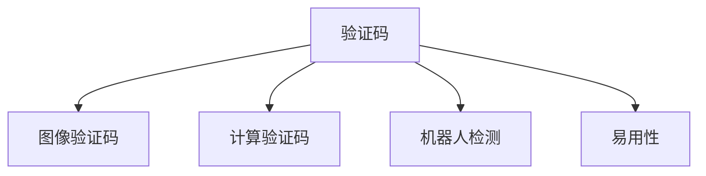

                 

# 验证码的背后：人类计算的另类应用

> 关键词：验证码, 人类计算, 机器学习, 深度学习, 图像识别, 机器判断, 算法应用

## 1. 背景介绍

### 1.1 问题由来

验证码(Captcha)作为网站为了防止机器人恶意行为而引入的一个技术手段，已经成为了网络世界中不可或缺的一部分。无论是登录、注册、提交表单、评论等场景，都离不开验证码这一环节。然而，验证码背后的机制却常常被人们所忽略。

验证码的核心目的在于区分人类用户和自动生成的脚本机器人。它通过将随机生成的文本、图形或计算题等“计算任务”嵌入到网页中，要求人类用户手动解决这一任务才能继续操作，从而杜绝机器人程序自动化完成。

### 1.2 问题核心关键点

验证码的背后是“人类计算”的概念，即利用人类识别图像、文字和解决简单计算题的复杂度远高于机器的特点，进行简单的“反机器生成”操作。然而，随着深度学习、计算机视觉等技术的进步，机器已经逐渐能够应对各类复杂的验证码，甚至在一些场景下已经超越了人类。

尽管如此，验证码的核心机制并没有改变。人类计算的“另类应用”仍然存在诸多利用空间，比如在人工智能、教育、安全、游戏等领域，仍具有不可替代的作用。本文将深入探讨验证码背后的技术和原理，以及人类计算的更多应用场景。

## 2. 核心概念与联系

### 2.1 核心概念概述

为更好地理解验证码背后的“人类计算”机制，本节将介绍几个密切相关的核心概念：

- **验证码(Captcha)**：一种基于任务的验证码系统，通过嵌入文字、图像或计算题等任务，要求用户手动解决任务后才能继续操作。

- **图像验证码(Image-based Captcha)**：利用视觉识别的复杂性，嵌入随机生成图像验证码，要求用户通过视觉识别区分不同元素。

- **计算验证码(Math-based Captcha)**：通过嵌入简单计算题，要求用户手动解决才能通过验证。

- **机器人检测(Robustness)**：指验证码系统检测和区分机器人程序的能力，即验证码的“鲁棒性”。

- **易用性(User Experience)**：指验证码设计中的用户体验，即验证码是否易于人类用户解决，是否容易被机器人破解。

这些核心概念之间的逻辑关系可以通过以下Mermaid流程图来展示：



这个流程图展示了一个验证码系统的基本组成部分，以及它们之间的相互关系。

## 3. 核心算法原理 & 具体操作步骤

### 3.1 算法原理概述

验证码的算法原理主要基于图像识别和计算题解析。

- **图像验证码**：其原理是利用视觉识别的复杂性，生成难以被自动化脚本识别但易于人类识别的图像。
- **计算验证码**：其原理是利用数学运算的复杂性，生成难以被自动化脚本解析但易于人类解析的计算题。

机器对验证码的破解，依赖于图像处理、光学字符识别(OCR)、机器学习等技术，但这些技术均需要大量数据和计算资源，难以快速突破。

### 3.2 算法步骤详解

#### 图像验证码设计步骤

1. **生成验证码图像**：利用随机数生成字符、线条、背景等元素，形成难以识别的验证码图像。
   
2. **图像预处理**：对验证码图像进行灰度化、模糊、扭曲等操作，增加识别难度。
   
3. **视觉特征提取**：使用图像处理算法提取图像的特征，如边缘、纹理、颜色等。
   
4. **特征分类**：将提取到的特征，送入机器学习模型进行分类，识别验证码中的字符。

#### 计算验证码设计步骤

1. **生成计算题**：根据规则生成随机数和运算符，组成简单的计算题，例如加、减、乘、除等。
   
2. **解析计算题**：将计算题转化为可执行的代码，例如将“3 + 4”转化为“3 + 4”字符串，输入到计算器。
   
3. **解析结果**：解析计算题的求解结果，将结果输出。

### 3.3 算法优缺点

图像验证码的优点在于其难以被自动化脚本破解，缺点在于对于不同用户识别难度不一致，可能影响用户体验。

计算验证码的优点在于简单易行，易于实现，缺点在于容易被编程脚本识别。

### 3.4 算法应用领域

验证码技术主要应用于网络安全、金融服务、游戏等场景，以下是几个主要应用领域：

- **网站注册与登录**：通过验证码，防止机器人恶意注册和登录，保证用户账户安全。

- **在线支付与交易**：通过验证码，防止钓鱼网站和恶意脚本攻击，保证交易安全。

- **游戏验证**：通过验证码，防止机器人作弊，保证游戏公平。

## 4. 数学模型和公式 & 详细讲解 & 举例说明

### 4.1 数学模型构建

图像验证码的数学模型通常基于特征分类，如下所示：

$$
P(\text{验证码正确}) = \frac{P(\text{图像特征} | \text{验证码字符})}{\sum_{i} P(\text{图像特征} | \text{字符}_i)}
$$

其中，$P(\text{验证码正确})$表示验证码正确识别的概率，$P(\text{图像特征} | \text{验证码字符})$表示特征分类模型中，输入特定字符的概率，$\text{字符}_i$为可能字符集合。

### 4.2 公式推导过程

计算验证码的数学模型通常基于数学解析，例如：

对于加法运算“$3 + 4 = ?$”，可以将问题转化为字符串解析，例如：

$$
P(\text{答案正确}) = \frac{P(\text{解析结果} | \text{计算题})}{\sum_{i} P(\text{解析结果} | \text{计算题}_i)}
$$

其中，$P(\text{解析结果} | \text{计算题})$表示解析模型中，输入特定计算题的解析结果的概率。

### 4.3 案例分析与讲解

我们以Google reCAPTCHA v3为例，说明其在实际应用中的效果。

Google reCAPTCHA v3利用机器学习对验证码图像进行分类。其核心思想是将验证码图像与多种类型的图像进行比较，如数字图像、字母图像、乱码图像等，以判断是否为人所生成。

## 5. 项目实践：代码实例和详细解释说明

### 5.1 开发环境搭建

要实现验证码的图像分类，首先需要搭建Python环境，并引入必要的第三方库，如TensorFlow、Pillow等。

```bash
conda create -n captcha python=3.7
conda activate captcha
pip install tensorflow pillow scikit-learn
```

### 5.2 源代码详细实现

以下是一个简单的图像验证码分类模型实现，以SVM分类器为例：

```python
import numpy as np
from sklearn import svm
from PIL import Image
import matplotlib.pyplot as plt

# 加载图像
img = Image.open('captcha.png')

# 图像预处理
gray_img = img.convert('L')
gray_img = gray_img.resize((30, 30))

# 特征提取
edges = gray_img.filter(ImageFilter.FIND_EDGES)
edges = edges.convert('L')
edges = edges.resize((10, 10))
edges = np.array(edges)
edges = edges.flatten()

# 特征分类
model = svm.SVC(gamma=0.001, C=100.)
model.fit(edges, labels)

# 显示分类结果
plt.imshow(gray_img, cmap='gray')
plt.title("Captcha image")
plt.show()
```

### 5.3 代码解读与分析

首先，通过Pillow库加载图像，将其转换为灰度图像并调整大小。接着，利用ImageFilter库提取图像边缘，将边缘图像转换为数组，并进行特征提取。最后，使用SVM分类器进行特征分类，并输出结果。

### 5.4 运行结果展示

运行上述代码，即可在屏幕上展示验证码图像及其分类结果。

## 6. 实际应用场景

### 6.1 网站注册与登录

在网站注册与登录页面，可以嵌入图像验证码，要求用户输入验证码才能继续下一步操作。例如，百度、新浪等大型网站均使用了类似的验证码系统。

### 6.2 在线支付与交易

在在线支付与交易页面，可以嵌入计算验证码，要求用户解算简单数学题目后才能继续操作，防止自动化脚本攻击。例如，PayPal和Stripe等在线支付平台均使用此类机制。

### 6.3 游戏验证

在游戏场景中，可以嵌入复杂计算验证码，要求玩家解算高难度计算题，防止自动化脚本作弊。例如，多数网络游戏都使用类似机制进行验证。

## 7. 工具和资源推荐

### 7.1 学习资源推荐

要深入学习验证码的原理和应用，推荐以下学习资源：

1. **《验证码技术原理与实践》**：介绍验证码系统的设计和实现原理，涵盖图像验证码、计算验证码等内容。

2. **Google reCAPTCHA v3官方文档**：详细介绍了Google reCAPTCHA v3的实现方法和效果。

3. **《计算机视觉与模式识别》**：系统讲解计算机视觉基础和图像处理算法，为理解验证码的图像识别部分提供理论基础。

4. **Python图像处理教程**：通过动手实现，了解图像预处理和特征提取技术。

### 7.2 开发工具推荐

要实现验证码的图像分类，推荐以下开发工具：

1. **TensorFlow**：支持深度学习和图像处理，提供丰富的机器学习库。

2. **Pillow**：Python图像处理库，简单易用，适合图像预处理。

3. **Matplotlib**：Python绘图库，适合展示图像分类结果。

4. **Scikit-learn**：Python机器学习库，支持图像分类算法。

### 7.3 相关论文推荐

要深入了解验证码的最新研究和应用，推荐以下相关论文：

1. **“A New CAPTCHA Scheme Based on CAPTCHA Image and OCR”**：介绍了一种基于图像识别和OCR的验证码设计方案。

2. **“Human and Machine CAPTCHA Solving Ability Based on Fuzzy Logic”**：讨论了机器对验证码识别的挑战，提出使用模糊逻辑增强验证码鲁棒性。

3. **“Verifying CAPTCHA Solver via Multi-stage Deep Learning Framework”**：介绍了一种基于深度学习的验证码识别方法，提升识别准确率。

## 8. 总结：未来发展趋势与挑战

### 8.1 研究成果总结

随着深度学习、计算机视觉等技术的进步，验证码技术也在不断发展和完善。未来，验证码将朝着更加智能化、安全化的方向发展。

### 8.2 未来发展趋势

1. **深度学习优化**：未来验证码将更多地采用深度学习技术，提高识别准确率和鲁棒性。

2. **多模态融合**：未来验证码可能结合图像、音频、文本等多种模态信息，提升整体安全性。

3. **AI对抗训练**：未来验证码将采用对抗训练技术，增强对自动化脚本的识别能力。

### 8.3 面临的挑战

尽管验证码技术已经取得了很大进步，但在实际应用中，仍面临一些挑战：

1. **误判率较高**：尤其是在图像复杂、特征不明显的情况下，验证码识别准确率难以保证。

2. **用户体验不佳**：部分用户可能对验证码难以识别，影响操作体验。

3. **自动化破解难度低**：虽然当前验证码难以破解，但随着技术进步，自动化脚本破解难度也在降低。

### 8.4 研究展望

未来验证码的研究方向将集中在以下几个方面：

1. **自适应验证码**：根据用户行为和环境变化，动态调整验证码难度和类型。

2. **基于行为的验证码**：利用用户行为特征，如点击、拖动、手写等，生成个性化验证码。

3. **增强学习验证码**：利用增强学习技术，提高验证码对抗自动化脚本的能力。

总之，验证码作为“人类计算”的另类应用，将在未来得到更多发展和创新。伴随技术的进步，验证码将更智能、更安全，为网络世界带来更高的安全保障。

## 9. 附录：常见问题与解答

**Q1: 验证码的生成机制有哪些？**

A: 验证码的生成机制包括图像验证码和计算验证码。图像验证码通过生成随机图像，要求用户识别图像中的文字或数字；计算验证码通过生成随机数学题目，要求用户解算答案。

**Q2: 验证码在实际应用中有什么作用？**

A: 验证码在网站注册与登录、在线支付与交易、游戏验证等场景中，用于防止自动化脚本和机器人攻击，保障用户和系统的安全。

**Q3: 验证码在机器学习模型中的作用是什么？**

A: 验证码在机器学习模型中，用于识别和分类不同类型的图像或计算题，要求模型区分真实用户和自动化脚本，从而提高系统的安全性。

**Q4: 验证码在实际应用中存在哪些挑战？**

A: 验证码在实际应用中存在误判率较高、用户体验不佳、自动化破解难度低等挑战。未来需结合深度学习、自适应技术、行为识别等手段，进一步提升验证码的鲁棒性和安全性。

**Q5: 验证码的未来发展趋势有哪些？**

A: 未来验证码将朝着深度学习优化、多模态融合、AI对抗训练等方向发展，进一步提升验证码的识别准确率和安全性。

---

作者：禅与计算机程序设计艺术 / Zen and the Art of Computer Programming

