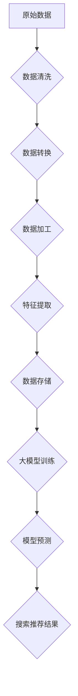

                 

## AI 大模型在电商搜索推荐中的数据处理技术：应对大规模复杂数据

> 关键词：电商搜索推荐、大模型、数据处理、自然语言处理、推荐系统、深度学习、Transformer

## 1. 背景介绍

随着电商行业的蓬勃发展，用户对商品搜索和推荐的需求日益增长。传统的基于关键词匹配的搜索推荐系统难以满足用户个性化、多样化的需求。近年来，大模型技术在自然语言处理（NLP）领域取得了突破性进展，为电商搜索推荐提供了新的机遇。

大模型，是指参数量巨大、训练数据海量的人工智能模型。它们能够学习到复杂的语义关系和用户偏好，从而实现更精准、更智能的搜索推荐。例如，GPT-3、BERT、LaMDA等大模型在文本生成、理解和对话方面展现出强大的能力，为电商搜索推荐提供了新的技术支撑。

## 2. 核心概念与联系

### 2.1  电商搜索推荐系统

电商搜索推荐系统旨在帮助用户快速找到所需商品，并提供个性化的商品推荐。它通常由以下几个模块组成：

* **搜索引擎模块:** 处理用户搜索词，并返回相关商品结果。
* **推荐引擎模块:** 基于用户历史行为、商品特征等信息，推荐用户可能感兴趣的商品。
* **个性化引擎模块:** 根据用户画像、偏好等信息，对搜索结果和推荐结果进行个性化排序和展示。

### 2.2  大模型在电商搜索推荐中的应用

大模型可以应用于电商搜索推荐系统的各个模块，提升系统的性能和用户体验。

* **搜索引擎模块:** 使用大模型进行语义理解和关键词扩展，提高搜索结果的准确性和相关性。
* **推荐引擎模块:** 使用大模型学习用户偏好和商品关系，提供更精准、更个性化的商品推荐。
* **个性化引擎模块:** 使用大模型分析用户行为和兴趣，对搜索结果和推荐结果进行更精准的个性化排序和展示。

### 2.3  数据处理技术

大模型的训练和应用都需要海量数据作为支撑。电商搜索推荐系统的数据通常包含用户行为数据、商品信息数据、文本数据等。

数据处理技术在电商搜索推荐系统中扮演着至关重要的角色，它负责将原始数据清洗、转换、加工成大模型能够理解和利用的格式。

**数据处理流程:**



## 3. 核心算法原理 & 具体操作步骤

### 3.1  算法原理概述

大模型在电商搜索推荐中的应用主要基于深度学习算法，其中Transformer模型由于其强大的序列建模能力，在自然语言处理领域取得了显著的成果，并被广泛应用于电商搜索推荐系统。

Transformer模型的核心是**注意力机制**，它能够学习到文本中不同词语之间的关系，从而更好地理解文本的语义。

### 3.2  算法步骤详解

1. **数据预处理:** 将原始数据清洗、转换、编码成数字格式，以便大模型能够理解。
2. **模型训练:** 使用训练数据训练Transformer模型，学习到用户偏好、商品关系等知识。
3. **模型评估:** 使用测试数据评估模型的性能，并进行调参优化。
4. **模型部署:** 将训练好的模型部署到生产环境中，用于实时搜索推荐。

### 3.3  算法优缺点

**优点:**

* **强大的语义理解能力:** Transformer模型能够学习到文本中复杂的语义关系，提升搜索结果的准确性和相关性。
* **个性化推荐:** 通过学习用户历史行为和偏好，提供更精准、更个性化的商品推荐。
* **可扩展性强:** Transformer模型可以根据数据规模进行扩展，适应大规模电商平台的需求。

**缺点:**

* **训练成本高:** Transformer模型参数量巨大，训练需要大量的计算资源和时间。
* **数据依赖性强:** 模型性能依赖于训练数据的质量和数量。
* **解释性差:** Transformer模型的内部机制复杂，难以解释模型的决策过程。

### 3.4  算法应用领域

Transformer模型在电商搜索推荐领域之外，还广泛应用于其他领域，例如：

* **机器翻译:** 将一种语言翻译成另一种语言。
* **文本摘要:** 将长文本压缩成短文本。
* **对话系统:** 与用户进行自然语言对话。

## 4. 数学模型和公式 & 详细讲解 & 举例说明

### 4.1  数学模型构建

Transformer模型的核心是**注意力机制**，它通过计算词语之间的相关性，赋予每个词语不同的权重，从而更好地理解文本的语义。

注意力机制的数学模型可以表示为：

$$
Attention(Q, K, V) = softmax(\frac{QK^T}{\sqrt{d_k}})V
$$

其中：

* $Q$：查询矩阵
* $K$：键矩阵
* $V$：值矩阵
* $d_k$：键向量的维度
* $softmax$：softmax函数

### 4.2  公式推导过程

注意力机制的公式推导过程可以分为以下几个步骤：

1. 计算查询矩阵 $Q$ 和键矩阵 $K$ 的点积，并进行归一化。
2. 应用softmax函数将点积结果转换为概率分布。
3. 将概率分布与值矩阵 $V$ 进行加权求和，得到最终的注意力输出。

### 4.3  案例分析与讲解

假设我们有一个句子 "The cat sat on the mat"，我们想要计算 "cat" 和 "mat" 之间的注意力权重。

1. 将句子中的每个词语转换为向量表示，作为 $Q$、$K$ 和 $V$ 的输入。
2. 计算 "cat" 和 "mat" 之间的点积，并进行归一化。
3. 应用softmax函数将点积结果转换为概率分布，其中 "cat" 和 "mat" 的权重较高。
4. 将概率分布与值矩阵 $V$ 进行加权求和，得到 "cat" 和 "mat" 之间的注意力输出。

## 5. 项目实践：代码实例和详细解释说明

### 5.1  开发环境搭建

* Python 3.7+
* TensorFlow 2.0+
* PyTorch 1.0+
* CUDA 10.0+

### 5.2  源代码详细实现

```python
import tensorflow as tf

# 定义Transformer模型
class Transformer(tf.keras.Model):
    def __init__(self, vocab_size, embedding_dim, num_heads, num_layers):
        super(Transformer, self).__init__()
        self.embedding = tf.keras.layers.Embedding(vocab_size, embedding_dim)
        self.transformer_layers = tf.keras.layers.StackedRNNCells([
            tf.keras.layers.MultiHeadAttention(num_heads=num_heads, key_dim=embedding_dim)
            for _ in range(num_layers)
        ])
        self.dense = tf.keras.layers.Dense(vocab_size)

    def call(self, inputs):
        x = self.embedding(inputs)
        x = self.transformer_layers(x)
        x = self.dense(x)
        return x

# 训练模型
model = Transformer(vocab_size=10000, embedding_dim=128, num_heads=8, num_layers=6)
model.compile(optimizer='adam', loss='sparse_categorical_crossentropy', metrics=['accuracy'])
model.fit(train_data, train_labels, epochs=10)

```

### 5.3  代码解读与分析

* **模型定义:** 代码定义了一个Transformer模型，包含嵌入层、多头注意力层和全连接层。
* **数据预处理:** 需要将文本数据转换为数字格式，以便模型能够理解。
* **模型训练:** 使用训练数据训练模型，并使用交叉熵损失函数和Adam优化器。
* **模型评估:** 使用测试数据评估模型的性能，并进行调参优化。

### 5.4  运行结果展示

训练完成后，可以使用测试数据评估模型的性能，例如计算准确率、召回率等指标。

## 6. 实际应用场景

### 6.1  商品搜索推荐

大模型可以根据用户搜索词和历史行为，推荐相关商品，提升用户购物体验。

### 6.2  个性化商品推荐

大模型可以学习到用户的兴趣偏好，推荐个性化的商品，提高用户转化率。

### 6.3  商品分类和标签

大模型可以学习商品的特征，自动进行商品分类和标签，提高商品管理效率。

### 6.4  未来应用展望

* **多模态搜索推荐:** 将文本、图像、视频等多模态数据融合，提供更丰富的搜索推荐体验。
* **实时个性化推荐:** 基于用户实时行为，提供更精准、更动态的个性化推荐。
* **智能客服:** 使用大模型构建智能客服系统，自动回答用户问题，提升客户服务效率。

## 7. 工具和资源推荐

### 7.1  学习资源推荐

* **书籍:**
    * 《深度学习》
    * 《自然语言处理》
    * 《Transformer模型详解》
* **在线课程:**
    * Coursera: 深度学习
    * Udacity: 自然语言处理
    * fast.ai: 深度学习

### 7.2  开发工具推荐

* **TensorFlow:** 开源深度学习框架
* **PyTorch:** 开源深度学习框架
* **HuggingFace:** 提供预训练模型和工具

### 7.3  相关论文推荐

* **Attention Is All You Need:** https://arxiv.org/abs/1706.03762
* **BERT: Pre-training of Deep Bidirectional Transformers for Language Understanding:** https://arxiv.org/abs/1810.04805
* **GPT-3: Language Models are Few-Shot Learners:** https://arxiv.org/abs/2005.14165

## 8. 总结：未来发展趋势与挑战

### 8.1  研究成果总结

大模型在电商搜索推荐领域取得了显著的成果，提升了搜索结果的准确性和相关性，并提供了更精准、更个性化的商品推荐。

### 8.2  未来发展趋势

* **模型规模和能力的提升:** 未来大模型的规模和能力将继续提升，能够学习到更复杂的知识和关系。
* **多模态搜索推荐:** 将文本、图像、视频等多模态数据融合，提供更丰富的搜索推荐体验。
* **实时个性化推荐:** 基于用户实时行为，提供更精准、更动态的个性化推荐。

### 8.3  面临的挑战

* **数据安全和隐私保护:** 大模型的训练需要海量数据，如何保证数据安全和隐私保护是一个重要挑战。
* **模型解释性和可控性:** 大模型的内部机制复杂，难以解释模型的决策过程，如何提高模型的解释性和可控性是一个重要的研究方向。
* **计算资源和成本:** 大模型的训练和部署需要大量的计算资源和时间，如何降低计算资源和成本是一个重要的技术挑战。

### 8.4  研究展望

未来，大模型在电商搜索推荐领域将继续发挥重要作用，并推动电商行业的发展。

## 9. 附录：常见问题与解答

* **Q: 如何选择合适的 Transformer 模型？**
    * **A:** 选择 Transformer 模型需要考虑模型规模、参数量、训练数据量等因素。
* **Q: 如何评估 Transformer 模型的性能？**
    * **A:** 可以使用准确率、召回率、F1-score等指标评估 Transformer 模型的性能。
* **Q: 如何解决 Transformer 模型的过拟合问题？**
    * **A:** 可以使用正则化、Dropout、数据增强等技术来解决 Transformer 模型的过拟合问题。


作者：禅与计算机程序设计艺术 / Zen and the Art of Computer Programming 
<end_of_turn>

