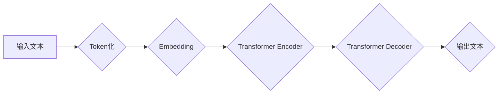

                 

## AI产业新格局：LLM重塑技术生态

> 关键词：LLM、大语言模型、人工智能、自然语言处理、深度学习、Transformer、产业变革、技术生态

### 1. 背景介绍

近年来，人工智能（AI）技术突飞猛进，特别是深度学习的兴起，为自然语言处理（NLP）领域带来了革命性的变革。其中，大语言模型（LLM）作为NLP领域最具代表性的技术之一，凭借其强大的文本生成、理解和翻译能力，正在深刻地重塑着技术生态，并对各个行业产生深远影响。

LLM的出现，标志着AI技术从单纯的规则式处理向更智能、更接近人类认知的模式转变。它们能够学习和理解大量的文本数据，并根据学习到的知识生成流畅、连贯的文本，完成各种复杂的任务，例如：

* **文本生成:** 写作小说、诗歌、剧本、新闻报道等；
* **文本理解:** 回答问题、总结文本、分析情感、进行文本分类等；
* **文本翻译:** 将文本从一种语言翻译成另一种语言；
* **对话系统:** 与人类进行自然流畅的对话，例如聊天机器人、虚拟助手等。

LLM的强大能力使其在各个领域都展现出巨大的应用潜力，例如：

* **教育:** 智能辅导系统、个性化学习平台；
* **医疗:** 辅助诊断、病历摘要、药物研发；
* **金融:** 风险评估、欺诈检测、客户服务；
* **娱乐:** 内容创作、游戏开发；
* **科研:** 数据分析、文献综述、论文写作。

### 2. 核心概念与联系

LLM的核心概念是**深度学习**和**Transformer**架构。

**2.1 深度学习**

深度学习是一种机器学习的子领域，它利用多层神经网络来模拟人类大脑的学习过程。通过训练大量的样本数据，深度学习模型能够自动学习特征和模式，并进行预测或分类。

**2.2 Transformer架构**

Transformer是一种专门用于处理序列数据的深度学习架构，它引入了**自注意力机制**，能够捕捉文本中单词之间的长距离依赖关系，从而实现更准确的文本理解和生成。

**2.3 LLM的架构**

LLM通常由多个Transformer层组成，每个层包含多个子层，例如**多头自注意力层**、**前馈神经网络层**等。通过堆叠多个Transformer层，LLM能够学习到更深层次的文本语义和结构。

**Mermaid 流程图**

### 3. 核心算法原理 & 具体操作步骤

**3.1 算法原理概述**

LLM的核心算法是基于Transformer架构的**自回归语言模型**。自回归模型是指预测下一个单词时，只依赖于之前已经生成的单词序列。LLM通过训练大量的文本数据，学习到每个单词在特定语境下出现的概率分布，从而能够生成流畅、连贯的文本。

**3.2 算法步骤详解**

1. **数据预处理:** 将原始文本数据进行清洗、分词、标记等预处理操作，使其能够被模型理解和处理。
2. **词嵌入:** 将每个单词映射到一个低维向量空间中，称为词嵌入。词嵌入能够捕捉单词之间的语义关系。
3. **Transformer编码器:** 将输入文本序列编码成一个隐藏状态向量，该向量包含了文本序列的语义信息。
4. **Transformer解码器:** 根据编码后的隐藏状态向量，预测下一个单词的概率分布。
5. **输出生成:** 根据预测的概率分布，选择最可能的单词作为输出，并将其添加到生成的文本序列中。重复步骤4和5，直到生成完整的文本序列。

**3.3 算法优缺点**

**优点:**

* **强大的文本生成能力:** LLM能够生成高质量、流畅的文本，并能够适应不同的写作风格和语境。
* **良好的文本理解能力:** LLM能够理解文本的语义和结构，并能够回答问题、总结文本、进行文本分类等。
* **可迁移性强:** LLM可以应用于各种不同的NLP任务，例如文本生成、文本理解、文本翻译等。

**缺点:**

* **训练成本高:** LLM需要大量的计算资源和训练数据，训练成本较高。
* **参数量大:** LLM通常拥有数亿甚至数十亿个参数，模型规模庞大，部署和推理成本较高。
* **存在偏差和错误:** LLM的训练数据可能存在偏差，导致模型生成的结果存在偏见或错误。

**3.4 算法应用领域**

LLM在各个领域都展现出巨大的应用潜力，例如：

* **教育:** 智能辅导系统、个性化学习平台
* **医疗:** 辅助诊断、病历摘要、药物研发
* **金融:** 风险评估、欺诈检测、客户服务
* **娱乐:** 内容创作、游戏开发
* **科研:** 数据分析、文献综述、论文写作

### 4. 数学模型和公式 & 详细讲解 & 举例说明

**4.1 数学模型构建**

LLM的核心数学模型是**自回归语言模型**，其目标是最大化预测下一个单词的概率。

**4.2 公式推导过程**

假设我们有一个文本序列 $x = (x_1, x_2, ..., x_T)$，其中 $x_i$ 表示第 $i$ 个单词。LLM的目标是学习一个概率分布 $p(x_{T+1}|x_1, x_2, ..., x_T)$，即给定前 $T$ 个单词，预测下一个单词 $x_{T+1}$ 的概率。

LLM通常使用**softmax函数**来计算概率分布：

$$
p(x_{T+1}|x_1, x_2, ..., x_T) = \frac{exp(s(x_1, x_2, ..., x_T, x_{T+1}))}{\sum_{w \in V} exp(s(x_1, x_2, ..., x_T, w))}
$$

其中，$s(x_1, x_2, ..., x_T, x_{T+1})$ 是一个评分函数，它将输入文本序列和预测单词映射到一个实数。

**4.3 案例分析与讲解**

例如，假设我们有一个文本序列 "The cat sat on the"，LLM需要预测下一个单词。

LLM会将前几个单词编码成一个隐藏状态向量，然后将这个向量输入到解码器中。解码器会根据隐藏状态向量和预测单词的词嵌入，计算出每个单词的评分。

最后，使用softmax函数将评分转换为概率分布，例如：

* "mat": 0.3
* "dog": 0.2
* "chair": 0.5

LLM会选择概率最高的单词 "chair" 作为输出。

### 5. 项目实践：代码实例和详细解释说明

**5.1 开发环境搭建**

LLM的开发环境通常需要以下软件：

* Python 3.x
* PyTorch 或 TensorFlow
* CUDA 和 cuDNN (用于GPU加速)

**5.2 源代码详细实现**

LLM的源代码实现通常包含以下部分：

* 数据加载和预处理模块
* 词嵌入模块
* Transformer编码器和解码器模块
* 训练和评估模块

**5.3 代码解读与分析**

LLM的代码实现通常比较复杂，需要对深度学习和Transformer架构有深入的理解。

**5.4 运行结果展示**

LLM的运行结果通常是生成文本，可以评估其流畅度、连贯性和准确性。

### 6. 实际应用场景

**6.1 教育领域**

* **智能辅导系统:** LLM可以根据学生的学习情况，提供个性化的辅导和练习。
* **个性化学习平台:** LLM可以根据学生的学习风格和兴趣，推荐合适的学习资源。

**6.2 医疗领域**

* **辅助诊断:** LLM可以分析病历和医学影像，辅助医生进行诊断。
* **病历摘要:** LLM可以自动生成病历摘要，节省医生的时间。

**6.3 金融领域**

* **风险评估:** LLM可以分析金融数据，评估投资风险。
* **欺诈检测:** LLM可以识别欺诈交易，保护金融机构和客户。

**6.4 未来应用展望**

LLM的应用场景还在不断扩展，未来可能会应用于：

* **自动写作:** LLM可以自动生成新闻报道、小说、诗歌等。
* **虚拟助手:** LLM可以更智能地理解和响应用户的指令。
* **跨语言沟通:** LLM可以实现更准确的机器翻译，促进跨语言沟通。

### 7. 工具和资源推荐

**7.1 学习资源推荐**

* **书籍:**
    * 《深度学习》
    * 《Transformer 详解》
* **在线课程:**
    * Coursera: 深度学习
    * Udacity: 自然语言处理
* **博客和论坛:**
    * Hugging Face
    * TensorFlow Blog

**7.2 开发工具推荐**

* **PyTorch:** 深度学习框架
* **TensorFlow:** 深度学习框架
* **Hugging Face Transformers:** 预训练模型库

**7.3 相关论文推荐**

* 《Attention Is All You Need》
* 《BERT: Pre-training of Deep Bidirectional Transformers for Language Understanding》
* 《GPT-3: Language Models are Few-Shot Learners》

### 8. 总结：未来发展趋势与挑战

**8.1 研究成果总结**

近年来，LLM取得了显著的进展，其文本生成、理解和翻译能力大幅提升。

**8.2 未来发展趋势**

* **模型规模更大:** LLM模型规模将继续扩大，从而提升其性能。
* **训练数据更丰富:** LLM的训练数据将更加丰富多样，从而提升其泛化能力。
* **应用场景更广泛:** LLM将应用于更多领域，例如科学研究、艺术创作等。

**8.3 面临的挑战**

* **训练成本高:** LLM的训练成本仍然很高，需要更有效的训练方法和硬件资源。
* **模型安全性:** LLM可能生成有害或偏见的内容，需要加强模型安全性研究。
* **可解释性:** LLM的决策过程难以理解，需要提高模型的可解释性。

**8.4 研究展望**

未来，LLM研究将继续探索更强大的模型架构、更有效的训练方法和更广泛的应用场景，推动人工智能技术向更智能、更安全、更可解释的方向发展。

### 9. 附录：常见问题与解答

**9.1 如何选择合适的LLM模型？**

选择合适的LLM模型需要根据具体的应用场景和需求进行选择。例如，如果需要生成高质量的创意文本，可以选择GPT-3等文本生成模型；如果需要进行文本分类或问答任务，可以选择BERT等预训练语言模型。

**9.2 如何训练自己的LLM模型？**

训练自己的LLM模型需要准备大量的文本数据、强大的计算资源和专业的机器学习知识。

**9.3 如何部署LLM模型？**

LLM模型的部署方式取决于具体的应用场景。可以部署在云端服务器、边缘设备或本地机器上。

**9.4 如何评估LLM模型的性能？**

LLM模型的性能可以评估指标包括准确率、流畅度、连贯性和多样性等。

**9.5 LLM模型的伦理问题？**

LLM模型的伦理问题包括数据隐私、模型偏见、内容生成责任等。需要加强伦理研究和监管，确保LLM技术安全、可持续发展。

作者：禅与计算机程序设计艺术 / Zen and the Art of Computer Programming 
<end_of_turn>

