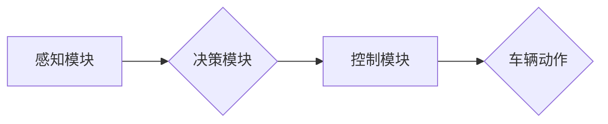

                 

## AI在智能驾驶中的应用：提高道路安全

> 关键词：智能驾驶、人工智能、计算机视觉、深度学习、传感器融合、路径规划、决策控制、道路安全

## 1. 背景介绍

智能驾驶，作为未来交通运输的重要发展方向，旨在通过人工智能技术实现车辆自动驾驶，从而提高道路安全、缓解交通拥堵和提升出行效率。近年来，随着人工智能技术的快速发展，特别是深度学习算法的突破，智能驾驶技术取得了显著进展，从早期辅助驾驶功能逐渐发展到具备部分自动驾驶能力的自动驾驶系统。

然而，智能驾驶技术仍面临着诸多挑战，例如复杂路况感知、环境预测、决策控制等。如何有效利用人工智能技术，解决这些挑战，是智能驾驶技术发展的重要课题。

## 2. 核心概念与联系

智能驾驶系统主要由以下几个核心模块组成：

* **感知模块:** 负责获取车辆周围环境信息，包括道路、交通标志、其他车辆、行人等。常用的感知传感器包括摄像头、雷达、激光雷达、超声波传感器等。
* **决策模块:** 基于感知模块获取的信息，对周围环境进行分析和判断，制定驾驶决策，例如转向、加速、减速、停车等。
* **控制模块:** 将决策模块的指令转化为车辆实际动作，控制车辆的转向、加速、减速等。

**核心概念与架构流程图:**



## 3. 核心算法原理 & 具体操作步骤

### 3.1  算法原理概述

智能驾驶系统中广泛应用于感知、决策和控制模块的算法包括：

* **计算机视觉:** 用于图像识别、目标检测、场景理解等任务，例如识别交通标志、车辆、行人等。
* **深度学习:** 用于学习复杂数据模式，例如图像、语音、文本等，提高感知、决策和控制的准确性。
* **传感器融合:** 将来自不同传感器的信息进行融合，提高感知的可靠性和完整性。
* **路径规划:** 用于规划车辆行驶路径，避免碰撞和提高效率。
* **决策控制:** 用于根据感知信息和路径规划结果，制定驾驶决策和控制车辆动作。

### 3.2  算法步骤详解

以目标检测算法为例，其具体操作步骤如下：

1. **数据采集:** 收集大量包含目标的图像数据。
2. **数据预处理:** 对图像数据进行裁剪、缩放、增强等处理，提高算法训练效果。
3. **模型训练:** 使用深度学习算法，例如卷积神经网络 (CNN)，对预处理后的图像数据进行训练，学习目标检测模型。
4. **模型评估:** 使用测试数据评估模型的性能，例如准确率、召回率、平均精度等。
5. **模型部署:** 将训练好的模型部署到智能驾驶系统中，用于实时目标检测。

### 3.3  算法优缺点

**优点:**

* 高精度: 深度学习算法能够学习复杂数据模式，提高目标检测的精度。
* 鲁棒性: 深度学习模型能够适应不同的环境和光照条件。
* 可扩展性: 深度学习模型可以很容易地扩展到新的目标类别。

**缺点:**

* 计算量大: 深度学习模型训练和推理需要大量的计算资源。
* 数据依赖性: 深度学习模型需要大量的训练数据，否则性能会下降。
* 黑盒效应: 深度学习模型的决策过程难以解释，难以理解模型的错误原因。

### 3.4  算法应用领域

目标检测算法广泛应用于智能驾驶系统中的感知模块，例如：

* **车辆检测:** 检测周围行驶的车辆，判断其距离、速度等信息。
* **行人检测:** 检测行人，判断其位置、速度等信息，避免碰撞。
* **交通标志检测:** 检测交通标志，例如限速标志、停车标志等，帮助车辆理解道路规则。
* **障碍物检测:** 检测道路上的障碍物，例如树木、路障等，避免碰撞。

## 4. 数学模型和公式 & 详细讲解 & 举例说明

### 4.1  数学模型构建

在智能驾驶系统中，常用的数学模型包括：

* **状态空间模型:** 用于描述车辆的运动状态，例如位置、速度、加速度等。
* **预测模型:** 用于预测车辆周围环境的变化，例如其他车辆的运动轨迹、行人的移动方向等。
* **决策模型:** 用于根据感知信息和预测结果，制定驾驶决策。

### 4.2  公式推导过程

以状态空间模型为例，其数学表达式为：

$$
x_t = A x_{t-1} + B u_{t-1} + w_t
$$

其中：

* $x_t$ 为车辆在时间 $t$ 的状态向量。
* $A$ 为状态转移矩阵。
* $B$ 为输入矩阵。
* $u_{t-1}$ 为车辆在时间 $t-1$ 的控制输入。
* $w_t$ 为过程噪声。

### 4.3  案例分析与讲解

假设车辆的状态向量包括位置、速度和加速度，则状态转移矩阵 $A$ 可以表示为：

$$
A = \begin{bmatrix}
1 & T & \frac{T^2}{2} \\
0 & 1 & T \\
0 & 0 & 1
\end{bmatrix}
$$

其中 $T$ 为时间步长。

## 5. 项目实践：代码实例和详细解释说明

### 5.1  开发环境搭建

智能驾驶系统开发通常需要以下开发环境：

* **操作系统:** Linux 或 Windows。
* **编程语言:** Python 或 C++。
* **深度学习框架:** TensorFlow 或 PyTorch。
* **传感器接口:** ROS 或其他传感器接口库。

### 5.2  源代码详细实现

以下是一个使用 TensorFlow 实现目标检测算法的简单代码示例：

```python
import tensorflow as tf

# 定义模型结构
model = tf.keras.models.Sequential([
    tf.keras.layers.Conv2D(32, (3, 3), activation='relu', input_shape=(224, 224, 3)),
    tf.keras.layers.MaxPooling2D((2, 2)),
    tf.keras.layers.Conv2D(64, (3, 3), activation='relu'),
    tf.keras.layers.MaxPooling2D((2, 2)),
    tf.keras.layers.Flatten(),
    tf.keras.layers.Dense(10, activation='softmax')
])

# 编译模型
model.compile(optimizer='adam',
              loss='categorical_crossentropy',
              metrics=['accuracy'])

# 训练模型
model.fit(x_train, y_train, epochs=10)

# 评估模型
loss, accuracy = model.evaluate(x_test, y_test)
print('Loss:', loss)
print('Accuracy:', accuracy)
```

### 5.3  代码解读与分析

这段代码定义了一个简单的卷积神经网络模型，用于图像分类任务。

* `tf.keras.models.Sequential` 创建了一个顺序模型，将层级依次连接。
* `tf.keras.layers.Conv2D` 定义了一个卷积层，用于提取图像特征。
* `tf.keras.layers.MaxPooling2D` 定义了一个最大池化层，用于降低特征图尺寸。
* `tf.keras.layers.Flatten` 将多维特征图转换为一维向量。
* `tf.keras.layers.Dense` 定义了一个全连接层，用于分类。
* `model.compile` 编译模型，指定优化器、损失函数和评价指标。
* `model.fit` 训练模型，使用训练数据进行训练。
* `model.evaluate` 评估模型，使用测试数据计算损失和准确率。

### 5.4  运行结果展示

训练完成后，可以将模型应用于新的图像数据进行预测。

## 6. 实际应用场景

智能驾驶技术已在多个实际应用场景中得到应用，例如：

* **自动驾驶汽车:** 自动驾驶汽车利用智能驾驶技术实现自动驾驶功能，例如自动加速、自动转向、自动停车等。
* **无人配送车:** 无人配送车利用智能驾驶技术实现自动配送功能，例如自动导航、自动避障、自动送货等。
* **智能交通管理:** 智能交通管理系统利用智能驾驶技术实现交通流量优化、拥堵缓解、事故预防等功能。

### 6.4  未来应用展望

未来，智能驾驶技术将应用于更广泛的场景，例如：

* **智能公交车:** 智能公交车将实现自动驾驶、自动规划路线、自动接送乘客等功能，提高公交效率和舒适度。
* **智能出租车:** 智能出租车将实现自动驾驶、自动接单、自动导航等功能，提高出租车服务效率和安全性。
* **智能货运车:** 智能货运车将实现自动驾驶、自动装卸货、自动导航等功能，提高货运效率和安全性。

## 7. 工具和资源推荐

### 7.1  学习资源推荐

* **书籍:**
    * 《深度学习》 - Ian Goodfellow, Yoshua Bengio, Aaron Courville
    * 《计算机视觉:算法与应用》 - Richard Szeliski
* **在线课程:**
    * Coursera: 深度学习
    * Udacity: 自动驾驶工程师
* **开源项目:**
    * TensorFlow
    * PyTorch
    * OpenCV

### 7.2  开发工具推荐

* **操作系统:** Ubuntu
* **编程语言:** Python
* **深度学习框架:** TensorFlow, PyTorch
* **传感器接口:** ROS

### 7.3  相关论文推荐

* **目标检测:**
    * You Only Look Once: Unified, Real-Time Object Detection
    * Faster R-CNN: Towards Real-Time Object Detection with Region Proposal Networks
* **路径规划:**
    * A* Search Algorithm for Path Planning
    * Probabilistic Roadmaps for Motion Planning

## 8. 总结：未来发展趋势与挑战

### 8.1  研究成果总结

近年来，智能驾驶技术取得了显著进展，例如目标检测、路径规划、决策控制等算法取得了突破性进展。

### 8.2  未来发展趋势

未来，智能驾驶技术将朝着以下方向发展:

* **更强的感知能力:** 开发更先进的传感器和感知算法，提高对复杂路况的感知能力。
* **更精准的决策控制:** 开发更智能的决策控制算法，提高驾驶决策的准确性和安全性。
* **更强的场景理解能力:** 开发更强大的场景理解算法，帮助车辆理解复杂的交通场景。
* **更安全的驾驶体验:** 通过人工智能技术，提高车辆的安全性，降低交通事故发生率。

### 8.3  面临的挑战

智能驾驶技术仍面临着诸多挑战，例如：

* **数据安全:** 智能驾驶系统需要收集大量的用户数据，如何保证数据安全和隐私保护是一个重要问题。
* **伦理问题:** 智能驾驶系统在遇到紧急情况时，如何做出道德决策是一个需要认真思考的问题。
* **法律法规:** 智能驾驶技术的应用需要完善相关的法律法规，明确责任归属和法律规范。

### 8.4  研究展望

未来，我们需要继续加强对智能驾驶技术的研发，解决技术难题，推动智能驾驶技术安全、可靠、可持续地发展，为人类社会创造更加美好的未来。

## 9. 附录：常见问题与解答

**Q1: 智能驾驶系统真的可以完全自动驾驶吗？**

A1: 目前，还没有完全自动驾驶的系统。现有的智能驾驶系统大多属于辅助驾驶系统，需要驾驶员进行监督和干预。

**Q2: 智能驾驶系统会取代人类驾驶员吗？**

A2: 智能驾驶技术的发展可能会改变驾驶员的工作模式，但不会完全取代人类驾驶员。未来，人类驾驶员可能更多地扮演监督和决策的角色。

**Q3: 智能驾驶系统安全吗？**

A3: 智能驾驶系统安全性是一个重要的研究课题。目前，智能驾驶系统已经取得了很大的进步，但仍存在一些安全风险。我们需要继续加强对智能驾驶系统的安全测试和评估，确保其安全可靠。


作者：禅与计算机程序设计艺术 / Zen and the Art of Computer Programming 
<end_of_turn>

