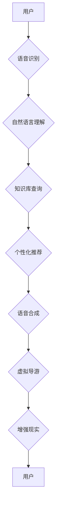

                 

## AI在虚拟导游中的应用：增强旅游体验

> 关键词：人工智能、虚拟导游、旅游体验、自然语言处理、计算机视觉、深度学习、增强现实

## 1. 背景介绍

随着科技的飞速发展，人工智能（AI）技术已渗透到生活的方方面面，旅游业也不例外。传统的旅游导游模式面临着人力成本高、服务体验单一、信息更新慢等问题。而AI技术为旅游业带来了新的机遇，虚拟导游应运而生，并逐渐成为旅游业发展的新趋势。

虚拟导游是指利用人工智能技术，模拟真人导游的功能，为游客提供个性化、智能化的旅游服务。它可以根据游客的兴趣、需求和语言等信息，提供定制化的旅游路线、景点介绍、历史文化讲解等服务，并通过语音、图像、视频等多种形式，为游客打造沉浸式的旅游体验。

## 2. 核心概念与联系

### 2.1 核心概念

* **人工智能 (AI):** 人工智能是指使机器能够像人类一样学习、 reasoning 和解决问题的能力。
* **虚拟导游 (Virtual Tour Guide):** 利用人工智能技术，模拟真人导游的功能，为游客提供个性化、智能化的旅游服务。
* **自然语言处理 (NLP):** 自然语言处理是指让计算机能够理解、处理和生成人类语言的能力。
* **计算机视觉 (CV):** 计算机视觉是指让计算机能够“看”图像和视频，并从中提取信息的能力。
* **深度学习 (Deep Learning):** 深度学习是一种机器学习的子领域，它利用多层神经网络来学习数据中的复杂模式。
* **增强现实 (AR):** 增强现实是指在现实世界中叠加虚拟信息，以增强用户对现实世界的感知。

### 2.2 架构



## 3. 核心算法原理 & 具体操作步骤

### 3.1 算法原理概述

虚拟导游的核心算法主要包括自然语言处理、计算机视觉和深度学习等技术。

* **自然语言处理:** 用于理解用户的语音或文本输入，并将其转换为计算机可理解的指令。
* **计算机视觉:** 用于识别图像和视频中的物体和场景，并提供相关信息。
* **深度学习:** 用于训练模型，使其能够根据用户的需求提供个性化的旅游服务。

### 3.2 算法步骤详解

1. **用户输入:** 用户可以通过语音或文本的方式向虚拟导游提出问题或请求服务。
2. **语音识别:** 系统使用语音识别技术将用户的语音转换为文本。
3. **自然语言理解:** 系统使用自然语言处理技术分析用户的文本输入，理解用户的意图和需求。
4. **知识库查询:** 系统根据用户的需求从知识库中查询相关信息，例如景点介绍、历史文化讲解、交通路线等。
5. **个性化推荐:** 系统根据用户的兴趣、需求和历史记录，为用户提供个性化的旅游推荐。
6. **语音合成:** 系统使用语音合成技术将推荐信息转换为语音输出。
7. **虚拟导游:** 系统通过语音、图像、视频等多种形式，向用户提供虚拟导游服务。
8. **增强现实:** 系统可以利用增强现实技术，将虚拟信息叠加到用户的现实世界中，例如在地图上标注景点位置、在景点周围显示相关信息等。

### 3.3 算法优缺点

**优点:**

* **个性化服务:** 虚拟导游可以根据用户的需求提供个性化的旅游服务。
* **24小时服务:** 虚拟导游可以随时随地提供服务，不受时间和地域限制。
* **成本效益:** 虚拟导游可以降低人力成本，提高服务效率。
* **丰富体验:** 虚拟导游可以利用多种技术手段，为用户提供更丰富、更沉浸式的旅游体验。

**缺点:**

* **缺乏情感共鸣:** 虚拟导游无法像真人导游一样，与用户建立情感共鸣。
* **技术限制:** 目前虚拟导游技术还存在一些局限性，例如语音识别和自然语言理解的准确率还有待提高。
* **数据安全:** 虚拟导游需要收集用户的个人信息，因此数据安全问题需要得到重视。

### 3.4 算法应用领域

虚拟导游技术可以应用于各种旅游场景，例如：

* **博物馆导览:** 为游客提供个性化的博物馆导览服务，讲解文物历史、文化背景等。
* **景区游览:** 为游客提供景区游览路线规划、景点介绍、历史文化讲解等服务。
* **城市探索:** 为游客提供城市探索路线规划、景点推荐、美食推荐等服务。
* **虚拟旅游:** 为无法亲自前往的游客提供虚拟旅游体验，例如参观世界名胜、体验异国风情等。

## 4. 数学模型和公式 & 详细讲解 & 举例说明

### 4.1 数学模型构建

虚拟导游系统可以构建一个基于深度学习的推荐模型，例如协同过滤模型或内容过滤模型。

* **协同过滤模型:** 基于用户的历史行为数据，预测用户对特定旅游资源的兴趣。
* **内容过滤模型:** 基于旅游资源的特征信息，预测用户对特定旅游资源的兴趣。

### 4.2 公式推导过程

协同过滤模型的评分预测公式如下：

$$
\hat{r}_{u,i} = \bar{r}_u + \frac{\sum_{j \in N(u)} (r_{u,j} - \bar{r}_u) \cdot (r_{j,i} - \bar{r}_j)}{\sum_{j \in N(u)} (r_{u,j} - \bar{r}_u)^2}
$$

其中：

* $\hat{r}_{u,i}$: 用户 $u$ 对物品 $i$ 的预测评分。
* $\bar{r}_u$: 用户 $u$ 的平均评分。
* $r_{u,j}$: 用户 $u$ 对物品 $j$ 的实际评分。
* $N(u)$: 用户 $u$ 评分过的物品集合。

### 4.3 案例分析与讲解

假设有一个旅游平台，用户 $A$ 对景点 $X$ 和 $Y$ 都评分过，用户 $B$ 也对景点 $X$ 和 $Z$ 都评分过。

根据协同过滤模型，可以预测用户 $A$ 对景点 $Z$ 的评分。

## 5. 项目实践：代码实例和详细解释说明

### 5.1 开发环境搭建

虚拟导游系统可以使用 Python 语言开发，并结合 TensorFlow 或 PyTorch 等深度学习框架。

开发环境需要包含以下软件：

* Python 3.x
* TensorFlow 或 PyTorch
* NLTK 或 spaCy 等自然语言处理库
* OpenCV 或 Dlib 等计算机视觉库
* ARKit 或 ARCore 等增强现实库

### 5.2 源代码详细实现

以下是一个简单的虚拟导游系统代码示例，使用 Python 和 TensorFlow 框架实现语音识别和自然语言理解功能：

```python
import tensorflow as tf

# 加载语音识别模型
model = tf.keras.models.load_model('speech_recognition_model.h5')

# 获取用户语音输入
audio_data = get_user_audio()

# 使用语音识别模型识别语音
recognized_text = model.predict(audio_data)

# 使用自然语言处理模型理解语音内容
intent = understand_intent(recognized_text)

# 根据意图提供相应服务
if intent == '景点介绍':
    # 从知识库查询景点信息
    # ...
    # 返回景点介绍信息
elif intent == '路线规划':
    # 根据用户需求规划路线
    # ...
    # 返回路线规划信息
```

### 5.3 代码解读与分析

* 该代码示例首先加载一个预训练的语音识别模型。
* 然后获取用户的语音输入。
* 使用语音识别模型将语音转换为文本。
* 使用自然语言处理模型分析文本内容，识别用户的意图。
* 根据用户的意图，从知识库查询相关信息，并提供相应的服务。

### 5.4 运行结果展示

当用户向虚拟导游提问时，系统会识别用户的语音，理解用户的意图，并从知识库中查询相关信息，最终向用户提供相应的服务。例如，当用户询问“附近的景点有哪些？”时，虚拟导游会识别用户的意图为“景点介绍”，并从知识库中查询附近的景点信息，然后向用户提供景点名称、地址、开放时间等信息。

## 6. 实际应用场景

### 6.1 旅游景区

虚拟导游可以为游客提供个性化的景区游览服务，例如：

* 根据游客的兴趣爱好，推荐合适的景点路线。
* 在景点周围提供历史文化讲解、景点介绍等信息。
* 利用增强现实技术，将虚拟信息叠加到现实世界中，例如在地图上标注景点位置、在景点周围显示相关信息等。

### 6.2 博物馆

虚拟导游可以为游客提供个性化的博物馆导览服务，例如：

* 根据游客的兴趣爱好，推荐合适的展品路线。
* 在展品前提供详细的文物介绍、历史背景等信息。
* 利用增强现实技术，将虚拟信息叠加到现实世界中，例如在文物上显示3D模型、播放文物相关的视频等。

### 6.3 城市探索

虚拟导游可以为游客提供城市探索服务，例如：

* 根据游客的兴趣爱好，推荐合适的餐厅、购物场所、娱乐场所等。
* 提供城市历史文化讲解、交通路线规划等信息。
* 利用增强现实技术，将虚拟信息叠加到现实世界中，例如在地图上标注景点位置、在建筑物上显示历史信息等。

### 6.4 未来应用展望

随着人工智能技术的不断发展，虚拟导游的应用场景将会更加广泛，例如：

* **个性化定制旅游:** 根据用户的兴趣爱好、预算、时间等信息，为用户定制个性化的旅游路线和服务。
* **沉浸式旅游体验:** 利用增强现实、虚拟现实等技术，为用户提供更加沉浸式的旅游体验。
* **跨语言沟通:** 支持多种语言的虚拟导游，方便来自不同国家和地区的游客使用。
* **智能导游助手:** 为真人导游提供智能辅助，例如提供景点信息、翻译语言、规划路线等。

## 7. 工具和资源推荐

### 7.1 学习资源推荐

* **斯坦福大学 CS224N 自然语言处理课程:** https://web.stanford.edu/class/cs224n/
* **DeepLearning.AI 深度学习课程:** https://www.deeplearning.ai/
* **TensorFlow 官方文档:** https://www.tensorflow.org/
* **PyTorch 官方文档:** https://pytorch.org/

### 7.2 开发工具推荐

* **TensorFlow:** https://www.tensorflow.org/
* **PyTorch:** https://pytorch.org/
* **NLTK:** https://www.nltk.org/
* **spaCy:** https://spacy.io/
* **OpenCV:** https://opencv.org/
* **Dlib:** https://dlib.net/

### 7.3 相关论文推荐

* **Attention Is All You Need:** https://arxiv.org/abs/1706.03762
* **BERT: Pre-training of Deep Bidirectional Transformers for Language Understanding:** https://arxiv.org/abs/1810.04805
* **Generative Adversarial Networks:** https://arxiv.org/abs/1406.2661

## 8. 总结：未来发展趋势与挑战

### 8.1 研究成果总结

虚拟导游技术在旅游业的应用取得了显著成果，为游客提供了更加个性化、智能化的旅游服务。

### 8.2 未来发展趋势

未来虚拟导游技术将朝着以下方向发展：

* **更加智能化:** 利用更先进的深度学习算法，提高虚拟导游的理解能力、推理能力和决策能力。
* **更加个性化:** 基于用户的历史行为数据、兴趣爱好等信息，提供更加个性化的旅游服务。
* **更加沉浸式:** 利用增强现实、虚拟现实等技术，为用户提供更加沉浸式的旅游体验。
* **更加融合:** 与其他旅游服务融合，例如酒店预订、交通预订、餐饮预订等，提供更加全面的旅游服务。

### 8.3 面临的挑战

虚拟导游技术还面临一些挑战：

* **数据安全:** 虚拟导游需要收集用户的个人信息，因此数据安全问题需要得到重视。
* **技术限制:** 目前虚拟导游技术还存在一些局限性，例如语音识别和自然语言理解的准确率还有待提高。
* **情感共鸣:** 虚拟导游无法像真人导游一样，与用户建立情感共鸣。

### 8.4 研究展望

未来研究方向包括：

* 开发更加智能、更加个性化的虚拟导游算法。
* 研究虚拟导游与人类交互的新方式，例如利用情感识别技术，让虚拟导游能够更好地理解用户的感受。
* 探索虚拟导游在其他领域的应用，例如教育、医疗、金融等。

## 9. 附录：常见问题与解答

### 9.1 如何保证虚拟导游的准确性？

虚拟导游的准确性取决于其训练数据和算法模型。

* 训练数据需要全面、准确、多样化。
* 算法模型需要不断优化和改进。

### 9.2 如何解决虚拟导游缺乏情感共鸣的问题？

目前虚拟导游缺乏情感共鸣是技术上的挑战。未来研究方向包括：

* 利用情感识别技术，让虚拟导游能够更好地理解用户的感受。
* 开发更加人性化的虚拟导游交互方式，例如使用更自然的语言、更丰富的表情等。

### 9.3 虚拟导游会取代真人导游吗？

虚拟导游和真人导游各有优缺点。

* 虚拟导游可以提供更加个性化、智能化的服务，但缺乏情感共鸣。
* 真人导游可以提供更加丰富的体验，但成本较高。

未来虚拟导游和真人导游将共同发展，共同服务于旅游业。

作者：禅与计算机程序设计艺术 / Zen and the Art of Computer Programming


<end_of_turn>

