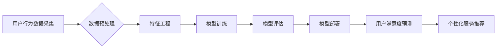

                 

## AI大模型在电商平台用户满意度预测与提升中的作用

> 关键词：AI大模型、用户满意度预测、电商平台、自然语言处理、机器学习、深度学习、推荐系统、个性化服务

## 1. 背景介绍

在当今数字化时代，电商平台已成为人们购物的首选方式。用户满意度是电商平台持续发展的关键因素，直接影响着平台的声誉、用户粘性和商业收益。传统用户满意度评估方法往往依赖于人工问卷调查和反馈数据，效率低下且难以捕捉用户细微的情绪变化。

近年来，人工智能（AI）技术蓬勃发展，特别是大模型的出现，为电商平台用户满意度预测与提升提供了新的思路和方法。AI大模型具备强大的数据处理和模式识别能力，能够从海量用户行为数据、商品信息、评论反馈等多维度数据中挖掘隐藏的规律，精准预测用户满意度，并为个性化服务提供支持。

## 2. 核心概念与联系

### 2.1 用户满意度预测

用户满意度预测是指利用数据分析和机器学习算法，从用户历史行为、产品属性、服务体验等多方面数据中，预测用户对电商平台或特定商品的满意程度。

### 2.2 AI大模型

AI大模型是指在海量数据上训练的深度学习模型，拥有强大的泛化能力和知识表示能力。常见的AI大模型包括BERT、GPT、T5等，它们能够理解和生成自然语言，并应用于各种自然语言处理任务，如文本分类、情感分析、问答系统等。

### 2.3 核心架构

电商平台用户满意度预测系统通常由以下几个模块组成：



**数据采集:** 从用户浏览记录、购买历史、评价反馈、客服咨询等多个渠道收集用户行为数据。

**数据预处理:** 对收集到的数据进行清洗、转换、编码等操作，使其符合模型训练要求。

**特征工程:** 从原始数据中提取有价值的特征，例如用户购买频率、平均消费金额、商品评分、评论情感倾向等，用于模型训练。

**模型训练:** 选择合适的机器学习算法，如逻辑回归、支持向量机、决策树等，对提取的特征进行训练，建立用户满意度预测模型。

**模型评估:** 利用测试数据对训练好的模型进行评估，衡量模型的预测准确率、召回率等指标。

**模型部署:** 将经过评估的模型部署到线上环境，用于实时预测用户满意度。

**用户满意度预测:** 根据用户行为数据，模型输出用户对电商平台或特定商品的满意度预测结果。

**个性化服务推荐:** 根据预测结果，为用户推荐个性化的商品、服务和优惠活动，提升用户体验和满意度。

## 3. 核心算法原理 & 具体操作步骤

### 3.1 算法原理概述

用户满意度预测算法通常基于机器学习和深度学习技术，通过训练模型学习用户行为数据与满意度之间的关系，从而预测用户未来的满意度。常见的算法包括：

* **逻辑回归:**  一种线性分类算法，用于预测用户是否会对电商平台或商品感到满意。
* **支持向量机:**  一种基于核函数的分类算法，能够处理高维数据，提高预测精度。
* **决策树:**  一种树形结构的分类算法，能够直观地展示用户满意度预测规则。
* **随机森林:**  一种集成学习算法，通过构建多个决策树并投票预测，提高模型鲁棒性和泛化能力。
* **深度神经网络:**  一种复杂的神经网络结构，能够学习更复杂的非线性关系，提高预测精度。

### 3.2 算法步骤详解

1. **数据收集:** 从电商平台收集用户行为数据、商品信息、评价反馈等数据。
2. **数据预处理:** 对收集到的数据进行清洗、转换、编码等操作，处理缺失值、异常值等问题，并将其转换为模型可识别的格式。
3. **特征工程:** 从原始数据中提取有价值的特征，例如用户购买频率、平均消费金额、商品评分、评论情感倾向等，并进行特征选择和组合，以提高模型预测精度。
4. **模型选择:** 根据数据特点和预测目标，选择合适的机器学习算法，例如逻辑回归、支持向量机、决策树等。
5. **模型训练:** 利用训练数据对选定的模型进行训练，调整模型参数，使其能够准确预测用户满意度。
6. **模型评估:** 利用测试数据对训练好的模型进行评估，衡量模型的预测准确率、召回率等指标，并进行模型调优。
7. **模型部署:** 将经过评估的模型部署到线上环境，用于实时预测用户满意度。

### 3.3 算法优缺点

**优点:**

* **精准预测:**  AI大模型能够从海量数据中挖掘隐藏的规律，提高用户满意度预测的精准度。
* **个性化服务:**  根据预测结果，为用户提供个性化的商品推荐、服务和优惠活动，提升用户体验和满意度。
* **实时反馈:**  模型部署到线上环境后，能够实时预测用户满意度，及时发现问题并进行调整。

**缺点:**

* **数据依赖:**  AI大模型的预测精度依赖于训练数据的质量和数量，数据不足或数据质量低会影响模型性能。
* **算法复杂:**  一些深度学习算法的训练和调优过程比较复杂，需要专业的技术人员进行操作。
* **解释性差:**  深度学习模型的内部机制比较复杂，难以解释模型的预测结果，这可能会导致用户对模型结果的信任度降低。

### 3.4 算法应用领域

用户满意度预测算法广泛应用于电商平台、金融机构、医疗机构等多个领域，例如：

* **电商平台:**  预测用户对商品、服务和平台的满意度，优化商品推荐、服务体验和营销策略。
* **金融机构:**  预测客户对金融产品的满意度，改进产品设计、服务流程和风险管理。
* **医疗机构:**  预测患者对医疗服务的满意度，提升医疗质量和患者体验。

## 4. 数学模型和公式 & 详细讲解 & 举例说明

### 4.1 数学模型构建

用户满意度预测模型通常采用回归模型，将用户满意度作为输出变量，并根据用户行为数据、商品信息等特征进行预测。

一个简单的线性回归模型可以表示为：

$$
y = \beta_0 + \beta_1x_1 + \beta_2x_2 + ... + \beta_nx_n + \epsilon
$$

其中：

* $y$ 是用户满意度预测值
* $\beta_0$ 是截距项
* $\beta_1, \beta_2, ..., \beta_n$ 是特征系数
* $x_1, x_2, ..., x_n$ 是用户行为数据、商品信息等特征
* $\epsilon$ 是误差项

### 4.2 公式推导过程

模型参数 $\beta_0, \beta_1, ..., \beta_n$ 可以通过最小二乘法进行估计，其目标是使模型预测值与实际用户满意度之间的误差平方和最小。

最小二乘法推导过程如下：

1. 定义误差函数：

$$
E = \sum_{i=1}^{n}(y_i - \hat{y}_i)^2
$$

其中：

* $y_i$ 是第 $i$ 个用户的实际满意度
* $\hat{y}_i$ 是模型预测的第 $i$ 个用户的满意度

2. 对误差函数求导，并令其等于零：

$$
\frac{\partial E}{\partial \beta_j} = 0
$$

3. 解出 $\beta_j$ 的值，得到模型参数估计值。

### 4.3 案例分析与讲解

假设我们想要预测用户对电商平台商品的满意度，并收集了以下数据：

* 用户购买频率 $x_1$
* 平均消费金额 $x_2$
* 商品评分 $x_3$

我们可以使用线性回归模型进行预测，并根据最小二乘法估计模型参数。

通过训练模型，我们得到以下参数估计值：

* $\beta_0 = 3$
* $\beta_1 = 0.5$
* $\beta_2 = 0.2$
* $\beta_3 = 0.8$

因此，用户满意度预测模型可以表示为：

$$
y = 3 + 0.5x_1 + 0.2x_2 + 0.8x_3
$$

例如，如果一个用户的购买频率为 10 次，平均消费金额为 100 元，商品评分为 4 分，则其预测满意度为：

$$
y = 3 + 0.5 \times 10 + 0.2 \times 100 + 0.8 \times 4 = 3 + 5 + 20 + 3.2 = 31.2
$$

## 5. 项目实践：代码实例和详细解释说明

### 5.1 开发环境搭建

* **操作系统:**  Windows/macOS/Linux
* **编程语言:**  Python
* **深度学习框架:**  TensorFlow/PyTorch
* **数据处理库:**  Pandas/NumPy
* **机器学习库:**  Scikit-learn

### 5.2 源代码详细实现

```python
import pandas as pd
from sklearn.model_selection import train_test_split
from sklearn.linear_model import LogisticRegression
from sklearn.metrics import accuracy_score

# 加载数据
data = pd.read_csv('user_data.csv')

# 特征工程
X = data[['购买频率', '平均消费金额', '商品评分']]
y = data['满意度']

# 数据分割
X_train, X_test, y_train, y_test = train_test_split(X, y, test_size=0.2, random_state=42)

# 模型训练
model = LogisticRegression()
model.fit(X_train, y_train)

# 模型评估
y_pred = model.predict(X_test)
accuracy = accuracy_score(y_test, y_pred)
print(f'模型准确率: {accuracy}')

# 预测新用户的满意度
new_user_data = pd.DataFrame({'购买频率': [10], '平均消费金额': [100], '商品评分': [4]})
predicted_satisfaction = model.predict(new_user_data)
print(f'新用户的预测满意度: {predicted_satisfaction}')
```

### 5.3 代码解读与分析

* **数据加载:** 使用 Pandas 库加载用户数据。
* **特征工程:** 从原始数据中提取有价值的特征，例如购买频率、平均消费金额、商品评分等。
* **数据分割:** 将数据分为训练集和测试集，用于模型训练和评估。
* **模型训练:** 使用 LogisticRegression 模型训练，并根据训练数据学习用户满意度预测规则。
* **模型评估:** 使用测试数据评估模型的预测准确率。
* **预测新用户:** 使用训练好的模型预测新用户的满意度。

### 5.4 运行结果展示

运行上述代码后，会输出模型的准确率以及新用户的预测满意度。

## 6. 实际应用场景

### 6.1 商品推荐

根据用户历史购买记录、浏览记录和评价反馈等数据，预测用户对不同商品的满意度，并推荐个性化的商品，提升用户购物体验和转化率。

### 6.2 服务优化

分析用户对客服服务、物流服务、退换货服务等方面的满意度，识别服务痛点，并针对性地改进服务流程和服务质量，提升用户满意度。

### 6.3 个性化营销

根据用户满意度预测结果，进行精准的营销推送，例如推荐优惠活动、发送个性化优惠券等，提升用户粘性和复购率。

### 6.4 未来应用展望

随着AI技术的不断发展，用户满意度预测将在电商平台的应用场景中得到更广泛的应用，例如：

* **智能客服:**  利用AI大模型构建智能客服系统，能够自动识别用户问题，并提供个性化的解决方案，提升客服效率和用户满意度。
* **动态价格调整:**  根据用户满意度预测结果，动态调整商品价格，实现精准定价，提升平台收益和用户体验。
* **用户画像分析:**  利用AI大模型分析用户行为数据，构建用户画像，更深入地了解用户需求和偏好，为个性化服务提供更精准的数据支持。

## 7. 工具和资源推荐

### 7.1 学习资源推荐

* **书籍:**
    * 《深度学习》 - Ian Goodfellow, Yoshua Bengio, Aaron Courville
    * 《机器学习》 - Tom Mitchell
* **在线课程:**
    * Coursera: 深度学习 Specialization
    * edX: 机器学习
* **博客和网站:**
    * TensorFlow 官方博客: https://blog.tensorflow.org/
    * PyTorch 官方博客: https://pytorch.org/blog/

### 7.2 开发工具推荐

* **深度学习框架:** TensorFlow, PyTorch
* **数据处理库:** Pandas, NumPy
* **机器学习库:** Scikit-learn
* **云平台:** AWS, Azure, Google Cloud

### 7.3 相关论文推荐

* **BERT:** Devlin, J., Chang, M. W., Lee, K., & Toutanova, K. (2018). BERT: Pre-training of deep bidirectional transformers for language understanding. arXiv preprint arXiv:1810.04805.
* **GPT:** Radford, A., Wu, J., Child, R., Luan, D., Amodei, D., & Sutskever, I. (2019). Language models are few-shot learners. arXiv preprint arXiv:1905.00221.
* **T5:** Raffel, C., Shazeer, N., Roberts, A., Lee, K., Narang, S., Matena, M., ... & Dean, J. (2019). Exploring the limits of transfer learning with a unified text-to-text transformer. arXiv preprint arXiv:1910.10683.

## 8. 总结：未来发展趋势与挑战

### 8.1 研究成果总结

AI大模型在电商平台用户满意度预测与提升方面取得了显著成果，能够精准预测用户满意度，并为个性化服务提供数据支持，提升用户体验和商业效益。

### 8.2 未来发展趋势

* **模型精度提升:**  随着AI技术的不断发展，用户满意度预测模型的精度将进一步提升，能够更准确地预测用户需求和行为。
* **多模态数据融合:**  将文本、图像、视频等多模态数据融合到用户满意度预测模型中，能够更全面地理解用户需求，提升预测精度。
* **解释性增强:**  研究更具解释性的AI模型，能够更好地解释模型的预测结果，提升用户对模型的信任度。

### 8.3 面临的挑战

* **数据质量:**  AI大模型的预测精度依赖于训练数据的质量，数据不完整、不准确或存在偏差都会影响模型性能。
* **模型复杂度:**  一些深度学习模型的训练和调优过程比较复杂，需要专业的技术人员进行操作。
* **隐私保护:**  用户数据隐私保护是一个重要的伦理问题，需要采取有效的措施保障用户数据安全。

### 8.4 研究展望

未来，AI大模型在电商平台用户满意度预测与提升方面将继续发挥重要作用，并与其他技术融合，例如：

* **增强现实 (AR) / 虚拟现实 (VR):**  利用AR/VR技术，为用户提供沉浸式的购物体验，提升用户满意度。
* **物联网 (IoT):**  将物联网数据与用户满意度预测模型结合，实现更精准的个性化服务。
* **区块链:**  利用区块链技术保障用户数据安全，提升用户信任度。


## 9. 附录：常见问题与解答

### 9.1 如何选择合适的AI大模型？

选择合适的AI大模型需要根据具体应用场景和数据特点进行选择。

* **数据量:**  如果数据量较小，可以选择BERT等预训练模型进行微调。如果数据量较大，可以选择训练自建模型。
* **任务类型:**  不同的AI大模型擅长不同的任务，例如BERT擅长文本分类，GPT擅长文本生成，需要根据具体任务选择合适的模型。
* **计算资源:**  不同的AI大模型对计算资源的需求不同，需要根据实际情况选择合适的模型。

### 9.2 如何处理用户数据隐私问题？

处理用户数据隐私问题需要采取以下措施：

* **数据匿名化:**  对用户数据进行匿名处理，去除个人识别信息。
* **数据加密:**  对用户数据进行加密，防止数据泄露。
* **数据安全协议:**  制定数据安全协议，规范用户数据的使用和存储。

作者：禅与计算机程序设计艺术 / Zen and the Art of Computer Programming


<end_of_turn>


