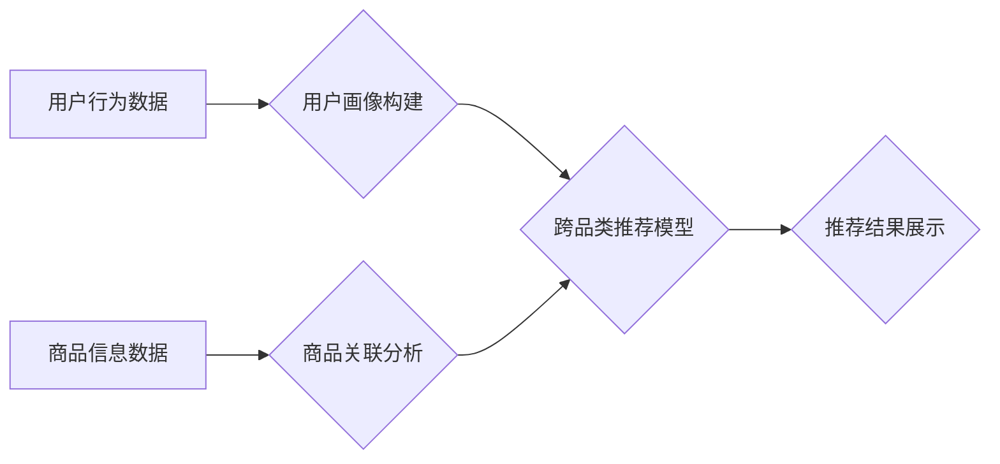

                 

## AI大模型如何优化电商平台的跨品类推荐

> 关键词：AI大模型、跨品类推荐、电商平台、协同过滤、深度学习、Transformer、用户画像、商品关联

## 1. 背景介绍

在当今数据爆炸的时代，电商平台面临着激烈的竞争压力。如何精准推荐商品，提升用户体验，并最终促进销售转化，成为电商平台的核心竞争力。传统的推荐系统主要依赖于基于内容的过滤和基于协同过滤的方法，但这些方法在跨品类推荐方面存在局限性。

跨品类推荐是指推荐与用户历史购买或浏览商品类别不同的商品，例如推荐用户购买过运动鞋的用户，也推荐一些运动服饰或运动耳机。跨品类推荐能够帮助电商平台挖掘用户潜在需求，拓展销售范围，提升用户粘性。

然而，跨品类推荐面临着以下挑战：

* **数据稀疏性:** 用户跨品类购买行为数据相对稀疏，难以建立有效的推荐模型。
* **类别间关联性弱:** 不同品类之间的关联性较弱，传统的协同过滤方法难以捕捉跨品类之间的潜在关系。
* **用户个性化需求:** 用户的跨品类需求多样化，难以用简单的规则或模型进行精准推荐。

## 2. 核心概念与联系

**2.1 核心概念**

* **AI大模型:** 指规模庞大、训练数据丰富、具备强大泛化能力的深度学习模型，例如BERT、GPT-3、T5等。
* **跨品类推荐:** 指推荐与用户历史购买或浏览商品类别不同的商品。
* **用户画像:** 通过分析用户行为、偏好、属性等数据，构建用户个性化的描述模型。
* **商品关联:** 通过分析商品属性、购买行为、用户评价等数据，挖掘商品之间的潜在关系。

**2.2 架构图**



## 3. 核心算法原理 & 具体操作步骤

**3.1 算法原理概述**

AI大模型在跨品类推荐中发挥着重要作用，主要通过以下方式：

* **学习用户隐性特征:** AI大模型能够从海量用户行为数据中学习用户隐性特征，例如用户兴趣、偏好、需求等，并将其转化为可量化的向量表示。
* **挖掘商品关联关系:** AI大模型能够从商品信息数据中挖掘商品之间的关联关系，例如商品属性相似度、购买组合等，并将其转化为可量化的关系矩阵。
* **构建跨品类推荐模型:** 基于用户画像和商品关联关系，AI大模型可以构建跨品类推荐模型，例如基于Transformer的跨品类推荐模型，并进行预测和排序。

**3.2 算法步骤详解**

1. **数据预处理:** 收集用户行为数据、商品信息数据，并进行清洗、转换、编码等预处理操作。
2. **用户画像构建:** 使用AI大模型，例如BERT，对用户行为数据进行训练，构建用户画像模型，并将其转化为用户向量表示。
3. **商品关联分析:** 使用AI大模型，例如Graph Neural Network，对商品信息数据进行训练，构建商品关联模型，并将其转化为商品关系矩阵。
4. **跨品类推荐模型构建:** 将用户向量表示和商品关系矩阵作为输入，使用Transformer模型，例如T5，构建跨品类推荐模型，并进行训练。
5. **推荐结果生成:** 将用户向量表示输入到训练好的跨品类推荐模型中，获取商品推荐得分，并根据得分进行排序，生成推荐结果。

**3.3 算法优缺点**

**优点:**

* **精准度高:** AI大模型能够学习用户隐性特征和商品关联关系，提高推荐精准度。
* **泛化能力强:** AI大模型训练数据丰富，具备较强的泛化能力，能够适应不同电商平台和用户群体。
* **可扩展性强:** AI大模型架构灵活，能够根据实际需求进行扩展和优化。

**缺点:**

* **训练成本高:** AI大模型训练数据量大，计算资源需求高，训练成本较高。
* **解释性差:** AI大模型的决策过程较为复杂，难以解释推荐结果背后的逻辑。
* **数据依赖性强:** AI大模型的性能依赖于训练数据的质量和数量。

**3.4 算法应用领域**

* **电商平台:** 跨品类推荐、个性化推荐、商品搜索推荐等。
* **内容平台:** 内容推荐、用户画像分析、内容分类等。
* **社交媒体:** 用户兴趣推荐、好友推荐、内容推荐等。

## 4. 数学模型和公式 & 详细讲解 & 举例说明

**4.1 数学模型构建**

假设用户集合为U，商品集合为I，用户-商品交互矩阵为R，其中R(u,i)表示用户u对商品i的交互行为（例如购买、浏览、评分等）。

**用户向量表示:** 使用AI大模型，例如BERT，对用户行为数据进行训练，将每个用户u映射到一个低维向量空间中，表示为u∈R^d，其中d为向量维度。

**商品向量表示:** 使用AI大模型，例如Graph Neural Network，对商品信息数据进行训练，将每个商品i映射到一个低维向量空间中，表示为i∈R^d。

**跨品类推荐模型:** 使用Transformer模型，例如T5，将用户向量u和商品向量i作为输入，预测用户u对商品i的交互行为概率，即P(R(u,i)=1)。

**4.2 公式推导过程**

Transformer模型的输出层通常是一个线性层，其输出为预测概率：

$$
P(R(u,i)=1) = \sigma(W_o \cdot [u; i] + b_o)
$$

其中：

* σ为sigmoid激活函数，用于将预测值映射到0到1之间。
* W_o为输出层的权重矩阵。
* b_o为输出层的偏置向量。
* [u; i]为用户向量u和商品向量i的拼接。

**4.3 案例分析与讲解**

假设用户u购买了运动鞋和运动服，商品i为运动耳机。

* 用户向量u表示用户u的兴趣偏好，例如喜欢运动、户外活动等。
* 商品向量i表示商品i的属性特征，例如降噪、防水、蓝牙连接等。
* Transformer模型通过学习用户向量u和商品向量i之间的关系，预测用户u对商品i的购买概率。

如果用户向量u和商品向量i之间的相似度较高，则预测概率P(R(u,i)=1)较高，表明用户u对商品i的购买意愿强。

## 5. 项目实践：代码实例和详细解释说明

**5.1 开发环境搭建**

* Python 3.7+
* TensorFlow 2.x 或 PyTorch 1.x
* CUDA Toolkit 和 cuDNN

**5.2 源代码详细实现**

```python
import tensorflow as tf

# 定义用户向量和商品向量
user_embedding = tf.Variable(tf.random.normal([num_users, embedding_dim]))
item_embedding = tf.Variable(tf.random.normal([num_items, embedding_dim]))

# 定义Transformer模型
class TransformerModel(tf.keras.Model):
    def __init__(self, embedding_dim, num_heads, num_layers):
        super(TransformerModel, self).__init__()
        self.embedding = tf.keras.layers.Embedding(input_dim=num_items, output_dim=embedding_dim)
        self.transformer = tf.keras.layers.Transformer(num_heads=num_heads, num_layers=num_layers)
        self.dense = tf.keras.layers.Dense(1, activation='sigmoid')

    def call(self, inputs):
        user_id = inputs[0]
        item_id = inputs[1]
        user_embedding = self.embedding(user_id)
        item_embedding = self.embedding(item_id)
        combined_embedding = tf.concat([user_embedding, item_embedding], axis=-1)
        output = self.transformer(combined_embedding)
        prediction = self.dense(output)
        return prediction

# 实例化Transformer模型
model = TransformerModel(embedding_dim=64, num_heads=8, num_layers=2)

# 训练模型
model.compile(optimizer='adam', loss='binary_crossentropy', metrics=['accuracy'])
model.fit(x=[user_id, item_id], y=ratings, epochs=10)

```

**5.3 代码解读与分析**

* 代码首先定义了用户向量和商品向量，并使用随机初始化。
* 然后定义了Transformer模型，包括嵌入层、Transformer编码器和输出层。
* 嵌入层将用户ID和商品ID映射到低维向量空间。
* Transformer编码器用于学习用户向量和商品向量之间的关系。
* 输出层是一个单层全连接层，用于预测用户对商品的交互行为概率。
* 最后，使用Adam优化器和二分类交叉熵损失函数训练模型。

**5.4 运行结果展示**

训练完成后，可以使用模型预测用户对商品的交互行为概率。

## 6. 实际应用场景

**6.1 电商平台推荐系统**

AI大模型可以用于构建跨品类推荐系统，例如推荐用户购买过运动鞋的用户，也推荐一些运动服饰或运动耳机。

**6.2 内容平台个性化推荐**

AI大模型可以用于构建个性化推荐系统，例如推荐用户感兴趣的新闻、视频、文章等内容。

**6.3 社交媒体好友推荐**

AI大模型可以用于构建好友推荐系统，例如推荐用户可能认识的朋友或潜在的合作伙伴。

**6.4 未来应用展望**

随着AI技术的不断发展，AI大模型在跨品类推荐领域的应用场景将更加广泛，例如：

* **更精准的推荐:** AI大模型能够学习用户更细粒度的兴趣和需求，提供更精准的推荐。
* **更个性化的体验:** AI大模型能够根据用户的个性化偏好，提供更个性化的推荐体验。
* **更丰富的推荐内容:** AI大模型能够挖掘更丰富的商品关联关系，提供更丰富的推荐内容。

## 7. 工具和资源推荐

**7.1 学习资源推荐**

* **书籍:**
    * Deep Learning by Ian Goodfellow, Yoshua Bengio, and Aaron Courville
    * Natural Language Processing with Transformers by Hugging Face
* **在线课程:**
    * TensorFlow Tutorials
    * PyTorch Tutorials
    * DeepLearning.AI Specialization

**7.2 开发工具推荐**

* **TensorFlow:** 开源深度学习框架，支持多种模型架构和硬件平台。
* **PyTorch:** 开源深度学习框架，以其灵活性和易用性而闻名。
* **Hugging Face Transformers:** 提供预训练的Transformer模型和工具，方便用户快速构建推荐模型。

**7.3 相关论文推荐**

* BERT: Pre-training of Deep Bidirectional Transformers for Language Understanding
* Transformer: Attention Is All You Need
* Graph Neural Networks for Recommendation Systems

## 8. 总结：未来发展趋势与挑战

**8.1 研究成果总结**

AI大模型在跨品类推荐领域取得了显著的成果，例如：

* **提高了推荐精准度:** AI大模型能够学习用户隐性特征和商品关联关系，提高推荐精准度。
* **拓展了推荐范围:** AI大模型能够挖掘跨品类之间的潜在关系，拓展推荐范围。
* **提升了用户体验:** AI大模型能够提供更个性化、更丰富的推荐体验。

**8.2 未来发展趋势**

* **模型规模和能力提升:** 未来AI大模型规模将进一步扩大，能力将更加强大，能够学习更复杂的用户行为和商品关联关系。
* **多模态融合:** 未来AI大模型将融合文本、图像、视频等多模态数据，提供更全面的用户画像和商品信息。
* **解释性增强:** 未来AI大模型的决策过程将更加透明，能够解释推荐结果背后的逻辑，提升用户信任度。

**8.3 面临的挑战**

* **数据稀疏性:** 跨品类推荐数据相对稀疏，需要开发新的数据增强和模型训练方法。
* **计算资源需求:** AI大模型训练需要大量的计算资源，成本较高。
* **隐私保护:** AI大模型需要处理大量用户数据，需要加强隐私保护措施。

**8.4 研究展望**

未来研究将重点关注以下方面：

* 开发新的跨品类推荐算法和模型。
* 探索多模态数据融合的跨品类推荐方法。
* 研究AI大模型的解释性，提升用户信任度。
* 探索AI大模型在跨品类推荐中的隐私保护技术。

## 9. 附录：常见问题与解答

**9.1 如何选择合适的AI大模型？**

选择合适的AI大模型需要根据实际应用场景和数据特点进行选择。例如，对于文本数据，BERT模型效果较好；对于图数据，Graph Neural Network模型效果较好。

**9.2 如何处理跨品类推荐数据稀疏性？**

可以使用数据增强、迁移学习等方法处理跨品类推荐数据稀疏性。

**9.3 如何评估跨品类推荐模型的性能？**

可以使用准确率、召回率、F1-score等指标评估跨品类推荐模型的性能。

**9.4 如何保证AI大模型在跨品类推荐中的隐私保护？**

可以使用联邦学习、差分隐私等技术保证AI大模型在跨品类推荐中的隐私保护。


作者：禅与计算机程序设计艺术 / Zen and the Art of Computer Programming 
<end_of_turn>

