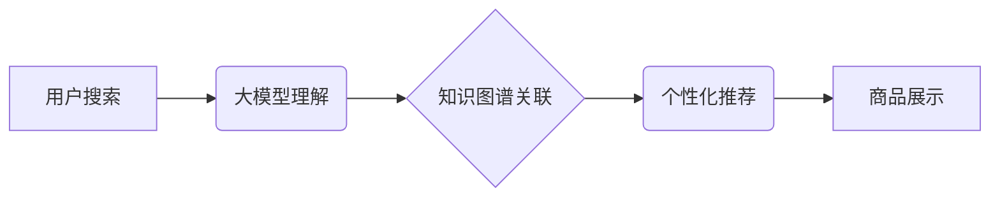

                 

## AI大模型视角下电商搜索推荐的技术创新思维方式

> 关键词：电商搜索推荐、大模型、Transformer、知识图谱、个性化推荐、多模态搜索、强化学习

### 1. 背景介绍

电商平台作为现代商业的重要组成部分，搜索推荐系统扮演着至关重要的角色。用户在电商平台上购物时，往往会通过关键词搜索或浏览商品分类来寻找所需商品。搜索推荐系统旨在根据用户的搜索意图和历史行为，精准推荐符合用户需求的商品，从而提升用户体验，提高转化率。

传统电商搜索推荐系统主要依赖于基于规则的匹配算法和基于协同过滤的推荐算法。然而，随着电商平台商品数量的激增和用户行为的复杂化，这些传统算法逐渐难以满足用户的个性化需求和搜索体验的提升。

近年来，大模型技术在自然语言处理、计算机视觉等领域取得了突破性进展，为电商搜索推荐带来了新的机遇。大模型具备强大的语义理解能力、知识表示能力和泛化能力，能够更好地理解用户的搜索意图，挖掘商品之间的潜在关联，并提供更精准、个性化的推荐结果。

### 2. 核心概念与联系

#### 2.1  大模型

大模型是指参数规模庞大、训练数据海量的人工智能模型。大模型通常通过深度学习技术训练，能够学习到复杂的模式和关系，并应用于各种自然语言处理、计算机视觉等任务。

#### 2.2  Transformer

Transformer是一种新型的神经网络架构，其核心是自注意力机制，能够有效捕捉文本序列中的长距离依赖关系。Transformer在自然语言处理领域取得了显著的成果，例如机器翻译、文本摘要、问答系统等。

#### 2.3  知识图谱

知识图谱是一种结构化的知识表示形式，将实体和关系以图的形式表示。知识图谱能够存储和推理丰富的知识，为搜索推荐系统提供更深层的语义理解和商品关联挖掘。

#### 2.4  个性化推荐

个性化推荐是指根据用户的兴趣、偏好、历史行为等信息，提供定制化的商品推荐。个性化推荐能够提升用户体验，提高推荐的准确性和有效性。

**核心概念与联系流程图**



### 3. 核心算法原理 & 具体操作步骤

#### 3.1  算法原理概述

大模型驱动的电商搜索推荐系统通常基于Transformer模型和知识图谱进行构建。

* **Transformer模型:** 用于理解用户的搜索意图，提取商品的语义特征。
* **知识图谱:** 用于挖掘商品之间的潜在关联，构建商品的知识网络。

通过将用户搜索信息与商品知识网络进行融合，系统能够更精准地理解用户的需求，并推荐符合用户兴趣的商品。

#### 3.2  算法步骤详解

1. **用户搜索预处理:** 将用户的搜索词进行清洗、分词、词性标注等预处理操作，以便于模型理解。
2. **Transformer模型编码:** 将预处理后的搜索词输入到Transformer模型中进行编码，提取搜索词的语义特征。
3. **知识图谱查询:** 根据Transformer模型提取的语义特征，查询知识图谱，获取与搜索词相关的商品信息和知识关系。
4. **商品特征融合:** 将Transformer模型提取的商品语义特征与知识图谱获取的商品信息进行融合，构建商品的综合特征向量。
5. **个性化推荐排序:** 根据用户的历史行为、偏好等信息，对融合后的商品特征向量进行排序，推荐符合用户需求的商品。
6. **推荐结果展示:** 将排序后的商品推荐结果展示给用户。

#### 3.3  算法优缺点

**优点:**

* **语义理解能力强:** Transformer模型能够捕捉文本序列中的长距离依赖关系，更好地理解用户的搜索意图。
* **知识表示能力强:** 知识图谱能够存储和推理丰富的商品知识，为推荐系统提供更深层的语义理解和商品关联挖掘。
* **个性化推荐效果好:** 基于用户的历史行为和偏好，能够提供更精准的个性化推荐。

**缺点:**

* **模型训练成本高:** 大模型的训练需要海量数据和强大的计算资源。
* **知识图谱构建和维护成本高:** 知识图谱的构建和维护需要专业人员和大量的时间和精力。
* **实时性问题:** 大模型的推理速度相对较慢，可能导致推荐结果的实时性问题。

#### 3.4  算法应用领域

大模型驱动的电商搜索推荐算法广泛应用于以下领域:

* **商品搜索推荐:** 根据用户的搜索词，推荐相关的商品。
* **个性化商品推荐:** 根据用户的兴趣、偏好、历史行为等信息，推荐个性化的商品。
* **跨界商品推荐:** 根据用户的兴趣爱好，推荐跨界领域的商品。
* **新品推荐:** 推广新上市的商品。
* **促销活动推荐:** 推广促销活动中的商品。

### 4. 数学模型和公式 & 详细讲解 & 举例说明

#### 4.1  数学模型构建

大模型驱动的电商搜索推荐系统通常采用基于深度学习的数学模型，例如Transformer模型。Transformer模型的核心是自注意力机制，其数学模型可以表示为以下公式:

$$
Attention(Q, K, V) = \frac{exp(Q \cdot K^T / \sqrt{d_k})}{exp(Q \cdot K^T / \sqrt{d_k})} \cdot V
$$

其中:

* $Q$: 查询矩阵
* $K$: 键矩阵
* $V$: 值矩阵
* $d_k$: 键向量的维度

#### 4.2  公式推导过程

自注意力机制通过计算查询向量与键向量的点积，并使用softmax函数进行归一化，来计算每个键向量对查询向量的注意力权重。然后，将注意力权重与值向量进行加权求和，得到最终的输出向量。

#### 4.3  案例分析与讲解

假设我们有一个电商平台，用户搜索了关键词“智能手机”。Transformer模型会将“智能手机”进行编码，得到一个查询向量。然后，模型会查询知识图谱，获取与“智能手机”相关的商品信息和知识关系，例如“智能手机”的品牌、型号、价格、功能等。这些信息会被转换为键向量和值向量。

通过自注意力机制，Transformer模型会计算查询向量与每个键向量的注意力权重，并根据权重对值向量进行加权求和，得到最终的商品特征向量。

### 5. 项目实践：代码实例和详细解释说明

#### 5.1  开发环境搭建

* Python 3.7+
* PyTorch 1.7+
* Transformers 4.0+
* SpaCy 3.0+
* MySQL 8.0+

#### 5.2  源代码详细实现

```python
# 导入必要的库
import torch
from transformers import AutoModelForSequenceClassification, AutoTokenizer

# 加载预训练模型和词典
model_name = "bert-base-uncased"
tokenizer = AutoTokenizer.from_pretrained(model_name)
model = AutoModelForSequenceClassification.from_pretrained(model_name)

# 用户搜索词预处理
search_query = "智能手机"
encoded_input = tokenizer(search_query, return_tensors="pt")

# 模型推理
outputs = model(**encoded_input)
logits = outputs.logits

# 获取商品推荐结果
# ...

# 展示推荐结果
print(f"推荐结果: {recommended_products}")
```

#### 5.3  代码解读与分析

* 代码首先导入必要的库，包括PyTorch、Transformers、SpaCy等。
* 然后，加载预训练的BERT模型和词典。
* 用户搜索词进行预处理，转换为模型可识别的格式。
* 将预处理后的搜索词输入到模型中进行推理，得到商品的语义特征。
* 根据商品的语义特征和用户的历史行为等信息，进行商品推荐排序。
* 最后，展示推荐结果。

#### 5.4  运行结果展示

运行上述代码后，系统会输出推荐的智能手机商品列表。

### 6. 实际应用场景

#### 6.1  电商平台搜索推荐

大模型驱动的电商搜索推荐系统能够帮助电商平台提升用户体验，提高转化率。例如，当用户搜索“智能手机”时，系统能够根据用户的搜索历史、浏览记录、购买记录等信息，推荐符合用户需求的智能手机，并提供个性化的价格、优惠信息。

#### 6.2  个性化商品推荐

大模型能够根据用户的兴趣、偏好、历史行为等信息，提供个性化的商品推荐。例如，电商平台可以根据用户的购物记录，推荐他们可能感兴趣的商品，或者根据用户的浏览记录，推荐他们可能需要的商品。

#### 6.3  跨界商品推荐

大模型能够挖掘商品之间的潜在关联，实现跨界商品推荐。例如，用户购买了运动鞋，系统可以根据用户的兴趣爱好，推荐与运动相关的服装、配饰等商品。

#### 6.4  未来应用展望

大模型驱动的电商搜索推荐技术还存在着许多发展空间，例如:

* **多模态搜索推荐:** 将文本、图像、视频等多种模态信息融合，实现更精准的商品搜索和推荐。
* **强化学习推荐:** 利用强化学习算法，根据用户的反馈信息，不断优化推荐策略，提高推荐效果。
* **联邦学习推荐:** 利用联邦学习技术，在保护用户隐私的前提下，实现跨平台的商品推荐。

### 7. 工具和资源推荐

#### 7.1  学习资源推荐

* **深度学习框架:** PyTorch, TensorFlow
* **自然语言处理库:** Transformers, SpaCy
* **知识图谱库:** Neo4j, RDFlib
* **在线课程:** Coursera, edX, Udemy

#### 7.2  开发工具推荐

* **IDE:** VS Code, PyCharm
* **云平台:** AWS, Azure, GCP
* **数据库:** MySQL, PostgreSQL

#### 7.3  相关论文推荐

* **BERT: Pre-training of Deep Bidirectional Transformers for Language Understanding**
* **Attention Is All You Need**
* **Knowledge Graph Embedding: A Survey**

### 8. 总结：未来发展趋势与挑战

#### 8.1  研究成果总结

大模型驱动的电商搜索推荐技术取得了显著的成果，能够提升用户体验，提高转化率。

#### 8.2  未来发展趋势

未来，大模型驱动的电商搜索推荐技术将朝着以下方向发展:

* **多模态搜索推荐:** 将文本、图像、视频等多种模态信息融合，实现更精准的商品搜索和推荐。
* **个性化推荐:** 利用更丰富的用户数据，提供更个性化的商品推荐。
* **跨界推荐:** 挖掘商品之间的潜在关联，实现跨界商品推荐。

#### 8.3  面临的挑战

大模型驱动的电商搜索推荐技术也面临着一些挑战:

* **模型训练成本高:** 大模型的训练需要海量数据和强大的计算资源。
* **知识图谱构建和维护成本高:** 知识图谱的构建和维护需要专业人员和大量的时间和精力。
* **实时性问题:** 大模型的推理速度相对较慢，可能导致推荐结果的实时性问题。

#### 8.4  研究展望

未来，我们需要继续探索大模型驱动的电商搜索推荐技术，解决其面临的挑战，并将其应用于更多场景，为用户提供更优质的购物体验。

### 9. 附录：常见问题与解答

**Q1: 大模型的训练需要多少数据？**

A1: 大模型的训练需要海量数据，通常需要数十亿甚至数百亿个样本。

**Q2: 如何构建知识图谱？**

A2: 知识图谱的构建需要专业人员进行数据收集、清洗、标注和推理等工作。

**Q3: 如何解决大模型的实时性问题？**

A3: 可以采用模型压缩、模型并行等技术来提高模型的推理速度。

**作者：禅与计算机程序设计艺术 / Zen and the Art of Computer Programming**<end_of_turn>

