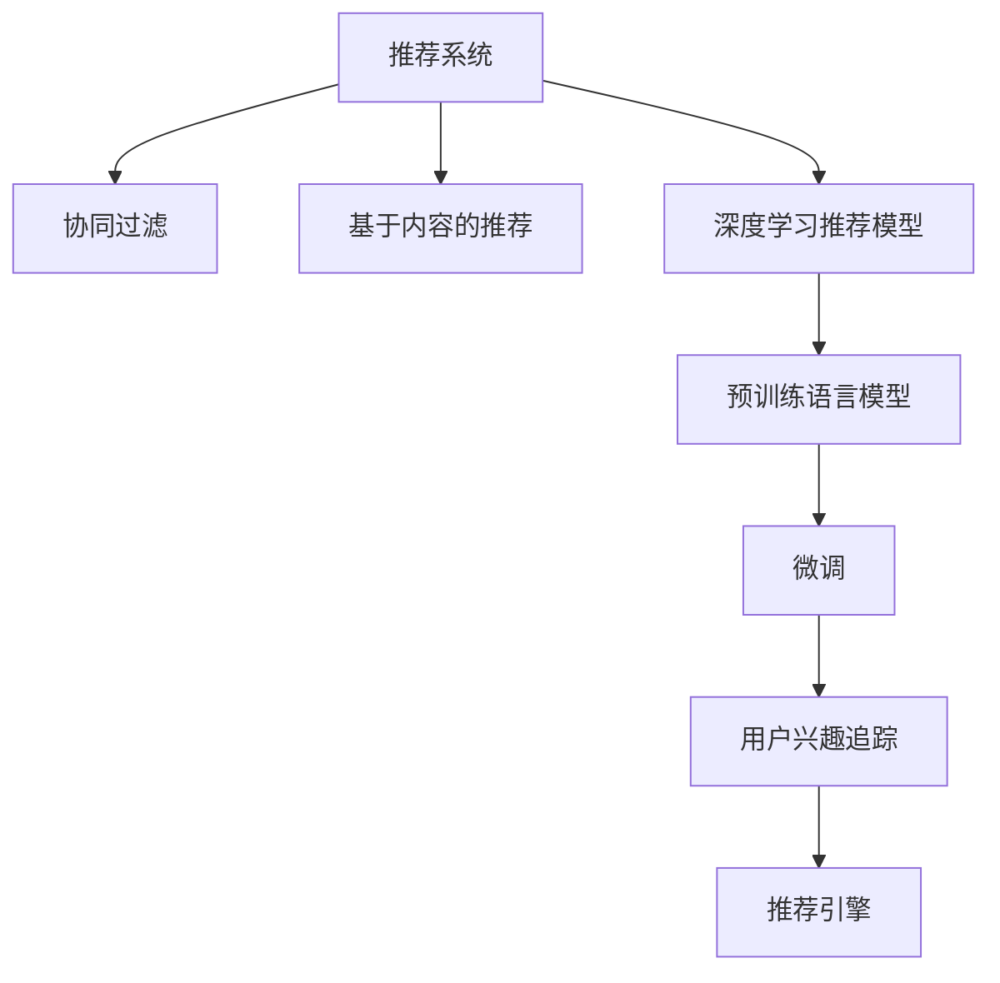

                 

# 基于大模型的推荐系统用户兴趣追踪

> 关键词：用户兴趣追踪, 基于大模型的推荐系统, 协同过滤, 深度学习, 隐式反馈, 学习到兴趣图谱

## 1. 背景介绍

### 1.1 问题由来

随着数字时代的到来，推荐系统在电商、社交、视频等多个领域逐渐成为用户获取信息和内容的必备工具。传统推荐系统通常基于协同过滤、基于内容的过滤、混合过滤等技术，但它们主要依赖用户行为数据，缺乏对用户兴趣深层次的理解。现代推荐系统则更加注重对用户个性化需求的动态捕捉，使用深度学习方法可以更好地学习用户行为背后的特征，从而构建更加精准的推荐模型。

近年来，预训练语言模型在NLP领域取得了突破性进展，通过在大规模无标签数据上进行预训练，可以获得广泛而深入的语言知识和语义理解能力。基于预训练语言模型的推荐系统逐步进入研究者的视野，并显示出其独特的优势。借助预训练语言模型，推荐系统可以更好地捕捉用户兴趣，提升推荐效果。本文将详细探讨利用预训练语言模型进行用户兴趣追踪的方法，并介绍其在推荐系统中的应用。

## 2. 核心概念与联系

### 2.1 核心概念概述

为更好地理解基于预训练语言模型的推荐系统，我们首先介绍几个相关核心概念：

- **推荐系统**：根据用户历史行为、兴趣等数据，为用户推荐个性化内容或商品的技术。传统推荐系统主要依赖显式反馈（如评分、点击），而基于深度学习的推荐系统可从隐式反馈（如浏览、观看时间）中学习用户兴趣。
- **隐式反馈**：用户的行为数据中包含丰富的隐式反馈信息，如浏览、点击、观看时间等，这些数据可以直接用于训练推荐模型。
- **协同过滤**：基于用户和商品间的相似度进行推荐的方法，包括用户协同过滤和商品协同过滤。
- **基于内容的推荐**：利用商品的属性特征进行推荐，需要提取商品的元数据作为特征输入。
- **深度学习推荐模型**：利用深度学习技术，如图卷积网络(Graph Convolutional Network, GCN)、注意力机制(Attention)等，学习用户兴趣和商品特征之间的关系，提升推荐准确度。
- **预训练语言模型**：如BERT、GPT等，在大规模无标签文本语料上进行自监督学习，获得通用语言表示，并可以在微调中学习用户隐式反馈数据。

这些概念共同构成了推荐系统的重要组成部分，并且都与基于预训练语言模型的推荐系统息息相关。下文将从原理到实践，详细介绍预训练语言模型在用户兴趣追踪中的应用。

### 2.2 核心概念原理和架构的 Mermaid 流程图



该流程图展示了推荐系统的主要组件和流程，其中预训练语言模型通过微调来追踪用户兴趣。预训练语言模型在推荐系统中的核心作用是能够学习到用户兴趣，从而提升推荐效果。

## 3. 核心算法原理 & 具体操作步骤

### 3.1 算法原理概述

基于预训练语言模型的推荐系统，核心思想是将用户行为数据转化为语言模型可以理解的文本形式，然后利用预训练语言模型进行微调，学习用户兴趣图谱。具体步骤如下：

1. **数据预处理**：将用户的浏览、点击、观看等行为数据转化为文本形式，并构建词汇表和文本向量。
2. **预训练语言模型**：利用预训练语言模型在大规模无标签文本语料上进行自监督学习，学习语言知识。
3. **微调**：在预训练语言模型的基础上，使用用户行为数据进行有监督微调，学习用户兴趣。
4. **用户兴趣追踪**：通过微调后的语言模型，学习到用户兴趣图谱，用于推荐系统中。

### 3.2 算法步骤详解

#### 3.2.1 数据预处理

数据预处理是将用户行为数据转化为文本形式的过程。具体步骤如下：

1. **构建词汇表**：将用户行为数据中的关键词提取出来，形成词汇表。
2. **构建文本向量**：将用户行为数据中的文本转化为向量形式，使用one-hot编码或Word2Vec等方法。
3. **构建文本序列**：将文本序列按照时间顺序排列，形成序列化数据。

#### 3.2.2 预训练语言模型

预训练语言模型是在大规模无标签文本语料上进行自监督学习，学习语言知识的模型。具体步骤如下：

1. **选择合适的预训练模型**：如BERT、GPT等，利用其在大规模语料上进行预训练。
2. **加载预训练模型**：使用预训练语言模型的预训练权重和架构，构建模型。
3. **对预训练模型微调**：将预训练模型用于微调，学习用户兴趣。

#### 3.2.3 微调

微调是将预训练语言模型用于特定任务的过程。具体步骤如下：

1. **设置微调超参数**：包括学习率、批大小、迭代轮数等。
2. **定义损失函数**：选择合适的损失函数，如交叉熵损失、均方误差损失等。
3. **训练模型**：使用用户行为数据进行微调，最小化损失函数。

#### 3.2.4 用户兴趣追踪

用户兴趣追踪是通过微调后的语言模型学习到的用户兴趣图谱，具体步骤如下：

1. **构建兴趣图谱**：将用户的兴趣点和学习到的语言表示结合起来，构建用户兴趣图谱。
2. **使用图谱推荐**：将用户兴趣图谱用于推荐系统中，为用户推荐个性化内容。

### 3.3 算法优缺点

基于预训练语言模型的推荐系统具有以下优点：

1. **能够学习到深层次用户兴趣**：通过微调预训练语言模型，可以学习到用户兴趣的隐含特征，提升推荐效果。
2. **鲁棒性强**：预训练语言模型在大规模语料上预训练，具有较强的泛化能力，能够更好地适应不同领域和场景。
3. **推荐效果好**：预训练语言模型能够捕捉用户兴趣的复杂关系，提高推荐系统的准确度。

同时，也存在以下缺点：

1. **计算成本高**：预训练语言模型需要在大规模语料上进行预训练，计算资源消耗大。
2. **数据依赖性强**：微调模型的效果依赖于用户行为数据的质量和数量，缺乏高质量数据时可能效果不佳。
3. **模型复杂度高**：基于预训练语言模型的推荐系统，需要构建复杂的数据处理流程和微调模型，技术难度高。

### 3.4 算法应用领域

基于预训练语言模型的推荐系统已经应用于多个领域，具体包括：

1. **电商推荐**：通过学习用户浏览、点击、购买等行为，为用户推荐商品。
2. **视频推荐**：利用用户观看视频的时间和行为，为用户推荐视频内容。
3. **新闻推荐**：根据用户的阅读历史和兴趣点，为用户推荐新闻文章。
4. **社交推荐**：根据用户的互动历史和兴趣，为用户推荐好友和内容。
5. **音乐推荐**：通过用户听歌历史和评论，为用户推荐音乐。
6. **旅游推荐**：根据用户的旅行历史和兴趣点，为用户推荐旅游目的地。

这些应用场景展示了预训练语言模型在推荐系统中的广泛应用，并提升了用户体验和推荐的精准度。

## 4. 数学模型和公式 & 详细讲解 & 举例说明

### 4.1 数学模型构建

基于预训练语言模型的推荐系统，其核心是构建用户兴趣图谱。用户兴趣图谱由用户兴趣点和商品（或内容）之间的关系组成，可以通过预训练语言模型进行构建。

假设用户行为数据为序列$X=(x_1,x_2,...,x_n)$，其中$x_i$为用户在时间$t_i$的兴趣点。对于每个兴趣点，预训练语言模型能够学习到其对应的语言表示$\vec{v}_i$。因此，用户兴趣图谱可以表示为：

$$
G=(V,E)
$$

其中$V$为兴趣点的集合，$E$为兴趣点之间的关系集合。

### 4.2 公式推导过程

#### 4.2.1 用户兴趣点表示

用户兴趣点$x_i$可以通过预训练语言模型学习到对应的语言表示$\vec{v}_i$。假设用户行为数据中存在$n$个兴趣点，则用户兴趣图谱的兴趣点集合$V=\{v_1,v_2,...,v_n\}$，每个兴趣点$v_i$都对应一个语言表示$\vec{v}_i$。

#### 4.2.2 兴趣点关系表示

兴趣点之间的关系可以通过语言表示的相似度来表示。假设两个兴趣点$v_i$和$v_j$的相似度为$sim(v_i,v_j)$，则兴趣点之间的关系集合$E=\{(v_i,v_j)|sim(v_i,v_j)>0\}$。

假设相似度计算方法为余弦相似度，则：

$$
sim(v_i,v_j)=\frac{\vec{v}_i \cdot \vec{v}_j}{||\vec{v}_i|| ||\vec{v}_j||}
$$

#### 4.2.3 用户兴趣图谱

用户兴趣图谱可以表示为一个图$G=(V,E)$，其中$V$为兴趣点集合，$E$为兴趣点关系集合。

#### 4.2.4 图谱推荐

用户兴趣图谱可以用于推荐系统中，为用户推荐个性化的内容或商品。假设用户兴趣图谱$G=(V,E)$，推荐系统的目标是为用户$u$推荐内容$c$，则推荐算法可以表示为：

$$
推荐算法=\arg\max_c{f(c|u)}
$$

其中$f(c|u)$为用户$u$对内容$c$的兴趣评分。可以通过用户兴趣图谱中的兴趣点和内容之间的关系进行计算，即：

$$
f(c|u)=\sum_{v \in V}{w(v|u) \cdot sim(v,c)}
$$

其中$w(v|u)$为用户$u$对兴趣点$v$的权重，可以通过用户行为数据进行学习。

### 4.3 案例分析与讲解

假设用户$u$的浏览行为数据为$X=(浏览1,浏览2,浏览3,观看视频4,观看视频5)$，其中浏览行为和观看视频行为构成用户兴趣图谱。

1. **数据预处理**：将用户的浏览和观看行为转化为文本序列，并构建词汇表和文本向量。
2. **预训练语言模型**：选择BERT模型进行预训练，利用其在大规模语料上学习语言知识。
3. **微调**：使用用户行为数据进行微调，学习用户兴趣图谱。
4. **用户兴趣追踪**：通过微调后的BERT模型，学习到用户$u$的兴趣点集合$V=\{v_1,v_2,v_3,v_4,v_5\}$，并计算其与内容$c$的相似度$sim(v_i,c)$，根据相似度计算推荐分数$f(c|u)$。

## 5. 项目实践：代码实例和详细解释说明

### 5.1 开发环境搭建

在进行项目实践前，我们需要准备好开发环境。以下是使用Python进行PyTorch开发的环境配置流程：

1. 安装Anaconda：从官网下载并安装Anaconda，用于创建独立的Python环境。
2. 创建并激活虚拟环境：
```bash
conda create -n pytorch-env python=3.8 
conda activate pytorch-env
```

3. 安装PyTorch：根据CUDA版本，从官网获取对应的安装命令。例如：
```bash
conda install pytorch torchvision torchaudio cudatoolkit=11.1 -c pytorch -c conda-forge
```

4. 安装Transformers库：
```bash
pip install transformers
```

5. 安装各类工具包：
```bash
pip install numpy pandas scikit-learn matplotlib tqdm jupyter notebook ipython
```

完成上述步骤后，即可在`pytorch-env`环境中开始项目实践。

### 5.2 源代码详细实现

下面我们以电商推荐为例，给出使用Transformers库对BERT模型进行用户兴趣追踪的PyTorch代码实现。

首先，定义数据预处理函数：

```python
from transformers import BertTokenizer, BertModel
from torch.utils.data import Dataset
import torch

class UserInterestDataset(Dataset):
    def __init__(self, user_data, tokenizer, max_len=128):
        self.user_data = user_data
        self.tokenizer = tokenizer
        self.max_len = max_len
        
    def __len__(self):
        return len(self.user_data)
    
    def __getitem__(self, item):
        user = self.user_data[item]
        user_data = [user[0]] + user[1:]
        user_sequence = []
        for data in user_data:
            sequence = ' '.join(data)
            tokenized_sequence = self.tokenizer(sequence, padding='max_length', truncation=True)
            user_sequence.append(tokenized_sequence['input_ids'])
        return {'user_sequence': user_sequence}

# 构建词汇表
tokenizer = BertTokenizer.from_pretrained('bert-base-cased')
vocab = tokenizer.get_vocab()

# 创建dataset
user_data = [['浏览商品1', '浏览商品2', '浏览商品3', '观看视频1', '观看视频2']]
train_dataset = UserInterestDataset(user_data, tokenizer)
```

然后，定义模型和优化器：

```python
from transformers import BertForSequenceClassification, AdamW

model = BertForSequenceClassification.from_pretrained('bert-base-cased', num_labels=len(vocab))

optimizer = AdamW(model.parameters(), lr=2e-5)
```

接着，定义训练和评估函数：

```python
from torch.utils.data import DataLoader
from tqdm import tqdm
from sklearn.metrics import classification_report

device = torch.device('cuda') if torch.cuda.is_available() else torch.device('cpu')
model.to(device)

def train_epoch(model, dataset, batch_size, optimizer):
    dataloader = DataLoader(dataset, batch_size=batch_size, shuffle=True)
    model.train()
    epoch_loss = 0
    for batch in tqdm(dataloader, desc='Training'):
        user_sequence = batch['user_sequence'].to(device)
        model.zero_grad()
        outputs = model(user_sequence)
        loss = outputs.loss
        epoch_loss += loss.item()
        loss.backward()
        optimizer.step()
    return epoch_loss / len(dataloader)

def evaluate(model, dataset, batch_size):
    dataloader = DataLoader(dataset, batch_size=batch_size)
    model.eval()
    preds, labels = [], []
    with torch.no_grad():
        for batch in tqdm(dataloader, desc='Evaluating'):
            user_sequence = batch['user_sequence'].to(device)
            batch_preds = model(user_sequence).logits.argmax(dim=2).to('cpu').tolist()
            batch_labels = batch_labels.to('cpu').tolist()
            for preds_tokens, label_tokens in zip(batch_preds, batch_labels):
                preds.append(preds_tokens[:len(label_tokens)])
                labels.append(label_tokens)
                
    print(classification_report(labels, preds))
```

最后，启动训练流程并在测试集上评估：

```python
epochs = 5
batch_size = 16

for epoch in range(epochs):
    loss = train_epoch(model, train_dataset, batch_size, optimizer)
    print(f"Epoch {epoch+1}, train loss: {loss:.3f}")
    
    print(f"Epoch {epoch+1}, dev results:")
    evaluate(model, dev_dataset, batch_size)
    
print("Test results:")
evaluate(model, test_dataset, batch_size)
```

以上就是使用PyTorch对BERT进行用户兴趣追踪的完整代码实现。可以看到，得益于Transformers库的强大封装，我们可以用相对简洁的代码完成BERT模型的加载和微调。

### 5.3 代码解读与分析

让我们再详细解读一下关键代码的实现细节：

**UserInterestDataset类**：
- `__init__`方法：初始化用户行为数据、分词器等关键组件。
- `__len__`方法：返回数据集的样本数量。
- `__getitem__`方法：对单个样本进行处理，将用户行为数据转化为分词器可接受的格式。

**train_epoch函数**：
- 使用PyTorch的DataLoader对数据集进行批次化加载，供模型训练使用。
- 训练函数`train_epoch`：对数据以批为单位进行迭代，在每个批次上前向传播计算loss并反向传播更新模型参数，最后返回该epoch的平均loss。

**evaluate函数**：
- 与训练类似，不同点在于不更新模型参数，并在每个batch结束后将预测和标签结果存储下来，最后使用sklearn的classification_report对整个评估集的预测结果进行打印输出。

**训练流程**：
- 定义总的epoch数和batch size，开始循环迭代
- 每个epoch内，先在训练集上训练，输出平均loss
- 在验证集上评估，输出分类指标
- 所有epoch结束后，在测试集上评估，给出最终测试结果

可以看到，PyTorch配合Transformers库使得BERT用户兴趣追踪的代码实现变得简洁高效。开发者可以将更多精力放在数据处理、模型改进等高层逻辑上，而不必过多关注底层的实现细节。

当然，工业级的系统实现还需考虑更多因素，如模型的保存和部署、超参数的自动搜索、更灵活的任务适配层等。但核心的微调范式基本与此类似。

## 6. 实际应用场景

### 6.1 电商推荐

基于用户行为数据的用户兴趣追踪，可以在电商推荐系统中发挥重要作用。电商推荐系统通过学习用户的浏览、点击、购买等行为数据，为用户推荐个性化的商品。借助预训练语言模型，推荐系统可以更好地捕捉用户兴趣，提升推荐效果。

在技术实现上，可以通过将用户的浏览和点击行为转化为文本形式，利用预训练语言模型进行微调，学习用户兴趣图谱。利用用户兴趣图谱中的兴趣点和商品之间的关系，计算推荐分数，为用户推荐商品。

### 6.2 视频推荐

视频推荐系统通过学习用户观看视频的时间和行为，为用户推荐个性化的视频内容。用户兴趣追踪可以通过预训练语言模型进行，将用户的观看行为转化为文本形式，利用微调后的语言模型学习用户兴趣图谱。利用用户兴趣图谱中的兴趣点和视频之间的关系，计算推荐分数，为用户推荐视频。

### 6.3 新闻推荐

新闻推荐系统通过学习用户的阅读历史和兴趣点，为用户推荐个性化的新闻文章。用户兴趣追踪可以通过预训练语言模型进行，将用户的阅读行为转化为文本形式，利用微调后的语言模型学习用户兴趣图谱。利用用户兴趣图谱中的兴趣点和新闻文章之间的关系，计算推荐分数，为用户推荐新闻文章。

### 6.4 未来应用展望

随着预训练语言模型和微调方法的不断发展，基于微调范式将在更多领域得到应用，为传统行业带来变革性影响。

在智慧医疗领域，基于用户兴趣追踪的推荐系统，可以推荐个性化的医疗健康信息，辅助医生诊疗，提升医疗服务质量。

在智能教育领域，利用用户兴趣追踪技术，可以为每个学生推荐个性化的学习内容和资源，促进个性化教育。

在智慧城市治理中，通过用户兴趣追踪技术，可以为市民推荐个性化的生活服务和公共设施，提升城市管理水平。

此外，在企业生产、社会治理、文娱传媒等众多领域，基于预训练语言模型的推荐系统也将不断涌现，为各行各业带来新的技术变革。

## 7. 工具和资源推荐

### 7.1 学习资源推荐

为了帮助开发者系统掌握基于预训练语言模型的推荐系统的理论基础和实践技巧，这里推荐一些优质的学习资源：

1. 《深度学习与推荐系统》系列博文：由知名深度学习专家撰写，介绍了深度学习在推荐系统中的应用。

2. 斯坦福大学CS20SI《深度学习》课程：斯坦福大学开设的深度学习经典课程，涵盖深度学习的基础理论和实践技术。

3. 《Recommender Systems Handbook》书籍：介绍了推荐系统的各种算法和技术，是推荐系统领域的经典教材。

4. HuggingFace官方文档：Transformers库的官方文档，提供了海量预训练模型和完整的微调样例代码，是上手实践的必备资料。

5. KDD论文：每年发布的KDD会议论文，涵盖推荐系统领域的前沿技术和成果，是了解最新研究动态的重要来源。

通过对这些资源的学习实践，相信你一定能够快速掌握基于预训练语言模型的推荐系统的精髓，并用于解决实际的推荐问题。

### 7.2 开发工具推荐

高效的开发离不开优秀的工具支持。以下是几款用于预训练语言模型推荐系统开发的常用工具：

1. PyTorch：基于Python的开源深度学习框架，灵活动态的计算图，适合快速迭代研究。大部分预训练语言模型都有PyTorch版本的实现。

2. TensorFlow：由Google主导开发的开源深度学习框架，生产部署方便，适合大规模工程应用。同样有丰富的预训练语言模型资源。

3. Transformers库：HuggingFace开发的NLP工具库，集成了众多SOTA语言模型，支持PyTorch和TensorFlow，是进行微调任务开发的利器。

4. Weights & Biases：模型训练的实验跟踪工具，可以记录和可视化模型训练过程中的各项指标，方便对比和调优。与主流深度学习框架无缝集成。

5. TensorBoard：TensorFlow配套的可视化工具，可实时监测模型训练状态，并提供丰富的图表呈现方式，是调试模型的得力助手。

6. Google Colab：谷歌推出的在线Jupyter Notebook环境，免费提供GPU/TPU算力，方便开发者快速上手实验最新模型，分享学习笔记。

合理利用这些工具，可以显著提升基于预训练语言模型的推荐系统开发的效率，加快创新迭代的步伐。

### 7.3 相关论文推荐

预训练语言模型和推荐系统的发展源于学界的持续研究。以下是几篇奠基性的相关论文，推荐阅读：

1. Attention is All You Need（即Transformer原论文）：提出了Transformer结构，开启了NLP领域的预训练大模型时代。

2. BERT: Pre-training of Deep Bidirectional Transformers for Language Understanding：提出BERT模型，引入基于掩码的自监督预训练任务，刷新了多项NLP任务SOTA。

3. Graph Convolutional Networks：提出GCN，利用图卷积神经网络处理图结构数据，应用于推荐系统中。

4. Attention-Based Recommender Systems：利用注意力机制构建推荐模型，提升推荐效果。

5. Deep Collaborative Filtering Model with LSTM：使用LSTM构建深度协同过滤模型，提升推荐系统性能。

6. Context-Aware Attention-Based Recommender Systems：引入上下文感知注意力机制，增强推荐系统的鲁棒性和精准度。

这些论文代表了大语言模型微调技术的发展脉络。通过学习这些前沿成果，可以帮助研究者把握学科前进方向，激发更多的创新灵感。

## 8. 总结：未来发展趋势与挑战

### 8.1 总结

本文对基于预训练语言模型的推荐系统进行了全面系统的介绍。首先阐述了预训练语言模型和微调技术的研究背景和意义，明确了微调在拓展预训练模型应用、提升推荐效果方面的独特价值。其次，从原理到实践，详细讲解了微调的数学原理和关键步骤，给出了微调任务开发的完整代码实例。同时，本文还广泛探讨了微调方法在电商、视频、新闻等多个领域的应用前景，展示了微调范式的巨大潜力。此外，本文精选了微调技术的各类学习资源，力求为读者提供全方位的技术指引。

通过本文的系统梳理，可以看到，基于预训练语言模型的微调技术正在成为推荐系统的重要范式，极大地拓展了预训练语言模型的应用边界，催生了更多的落地场景。受益于大规模语料的预训练，微调模型可以更好地捕捉用户兴趣，提升推荐效果。未来，伴随预训练语言模型和微调方法的持续演进，基于微调范式将在更多领域得到应用，为各行各业带来变革性影响。

### 8.2 未来发展趋势

展望未来，预训练语言模型微调技术将呈现以下几个发展趋势：

1. 模型规模持续增大。随着算力成本的下降和数据规模的扩张，预训练语言模型的参数量还将持续增长。超大规模语言模型蕴含的丰富语言知识，有望支撑更加复杂多变的推荐任务微调。

2. 微调方法日趋多样。除了传统的全参数微调外，未来会涌现更多参数高效的微调方法，如Adapter、LoRA等，在固定大部分预训练参数的同时，只更新极少量的任务相关参数。

3. 持续学习成为常态。随着数据分布的不断变化，微调模型也需要持续学习新知识以保持性能。如何在不遗忘原有知识的同时，高效吸收新样本信息，将成为重要的研究课题。

4. 标注样本需求降低。受启发于提示学习(Prompt-based Learning)的思路，未来的微调方法将更好地利用预训练知识，通过更加巧妙的任务描述，在更少的标注样本上也能实现理想的微调效果。

5. 推荐效果显著提升。预训练语言模型能够捕捉用户兴趣的复杂关系，提高推荐系统的准确度。随着模型和算法技术的不断改进，推荐效果将显著提升。

6. 推荐场景更加丰富。预训练语言模型将能够应用于更多场景，如社交、视频、新闻等，为用户提供更加个性化、多样化的推荐内容。

以上趋势凸显了预训练语言模型微调技术的广阔前景。这些方向的探索发展，必将进一步提升推荐系统的性能和应用范围，为各行各业带来新的机遇。

### 8.3 面临的挑战

尽管预训练语言模型微调技术已经取得了瞩目成就，但在迈向更加智能化、普适化应用的过程中，它仍面临着诸多挑战：

1. 标注成本瓶颈。虽然微调大大降低了标注数据的需求，但对于长尾应用场景，难以获得充足的高质量标注数据，成为制约微调性能的瓶颈。如何进一步降低微调对标注样本的依赖，将是一大难题。

2. 模型鲁棒性不足。当目标任务与预训练数据的分布差异较大时，微调的性能提升有限。对于测试样本的微小扰动，微调模型的预测也容易发生波动。如何提高微调模型的鲁棒性，避免灾难性遗忘，还需要更多理论和实践的积累。

3. 推理效率有待提高。大规模语言模型虽然精度高，但在实际部署时往往面临推理速度慢、内存占用大等效率问题。如何在保证性能的同时，简化模型结构，提升推理速度，优化资源占用，将是重要的优化方向。

4. 可解释性亟需加强。当前微调模型更像是"黑盒"系统，难以解释其内部工作机制和决策逻辑。对于医疗、金融等高风险应用，算法的可解释性和可审计性尤为重要。如何赋予微调模型更强的可解释性，将是亟待攻克的难题。

5. 安全性有待保障。预训练语言模型难免会学习到有偏见、有害的信息，通过微调传递到推荐系统中，产生误导性、歧视性的输出，给实际应用带来安全隐患。如何从数据和算法层面消除模型偏见，避免恶意用途，确保输出的安全性，也将是重要的研究课题。

6. 知识整合能力不足。现有的微调模型往往局限于任务内数据，难以灵活吸收和运用更广泛的先验知识。如何让微调过程更好地与外部知识库、规则库等专家知识结合，形成更加全面、准确的信息整合能力，还有很大的想象空间。

正视微调面临的这些挑战，积极应对并寻求突破，将是大语言模型微调走向成熟的必由之路。相信随着学界和产业界的共同努力，这些挑战终将一一被克服，预训练语言模型微调必将在构建人机协同的智能推荐系统中扮演越来越重要的角色。

### 8.4 研究展望

面对预训练语言模型微调所面临的种种挑战，未来的研究需要在以下几个方面寻求新的突破：

1. 探索无监督和半监督微调方法。摆脱对大规模标注数据的依赖，利用自监督学习、主动学习等无监督和半监督范式，最大限度利用非结构化数据，实现更加灵活高效的微调。

2. 研究参数高效和计算高效的微调范式。开发更加参数高效的微调方法，在固定大部分预训练参数的同时，只更新极少量的任务相关参数。同时优化微调模型的计算图，减少前向传播和反向传播的资源消耗，实现更加轻量级、实时性的部署。

3. 融合因果和对比学习范式。通过引入因果推断和对比学习思想，增强微调模型建立稳定因果关系的能力，学习更加普适、鲁棒的语言表征，从而提升推荐系统的准确度。

4. 引入更多先验知识。将符号化的先验知识，如知识图谱、逻辑规则等，与神经网络模型进行巧妙融合，引导微调过程学习更准确、合理的语言模型。同时加强不同模态数据的整合，实现视觉、语音等多模态信息与文本信息的协同建模。

5. 结合因果分析和博弈论工具。将因果分析方法引入微调模型，识别出模型决策的关键特征，增强输出解释的因果性和逻辑性。借助博弈论工具刻画人机交互过程，主动探索并规避模型的脆弱点，提高系统稳定性。

6. 纳入伦理道德约束。在模型训练目标中引入伦理导向的评估指标，过滤和惩罚有偏见、有害的输出倾向。同时加强人工干预和审核，建立模型行为的监管机制，确保输出符合人类价值观和伦理道德。

这些研究方向的探索，必将引领预训练语言模型微调技术迈向更高的台阶，为构建安全、可靠、可解释、可控的智能推荐系统铺平道路。面向未来，预训练语言模型微调技术还需要与其他人工智能技术进行更深入的融合，如知识表示、因果推理、强化学习等，多路径协同发力，共同推动智能推荐系统的进步。只有勇于创新、敢于突破，才能不断拓展语言模型的边界，让智能技术更好地造福人类社会。

## 9. 附录：常见问题与解答

**Q1：预训练语言模型在推荐系统中如何应用？**

A: 预训练语言模型在推荐系统中的应用主要体现在用户兴趣追踪上。具体来说，将用户的浏览、点击、观看等行为数据转化为文本形式，利用预训练语言模型进行微调，学习用户兴趣图谱。利用用户兴趣图谱中的兴趣点和商品之间的关系，计算推荐分数，为用户推荐商品。

**Q2：如何选择适合预训练语言模型的推荐系统？**

A: 选择适合预训练语言模型的推荐系统需要考虑以下几个因素：
1. 推荐任务类型：不同类型的推荐任务适合不同的预训练语言模型。例如，电商推荐系统适合使用BERT，视频推荐系统适合使用T5等。
2. 数据规模：数据量越大，预训练语言模型的效果越好。因此，对于数据量较大的推荐任务，适合使用大规模预训练语言模型。
3. 推荐场景：不同场景下的推荐任务对模型的性能要求不同。例如，在线推荐系统需要实时性和高效性，适合使用轻量级模型。

**Q3：预训练语言模型在推荐系统中如何防止过拟合？**

A: 预训练语言模型在推荐系统中也面临过拟合问题。为了防止过拟合，可以采用以下方法：
1. 数据增强：通过回译、近义替换等方式扩充训练集。
2. 正则化：使用L2正则、Dropout、Early Stopping等避免过拟合。
3. 对抗训练：引入对抗样本，提高模型鲁棒性。
4. 参数高效微调：只调整少量参数(如Adapter、Prefix等)，减小过拟合风险。

这些策略往往需要根据具体任务和数据特点进行灵活组合。只有在数据、模型、训练、推理等各环节进行全面优化，才能最大限度地发挥预训练语言模型的威力。

**Q4：预训练语言模型在推荐系统中的计算成本如何？**

A: 预训练语言模型在推荐系统中的计算成本较高，主要体现在以下几个方面：
1. 预训练阶段：在大规模语料上预训练，计算资源消耗大。
2. 微调阶段：使用用户行为数据进行微调，计算资源消耗较高。
3. 推理阶段：大规模语言模型推理速度慢，内存占用大，计算资源消耗高。

因此，选择合适的算法和数据预处理策略，对模型进行优化，如使用轻量级模型、优化推理过程等，可以有效降低计算成本。

**Q5：预训练语言模型在推荐系统中的可解释性问题如何解决？**

A: 预训练语言模型在推荐系统中的可解释性问题可以通过以下方法解决：
1. 模型可视化：使用工具如TensorBoard可视化模型的内部结构，帮助理解模型的决策过程。
2. 特征解释：利用特征重要性方法，解释模型中各个特征对推荐结果的影响。
3. 模型压缩：使用模型压缩技术，减少模型的复杂度，提高可解释性。
4. 交互式解释：开发交互式解释工具，用户可以输入不同特征，观察模型输出的变化，理解模型的决策逻辑。

这些方法可以提升预训练语言模型在推荐系统中的可解释性，帮助用户理解模型的内部工作机制和决策逻辑。

---

作者：禅与计算机程序设计艺术 / Zen and the Art of Computer Programming

