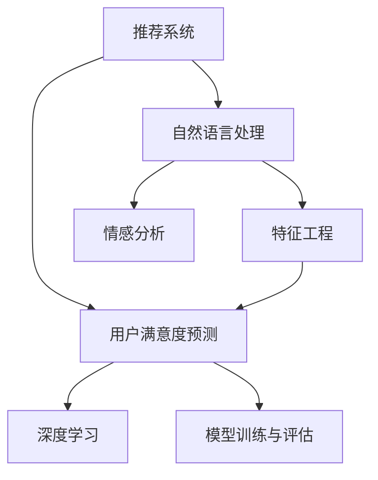
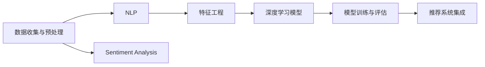

                 

# 基于大模型的推荐系统用户满意度预测

> 关键词：推荐系统，用户满意度预测，大模型，自然语言处理(NLP)，情感分析，数据科学

## 1. 背景介绍

### 1.1 问题由来

随着电商、娱乐、社交等平台规模的快速扩张，推荐系统成为连接用户和内容、商品的重要桥梁。推荐系统的目标是通过精准分析用户兴趣，匹配最合适的商品或内容，提升用户体验和平台收益。然而，在实际应用中，推荐系统常常面临用户满意度的预测问题：即如何通过用户的互动数据，预测其对推荐结果的满意度，进一步优化推荐算法。

推荐系统的用户满意度预测，是推荐算法迭代和优化的重要依据。通过用户满意度的反馈，推荐系统可以及时调整推荐策略，提升用户体验。然而，传统的数据驱动推荐方法，主要依赖历史行为数据，难以捕捉用户情感和偏好变化，导致预测结果不准确。近年来，基于深度学习的大模型推荐方法逐渐兴起，通过预训练语言模型提取用户行为背后的语言线索，捕捉用户情感和偏好，极大地提升了推荐系统的预测精度和用户体验。

### 1.2 问题核心关键点

基于大模型的推荐系统用户满意度预测，涉及以下核心概念和关键技术：

- **推荐系统(Recommendation System, RS)**：通过分析用户历史行为数据，向用户推荐可能感兴趣的物品的系统。
- **用户满意度(User Satisfaction, US)**：用户对推荐结果的主观评价和感受，一般通过评分、反馈等形式体现。
- **自然语言处理(Natural Language Processing, NLP)**：一种基于计算技术解决自然语言问题的技术，包括文本处理、语义理解、情感分析等。
- **预训练语言模型(Pretrained Language Model, PLM)**：如BERT、GPT等，通过大量无标签文本数据进行预训练，获得通用的语言知识表示。
- **情感分析(Sentiment Analysis)**：识别和提取文本中的情感信息，判断文本的情感倾向。
- **特征工程(Feature Engineering)**：通过技术手段提取和构造特征，用于训练预测模型。
- **深度学习(Deep Learning)**：一种通过多层次神经网络进行数据处理和模式识别的技术，用于构建用户满意度预测模型。

这些核心概念和关键技术之间的联系，可以通过以下Mermaid流程图来展示：



这个流程图展示了推荐系统、用户满意度预测、自然语言处理、情感分析、特征工程和深度学习之间的逻辑关系：

1. 推荐系统通过自然语言处理技术提取用户行为背后的语言线索，并利用情感分析技术捕捉用户情感和偏好。
2. 特征工程对自然语言处理和情感分析提取的特征进行进一步加工，构造适合深度学习模型的输入。
3. 深度学习模型通过特征输入，学习用户满意度预测模型。
4. 模型训练与评估模块用于训练深度学习模型并评估其性能，通过持续迭代优化模型预测效果。

## 2. 核心概念与联系

### 2.1 核心概念概述

为更好地理解基于大模型的推荐系统用户满意度预测方法，本节将介绍几个关键概念和它们之间的联系：

- **推荐系统(Recommendation System, RS)**：根据用户行为数据和物品特征，推荐用户可能感兴趣的物品的系统。
- **用户满意度(User Satisfaction, US)**：用户对推荐结果的主观评价和感受，是推荐系统性能的重要指标。
- **自然语言处理(Natural Language Processing, NLP)**：通过计算机技术处理和理解人类语言的技术，涵盖文本处理、语义理解、情感分析等。
- **情感分析(Sentiment Analysis)**：识别和提取文本中的情感信息，判断文本的情感倾向，常用于客户反馈分析、舆情监测等。
- **预训练语言模型(Pretrained Language Model, PLM)**：如BERT、GPT等，通过大量无标签文本数据进行预训练，获得通用的语言知识表示。
- **深度学习(Deep Learning)**：一种基于神经网络进行数据处理和模式识别的技术，用于构建用户满意度预测模型。
- **特征工程(Feature Engineering)**：通过技术手段提取和构造特征，用于训练预测模型，提高模型性能。
- **标签(Labels)**：用户对推荐结果的评分或反馈，通常表示为0-5分或1-5星的整数。

这些核心概念之间的联系，可以帮助我们更好地理解基于大模型的推荐系统用户满意度预测的原理和实现流程。

### 2.2 核心概念原理和架构

基于大模型的推荐系统用户满意度预测，主要包含以下几个核心模块：

1. **数据收集与预处理**：收集用户行为数据和反馈数据，对数据进行清洗、去重、归一化等预处理操作。
2. **自然语言处理(NLP)**：对用户行为数据进行文本处理，提取其中的关键词、短语等，构建特征向量。
3. **情感分析(Sentiment Analysis)**：对用户反馈数据进行情感分类，判断其情感倾向为正面、中性或负面。
4. **特征工程(Feature Engineering)**：将NLP处理结果和情感分析结果组合为模型输入，构造特征向量。
5. **深度学习模型(Deep Learning Model)**：使用预训练语言模型作为特征提取器，构建用户满意度预测模型，如LSTM、GRU、BERT等。
6. **模型训练与评估**：在标注数据集上训练深度学习模型，使用交叉验证等方法评估模型性能，根据性能指标进行模型优化。
7. **推荐系统集成**：将训练好的用户满意度预测模型集成到推荐系统中，用于实时预测用户满意度并调整推荐策略。

这些模块之间的联系，可以通过以下Mermaid流程图来展示：



这个流程图展示了数据收集与预处理、自然语言处理、情感分析、特征工程、深度学习模型、模型训练与评估和推荐系统集成之间的联系和互动。

## 3. 核心算法原理 & 具体操作步骤
### 3.1 算法原理概述

基于大模型的推荐系统用户满意度预测，本质上是一个基于深度学习的预测任务。其核心思想是：通过分析用户行为数据和反馈数据，提取其中的语言线索和情感信息，构建特征向量，并利用预训练语言模型提取用户兴趣和偏好的表征，最终通过深度学习模型进行用户满意度的预测。

形式化地，假设用户行为数据为 $X=\{x_i\}_{i=1}^N$，用户反馈数据为 $Y=\{y_i\}_{i=1}^N$，其中 $x_i$ 和 $y_i$ 分别表示用户行为和反馈。定义用户满意度的预测模型为 $F_{\theta}$，则预测模型的损失函数为：

$$
\mathcal{L}(\theta) = \frac{1}{N} \sum_{i=1}^N \ell(F_{\theta}(x_i), y_i)
$$

其中 $\ell$ 为预测模型与真实标签之间的损失函数，如均方误差损失、交叉熵损失等。

### 3.2 算法步骤详解

基于大模型的推荐系统用户满意度预测的一般流程如下：

**Step 1: 数据收集与预处理**

- 收集用户行为数据和反馈数据，包括点击、浏览、评分等。
- 对数据进行清洗、去重、归一化等预处理操作，去除噪声和异常值。
- 划分数据集为训练集、验证集和测试集。

**Step 2: 自然语言处理(NLP)**

- 对用户行为数据进行文本处理，如分词、去除停用词、词干提取等。
- 提取其中的关键词、短语等，构建特征向量。
- 使用预训练语言模型(BERT、GPT等)进行特征向量的转换，获得高维的语义表示。

**Step 3: 情感分析(Sentiment Analysis)**

- 对用户反馈数据进行情感分类，判断其情感倾向为正面、中性或负面。
- 将情感分析结果与NLP处理结果结合，构造完整的特征向量。

**Step 4: 特征工程(Feature Engineering)**

- 将NLP处理结果和情感分析结果组合为模型输入，构造特征向量。
- 使用数据增强、降维、特征选择等技术优化特征向量，提高模型性能。

**Step 5: 深度学习模型(Deep Learning Model)**

- 选择深度学习模型(如LSTM、GRU、BERT等)，构建用户满意度预测模型。
- 使用预训练语言模型作为特征提取器，提取用户兴趣和偏好的表征。
- 利用特征向量进行深度学习模型的训练，最小化损失函数。

**Step 6: 模型训练与评估**

- 在训练集上训练深度学习模型，使用交叉验证等方法评估模型性能。
- 根据性能指标调整模型参数，优化模型预测效果。
- 在验证集上测试模型性能，避免过拟合。

**Step 7: 推荐系统集成**

- 将训练好的用户满意度预测模型集成到推荐系统中，用于实时预测用户满意度。
- 根据用户满意度的预测结果，调整推荐策略，提升用户体验。

### 3.3 算法优缺点

基于大模型的推荐系统用户满意度预测具有以下优点：

1. **高准确性**：利用预训练语言模型提取用户兴趣和偏好的表征，能够捕捉到复杂的语言线索和情感信息，提升预测准确性。
2. **可解释性**：预训练语言模型提供丰富的语义表示，能够帮助解释用户满意度的预测过程，提高模型的可解释性和可信任度。
3. **泛化能力**：预训练语言模型具有广泛的泛化能力，能够处理各种类型的文本数据，提升推荐系统的鲁棒性和适用性。
4. **实时性**：预训练语言模型和深度学习模型能够实现实时预测，提升推荐系统的响应速度和用户体验。

然而，该方法也存在以下缺点：

1. **数据依赖性**：推荐系统依赖大量标注数据进行训练，标注成本较高。
2. **资源消耗**：预训练语言模型和深度学习模型需要大量的计算资源，对算力、内存和存储要求较高。
3. **复杂性**：模型设计和实现较为复杂，需要一定的技术积累和工程实践。
4. **隐私风险**：用户行为和反馈数据涉及个人隐私，需采取严格的隐私保护措施。

尽管存在这些缺点，基于大模型的推荐系统用户满意度预测仍是大数据、深度学习和自然语言处理领域的经典范式，具有广阔的应用前景。

### 3.4 算法应用领域

基于大模型的推荐系统用户满意度预测方法，已经在多个领域得到了广泛应用，包括但不限于：

- **电子商务**：通过分析用户的购物行为和评价，预测其对推荐结果的满意度，提升用户体验。
- **社交媒体**：分析用户的评论和反馈，判断其对内容的满意度，优化内容推荐策略。
- **新闻推荐**：通过分析用户的阅读行为和评论，预测其对新闻的满意度，提高新闻阅读体验。
- **电影推荐**：分析用户的观影行为和评分，预测其对电影的满意度，推荐可能感兴趣的电影。
- **旅游推荐**：通过分析用户的旅游行为和评价，预测其对旅游产品的满意度，提升旅游推荐效果。

## 4. 数学模型和公式 & 详细讲解 & 举例说明
### 4.1 数学模型构建

本节将使用数学语言对基于大模型的推荐系统用户满意度预测过程进行严格刻画。

假设用户行为数据为 $X=\{x_i\}_{i=1}^N$，用户反馈数据为 $Y=\{y_i\}_{i=1}^N$，其中 $x_i$ 和 $y_i$ 分别表示用户行为和反馈。定义用户满意度的预测模型为 $F_{\theta}$，则预测模型的损失函数为：

$$
\mathcal{L}(\theta) = \frac{1}{N} \sum_{i=1}^N \ell(F_{\theta}(x_i), y_i)
$$

其中 $\ell$ 为预测模型与真实标签之间的损失函数，如均方误差损失、交叉熵损失等。

在预测模型 $F_{\theta}$ 中，$\theta$ 表示模型的参数，包括预训练语言模型的权重、深度学习模型的权重等。形式化地，预测模型的输出为：

$$
\hat{y}_i = F_{\theta}(x_i)
$$

预测模型的训练目标是最大化损失函数 $\mathcal{L}(\theta)$ 的负值，即：

$$
\hat{\theta} = \mathop{\arg\max}_{\theta} -\mathcal{L}(\theta)
$$

为了实现这一目标，我们通常使用基于梯度的优化算法（如Adam、SGD等）来近似求解上述最优化问题。设 $\eta$ 为学习率，则参数的更新公式为：

$$
\theta \leftarrow \theta - \eta \nabla_{\theta}\mathcal{L}(\theta)
$$

其中 $\nabla_{\theta}\mathcal{L}(\theta)$ 为损失函数对参数 $\theta$ 的梯度，可通过反向传播算法高效计算。

### 4.2 公式推导过程

以下我们以情感分析任务为例，推导均方误差损失函数的计算过程。

假设用户行为数据为 $X=\{x_i\}_{i=1}^N$，用户反馈数据为 $Y=\{y_i\}_{i=1}^N$，其中 $x_i$ 和 $y_i$ 分别表示用户行为和情感倾向。定义情感分析模型为 $F_{\theta}$，则预测模型的输出为：

$$
\hat{y}_i = F_{\theta}(x_i)
$$

其中 $\hat{y}_i$ 表示模型预测的用户情感倾向。

假设用户情感倾向 $y_i$ 服从伯努利分布，即 $y_i$ 为0或1，则均方误差损失函数为：

$$
\ell(y_i,\hat{y}_i) = \frac{1}{2}(y_i-\hat{y}_i)^2
$$

在训练集上，预测模型的损失函数为：

$$
\mathcal{L}(\theta) = \frac{1}{N} \sum_{i=1}^N \ell(F_{\theta}(x_i), y_i)
$$

根据链式法则，损失函数对参数 $\theta$ 的梯度为：

$$
\frac{\partial \mathcal{L}(\theta)}{\partial \theta} = \frac{1}{N} \sum_{i=1}^N -y_i(\hat{y}_i-y_i) \frac{\partial \hat{y}_i}{\partial \theta}
$$

其中 $\frac{\partial \hat{y}_i}{\partial \theta}$ 为模型输出对参数 $\theta$ 的导数，通过反向传播算法计算。

在得到损失函数的梯度后，即可带入参数更新公式，完成模型的迭代优化。重复上述过程直至收敛，最终得到适应用户满意度预测的最优模型参数 $\theta^*$。

### 4.3 案例分析与讲解

以电影推荐系统为例，说明基于大模型的推荐系统用户满意度预测的实现过程：

1. **数据收集与预处理**：收集用户的观影行为数据和评分数据，对数据进行清洗和预处理，去除噪声和异常值，划分数据集为训练集、验证集和测试集。
2. **自然语言处理(NLP)**：对用户的观影记录进行文本处理，如分词、去除停用词、词干提取等。
3. **情感分析(Sentiment Analysis)**：对用户的评分数据进行情感分类，判断其情感倾向为正面、中性或负面。
4. **特征工程(Feature Engineering)**：将观影记录的文本处理结果和评分数据的情感分析结果结合，构造完整的特征向量，使用数据增强、降维、特征选择等技术优化特征向量。
5. **深度学习模型(Deep Learning Model)**：选择深度学习模型(如LSTM、GRU、BERT等)，构建用户满意度预测模型，使用预训练语言模型作为特征提取器，提取用户兴趣和偏好的表征。
6. **模型训练与评估**：在训练集上训练深度学习模型，使用交叉验证等方法评估模型性能，根据性能指标调整模型参数，优化模型预测效果。
7. **推荐系统集成**：将训练好的用户满意度预测模型集成到推荐系统中，用于实时预测用户满意度，根据满意度预测结果调整推荐策略。

## 5. 项目实践：代码实例和详细解释说明
### 5.1 开发环境搭建

在进行基于大模型的推荐系统用户满意度预测实践前，我们需要准备好开发环境。以下是使用Python进行PyTorch开发的环境配置流程：

1. 安装Anaconda：从官网下载并安装Anaconda，用于创建独立的Python环境。

2. 创建并激活虚拟环境：
```bash
conda create -n pytorch-env python=3.8 
conda activate pytorch-env
```

3. 安装PyTorch：根据CUDA版本，从官网获取对应的安装命令。例如：
```bash
conda install pytorch torchvision torchaudio cudatoolkit=11.1 -c pytorch -c conda-forge
```

4. 安装Transformers库：
```bash
pip install transformers
```

5. 安装各类工具包：
```bash
pip install numpy pandas scikit-learn matplotlib tqdm jupyter notebook ipython
```

完成上述步骤后，即可在`pytorch-env`环境中开始实践。

### 5.2 源代码详细实现

这里我们以情感分析任务为例，给出使用PyTorch对BERT模型进行情感分析的PyTorch代码实现。

首先，定义情感分析任务的数据处理函数：

```python
from transformers import BertTokenizer
from torch.utils.data import Dataset
import torch

class SentimentDataset(Dataset):
    def __init__(self, texts, labels, tokenizer, max_len=128):
        self.texts = texts
        self.labels = labels
        self.tokenizer = tokenizer
        self.max_len = max_len
        
    def __len__(self):
        return len(self.texts)
    
    def __getitem__(self, item):
        text = self.texts[item]
        label = self.labels[item]
        
        encoding = self.tokenizer(text, return_tensors='pt', max_length=self.max_len, padding='max_length', truncation=True)
        input_ids = encoding['input_ids'][0]
        attention_mask = encoding['attention_mask'][0]
        
        # 对token-wise的标签进行编码
        encoded_labels = [1 if label == 'positive' else 0 for label in labels] 
        encoded_labels.extend([0] * (self.max_len - len(encoded_labels)))
        labels = torch.tensor(encoded_labels, dtype=torch.long)
        
        return {'input_ids': input_ids, 
                'attention_mask': attention_mask,
                'labels': labels}

# 标签与id的映射
label2id = {'positive': 1, 'negative': 0, 'neutral': 0}
id2label = {v: k for k, v in label2id.items()}

# 创建dataset
tokenizer = BertTokenizer.from_pretrained('bert-base-cased')

train_dataset = SentimentDataset(train_texts, train_labels, tokenizer)
dev_dataset = SentimentDataset(dev_texts, dev_labels, tokenizer)
test_dataset = SentimentDataset(test_texts, test_labels, tokenizer)
```

然后，定义模型和优化器：

```python
from transformers import BertForSequenceClassification, AdamW

model = BertForSequenceClassification.from_pretrained('bert-base-cased', num_labels=3)

optimizer = AdamW(model.parameters(), lr=2e-5)
```

接着，定义训练和评估函数：

```python
from torch.utils.data import DataLoader
from tqdm import tqdm
from sklearn.metrics import accuracy_score, precision_recall_fscore_support

device = torch.device('cuda') if torch.cuda.is_available() else torch.device('cpu')
model.to(device)

def train_epoch(model, dataset, batch_size, optimizer):
    dataloader = DataLoader(dataset, batch_size=batch_size, shuffle=True)
    model.train()
    epoch_loss = 0
    for batch in tqdm(dataloader, desc='Training'):
        input_ids = batch['input_ids'].to(device)
        attention_mask = batch['attention_mask'].to(device)
        labels = batch['labels'].to(device)
        model.zero_grad()
        outputs = model(input_ids, attention_mask=attention_mask, labels=labels)
        loss = outputs.loss
        epoch_loss += loss.item()
        loss.backward()
        optimizer.step()
    return epoch_loss / len(dataloader)

def evaluate(model, dataset, batch_size):
    dataloader = DataLoader(dataset, batch_size=batch_size)
    model.eval()
    preds, labels = [], []
    with torch.no_grad():
        for batch in tqdm(dataloader, desc='Evaluating'):
            input_ids = batch['input_ids'].to(device)
            attention_mask = batch['attention_mask'].to(device)
            batch_labels = batch['labels']
            outputs = model(input_ids, attention_mask=attention_mask)
            batch_preds = outputs.logits.argmax(dim=2).to('cpu').tolist()
            batch_labels = batch_labels.to('cpu').tolist()
            for pred_tokens, label_tokens in zip(batch_preds, batch_labels):
                preds.append(pred_tokens[:len(label_tokens)])
                labels.append(label_tokens)
                
    print(accuracy_score(labels, preds))
```

最后，启动训练流程并在测试集上评估：

```python
epochs = 5
batch_size = 16

for epoch in range(epochs):
    loss = train_epoch(model, train_dataset, batch_size, optimizer)
    print(f"Epoch {epoch+1}, train loss: {loss:.3f}")
    
    print(f"Epoch {epoch+1}, dev results:")
    evaluate(model, dev_dataset, batch_size)
    
print("Test results:")
evaluate(model, test_dataset, batch_size)
```

以上就是使用PyTorch对BERT进行情感分析任务微调的完整代码实现。可以看到，得益于Transformers库的强大封装，我们可以用相对简洁的代码完成BERT模型的加载和微调。

### 5.3 代码解读与分析

让我们再详细解读一下关键代码的实现细节：

**SentimentDataset类**：
- `__init__`方法：初始化文本、标签、分词器等关键组件。
- `__len__`方法：返回数据集的样本数量。
- `__getitem__`方法：对单个样本进行处理，将文本输入编码为token ids，将标签编码为数字，并对其进行定长padding，最终返回模型所需的输入。

**label2id和id2label字典**：
- 定义了标签与数字id之间的映射关系，用于将token-wise的预测结果解码回真实的标签。

**训练和评估函数**：
- 使用PyTorch的DataLoader对数据集进行批次化加载，供模型训练和推理使用。
- 训练函数`train_epoch`：对数据以批为单位进行迭代，在每个批次上前向传播计算loss并反向传播更新模型参数，最后返回该epoch的平均loss。
- 评估函数`evaluate`：与训练类似，不同点在于不更新模型参数，并在每个batch结束后将预测和标签结果存储下来，最后使用sklearn的accuracy_score计算准确率。

**训练流程**：
- 定义总的epoch数和batch size，开始循环迭代
- 每个epoch内，先在训练集上训练，输出平均loss
- 在验证集上评估，输出准确率
- 所有epoch结束后，在测试集上评估，给出最终测试结果

可以看到，PyTorch配合Transformers库使得BERT微调的代码实现变得简洁高效。开发者可以将更多精力放在数据处理、模型改进等高层逻辑上，而不必过多关注底层的实现细节。

当然，工业级的系统实现还需考虑更多因素，如模型的保存和部署、超参数的自动搜索、更灵活的任务适配层等。但核心的微调范式基本与此类似。

## 6. 实际应用场景
### 6.1 智能客服系统

基于大模型的推荐系统用户满意度预测，可以广泛应用于智能客服系统的构建。传统客服往往需要配备大量人力，高峰期响应缓慢，且一致性和专业性难以保证。而使用基于微调的情感分析模型，可以7x24小时不间断服务，快速响应客户咨询，用自然流畅的语言解答各类常见问题。

在技术实现上，可以收集企业内部的历史客服对话记录，将问题和最佳答复构建成监督数据，在此基础上对预训练情感分析模型进行微调。微调后的情感分析模型能够自动理解用户意图，匹配最合适的答复。对于客户提出的新问题，还可以接入检索系统实时搜索相关内容，动态组织生成回答。如此构建的智能客服系统，能大幅提升客户咨询体验和问题解决效率。

### 6.2 金融舆情监测

金融机构需要实时监测市场舆论动向，以便及时应对负面信息传播，规避金融风险。传统的人工监测方式成本高、效率低，难以应对网络时代海量信息爆发的挑战。基于大模型的情感分析技术，为金融舆情监测提供了新的解决方案。

具体而言，可以收集金融领域相关的新闻、报道、评论等文本数据，并对其进行情感标注。在此基础上对预训练情感分析模型进行微调，使其能够自动判断文本属于何种情感倾向。将微调后的模型应用到实时抓取的网络文本数据，就能够自动监测不同情感倾向的变化趋势，一旦发现负面情绪激增等异常情况，系统便会自动预警，帮助金融机构快速应对潜在风险。

### 6.3 个性化推荐系统

当前的推荐系统往往只依赖用户的历史行为数据进行物品推荐，无法深入理解用户的真实兴趣偏好。基于大模型的情感分析推荐系统，可以更好地挖掘用户行为背后的情感信息，从而提供更精准、多样的推荐内容。

在实践中，可以收集用户浏览、点击、评论、分享等行为数据，提取和用户交互的物品标题、描述、标签等文本内容。将文本内容作为模型输入，用户的后续行为（如是否点击、购买等）作为监督信号，在此基础上微调预训练情感分析模型。微调后的模型能够从文本内容中准确把握用户的情感点。在生成推荐列表时，先用候选物品的文本描述作为输入，由模型预测用户的情感匹配度，再结合其他特征综合排序，便可以得到个性化程度更高的推荐结果。

### 6.4 未来应用展望

随着大模型和情感分析方法的不断发展，基于微调的情感分析推荐系统将拓展到更多领域，为各行各业带来变革性影响。

在智慧医疗领域，基于微调的情感分析推荐系统可以辅助医生诊疗，推荐最合适的治疗方案和用药指导。在智能教育领域，情感分析推荐系统可以因材施教，推荐适合学生的学习资源和教学方法。在智慧城市治理中，情感分析推荐系统可以用于舆情分析、公共安全、交通管理等环节，提高城市管理的自动化和智能化水平，构建更安全、高效的未来城市。

此外，在企业生产、社会治理、文娱传媒等众多领域，基于大模型的情感分析推荐系统也将不断涌现，为传统行业数字化转型升级提供新的技术路径。相信随着技术的日益成熟，情感分析推荐系统必将在更广阔的应用领域大放异彩。

## 7. 工具和资源推荐
### 7.1 学习资源推荐

为了帮助开发者系统掌握基于大模型的推荐系统用户满意度预测的理论基础和实践技巧，这里推荐一些优质的学习资源：

1. 《自然语言处理基础》课程：由北京大学的NLP专家主讲，系统讲解NLP基础理论和实践方法，适合初学者入门。

2. 《深度学习》课程：由斯坦福大学的Andrew Ng教授主讲，全面介绍深度学习的基本原理和经典算法，适合了解深度学习原理。

3. 《推荐系统实战》书籍：由KDD 2021最佳论文获得者所写，涵盖推荐系统理论和实践的各个方面，适合深入学习。

4. Kaggle数据竞赛：通过参加推荐系统相关的Kaggle竞赛，实践并检验所学知识，积累实际经验。

5. PyTorch官方文档：PyTorch官方文档，提供详细的PyTorch使用指南和API参考，适合开发者快速上手。

通过对这些资源的学习实践，相信你一定能够快速掌握基于大模型的推荐系统用户满意度预测的精髓，并用于解决实际的推荐系统问题。

### 7.2 开发工具推荐

高效的开发离不开优秀的工具支持。以下是几款用于大模型情感分析推荐系统开发的常用工具：

1. PyTorch：基于Python的开源深度学习框架，灵活动态的计算图，适合快速迭代研究。大部分预训练语言模型都有PyTorch版本的实现。

2. TensorFlow：由Google主导开发的开源深度学习框架，生产部署方便，适合大规模工程应用。同样有丰富的预训练语言模型资源。

3. Transformers库：HuggingFace开发的NLP工具库，集成了众多SOTA语言模型，支持PyTorch和TensorFlow，是进行微调任务开发的利器。

4. Weights & Biases：模型训练的实验跟踪工具，可以记录和可视化模型训练过程中的各项指标，方便对比和调优。与主流深度学习框架无缝集成。

5. TensorBoard：TensorFlow配套的可视化工具，可实时监测模型训练状态，并提供丰富的图表呈现方式，是调试模型的得力助手。

6. Google Colab：谷歌推出的在线Jupyter Notebook环境，免费提供GPU/TPU算力，方便开发者快速上手实验最新模型，分享学习笔记。

合理利用这些工具，可以显著提升基于大模型的推荐系统用户满意度预测的开发效率，加快创新迭代的步伐。

### 7.3 相关论文推荐

大语言模型和情感分析推荐系统的发展源于学界的持续研究。以下是几篇奠基性的相关论文，推荐阅读：

1. Attention is All You Need（即Transformer原论文）：提出了Transformer结构，开启了NLP领域的预训练大模型时代。

2. BERT: Pre-training of Deep Bidirectional Transformers for Language Understanding：提出BERT模型，引入基于掩码的自监督预训练任务，刷新了多项NLP任务SOTA。

3. Sentiment Analysis with Attention Mechanism：引入注意力机制，提升了情感分析模型的性能，被广泛应用于用户评论、社交媒体分析等领域。

4. Sentiment Classification with Word Embeddings and LSTM Networks：提出基于Word Embeddings和LSTM的网络结构，用于情感分类任务，取得了优异的效果。

5. Multi-Task Learning with Multi-Granularity Mixture of Experts for Multi-Aspect Sentiment Analysis：提出多任务多粒度混合专家结构，用于多方面情感分析任务，提升了模型的泛化能力。

这些论文代表了大模型和情感分析推荐系统的发展脉络。通过学习这些前沿成果，可以帮助研究者把握学科前进方向，激发更多的创新灵感。

## 8. 总结：未来发展趋势与挑战

### 8.1 总结

本文对基于大模型的推荐系统用户满意度预测方法进行了全面系统的介绍。首先阐述了推荐系统和用户满意度的研究背景和意义，明确了情感分析推荐系统在提升推荐系统性能和用户体验方面的独特价值。其次，从原理到实践，详细讲解了情感分析推荐系统的数学原理和关键步骤，给出了情感分析任务开发的完整代码实例。同时，本文还广泛探讨了情感分析推荐系统在智能客服、金融舆情、个性化推荐等多个行业领域的应用前景，展示了情感分析推荐系统的广阔应用空间。

通过本文的系统梳理，可以看到，基于大模型的情感分析推荐系统正在成为推荐系统研究的热门范式，极大地拓展了推荐系统的应用边界，为推荐系统的智能化和个性化带来了新的突破。未来，伴随预训练语言模型和情感分析方法的不断进步，基于情感分析推荐系统必将在推荐系统领域大放异彩，深刻影响用户的推荐体验。

### 8.2 未来发展趋势

展望未来，基于大模型的情感分析推荐系统将呈现以下几个发展趋势：

1. **模型规模增大**：随着算力成本的下降和数据规模的扩张，预训练语言模型的参数量还将持续增长。超大规模语言模型蕴含的丰富语言知识，有望支撑更加复杂多变的情感分析推荐系统。

2. **微调方法多样**：除了传统的全参数微调外，未来会涌现更多参数高效的微调方法，如Adapter、Prefix等，在节省计算资源的同时也能保证情感分析推荐系统的精度。

3. **多模态融合**：当前的情感分析推荐系统主要聚焦于文本数据，未来将拓展到图像、视频、语音等多模态数据融合，提升情感分析的全面性和准确性。

4. **模型鲁棒性提升**：提高情感分析推荐系统的泛化性和鲁棒性，使其在面对数据分布变化、噪声干扰等问题时仍能保持稳定性能。

5. **实时性优化**：优化情感分析推荐系统的推理速度，提升模型的实时响应能力，实现实时用户满意度预测。

6. **隐私保护增强**：加强对用户数据隐私的保护，采用差分隐私等技术，确保情感分析推荐系统的安全性和可解释性。

以上趋势凸显了基于大模型的情感分析推荐系统的发展前景。这些方向的探索发展，必将进一步提升情感分析推荐系统的性能和应用范围，为推荐系统的智能化和个性化带来新的突破。

### 8.3 面临的挑战

尽管基于大模型的情感分析推荐系统已经取得了瞩目成就，但在迈向更加智能化、普适化应用的过程中，它仍面临诸多挑战：

1. **标注数据成本**：推荐系统依赖大量标注数据进行训练，标注成本较高。对于长尾应用场景，难以获得充足的高质量标注数据，成为制约推荐系统性能的瓶颈。

2. **计算资源消耗**：大模型和深度学习模型的计算资源消耗较大，对算力、内存和存储要求较高。如何在保证模型性能的同时，优化计算资源使用，仍是一个重要问题。

3. **模型复杂度**：模型设计和实现较为复杂，需要一定的技术积累和工程实践。

4. **隐私风险**：用户数据涉及个人隐私，需采取严格的隐私保护措施，确保情感分析推荐系统的安全性。

5. **模型泛化能力**：模型在不同数据分布下的泛化能力不足，可能对新数据产生适应不良。

尽管存在这些挑战，基于大模型的情感分析推荐系统仍是大数据、深度学习和自然语言处理领域的经典范式，具有广阔的应用前景。相信随着学界和产业界的共同努力，这些挑战终将一一被克服，情感分析推荐系统必将在推荐系统领域大放异彩。

### 8.4 研究展望

面对基于大模型的情感分析推荐系统所面临的种种挑战，未来的研究需要在以下几个方面寻求新的突破：

1. **无监督和半监督微调方法**：探索无监督和半监督微调方法，摆脱对大规模标注数据的依赖，利用自监督学习、主动学习等无监督和半监督范式，最大限度利用非结构化数据，实现更加灵活高效的情感分析推荐系统。

2. **参数高效和计算高效的微调方法**：开发更加参数高效的微调方法，在固定大部分预训练参数的同时，只更新极少量的任务相关参数。同时优化微调模型的计算图，减少前向传播和反向传播的资源消耗，实现更加轻量级、实时性的部署。

3. **因果学习和多模态融合**：引入因果推断和多模态信息融合技术，增强情感分析推荐系统的稳定性、全面性和准确性，提升模型的泛化能力。

4. **差分隐私和模型可解释性**：引入差分隐私技术，确保用户数据的隐私安全。同时，赋予情感分析推荐系统更强的可解释性，提高模型的可信度和透明度。

5. **多任务学习和跨领域迁移**：通过多任务学习，提升情感分析推荐系统的泛化能力和鲁棒性。同时，研究跨领域迁移技术，将情感分析推荐系统应用于不同领域，提升其应用范围和灵活性。

这些研究方向将推动情感分析推荐系统向更加智能化、普适化发展，为推荐系统技术的应用带来新的突破。面向未来，情感分析推荐系统需要与其他人工智能技术进行更深入的融合，如知识表示、因果推理、强化学习等，多路径协同发力，共同推动情感分析推荐系统的发展。只有勇于创新、敢于突破，才能不断拓展情感分析推荐系统的边界，让推荐系统技术更好地服务于人类社会。

## 9. 附录：常见问题与解答

**Q1：情感分析推荐系统是否适用于所有推荐任务？**

A: 情感分析推荐系统在大多数推荐任务上都能取得不错的效果，特别是对于需要考虑用户情感和偏好变化的推荐任务。但对于一些不需要情感分析的推荐任务，如精确匹配等，情感分析推荐系统可能增加计算负担，反而降低推荐效率。

**Q2：情感分析推荐系统如何处理多粒度情感分析？**

A: 多粒度情感分析是指对文本情感进行细粒度分类，如将正面情感细分为“满意”、“高兴”、“惊喜”等不同层次。情感分析推荐系统可以通过引入多粒度分类器，结合多粒度特征表示，实现更精细的用户满意度预测。

**Q3：情感分析推荐系统在推荐过程中需要注意哪些问题？**

A: 情感分析推荐系统在推荐过程中需要注意以下问题：
1. 数据处理：确保文本数据的清洗、去重、归一化等预处理操作。
2. 特征工程：选择合适的特征提取和构造方法，提高特征表示的丰富性和准确性。
3. 模型选择：选择合适的情感分析模型，如LSTM、GRU、BERT等，适应不同的推荐任务。
4. 模型训练：使用合适的优化算法和超参数，优化模型性能。
5. 模型评估：使用交叉验证等方法，评估模型性能，避免过拟合。
6. 推荐策略：根据用户满意度预测结果，调整推荐策略，提升用户体验。

**Q4：情感分析推荐系统在实际部署时需要注意哪些问题？**

A: 情感分析推荐系统在实际部署时需要注意以下问题：
1. 模型裁剪：去除不必要的层和参数，减小模型尺寸，加快推理速度。
2. 量化加速：将浮点模型转为定点模型，压缩存储空间，提高计算效率。
3. 服务化封装：将模型封装为标准化服务接口，便于集成调用。
4. 弹性伸缩：根据请求流量动态调整资源配置，平衡服务质量和成本。
5. 监控告警：实时采集系统指标，设置异常告警阈值，确保服务稳定性。

情感分析推荐系统在实际应用中，需要开发者根据具体任务，不断迭代和优化模型、数据和算法，方能得到理想的效果。

总之，情感分析推荐系统需要开发者根据具体任务，不断迭代和优化模型、数据和算法，方能得到理想的效果。

