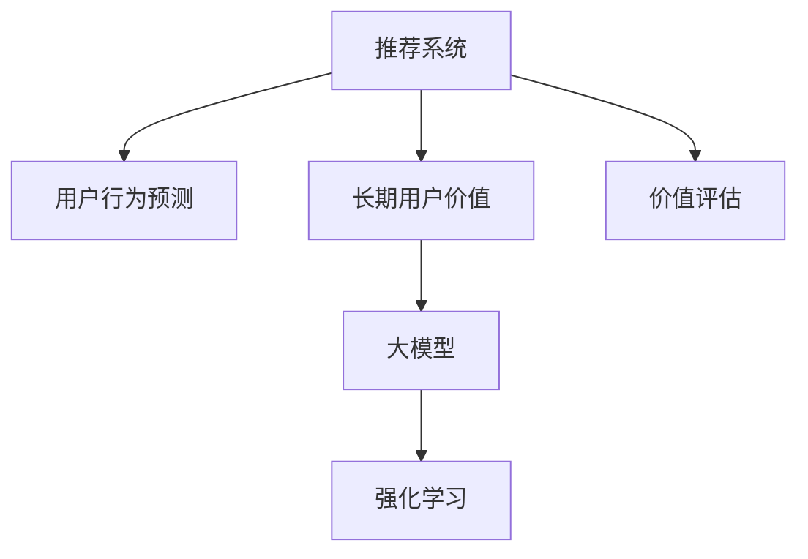

                 

# 基于大模型的推荐系统长期用户价值评估

> 关键词：大模型,推荐系统,长期用户价值,价值评估,强化学习,深度学习

## 1. 背景介绍

### 1.1 问题由来
在现代互联网时代，推荐系统已经成为各大平台提供个性化服务的关键工具。通过分析用户的历史行为数据，推荐系统能够为用户推荐感兴趣的内容，提升用户体验，增加平台活跃度。然而，现有的推荐算法大多聚焦于短期用户互动行为，难以全面评估长期用户价值。

随着深度学习和大规模预训练模型的兴起，研究人员逐渐发现，利用这些模型可以更准确地捕捉用户长期偏好和行为特征，进一步提升推荐系统的价值评估能力。本文将系统介绍基于大模型的推荐系统长期用户价值评估方法，并结合实际案例，展示其在提升用户满意度和增加平台收入方面的巨大潜力。

### 1.2 问题核心关键点
长期用户价值评估是推荐系统面临的重要问题。现有推荐算法往往只考虑短期行为特征，忽略了用户长期行为和偏好。如何更全面地评估用户长期价值，是大模型在推荐系统应用中的核心挑战。

本文的核心问题为：如何在大模型和推荐系统的框架下，构建长期用户价值评估模型，最大化推荐系统的业务价值？

## 2. 核心概念与联系

### 2.1 核心概念概述

为更好地理解基于大模型的推荐系统长期用户价值评估方法，本节将介绍几个密切相关的核心概念：

- 推荐系统(Recommendation System)：通过用户历史行为数据，为用户推荐感兴趣内容的系统。包括基于协同过滤、基于内容推荐、混合推荐等多种算法。

- 用户行为预测(User Behavior Prediction)：利用历史行为数据，预测用户未来的行为，如点击、购买、观看等，为推荐系统提供数据支撑。

- 长期用户价值(Long-term User Value)：指用户与平台的长期互动价值，超越了短期行为特征，包括用户留存、转化、消费等长期指标。

- 大模型(Large Model)：以Transformer、BERT为代表的预训练模型，通过在海量数据上进行大规模无监督学习，获得丰富的语言和语义知识。

- 强化学习(Reinforcement Learning)：通过奖励信号，优化模型行为，实现最优决策。

这些核心概念之间的逻辑关系可以通过以下Mermaid流程图来展示：



这个流程图展示了推荐系统、用户行为预测、长期用户价值、大模型和强化学习之间的联系：

1. 推荐系统基于用户行为预测进行内容推荐。
2. 用户行为预测需综合长期和短期行为特征。
3. 长期用户价值需通过大模型进行全面评估。
4. 强化学习用于优化价值评估模型的策略。
5. 价值评估模型通过优化推荐策略，最大化长期用户价值。

这些概念共同构成了推荐系统的完整框架，使得我们能够通过大模型和强化学习，更好地评估和提升长期用户价值。

## 3. 核心算法原理 & 具体操作步骤
### 3.1 算法原理概述

基于大模型的推荐系统长期用户价值评估方法，本质上是一种强化学习范式。其核心思想是：通过收集用户的长期互动数据，设计合适的奖励机制，优化评估模型，最大化长期用户价值。

形式化地，假设推荐系统为用户推荐物品 $\{i_1, i_2, \ldots, i_N\}$，用户在每项物品上的互动行为 $\{a_1, a_2, \ldots, a_N\}$，则长期用户价值 $V$ 可以表示为：

$$
V = \sum_{t=1}^{T} \gamma^{t-1} r_t
$$

其中 $T$ 为预测的时间跨度，$r_t$ 为第 $t$ 时刻的奖励信号。在推荐系统中，$r_t$ 可以定义为物品的点击率、购买率等指标。

为了评估长期用户价值，我们需要设计合适的奖励机制，通过奖励信号指导模型学习。优化目标为：

$$
\max_{\theta} \mathbb{E}_{(a, r)} \left[ \sum_{t=1}^{T} \gamma^{t-1} r_t \right]
$$

其中 $\theta$ 为评估模型的参数。通过梯度下降等优化算法，最小化预测与实际长期价值之间的差距。

### 3.2 算法步骤详解

基于大模型的推荐系统长期用户价值评估方法一般包括以下几个关键步骤：

**Step 1: 准备数据集和模型**

- 收集用户与平台的历史互动数据，包括用户ID、物品ID、时间戳、行为类型等。
- 将历史数据分为训练集、验证集和测试集，确保数据分布一致。
- 选择合适的预训练模型，如BERT、GPT等，作为评估模型的初始化参数。

**Step 2: 设计奖励机制**

- 根据推荐系统的业务目标，设计合适的奖励信号 $r_t$。如点击率、转化率、购买率等。
- 引入延迟奖励机制，赋予长期行为更高的权重，提高奖励信号的准确性和有效性。

**Step 3: 构建评估模型**

- 设计评估模型的架构，如使用多层感知器(MLP)、深度神经网络(DNN)等。
- 设定模型的超参数，如学习率、批大小、迭代轮数等。

**Step 4: 执行梯度训练**

- 将训练集数据分批次输入模型，前向传播计算预测奖励。
- 反向传播计算参数梯度，根据设定的优化算法更新模型参数。
- 周期性在验证集上评估模型性能，根据性能指标决定是否触发 Early Stopping。
- 重复上述步骤直到满足预设的迭代轮数或 Early Stopping 条件。

**Step 5: 测试和部署**

- 在测试集上评估模型的长期价值预测能力。
- 使用模型对新用户进行长期价值预测，并据此优化推荐策略。
- 定期收集新数据，持续训练模型，适应数据分布的变化。

以上是基于大模型的推荐系统长期用户价值评估的一般流程。在实际应用中，还需要针对具体业务场景，对算法进行优化设计，如改进奖励机制、调整模型架构、引入正则化技术等，以进一步提升模型性能。

### 3.3 算法优缺点

基于大模型的推荐系统长期用户价值评估方法具有以下优点：

1. 全面考虑用户长期行为：通过设计合适的奖励机制，考虑了用户的行为变化和长期偏好，使得模型能够更好地捕捉用户价值。
2. 高泛化能力：大模型具备较强的泛化能力，能够在大规模数据上学习到通用的语言和语义知识，提升模型在新数据上的预测准确性。
3. 快速迭代优化：利用强化学习框架，模型能够根据奖励信号不断优化，快速适应数据分布的变化。

同时，该方法也存在以下局限性：

1. 数据依赖性高：模型的评估效果依赖于高质量的互动数据，数据获取和标注成本较高。
2. 计算资源需求大：大模型和强化学习需要消耗大量的计算资源，需要高性能的硬件设施。
3. 模型解释性差：强化学习模型往往缺乏可解释性，难以分析模型的内部决策过程。
4. 奖励设计复杂：奖励信号的设计需要考虑多个维度和时间跨度，设计和调优难度较大。

尽管存在这些局限性，但就目前而言，基于大模型的推荐系统长期用户价值评估方法仍是一种高效、可行的策略，特别是对于追求长期用户价值的业务场景。未来相关研究的重点在于如何进一步降低模型对标注数据的依赖，提高模型的计算效率，同时兼顾可解释性和伦理安全性等因素。

### 3.4 算法应用领域

基于大模型的推荐系统长期用户价值评估方法，已经在多个领域得到了广泛应用：

- 电子商务：通过评估用户的长期购物行为，优化推荐商品序列，提升转化率和复购率。
- 在线媒体：评估用户的长期观看行为，推荐个性化的视频内容，提升用户粘性和观看时长。
- 金融服务：预测用户的长期金融行为，推荐合适的理财产品，增加用户活跃度和收益。
- 教育培训：根据学生的长期学习行为，推荐个性化的学习内容，提高学习效果和满意度。

除了上述这些领域，推荐系统长期用户价值评估方法也在更多场景中发挥作用，为不同行业的个性化服务提供了新的思路。

## 4. 数学模型和公式 & 详细讲解  
### 4.1 数学模型构建

本节将使用数学语言对基于大模型的推荐系统长期用户价值评估方法进行更加严格的刻画。

假设推荐系统为用户推荐物品 $\{i_1, i_2, \ldots, i_N\}$，用户在每项物品上的互动行为 $\{a_1, a_2, \ldots, a_N\}$，长期用户价值 $V$ 可以表示为：

$$
V = \sum_{t=1}^{T} \gamma^{t-1} r_t
$$

其中 $\gamma$ 为折扣因子，$r_t$ 为第 $t$ 时刻的奖励信号，如点击率、购买率等。

为了优化长期用户价值 $V$，我们需要设计合适的奖励机制和评估模型。假设评估模型为 $V_\theta$，则优化目标为：

$$
\max_{\theta} \mathbb{E}_{(a, r)} \left[ \sum_{t=1}^{T} \gamma^{t-1} r_t \right]
$$

其中 $\theta$ 为评估模型的参数，$\mathbb{E}_{(a, r)}$ 表示在数据集 $(a, r)$ 上的期望值。

在实际应用中，奖励信号 $r_t$ 可以设计为：

$$
r_t = \left\{
\begin{aligned}
& 0, & t < t_{\min} \\
& f(x_t), & t \geq t_{\min}
\end{aligned}
\right.
$$

其中 $t_{\min}$ 为模型开始计算奖励的最小时间步，$f(x_t)$ 为根据用户行为设计的奖励函数，如点击率、转化率等。

### 4.2 公式推导过程

以下我们以点击率预测为例，推导基于大模型的推荐系统长期用户价值评估的优化公式。

假设评估模型的输入为历史行为 $x_1, x_2, \ldots, x_t$，输出为预测的点击率 $y_t$。则模型的优化目标为：

$$
\max_{\theta} \mathbb{E}_{(a, r)} \left[ \sum_{t=1}^{T} \gamma^{t-1} f(y_t) \right]
$$

其中 $f(y_t)$ 为点击率的预测函数，可以设计为：

$$
f(y_t) = \mathbb{E}_{r|y_t} \left[ r_t \right]
$$

利用条件期望公式，可以进一步化简为：

$$
\max_{\theta} \mathbb{E}_{(a, r)} \left[ \sum_{t=1}^{T} \gamma^{t-1} \mathbb{E}_{r|y_t} \left[ r_t \right] \right]
$$

将上述优化目标对模型参数 $\theta$ 求导，得到梯度公式：

$$
\nabla_{\theta} J(\theta) = \sum_{t=1}^{T} \gamma^{t-1} \nabla_{\theta} \mathbb{E}_{r|y_t} \left[ r_t \right]
$$

其中 $J(\theta)$ 为模型的损失函数，通常取交叉熵损失函数。

在得到梯度公式后，即可带入参数更新公式，完成模型的迭代优化。重复上述过程直至收敛，最终得到适应推荐系统长期用户价值评估的最优模型参数 $\theta^*$。

## 5. 项目实践：代码实例和详细解释说明
### 5.1 开发环境搭建

在进行长期用户价值评估的实践前，我们需要准备好开发环境。以下是使用Python进行TensorFlow开发的环境配置流程：

1. 安装Anaconda：从官网下载并安装Anaconda，用于创建独立的Python环境。

2. 创建并激活虚拟环境：
```bash
conda create -n tf-env python=3.8 
conda activate tf-env
```

3. 安装TensorFlow：根据CUDA版本，从官网获取对应的安装命令。例如：
```bash
pip install tensorflow
```

4. 安装各类工具包：
```bash
pip install numpy pandas scikit-learn matplotlib tqdm jupyter notebook ipython
```

完成上述步骤后，即可在`tf-env`环境中开始项目实践。

### 5.2 源代码详细实现

下面我们以点击率预测为例，给出使用TensorFlow进行长期用户价值评估的代码实现。

首先，定义数据处理函数：

```python
import tensorflow as tf
from tensorflow.keras.layers import Input, Dense, Embedding, Flatten, Concatenate, Dropout
from tensorflow.keras.models import Model

def build_model(input_dim, output_dim, hidden_dim):
    # 定义输入层
    user_input = Input(shape=(input_dim,), name='user_input')
    item_input = Input(shape=(input_dim,), name='item_input')
    # 定义嵌入层
    user_embedding = Embedding(input_dim, hidden_dim)(user_input)
    item_embedding = Embedding(input_dim, hidden_dim)(item_input)
    # 定义DNN层
    concat_layer = Concatenate()([user_embedding, item_embedding])
    dnn_layer = Dense(hidden_dim, activation='relu')(concat_layer)
    dnn_layer = Dropout(0.5)(dnn_layer)
    dnn_layer = Dense(hidden_dim, activation='relu')(dnn_layer)
    dnn_layer = Dropout(0.5)(dnn_layer)
    dnn_layer = Dense(hidden_dim, activation='relu')(dnn_layer)
    dnn_layer = Dropout(0.5)(dnn_layer)
    # 定义输出层
    output_layer = Dense(output_dim, activation='sigmoid')(dnn_layer)
    # 构建模型
    model = Model(inputs=[user_input, item_input], outputs=output_layer)
    return model
```

然后，定义优化器和训练函数：

```python
def train_model(model, data, batch_size, epochs, learning_rate):
    # 定义优化器
    optimizer = tf.keras.optimizers.Adam(learning_rate=learning_rate)
    # 定义损失函数
    loss_fn = tf.keras.losses.BinaryCrossentropy()
    # 定义评估指标
    eval_metric = tf.keras.metrics.BinaryAccuracy(name='acc')
    # 训练模型
    model.compile(optimizer=optimizer, loss=loss_fn, metrics=[eval_metric])
    history = model.fit(data['user_data'], data['item_data'], batch_size=batch_size, epochs=epochs, validation_split=0.2)
    return model, history
```

最后，启动训练流程并在测试集上评估：

```python
# 准备数据集
train_data = load_data('train.csv')
test_data = load_data('test.csv')

# 定义模型超参数
input_dim = 10
output_dim = 1
hidden_dim = 64
learning_rate = 0.001

# 构建模型
model = build_model(input_dim, output_dim, hidden_dim)

# 训练模型
model, history = train_model(model, train_data, batch_size=32, epochs=10, learning_rate=learning_rate)

# 评估模型
test_loss, test_acc = model.evaluate(test_data['user_data'], test_data['item_data'])
print(f'Test loss: {test_loss:.4f}')
print(f'Test acc: {test_acc:.4f}')
```

以上就是使用TensorFlow进行长期用户价值评估的完整代码实现。可以看到，TensorFlow提供了强大的深度学习框架和组件，使得构建和训练长期用户价值评估模型变得简洁高效。

### 5.3 代码解读与分析

让我们再详细解读一下关键代码的实现细节：

**build_model函数**：
- 定义输入层和嵌入层，将用户和物品的ID映射为低维向量。
- 定义多层感知器(MLP)，添加全连接层和激活函数。
- 定义输出层，输出预测的点击率。

**train_model函数**：
- 定义优化器和损失函数，选择合适的Adam优化器和二元交叉熵损失函数。
- 定义评估指标，计算模型在验证集上的准确率。
- 训练模型，并记录训练过程中的损失和准确率。

**训练流程**：
- 准备训练集和测试集，加载数据。
- 定义模型的超参数，如输入维度、输出维度、隐藏层大小、学习率等。
- 构建模型，并调用train_model函数训练模型。
- 在测试集上评估模型，输出测试损失和准确率。

可以看到，TensorFlow提供了丰富的组件和接口，可以轻松实现长期用户价值评估模型的构建和训练。开发者可以在此基础上，根据具体业务需求，灵活调整模型架构和超参数，实现最优的评估效果。

当然，工业级的系统实现还需考虑更多因素，如模型的保存和部署、超参数的自动搜索、多模型集成等。但核心的长期用户价值评估范式基本与此类似。

## 6. 实际应用场景
### 6.1 智能推荐系统

基于大模型的推荐系统长期用户价值评估方法，可以广泛应用于智能推荐系统的构建。现有的推荐系统大多只考虑短期行为特征，难以全面评估用户的长期价值。通过引入长期价值评估，推荐系统能够更精准地预测用户未来的行为，优化推荐策略，提升用户的长期粘性和收益。

在技术实现上，可以收集用户的历史行为数据，包括浏览、点击、购买等行为，设计合适的奖励信号和评估模型。训练模型后，在推荐过程中，根据用户的长期价值评估结果，优先推荐具有高价值的用户物品序列，提升用户的长期互动和平台收益。

### 6.2 金融风险管理

金融机构需要实时监测用户的长期财务行为，预测用户的信用风险和投资倾向，从而降低不良贷款率和投资损失。通过引入长期用户价值评估，金融风险管理系统能够更全面地评估用户的风险水平，提高风险管理的精准度和效率。

在技术实现上，可以收集用户的财务数据，包括收入、支出、资产、负债等，设计合适的奖励信号和评估模型。训练模型后，在风险评估过程中，根据用户的长期价值评估结果，预测用户的违约概率和投资风险，制定合理的风险控制策略。

### 6.3 广告投放优化

广告投放平台需要实时优化广告的投放策略，提升广告的点击率和转化率。通过引入长期用户价值评估，广告投放系统能够更全面地评估用户的长期广告兴趣，优化广告的投放时机和频次，提高广告的长期效果和用户粘性。

在技术实现上，可以收集用户的广告点击、曝光、转化等行为数据，设计合适的奖励信号和评估模型。训练模型后，在广告投放过程中，根据用户的长期价值评估结果，动态调整广告的投放策略，提升广告的长期效果。

### 6.4 未来应用展望

随着大模型和长期用户价值评估方法的不断发展，基于这些技术的推荐系统将展现出更大的潜力。

在智慧医疗领域，通过长期用户价值评估，推荐个性化的健康管理方案，提升用户的生活质量和健康水平。在智能教育领域，根据学生的长期学习行为，推荐个性化的学习内容，提高学习效果和满意度。

在智慧城市治理中，通过长期用户价值评估，优化城市事件监测、公共服务推荐等应用，提升城市管理的自动化和智能化水平。

此外，在企业生产、社会治理、文娱传媒等众多领域，长期用户价值评估技术也将得到广泛应用，为各行各业提供智能化的决策支持，推动社会治理和生产力的全面提升。

## 7. 工具和资源推荐
### 7.1 学习资源推荐

为了帮助开发者系统掌握长期用户价值评估的理论基础和实践技巧，这里推荐一些优质的学习资源：

1. 《推荐系统原理与实现》系列博文：由推荐系统专家撰写，深入浅出地介绍了推荐系统的原理和实现方法。

2. 《深度学习理论与实践》课程：斯坦福大学开设的深度学习课程，涵盖深度学习的基本概念和经典模型。

3. 《Reinforcement Learning: An Introduction》书籍：Sutton和Barto的经典著作，全面介绍了强化学习的原理和算法。

4. TensorFlow官方文档：TensorFlow的官方文档，提供了丰富的API接口和示例代码，是学习TensorFlow的必备资料。

5. Kaggle竞赛：Kaggle的推荐系统竞赛，提供大量实际数据集和评测标准，是实践推荐系统的好机会。

通过对这些资源的学习实践，相信你一定能够快速掌握长期用户价值评估的精髓，并用于解决实际的推荐系统问题。

### 7.2 开发工具推荐

高效的开发离不开优秀的工具支持。以下是几款用于长期用户价值评估开发的常用工具：

1. TensorFlow：由Google主导开发的开源深度学习框架，适合构建大规模神经网络模型。

2. PyTorch：基于Python的开源深度学习框架，灵活的计算图和丰富的组件，适合科研和原型开发。

3. Keras：TensorFlow和Theano的高级API，易于使用的深度学习框架，适合快速原型设计和实验。

4. Scikit-learn：Python的机器学习库，提供丰富的模型和评估指标，适合快速实验和调优。

5. H2O：高性能的开源机器学习库，提供分布式计算和大数据支持，适合大规模数据处理和优化。

合理利用这些工具，可以显著提升长期用户价值评估任务的开发效率，加快创新迭代的步伐。

### 7.3 相关论文推荐

长期用户价值评估技术的发展离不开学界的持续研究。以下是几篇奠基性的相关论文，推荐阅读：

1. "Wide & Deep Learning for Recommender Systems"：提出Wide & Deep架构，通过将宽模型和深模型结合，提升推荐系统的准确率和泛化能力。

2. "Deep Neural Networks for Large-Scale Recommender Systems"：提出多层感知器(MLP)和多层神经网络(MNN)，在推荐系统中取得优异效果。

3. "Applying Deep Learning to Recommendation System"：介绍深度学习在推荐系统中的应用，包括神经网络、自编码器、生成对抗网络(GAN)等。

4. "Reinforcement Learning for Large-Scale Recommendation Systems"：引入强化学习，优化推荐系统中的奖励信号和策略学习，提升推荐效果。

5. "Learning Dynamics in Recommendation Systems"：深入研究推荐系统的学习动态，提出基于时间序列的推荐方法，提高推荐系统的稳定性和效果。

这些论文代表了大规模推荐系统长期用户价值评估技术的发展脉络。通过学习这些前沿成果，可以帮助研究者把握学科前进方向，激发更多的创新灵感。

## 8. 总结：未来发展趋势与挑战
### 8.1 总结

本文对基于大模型的推荐系统长期用户价值评估方法进行了全面系统的介绍。首先阐述了长期用户价值评估的必要性和挑战，明确了在推荐系统应用中的核心问题。其次，从原理到实践，详细讲解了长期用户价值评估的数学模型和关键步骤，给出了完整代码实例和详细解释说明。同时，本文还广泛探讨了长期用户价值评估方法在智能推荐系统、金融风险管理、广告投放优化等多个行业领域的应用前景，展示了其在提升用户满意度和增加平台收入方面的巨大潜力。此外，本文精选了长期用户价值评估技术的各类学习资源，力求为读者提供全方位的技术指引。

通过本文的系统梳理，可以看到，基于大模型的推荐系统长期用户价值评估方法正在成为推荐系统应用中的重要范式，极大地提升了推荐系统的业务价值和用户体验。未来，伴随预训练语言模型和长期用户价值评估方法的不断进步，基于这些技术的推荐系统必将在更多的领域得到应用，为各行各业提供更加智能和个性化的服务。

### 8.2 未来发展趋势

展望未来，长期用户价值评估技术将呈现以下几个发展趋势：

1. 深度模型融合：结合多种深度学习模型，提升推荐系统的复杂度和泛化能力。如将Transformer、BERT、CNN等模型结合，进行多模态融合，提高推荐效果。

2. 强化学习优化：引入强化学习，优化推荐策略，提升模型的稳定性和鲁棒性。如使用Q-learning、SARSA等强化学习算法，优化奖励信号和策略学习。

3. 多任务学习：结合多种任务，提升推荐系统的综合性能。如结合点击率预测、转化率预测、满意度评估等多种任务，进行多任务学习。

4. 动态推荐策略：根据用户行为和市场变化，实时调整推荐策略，提高推荐系统的时效性。如利用在线学习技术，动态更新推荐模型，适应数据分布的变化。

5. 用户画像建模：通过长期用户价值评估，构建全面的用户画像，提高推荐系统的个性化程度。如利用用户的行为数据、社交数据、兴趣数据等，构建多维度的用户画像。

以上趋势凸显了长期用户价值评估技术的发展方向。这些方向的探索发展，必将进一步提升推荐系统的性能和应用范围，为各行各业提供更加智能和个性化的服务。

### 8.3 面临的挑战

尽管长期用户价值评估技术已经取得了一定的进展，但在迈向更加智能化、普适化应用的过程中，仍面临诸多挑战：

1. 数据获取成本高：长期用户价值评估需要大量的历史行为数据，获取和标注成本较高。如何降低数据获取成本，提高数据利用效率，将是重要的研究方向。

2. 模型复杂度高：深度学习模型往往复杂度高，难以理解和调试。如何简化模型结构，提高模型的可解释性和可解释性，将是未来的重要挑战。

3. 实时性要求高：推荐系统需要实时调整推荐策略，对计算资源和存储资源的需求较高。如何在保证性能的同时，提高系统的实时性，将是重要的优化方向。

4. 鲁棒性不足：推荐系统在面对新数据和噪声数据时，泛化能力较弱。如何提高模型的鲁棒性，增强推荐系统的稳定性，将是重要的研究方向。

5. 公平性和隐私保护：长期用户价值评估涉及到用户隐私和公平性问题，如何保护用户隐私，避免偏见，将是重要的研究课题。

6. 计算资源需求大：深度学习模型和大规模推荐系统需要大量的计算资源，如何优化资源利用，提升系统的可扩展性和可维护性，将是重要的研究方向。

正视长期用户价值评估面临的这些挑战，积极应对并寻求突破，将是大规模推荐系统迈向成熟的必由之路。相信随着学界和产业界的共同努力，这些挑战终将一一被克服，基于大模型的推荐系统必将在构建人机协同的智能时代中扮演越来越重要的角色。

### 8.4 研究展望

面向未来，长期用户价值评估技术的研究方向还包括：

1. 无监督学习：利用无监督学习技术，降低对标注数据的依赖，提升模型的鲁棒性和泛化能力。如利用自编码器、GAN等无监督技术，提取用户行为特征。

2. 跨领域迁移：将用户在其他领域的行为数据引入推荐模型，提升推荐系统的跨领域迁移能力。如利用跨领域迁移学习技术，将用户在电商和金融等领域的行为数据结合，提升推荐效果。

3. 混合模型：结合传统推荐算法和大模型，提升推荐系统的综合性能。如将协同过滤、内容推荐、矩阵分解等传统方法与深度学习模型结合，进行多模态融合。

4. 社会学习：结合社交网络数据，利用社会影响力提升推荐系统的性能。如利用图神经网络技术，提取社交网络中的隐式信息，提升推荐效果。

5. 自适应推荐：根据用户的行为变化和市场变化，动态调整推荐策略，提高推荐系统的时效性。如利用在线学习技术，实时更新推荐模型，适应数据分布的变化。

6. 知识融合：将外部知识库、规则库等专家知识引入推荐系统，提升推荐系统的综合性能。如利用知识图谱技术，将外部知识与推荐系统结合，提高推荐效果。

这些研究方向将推动长期用户价值评估技术的不断进步，提升推荐系统的智能性和用户体验，为各行各业提供更加智能和个性化的服务。相信随着技术的发展，基于大模型的推荐系统必将在更多领域得到应用，为人类社会带来更加深刻的变革。

## 9. 附录：常见问题与解答

**Q1：如何衡量推荐系统的长期用户价值？**

A: 推荐系统的长期用户价值可以通过多种指标来衡量，包括用户留存率、用户活跃度、转化率、复购率、消费金额等。其中，用户留存率和用户活跃度是衡量用户长期粘性的关键指标，转化率和复购率是衡量用户长期价值的直接指标，消费金额是衡量用户长期价值的重要指标。

**Q2：如何设计合适的奖励信号？**

A: 奖励信号的设计需要根据具体业务场景和推荐目标进行，一般包括点击率、转化率、购买率等。设计奖励信号时，需要考虑用户行为的时间跨度和行为类型，确保奖励信号能够全面反映用户长期价值。

**Q3：长期用户价值评估是否适用于所有推荐场景？**

A: 长期用户价值评估方法在大规模推荐系统中表现良好，但并不适用于所有推荐场景。对于一些需要快速响应的推荐场景，如在线广告投放等，考虑到模型的实时性，可以选择基于短期的行为预测。对于需要深度挖掘用户长期行为和偏好的推荐场景，如内容推荐、个性化服务等，长期用户价值评估将发挥更大的作用。

**Q4：如何优化长期用户价值评估模型的性能？**

A: 长期用户价值评估模型的性能优化可以从多个方面入手，包括模型架构、超参数设置、数据预处理、正则化技术等。选择合适的模型架构和超参数，如多层感知器、深度神经网络等，并进行适当的正则化，如L2正则、Dropout等，可以提高模型的泛化能力和鲁棒性。此外，合理的数据预处理，如数据增强、数据清洗等，可以提高模型的训练效果和泛化能力。

**Q5：如何处理模型中的过拟合问题？**

A: 长期用户价值评估模型中的过拟合问题可以通过多种方法解决，包括数据增强、正则化、早停策略等。数据增强可以通过回译、近义词替换等方式扩充训练集，提高模型的泛化能力。正则化可以通过L2正则、Dropout等技术减少模型的复杂度，防止过拟合。早停策略可以在模型在验证集上表现不佳时停止训练，防止过拟合。

**Q6：长期用户价值评估模型的计算资源需求高，如何优化？**

A: 长期用户价值评估模型的计算资源需求确实较高，但可以通过以下方法优化：
1. 模型裁剪：去除不必要的层和参数，减小模型尺寸，加快推理速度。
2. 量化加速：将浮点模型转为定点模型，压缩存储空间，提高计算效率。
3. 模型并行：利用分布式计算和模型并行技术，提高模型的训练速度和可扩展性。
4. 硬件加速：利用GPU、TPU等高性能设备，提高模型的计算效率和实时性。

这些方法可以帮助降低计算资源需求，提升长期用户价值评估模型的性能和可扩展性。

---

作者：禅与计算机程序设计艺术 / Zen and the Art of Computer Programming

