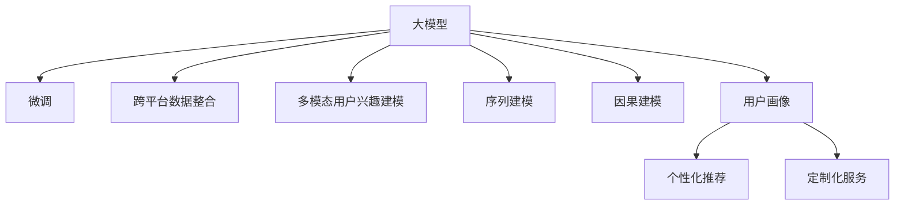

                 

# 基于大模型的跨平台用户兴趣建模

## 1. 背景介绍

### 1.1 问题由来
随着互联网技术的迅猛发展，在线平台的用户兴趣建模成为了个性化推荐、内容分发、广告定向等应用场景中的重要课题。传统的用户兴趣建模方法主要基于静态的用户历史数据和行为特征，如点击记录、浏览历史、评分数据等，通过统计分析、协同过滤、因子分解等技术提取用户兴趣，实现精准推荐和广告投放。

然而，这些基于历史数据的兴趣建模方法存在以下局限性：
- **历史数据稀疏性**：新用户和冷启动用户通常没有足够的历史数据，无法准确提取其兴趣。
- **静态性**：用户兴趣随着时间推移而动态变化，历史数据难以捕捉最新的兴趣变化。
- **跨平台异构性**：用户在多个平台上的兴趣数据分散在不同格式、不同领域，难以整合。

大模型技术通过在大规模语料库上进行预训练，学习到通用的语言知识和表达能力，具备强大的语义理解和生成能力。在微调框架下，大模型可以在少量标注数据上快速适配特定任务，从而实现跨平台的用户兴趣建模。

## 2. 核心概念与联系

### 2.1 核心概念概述

为更好地理解基于大模型的跨平台用户兴趣建模方法，本节将介绍几个密切相关的核心概念：

- **大模型(Large Model)**：以自回归(如GPT)或自编码(如BERT)模型为代表的大规模预训练语言模型。通过在大规模语料库上进行预训练，学习通用的语言表示，具备强大的语言理解和生成能力。

- **微调(Fine-tuning)**：指在预训练模型的基础上，使用下游任务的少量标注数据，通过有监督地训练优化模型在特定任务上的性能。通常只需要调整顶层分类器或解码器，并以较小的学习率更新全部或部分模型参数。

- **跨平台数据整合**：不同平台上的用户兴趣数据通常以不同的格式存在，需要通过数据清洗、转换、标准化等技术，将数据整合到统一格式，供后续建模使用。

- **多模态用户兴趣建模**：现代用户不仅在文本数据上产生兴趣，也在图片、视频、音频等多模态数据上产生兴趣，需要将这些多模态数据综合考虑，构建全面的用户兴趣模型。

- **序列建模**：用户的行为序列能够揭示其兴趣的演变过程，通过时间序列分析和序列建模技术，可以更全面地捕捉用户的兴趣变化。

- **因果建模**：在用户兴趣建模中，理解行为与兴趣之间的因果关系，可以帮助识别潜在的因素对用户兴趣的影响，从而更准确地预测用户行为。

- **用户画像**：通过兴趣建模获取的用户兴趣特征，可以用于构建用户画像，实现个性化推荐和定制化服务。

这些核心概念之间的逻辑关系可以通过以下Mermaid流程图来展示：



这个流程图展示了大模型在用户兴趣建模中的关键概念及其之间的关系：

1. 大模型通过预训练获得基础能力。
2. 微调优化模型针对特定任务的能力。
3. 跨平台数据整合和标准化，提供统一的数据格式。
4. 多模态数据的综合考虑，构建全面的用户兴趣模型。
5. 序列建模和因果建模，捕捉用户兴趣的动态演变。
6. 通过用户画像，实现个性化推荐和定制化服务。

这些概念共同构成了基于大模型的跨平台用户兴趣建模的完整框架，使得模型能够在多个平台、多种模态下准确捕捉和预测用户的兴趣变化，从而提供更加个性化和精准的服务。

## 3. 核心算法原理 & 具体操作步骤
### 3.1 算法原理概述

基于大模型的跨平台用户兴趣建模，本质上是一个多任务的深度学习模型适配过程。其核心思想是：将大模型视作一个通用的特征提取器，通过微调框架，在多个平台和多个模态的少量标注数据上优化模型，使其能够准确捕捉和预测用户的兴趣。

形式化地，假设大模型为 $M_{\theta}$，其中 $\theta$ 为预训练得到的模型参数。给定 $k$ 个下游任务的标注数据集 $D_1,\dots,D_k$，其中每个数据集为 $D_i=\{(x_i,y_i)\}_{i=1}^N$，$x_i \in \mathcal{X}$ 为输入，$y_i \in \mathcal{Y}$ 为标签。微调的目标是找到新的模型参数 $\hat{\theta}$，使得：

$$
\hat{\theta}=\mathop{\arg\min}_{\theta} \mathcal{L}(M_{\theta},D_1,\dots,D_k)
$$

其中 $\mathcal{L}$ 为针对所有任务设计的联合损失函数，用于衡量模型在所有任务上的总体性能。常见的联合损失函数包括交叉熵损失、均方误差损失等。

通过梯度下降等优化算法，微调过程不断更新模型参数 $\theta$，最小化联合损失函数 $\mathcal{L}$，使得模型在所有任务上的输出逼近真实标签。由于 $\theta$ 已经通过预训练获得了较好的初始化，因此即便在多个平台和模态的少量标注数据上，也能较快收敛到理想的模型参数 $\hat{\theta}$。

### 3.2 算法步骤详解

基于大模型的跨平台用户兴趣建模一般包括以下几个关键步骤：

**Step 1: 准备预训练模型和数据集**
- 选择合适的预训练语言模型 $M_{\theta}$ 作为初始化参数，如 BERT、GPT等。
- 准备 $k$ 个下游任务的标注数据集 $D_1,\dots,D_k$，划分为训练集、验证集和测试集。一般要求标注数据与预训练数据的分布不要差异过大。

**Step 2: 设计任务适配层**
- 根据任务类型，在预训练模型顶层设计合适的输出层和损失函数。
- 对于分类任务，通常在顶层添加线性分类器和交叉熵损失函数。
- 对于生成任务，通常使用语言模型的解码器输出概率分布，并以负对数似然为损失函数。
- 对于多模态任务，设计多个独立的适配层，分别对文本、图像、音频等数据进行处理。

**Step 3: 设置微调超参数**
- 选择合适的优化算法及其参数，如 AdamW、SGD 等，设置学习率、批大小、迭代轮数等。
- 设置正则化技术及强度，包括权重衰减、Dropout、Early Stopping 等。
- 确定冻结预训练参数的策略，如仅微调顶层，或全部参数都参与微调。

**Step 4: 执行梯度训练**
- 将训练集数据分批次输入模型，前向传播计算损失函数。
- 反向传播计算参数梯度，根据设定的优化算法和学习率更新模型参数。
- 周期性在验证集上评估模型性能，根据性能指标决定是否触发 Early Stopping。
- 重复上述步骤直到满足预设的迭代轮数或 Early Stopping 条件。

**Step 5: 测试和部署**
- 在测试集上评估微调后模型 $M_{\hat{\theta}}$ 的性能，对比微调前后的精度提升。
- 使用微调后的模型对新样本进行推理预测，集成到实际的应用系统中。
- 持续收集新的数据，定期重新微调模型，以适应数据分布的变化。

以上是基于大模型的跨平台用户兴趣建模的一般流程。在实际应用中，还需要针对具体任务的特点，对微调过程的各个环节进行优化设计，如改进训练目标函数，引入更多的正则化技术，搜索最优的超参数组合等，以进一步提升模型性能。

### 3.3 算法优缺点

基于大模型的跨平台用户兴趣建模方法具有以下优点：
1. **泛化能力强**：大模型经过预训练，在多个平台和模态的数据上都能获得良好的泛化能力。
2. **少样本学习能力强**：大模型具备较强的少样本学习能力，在少量标注数据上也能取得不错的性能。
3. **适应性强**：大模型能够适应跨平台数据的标准化和多样化，对不同数据格式和数据源具有较好的兼容性。
4. **可解释性好**：大模型的决策过程可以借助预训练语言模型和微调结果，提供一定的解释性。
5. **可扩展性好**：大模型可以根据需求，添加更多的任务适配层，适应不同的兴趣建模需求。

同时，该方法也存在一定的局限性：
1. **数据获取难度大**：不同平台上的数据获取和标准化可能需要较大的工作量，尤其是跨领域数据。
2. **模型复杂度高**：大模型的参数量较大，微调时需要进行较多的参数更新，计算资源需求较高。
3. **模型解释性不足**：尽管大模型的决策过程可以提供一定的解释性，但仍然难以完全理解其内部工作机制。
4. **隐私保护问题**：跨平台数据整合可能涉及用户隐私问题，需要严格的隐私保护措施。
5. **计算成本高**：微调大模型通常需要较大的计算资源，包括高性能的GPU/TPU等设备。

尽管存在这些局限性，但就目前而言，基于大模型的跨平台用户兴趣建模方法仍是一种高效、灵活的建模范式，特别是在多模态数据整合和个性化推荐场景中，具有明显的优势。

### 3.4 算法应用领域

基于大模型的跨平台用户兴趣建模，已经在多个领域得到了广泛的应用，例如：

- **个性化推荐系统**：在电商、视频、音乐等平台，通过跨平台数据整合和用户兴趣建模，实现个性化推荐。
- **跨平台广告定向**：在社交媒体、新闻媒体等平台上，通过跨平台数据整合和兴趣建模，实现精准广告定向。
- **用户画像构建**：在多个应用场景中，通过跨平台用户兴趣建模，构建全面的用户画像，实现用户行为预测和个性化服务。
- **内容推荐与分发**：在新闻、视频、在线教育等平台上，通过跨平台数据整合和用户兴趣建模，实现内容推荐与分发。
- **舆情监测**：在社交媒体、新闻媒体等平台上，通过跨平台数据整合和兴趣建模，实现舆情监测和情感分析。

除了上述这些经典应用外，基于大模型的跨平台用户兴趣建模还被创新性地应用到更多场景中，如智慧城市、金融科技、医疗健康等，为这些领域的数字化转型提供了新的技术支持。

## 4. 数学模型和公式 & 详细讲解  
### 4.1 数学模型构建

本节将使用数学语言对基于大模型的跨平台用户兴趣建模过程进行更加严格的刻画。

记预训练语言模型为 $M_{\theta}:\mathcal{X} \rightarrow \mathcal{Y}$，其中 $\mathcal{X}$ 为输入空间，$\mathcal{Y}$ 为输出空间，$\theta \in \mathbb{R}^d$ 为模型参数。假设存在 $k$ 个下游任务，其训练集分别为 $D_1=\{(x_i,y_i)\}_{i=1}^N, \dots, D_k=\{(x_i,y_i)\}_{i=1}^N$，$x_i \in \mathcal{X}, y_i \in \mathcal{Y}$。

定义模型 $M_{\theta}$ 在数据样本 $(x,y)$ 上的损失函数为 $\ell(M_{\theta}(x),y)$，则在所有任务上的联合损失函数为：

$$
\mathcal{L}(\theta) = \frac{1}{N}\sum_{i=1}^N \sum_{j=1}^k \ell(M_{\theta}(x_i),y_{ij})
$$

其中 $y_{ij} \in \mathcal{Y}$ 为任务 $j$ 的标签。

微调的优化目标是最小化联合损失函数，即找到最优参数：

$$
\theta^* = \mathop{\arg\min}_{\theta} \mathcal{L}(\theta)
$$

在实践中，我们通常使用基于梯度的优化算法（如SGD、Adam等）来近似求解上述最优化问题。设 $\eta$ 为学习率，$\lambda$ 为正则化系数，则参数的更新公式为：

$$
\theta \leftarrow \theta - \eta \nabla_{\theta}\mathcal{L}(\theta) - \eta\lambda\theta
$$

其中 $\nabla_{\theta}\mathcal{L}(\theta)$ 为联合损失函数对参数 $\theta$ 的梯度，可通过反向传播算法高效计算。

### 4.2 公式推导过程

以下我们以二分类任务为例，推导交叉熵损失函数及其梯度的计算公式。

假设模型 $M_{\theta}$ 在输入 $x$ 上的输出为 $\hat{y}=M_{\theta}(x) \in [0,1]$，表示样本属于正类的概率。真实标签 $y \in \{0,1\}$。则二分类交叉熵损失函数定义为：

$$
\ell(M_{\theta}(x),y) = -[y\log \hat{y} + (1-y)\log (1-\hat{y})]
$$

将其代入联合损失函数公式，得：

$$
\mathcal{L}(\theta) = -\frac{1}{N}\sum_{i=1}^N \sum_{j=1}^k [y_{ij}\log M_{\theta}(x_i)+(1-y_{ij})\log(1-M_{\theta}(x_i))]
$$

根据链式法则，联合损失函数对参数 $\theta_k$ 的梯度为：

$$
\frac{\partial \mathcal{L}(\theta)}{\partial \theta_k} = -\frac{1}{N}\sum_{i=1}^N \sum_{j=1}^k (\frac{y_{ij}}{M_{\theta}(x_i)}-\frac{1-y_{ij}}{1-M_{\theta}(x_i)}) \frac{\partial M_{\theta}(x_i)}{\partial \theta_k}
$$

其中 $\frac{\partial M_{\theta}(x_i)}{\partial \theta_k}$ 可进一步递归展开，利用自动微分技术完成计算。

在得到联合损失函数的梯度后，即可带入参数更新公式，完成模型的迭代优化。重复上述过程直至收敛，最终得到适应所有任务的最优模型参数 $\theta^*$。

## 5. 项目实践：代码实例和详细解释说明
### 5.1 开发环境搭建

在进行用户兴趣建模实践前，我们需要准备好开发环境。以下是使用Python进行PyTorch开发的环境配置流程：

1. 安装Anaconda：从官网下载并安装Anaconda，用于创建独立的Python环境。

2. 创建并激活虚拟环境：
```bash
conda create -n pytorch-env python=3.8 
conda activate pytorch-env
```

3. 安装PyTorch：根据CUDA版本，从官网获取对应的安装命令。例如：
```bash
conda install pytorch torchvision torchaudio cudatoolkit=11.1 -c pytorch -c conda-forge
```

4. 安装Transformers库：
```bash
pip install transformers
```

5. 安装各类工具包：
```bash
pip install numpy pandas scikit-learn matplotlib tqdm jupyter notebook ipython
```

完成上述步骤后，即可在`pytorch-env`环境中开始用户兴趣建模实践。

### 5.2 源代码详细实现

这里我们以电商平台的用户兴趣建模为例，使用Transformers库对BERT模型进行跨平台用户兴趣建模的PyTorch代码实现。

首先，定义数据处理函数：

```python
from transformers import BertTokenizer
from torch.utils.data import Dataset
import torch

class UserInterestDataset(Dataset):
    def __init__(self, texts, tags, tokenizer, max_len=128):
        self.texts = texts
        self.tags = tags
        self.tokenizer = tokenizer
        self.max_len = max_len
        
    def __len__(self):
        return len(self.texts)
    
    def __getitem__(self, item):
        text = self.texts[item]
        tags = self.tags[item]
        
        encoding = self.tokenizer(text, return_tensors='pt', max_length=self.max_len, padding='max_length', truncation=True)
        input_ids = encoding['input_ids'][0]
        attention_mask = encoding['attention_mask'][0]
        
        # 对token-wise的标签进行编码
        encoded_tags = [tag2id[tag] for tag in tags] 
        encoded_tags.extend([tag2id['O']] * (self.max_len - len(encoded_tags)))
        labels = torch.tensor(encoded_tags, dtype=torch.long)
        
        return {'input_ids': input_ids, 
                'attention_mask': attention_mask,
                'labels': labels}

# 标签与id的映射
tag2id = {'O': 0, 'buy': 1, 'read': 2, 'follow': 3, 'like': 4}
id2tag = {v: k for k, v in tag2id.items()}

# 创建dataset
tokenizer = BertTokenizer.from_pretrained('bert-base-cased')

train_dataset = UserInterestDataset(train_texts, train_tags, tokenizer)
dev_dataset = UserInterestDataset(dev_texts, dev_tags, tokenizer)
test_dataset = UserInterestDataset(test_texts, test_tags, tokenizer)
```

然后，定义模型和优化器：

```python
from transformers import BertForTokenClassification, AdamW

model = BertForTokenClassification.from_pretrained('bert-base-cased', num_labels=len(tag2id))

optimizer = AdamW(model.parameters(), lr=2e-5)
```

接着，定义训练和评估函数：

```python
from torch.utils.data import DataLoader
from tqdm import tqdm
from sklearn.metrics import classification_report

device = torch.device('cuda') if torch.cuda.is_available() else torch.device('cpu')
model.to(device)

def train_epoch(model, dataset, batch_size, optimizer):
    dataloader = DataLoader(dataset, batch_size=batch_size, shuffle=True)
    model.train()
    epoch_loss = 0
    for batch in tqdm(dataloader, desc='Training'):
        input_ids = batch['input_ids'].to(device)
        attention_mask = batch['attention_mask'].to(device)
        labels = batch['labels'].to(device)
        model.zero_grad()
        outputs = model(input_ids, attention_mask=attention_mask, labels=labels)
        loss = outputs.loss
        epoch_loss += loss.item()
        loss.backward()
        optimizer.step()
    return epoch_loss / len(dataloader)

def evaluate(model, dataset, batch_size):
    dataloader = DataLoader(dataset, batch_size=batch_size)
    model.eval()
    preds, labels = [], []
    with torch.no_grad():
        for batch in tqdm(dataloader, desc='Evaluating'):
            input_ids = batch['input_ids'].to(device)
            attention_mask = batch['attention_mask'].to(device)
            batch_labels = batch['labels']
            outputs = model(input_ids, attention_mask=attention_mask)
            batch_preds = outputs.logits.argmax(dim=2).to('cpu').tolist()
            batch_labels = batch_labels.to('cpu').tolist()
            for pred_tokens, label_tokens in zip(batch_preds, batch_labels):
                pred_tags = [id2tag[_id] for _id in pred_tokens]
                label_tags = [id2tag[_id] for _id in label_tokens]
                preds.append(pred_tags[:len(label_tokens)])
                labels.append(label_tags)
                
    print(classification_report(labels, preds))
```

最后，启动训练流程并在测试集上评估：

```python
epochs = 5
batch_size = 16

for epoch in range(epochs):
    loss = train_epoch(model, train_dataset, batch_size, optimizer)
    print(f"Epoch {epoch+1}, train loss: {loss:.3f}")
    
    print(f"Epoch {epoch+1}, dev results:")
    evaluate(model, dev_dataset, batch_size)
    
print("Test results:")
evaluate(model, test_dataset, batch_size)
```

以上就是使用PyTorch对BERT进行跨平台用户兴趣建模的完整代码实现。可以看到，得益于Transformers库的强大封装，我们可以用相对简洁的代码完成BERT模型的加载和微调。

### 5.3 代码解读与分析

让我们再详细解读一下关键代码的实现细节：

**UserInterestDataset类**：
- `__init__`方法：初始化文本、标签、分词器等关键组件。
- `__len__`方法：返回数据集的样本数量。
- `__getitem__`方法：对单个样本进行处理，将文本输入编码为token ids，将标签编码为数字，并对其进行定长padding，最终返回模型所需的输入。

**tag2id和id2tag字典**：
- 定义了标签与数字id之间的映射关系，用于将token-wise的预测结果解码回真实的标签。

**训练和评估函数**：
- 使用PyTorch的DataLoader对数据集进行批次化加载，供模型训练和推理使用。
- 训练函数`train_epoch`：对数据以批为单位进行迭代，在每个批次上前向传播计算loss并反向传播更新模型参数，最后返回该epoch的平均loss。
- 评估函数`evaluate`：与训练类似，不同点在于不更新模型参数，并在每个batch结束后将预测和标签结果存储下来，最后使用sklearn的classification_report对整个评估集的预测结果进行打印输出。

**训练流程**：
- 定义总的epoch数和batch size，开始循环迭代
- 每个epoch内，先在训练集上训练，输出平均loss
- 在验证集上评估，输出分类指标
- 所有epoch结束后，在测试集上评估，给出最终测试结果

可以看到，PyTorch配合Transformers库使得BERT微调的代码实现变得简洁高效。开发者可以将更多精力放在数据处理、模型改进等高层逻辑上，而不必过多关注底层的实现细节。

当然，工业级的系统实现还需考虑更多因素，如模型的保存和部署、超参数的自动搜索、更灵活的任务适配层等。但核心的微调范式基本与此类似。

## 6. 实际应用场景
### 6.1 电商平台个性化推荐

基于大模型的跨平台用户兴趣建模，可以广泛应用于电商平台的个性化推荐系统。通过整合不同平台上的用户行为数据，构建全面的用户兴趣模型，实现个性化商品推荐。

在技术实现上，可以收集用户浏览、点击、购买等行为数据，并提取用户对商品的文字评论、评分等信息。将商品信息和用户行为数据作为输入，通过微调BERT模型，学习用户对商品的兴趣倾向。在推荐时，首先使用微调后的模型预测用户对每个商品的兴趣分数，然后综合商品的其他特征，排序输出推荐列表。如此构建的个性化推荐系统，能大幅提升用户体验和商品转化率。

### 6.2 跨平台广告定向

在线广告投放需要精准识别用户兴趣，以实现更高效的广告定向。传统的广告定向方法依赖于用户的历史行为数据，存在数据获取难度大、冷启动问题多的问题。基于大模型的跨平台用户兴趣建模，可以从不同平台上的数据中提取用户的兴趣特征，实现跨平台的精准广告定向。

具体而言，可以收集用户在社交媒体、新闻媒体、视频平台上的行为数据，并提取用户对这些平台的兴趣特征。将这些兴趣特征输入微调后的模型，即可得到用户对不同广告类型的兴趣倾向。通过广告投放平台，针对高兴趣的用户群体，进行精准的广告定向，提高广告投放的转化率和用户满意度。

### 6.3 用户画像构建

用户画像在多个应用场景中都有重要作用，如个性化推荐、市场营销、客户分析等。通过跨平台数据整合和用户兴趣建模，可以构建更加全面、准确的用户画像，实现用户行为预测和个性化服务。

在用户画像构建中，可以使用大模型学习用户在不同平台上的兴趣特征，将这些特征综合，生成用户的多维度画像。例如，通过电商行为数据和社交媒体行为数据，可以综合生成用户对商品和社交媒体的兴趣画像。在个性化推荐中，根据用户画像中的兴趣特征，推荐与其兴趣相关联的商品和服务，提升用户体验。在市场营销中，根据用户画像进行精准营销，提高用户参与度和品牌忠诚度。

### 6.4 未来应用展望

随着大模型和微调方法的不断发展，基于跨平台用户兴趣建模的技术将在更多领域得到应用，为各行各业带来变革性影响。

在智慧城市治理中，基于用户兴趣建模的用户行为预测和个性化服务，可以优化城市交通管理、环境保护、公共安全等各个方面，提升城市管理效率和居民生活质量。

在金融科技领域，通过跨平台用户兴趣建模，可以识别用户对金融产品的兴趣和需求，实现精准营销和产品推荐，提升用户满意度和业务转化率。

在智慧健康医疗中，用户在不同平台上的行为数据可以用于健康管理、疾病预测、医疗推荐等，帮助用户更好地维护健康。

此外，在教育、旅游、媒体、政务等多个领域，基于大模型的跨平台用户兴趣建模技术也将不断涌现，为各行各业带来新的发展机遇。相信随着技术的日益成熟，跨平台用户兴趣建模技术将进一步推动各行业的数字化转型，带来更高的效率和更好的用户体验。

## 7. 工具和资源推荐
### 7.1 学习资源推荐

为了帮助开发者系统掌握大模型微调的理论基础和实践技巧，这里推荐一些优质的学习资源：

1. 《Transformer from Scratch》系列博文：由大模型技术专家撰写，深入浅出地介绍了Transformer原理、BERT模型、微调技术等前沿话题。

2. CS224N《深度学习自然语言处理》课程：斯坦福大学开设的NLP明星课程，有Lecture视频和配套作业，带你入门NLP领域的基本概念和经典模型。

3. 《Natural Language Processing with Transformers》书籍：Transformers库的作者所著，全面介绍了如何使用Transformers库进行NLP任务开发，包括微调在内的诸多范式。

4. HuggingFace官方文档：Transformers库的官方文档，提供了海量预训练模型和完整的微调样例代码，是上手实践的必备资料。

5. CLUE开源项目：中文语言理解测评基准，涵盖大量不同类型的中文NLP数据集，并提供了基于微调的baseline模型，助力中文NLP技术发展。

通过对这些资源的学习实践，相信你一定能够快速掌握大模型微调的精髓，并用于解决实际的NLP问题。
###  7.2 开发工具推荐

高效的开发离不开优秀的工具支持。以下是几款用于大模型微调开发的常用工具：

1. PyTorch：基于Python的开源深度学习框架，灵活动态的计算图，适合快速迭代研究。大部分预训练语言模型都有PyTorch版本的实现。

2. TensorFlow：由Google主导开发的开源深度学习框架，生产部署方便，适合大规模工程应用。同样有丰富的预训练语言模型资源。

3. Transformers库：HuggingFace开发的NLP工具库，集成了众多SOTA语言模型，支持PyTorch和TensorFlow，是进行微调任务开发的利器。

4. Weights & Biases：模型训练的实验跟踪工具，可以记录和可视化模型训练过程中的各项指标，方便对比和调优。与主流深度学习框架无缝集成。

5. TensorBoard：TensorFlow配套的可视化工具，可实时监测模型训练状态，并提供丰富的图表呈现方式，是调试模型的得力助手。

6. Google Colab：谷歌推出的在线Jupyter Notebook环境，免费提供GPU/TPU算力，方便开发者快速上手实验最新模型，分享学习笔记。

合理利用这些工具，可以显著提升大模型微调任务的开发效率，加快创新迭代的步伐。

### 7.3 相关论文推荐

大模型和微调技术的发展源于学界的持续研究。以下是几篇奠基性的相关论文，推荐阅读：

1. Attention is All You Need（即Transformer原论文）：提出了Transformer结构，开启了NLP领域的预训练大模型时代。

2. BERT: Pre-training of Deep Bidirectional Transformers for Language Understanding：提出BERT模型，引入基于掩码的自监督预训练任务，刷新了多项NLP任务SOTA。

3. Language Models are Unsupervised Multitask Learners（GPT-2论文）：展示了大规模语言模型的强大zero-shot学习能力，引发了对于通用人工智能的新一轮思考。

4. Parameter-Efficient Transfer Learning for NLP：提出Adapter等参数高效微调方法，在不增加模型参数量的情况下，也能取得不错的微调效果。

5. Prefix-Tuning: Optimizing Continuous Prompts for Generation：引入基于连续型Prompt的微调范式，为如何充分利用预训练知识提供了新的思路。

6. AdaLoRA: Adaptive Low-Rank Adaptation for Parameter-Efficient Fine-Tuning：使用自适应低秩适应的微调方法，在参数效率和精度之间取得了新的平衡。

这些论文代表了大模型微调技术的发展脉络。通过学习这些前沿成果，可以帮助研究者把握学科前进方向，激发更多的创新灵感。

## 8. 总结：未来发展趋势与挑战

### 8.1 总结

本文对基于大模型的跨平台用户兴趣建模方法进行了全面系统的介绍。首先阐述了跨平台用户兴趣建模的背景和意义，明确了跨平台用户兴趣建模在大数据、多任务和多模态场景中的重要性。其次，从原理到实践，详细讲解了跨平台用户兴趣建模的数学原理和关键步骤，给出了跨平台用户兴趣建模任务开发的完整代码实例。同时，本文还广泛探讨了跨平台用户兴趣建模在电商平台、广告定向、用户画像构建等多个领域的应用前景，展示了跨平台用户兴趣建模技术的巨大潜力。此外，本文精选了跨平台用户兴趣建模的各类学习资源，力求为读者提供全方位的技术指引。

通过本文的系统梳理，可以看到，基于大模型的跨平台用户兴趣建模方法正在成为NLP领域的重要范式，极大地拓展了用户兴趣建模的应用边界，催生了更多的落地场景。受益于大规模语料的预训练，跨平台用户兴趣建模模型在多个平台、多种模态的数据上都能获得良好的泛化能力，显著提升了推荐系统的精准度和个性化水平。未来，伴随预训练语言模型和微调方法的不断演进，基于跨平台用户兴趣建模的技术必将在更广阔的应用领域大放异彩，深刻影响人类的生产生活方式。

### 8.2 未来发展趋势

展望未来，基于大模型的跨平台用户兴趣建模技术将呈现以下几个发展趋势：

1. **模型规模持续增大**：随着算力成本的下降和数据规模的扩张，预训练语言模型的参数量还将持续增长。超大规模语言模型蕴含的丰富语言知识，有望支撑更加复杂多变的跨平台用户兴趣建模。

2. **跨平台数据整合技术提升**：随着数据异构性问题的解决，跨平台数据整合技术将进一步优化，使得不同平台上的数据更容易标准化和整合。

3. **少样本学习与自适应学习**：未来的大模型将具备更强的少样本学习能力和自适应学习能力，在少量标注数据上也能取得不俗的效果。

4. **多模态兴趣建模**：现代用户不仅在文本数据上产生兴趣，也在图片、视频、音频等多模态数据上产生兴趣，未来的跨平台用户兴趣建模将更好地综合利用多模态数据，构建全面的用户兴趣模型。

5. **因果关系建模**：在用户兴趣建模中，理解行为与兴趣之间的因果关系，可以帮助识别潜在的因素对用户兴趣的影响，从而更准确地预测用户行为。

6. **个性化推荐与广告定向**：基于大模型的跨平台用户兴趣建模技术将进一步优化个性化推荐和广告定向的效果，实现更精准的推荐和广告投放。

以上趋势凸显了基于大模型的跨平台用户兴趣建模技术的广阔前景。这些方向的探索发展，必将进一步提升跨平台用户兴趣建模的精度和泛化能力，为个性化推荐和广告定向提供更强大的技术支持。

### 8.3 面临的挑战

尽管基于大模型的跨平台用户兴趣建模技术已经取得了显著进展，但在迈向更加智能化、普适化应用的过程中，仍面临以下挑战：

1. **数据获取难度**：跨平台数据整合需要从不同平台获取数据，数据获取难度较大，尤其是跨领域数据。

2. **隐私保护问题**：跨平台数据整合涉及用户隐私问题，需要严格的隐私保护措施，以保障用户数据的安全。

3. **计算资源需求高**：大模型的微调通常需要较大的计算资源，包括高性能的GPU/TPU等设备，这在一定程度上限制了其在实际部署中的应用。

4. **模型复杂度高**：大模型的参数量较大，微调时需要进行较多的参数更新，计算资源需求较高。

5. **模型解释性不足**：尽管大模型的决策过程可以提供一定的解释性，但仍然难以完全理解其内部工作机制。

6. **模型泛化能力差**：尽管跨平台用户兴趣建模模型在训练集上表现良好，但在测试集上泛化能力可能不足，需要进一步优化。

7. **多模态数据处理复杂**：多模态数据具有不同的特征和处理方式，如何在同一模型中综合处理这些数据，是一个复杂的问题。

8. **因果关系建模难度大**：在用户兴趣建模中，理解行为与兴趣之间的因果关系，是一个复杂的问题，需要进一步的研究。

这些挑战需要我们在未来的研究中不断突破和解决，才能使基于大模型的跨平台用户兴趣建模技术更好地落地应用，提升用户体验和业务效果。

### 8.4 研究展望

面对基于大模型的跨平台用户兴趣建模技术所面临的诸多挑战，未来的研究需要在以下几个方面寻求新的突破：

1. **数据获取与隐私保护**：开发更加高效的数据获取和隐私保护技术，降低数据获取难度，保障用户数据安全。

2. **模型压缩与优化**：开发更加高效的模型压缩和优化技术，减小模型规模和计算资源需求。

3. **因果关系建模**：引入因果分析方法和技术，提高跨平台用户兴趣建模中行为与兴趣之间的因果关系建模能力。

4. **多模态数据融合**：研究多模态数据的融合方法，实现不同模态数据的协同建模。

5. **少样本学习与自适应学习**：开发更加高效的少样本学习与自适应学习技术，提升模型在少量标注数据上的表现。

6. **个性化推荐与广告定向**：进一步优化个性化推荐和广告定向的效果，实现更精准的推荐和广告投放。

7. **用户隐私保护**：研究用户隐私保护方法，保障用户数据安全，提高用户对模型的信任度。

这些研究方向的探索，必将引领基于大模型的跨平台用户兴趣建模技术迈向更高的台阶，为构建安全、可靠、可解释、可控的智能系统铺平道路。面向未来，基于大模型的跨平台用户兴趣建模技术还需要与其他人工智能技术进行更深入的融合，如知识表示、因果推理、强化学习等，多路径协同发力，共同推动自然语言理解和智能交互系统的进步。只有勇于创新、敢于突破，才能不断拓展语言模型的边界，让智能技术更好地造福人类社会。

## 9. 附录：常见问题与解答
**Q1：跨平台用户兴趣建模是否适用于所有NLP任务？**

A: 跨平台用户兴趣建模方法在大多数NLP任务上都能取得不错的效果，特别是对于数据量较小的任务。但对于一些特定领域的任务，如医学、法律等，仅仅依靠通用语料预训练的模型可能难以很好地适应。此时需要在特定领域语料上进一步预训练，再进行微调，才能获得理想效果。此外，对于一些需要时效性、个性化很强的任务，如对话、推荐等，跨平台用户兴趣建模方法也需要针对性的改进优化。

**Q2：微调过程中如何选择合适的学习率？**

A: 微调的学习率一般要比预训练时小1-2个数量级，如果使用过大的学习率，容易破坏预训练权重，导致过拟合。一般建议从1e-5开始调参，逐步减小学习率，直至收敛。也可以使用warmup策略，在开始阶段使用较小的学习率，再逐渐过渡到预设值。需要注意的是，不同的优化器(如AdamW、Adafactor等)以及不同的学习率调度策略，可能需要设置不同的学习率阈值。

**Q3：采用大模型微调时会面临哪些资源瓶颈？**

A: 目前主流的预训练大模型动辄以亿计的参数规模，对算力、内存、存储都提出了很高的要求。GPU/TPU等高性能设备是必不可少的，但即便如此，超大批次的训练和推理也可能遇到显存不足的问题。因此需要采用一些资源优化技术，如梯度积累、混合精度训练、模型并行等，来突破硬件瓶颈。同时，模型的存储和读取也可能占用大量时间和空间，需要采用模型压缩、稀疏化存储等方法进行优化。

**Q4：如何缓解微调过程中的过拟合问题？**

A: 过拟合是微调面临的主要挑战，尤其是在标注数据不足的情况下。常见的缓解策略包括：
1. 数据增强：通过回译、近义替换等方式扩充训练集
2. 正则化：使用L2正则、Dropout、Early Stopping等避免过拟合
3. 对抗训练：引入对抗样本，提高模型鲁棒性
4. 参数高效微调：只调整少量参数(如Adapter、Prefix等)，减小过拟合风险
5. 多模型集成：训练多个微调模型，取平均输出，抑制过拟合

这些策略往往需要根据具体任务和数据特点进行灵活组合。只有在数据、模型、训练、推理等各环节进行全面优化，才能最大限度地发挥大模型微调的威力。

**Q5：微调模型在落地部署时需要注意哪些问题？**

A: 将微调模型转化为实际应用，还需要考虑以下因素：
1. 模型裁剪：去除不必要的层和参数，减小模型尺寸，加快推理速度
2. 量化加速：将浮点模型转为定点模型，压缩存储空间，提高计算效率
3. 服务化封装：将模型封装为标准化服务接口，便于集成调用
4. 弹性伸缩：根据请求流量动态调整资源配置，平衡服务质量和成本
5. 监控告警：实时采集系统指标，设置异常告警阈值，确保服务稳定性
6. 安全防护：采用访问鉴权、数据脱敏等措施，保障数据和模型安全

大模型微调为NLP应用开启了广阔的想象空间，但如何将强大的性能转化为稳定、高效、安全的业务价值，还需要工程实践的不断打磨。唯有从数据、算法、工程、业务等多个维度协同发力，才能真正实现人工智能技术在垂直行业的规模化落地。总之，微调需要开发者根据具体任务，不断迭代和优化模型、数据和算法，方能得到理想的效果。

---

作者：禅与计算机程序设计艺术 / Zen and the Art of Computer Programming

