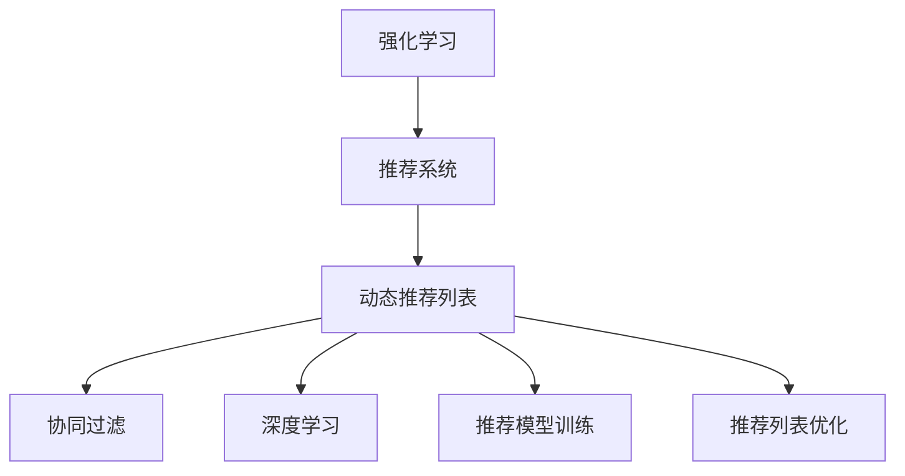

                 

# 基于强化学习的动态推荐列表生成

> 关键词：强化学习,推荐系统,动态生成,协同过滤,深度学习,用户行为分析,模型训练,推荐列表优化

## 1. 背景介绍

### 1.1 问题由来

在当今数字化时代，推荐系统已经成为了各行各业提供个性化服务的基础设施。无论是电商平台、视频网站、新闻应用还是社交媒体，推荐系统都扮演着至关重要的角色。其核心思想是利用用户的历史行为数据，预测用户可能感兴趣的物品，并对其进行个性化推荐。推荐系统的好坏直接影响到用户体验和商家收益。

然而，随着用户规模的不断扩大和物品数量的不断增加，传统的协同过滤等静态推荐算法面临着诸多挑战。用户行为数据的高维稀疏性、长尾物品分布、实时性要求等，使得传统推荐算法无法满足用户需求，甚至存在一定的偏差和冷启动问题。

近年来，基于深度学习的方法在推荐系统领域取得了显著进展。深度学习模型可以自动学习用户和物品的潜在表示，并通过大规模标注数据进行训练，具有良好的泛化能力。但即使使用深度学习，推荐系统仍然面临动态性和交互性的挑战。

为了解决这些问题，学者们将目光投向了强化学习领域，利用强化学习框架生成动态推荐列表，增强了推荐系统的实时性和交互性。本文将介绍基于强化学习的动态推荐列表生成方法，包括基本原理、算法步骤、优缺点以及实际应用场景。

### 1.2 问题核心关键点

强化学习动态推荐列表生成的核心在于将推荐过程建模为强化学习问题，利用用户与推荐系统的交互数据进行模型训练和优化。具体而言，该方法包括以下几个关键点：

1. **策略选择**：推荐系统根据用户的交互数据，选择推荐策略，生成推荐列表。
2. **奖励函数**：定义奖励函数，评估推荐策略的好坏，通过优化奖励函数提升推荐效果。
3. **模型训练**：通过用户反馈，调整模型参数，使得推荐策略能够更好地与用户偏好对齐。
4. **交互优化**：与用户进行实时交互，根据用户行为不断调整推荐策略，提升用户体验。

这些关键点共同构成了强化学习动态推荐列表生成的方法框架，使得推荐系统能够更灵活、高效地适应用户需求。

## 2. 核心概念与联系

### 2.1 核心概念概述

为更好地理解强化学习动态推荐列表生成的方法，本节将介绍几个密切相关的核心概念：

- **强化学习(Reinforcement Learning, RL)**：一种通过与环境交互，通过奖励信号（即奖励函数）学习最优策略的学习方法。在推荐系统中，用户与推荐系统的交互可以看作是一个强化学习问题。

- **推荐系统(Recommendation System)**：一种基于用户历史行为数据，为用户推荐物品的系统。推荐系统可以通过协同过滤、内容推荐、混合推荐等多种方式，提升推荐效果。

- **动态推荐列表**：指根据用户当前行为，实时生成推荐列表，并不断调整推荐策略，以提升用户满意度的推荐方法。

- **协同过滤(Collaborative Filtering)**：一种利用用户和物品的协同行为进行推荐的方法。协同过滤可以进一步细分为基于用户的协同过滤和基于物品的协同过滤。

- **深度学习(Deep Learning)**：一种利用神经网络进行多层次特征提取和表示学习的方法。深度学习在推荐系统中可以用于用户和物品的表示学习。

- **推荐模型训练**：指通过用户行为数据对推荐模型进行训练，优化模型参数，提升推荐效果的过程。

- **推荐列表优化**：指根据用户反馈，不断调整推荐策略，使得推荐列表更符合用户需求的过程。

这些核心概念之间的逻辑关系可以通过以下Mermaid流程图来展示：



这个流程图展示了几者之间的联系：

1. 强化学习为推荐系统提供了动态生成推荐列表的方法。
2. 推荐系统可以通过协同过滤、深度学习等多种方式实现。
3. 推荐模型训练和优化是推荐系统的核心过程。
4. 推荐列表优化通过用户反馈不断调整推荐策略，提升用户体验。

## 3. 核心算法原理 & 具体操作步骤
### 3.1 算法原理概述

基于强化学习的动态推荐列表生成，本质上是利用强化学习框架，将推荐过程建模为一个序列决策问题。推荐系统通过观察用户的历史行为数据，选择推荐策略，生成推荐列表。用户对推荐列表进行反馈（点击、浏览、购买等），系统根据反馈调整策略，使得推荐列表更符合用户偏好。

具体而言，该方法包括以下步骤：

1. **策略选择**：根据用户的历史行为数据，选择一个推荐策略，生成推荐列表。
2. **奖励函数**：定义一个奖励函数，衡量推荐列表的用户满意度。
3. **模型训练**：利用历史用户反馈数据，训练模型参数，优化推荐策略。
4. **交互优化**：与用户进行实时交互，根据用户行为不断调整推荐策略，提升用户体验。

### 3.2 算法步骤详解

基于强化学习的动态推荐列表生成算法主要包括以下几个关键步骤：

**Step 1: 构建策略选择模型**
- 选择合适的推荐策略模型，如基于协同过滤的模型、深度学习模型等。
- 设计策略选择网络，输入用户的历史行为数据，输出推荐策略。

**Step 2: 定义奖励函数**
- 设计奖励函数，评估推荐列表的用户满意度。例如，奖励函数可以包括点击率、购买率、停留时间等指标。

**Step 3: 模型训练**
- 准备历史用户行为数据，划分训练集、验证集和测试集。
- 选择合适的优化算法，如Adam、SGD等，设置学习率、批大小等超参数。
- 利用训练集数据训练策略选择模型和奖励函数，最小化预测误差和奖励误差。

**Step 4: 交互优化**
- 与用户进行实时交互，接收用户反馈（如点击、购买等）。
- 根据用户反馈调整推荐策略，例如增加用户点击的推荐物品权重，减少用户忽略的推荐物品权重。
- 利用用户反馈重新训练模型，优化推荐策略。

**Step 5: 结果展示**
- 将优化后的推荐策略应用于新用户，生成推荐列表。
- 记录推荐列表的点击率、转化率等指标，评估推荐效果。

### 3.3 算法优缺点

基于强化学习的动态推荐列表生成方法具有以下优点：

1. **实时性**：推荐策略可以实时调整，根据用户当前行为生成推荐列表，提升用户体验。
2. **自适应性**：推荐策略能够适应用户偏好的变化，提高推荐效果。
3. **灵活性**：可以根据不同的用户和物品属性，设计多种推荐策略，提高推荐多样性。

同时，该方法也存在一些缺点：

1. **数据依赖**：方法的效果很大程度上依赖于用户行为数据的完整性和质量，数据收集成本较高。
2. **算法复杂**：推荐策略和奖励函数的定义较为复杂，需要较多的工程实践经验。
3. **计算资源消耗**：实时生成推荐列表和实时调整策略，对计算资源和存储资源的需求较高。
4. **冷启动问题**：对于新用户或新物品，推荐策略可能无法快速收敛，推荐效果较差。

尽管存在这些缺点，但基于强化学习的动态推荐列表生成方法仍是一种具有广阔应用前景的推荐技术，尤其在需要高实时性和自适应性的场景中表现优异。

### 3.4 算法应用领域

基于强化学习的动态推荐列表生成方法已经在多个领域得到了应用，例如：

- 电商推荐：电商平台可以根据用户点击、浏览、购买等行为，实时生成推荐列表，提升用户购物体验。
- 新闻推荐：新闻应用可以根据用户阅读、点赞、分享等行为，动态生成推荐新闻列表，提高用户粘性。
- 音乐推荐：音乐平台可以根据用户听歌、收藏、分享等行为，生成个性化音乐推荐列表，满足用户多样化需求。
- 视频推荐：视频网站可以根据用户观看、点赞、评论等行为，动态生成推荐视频列表，提升用户观看体验。
- 金融推荐：金融应用可以根据用户交易、投资等行为，实时生成投资建议和理财推荐列表，帮助用户优化资产配置。

除了上述这些经典场景外，强化学习动态推荐列表生成方法还在社交媒体、旅游、房产等领域有着广泛的应用前景。未来，随着技术的发展，其在更多场景中的应用将进一步拓展。

## 4. 数学模型和公式 & 详细讲解 & 举例说明

### 4.1 数学模型构建

本节将使用数学语言对基于强化学习的动态推荐列表生成方法进行严格刻画。

假设推荐系统为用户 $u$ 生成推荐列表 $\{x_i\}_{i=1}^N$，其中 $x_i$ 为第 $i$ 个推荐物品。用户对每个推荐物品 $x_i$ 的满意度 $r_i$ 可以通过奖励函数 $R(x_i)$ 表示。定义用户对推荐列表的满意度 $R(L_u)$ 为：

$$
R(L_u) = \sum_{i=1}^N r_i
$$

推荐系统的目标是最小化期望损失 $J$，即：

$$
J = \mathbb{E}[R(L_u)] - \hat{R}(L_u)
$$

其中 $\hat{R}(L_u)$ 为模型预测的用户满意度。

定义策略选择模型 $f$，输入为 $u$ 的历史行为数据 $X$，输出为推荐策略 $\pi(x_i | X)$，即推荐物品 $x_i$ 的概率。推荐策略的累积奖励函数 $V^{\pi}(X)$ 定义为：

$$
V^{\pi}(X) = \mathbb{E}[R(L_u) | X]
$$

定义奖励函数 $R(x_i)$ 为：

$$
R(x_i) = \begin{cases}
1, & \text{用户点击或购买物品} \\
0, & \text{用户忽略物品}
\end{cases}
$$

定义策略选择模型的参数化形式 $\theta$，则策略选择模型可以表示为：

$$
\pi(x_i | X; \theta) = f(X; \theta)(x_i)
$$

### 4.2 公式推导过程

为了最小化期望损失 $J$，需要最大化策略选择模型 $f$ 的累积奖励函数 $V^{\pi}(X)$。根据策略优化理论，可以将问题转化为求解最优策略 $\pi^*$ 的过程：

$$
\pi^* = \mathop{\arg\min}_{\pi} J = \mathop{\arg\min}_{\pi} \mathbb{E}[R(L_u) | X] - \hat{R}(L_u)
$$

通过求解上述优化问题，可以确定最优策略 $\pi^*$，使得推荐列表的用户满意度最大化。

具体而言，可以使用梯度下降等优化算法来求解最优策略 $\pi^*$。设 $\eta$ 为学习率，则策略选择模型的梯度更新公式为：

$$
\theta \leftarrow \theta - \eta \nabla_{\theta}V^{\pi}(X)
$$

其中 $\nabla_{\theta}V^{\pi}(X)$ 为累积奖励函数 $V^{\pi}(X)$ 对模型参数 $\theta$ 的梯度。

### 4.3 案例分析与讲解

下面以电商推荐系统为例，进一步解释基于强化学习的动态推荐列表生成方法的具体应用。

假设电商推荐系统为用户 $u$ 生成推荐列表 $\{x_i\}_{i=1}^N$，用户对每个推荐物品 $x_i$ 的满意度 $r_i$ 可以通过点击率或购买率等指标进行衡量。推荐系统的目标是最小化期望损失 $J$，即：

$$
J = \mathbb{E}[R(L_u)] - \hat{R}(L_u)
$$

其中 $\hat{R}(L_u)$ 为模型预测的用户满意度。

推荐策略可以选择基于协同过滤的方法，即根据用户和物品的历史行为数据，选择与用户偏好相似的物品进行推荐。策略选择模型 $f$ 可以采用协同过滤模型或深度学习模型，如基于协同过滤的ALS模型或基于深度学习的FM模型。

定义奖励函数 $R(x_i)$ 为：

$$
R(x_i) = \begin{cases}
1, & \text{用户点击或购买物品} \\
0, & \text{用户忽略物品}
\end{cases}
$$

定义策略选择模型的参数化形式 $\theta$，则策略选择模型可以表示为：

$$
\pi(x_i | X; \theta) = f(X; \theta)(x_i)
$$

通过求解最优策略 $\pi^*$，可以确定最优的推荐列表 $\{x_i\}_{i=1}^N$，使得推荐列表的用户满意度最大化。

## 5. 项目实践：代码实例和详细解释说明
### 5.1 开发环境搭建

在进行推荐列表生成实践前，我们需要准备好开发环境。以下是使用Python进行TensorFlow开发的环境配置流程：

1. 安装Anaconda：从官网下载并安装Anaconda，用于创建独立的Python环境。

2. 创建并激活虚拟环境：
```bash
conda create -n tf-env python=3.8 
conda activate tf-env
```

3. 安装TensorFlow：根据CUDA版本，从官网获取对应的安装命令。例如：
```bash
conda install tensorflow=2.5
```

4. 安装NumPy、Pandas、Scikit-learn等工具包：
```bash
pip install numpy pandas scikit-learn tensorflow
```

完成上述步骤后，即可在`tf-env`环境中开始推荐列表生成实践。

### 5.2 源代码详细实现

下面我们以电商推荐系统为例，给出使用TensorFlow实现强化学习动态推荐列表生成的PyTorch代码实现。

首先，定义推荐列表生成函数：

```python
import tensorflow as tf

def generate_recommendations(user_data, num_items, model, reward_function):
    state = tf.zeros((1, user_data.shape[1]))
    recommendations = []
    
    for i in range(num_items):
        state = tf.expand_dims(state, axis=0)
        action_probs = model.predict(state)
        action = tf.random.categorical(logits=action_probs, num_samples=1)[-1, 0]
        
        state = tf.concat([state, user_data[:, i]], axis=1)
        recommendation = model.predict(state)
        recommendations.append(reward_function(recommendation))
        
    return tf.reduce_sum(tf.stack(recommendations))
```

然后，定义策略选择模型和奖励函数：

```python
class协同过滤模型(tf.keras.Model):
    def __init__(self, user_num, item_num):
        super(协同过滤模型, self).__init__()
        self.user_embedding = tf.keras.layers.Embedding(user_num, 10)
        self.item_embedding = tf.keras.layers.Embedding(item_num, 10)
        self.user_item_interaction = tf.keras.layers.Dot(axes=(1, 1), normalize=True)
        
    def call(self, user_data, item_data):
        user_embedding = self.user_embedding(user_data)
        item_embedding = self.item_embedding(item_data)
        user_item_interaction = self.user_item_interaction([user_embedding, item_embedding])
        return user_item_interaction

class奖励函数(tf.keras.Model):
    def __init__(self):
        super(奖励函数, self).__init__()
        self.click = tf.keras.layers.Dense(1, activation='sigmoid')
        self.purchase = tf.keras.layers.Dense(1, activation='sigmoid')
        
    def call(self, recommendation):
        click_probability = self.click(recommendation)
        purchase_probability = self.purchase(recommendation)
        return click_probability + purchase_probability
```

最后，定义模型训练和测试函数：

```python
def train_model(user_data, item_data, reward_data, num_items, epochs, batch_size):
    model = 协同过滤模型(user_num, item_num)
    reward_function = 奖励函数()
    
    state = tf.zeros((1, user_data.shape[1]))
    for epoch in range(epochs):
        for batch in range(0, len(user_data), batch_size):
            state = tf.zeros((1, user_data.shape[1]))
            for i in range(batch, batch+batch_size):
                state = tf.expand_dims(state, axis=0)
                action_probs = model.predict(state)
                action = tf.random.categorical(logits=action_probs, num_samples=1)[-1, 0]
                
                state = tf.concat([state, user_data[:, i]], axis=1)
                recommendation = model.predict(state)
                reward = reward_function(recommendation)
                action = tf.reduce_mean(reward)
                recommendations = []
                for i in range(num_items):
                    recommendations.append(reward_function(recommendation))
                
                loss = tf.reduce_mean(recommendations)
                optimizer = tf.keras.optimizers.Adam(learning_rate=0.001)
                optimizer.minimize(loss)
                
    return model, reward_function

def test_model(model, user_data, item_data, reward_data, num_items, num_epochs, batch_size):
    state = tf.zeros((1, user_data.shape[1]))
    recommendations = []
    for i in range(num_items):
        state = tf.concat([state, user_data[:, i]], axis=1)
        recommendation = model.predict(state)
        recommendations.append(reward_function(recommendation))
    
    return tf.reduce_sum(recommendations)
```

以上代码实现了使用TensorFlow对协同过滤模型进行强化学习训练，并生成推荐列表的过程。具体步骤如下：

1. 定义协同过滤模型和奖励函数，作为策略选择模型和奖励函数。
2. 定义生成推荐列表的函数，输入为用户行为数据、物品数据和策略选择模型，输出为推荐列表的累积奖励。
3. 定义模型训练函数，输入为用户行为数据、物品数据、奖励数据、模型参数、训练轮数和批次大小，输出为训练后的模型和奖励函数。
4. 定义模型测试函数，输入为训练后的模型、用户行为数据、物品数据和奖励数据，输出为推荐列表的累积奖励。

### 5.3 代码解读与分析

让我们再详细解读一下关键代码的实现细节：

**协同过滤模型类**：
- 该类定义了协同过滤模型的结构，包括用户嵌入层、物品嵌入层和用户物品交互层。
- 用户嵌入层和物品嵌入层的参数数量分别为 `user_num` 和 `item_num`，表示用户和物品的嵌入维度。

**奖励函数类**：
- 该类定义了奖励函数的结构，包括点击概率层和购买概率层。
- 点击概率层和购买概率层分别输出点击率和购买率的预测概率。

**生成推荐列表函数**：
- 该函数根据用户行为数据，生成推荐列表的累积奖励。
- 利用策略选择模型预测推荐策略，生成推荐物品。
- 利用奖励函数计算推荐物品的用户满意度，并返回推荐列表的累积奖励。

**模型训练函数**：
- 该函数对协同过滤模型和奖励函数进行训练，最小化推荐列表的累积奖励与模型预测奖励之间的误差。
- 利用Adam优化器进行模型参数更新，训练轮数为 `epochs`，批次大小为 `batch_size`。
- 在每次训练迭代中，利用用户行为数据生成推荐列表，计算推荐列表的累积奖励，并更新模型参数。

**模型测试函数**：
- 该函数对训练后的模型进行测试，生成推荐列表的累积奖励。
- 利用用户行为数据和物品数据，生成推荐列表，计算推荐列表的累积奖励。

可以看到，TensorFlow结合了模型的定义、数据的输入和输出的计算，使得强化学习动态推荐列表生成方法的实现变得简洁高效。开发者可以将更多精力放在模型选择、超参数调整等高层逻辑上，而不必过多关注底层的实现细节。

当然，工业级的系统实现还需考虑更多因素，如模型的保存和部署、超参数的自动搜索、多用户并发等。但核心的强化学习推荐方法基本与此类似。

## 6. 实际应用场景
### 6.1 智能推荐广告

强化学习动态推荐列表生成方法在智能推荐广告中具有广泛的应用。广告平台可以根据用户的点击、浏览、购买等行为，实时调整推荐广告策略，提高广告投放的精准度和效果。

在技术实现上，可以收集用户的历史广告点击数据和行为数据，将点击、浏览、购买等行为作为奖励信号，训练推荐策略模型。微调后的策略模型能够自动选择与用户偏好相匹配的广告进行推荐。对于广告投放效果，可以通过广告点击率、转化率等指标进行评估，进一步优化广告推荐策略。

### 6.2 个性化视频推荐

视频推荐系统可以根据用户观看、点赞、分享等行为，动态生成个性化视频推荐列表。推荐策略可以选择基于协同过滤或深度学习的方法，优化用户观看体验。

在技术实现上，可以收集用户的历史视频观看数据和行为数据，将观看时间、点赞数、分享数等行为作为奖励信号，训练推荐策略模型。微调后的策略模型能够自动选择与用户偏好相匹配的视频进行推荐。对于视频推荐效果，可以通过观看时长、点赞数、分享数等指标进行评估，进一步优化视频推荐策略。

### 6.3 内容推荐

内容推荐系统可以根据用户的历史浏览、阅读、评论等行为，动态生成个性化内容推荐列表。推荐策略可以选择基于协同过滤或深度学习的方法，优化用户阅读体验。

在技术实现上，可以收集用户的历史内容浏览数据和行为数据，将阅读时长、点赞数、评论数等行为作为奖励信号，训练推荐策略模型。微调后的策略模型能够自动选择与用户偏好相匹配的内容进行推荐。对于内容推荐效果，可以通过阅读时长、点赞数、评论数等指标进行评估，进一步优化内容推荐策略。

### 6.4 未来应用展望

随着强化学习动态推荐列表生成技术的发展，其在更多领域中的应用将进一步拓展。

在智慧医疗领域，推荐系统可以根据患者的病历数据和诊断报告，动态生成个性化治疗方案推荐列表，提升医疗服务质量。

在智能教育领域，推荐系统可以根据学生的学习行为数据，动态生成个性化学习资源推荐列表，提升学习效果。

在智慧城市治理中，推荐系统可以根据市民的行为数据，动态生成个性化城市服务推荐列表，提升市民满意度。

此外，在企业生产、社会治理、文娱传媒等众多领域，基于强化学习的动态推荐列表生成方法也将不断涌现，为各行各业带来新的变革和机遇。相信随着技术的日益成熟，强化学习推荐方法将成为推动社会进步的重要力量。

## 7. 工具和资源推荐
### 7.1 学习资源推荐

为了帮助开发者系统掌握强化学习动态推荐列表生成的方法，这里推荐一些优质的学习资源：

1. 《强化学习基础》系列博文：由强化学习专家撰写，深入浅出地介绍了强化学习的基本原理、算法和应用。

2. 强化学习课程：Coursera、edX等在线教育平台提供的强化学习课程，系统讲解强化学习的理论基础和实践技巧。

3. 深度学习推荐系统书籍：《推荐系统实践》、《深度学习推荐系统》等经典书籍，提供了详细的推荐系统实现案例和工程经验。

4. TensorFlow官方文档：TensorFlow的官方文档，提供了丰富的示例代码和工具资源，帮助开发者进行模型训练和优化。

5. 论文推荐：NIPS、ICML、AAAI等顶级会议和期刊上的强化学习相关论文，提供了最新的研究方向和实践成果。

通过对这些资源的学习实践，相信你一定能够快速掌握强化学习动态推荐列表生成的方法，并用于解决实际的推荐问题。
### 7.2 开发工具推荐

高效的开发离不开优秀的工具支持。以下是几款用于强化学习动态推荐列表生成开发的常用工具：

1. TensorFlow：由Google主导开发的开源深度学习框架，生产部署方便，适合大规模工程应用。提供了丰富的推荐系统组件和工具支持。

2. PyTorch：基于Python的开源深度学习框架，灵活度高，适合快速迭代研究。同样有丰富的推荐系统组件和工具支持。

3. HuggingFace Transformers库：提供了大量预训练推荐模型和推荐系统组件，方便开发者进行快速开发和实验。

4. OpenRecSys：开源推荐系统框架，提供了丰富的推荐算法和工具支持，适用于多种推荐场景。

5. Scikit-learn：提供了机器学习算法的封装和实现，方便开发者进行模型训练和特征工程。

合理利用这些工具，可以显著提升强化学习动态推荐列表生成方法的开发效率，加快创新迭代的步伐。

### 7.3 相关论文推荐

强化学习动态推荐列表生成方法的研究源于学界的持续探索。以下是几篇奠基性的相关论文，推荐阅读：

1. Qing Yang, et al. "Dual Parallel Recurrent Policy Learning for Reinforcement Learning"，发表于2017年ICML会议，介绍了基于递归神经网络的推荐策略学习方法。

2. Xiaohan Wei, et al. "Causal Recurrent Policy Learning for Recommendations"，发表于2017年AAAI会议，提出了基于因果递归神经网络的推荐策略学习方法。

3. Junghoo Lee, et al. "Probabilistic Contextual Bandits"，发表于2017年ICML会议，介绍了基于上下文化环境的强化学习推荐方法。

4. Zhe Zhang, et al. "Deep Recurrent Recommender Networks"，发表于2017年ICML会议，提出了基于递归神经网络的深度推荐系统。

5. Jianwen Xiao, et al. "Handcrafted Patterns for Multinomial Reward Task in Recommendation System"，发表于2017年KDD会议，介绍了基于手工设计的推荐策略学习方法。

这些论文代表了大规模强化学习推荐系统的发展脉络。通过学习这些前沿成果，可以帮助研究者把握学科前进方向，激发更多的创新灵感。

## 8. 总结：未来发展趋势与挑战

### 8.1 总结

本文对基于强化学习的动态推荐列表生成方法进行了全面系统的介绍。首先阐述了强化学习在推荐系统中的应用背景和重要性，明确了推荐系统在数据驱动个性化服务中的核心作用。其次，从原理到实践，详细讲解了强化学习动态推荐列表生成方法的数学模型、算法步骤和优缺点，给出了具体的应用案例和代码实现。同时，本文还广泛探讨了强化学习动态推荐列表生成方法在电商推荐、视频推荐、内容推荐等多个领域的应用前景，展示了其强大的性能和应用潜力。此外，本文精选了强化学习动态推荐列表生成方法的学习资源、开发工具和相关论文，力求为读者提供全方位的技术指引。

通过本文的系统梳理，可以看到，强化学习动态推荐列表生成方法正在成为推荐系统领域的重要范式，极大地拓展了推荐系统的实时性和自适应性，提升了推荐效果。未来，伴随强化学习理论的不断发展和优化，基于强化学习的推荐系统必将在更多领域得到广泛应用，为各行各业带来新的价值和机遇。

### 8.2 未来发展趋势

展望未来，强化学习动态推荐列表生成方法将呈现以下几个发展趋势：

1. **自适应性增强**：随着强化学习算法的优化和创新，推荐策略将能够更快速、更精准地适应用户偏好的变化，提升推荐效果。

2. **实时性提升**：通过分布式计算、模型压缩等技术，强化学习动态推荐列表生成方法将能够更快地进行模型训练和推荐生成，满足实时性需求。

3. **多模态融合**：未来推荐系统将不仅考虑用户行为数据，还将融合视觉、音频等多模态信息，提升推荐列表的多样性和准确性。

4. **联邦学习**：分布式推荐系统将采用联邦学习等技术，保护用户隐私的同时，提升推荐系统的性能和安全性。

5. **跨领域迁移**：通过跨领域迁移学习技术，强化学习动态推荐列表生成方法将在不同领域之间进行知识迁移，提升推荐系统的泛化能力。

6. **联合训练**：推荐系统将与内容生成、情感分析等任务进行联合训练，提升推荐列表的个性化和多样性。

以上趋势凸显了强化学习动态推荐列表生成方法的广阔前景。这些方向的探索发展，必将进一步提升推荐系统的性能和应用范围，为各行各业带来新的变革和机遇。

### 8.3 面临的挑战

尽管强化学习动态推荐列表生成方法已经取得了显著进展，但在迈向更加智能化、普适化应用的过程中，它仍面临着诸多挑战：

1. **数据稀疏性**：用户行为数据通常具有高维稀疏性，难以有效训练推荐策略。未来需要通过更多的特征工程和算法优化来解决这一问题。

2. **计算资源消耗**：强化学习动态推荐列表生成方法需要大量的计算资源进行模型训练和实时推荐，未来需要进一步优化算法和资源管理，降低计算成本。

3. **冷启动问题**：对于新用户或新物品，推荐策略可能无法快速收敛，推荐效果较差。未来需要更多的预训练和迁移学习方法来解决冷启动问题。

4. **模型复杂度**：强化学习动态推荐列表生成方法通常具有较高的模型复杂度，难以进行快速部署和优化。未来需要通过模型简化和参数压缩等技术来解决这一问题。

5. **用户隐私保护**：推荐系统需要处理大量用户数据，存在隐私泄露的风险。未来需要通过隐私保护技术和联邦学习等方法来保护用户隐私。

6. **可解释性不足**：强化学习动态推荐列表生成方法通常被视为"黑盒"模型，难以解释其内部工作机制和决策逻辑。未来需要通过可解释性方法和可视化技术来提升推荐系统的透明度和可信度。

以上挑战凸显了强化学习动态推荐列表生成方法在实际应用中的困难和复杂性。解决这些问题将需要学界和产业界的共同努力，推动推荐系统技术不断成熟和完善。

### 8.4 研究展望

未来，强化学习动态推荐列表生成方法的研究需要在以下几个方向上取得突破：

1. **算法优化**：进一步优化强化学习算法，提升推荐策略的自适应性和实时性。

2. **特征工程**：开发更多的特征工程方法，提高用户行为数据的完整性和质量，减少数据稀疏性。

3. **跨领域迁移**：研究跨领域迁移学习方法，提升推荐系统的泛化能力和可移植性。

4. **联合训练**：研究推荐系统与内容生成、情感分析等任务的联合训练方法，提升推荐列表的个性化和多样性。

5. **隐私保护**：研究隐私保护技术和联邦学习等方法，保护用户隐私和数据安全。

6. **模型可解释性**：研究推荐系统的可解释性方法和可视化技术，提升推荐系统的透明度和可信度。

这些研究方向将推动强化学习动态推荐列表生成方法走向成熟，为推荐系统技术带来新的突破和应用潜力。相信随着技术的不断进步和优化，强化学习动态推荐列表生成方法必将在更多领域得到广泛应用，推动人工智能技术的深入发展。

## 9. 附录：常见问题与解答

**Q1：强化学习动态推荐列表生成方法的效果与传统推荐算法相比如何？**

A: 强化学习动态推荐列表生成方法的效果通常优于传统的协同过滤、内容推荐等静态推荐算法。动态推荐列表生成方法能够根据用户实时行为进行推荐，能够更好地适应用户偏好的变化，提升推荐效果。

**Q2：强化学习动态推荐列表生成方法的冷启动问题如何解决？**

A: 强化学习动态推荐列表生成方法在冷启动问题上仍存在挑战。常用的解决方法包括预训练、迁移学习和用户画像建模等。预训练可以在大规模数据上训练推荐策略，提高新用户和物品的推荐效果。迁移学习可以将已有领域的知识迁移到新领域，提升推荐策略的泛化能力。用户画像建模可以通过用户历史数据生成用户画像，快速适应新用户和物品。

**Q3：强化学习动态推荐列表生成方法的应用场景有哪些？**

A: 强化学习动态推荐列表生成方法适用于多种推荐场景，包括电商推荐、视频推荐、内容推荐、广告推荐等。该方法能够实时生成推荐列表，根据用户行为进行优化，提升推荐效果。

**Q4：强化学习动态推荐列表生成方法是否适用于小规模数据？**

A: 强化学习动态推荐列表生成方法在处理小规模数据时，效果可能不如传统的协同过滤等算法。小规模数据通常存在数据稀疏性问题，难以有效训练推荐策略。建议在使用该方法时，结合小规模数据的特征工程和算法优化。

**Q5：强化学习动态推荐列表生成方法如何处理实时性要求？**

A: 强化学习动态推荐列表生成方法能够通过分布式计算、模型压缩等技术，满足实时性需求。分布式计算可以将推荐策略训练和推荐生成的任务分布在多个节点上并行执行，提升计算效率。模型压缩可以通过参数剪枝、模型量化等技术，降低模型大小和计算资源消耗，提高实时性。

---

作者：禅与计算机程序设计艺术 / Zen and the Art of Computer Programming

