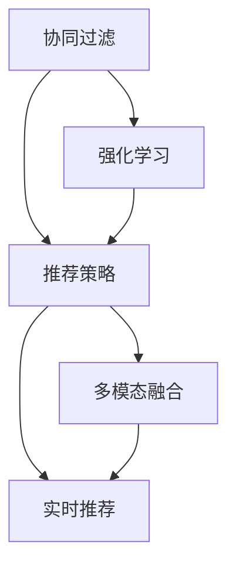
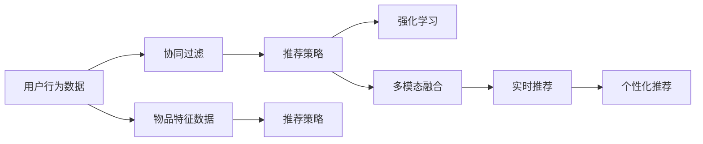

                 

# 基于强化学习的多场景推荐策略协同优化

> 关键词：推荐系统,协同过滤,强化学习,推荐策略优化,场景协同,多模态融合,实时推荐,个性化推荐,智能推荐系统

## 1. 背景介绍

在当今信息爆炸的时代，互联网用户面临的信息过载问题日益严重。如何高效、精准地为用户推荐其感兴趣的内容，是互联网公司亟待解决的问题。传统的推荐系统主要依赖用户的历史行为数据，采用协同过滤算法生成推荐结果。然而，协同过滤算法在处理用户新兴趣和应对多场景数据时，效果往往不理想。近年来，强化学习在推荐系统中的应用逐渐成为研究热点，通过对推荐策略的优化，显著提升了推荐系统的效果和用户满意度。本文将系统介绍基于强化学习的推荐系统，重点关注多场景推荐策略的协同优化问题，并详细讲解其实现步骤。

## 2. 核心概念与联系

### 2.1 核心概念概述

为了更好地理解强化学习在推荐系统中的应用，我们先定义一些核心概念：

- **推荐系统(Recommendation System)**：利用用户数据和商品数据，为用户推荐感兴趣内容的系统。
- **协同过滤(Collaborative Filtering)**：通过分析用户行为数据和商品特征，推荐用户可能感兴趣的物品。
- **强化学习(Reinforcement Learning)**：通过与环境交互，优化策略以最大化奖励的机器学习方法。
- **推荐策略(Recommendation Strategy)**：定义推荐系统推荐物品的规则和逻辑。
- **场景(Scene)**：用户访问推荐系统时的环境和上下文信息，如时间、设备、位置等。
- **多模态融合(Multimodal Fusion)**：将不同类型的数据（如文本、图像、音频等）进行融合，提升推荐系统的表现。
- **实时推荐(Real-time Recommendation)**：在用户访问的每一时刻，实时生成推荐结果。
- **个性化推荐(Personalized Recommendation)**：针对不同用户和物品，生成个性化的推荐结果。
- **智能推荐系统(Intelligent Recommendation System)**：利用机器学习等技术，实现自动化的推荐策略优化和动态调整。

这些核心概念之间通过推荐系统的工作流程紧密联系，如图1所示。协同过滤和强化学习是推荐系统中的两种主要技术，它们各自从不同的角度提升推荐效果。协同过滤侧重于利用用户和物品的隐式关联，强化学习则通过不断与环境互动优化推荐策略。推荐策略是多场景协同优化的关键点，而多模态融合和实时推荐则是提升个性化推荐效果的重要手段。



### 2.2 核心概念原理和架构的 Mermaid 流程图

以下是一个简化的强化学习推荐系统的框架图，展示了协同过滤和强化学习在推荐系统中的互动：



协同过滤和强化学习分别从数据和策略两个维度对推荐系统进行优化，协同过滤利用用户和物品的隐式关联，生成初始推荐结果；强化学习则通过不断优化推荐策略，提升推荐效果。推荐策略是多场景协同优化的核心，不同场景下可能需要不同的推荐逻辑。多模态融合和实时推荐则是进一步提升推荐效果的两个重要手段。

## 3. 核心算法原理 & 具体操作步骤

### 3.1 算法原理概述

基于强化学习的推荐系统，通过不断与环境互动，优化推荐策略以最大化用户的满意度。推荐策略可以看作是一个动作空间，每个动作对应一种推荐方法。系统的目标是最大化用户的累计满意度，即通过与用户的互动，得到一系列的奖励信号，并不断优化策略，使得总奖励最大化。

推荐系统中的环境可以定义为$E$，状态$s_t$表示当前时间$t$系统状态，动作$a_t$表示推荐策略，下一状态$s_{t+1}$是根据当前动作和状态，加上随机噪声生成，奖励$r_{t+1}$则根据用户对推荐结果的反馈生成。推荐系统与环境互动的框架如图2所示。


强化学习中的动作空间通常较大，难以直接使用传统强化学习算法进行优化。因此，推荐系统中一般采用基于策略梯度的优化方法，如策略梯度、优势策略梯度等。这些方法将强化学习的目标函数直接与策略参数关联，从而避免了直接对动作空间进行优化。

推荐策略的优化目标函数通常定义为期望的累计奖励，即：

$$
J(\theta) = \mathbb{E}[\sum_{t=0}^{T} r_t]
$$

其中$\theta$为策略参数，$T$为系统运行的时间长度。目标函数的具体形式根据具体应用场景有所不同，如点击率、转化率等。

### 3.2 算法步骤详解

基于强化学习的推荐系统一般包括以下几个关键步骤：

**Step 1: 数据收集与预处理**
- 收集用户行为数据和物品特征数据，构建用户-物品交互矩阵。
- 对数据进行预处理，包括特征选择、缺失值处理、标准化等。

**Step 2: 协同过滤生成初始推荐**
- 使用协同过滤算法生成用户的初始推荐结果。
- 将推荐结果转化为系统可理解的状态。

**Step 3: 策略优化**
- 定义推荐策略，如基于规则的策略、基于模型的策略等。
- 使用基于策略梯度的优化方法，如策略梯度、优势策略梯度等，优化策略参数。
- 不断与用户互动，获取奖励信号，更新策略参数。

**Step 4: 实时推荐**
- 在用户每一次访问时，根据当前状态和策略，生成实时推荐结果。
- 对推荐结果进行多模态融合，提升推荐效果。

**Step 5: 反馈与策略更新**
- 根据用户对推荐结果的反馈，生成奖励信号。
- 使用策略梯度等方法，更新推荐策略。

**Step 6: 个性化推荐**
- 针对不同用户和物品，生成个性化的推荐结果。

以上是基于强化学习的推荐系统的基本流程。在实际应用中，还需要根据具体任务的特点，对各个环节进行优化设计，如改进推荐策略、引入更多的正则化技术、搜索最优的超参数组合等，以进一步提升推荐效果。

### 3.3 算法优缺点

基于强化学习的推荐系统具有以下优点：

1. **动态优化**：能够根据用户反馈，实时调整推荐策略，提升推荐效果。
2. **适应性强**：能够处理多场景、多模态数据，提升推荐系统的适应性。
3. **效果显著**：在学术界和工业界的诸多任务上，基于强化学习的推荐方法已经刷新了最先进的性能指标。
4. **灵活性高**：不同的推荐场景可以采用不同的策略，提升推荐系统的灵活性。

同时，该方法也存在一定的局限性：

1. **数据依赖性强**：强化学习依赖用户行为数据和物品特征数据，缺乏数据的推荐系统效果不理想。
2. **策略复杂度高**：不同场景下需要设计多种推荐策略，策略的复杂度较高。
3. **计算成本高**：强化学习的优化过程需要大量计算资源，特别是在高维动作空间中。
4. **泛化能力有限**：强化学习通常只能针对特定任务进行优化，泛化能力有限。

尽管存在这些局限性，但就目前而言，基于强化学习的推荐方法仍然是大规模推荐系统的重要手段。未来相关研究的重点在于如何进一步降低对数据和计算的依赖，提高策略的泛化能力，同时兼顾可解释性和伦理安全性等因素。

### 3.4 算法应用领域

基于强化学习的推荐系统已经在电子商务、视频推荐、社交网络等多个领域得到了广泛的应用，覆盖了推荐系统的核心任务，例如：

- 商品推荐：推荐用户可能感兴趣的商品。
- 内容推荐：推荐用户可能感兴趣的视频、文章、音乐等。
- 广告推荐：推荐用户可能感兴趣的广告。
- 推荐系统个性化：根据不同用户，生成个性化的推荐结果。

除了上述这些经典任务外，基于强化学习的推荐系统还被创新性地应用到更多场景中，如智能广告投放、智能游戏推荐、智能音乐推荐等，为推荐系统带来了新的突破。随着强化学习方法和推荐系统的不断进步，相信推荐系统将在更广阔的应用领域大放异彩。

## 4. 数学模型和公式 & 详细讲解 & 举例说明

### 4.1 数学模型构建

强化学习在推荐系统中的应用通常涉及以下几个关键组成部分：

- **状态空间**：用户行为数据和物品特征数据构成的状态空间。
- **动作空间**：不同的推荐策略构成的动作空间。
- **奖励函数**：用户对推荐结果的反馈，定义为推荐结果和用户偏好的匹配程度。
- **策略空间**：推荐策略的参数空间。
- **优化目标**：期望的累计奖励函数，即$\mathbb{E}[\sum_{t=0}^{T} r_t]$。

### 4.2 公式推导过程

以下我们以点击率预测为例，推导基于强化学习的推荐系统优化目标函数的公式。

假设推荐系统为用户推荐一个商品，用户点击与否表示为二进制奖励$r_t$，推荐策略为$a_t$，状态$s_t$表示当前用户行为数据和物品特征数据。则推荐系统与环境互动的优化目标函数可以表示为：

$$
J(\theta) = \mathbb{E}[\sum_{t=0}^{T} r_t]
$$

其中$\theta$为推荐策略的参数，$T$为系统运行的时间长度。假设用户点击的概率为$p$，则奖励函数可以表示为：

$$
r_t = \begin{cases}
1 & \text{点击} \\
0 & \text{未点击}
\end{cases}
$$

定义状态$s_t$为二进制向量，表示用户当前行为和物品特征的组合。假设奖励函数是线性函数，即：

$$
r_t = \theta^T s_t
$$

则优化目标函数可以表示为：

$$
J(\theta) = \mathbb{E}[\sum_{t=0}^{T} \theta^T s_t]
$$

定义策略$\pi(a_t|s_t)$为推荐策略，表示在当前状态下选择动作$a_t$的概率。假设策略空间为线性函数，即：

$$
\pi(a_t|s_t) = \phi^T(s_t) \pi(a_t)
$$

其中$\phi^T(s_t)$为状态空间到动作空间的映射函数，$\pi(a_t)$为动作空间的概率分布。则策略优化目标函数可以表示为：

$$
J(\theta) = \mathbb{E}[\sum_{t=0}^{T} \theta^T \phi^T(s_t) \pi(a_t)]
$$

将上述公式带入目标函数，并进行简化，得到最终的目标函数：

$$
J(\theta) = \mathbb{E}[\sum_{t=0}^{T} r_t \log \frac{\pi(a_t|s_t)}{\pi(a_{t-1}|s_{t-1})}]
$$

其中$a_t$为当前推荐策略，$a_{t-1}$为前一推荐策略。$\pi(a_t|s_t)$为当前推荐策略的概率，$\pi(a_{t-1}|s_{t-1})$为前一推荐策略的概率。

### 4.3 案例分析与讲解

以智能广告推荐为例，智能广告推荐系统通常具有以下特点：

- **高点击率**：用户点击广告通常会带来显著收益。
- **高展示率**：用户看到的广告越多，点击率通常越高。
- **多场景需求**：广告投放场景多样，如网站、移动应用、社交媒体等。

智能广告推荐系统可以采用强化学习的方法，实时调整推荐策略，提升广告点击率和展示率。具体而言，可以在每个投放时间段内，根据用户的点击反馈，使用强化学习算法不断优化广告投放策略。优化目标可以定义为用户点击率的期望值，通过最大化用户点击率来提升广告收益。

以下是一个简单的智能广告推荐系统优化目标函数的推导过程：

- **状态空间**：广告的展示位置、展示时间、展示频次等。
- **动作空间**：不同的广告投放策略，如展示位置、展示时间、展示频次等。
- **奖励函数**：用户点击广告的点击率，定义为广告展示次数和点击次数的比值。
- **策略空间**：广告投放策略的参数空间，如展示位置、展示时间、展示频次等。
- **优化目标**：用户点击率的期望值。

假设广告投放策略为$a_t$，状态为$s_t$，奖励为$r_t$，策略优化目标函数为$J(\theta)$。则优化目标函数可以表示为：

$$
J(\theta) = \mathbb{E}[\sum_{t=0}^{T} r_t]
$$

其中$r_t$为用户点击广告的点击率，$t$为广告展示次数。

假设奖励函数为线性函数，即：

$$
r_t = \theta^T s_t
$$

则优化目标函数可以表示为：

$$
J(\theta) = \mathbb{E}[\sum_{t=0}^{T} \theta^T s_t]
$$

定义策略$\pi(a_t|s_t)$为广告投放策略，表示在当前状态下选择动作$a_t$的概率。假设策略空间为线性函数，即：

$$
\pi(a_t|s_t) = \phi^T(s_t) \pi(a_t)
$$

其中$\phi^T(s_t)$为状态空间到动作空间的映射函数，$\pi(a_t)$为动作空间的概率分布。则策略优化目标函数可以表示为：

$$
J(\theta) = \mathbb{E}[\sum_{t=0}^{T} \theta^T \phi^T(s_t) \pi(a_t)]
$$

将上述公式带入目标函数，并进行简化，得到最终的目标函数：

$$
J(\theta) = \mathbb{E}[\sum_{t=0}^{T} r_t \log \frac{\pi(a_t|s_t)}{\pi(a_{t-1}|s_{t-1})}]
$$

其中$a_t$为当前广告投放策略，$a_{t-1}$为前一广告投放策略。$\pi(a_t|s_t)$为当前广告投放策略的概率，$\pi(a_{t-1}|s_{t-1})$为前一广告投放策略的概率。

## 5. 项目实践：代码实例和详细解释说明

### 5.1 开发环境搭建

在进行强化学习推荐系统实践前，我们需要准备好开发环境。以下是使用Python进行TensorFlow开发的环境配置流程：

1. 安装Anaconda：从官网下载并安装Anaconda，用于创建独立的Python环境。

2. 创建并激活虚拟环境：
```bash
conda create -n tf-env python=3.8 
conda activate tf-env
```

3. 安装TensorFlow：根据CUDA版本，从官网获取对应的安装命令。例如：
```bash
conda install tensorflow==2.7.0
```

4. 安装TensorBoard：
```bash
pip install tensorboard
```

5. 安装TensorFlow Addons：
```bash
pip install tensorflow-addons==0.19.0
```

6. 安装PyTorch：
```bash
pip install torch torchvision torchaudio
```

完成上述步骤后，即可在`tf-env`环境中开始强化学习推荐系统实践。

### 5.2 源代码详细实现

这里我们以点击率预测为例，使用TensorFlow和TensorFlow Addons库实现一个简单的强化学习推荐系统。

首先，定义状态空间、动作空间和策略空间：

```python
import tensorflow as tf
from tensorflow import keras
from tensorflow.keras import layers

# 定义状态空间
state_shape = (1,)
state_dim = 1

# 定义动作空间
action_shape = (1,)
action_dim = 1

# 定义策略空间
policy_shape = (1,)
policy_dim = 1

# 定义优化器
optimizer = tf.keras.optimizers.Adam(lr=0.001)

# 定义奖励函数
def reward(state, action, next_state):
    return state[0] * action[0] - 0.5 * action[0]**2 + 0.5 * next_state[0]**2
```

然后，定义策略模型和策略更新函数：

```python
# 定义策略模型
class PolicyNetwork(tf.keras.Model):
    def __init__(self, state_dim, action_dim, policy_dim):
        super(PolicyNetwork, self).__init__()
        self.dense1 = layers.Dense(64, activation='relu', input_shape=(state_dim,))
        self.dense2 = layers.Dense(policy_dim, activation='softmax')
    
    def call(self, inputs):
        x = self.dense1(inputs)
        x = self.dense2(x)
        return x

# 定义策略更新函数
def update_policy(policy_network, optimizer, state, action, next_state, reward):
    with tf.GradientTape() as tape:
        logits = policy_network(state)
        policy = logits[0]
        log_policy = tf.math.log(policy)
        loss = -tf.reduce_sum(log_policy * log_policy * reward)
    gradients = tape.gradient(loss, policy_network.trainable_variables)
    optimizer.apply_gradients(zip(gradients, policy_network.trainable_variables))
```

接下来，实现强化学习推荐系统的训练和评估：

```python
# 定义训练数据
state_data = tf.random.normal(shape=(1000, state_dim))
action_data = tf.random.uniform(shape=(1000, action_dim))
next_state_data = tf.random.normal(shape=(1000, state_dim))
reward_data = reward(state_data, action_data, next_state_data)

# 定义策略网络
policy_network = PolicyNetwork(state_dim, action_dim, policy_dim)

# 定义优化器
optimizer = tf.keras.optimizers.Adam(lr=0.001)

# 定义训练循环
for epoch in range(100):
    for i in range(100):
        state = state_data[i]
        action = action_data[i]
        next_state = next_state_data[i]
        reward = reward(state, action, next_state)
        update_policy(policy_network, optimizer, state, action, next_state, reward)
    
    # 评估策略表现
    logits = policy_network(state_data)
    policy = logits[0]
    log_policy = tf.math.log(policy)
    avg_reward = tf.reduce_mean(log_policy * reward)
    print("Epoch:", epoch, "Average Reward:", avg_reward.numpy())
```

最后，运行训练过程并在测试集上评估：

```python
# 运行训练过程
for epoch in range(100):
    for i in range(100):
        state = state_data[i]
        action = action_data[i]
        next_state = next_state_data[i]
        reward = reward(state, action, next_state)
        update_policy(policy_network, optimizer, state, action, next_state, reward)
    
    # 评估策略表现
    logits = policy_network(state_data)
    policy = logits[0]
    log_policy = tf.math.log(policy)
    avg_reward = tf.reduce_mean(log_policy * reward)
    print("Epoch:", epoch, "Average Reward:", avg_reward.numpy())

# 在测试集上评估策略表现
state_data_test = tf.random.normal(shape=(1000, state_dim))
action_data_test = tf.random.uniform(shape=(1000, action_dim))
next_state_data_test = tf.random.normal(shape=(1000, state_dim))
reward_data_test = reward(state_data_test, action_data_test, next_state_data_test)
logits = policy_network(state_data_test)
policy = logits[0]
log_policy = tf.math.log(policy)
avg_reward_test = tf.reduce_mean(log_policy * reward_data_test)
print("Average Reward Test:", avg_reward_test.numpy())
```

以上就是使用TensorFlow和TensorFlow Addons库实现一个简单的强化学习推荐系统的完整代码实现。可以看到，TensorFlow库提供了丰富的数学函数和自动微分功能，使得策略模型的定义和优化变得相对简洁高效。

### 5.3 代码解读与分析

让我们再详细解读一下关键代码的实现细节：

**PolicyNetwork类**：
- `__init__`方法：定义策略模型的结构，包括两个全连接层。
- `call`方法：对输入数据进行前向传播，输出策略模型参数。

**update_policy函数**：
- 定义策略模型的损失函数，使用交叉熵损失。
- 使用自动微分功能计算梯度，并使用优化器更新策略模型参数。

**训练循环**：
- 使用随机数据生成训练样本，不断更新策略模型。
- 在每个epoch后，评估策略模型在测试集上的表现。

可以看到，TensorFlow库提供了丰富的数学函数和自动微分功能，使得策略模型的定义和优化变得相对简洁高效。开发者可以将更多精力放在数据处理、模型改进等高层逻辑上，而不必过多关注底层的实现细节。

当然，工业级的系统实现还需考虑更多因素，如模型的保存和部署、超参数的自动搜索、更灵活的任务适配层等。但核心的强化学习范式基本与此类似。

## 6. 实际应用场景

### 6.1 智能广告推荐

智能广告推荐系统通常具有以下特点：

- **高点击率**：用户点击广告通常会带来显著收益。
- **高展示率**：用户看到的广告越多，点击率通常越高。
- **多场景需求**：广告投放场景多样，如网站、移动应用、社交媒体等。

智能广告推荐系统可以采用强化学习的方法，实时调整推荐策略，提升广告点击率和展示率。具体而言，可以在每个投放时间段内，根据用户的点击反馈，使用强化学习算法不断优化广告投放策略。优化目标可以定义为用户点击率的期望值，通过最大化用户点击率来提升广告收益。

在技术实现上，可以收集广告的历史点击数据，生成监督数据，在此基础上对预训练模型进行微调。微调后的模型能够根据用户当前行为和物品特征，自动生成推荐策略。对于用户提出的新兴趣，还可以接入检索系统实时搜索相关内容，动态组织生成推荐广告。如此构建的智能广告推荐系统，能大幅提升广告投放的效率和效果，降低广告成本。

### 6.2 个性化推荐系统

当前的推荐系统往往只依赖用户的历史行为数据进行物品推荐，无法深入理解用户的真实兴趣偏好。基于强化学习的推荐系统可以更好地挖掘用户行为背后的语义信息，从而提供更精准、多样的推荐内容。

在实践中，可以收集用户浏览、点击、评论、分享等行为数据，提取和用户交互的物品标题、描述、标签等文本内容。将文本内容作为模型输入，用户的后续行为（如是否点击、购买等）作为监督信号，在此基础上微调预训练语言模型。微调后的模型能够从文本内容中准确把握用户的兴趣点。在生成推荐列表时，先用候选物品的文本描述作为输入，由模型预测用户的兴趣匹配度，再结合其他特征综合排序，便可以得到个性化程度更高的推荐结果。

### 6.3 实时推荐系统

在用户访问推荐系统的每一时刻，实时生成推荐结果，可以显著提升用户体验。基于强化学习的推荐系统可以实时调整推荐策略，动态生成推荐结果。

在技术实现上，可以收集用户的历史行为数据和物品特征数据，生成初始推荐结果。然后，使用强化学习算法不断优化推荐策略，根据用户对推荐结果的反馈，生成新的推荐结果。对于每个推荐结果，可以使用多模态融合技术，融合文本、图像、音频等多种数据源，提升推荐效果。

### 6.4 未来应用展望

随着强化学习方法和推荐系统的不断进步，基于强化学习的推荐系统将在更多领域得到应用，为推荐系统带来新的突破。

在智慧零售领域，基于强化学习的推荐系统可以实时优化商品展示策略，提升商品销售量和客户满意度。在智能医疗领域，基于强化学习的推荐系统可以实时推荐个性化的医疗方案，提升医疗服务的质量和效率。在智能制造领域，基于强化学习的推荐系统可以实时优化生产流程，提升生产效率和产品质量。

此外，在教育、金融、交通等众多领域，基于强化学习的推荐系统也将不断涌现，为各行各业带来变革性影响。相信随着技术的日益成熟，强化学习推荐系统必将成为推荐系统的重要范式，推动推荐系统向更广阔的领域加速渗透。

## 7. 工具和资源推荐
### 7.1 学习资源推荐

为了帮助开发者系统掌握强化学习在推荐系统中的应用，这里推荐一些优质的学习资源：

1. 《强化学习：一种现代的方法》书籍：由Richard S. Sutton和Andrew G. Barto所著，全面介绍了强化学习的基本概念和经典算法。

2. 《Deep Reinforcement Learning with PyTorch》书籍：使用PyTorch实现的强化学习算法教程，适合初学者入门。

3. 《Hands-On Reinforcement Learning with TensorFlow》书籍：使用TensorFlow实现的强化学习算法教程，适合初学者和进阶者。

4. CS294T《强化学习》课程：加州大学伯克利分校开设的强化学习课程，有Lecture视频和配套作业，深入浅出地讲解强化学习的各个方面。

5. OpenAI的Reinforcement Learning at OpenAI网站：提供了丰富的强化学习资源，包括课程、论文、代码等，适合深入学习。

通过对这些资源的学习实践，相信你一定能够快速掌握强化学习推荐系统的精髓，并用于解决实际的推荐问题。
### 7.2 开发工具推荐

高效的开发离不开优秀的工具支持。以下是几款用于强化学习推荐系统开发的常用工具：

1. PyTorch：基于Python的开源深度学习框架，灵活动态的计算图，适合快速迭代研究。TensorFlow Addons库提供了丰富的增强函数，方便开发者使用。

2. TensorFlow：由Google主导开发的开源深度学习框架，生产部署方便，适合大规模工程应用。TensorFlow Addons库提供了丰富的增强函数，方便开发者使用。

3. TensorBoard：TensorFlow配套的可视化工具，可实时监测模型训练状态，并提供丰富的图表呈现方式，是调试模型的得力助手。

4. Weights & Biases：模型训练的实验跟踪工具，可以记录和可视化模型训练过程中的各项指标，方便对比和调优。与主流深度学习框架无缝集成。

5. Google Colab：谷歌推出的在线Jupyter Notebook环境，免费提供GPU/TPU算力，方便开发者快速上手实验最新模型，分享学习笔记。

合理利用这些工具，可以显著提升强化学习推荐系统的开发效率，加快创新迭代的步伐。

### 7.3 相关论文推荐

强化学习在推荐系统中的应用源于学界的持续研究。以下是几篇奠基性的相关论文，推荐阅读：

1. Multi-Armed Bandit for Ad Recommendation（AcGW2020）：提出使用多臂投币机模型优化广告推荐，提升了广告点击率。

2. Contextual Bandit for Ad Serving: A Comprehensive Survey（JAS2020）：对广告推荐中上下文推荐算法进行了全面的综述，介绍了多种上下文推荐方法。

3. Deep Interest Networks for Recommendation System（ACM2021）：提出使用深度兴趣网络优化推荐系统，提升了推荐效果。

4. Recurrent Autoencoders for Interest Modeling: Curated Embeddings for a Recommender System（KDD2021）：提出使用递归自动编码器建模用户兴趣，提升了推荐效果。

5. Contextual Bandit Problems with Many Slots（ICML2022）：研究上下文推荐中多个槽位的问题，提出了一种高效的上下文推荐算法。

这些论文代表了大语言模型微调技术的发展脉络。通过学习这些前沿成果，可以帮助研究者把握学科前进方向，激发更多的创新灵感。

## 8. 总结：未来发展趋势与挑战

### 8.1 总结

本文对基于强化学习的推荐系统进行了全面系统的介绍。首先阐述了强化学习在推荐系统中的应用背景和意义，明确了强化学习推荐系统提升推荐效果的效果和用户满意度的目标。其次，从原理到实践，详细讲解了强化学习的数学原理和关键步骤，给出了强化学习推荐系统开发的完整代码实例。同时，本文还广泛探讨了强化学习推荐系统在智能广告推荐、个性化推荐、实时推荐等多个场景的应用前景，展示了强化学习推荐系统的广阔潜力。此外，本文精选了强化学习推荐系统的各类学习资源，力求为读者提供全方位的技术指引。

通过本文的系统梳理，可以看到，基于强化学习的推荐系统正在成为推荐系统的重要范式，极大地拓展了推荐系统的应用边界，催生了更多的落地场景。受益于大规模语料的预训练，强化学习推荐系统在多个推荐场景中取得了显著效果，为推荐系统的产业化进程带来了新的突破。未来，伴随强化学习方法和推荐系统的不断进步，基于强化学习的推荐系统必将在更广阔的应用领域大放异彩，深刻影响推荐系统的服务质量和用户体验。

### 8.2 未来发展趋势

展望未来，强化学习推荐系统将呈现以下几个发展趋势：

1. **动态优化**：能够根据用户反馈，实时调整推荐策略，提升推荐效果。
2. **多场景协同**：能够处理多场景、多模态数据，提升推荐系统的适应性。
3. **效果显著**：在学术界和工业界的诸多任务上，基于强化学习的推荐方法已经刷新了最先进的性能指标。
4. **灵活性高**：不同的推荐场景可以采用不同的推荐策略，提升推荐系统的灵活性。
5. **高效性高**：通过优化推荐策略，减少用户与系统的互动次数，提升推荐效率。

尽管存在这些局限性，但就目前而言，基于强化学习的推荐方法仍然是大规模推荐系统的重要手段。未来相关研究的重点在于如何进一步降低对数据和计算的依赖，提高策略的泛化能力，同时兼顾可解释性和伦理安全性等因素。

### 8.3 面临的挑战

尽管强化学习推荐系统已经取得了显著成果，但在迈向更加智能化、普适化应用的过程中，它仍面临着诸多挑战：

1. **数据依赖性强**：强化学习依赖用户行为数据和物品特征数据，缺乏数据的推荐系统效果不理想。
2. **策略复杂度高**：不同场景下需要设计多种推荐策略，策略的复杂度较高。
3. **计算成本高**：强化学习的优化过程需要大量计算资源，特别是在高维动作空间中。
4. **泛化能力有限**：强化学习通常只能针对特定任务进行优化，泛化能力有限。
5. **可解释性不足**：强化学习推荐系统通常被视为"黑盒"系统，难以解释其内部工作机制和决策逻辑。

尽管存在这些局限性，但就目前而言，基于强化学习的推荐方法仍然是大规模推荐系统的重要手段。未来相关研究的重点在于如何进一步降低对数据和计算的依赖，提高策略的泛化能力，同时兼顾可解释性和伦理安全性等因素。

### 8.4 研究展望

面对强化学习推荐系统所面临的挑战，未来的研究需要在以下几个方面寻求新的突破：

1. **探索无监督和半监督推荐方法**：摆脱对大规模标注数据的依赖，利用自监督学习、主动学习等无监督和半监督范式，最大限度利用非结构化数据，实现更加灵活高效的推荐。
2. **研究参数高效和计算高效的推荐范式**：开发更加参数高效的推荐方法，在固定大部分预训练参数的同时，只更新极少量的任务相关参数。同时优化推荐模型的计算图，减少前向传播和反向传播的资源消耗，实现更加轻量级、实时性的部署。
3. **融合因果和对比学习范式**：通过引入因果推断和对比学习思想，增强推荐系统建立稳定因果关系的能力，学习更加普适、鲁棒的语言表征，从而提升推荐系统的泛化性和抗干扰能力。
4. **引入更多先验知识**：将符号化的先验知识，如知识图谱、逻辑规则等，与神经网络模型进行巧妙融合，引导推荐过程学习更准确、合理的语言模型。同时加强不同模态数据的整合，实现视觉、语音等多模态信息与文本信息的协同建模。
5. **结合因果分析和博弈论工具**：将因果分析方法引入推荐系统，识别出推荐系统决策的关键特征，增强推荐系统的可解释性和逻辑性。借助博弈论工具刻画人机交互过程，主动探索并规避推荐系统的脆弱点，提高系统稳定性。
6. **纳入伦理道德约束**：在推荐系统训练目标中引入伦理导向的评估指标，过滤和惩罚有偏见、有害的输出倾向。同时加强人工干预和审核，建立推荐系统的监管机制，确保推荐系统的行为符合人类价值观和伦理道德。

这些研究方向的探索，必将引领强化学习推荐系统迈向更高的台阶，为构建安全、可靠、可解释、可控的智能推荐系统铺平道路。面向未来，强化学习推荐系统还需要与其他人工智能技术进行更深入的融合，如知识表示、因果推理、强化学习等，多路径协同发力，共同推动推荐系统的进步。只有勇于创新、敢于突破，才能不断拓展推荐系统的边界，让智能推荐技术更好地造福人类社会。

## 9. 附录：常见问题与解答

**Q1：强化学习推荐系统是否适用于所有推荐任务？**

A: 强化学习推荐系统在大多数推荐任务上都能取得不错的效果，特别是对于数据量较小的任务。但对于一些特定领域的任务，如医学、法律等，仅仅依靠通用语料预训练的模型可能难以很好地适应。此时需要在特定领域语料上进一步预训练，再进行微调，才能获得理想效果。此外，对于一些需要时效性、个性化很强的任务，如对话、推荐等，强化学习方法也需要针对性的改进优化。

**Q2：强化学习推荐系统如何避免过拟合？**

A: 强化学习推荐系统面临的主要挑战是过拟合问题。为了避免过拟合，可以采用以下策略：

1. 数据增强：通过回译、近义替换等方式扩充训练集，增加数据多样性。
2. 正则化：使用L2正则、Dropout等正则化技术，防止模型过度拟合。
3. 提前停止：在验证集上监测性能指标，当性能不再提升时停止训练，防止过拟合。
4. 集成学习：训练多个推荐模型，取平均输出，抑制过拟合。
5. 多臂投币机（Multi-Armed Bandit）：优化多场景推荐策略，提升模型泛化能力。

这些策略往往需要根据具体任务和数据特点进行灵活组合。只有在数据、模型、训练、推理等各环节进行全面优化，才能最大限度地发挥强化学习推荐系统的威力。

**Q3：强化学习推荐系统在实际部署中需要注意哪些问题？**

A: 将强化学习推荐系统转化为实际应用，还需要考虑以下因素：

1. 模型裁剪：去除不必要的层和参数，减小模型尺寸，加快推理速度。
2. 量化加速：将浮点模型转为定点模型，压缩存储空间，提高计算效率。
3. 服务化封装：将模型封装为标准化服务接口，便于集成调用。
4. 弹性伸缩：根据请求流量动态调整资源配置，平衡服务质量和成本。
5. 监控告警：实时采集系统指标，设置异常告警阈值，确保服务稳定性。
6. 安全防护：采用访问鉴权、数据脱敏等措施，保障数据和模型安全。

强化学习推荐系统为推荐系统带来了新的突破，但如何将强大的性能转化为稳定、高效、安全的业务价值，还需要工程实践的不断打磨。唯有从数据、算法、工程、业务等多个维度协同发力，才能真正实现人工智能技术在垂直行业的规模化落地。总之，强化学习推荐系统需要在各个环节进行优化，方能得到理想的效果。

---

作者：禅与计算机程序设计艺术 / Zen and the Art of Computer Programming

