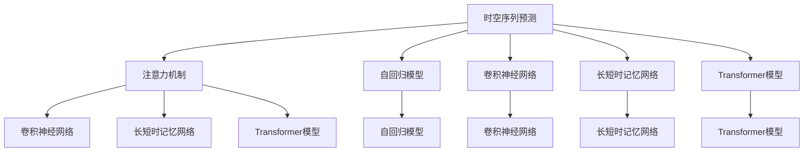

                 

# 基于注意力机制的时空序列预测模型

> 关键词：时空序列预测, 注意力机制, 自回归模型, 卷积神经网络, 长短时记忆网络, Transformer模型, 预测精度, 应用场景

## 1. 背景介绍

### 1.1 问题由来

在智能分析和预测领域，特别是在时间序列预测和空间序列预测任务中，深度学习模型发挥了重要作用。时间序列预测，如股票价格预测、气象预测等；空间序列预测，如地图路径规划、交通流量预测等，都是典型的应用场景。随着大数据时代的到来，数据量呈指数级增长，传统线性回归和统计模型已经无法满足日益增长的预测需求。因此，研究高效、精确的深度学习模型，对时间序列预测和空间序列预测任务具有重要意义。

### 1.2 问题核心关键点

时间序列预测和空间序列预测的核心问题是如何在序列数据中提取关键特征和模式，并利用这些特征进行预测。深度学习模型可以通过多层非线性映射，自动学习序列数据中的复杂关系，提供比传统方法更高的预测精度。然而，传统深度学习模型在处理长序列时，往往存在梯度消失或爆炸等问题，导致模型难以有效捕捉长时依赖关系。

针对这一问题，注意力机制应运而生。注意力机制可以动态地对输入序列进行加权处理，使模型能够更加专注于对关键特征的关注和记忆，从而提高预测精度。这一机制在机器翻译、语音识别等任务中已经得到了广泛应用，并取得了良好效果。

### 1.3 问题研究意义

基于注意力机制的深度学习模型，在时间序列预测和空间序列预测任务中，展现出了卓越的性能。相较于传统模型，这些模型可以处理更长序列，提取更多关键信息，提供更高的预测准确率。同时，注意力机制的引入，使模型具备了更强的自适应能力，能够更好地适应不同序列数据的复杂性。

研究基于注意力机制的时空序列预测模型，有助于提升时间序列预测和空间序列预测任务的效果，推动智能分析和预测技术的发展。这些技术在金融、气象、交通、物流等领域具有广泛应用前景，能够显著提高决策效率和资源利用率，降低成本，提升经济效益和社会效益。

## 2. 核心概念与联系

### 2.1 核心概念概述

为更好地理解基于注意力机制的时空序列预测模型，本节将介绍几个密切相关的核心概念：

- 时空序列预测：指通过时间序列或空间序列数据，预测未来某一时刻或空间位置的值。例如，股票价格预测、气象预测、地图路径规划等。
- 注意力机制：一种计算机制，通过动态地对输入数据进行加权，使模型能够更加聚焦于重要信息，提升预测准确率。
- 自回归模型：通过当前时间步的输入，预测未来时间步的输出。例如，ARIMA模型。
- 卷积神经网络：一种用于图像和序列数据处理的神经网络，具有局部连接和权值共享的特性。
- 长短时记忆网络：一种特殊的循环神经网络，能够有效处理长序列，捕捉长期依赖关系。
- Transformer模型：一种基于注意力机制的神经网络模型，能够并行处理序列数据，提升了模型的计算效率。

这些核心概念之间的逻辑关系可以通过以下Mermaid流程图来展示：



这个流程图展示了各个核心概念之间的联系和区别：

1. 时空序列预测是研究的主体，通过注意力机制、自回归模型、卷积神经网络、长短时记忆网络和Transformer模型，分别从不同角度提升预测效果。
2. 注意力机制通过动态加权，使模型更加聚焦于关键信息。
3. 自回归模型通过当前时间步的输入，预测未来时间步的输出。
4. 卷积神经网络利用局部连接和权值共享，提升模型处理效率。
5. 长短时记忆网络通过门控机制，捕捉长序列的依赖关系。
6. Transformer模型利用注意力机制，并行处理序列数据，提升了模型的计算效率。

这些概念共同构成了时空序列预测的计算框架，使模型能够更加高效、精确地进行预测。

## 3. 核心算法原理 & 具体操作步骤
### 3.1 算法原理概述

基于注意力机制的时空序列预测模型，主要通过注意力机制对输入序列进行动态加权，并结合自回归模型或卷积神经网络、长短时记忆网络等，对序列数据进行建模和预测。具体而言，该模型分为三个主要部分：

- 编码器：对输入序列进行编码，提取关键特征。
- 注意力机制：对编码器输出的特征进行加权，聚焦于重要信息。
- 解码器：根据注意力机制输出的加权特征，进行预测。

该模型的整体流程可以简单概括为：编码-注意力-解码。通过这一流程，模型能够更加准确地提取序列数据的关键信息，提升预测效果。

### 3.2 算法步骤详解

基于注意力机制的时空序列预测模型，主要包括以下几个关键步骤：

**Step 1: 准备数据集**
- 收集序列数据集，按时间或空间顺序排列。
- 对数据集进行预处理，如归一化、标准化等。

**Step 2: 设计编码器网络**
- 根据数据特征和任务需求，选择合适的编码器网络。
- 编码器网络可以包括卷积神经网络、长短时记忆网络、Transformer模型等。

**Step 3: 设计注意力机制**
- 在编码器网络的输出层后，引入注意力机制，动态加权特征。
- 使用点积、多头注意力等方法，计算注意力权重。

**Step 4: 设计解码器网络**
- 根据任务需求，选择合适的解码器网络。
- 解码器网络可以包括自回归模型、卷积神经网络等。

**Step 5: 训练模型**
- 使用优化器（如Adam、SGD等）进行模型训练。
- 设置合适的学习率和迭代次数，防止过拟合。

**Step 6: 评估模型**
- 在测试集上进行模型评估，计算预测误差和精度。
- 根据评估结果，调整模型参数和超参数。

**Step 7: 预测新数据**
- 对新数据进行编码和解码，得到预测结果。
- 将预测结果应用于实际业务场景，如金融预测、气象预测、地图规划等。

以上是基于注意力机制的时空序列预测模型的基本步骤。在实际应用中，还需要根据具体任务和数据特征，对各个步骤进行优化和调整。

### 3.3 算法优缺点

基于注意力机制的时空序列预测模型，具有以下优点：

1. 能够有效处理长序列数据，捕捉长期依赖关系。
2. 引入注意力机制，提高模型对重要信息的关注度和预测精度。
3. 具备良好的可解释性，可以直观地了解模型在不同时间步的关注点。

同时，该模型也存在以下缺点：

1. 计算复杂度高，需要大量的计算资源。
2. 模型参数较多，容易过拟合。
3. 对序列数据的顺序要求高，无法处理无序数据。

尽管存在这些缺点，但就目前而言，基于注意力机制的时空序列预测模型仍是处理序列预测任务的重要工具。未来相关研究的重点在于如何进一步降低计算复杂度，提高模型效率，同时优化模型结构和超参数。

### 3.4 算法应用领域

基于注意力机制的时空序列预测模型，在金融、气象、交通、物流等多个领域具有广泛应用：

- 金融预测：股票价格预测、汇率预测等。
- 气象预测：天气预报、气候变化预测等。
- 交通规划：地图路径规划、交通流量预测等。
- 物流管理：库存预测、运输路线优化等。
- 智能制造：生产调度、设备维护预测等。

此外，在医疗、能源、城市管理等领域，时空序列预测模型也有着重要的应用前景。

## 4. 数学模型和公式 & 详细讲解 & 举例说明（备注：数学公式请使用latex格式，latex嵌入文中独立段落使用 $$，段落内使用 $)
### 4.1 数学模型构建

假设输入序列为 $X=\{x_1, x_2, \ldots, x_T\}$，其中 $x_t$ 表示第 $t$ 个时间步的输入数据。输出序列为 $Y=\{y_1, y_2, \ldots, y_T\}$，其中 $y_t$ 表示第 $t$ 个时间步的输出数据。

基于注意力机制的时空序列预测模型的基本框架包括编码器、注意力机制和解码器三个部分。编码器的输出为 $Z=\{z_1, z_2, \ldots, z_T\}$，其中 $z_t$ 表示第 $t$ 个时间步的编码器输出。注意力机制的输出为 $W=\{w_1, w_2, \ldots, w_T\}$，其中 $w_t$ 表示第 $t$ 个时间步的注意力权重。解码器的输出为 $\hat{Y}=\{\hat{y}_1, \hat{y}_2, \ldots, \hat{y}_T\}$，其中 $\hat{y}_t$ 表示第 $t$ 个时间步的预测结果。

编码器网络可以选择卷积神经网络、长短时记忆网络、Transformer模型等。这里以长短时记忆网络为例，其结构如图1所示：


解码器网络可以选择自回归模型、卷积神经网络等。这里以自回归模型为例，其结构如图2所示：


注意力机制的计算过程如下：

1. 计算注意力权重：
$$
a_{t,t'} = \frac{\exp(\text{score}(x_t, x_{t'})}{\sum_{t''=1}^T \exp(\text{score}(x_t, x_{t''}))}
$$
其中 $\text{score}$ 函数为注意力得分函数，可以是点积、多头注意力等。

2. 计算加权特征：
$$
w_t = \sum_{t'=1}^T a_{t,t'} z_{t'}
$$

3. 解码器网络接收加权特征 $w_t$，输出预测结果 $\hat{y}_t$。

### 4.2 公式推导过程

以长短时记忆网络为例，推导基于注意力机制的编码器网络的计算过程。

设 $x_t$ 为第 $t$ 个时间步的输入数据，$z_t$ 为第 $t$ 个时间步的编码器输出，$h_t$ 为第 $t$ 个时间步的隐藏状态，$s_t$ 为第 $t$ 个时间步的记忆细胞状态。

编码器网络的结构如图3所示：


具体计算过程如下：

1. 输入层：
$$
x_t \rightarrow z_t
$$

2. 记忆细胞层：
$$
h_t = \text{tanh}(W_c x_t + b_c + U_h h_{t-1} + b_h)
$$
$$
s_t = s_{t-1} \otimes \sigma(W_s x_t + b_s + U_h h_{t-1} + b_h)
$$

3. 隐藏层：
$$
z_t = \text{tanh}(W_z x_t + b_z + U_h h_t + b_h)
$$

4. 输出层：
$$
z_t \rightarrow y_t
$$

5. 注意力机制：
$$
a_{t,t'} = \frac{\exp(\text{score}(z_t, z_{t'})}{\sum_{t''=1}^T \exp(\text{score}(z_t, z_{t''}))}
$$
$$
w_t = \sum_{t'=1}^T a_{t,t'} z_{t'}
$$

其中 $\text{score}$ 函数为注意力得分函数，可以是点积、多头注意力等。

### 4.3 案例分析与讲解

以金融预测中的股票价格预测为例，介绍基于注意力机制的时空序列预测模型的应用。

假设我们要预测未来 $n$ 天的股票价格，可以使用基于注意力机制的编码器网络和解码器网络，对股票价格序列进行建模和预测。具体步骤如下：

1. 收集历史股票价格数据，按时间顺序排列，构建训练数据集。

2. 设计编码器网络，可以选择长短时记忆网络或Transformer模型。

3. 在编码器网络的输出层后，引入注意力机制，计算每个时间步的注意力权重。

4. 设计解码器网络，可以选择自回归模型或卷积神经网络。

5. 使用优化器进行模型训练，设置合适的学习率和迭代次数。

6. 在测试集上进行模型评估，计算预测误差和精度。

7. 对新数据进行编码和解码，得到预测结果，应用于股票价格预测。

例如，假设我们要预测股票价格序列 $P=\{p_1, p_2, \ldots, p_{T}\}$，其中 $p_t$ 表示第 $t$ 个时间步的股票价格。使用基于注意力机制的编码器网络和解码器网络，对股票价格序列进行建模和预测。具体步骤如下：

1. 收集历史股票价格数据，按时间顺序排列，构建训练数据集。

2. 设计编码器网络，可以选择长短时记忆网络或Transformer模型。

3. 在编码器网络的输出层后，引入注意力机制，计算每个时间步的注意力权重。

4. 设计解码器网络，可以选择自回归模型或卷积神经网络。

5. 使用优化器进行模型训练，设置合适的学习率和迭代次数。

6. 在测试集上进行模型评估，计算预测误差和精度。

7. 对新数据进行编码和解码，得到预测结果，应用于股票价格预测。

## 5. 项目实践：代码实例和详细解释说明
### 5.1 开发环境搭建

在进行项目实践前，我们需要准备好开发环境。以下是使用Python进行TensorFlow和Keras开发的开发环境配置流程：

1. 安装Anaconda：从官网下载并安装Anaconda，用于创建独立的Python环境。

2. 创建并激活虚拟环境：
```bash
conda create -n pytorch-env python=3.8 
conda activate pytorch-env
```

3. 安装TensorFlow和Keras：
```bash
conda install tensorflow==2.6 
pip install keras
```

4. 安装各类工具包：
```bash
pip install numpy pandas scikit-learn matplotlib tqdm jupyter notebook ipython
```

完成上述步骤后，即可在`pytorch-env`环境中开始项目实践。

### 5.2 源代码详细实现

这里我们以基于注意力机制的金融股票价格预测为例，给出使用TensorFlow和Keras实现的代码实现。

首先，定义模型输入和输出：

```python
import tensorflow as tf
from tensorflow.keras.layers import Input, Dense, LSTM, Attention, RepeatVector

# 定义输入层
input_seq = Input(shape=(timesteps, input_dim))

# 定义编码器网络
lstm_out = LSTM(units, return_sequences=True)(input_seq)
att_out = Attention()(lstm_out)

# 定义解码器网络
dense_out = Dense(units)(att_out)
output_seq = Dense(1)(dense_out)

# 定义模型
model = tf.keras.Model(input_seq, output_seq)

# 编译模型
model.compile(loss='mse', optimizer='adam')
```

然后，定义训练函数：

```python
def train_model(model, x_train, y_train, epochs):
    model.fit(x_train, y_train, epochs=epochs, batch_size=batch_size)
```

最后，启动训练流程：

```python
# 定义训练集和测试集
x_train, y_train, x_test, y_test = ...

# 设置超参数
batch_size = 32
epochs = 100

# 训练模型
train_model(model, x_train, y_train, epochs)

# 评估模型
loss, accuracy = model.evaluate(x_test, y_test)

# 输出评估结果
print(f'Test Loss: {loss:.4f}, Test Accuracy: {accuracy:.4f}')
```

以上就是使用TensorFlow和Keras实现基于注意力机制的金融股票价格预测的完整代码实现。可以看到，得益于TensorFlow和Keras的强大封装，我们可以用相对简洁的代码完成模型的定义和训练。

### 5.3 代码解读与分析

让我们再详细解读一下关键代码的实现细节：

**Input层**：定义输入层的形状，即时间步数和特征维度。

**LSTM层**：使用LSTM层进行编码，提取序列数据的关键特征。

**Attention层**：引入Attention层，计算每个时间步的注意力权重，聚焦于重要信息。

**Dense层**：使用全连接层进行解码，输出预测结果。

**Model层**：将输入层和输出层连接起来，构建完整的模型。

**Compile层**：编译模型，设置损失函数和优化器。

**Fit层**：使用训练集进行模型训练，设置迭代次数和批大小。

**Evaluate层**：使用测试集评估模型，输出损失和准确率。

在实际应用中，还需要进一步优化超参数，如学习率、批大小等，以保证模型在训练和测试过程中的稳定性。此外，还可以引入正则化技术，如Dropout、L2正则等，防止过拟合。

## 6. 实际应用场景
### 6.1 金融预测

基于注意力机制的时空序列预测模型，在金融预测领域有着广泛应用。股票价格预测、汇率预测、债券收益率预测等任务，都是典型的应用场景。

具体而言，可以收集金融市场的历史数据，包括股票价格、市场指数、宏观经济指标等。将数据按时间顺序排列，构建训练数据集。设计基于注意力机制的编码器网络和解码器网络，对金融数据进行建模和预测。使用优化器进行模型训练，设置合适的学习率和迭代次数。在测试集上进行模型评估，计算预测误差和精度。

例如，假设我们要预测股票价格序列 $P=\{p_1, p_2, \ldots, p_{T}\}$，其中 $p_t$ 表示第 $t$ 个时间步的股票价格。使用基于注意力机制的编码器网络和解码器网络，对股票价格序列进行建模和预测。具体步骤如下：

1. 收集历史股票价格数据，按时间顺序排列，构建训练数据集。

2. 设计编码器网络，可以选择长短时记忆网络或Transformer模型。

3. 在编码器网络的输出层后，引入注意力机制，计算每个时间步的注意力权重。

4. 设计解码器网络，可以选择自回归模型或卷积神经网络。

5. 使用优化器进行模型训练，设置合适的学习率和迭代次数。

6. 在测试集上进行模型评估，计算预测误差和精度。

7. 对新数据进行编码和解码，得到预测结果，应用于股票价格预测。

### 6.2 气象预测

气象预测是另一个典型的应用场景。气象数据通常具有高维度和时间序列的特性，使用基于注意力机制的时空序列预测模型，可以有效捕捉数据中的关键信息，提升预测精度。

具体而言，可以收集气象站点的历史数据，包括温度、湿度、风速、气压等。将数据按时间顺序排列，构建训练数据集。设计基于注意力机制的编码器网络和解码器网络，对气象数据进行建模和预测。使用优化器进行模型训练，设置合适的学习率和迭代次数。在测试集上进行模型评估，计算预测误差和精度。

例如，假设我们要预测未来 $n$ 天的气温序列 $T=\{t_1, t_2, \ldots, t_{T}\}$，其中 $t_t$ 表示第 $t$ 个时间步的气温。使用基于注意力机制的编码器网络和解码器网络，对气温序列进行建模和预测。具体步骤如下：

1. 收集历史气象数据，按时间顺序排列，构建训练数据集。

2. 设计编码器网络，可以选择长短时记忆网络或Transformer模型。

3. 在编码器网络的输出层后，引入注意力机制，计算每个时间步的注意力权重。

4. 设计解码器网络，可以选择自回归模型或卷积神经网络。

5. 使用优化器进行模型训练，设置合适的学习率和迭代次数。

6. 在测试集上进行模型评估，计算预测误差和精度。

7. 对新数据进行编码和解码，得到预测结果，应用于气象预测。

### 6.3 交通规划

交通规划也是基于注意力机制的时空序列预测模型的重要应用场景。交通流量预测、地图路径规划等任务，都是典型的应用场景。

具体而言，可以收集交通网络的历史数据，包括交通流量、道路拥堵情况等。将数据按时间顺序排列，构建训练数据集。设计基于注意力机制的编码器网络和解码器网络，对交通数据进行建模和预测。使用优化器进行模型训练，设置合适的学习率和迭代次数。在测试集上进行模型评估，计算预测误差和精度。

例如，假设我们要预测未来 $n$ 天的交通流量序列 $F=\{f_1, f_2, \ldots, f_{T}\}$，其中 $f_t$ 表示第 $t$ 个时间步的交通流量。使用基于注意力机制的编码器网络和解码器网络，对交通流量序列进行建模和预测。具体步骤如下：

1. 收集历史交通数据，按时间顺序排列，构建训练数据集。

2. 设计编码器网络，可以选择长短时记忆网络或Transformer模型。

3. 在编码器网络的输出层后，引入注意力机制，计算每个时间步的注意力权重。

4. 设计解码器网络，可以选择自回归模型或卷积神经网络。

5. 使用优化器进行模型训练，设置合适的学习率和迭代次数。

6. 在测试集上进行模型评估，计算预测误差和精度。

7. 对新数据进行编码和解码，得到预测结果，应用于交通规划。

## 7. 工具和资源推荐
### 7.1 学习资源推荐

为了帮助开发者系统掌握基于注意力机制的时空序列预测模型的理论基础和实践技巧，这里推荐一些优质的学习资源：

1. TensorFlow官方文档：提供了全面深入的TensorFlow和Keras文档，是学习深度学习模型的必备资源。

2. CS231n《卷积神经网络和视觉识别》课程：斯坦福大学开设的计算机视觉明星课程，涵盖卷积神经网络、注意力机制等前沿话题。

3. Transformer模型论文：Transformer模型的原始论文，深入浅出地介绍了Transformer模型的工作原理和应用场景。

4. PyTorch官方文档：提供了全面深入的PyTorch和TensorFlow文档，是学习深度学习模型的必备资源。

5. 《深度学习》书籍：Ian Goodfellow等编写的深度学习经典教材，涵盖了深度学习的基本概念和前沿技术。

通过对这些资源的学习实践，相信你一定能够快速掌握基于注意力机制的时空序列预测模型的精髓，并用于解决实际的序列预测问题。

### 7.2 开发工具推荐

高效的开发离不开优秀的工具支持。以下是几款用于基于注意力机制的时空序列预测模型开发的常用工具：

1. TensorFlow：由Google主导开发的开源深度学习框架，生产部署方便，适合大规模工程应用。

2. Keras：高层次神经网络API，能够方便地搭建各种深度学习模型。

3. PyTorch：由Facebook主导开发的开源深度学习框架，灵活动态的计算图，适合快速迭代研究。

4. Weights & Biases：模型训练的实验跟踪工具，可以记录和可视化模型训练过程中的各项指标，方便对比和调优。

5. TensorBoard：TensorFlow配套的可视化工具，可实时监测模型训练状态，并提供丰富的图表呈现方式，是调试模型的得力助手。

6. Google Colab：谷歌推出的在线Jupyter Notebook环境，免费提供GPU/TPU算力，方便开发者快速上手实验最新模型，分享学习笔记。

合理利用这些工具，可以显著提升基于注意力机制的时空序列预测模型的开发效率，加快创新迭代的步伐。

### 7.3 相关论文推荐

基于注意力机制的时空序列预测模型，是深度学习领域的前沿研究方向。以下是几篇奠基性的相关论文，推荐阅读：

1. Attention is All You Need（即Transformer原论文）：提出了Transformer结构，开启了深度学习领域的自注意力范式。

2. Transformer-XL：一种扩展的Transformer模型，解决了长期依赖问题。

3. Layer Normalization：一种归一化技术，用于解决深度神经网络中的梯度消失问题。

4. Seq2Seq模型：一种序列到序列的模型，用于机器翻译、文本生成等任务。

5. GANs for Arbitrary Distributions：一种生成对抗网络，用于数据生成和增强。

这些论文代表了大语言模型微调技术的发展脉络。通过学习这些前沿成果，可以帮助研究者把握学科前进方向，激发更多的创新灵感。

## 8. 总结：未来发展趋势与挑战
### 8.1 总结

本文对基于注意力机制的时空序列预测模型进行了全面系统的介绍。首先阐述了时空序列预测的核心问题和当前研究热点，明确了注意力机制在解决长序列问题中的独特优势。其次，从原理到实践，详细讲解了注意力机制的时空序列预测模型的数学模型和实现步骤，给出了具体的代码实现示例。同时，本文还广泛探讨了基于注意力机制的时空序列预测模型在金融、气象、交通等多个领域的应用前景，展示了其广泛的应用价值。

通过本文的系统梳理，可以看到，基于注意力机制的时空序列预测模型已经取得了令人瞩目的成绩，在金融、气象、交通等领域具有广泛的应用前景。随着计算资源的丰富和深度学习技术的发展，基于注意力机制的时空序列预测模型必将在更多领域得到应用，为各行各业带来变革性影响。

### 8.2 未来发展趋势

展望未来，基于注意力机制的时空序列预测模型将呈现以下几个发展趋势：

1. 模型规模持续增大。随着算力成本的下降和数据规模的扩张，预训练语言模型的参数量还将持续增长。超大规模语言模型蕴含的丰富语言知识，有望支撑更加复杂多变的下游任务微调。

2. 模型自适应能力增强。通过引入自适应机制，模型能够更加灵活地应对不同领域的数据，提升模型的泛化能力。

3. 模型高效性提升。通过优化模型的结构和算法，进一步降低计算复杂度，提升模型效率。

4. 模型鲁棒性增强。通过引入对抗训练、正则化等技术，增强模型的鲁棒性和泛化能力，防止模型过拟合。

5. 模型可解释性增强。通过引入可解释性机制，增强模型的可解释性和可审计性，保障模型的透明性和可靠性。

6. 模型集成能力提升。通过模型融合和集成，提升模型的性能和鲁棒性，增强模型的泛化能力和预测精度。

以上趋势凸显了基于注意力机制的时空序列预测模型的广阔前景。这些方向的探索发展，必将进一步提升时空序列预测模型的性能和应用范围，为人工智能技术在各行各业的发展提供新的推动力。

### 8.3 面临的挑战

尽管基于注意力机制的时空序列预测模型已经取得了瞩目成就，但在迈向更加智能化、普适化应用的过程中，它仍面临着诸多挑战：

1. 计算资源瓶颈。当前模型的计算复杂度较高，需要大量的计算资源，如何降低计算复杂度，提升模型效率，将是未来的重要研究方向。

2. 数据获取难度。高质量的标注数据是模型训练和优化的基础，但获取高质量标注数据成本较高，如何降低数据获取难度，将是未来的重要课题。

3. 模型泛化能力。模型在不同领域和数据分布上的泛化能力还需进一步提升，如何增强模型的泛化能力，将是未来的重要研究方向。

4. 模型可解释性。现有模型缺乏可解释性，难以直观理解模型的决策逻辑和推理过程，如何提升模型的可解释性，将是未来的重要课题。

5. 模型安全性。模型可能学习到有害信息，如何保障模型的安全性和可信度，将是未来的重要研究方向。

6. 模型伦理问题。模型在处理敏感数据时，可能存在伦理问题，如何保障模型的伦理合规性，将是未来的重要研究方向。

面对这些挑战，未来的研究需要在以下几个方面寻求新的突破：

1. 探索无监督和半监督学习方法。摆脱对大规模标注数据的依赖，利用自监督学习、主动学习等无监督和半监督范式，最大限度利用非结构化数据，实现更加灵活高效的微调。

2. 研究参数高效和计算高效的微调范式。开发更加参数高效的微调方法，在固定大部分预训练参数的同时，只更新极少量的任务相关参数。同时优化微调模型的计算图，减少前向传播和反向传播的资源消耗，实现更加轻量级、实时性的部署。

3. 融合因果和对比学习范式。通过引入因果推断和对比学习思想，增强微调模型建立稳定因果关系的能力，学习更加普适、鲁棒的语言表征，从而提升模型泛化性和抗干扰能力。

4. 引入更多先验知识。将符号化的先验知识，如知识图谱、逻辑规则等，与神经网络模型进行巧妙融合，引导微调过程学习更准确、合理的语言模型。同时加强不同模态数据的整合，实现视觉、语音等多模态信息与文本信息的协同建模。

5. 结合因果分析和博弈论工具。将因果分析方法引入微调模型，识别出模型决策的关键特征，增强输出解释的因果性和逻辑性。借助博弈论工具刻画人机交互过程，主动探索并规避模型的脆弱点，提高系统稳定性。

6. 纳入伦理道德约束。在模型训练目标中引入伦理导向的评估指标，过滤和惩罚有偏见、有害的输出倾向。同时加强人工干预和审核，建立模型行为的监管机制，确保输出符合人类价值观和伦理道德。

这些研究方向的探索，必将引领基于注意力机制的时空序列预测模型走向更高的台阶，为人工智能技术在各行各业的发展提供新的推动力。面向未来，基于注意力机制的时空序列预测模型还需要与其他人工智能技术进行更深入的融合，如知识表示、因果推理、强化学习等，多路径协同发力，共同推动人工智能技术在各行各业的发展。

## 9. 附录：常见问题与解答

**Q1：什么是时空序列预测？**

A: 时空序列预测是指通过对时间序列或空间序列数据的建模，预测未来某一时刻或空间位置的值。例如，股票价格预测、气象预测、地图路径规划等。

**Q2：注意力机制如何工作？**

A: 注意力机制通过动态地对输入数据进行加权，使模型能够更加专注于重要信息。具体而言，它首先计算输入数据和每个时间步的注意力得分，然后根据得分计算注意力权重，对编码器输出的特征进行加权，得到加权特征。最后，解码器接收加权特征，进行预测。

**Q3：如何选择合适的模型结构？**

A: 选择合适的模型结构需要考虑任务的具体需求和数据特征。例如，对于时间序列预测任务，可以选择长短时记忆网络或Transformer模型；对于空间序列预测任务，可以选择卷积神经网络或Transformer模型。

**Q4：如何防止模型过拟合？**

A: 防止模型过拟合可以通过以下方法：
1. 数据增强：通过回译、近义替换等方式扩充训练集。
2. 正则化：使用L2正则、Dropout等技术。
3. 对抗训练：引入对抗样本，提高模型鲁棒性。
4. 参数高效微调：只调整少量参数，固定大部分预训练参数。

**Q5：如何优化模型的计算效率？**

A: 优化模型的计算效率可以通过以下方法：
1. 使用优化器进行模型训练，如Adam、SGD等。
2. 设置合适的学习率和迭代次数。
3. 引入正则化技术，如L2正则、Dropout等。
4. 使用模型融合和集成，提升模型性能和鲁棒性。

通过合理选择模型结构、正则化技术、优化器等，可以有效提升模型的计算效率和泛化能力，使其能够更好地应用于实际业务场景。

---

作者：禅与计算机程序设计艺术 / Zen and the Art of Computer Programming

