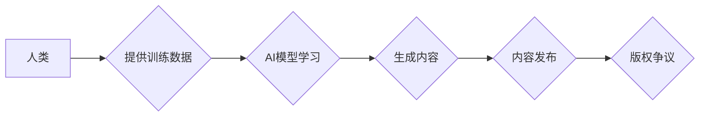

                 

## AI生成内容版权：法律和伦理的思考

> 关键词：人工智能、AI生成内容、版权、著作权、法律、伦理、伦理学、知识产权、法律法规

### 1. 背景介绍

近年来，人工智能（AI）技术飞速发展，特别是生成式AI模型的涌现，如OpenAI的GPT-3、DALL-E 2以及谷歌的LaMDA等，能够生成逼真、高质量的文本、图像、音频等内容，引发了社会各界的广泛关注。AI生成内容的便捷性和创造力为人们带来了前所未有的便利，但也同时带来了新的挑战，其中版权问题最为突出。

传统版权法主要针对人类创作的作品，而AI生成内容的创作主体并非人类，而是算法模型。这使得现有的法律框架难以适用，如何界定AI生成内容的著作权归属，以及如何保护AI生成内容的权利，成为亟待解决的法律难题。

### 2. 核心概念与联系

**2.1 核心概念**

* **AI生成内容 (AI-Generated Content):** 由人工智能算法模型自动生成的文本、图像、音频、视频等各种数字内容。
* **版权 (Copyright):**  一种知识产权，保护原创作品的作者对其作品进行复制、发行、表演、展示等方面的排他性权利。
* **著作权 (Authorship):**  指对作品的创作行为，通常由人类进行。

**2.2 概念联系**

AI生成内容的版权问题本质上是关于“著作权归属”的争论。传统版权法认为，只有人类才能享有著作权，而AI模型作为工具，只能被视为创作过程中的辅助手段。然而，随着AI技术的进步，AI模型能够自主学习和创作，其生成的內容越来越接近人类的创作水平，这使得“著作权归属”的界定变得更加模糊。

**2.3 Mermaid 流程图**



### 3. 核心算法原理 & 具体操作步骤

**3.1 算法原理概述**

AI生成内容的核心算法通常是基于深度学习的生成模型，例如：

* **Transformer模型:**  通过自注意力机制学习文本的上下文关系，能够生成流畅、连贯的文本。
* **Generative Adversarial Networks (GANs):**  通过两个神经网络对抗训练，生成逼真的图像、音频等内容。
* **Variational Autoencoders (VAEs):**  通过编码和解码过程，学习数据的潜在表示，并生成新的数据样本。

**3.2 算法步骤详解**

1. **数据收集和预处理:** 收集大量相关领域的文本、图像、音频等数据，并进行清洗、格式化等预处理。
2. **模型训练:** 使用训练数据训练深度学习模型，通过反向传播算法不断调整模型参数，使其能够生成符合要求的内容。
3. **内容生成:** 将训练好的模型应用于新的输入数据，生成新的文本、图像、音频等内容。
4. **内容评估:** 对生成的內容进行评估，例如文本的流畅度、图像的逼真度等，并根据评估结果进行模型调整。

**3.3 算法优缺点**

* **优点:** 能够生成高质量、多样化的内容，提高创作效率，降低创作成本。
* **缺点:**  

    * 容易生成虚假信息、抄袭内容等问题。
    * 模型训练需要大量数据和计算资源。
    * 难以完全模拟人类的创造力。

**3.4 算法应用领域**

* 文本生成：自动写作、机器翻译、聊天机器人等。
* 图像生成：图像合成、图像修复、艺术创作等。
* 音频生成：音乐创作、语音合成、音效制作等。

### 4. 数学模型和公式 & 详细讲解 & 举例说明

**4.1 数学模型构建**

AI生成内容的数学模型通常基于概率论和统计学，例如：

* **语言模型:** 使用概率分布来表示单词的出现概率，例如n-gram模型、Transformer模型等。
* **图像生成模型:** 使用概率分布来表示像素的分布，例如GANs、VAEs等。

**4.2 公式推导过程**

例如，n-gram模型的概率计算公式如下：

$$P(w_i|w_{i-n+1},...,w_{i-1}) = \frac{C(w_{i-n+1},...,w_{i})}{C(w_{i-n+1},...,w_{i-1})}$$

其中：

* $P(w_i|w_{i-n+1},...,w_{i-1})$ 表示给定前n-1个单词的情况下，第i个单词出现的概率。
* $C(w_{i-n+1},...,w_{i})$ 表示在训练数据中出现次数为n个单词的序列 $(w_{i-n+1},...,w_{i})$ 的次数。
* $C(w_{i-n+1},...,w_{i-1})$ 表示在训练数据中出现次数为n-1个单词的序列 $(w_{i-n+1},...,w_{i-1})$ 的次数。

**4.3 案例分析与讲解**

例如，使用n-gram模型生成句子“今天天气很好”，如果训练数据中包含了“今天天气”这个n-gram，那么模型会根据这个n-gram的概率来预测下一个单词是“很好”。

### 5. 项目实践：代码实例和详细解释说明

**5.1 开发环境搭建**

* Python 3.x
* TensorFlow 或 PyTorch 深度学习框架
* Jupyter Notebook 或 VS Code 代码编辑器

**5.2 源代码详细实现**

```python
# 使用 TensorFlow 生成文本示例

import tensorflow as tf

# 定义一个简单的文本生成模型
model = tf.keras.Sequential([
    tf.keras.layers.Embedding(input_dim=10000, output_dim=128),
    tf.keras.layers.LSTM(128),
    tf.keras.layers.Dense(10000, activation='softmax')
])

# 加载训练数据
# ...

# 训练模型
model.compile(loss='sparse_categorical_crossentropy', optimizer='adam')
model.fit(x_train, y_train, epochs=10)

# 生成新文本
seed_text = "今天天气"
for _ in range(10):
    predictions = model.predict(tf.expand_dims(seed_text, 0))
    predicted_index = tf.argmax(predictions[0]).numpy()
    predicted_word = vocabulary[predicted_index]
    seed_text += " " + predicted_word
```

**5.3 代码解读与分析**

* 代码使用 TensorFlow 库构建了一个简单的文本生成模型。
* 模型包含 Embedding 层、LSTM 层和 Dense 层。
* Embedding 层将单词映射到向量空间。
* LSTM 层学习文本的上下文关系。
* Dense 层输出每个单词的概率分布。
* 训练模型时，使用交叉熵损失函数和 Adam 优化器。
* 生成新文本时，根据模型的概率分布预测下一个单词。

**5.4 运行结果展示**

运行代码后，会生成一个基于训练数据的文本序列，例如：

```
今天天气很好 明天还会继续晴朗
```

### 6. 实际应用场景

**6.1 文本生成**

* **自动写作:**  生成新闻报道、产品描述、广告文案等。
* **机器翻译:**  将文本从一种语言翻译成另一种语言。
* **聊天机器人:**  与用户进行自然语言对话。

**6.2 图像生成**

* **图像合成:**  生成逼真的图像，例如人脸、场景、物体等。
* **图像修复:**  修复损坏的图像，例如去除噪点、修复缺失部分等。
* **艺术创作:**  生成艺术作品，例如绘画、雕塑等。

**6.3 音频生成**

* **音乐创作:**  生成新的音乐旋律、伴奏等。
* **语音合成:**  将文本转换为语音。
* **音效制作:**  生成各种音效，例如枪声、爆炸声等。

**6.4 未来应用展望**

AI生成内容的应用场景还在不断扩展，未来可能在以下领域发挥更大的作用：

* **教育:**  生成个性化学习内容、自动批改作业等。
* **医疗:**  生成医学图像、辅助诊断等。
* **娱乐:**  生成游戏场景、电影特效等。

### 7. 工具和资源推荐

**7.1 学习资源推荐**

* **书籍:**

    * 《Deep Learning》 by Ian Goodfellow, Yoshua Bengio, and Aaron Courville
    * 《Generative Deep Learning》 by David Foster

* **在线课程:**

    * Coursera: Deep Learning Specialization
    * Udacity: Deep Learning Nanodegree

**7.2 开发工具推荐**

* **TensorFlow:**  开源深度学习框架，支持多种硬件平台。
* **PyTorch:**  开源深度学习框架，以其灵活性和易用性而闻名。
* **Hugging Face Transformers:**  提供预训练的 Transformer 模型，方便进行文本生成任务。

**7.3 相关论文推荐**

* 《Attention Is All You Need》
* 《Generative Adversarial Networks》
* 《Variational Autoencoders for Generation》

### 8. 总结：未来发展趋势与挑战

**8.1 研究成果总结**

近年来，AI生成内容领域取得了显著进展，模型的生成能力不断提升，应用场景也越来越广泛。

**8.2 未来发展趋势**

* **模型能力提升:**  模型将更加强大，能够生成更加逼真、多样化的内容。
* **应用场景拓展:**  AI生成内容将应用于更多领域，例如教育、医疗、娱乐等。
* **伦理规范制定:**  随着AI生成内容的应用越来越广泛，伦理规范的制定和监管将变得更加重要。

**8.3 面临的挑战**

* **版权问题:**  AI生成内容的著作权归属问题尚未得到明确解决。
* **虚假信息问题:**  AI模型可能生成虚假信息，需要开发有效的检测和防范机制。
* **伦理问题:**  AI生成内容可能被用于恶意目的，例如生成虚假新闻、进行网络攻击等，需要加强伦理规范和监管。

**8.4 研究展望**

未来，AI生成内容领域的研究将集中在以下几个方面：

* **开发更加安全、可靠的AI模型:**  提高模型的鲁棒性、可解释性和安全性。
* **探索新的AI生成内容应用场景:**  将AI生成内容应用于更多领域，创造新的价值。
* **制定完善的AI生成内容伦理规范:**  引导AI技术健康发展，避免负面影响。

### 9. 附录：常见问题与解答

**9.1  AI生成内容的著作权归属问题如何解决？**

目前，关于AI生成内容的著作权归属问题还没有一个明确的答案。一些国家和地区正在制定相关的法律法规，但目前还没有统一的标准。

**9.2  如何防止AI生成内容被用于恶意目的？**

需要开发有效的检测和防范机制，例如：

* **内容审核:**  对AI生成内容进行人工审核，识别虚假信息、恶意内容等。
* **技术手段:**  使用机器学习算法检测AI生成内容的特征，识别潜在的恶意内容。
* **法律法规:**  制定相关的法律法规，规范AI生成内容的应用，防止其被用于恶意目的。


作者：禅与计算机程序设计艺术 / Zen and the Art of Computer Programming 
<end_of_turn>

