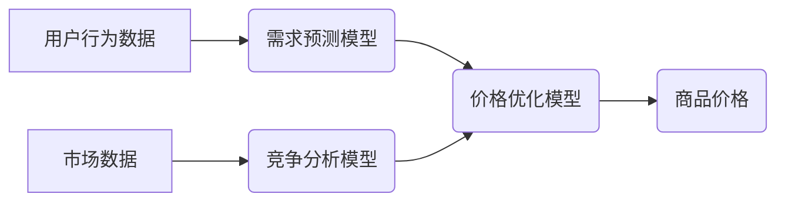

                 

## AI赋能的动态定价策略在电商中的应用

> 关键词：动态定价、机器学习、电商、人工智能、价格优化、需求预测、竞争分析

## 1. 背景介绍

在当今激烈的电商市场竞争中，定价策略是企业获取利润和提升市场份额的关键因素。传统的定价方法往往依赖于经验和主观判断，难以适应市场需求的快速变化和竞争环境的日益复杂。随着人工智能（AI）技术的快速发展，AI赋能的动态定价策略逐渐成为电商行业的新趋势。

动态定价是指根据实时市场数据和用户行为等因素，动态调整商品价格的策略。相比于传统的静态定价，动态定价能够更精准地反映市场供需关系，提高商品销售额和利润率。

## 2. 核心概念与联系

### 2.1  核心概念

* **动态定价:** 根据实时市场数据和用户行为等因素，动态调整商品价格的策略。
* **机器学习:** 一种人工智能技术，通过算法训练，从数据中学习规律，并用于预测和决策。
* **需求预测:** 利用历史数据和市场趋势，预测未来商品的需求量。
* **竞争分析:** 分析竞争对手的定价策略和市场份额，为制定自己的定价策略提供参考。

### 2.2  架构图



## 3. 核心算法原理 & 具体操作步骤

### 3.1  算法原理概述

AI赋能的动态定价策略通常基于以下核心算法：

* **回归算法:** 用于预测商品价格与相关因素之间的关系，例如需求量、成本、竞争对手价格等。
* **分类算法:** 用于将商品分类到不同的定价区间，例如高价、中价、低价等。
* **强化学习算法:** 用于训练一个智能代理，通过不断调整价格，最大化利润。

### 3.2  算法步骤详解

1. **数据收集:** 收集用户行为数据、市场数据和竞争对手数据。
2. **数据预处理:** 对收集到的数据进行清洗、转换和特征工程，使其适合算法训练。
3. **模型训练:** 选择合适的算法模型，并利用训练数据进行模型训练。
4. **模型评估:** 使用测试数据评估模型的性能，并进行模型调优。
5. **价格优化:** 将训练好的模型应用于实时数据，预测商品价格，并根据预设的策略进行价格调整。
6. **监控与分析:** 持续监控价格调整的效果，并对模型进行更新和优化。

### 3.3  算法优缺点

**优点:**

* **精准定价:** 基于数据分析，能够更精准地反映市场供需关系，提高定价准确性。
* **实时调整:** 可以根据实时市场变化动态调整价格，提高价格灵活性。
* **自动化决策:** 可以自动化执行定价决策，减少人工成本。

**缺点:**

* **数据依赖:** 需要大量高质量的数据进行训练，否则模型性能会受到影响。
* **模型复杂:** 需要专业的技术人员进行模型开发和维护。
* **伦理风险:** 动态定价可能会导致价格歧视等伦理问题。

### 3.4  算法应用领域

* **电商平台:** 为商品定价、促销活动等提供数据支持。
* **旅游行业:** 为机票、酒店等产品定价提供动态调整方案。
* **金融行业:** 为贷款、保险等产品定价提供个性化方案。

## 4. 数学模型和公式 & 详细讲解 & 举例说明

### 4.1  数学模型构建

动态定价策略通常基于以下数学模型：

* **线性回归模型:** 用于预测商品价格与相关因素之间的线性关系。
* **逻辑回归模型:** 用于预测商品是否会被购买，以及购买概率。
* **神经网络模型:** 用于学习更复杂的非线性关系，提高预测精度。

### 4.2  公式推导过程

**线性回归模型:**

假设商品价格 $p$ 与需求量 $q$ 之间存在线性关系，可以表示为：

$$p = a + bq$$

其中，$a$ 是截距，$b$ 是斜率。

通过最小二乘法，可以求解 $a$ 和 $b$ 的值。

**逻辑回归模型:**

假设商品被购买的概率 $P$ 与价格 $p$ 之间存在逻辑关系，可以表示为：

$$P = \frac{1}{1 + e^{-(a + bp)}}$$

其中，$a$ 和 $b$ 是模型参数。

通过最大似然估计，可以求解 $a$ 和 $b$ 的值。

### 4.3  案例分析与讲解

假设一家电商平台销售一款商品，其需求量与价格之间存在线性关系。通过收集历史数据，得到以下数据点：

| 价格 (元) | 需求量 (件) |
|---|---|
| 10 | 100 |
| 15 | 80 |
| 20 | 60 |
| 25 | 40 |

可以使用线性回归模型对这些数据点进行拟合，得到商品价格与需求量之间的线性关系。

## 5. 项目实践：代码实例和详细解释说明

### 5.1  开发环境搭建

* Python 3.x
* Jupyter Notebook
* pandas
* scikit-learn

### 5.2  源代码详细实现

```python
import pandas as pd
from sklearn.linear_model import LinearRegression

# 加载数据
data = pd.read_csv('price_demand_data.csv')

# 准备数据
X = data[['price']]
y = data['demand']

# 创建线性回归模型
model = LinearRegression()

# 训练模型
model.fit(X, y)

# 预测需求量
new_price = 22
predicted_demand = model.predict([[new_price]])

# 打印预测结果
print(f'当价格为 {new_price} 元时，预测需求量为 {predicted_demand[0]} 件')
```

### 5.3  代码解读与分析

* 首先，加载数据并准备训练数据和目标变量。
* 然后，创建线性回归模型并训练模型。
* 最后，使用训练好的模型预测新的价格下对应的需求量。

### 5.4  运行结果展示

运行上述代码，可以得到预测的需求量。

## 6. 实际应用场景

### 6.1  电商平台

* **商品定价:** 根据商品属性、市场需求、竞争对手价格等因素，动态调整商品价格，提高销售额和利润率。
* **促销活动:** 根据用户行为和市场趋势，制定个性化的促销活动，吸引用户购买。

### 6.2  旅游行业

* **机票定价:** 根据航班时间、目的地、市场需求等因素，动态调整机票价格，提高收益率。
* **酒店定价:** 根据酒店位置、设施、入住日期等因素，动态调整酒店价格，优化房间入住率。

### 6.3  金融行业

* **贷款利率:** 根据借款人的信用评分、贷款金额、贷款期限等因素，动态调整贷款利率，降低风险并提高收益。
* **保险保费:** 根据被保险人的年龄、健康状况、保险类型等因素，动态调整保险保费，提高保险产品的竞争力。

### 6.4  未来应用展望

随着人工智能技术的不断发展，AI赋能的动态定价策略将在更多领域得到应用，例如：

* **医疗保健:** 根据患者的病情、治疗方案等因素，动态调整医疗服务价格。
* **教育培训:** 根据学生的学习进度、学习能力等因素，动态调整教育培训课程价格。
* **能源行业:** 根据能源供需情况，动态调整能源价格，提高能源利用效率。

## 7. 工具和资源推荐

### 7.1  学习资源推荐

* **书籍:**
    * 《机器学习》 by Tom Mitchell
    * 《深度学习》 by Ian Goodfellow, Yoshua Bengio, and Aaron Courville
* **在线课程:**
    * Coursera: Machine Learning
    * edX: Artificial Intelligence

### 7.2  开发工具推荐

* **Python:** 
    * pandas
    * scikit-learn
    * TensorFlow
    * PyTorch

* **云平台:**
    * AWS
    * Azure
    * Google Cloud

### 7.3  相关论文推荐

* **Dynamic Pricing with Machine Learning:** https://arxiv.org/abs/1706.03762
* **Reinforcement Learning for Dynamic Pricing:** https://arxiv.org/abs/1806.01914

## 8. 总结：未来发展趋势与挑战

### 8.1  研究成果总结

AI赋能的动态定价策略在电商行业取得了显著的成果，能够提高定价准确性、灵活性，并为企业带来更高的利润。

### 8.2  未来发展趋势

* **更精准的预测:** 利用更先进的机器学习算法和更丰富的用户数据，提高价格预测的准确性。
* **更个性化的定价:** 根据用户的购买历史、偏好等信息，提供更个性化的定价方案。
* **更智能的决策:** 利用强化学习算法，训练智能代理，自动执行价格调整决策。

### 8.3  面临的挑战

* **数据安全:** 确保用户数据的安全和隐私。
* **算法解释性:** 提高算法的解释性，使定价决策更加透明。
* **伦理风险:** 避免动态定价导致价格歧视等伦理问题。

### 8.4  研究展望

未来，AI赋能的动态定价策略将继续朝着更精准、更个性化、更智能的方向发展，并应用于更多领域，为企业和消费者带来更大的价值。

## 9. 附录：常见问题与解答

* **Q: 动态定价会损害用户体验吗？**

A: 如果动态定价策略合理设计，并注重用户体验，可以提高用户满意度。例如，可以根据用户的购买历史和偏好，提供更优惠的价格。

* **Q: 动态定价是否会加剧市场竞争？**

A: 动态定价可以提高市场竞争的效率，促使企业不断创新和优化产品和服务。

* **Q: 如何确保动态定价的公平性？**

A: 需要制定相应的法律法规和行业标准，规范动态定价的应用，避免价格歧视等问题。


作者：禅与计算机程序设计艺术 / Zen and the Art of Computer Programming 
<end_of_turn>

