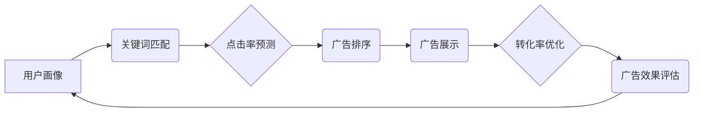

                 

## AI驱动的电商搜索广告投放策略

> 关键词：电商搜索广告、AI算法、机器学习、深度学习、推荐系统、点击率预测、转化率优化、用户画像

## 1. 背景介绍

电商平台的竞争日益激烈，吸引用户点击并最终转化为销售是一个巨大的挑战。传统的搜索广告投放策略主要依赖于人工经验和规则设定，难以精准匹配用户需求，导致广告投放效率低下。随着人工智能技术的快速发展，AI驱动的电商搜索广告投放策略逐渐成为行业主流趋势。

AI算法能够通过对海量用户行为数据进行分析和学习，精准识别用户兴趣和需求，从而实现以下目标：

* **精准匹配广告目标用户:** AI算法可以根据用户的搜索历史、浏览记录、购买行为等数据，构建用户画像，精准匹配广告目标用户，提高广告点击率和转化率。
* **动态调整广告投放策略:** AI算法可以实时监测广告效果，根据用户反馈和市场变化，动态调整广告投放策略，优化广告预算分配，最大化广告效益。
* **个性化广告推荐:** AI算法可以根据用户的个性化需求，推荐个性化广告，提升用户体验，增强用户粘性。

## 2. 核心概念与联系

电商搜索广告投放策略的核心概念包括：

* **用户画像:** 通过分析用户的行为数据，构建用户画像，包括用户的兴趣爱好、消费习惯、购买偏好等信息。
* **关键词匹配:** 根据用户的搜索关键词，匹配相关的广告，实现精准广告投放。
* **点击率预测:** 利用机器学习算法，预测用户点击广告的概率，优化广告排序和展示位置。
* **转化率优化:** 通过分析用户转化行为，优化广告文案、创意和落地页，提高用户转化率。

**核心概念架构**



## 3. 核心算法原理 & 具体操作步骤

### 3.1  算法原理概述

AI驱动的电商搜索广告投放策略主要依赖于以下核心算法：

* **机器学习算法:** 用于构建用户画像、预测点击率和转化率。常见的机器学习算法包括线性回归、逻辑回归、支持向量机、决策树、随机森林、梯度提升树等。
* **深度学习算法:** 用于更深入地挖掘用户行为数据，构建更精准的用户画像和预测模型。常见的深度学习算法包括神经网络、卷积神经网络、循环神经网络等。

### 3.2  算法步骤详解

**用户画像构建:**

1. 收集用户行为数据，包括搜索历史、浏览记录、购买记录、评论数据等。
2. 使用数据清洗和预处理技术，去除噪声数据，格式化数据。
3. 选择合适的机器学习算法，构建用户画像模型，将用户特征进行聚类或分类。

**点击率预测:**

1. 收集广告点击数据，包括广告展示次数、点击次数等。
2. 使用机器学习算法，构建点击率预测模型，预测用户点击广告的概率。
3. 根据预测结果，优化广告排序和展示位置，提高广告曝光率和点击率。

**转化率优化:**

1. 收集用户转化数据，包括广告点击后转化为购买的比例。
2. 使用机器学习算法，构建转化率优化模型，分析影响用户转化的因素。
3. 根据模型结果，优化广告文案、创意和落地页，提高用户转化率。

### 3.3  算法优缺点

**优点:**

* 精准匹配用户需求，提高广告点击率和转化率。
* 动态调整广告投放策略，优化广告预算分配。
* 个性化广告推荐，提升用户体验。

**缺点:**

* 需要大量用户行为数据进行训练，数据质量对算法效果至关重要。
* 算法模型需要不断更新和优化，才能适应不断变化的用户需求和市场环境。
* 算法可能会出现偏差或误判，导致广告投放效果不佳。

### 3.4  算法应用领域

AI驱动的电商搜索广告投放策略广泛应用于以下领域：

* **电商平台:** 提高广告点击率和转化率，提升平台收入。
* **品牌营销:** 精准触达目标用户，提升品牌知名度和影响力。
* **内容平台:** 推广优质内容，提高用户粘性。

## 4. 数学模型和公式 & 详细讲解 & 举例说明

### 4.1  数学模型构建

点击率预测模型通常采用逻辑回归模型，其数学表达式如下：

$$
P(click) = \frac{1}{1 + e^{-(w_0 + w_1 * x_1 + w_2 * x_2 + ... + w_n * x_n)}}
$$

其中：

* $P(click)$: 用户点击广告的概率。
* $w_0$: 截距项。
* $w_1, w_2, ..., w_n$: 各特征对应的权重系数。
* $x_1, x_2, ..., x_n$: 用户特征向量。

### 4.2  公式推导过程

逻辑回归模型通过最大似然估计法来学习模型参数。最大似然估计的目标是找到最优的模型参数，使得模型预测结果与实际结果的差距最小。

具体推导过程较为复杂，涉及到概率论、统计学等知识，这里不再赘述。

### 4.3  案例分析与讲解

假设我们想要预测用户点击电商平台广告的概率，特征包括用户的年龄、性别、浏览历史、购买历史等。

我们可以使用逻辑回归模型，训练模型参数，得到每个特征对应的权重系数。

例如，模型训练结果显示，用户的年龄和浏览历史对点击率有显著影响，而性别对点击率影响较小。

这意味着，对于年龄较大的用户和浏览过相关商品的用户，模型会预测其点击广告的概率更高。

## 5. 项目实践：代码实例和详细解释说明

### 5.1  开发环境搭建

* Python 3.x
* TensorFlow 或 PyTorch 深度学习框架
* Scikit-learn 机器学习库
* Pandas 数据处理库
* NumPy 数值计算库

### 5.2  源代码详细实现

```python
# 导入必要的库
import pandas as pd
from sklearn.linear_model import LogisticRegression
from sklearn.model_selection import train_test_split
from sklearn.metrics import accuracy_score

# 加载用户数据
data = pd.read_csv('user_data.csv')

# 选择特征和目标变量
features = ['age', 'gender', 'browsing_history', 'purchase_history']
target = 'click'

# 将数据分为训练集和测试集
X_train, X_test, y_train, y_test = train_test_split(data[features], data[target], test_size=0.2)

# 创建逻辑回归模型
model = LogisticRegression()

# 训练模型
model.fit(X_train, y_train)

# 预测测试集结果
y_pred = model.predict(X_test)

# 计算模型准确率
accuracy = accuracy_score(y_test, y_pred)
print(f'模型准确率: {accuracy}')
```

### 5.3  代码解读与分析

* 代码首先导入必要的库。
* 然后加载用户数据，选择特征和目标变量。
* 使用 `train_test_split` 函数将数据分为训练集和测试集。
* 创建逻辑回归模型，并使用 `fit` 函数训练模型。
* 使用 `predict` 函数预测测试集结果，并计算模型准确率。

### 5.4  运行结果展示

运行代码后，会输出模型的准确率。

## 6. 实际应用场景

AI驱动的电商搜索广告投放策略已在各大电商平台广泛应用，例如：

* **阿里巴巴:** 使用深度学习算法构建用户画像，精准匹配广告目标用户。
* **京东:** 利用机器学习算法预测用户点击率和转化率，优化广告投放策略。
* **亚马逊:** 通过个性化广告推荐，提升用户体验和粘性。

### 6.4  未来应用展望

未来，AI驱动的电商搜索广告投放策略将更加智能化和个性化，例如：

* **多模态用户画像:** 将文本、图像、视频等多模态数据融合，构建更全面的用户画像。
* **实时广告投放:** 利用实时数据流，动态调整广告投放策略，实现更精准的广告匹配。
* **跨平台广告投放:** 将用户行为数据整合，实现跨平台的广告投放和用户画像构建。

## 7. 工具和资源推荐

### 7.1  学习资源推荐

* **书籍:**
    * 《深度学习》
    * 《机器学习实战》
    * 《Python机器学习》
* **在线课程:**
    * Coursera: 深度学习课程
    * edX: 机器学习课程
    * Udacity: AI工程师课程

### 7.2  开发工具推荐

* **TensorFlow:** 开源深度学习框架
* **PyTorch:** 开源深度学习框架
* **Scikit-learn:** 开源机器学习库
* **Pandas:** 数据处理库
* **NumPy:** 数值计算库

### 7.3  相关论文推荐

* **Attention Is All You Need:** https://arxiv.org/abs/1706.03762
* **BERT: Pre-training of Deep Bidirectional Transformers for Language Understanding:** https://arxiv.org/abs/1810.04805
* **Deep Learning for Recommender Systems:** https://arxiv.org/abs/1901.06017

## 8. 总结：未来发展趋势与挑战

### 8.1  研究成果总结

AI驱动的电商搜索广告投放策略取得了显著成果，提高了广告点击率和转化率，提升了用户体验。

### 8.2  未来发展趋势

未来，AI驱动的电商搜索广告投放策略将朝着以下方向发展：

* **更精准的用户画像:** 利用多模态数据和更先进的机器学习算法，构建更精准的用户画像。
* **更智能的广告投放策略:** 利用实时数据流和强化学习算法，实现更智能的广告投放策略。
* **更个性化的广告推荐:** 利用用户行为数据和个性化推荐算法，提供更个性化的广告推荐。

### 8.3  面临的挑战

AI驱动的电商搜索广告投放策略也面临一些挑战：

* **数据隐私保护:** 如何保护用户隐私数据，是需要认真考虑的问题。
* **算法公平性:** 算法模型可能会出现偏差或误判，导致广告投放不公平。
* **解释性问题:** 深度学习模型的决策过程难以解释，这可能会导致用户对广告投放结果的信任度降低。

### 8.4  研究展望

未来，需要进一步研究以下问题：

* 如何构建更精准、更安全的AI模型？
* 如何解决算法公平性问题？
* 如何提高深度学习模型的解释性？


## 9. 附录：常见问题与解答

**Q1: AI驱动的电商搜索广告投放策略需要多少数据才能训练模型？**

**A1:** 训练模型所需的的数据量取决于模型的复杂度和数据的质量。一般来说，需要至少几万条数据才能训练一个基本的模型。

**Q2: AI驱动的电商搜索广告投放策略会取代人工广告投放吗？**

**A2:** AI驱动的电商搜索广告投放策略可以辅助人工广告投放，提高效率和精准度，但不会完全取代人工。人工仍然需要根据实际情况进行调整和优化。

**Q3: 如何评估AI驱动的电商搜索广告投放策略的效果？**

**A3:** 可以通过以下指标来评估效果：

* 点击率 (CTR)
* 转化率 (CVR)
* 平均成本每点击 (CPC)
* 平均成本每转化 (CPA)

作者：禅与计算机程序设计艺术 / Zen and the Art of Computer Programming 


<end_of_turn>

