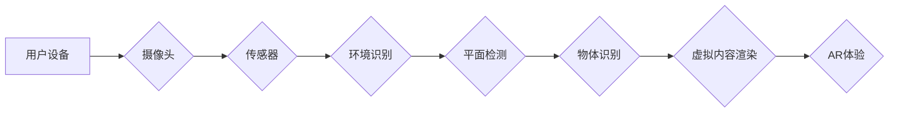

                 

## ARKit 应用开发：在 iOS 上创建 AR 体验

> 关键词：ARKit, AR体验, iOS开发,增强现实,计算机视觉,3D图形,移动应用

## 1. 背景介绍

增强现实 (AR) 技术近年来发展迅速，它将虚拟内容叠加到现实世界中，为用户提供一种全新的交互方式。ARKit 是苹果公司为 iOS 设备开发的 AR 平台，它提供了丰富的 API 和工具，让开发者能够轻松地创建沉浸式的 AR 体验。

ARKit 的出现极大地推动了 AR 应用的开发和普及。它利用了 iOS 设备的摄像头、传感器和 GPU，能够实时地识别环境、追踪物体和渲染虚拟内容。ARKit 的优势在于其易用性、性能和安全性，它为开发者提供了构建高质量 AR 应用的强大基础。

## 2. 核心概念与联系

ARKit 的核心概念包括：

* **世界追踪:** ARKit 可以利用设备的摄像头和传感器来追踪设备在现实世界中的位置和方向。
* **平面检测:** ARKit 可以识别出现实世界中的平面区域，例如地面、墙壁和桌子，并将其作为虚拟内容的放置位置。
* **物体识别:** ARKit 可以识别出现实世界中的物体，并将其与虚拟内容进行关联。
* **3D 场景渲染:** ARKit 提供了丰富的 API 和工具，让开发者能够创建和渲染 3D 场景。

**核心概念架构流程图:**



## 3. 核心算法原理 & 具体操作步骤

### 3.1  算法原理概述

ARKit 的核心算法原理基于计算机视觉和机器学习技术。

* **计算机视觉:** ARKit 利用计算机视觉算法来识别环境、追踪物体和渲染虚拟内容。例如，它使用特征点检测和匹配算法来追踪设备的位置，使用深度学习算法来识别平面区域和物体。
* **机器学习:** ARKit 使用机器学习算法来提高其识别和追踪的准确性。例如，它使用深度神经网络来训练识别平面区域和物体的模型。

### 3.2  算法步骤详解

ARKit 的核心算法步骤包括：

1. **环境识别:** 设备摄像头捕捉环境图像，并使用计算机视觉算法识别环境特征，例如角点、边缘和纹理。
2. **平面检测:** ARKit 使用深度学习算法来识别出环境中的平面区域，例如地面、墙壁和桌子。
3. **物体识别:** ARKit 使用深度学习算法来识别出环境中的物体，例如椅子、桌子和人。
4. **虚拟内容渲染:** ARKit 将虚拟内容渲染到设备屏幕上，并将其与现实世界中的环境和物体进行叠加。

### 3.3  算法优缺点

**优点:**

* **高精度:** ARKit 的算法能够提供高精度的环境追踪、平面检测和物体识别。
* **实时性:** ARKit 的算法能够实时地处理环境信息，并渲染虚拟内容。
* **易用性:** ARKit 提供了丰富的 API 和工具，让开发者能够轻松地使用其算法。

**缺点:**

* **依赖设备硬件:** ARKit 的算法依赖于设备的摄像头、传感器和 GPU，因此其性能受限于设备硬件。
* **环境光照影响:** 环境光照条件会影响 ARKit 的算法性能，例如在光线昏暗的环境中，其物体识别能力可能会下降。
* **计算资源消耗:** ARKit 的算法需要消耗一定的计算资源，因此可能会影响设备的电池寿命。

### 3.4  算法应用领域

ARKit 的算法应用领域广泛，包括：

* **游戏:** ARKit 可以用于开发增强现实游戏，例如 Pokemon Go。
* **教育:** ARKit 可以用于开发增强现实教育应用，例如虚拟解剖学模型。
* **零售:** ARKit 可以用于开发增强现实零售应用，例如虚拟试衣间。
* **医疗:** ARKit 可以用于开发增强现实医疗应用，例如手术指导。

## 4. 数学模型和公式 & 详细讲解 & 举例说明

### 4.1  数学模型构建

ARKit 的核心算法基于一系列数学模型，例如：

* **相机模型:** 描述了相机如何将三维世界投影到二维图像上的模型。
* **投影模型:** 描述了如何将三维物体投影到二维图像上的模型。
* **深度估计模型:** 描述了如何从图像中估计物体的深度信息的模型。

### 4.2  公式推导过程

ARKit 的算法使用多种数学公式来实现其功能，例如：

* **相机姿态估计:** 使用旋转矩阵和平移向量来描述相机的姿态。
* **平面检测:** 使用最小二乘法来估计平面的法向量和位置。
* **物体识别:** 使用卷积神经网络来识别物体类别。

### 4.3  案例分析与讲解

例如，在平面检测过程中，ARKit 会使用以下公式来估计平面的法向量和位置:

$$
\mathbf{n} = \frac{\sum_{i=1}^{N} \mathbf{p}_i \times \mathbf{p}_{i+1}}{\left\| \sum_{i=1}^{N} \mathbf{p}_i \times \mathbf{p}_{i+1} \right\|}
$$

其中，$\mathbf{n}$ 是平面的法向量，$\mathbf{p}_i$ 和 $\mathbf{p}_{i+1}$ 是平面上的两个点。

## 5. 项目实践：代码实例和详细解释说明

### 5.1  开发环境搭建

开发 ARKit 应用需要 Xcode 和 iOS 设备。

* **Xcode:** 苹果公司提供的集成开发环境 (IDE)，用于开发 iOS 应用。
* **iOS 设备:** 用于运行和测试 ARKit 应用的设备。

### 5.2  源代码详细实现

以下是一个简单的 ARKit 应用代码示例，用于在设备屏幕上渲染一个虚拟立方体：

```swift
import UIKit
import ARKit

class ViewController: UIViewController, ARSCNViewDelegate {

    @IBOutlet var sceneView: ARSCNView!

    override func viewDidLoad() {
        super.viewDidLoad()

        // Set the view's delegate
        sceneView.delegate = self

        // Create a new scene
        let scene = SCNScene()

        // Add a node to the scene
        let cube = SCNBox(width: 0.5, height: 0.5, length: 0.5, chamferRadius: 0.05)
        let node = SCNNode(geometry: cube)
        scene.rootNode.addChildNode(node)

        // Set the scene to the view
        sceneView.scene = scene
    }

    override func viewWillAppear(_ animated: Bool) {
        super.viewWillAppear(animated)

        // Create a session configuration
        let configuration = ARWorldTrackingConfiguration()

        // Run the view's session
        sceneView.session.run(configuration)
    }

    override func viewWillDisappear(_ animated: Bool) {
        super.viewWillDisappear(animated)

        // Pause the view's session
        sceneView.session.pause()
    }

    // MARK: - ARSCNViewDelegate

    func renderer(_ renderer: SCNSceneRenderer, didAdd node: SCNNode, for anchor: ARAnchor) {
        // ...
    }

    func renderer(_ renderer: SCNSceneRenderer, didUpdate node: SCNNode, for anchor: ARAnchor) {
        // ...
    }
}
```

### 5.3  代码解读与分析

* **ARSCNView:** ARKit 的核心视图，用于渲染 AR 内容。
* **ARWorldTrackingConfiguration:** ARKit 的配置，用于启用世界追踪。
* **SCNBox:** 创建一个立方体几何体。
* **SCNNode:** 创建一个场景节点，用于放置几何体。
* **scene.rootNode.addChildNode(node):** 将立方体节点添加到场景根节点。
* **sceneView.session.run(configuration):** 启动 AR 视景会话。

### 5.4  运行结果展示

运行该代码后，用户将看到一个虚拟立方体出现在设备屏幕上，并随着设备移动而移动。

## 6. 实际应用场景

ARKit 的应用场景非常广泛，以下是一些实际应用场景：

* **教育:** ARKit 可以用于创建交互式的虚拟模型，帮助学生更好地理解复杂的科学概念。例如，学生可以使用 ARKit 来探索人体内部结构，或者模拟化学反应过程。
* **零售:** ARKit 可以用于创建虚拟试衣间，让用户在购买衣服之前就能虚拟试穿。
* **旅游:** ARKit 可以用于创建虚拟导游，为游客提供实时信息和导航。
* **建筑:** ARKit 可以用于创建虚拟建筑模型，帮助建筑师和设计师进行设计和规划。

### 6.4  未来应用展望

ARKit 的未来应用前景非常广阔，随着技术的不断发展，ARKit 将会应用于更多领域，例如：

* **医疗:** ARKit 可以用于辅助手术，帮助医生进行更精准的操作。
* **制造:** ARKit 可以用于指导维修和保养工作，帮助工人更快速地解决问题。
* **娱乐:** ARKit 可以用于开发更沉浸式的游戏和娱乐体验。

## 7. 工具和资源推荐

### 7.1  学习资源推荐

* **苹果官方文档:** https://developer.apple.com/documentation/arkit
* **ARKit 教程:** https://www.raywenderlich.com/1513-arkit-tutorial-getting-started-with-augmented-reality
* **ARKit 社区论坛:** https://developer.apple.com/forums/tags/arkit

### 7.2  开发工具推荐

* **Xcode:** https://developer.apple.com/xcode/
* **Unity:** https://unity.com/
* **Unreal Engine:** https://www.unrealengine.com/

### 7.3  相关论文推荐

* **ARKit: A Platform for Augmented Reality on iOS**
* **Real-Time 3D Object Reconstruction from a Single RGB-D Camera**
* **Deep Learning for Augmented Reality**

## 8. 总结：未来发展趋势与挑战

### 8.1  研究成果总结

ARKit 的出现极大地推动了 AR 应用的开发和普及。其高精度、实时性、易用性和丰富的 API 和工具，为开发者提供了构建高质量 AR 应用的强大基础。

### 8.2  未来发展趋势

ARKit 的未来发展趋势包括：

* **更强大的算法:** ARKit 的算法将继续改进，提供更准确、更可靠的追踪、识别和渲染能力。
* **更丰富的功能:** ARKit 将会提供更多新的功能，例如多人协作、物体交互和环境感知。
* **更广泛的应用场景:** ARKit 将会应用于更多领域，例如医疗、教育、零售和制造。

### 8.3  面临的挑战

ARKit 发展也面临一些挑战，例如：

* **计算资源消耗:** ARKit 的算法需要消耗一定的计算资源，这可能会影响设备的电池寿命。
* **环境光照影响:** 环境光照条件会影响 ARKit 的算法性能，例如在光线昏暗的环境中，其物体识别能力可能会下降。
* **用户体验:** ARKit 应用需要提供良好的用户体验，例如流畅的交互和逼真的视觉效果。

### 8.4  研究展望

未来，ARKit 将会继续发展，成为更强大、更智能、更广泛应用的 AR 平台。

## 9. 附录：常见问题与解答

* **Q: 如何在 Xcode 中创建 ARKit 项目？**

A: 在 Xcode 中创建 ARKit 项目，请参考苹果官方文档：https://developer.apple.com/documentation/arkit/getting_started_with_arkit

* **Q: ARKit 需要哪些硬件支持？**

A: ARKit 需要支持 ARKit 的 iOS 设备，例如 iPhone 6s 或更新的设备。

* **Q: ARKit 的许可证是什么？**

A: ARKit 是开源的，可以使用 MIT 许可证。

作者：禅与计算机程序设计艺术 / Zen and the Art of Computer Programming


<end_of_turn>

