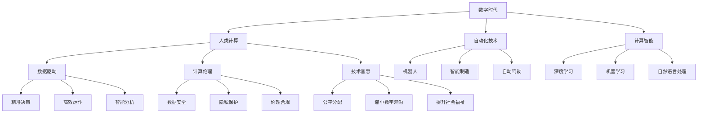

                 

# 塑造数字时代：人类计算的关键作用

> 关键词：数字时代,人类计算,智能自动化,工业革命,深度学习,大数据

## 1. 背景介绍

### 1.1 问题由来
随着数字化转型的步伐日益加快，人类社会已经步入数字时代。在这个时代，计算能力成为了推动社会发展的关键驱动力。从早期的算盘和机械计算器，到现代的超级计算机和人工智能(AI)，人类对计算能力的需求不断提升，计算方式的演进也逐步改变了我们的生产生活方式。

在过去的几十年里，信息技术的发展已经深刻地影响了人类社会的方方面面。无论是制造业、金融业、医疗业还是教育业，数字技术的广泛应用都极大地提高了生产效率，降低了运营成本，改善了用户体验。然而，随着数字化程度的不断加深，人们开始反思人类计算在其中的角色。

本文旨在探讨人类计算在数字时代的作用，分析其面临的挑战和机遇，为未来的发展提供思路。

### 1.2 问题核心关键点
人类计算的核心问题在于如何在数字时代中有效利用和扩展计算能力，同时保持人类的创造性和智能优势。具体关键点包括：

1. 人类计算与自动化技术的平衡。如何在自动化替代部分重复性工作的同时，保留人类在复杂决策、创新和情感智能等方面的独特能力。
2. 数据驱动与计算智能的融合。如何在海量数据和计算智能的加持下，实现更加精准、高效、智能的决策支持。
3. 计算伦理与隐私保护。如何在计算技术普及的同时，确保数据安全、隐私保护和伦理合规。
4. 技术普惠与社会公平。如何在技术普及过程中，缩小数字鸿沟，实现技术资源的公平分配和社会福祉的提升。

这些关键点共同构成了人类计算在数字时代的重要命题。本文将从多个维度进行深入探讨，旨在揭示其背后的原理和策略。

## 2. 核心概念与联系

### 2.1 核心概念概述

为了更好地理解人类计算在数字时代的作用，本节将介绍几个核心概念：

- **数字时代**：指在信息技术支撑下，人类社会生活方式和生产方式发生根本性变革的时期。计算能力、数据资源和智能技术成为核心推动力。
- **人类计算**：指在数字时代，人类利用计算技术和计算工具，对数据进行收集、处理、分析和利用的过程。它体现了人类在复杂决策、创新思维和情感智能等方面的独特能力。
- **自动化技术**：指利用计算机算法和智能系统，自动完成重复性、规律性工作，提高生产效率和质量的技术。包括机器人、智能制造、自动驾驶等。
- **计算智能**：指通过算法、模型和计算资源，对数据进行智能处理和决策的能力。包括深度学习、机器学习、自然语言处理等。
- **数据驱动**：指在决策过程中，以数据为依据，利用数据分析和机器学习技术，实现精准、高效、智能的决策支持。
- **计算伦理**：指在计算技术应用过程中，遵循的道德准则和法律法规，确保数据安全、隐私保护和伦理合规。
- **技术普惠**：指在技术普及过程中，通过政策引导和资源分配，实现技术资源的公平分配，缩小数字鸿沟，提升社会福祉。

这些核心概念之间的逻辑关系可以通过以下Mermaid流程图来展示：



这个流程图展示了数字时代下，各个核心概念之间的关系：

1. 数字时代是计算能力、数据资源和智能技术发展的必然结果，提供了人类计算和自动化技术发展的环境。
2. 人类计算体现了人类在复杂决策、创新思维和情感智能等方面的独特能力，是自动化技术、计算智能的核心驱动力。
3. 自动化技术、计算智能在数据驱动和计算伦理的指导下，实现了精准决策、高效运作和智能分析。
4. 技术普惠在数据安全、隐私保护和伦理合规的保障下，缩小了数字鸿沟，提升了社会福祉。

## 3. 核心算法原理 & 具体操作步骤
### 3.1 算法原理概述

在数字时代，人类计算的核心算法原理主要体现在以下几个方面：

- **数据收集与预处理**：利用传感器、互联网、物联网等技术，大规模收集数据。预处理数据，去除噪声，提取有用信息。
- **特征工程**：根据任务需求，选择合适的特征，利用降维、特征选择等技术，提升模型性能。
- **模型训练与优化**：选择合适的算法模型，如线性回归、决策树、神经网络等，通过训练数据拟合模型，优化模型参数。
- **模型评估与调优**：利用交叉验证、网格搜索等技术，评估模型性能，进行超参数调优。
- **模型应用与反馈**：将模型应用于实际问题中，收集反馈数据，迭代优化模型，提升预测精度和鲁棒性。

这些算法原理在各个领域中都有广泛的应用，如自然语言处理、图像识别、推荐系统等。

### 3.2 算法步骤详解

以下是基于人类计算的核心算法原理，进行机器学习模型训练和优化的详细步骤：

1. **数据收集与预处理**：
   - 收集与任务相关的数据集，如文本、图像、音频等。
   - 进行数据清洗，去除噪声、填补缺失值。
   - 进行数据标准化和归一化，如数据中心化和归一化。

2. **特征工程**：
   - 选择合适的特征，如文本中的词频、TF-IDF，图像中的像素值、纹理特征。
   - 进行特征降维，如PCA、LDA等。
   - 进行特征选择，如信息增益、LASSO回归等。

3. **模型训练与优化**：
   - 选择合适的算法模型，如线性回归、决策树、神经网络等。
   - 使用训练数据拟合模型，如梯度下降法、随机梯度下降法。
   - 优化模型参数，如网格搜索、随机搜索、贝叶斯优化等。

4. **模型评估与调优**：
   - 利用交叉验证，评估模型性能，如准确率、召回率、F1分数等。
   - 进行超参数调优，如学习率、正则化系数、批量大小等。

5. **模型应用与反馈**：
   - 将模型应用于实际问题中，如分类、回归、聚类等。
   - 收集反馈数据，进行模型迭代优化。
   - 更新模型参数，提升预测精度和鲁棒性。

### 3.3 算法优缺点

基于人类计算的核心算法具有以下优点：

- **精度高**：通过多轮模型训练和优化，可以逐步提升模型的预测精度。
- **泛化能力强**：利用大数据和复杂模型，可以学习到广泛的特征和规律，提高模型的泛化能力。
- **适应性强**：通过特征工程和模型优化，可以灵活应对不同的问题和场景。

同时，这些算法也存在以下缺点：

- **计算成本高**：大规模数据和高复杂度的模型训练需要大量的计算资源和时间。
- **模型复杂度高**：复杂的模型和超参数调整增加了模型的复杂性和可解释性难度。
- **数据依赖性强**：模型的性能高度依赖于数据的质量和数量，获取高质量标注数据成本高。
- **模型易过拟合**：在数据不足或特征不足的情况下，容易发生过拟合，降低模型的泛化能力。

### 3.4 算法应用领域

基于人类计算的核心算法在各个领域都有广泛的应用，例如：

- **自然语言处理**：如文本分类、情感分析、机器翻译等。
- **计算机视觉**：如图像识别、目标检测、图像分割等。
- **推荐系统**：如个性化推荐、广告推荐、音乐推荐等。
- **智能制造**：如工业物联网、智能监控、预测性维护等。
- **智能医疗**：如疾病诊断、健康监测、药物研发等。

这些领域的应用展示了人类计算的核心算法在数字时代的重要作用，也体现了计算能力和智能技术在各个行业的广泛渗透。

## 4. 数学模型和公式 & 详细讲解 & 举例说明

### 4.1 数学模型构建

在机器学习中，常见的数学模型包括线性回归模型、逻辑回归模型、决策树模型、神经网络模型等。这里以线性回归模型为例，构建其数学模型。

设训练集为 $D=\{(x_i,y_i)\}_{i=1}^N$，其中 $x_i$ 为输入特征，$y_i$ 为标签。假设模型为线性回归模型，即：

$$
y = \theta^Tx + b
$$

其中 $\theta$ 为权重向量，$b$ 为偏置项。模型的目标是找到最优的 $\theta$ 和 $b$，使得模型在训练集上最小化平方损失函数：

$$
\mathcal{L}(\theta,b) = \frac{1}{2N}\sum_{i=1}^N(y_i - \theta^Tx_i - b)^2
$$

### 4.2 公式推导过程

以下是线性回归模型的推导过程：

- **代价函数推导**：
  $$
  \mathcal{L}(\theta,b) = \frac{1}{2N}\sum_{i=1}^N(y_i - \theta^Tx_i - b)^2
  $$

  其中 $y_i = \theta^Tx_i + b + \epsilon_i$，$\epsilon_i$ 为噪声项。

  代入上式，得：
  $$
  \mathcal{L}(\theta,b) = \frac{1}{2N}\sum_{i=1}^N(\epsilon_i)^2
  $$

- **梯度下降法推导**：
  $$
  \nabla_{\theta,b}\mathcal{L}(\theta,b) = \frac{1}{N}\sum_{i=1}^N(-x_iy_i + \theta^Tx_i + b)
  $$

  利用梯度下降法，更新 $\theta$ 和 $b$：
  $$
  \theta \leftarrow \theta - \eta\nabla_{\theta}\mathcal{L}(\theta,b)
  $$
  $$
  b \leftarrow b - \eta\nabla_{b}\mathcal{L}(\theta,b)
  $$

### 4.3 案例分析与讲解

以下是线性回归模型在房价预测中的应用案例：

**数据集准备**：
- 收集美国某城市房屋价格数据集，包含房屋面积、房间数、位置等信息。
- 数据预处理，去除缺失值和异常值。

**模型训练**：
- 使用线性回归模型，进行模型训练和优化。
- 利用交叉验证评估模型性能，进行超参数调优。

**模型评估**：
- 在测试集上评估模型性能，计算预测误差。
- 可视化模型的预测结果和实际房价。

**模型应用**：
- 将训练好的模型应用于新房的房价预测。
- 收集反馈数据，迭代优化模型，提升预测精度。

通过这个案例，可以看出线性回归模型在房价预测中的应用过程，展示了其核心算法原理和具体操作步骤。

## 5. 项目实践：代码实例和详细解释说明

### 5.1 开发环境搭建

在进行机器学习项目实践前，我们需要准备好开发环境。以下是使用Python进行机器学习项目开发的典型环境配置流程：

1. 安装Anaconda：从官网下载并安装Anaconda，用于创建独立的Python环境。

2. 创建并激活虚拟环境：
```bash
conda create -n ml-env python=3.8 
conda activate ml-env
```

3. 安装常用工具包：
```bash
pip install numpy pandas scikit-learn matplotlib tqdm jupyter notebook ipython
```

完成上述步骤后，即可在`ml-env`环境中开始项目实践。

### 5.2 源代码详细实现

这里以线性回归模型为例，使用Scikit-learn库进行房价预测的机器学习项目实践。

首先，导入所需的Python库：

```python
import numpy as np
import pandas as pd
from sklearn.model_selection import train_test_split
from sklearn.linear_model import LinearRegression
from sklearn.metrics import mean_squared_error, r2_score
from sklearn.model_selection import cross_val_score

# 导入数据集
data = pd.read_csv('house_prices.csv')

# 特征选择和数据预处理
features = data[['area', 'bedrooms', 'location']]
X = features.values
y = data['price'].values

# 数据集划分
X_train, X_test, y_train, y_test = train_test_split(X, y, test_size=0.2, random_state=42)

# 初始化模型
model = LinearRegression()
```

然后，进行模型训练和优化：

```python
# 模型训练
model.fit(X_train, y_train)

# 模型评估
y_pred = model.predict(X_test)
mse = mean_squared_error(y_test, y_pred)
r2 = r2_score(y_test, y_pred)

# 输出评估结果
print('Mean Squared Error:', mse)
print('R-squared:', r2)
```

最后，可视化模型的预测结果和实际房价：

```python
import matplotlib.pyplot as plt

# 可视化预测结果
plt.scatter(y_test, y_pred)
plt.xlabel('Actual Prices')
plt.ylabel('Predicted Prices')
plt.title('Predicted vs Actual Prices')
plt.show()

# 绘制误差分布图
plt.hist(y_pred - y_test, bins=20)
plt.xlabel('Error')
plt.ylabel('Count')
plt.title('Error Distribution')
plt.show()
```

以上就是使用Scikit-learn库进行房价预测的完整代码实现。可以看到，利用Python和Scikit-learn库，可以很方便地进行机器学习项目的开发和实践。

### 5.3 代码解读与分析

让我们再详细解读一下关键代码的实现细节：

**数据集准备**：
- 使用Pandas库读取数据集，并进行特征选择和数据预处理。
- 利用train_test_split函数，将数据集划分为训练集和测试集。

**模型训练**：
- 初始化线性回归模型。
- 使用fit函数，进行模型训练和优化。

**模型评估**：
- 使用predict函数，进行模型预测。
- 利用mean_squared_error和r2_score函数，评估模型性能。

**模型应用**：
- 使用matplotlib库，可视化模型的预测结果和实际房价。
- 绘制误差分布图，观察模型的预测误差。

可以看到，Scikit-learn库提供了丰富的机器学习算法和工具函数，极大地方便了模型的开发和实践。

## 6. 实际应用场景

### 6.1 智能制造

智能制造是大数据和人类计算的重要应用场景之一。传统的制造业往往依赖人工经验和高昂的试错成本，而智能制造通过数据分析和模型优化，实现了生产过程的自动化和智能化。

例如，某工厂通过传感器收集生产线的数据，包括温度、压力、振动等参数。利用机器学习模型，对生产过程进行实时监控和优化，实现了设备故障预测、能源消耗优化、生产效率提升等。

### 6.2 智能医疗

智能医疗是大数据和人类计算的另一个重要应用场景。医疗数据具有海量的特点，传统的医疗决策依赖于医生的经验和直觉，容易出现误诊和漏诊。利用机器学习模型，可以分析海量的医疗数据，辅助医生进行疾病诊断、治疗方案优化等。

例如，某医院通过收集患者的历史医疗记录和实时监测数据，利用机器学习模型，实现了个性化医疗方案的推荐和自动诊断。

### 6.3 智能交通

智能交通是大数据和人类计算的典型应用领域。交通数据具有实时性、复杂性的特点，传统的交通管理依赖于人工经验和直觉，容易出现交通拥堵、事故等问题。利用机器学习模型，可以实时分析交通数据，优化交通流，提升交通效率。

例如，某城市通过传感器和摄像头收集交通数据，利用机器学习模型，实现了交通流预测、信号灯控制、交通事故预警等。

### 6.4 未来应用展望

随着数据规模和计算能力的不断提升，未来人类计算将在更多领域发挥关键作用，推动社会的数字化转型和智能化升级。以下是几个未来应用展望：

1. **智慧城市**：通过物联网和大数据分析，实现城市的智能化管理，提高城市运行的效率和安全性。例如，智慧交通、智慧安防、智慧能源等领域的应用。
2. **智能农业**：利用传感器和无人机等技术，收集农田数据，利用机器学习模型，优化种植方案，提高农作物产量和质量。例如，智能灌溉、智能施肥、智能病虫害预警等。
3. **智能金融**：利用大数据和机器学习模型，实现金融风险预测、投资组合优化、客户关系管理等。例如，信用评分、市场预测、个性化推荐等。
4. **智能教育**：利用大数据和机器学习模型，实现个性化学习、智能评估、教育资源优化等。例如，智能推荐、智能测验、学习路径规划等。
5. **智能能源**：利用大数据和机器学习模型，实现能源消耗预测、智能调度、清洁能源利用等。例如，智能电网、智能储能、智能风电等。

## 7. 工具和资源推荐

### 7.1 学习资源推荐

为了帮助开发者系统掌握机器学习技术的理论基础和实践技巧，这里推荐一些优质的学习资源：

1. 《机器学习实战》：由机器学习专家编写的实战指南，涵盖机器学习算法、工具和案例。
2. 《Python机器学习》：介绍Python在机器学习中的应用，包括数据处理、模型训练和评估等。
3. 《深度学习》：由深度学习领域的权威专家编写，全面介绍了深度学习的原理和应用。
4. 《自然语言处理综论》：涵盖自然语言处理的理论基础和实践技巧，包括文本分类、情感分析、机器翻译等。
5. 《统计学习方法》：由机器学习领域的权威教材，涵盖了机器学习的理论基础和算法实现。

通过对这些资源的学习实践，相信你一定能够快速掌握机器学习技术的精髓，并用于解决实际的工程问题。

### 7.2 开发工具推荐

高效的开发离不开优秀的工具支持。以下是几款用于机器学习项目开发的常用工具：

1. Python：Python是机器学习领域的主流编程语言，具有简洁高效的特点，支持丰富的科学计算库。
2. Scikit-learn：开源的机器学习库，提供了丰富的算法和工具函数，易于使用和扩展。
3. TensorFlow：由Google主导的开源深度学习框架，支持分布式计算和GPU加速。
4. PyTorch：由Facebook主导的开源深度学习框架，具有灵活的计算图和高效的动态计算能力。
5. Jupyter Notebook：交互式的数据分析和编程环境，支持多种语言和库的集成。

合理利用这些工具，可以显著提升机器学习项目的开发效率，加快创新迭代的步伐。

### 7.3 相关论文推荐

机器学习技术的快速发展离不开学界的持续研究。以下是几篇奠基性的相关论文，推荐阅读：

1. 《机器学习：模型、算法与应用》：机器学习领域的经典教材，涵盖机器学习算法、模型和应用。
2. 《深度学习》：由深度学习领域的权威专家编写，全面介绍了深度学习的原理和应用。
3. 《统计学习方法》：由机器学习领域的权威教材，涵盖了机器学习的理论基础和算法实现。
4. 《大尺度机器学习》：介绍了大规模数据下的机器学习算法和模型，包括数据处理、模型训练和评估等。
5. 《贝叶斯方法》：介绍了贝叶斯统计方法在机器学习中的应用，包括贝叶斯分类、贝叶斯回归等。

这些论文代表了大数据和人类计算技术的发展脉络。通过学习这些前沿成果，可以帮助研究者把握学科前进方向，激发更多的创新灵感。

## 8. 总结：未来发展趋势与挑战

### 8.1 研究成果总结

本文对基于人类计算的核心算法进行了详细讲解，展示了其在数字时代的重要作用。主要总结如下：

1. 人类计算在数据收集、预处理、模型训练和优化等环节中发挥了关键作用。
2. 机器学习算法在自然语言处理、计算机视觉、推荐系统等各个领域中得到了广泛应用。
3. 数据驱动和计算智能的融合，使得机器学习模型在复杂决策、智能推荐等方面具有广泛的应用前景。

### 8.2 未来发展趋势

展望未来，机器学习技术的发展将呈现以下几个趋势：

1. **深度学习与神经网络**：深度学习算法在图像、语音、自然语言处理等领域具有广泛应用。神经网络模型的结构日益复杂，层数和参数量不断提升，带来更强的泛化能力和表示能力。
2. **联邦学习与分布式计算**：联邦学习和大规模分布式计算技术，使得机器学习模型能够在不泄露数据的情况下，进行联合训练和优化，实现更加隐私安全的数据利用。
3. **迁移学习和自监督学习**：迁移学习和自监督学习技术，可以在数据不足的情况下，通过迁移已有知识，进行模型微调和优化，提高模型的泛化能力和鲁棒性。
4. **计算伦理与隐私保护**：计算伦理和隐私保护技术，将在数据收集、存储和利用过程中，确保数据安全、隐私保护和伦理合规，提升系统的可信度和透明度。
5. **技术普惠与社会公平**：技术普惠和数字鸿沟缩小技术，将在技术普及过程中，实现技术资源的公平分配，提升社会福祉。

### 8.3 面临的挑战

尽管机器学习技术已经取得了瞩目成就，但在迈向更加智能化、普适化应用的过程中，它仍面临诸多挑战：

1. **计算成本高**：大规模数据和高复杂度的模型训练需要大量的计算资源和时间，如何降低计算成本是未来需要解决的重要问题。
2. **模型复杂度高**：复杂的模型和超参数调整增加了模型的复杂性和可解释性难度，如何提升模型的可解释性和可操作性是未来需要关注的方向。
3. **数据依赖性强**：模型的性能高度依赖于数据的质量和数量，获取高质量标注数据成本高，如何降低数据依赖性是未来需要解决的重要问题。
4. **模型易过拟合**：在数据不足或特征不足的情况下，容易发生过拟合，降低模型的泛化能力，如何提高模型的泛化能力和鲁棒性是未来需要解决的重要问题。
5. **隐私保护问题**：机器学习模型在数据驱动的决策过程中，可能泄露用户隐私信息，如何保护用户隐私是未来需要解决的重要问题。

### 8.4 研究展望

未来的机器学习研究需要在以下几个方面寻求新的突破：

1. **轻量级模型与高效算法**：开发更加轻量级、高效能的模型和算法，提高计算效率，降低计算成本。
2. **跨模态学习与融合**：开发跨模态学习技术，实现视觉、语音、文本等多种模态数据的整合，提升模型的综合能力。
3. **公平性与可解释性**：开发公平性、可解释性机器学习算法，提升模型的可信度和透明度。
4. **联邦学习与隐私保护**：开发联邦学习和隐私保护技术，实现数据的安全共享和联合训练，提升系统的隐私保护能力。

## 9. 附录：常见问题与解答

**Q1：机器学习模型的泛化能力如何提高？**

A: 提高机器学习模型的泛化能力可以从以下几个方面入手：
1. 增加训练数据量，减少过拟合。
2. 使用正则化技术，如L2正则、Dropout等，减少模型复杂度。
3. 进行模型集成，如Bagging、Boosting等，提升模型鲁棒性。
4. 使用迁移学习，利用已有知识，提升模型泛化能力。
5. 优化超参数，如学习率、批大小、正则化系数等，提升模型性能。

**Q2：机器学习模型中的特征工程包括哪些步骤？**

A: 特征工程是机器学习模型的关键步骤之一，包括以下几个步骤：
1. 数据清洗和预处理，如去除噪声、填补缺失值、标准化和归一化等。
2. 特征选择，如信息增益、卡方检验等，选择对模型有贡献的特征。
3. 特征降维，如主成分分析(PCA)、线性判别分析(LDA)等，减少特征维度。
4. 特征组合和变换，如特征交叉、多项式变换等，提升特征表示能力。

**Q3：机器学习模型中的交叉验证和网格搜索分别是什么？**

A: 交叉验证和网格搜索是机器学习模型中的两个重要工具：
1. 交叉验证是一种评估模型性能的方法，通过将数据集划分为训练集和验证集，多次训练模型，取平均结果，评估模型泛化能力。
2. 网格搜索是一种超参数调优方法，通过设定超参数的取值范围，生成所有可能的组合，选择最优超参数组合，提升模型性能。

通过这些问题的解答，可以看出机器学习模型在各个环节中需要注意的关键问题，以及如何通过优化和改进提升模型的性能和泛化能力。

---

作者：禅与计算机程序设计艺术 / Zen and the Art of Computer Programming

