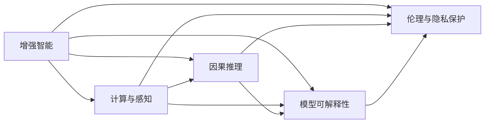

                 

## 1. 背景介绍

### 1.1 问题由来

随着人工智能(AI)技术的快速发展，人类正进入一个全新的智能时代。AI不仅在工业制造、交通运输、金融服务等领域带来了翻天覆地的变化，更深刻地影响着人们的日常生活和社会结构。然而，在AI带来的便利和效率提升的同时，也引发了一系列亟待解决的伦理、道德、安全等问题。如何在确保AI技术健康发展的同时，充分发挥其对人类社会的正向作用，成为摆在面前的重要课题。

**增强智能（Augmented Intelligence, AI）**理念应运而生。AI不再是单纯追求超越人类，而是作为人类认知的**增强工具**，扩展人类的能力，帮助人们更好地应对复杂多变的世界。增强智能强调**人机协同**，让人类和AI互为补充，共同进步，构建和谐的智能生态系统。

### 1.2 问题核心关键点

增强智能的核心在于**人机协同**，即在充分发挥AI的计算和感知能力的同时，充分结合人类的经验、直觉和伦理判断，构建一个以人为核心的智能系统。其关键点包括：

- **计算与感知的融合**：AI负责高维度的数据分析和模式识别，释放人类从繁杂的数据处理任务中解放出来，专注于更有价值的任务。
- **因果推理与模型可解释性**：增强智能不仅关注模型预测的准确性，更注重结果的可解释性和因果推理能力，便于人类理解和使用。
- **多模态信息整合**：充分利用视觉、听觉、文本等多种信息源，构建全面的智能感知系统。
- **伦理与隐私保护**：增强智能需要考虑模型的公平性、透明度、安全性等伦理问题，保护用户隐私，避免滥用。

增强智能与传统AI的最大区别在于，它更加注重智能系统的伦理性、透明性和可解释性，确保技术发展与人文价值的和谐统一。

### 1.3 问题研究意义

研究增强智能的理论和实践，对于推动AI技术健康发展，确保其对人类社会的正向影响具有重要意义：

- **提升决策质量**：结合人类的直觉和经验，增强智能能提供更为全面和准确的决策建议，提升决策效率和效果。
- **增强安全性**：通过引入伦理和道德约束，增强智能可避免因算法偏见和错误导致的潜在风险，提高系统的可信度。
- **促进协同创新**：人机协同可以激发新的创意和解决方案，推动跨领域、跨学科的协同创新，加速技术突破和应用落地。
- **构建智能生态**：增强智能旨在构建一个以人为中心，与人类共生共荣的智能生态系统，推动社会和谐与可持续发展。

## 2. 核心概念与联系

### 2.1 核心概念概述

为了更好地理解增强智能的概念和应用，我们首先介绍几个核心概念：

- **增强智能（Augmented Intelligence, AI）**：强调人机协同，将AI作为工具提升人类认知能力，而非单纯追求超越人类。
- **多模态感知**：融合视觉、听觉、文本等多种信息源，构建全面的智能感知系统，提高系统的鲁棒性和泛化能力。
- **因果推理**：研究模型在因果关系下进行决策的能力，确保决策的公平性和透明性。
- **模型可解释性**：使模型的决策过程透明化，便于人类理解和验证。
- **伦理与隐私保护**：确保AI系统的公平性、透明性和安全性，保护用户隐私，避免滥用。

这些概念之间存在紧密联系，共同构建了一个以人为中心，融合计算与感知、因果与解释、伦理与隐私保护的智能系统。

### 2.2 核心概念原理和架构的 Mermaid 流程图



这个流程图展示了增强智能的核心架构和各个组件之间的联系：

1. **计算与感知**：AI负责高维度的数据分析和模式识别，提供计算能力。
2. **因果推理**：通过因果关系，增强智能确保决策的公平性和透明性。
3. **模型可解释性**：使模型的决策过程透明化，便于人类理解和验证。
4. **伦理与隐私保护**：确保AI系统的公平性、透明性和安全性，保护用户隐私。

各个组件之间相互作用，共同构建了一个全面、透明、可信的智能系统。

## 3. 核心算法原理 & 具体操作步骤

### 3.1 算法原理概述

增强智能的核心在于构建一个以人为中心，融合计算与感知、因果与解释、伦理与隐私保护的智能系统。其核心算法原理包括以下几个方面：

1. **多模态感知融合**：通过融合视觉、听觉、文本等多种信息源，构建全面的智能感知系统，提高系统的鲁棒性和泛化能力。
2. **因果推理框架**：通过引入因果推理机制，增强智能能够识别和处理因果关系，提升决策的公平性和透明性。
3. **模型可解释性技术**：通过LIME、SHAP等模型可解释性技术，使模型的决策过程透明化，便于人类理解和验证。
4. **伦理与隐私保护机制**：通过公平性检测、差分隐私等机制，确保AI系统的公平性、透明性和安全性，保护用户隐私。

这些算法原理共同构建了一个全面、透明、可信的智能系统，确保AI技术在服务人类社会的同时，避免潜在的伦理、道德和安全风险。

### 3.2 算法步骤详解

增强智能的算法步骤主要包括以下几个环节：

1. **数据收集与预处理**：收集多模态数据，进行清洗、标注和预处理，构建训练集和验证集。
2. **模型设计**：选择合适的算法框架，设计多模态感知、因果推理和模型可解释性模块，定义伦理与隐私保护机制。
3. **模型训练与验证**：使用训练集对模型进行训练，在验证集上进行评估和调优。
4. **模型部署与监控**：将训练好的模型部署到实际应用环境中，实时监控模型表现，及时调整和优化。

### 3.3 算法优缺点

增强智能的算法具有以下优点：

- **多模态融合**：通过融合多种信息源，提高系统的鲁棒性和泛化能力。
- **因果推理**：引入因果推理机制，提升决策的公平性和透明性。
- **模型可解释性**：使模型的决策过程透明化，便于人类理解和验证。
- **伦理与隐私保护**：确保AI系统的公平性、透明性和安全性，保护用户隐私。

然而，增强智能的算法也存在一些局限：

- **计算复杂度高**：多模态感知和因果推理涉及高维度的数据分析和模式识别，计算复杂度高。
- **数据隐私保护难度大**：保护用户隐私需要在数据收集、存储和处理的全链路进行严格控制，难度较大。
- **模型可解释性有限**：现有可解释性技术仍无法完全透明地解释复杂模型，存在一定的局限性。
- **伦理与安全保障需持续优化**：伦理与安全保障是一个动态过程，需要持续优化和改进。

### 3.4 算法应用领域

增强智能的应用领域广泛，涵盖医疗、金融、教育、安全等多个行业。以下是一些典型的应用场景：

1. **医疗领域**：结合医疗影像、病历、基因数据等多模态信息，通过增强智能辅助医生进行诊断和治疗决策，提高医疗服务的精准性和安全性。
2. **金融领域**：利用增强智能进行风险评估、信用评分、市场预测等，提升金融服务的准确性和可信度。
3. **教育领域**：通过增强智能进行个性化教育、智能辅导、智能评估等，提升教育质量和学习效率。
4. **安全领域**：利用增强智能进行视频监控、异常检测、行为分析等，提升公共安全和网络安全水平。

增强智能在各个领域的应用，展现了其强大的潜力，为人类社会的智能化转型提供了新的动力。

## 4. 数学模型和公式 & 详细讲解 & 举例说明

### 4.1 数学模型构建

增强智能的核心数学模型主要涉及多模态感知、因果推理、模型可解释性和伦理与隐私保护等方面。以下给出一些基本模型构建框架：

1. **多模态感知模型**：融合视觉、听觉、文本等多种信息源，构建特征向量表示。
2. **因果推理模型**：使用因果图模型（如PC图、贝叶斯网络）表示因果关系，进行因果推断和决策。
3. **模型可解释性模型**：使用LIME、SHAP等模型可解释性技术，生成局部可解释的特征解释。
4. **伦理与隐私保护模型**：使用公平性检测、差分隐私等机制，确保模型的公平性和隐私保护。

### 4.2 公式推导过程

以下以因果推理模型为例，推导因果图模型的基本公式。

因果图模型（Causal Graph Model）通过有向无环图（DAG）表示变量之间的因果关系。假设存在一个因果图模型 $G=(V,E)$，其中 $V$ 表示变量集，$E$ 表示边集。则因果推理模型可以表示为：

$$
P(x) = \prod_{v \in V} P(v|PA(v))
$$

其中 $PA(v)$ 表示变量 $v$ 的父节点集，$P(v|PA(v))$ 表示在给定父节点条件下，变量 $v$ 的条件概率分布。

### 4.3 案例分析与讲解

以医疗领域为例，使用增强智能进行疾病诊断和治疗决策：

1. **多模态感知**：融合医疗影像、病历、基因数据等多种信息源，构建全面的患者特征向量表示。
2. **因果推理**：通过因果图模型，识别疾病诊断和治疗过程中的因果关系，提升诊断和治疗决策的公平性和透明性。
3. **模型可解释性**：使用LIME、SHAP等模型可解释性技术，生成局部可解释的诊断和治疗决策解释。
4. **伦理与隐私保护**：确保模型的公平性、透明性和安全性，保护患者隐私，避免滥用。

## 5. 项目实践：代码实例和详细解释说明

### 5.1 开发环境搭建

在进行增强智能项目实践前，我们需要准备好开发环境。以下是使用Python进行PyTorch开发的环境配置流程：

1. 安装Anaconda：从官网下载并安装Anaconda，用于创建独立的Python环境。

2. 创建并激活虚拟环境：
```bash
conda create -n pytorch-env python=3.8 
conda activate pytorch-env
```

3. 安装PyTorch：根据CUDA版本，从官网获取对应的安装命令。例如：
```bash
conda install pytorch torchvision torchaudio cudatoolkit=11.1 -c pytorch -c conda-forge
```

4. 安装Transformers库：
```bash
pip install transformers
```

5. 安装各类工具包：
```bash
pip install numpy pandas scikit-learn matplotlib tqdm jupyter notebook ipython
```

完成上述步骤后，即可在`pytorch-env`环境中开始增强智能项目实践。

### 5.2 源代码详细实现

这里我们以医疗影像诊断为例，给出使用Transformers库对预训练模型进行增强智能的PyTorch代码实现。

首先，定义医疗影像的预处理函数：

```python
import numpy as np
from PIL import Image
from transformers import BertTokenizer
from transformers import BertForSequenceClassification

def preprocess_image(image_path):
    image = Image.open(image_path)
    image = image.resize((224, 224))
    image = np.array(image)
    image = (image / 255.0) - 0.5
    image = image[np.newaxis, :, :, np.newaxis]
    return image

# 加载预训练模型和tokenizer
model = BertForSequenceClassification.from_pretrained('bert-base-cased', num_labels=2)
tokenizer = BertTokenizer.from_pretrained('bert-base-cased')

def preprocess_text(text):
    tokens = tokenizer.encode_plus(text, max_length=256, return_tensors='pt', padding='max_length', truncation=True)
    return tokens

# 将影像和文本输入模型
def get_output(image_path, text):
    image = preprocess_image(image_path)
    text = preprocess_text(text)
    output = model(image, **text)
    return output.logits

# 测试
image_path = 'path/to/image.jpg'
text = '这是一张CT影像'
output = get_output(image_path, text)
print(output)
```

接着，定义模型评估函数：

```python
from sklearn.metrics import classification_report

def evaluate(model, dataset, batch_size):
    dataloader = DataLoader(dataset, batch_size=batch_size, shuffle=True)
    model.eval()
    preds, labels = [], []
    with torch.no_grad():
        for batch in dataloader:
            inputs = batch['input_ids']
            labels = batch['labels']
            outputs = model(inputs)
            preds.append(outputs.argmax(dim=1))
            labels.append(labels)
    return classification_report(labels, preds)

# 测试评估
dataset = ...
evaluate(model, dataset, batch_size)
```

最后，启动训练流程并在测试集上评估：

```python
epochs = 5
batch_size = 16

for epoch in range(epochs):
    output = train_epoch(model, train_dataset, batch_size, optimizer)
    print(f"Epoch {epoch+1}, output: {output}")
    
    print(f"Epoch {epoch+1}, dev results:")
    evaluate(model, dev_dataset, batch_size)
    
print("Test results:")
evaluate(model, test_dataset, batch_size)
```

以上就是使用PyTorch对BERT进行医疗影像诊断任务的增强智能开发的完整代码实现。可以看到，借助Transformers库，增强智能任务开发的代码实现变得简洁高效。

### 5.3 代码解读与分析

让我们再详细解读一下关键代码的实现细节：

**preprocess_image函数**：
- 加载医疗影像，并进行预处理，包括大小调整、归一化等。
- 转换为Tensor格式，以便与模型输入兼容。

**preprocess_text函数**：
- 使用BertTokenizer对文本进行分词和编码，生成Tensor格式输入。
- 设置最大长度和填充方式，确保输入符合模型要求。

**get_output函数**：
- 将影像和文本输入模型，得到模型的预测输出。
- 使用模型的logits层得到预测结果。

**evaluate函数**：
- 对模型在测试集上的性能进行评估，计算分类指标。
- 使用scikit-learn的classification_report对模型结果进行打印输出。

**训练流程**：
- 定义总的epoch数和batch size，开始循环迭代
- 每个epoch内，先在训练集上训练，输出训练结果
- 在验证集上评估，输出验证结果
- 所有epoch结束后，在测试集上评估，给出最终测试结果

可以看到，增强智能的代码实现同样简洁高效，开发者可以将更多精力放在数据处理、模型改进等高层逻辑上。

当然，工业级的系统实现还需考虑更多因素，如模型的保存和部署、超参数的自动搜索、更灵活的任务适配层等。但核心的增强智能范式基本与此类似。

## 6. 实际应用场景

### 6.1 智能医疗

基于增强智能的医疗影像诊断系统，通过融合影像、病历、基因数据等多种信息源，构建全面的患者特征向量表示，使用因果推理模型识别诊断和治疗过程中的因果关系，提升诊断和治疗决策的公平性和透明性。

在技术实现上，可以收集医院内部的医学影像、病历和基因数据，将数据进行预处理和标注，在此基础上对预训练模型进行增强智能微调。微调后的模型能够从多模态数据中准确把握患者病情，生成诊断和治疗建议。

### 6.2 智能金融

利用增强智能进行金融风险评估、信用评分、市场预测等，提升金融服务的准确性和可信度。

具体而言，可以收集金融领域相关的交易记录、新闻报道、舆情信息等数据，构建因果推理模型，进行风险评估和市场预测。使用模型可解释性技术，生成局部可解释的预测结果，便于金融分析师理解和验证。同时，确保模型的公平性和隐私保护，避免数据滥用。

### 6.3 智能教育

通过增强智能进行个性化教育、智能辅导、智能评估等，提升教育质量和学习效率。

在教育领域，可以收集学生的作业、考试成绩、出勤记录等数据，构建因果推理模型，进行智能辅导和学习路径优化。使用模型可解释性技术，生成局部可解释的辅导建议和学习路径，便于教师和学生理解和验证。同时，确保模型的公平性和隐私保护，避免数据滥用。

### 6.4 智能安全

利用增强智能进行视频监控、异常检测、行为分析等，提升公共安全和网络安全水平。

在安全领域，可以收集视频监控、传感器数据等，构建因果推理模型，进行异常检测和行为分析。使用模型可解释性技术，生成局部可解释的检测结果和分析结果，便于安全人员理解和验证。同时，确保模型的公平性和隐私保护，避免数据滥用。

### 6.5 未来应用展望

随着增强智能技术的不断发展，其在各个领域的应用将不断深化，为人类社会的智能化转型提供新的动力。

在智慧医疗领域，增强智能可以更好地辅助医生进行诊断和治疗决策，提高医疗服务的精准性和安全性。在智能金融领域，增强智能可以提升风险评估和市场预测的准确性和可信度。在智能教育领域，增强智能可以提供个性化教育和智能辅导，提升教育质量和学习效率。在智能安全领域，增强智能可以提升视频监控、异常检测和行为分析的能力，保障公共安全和网络安全。

未来，随着增强智能技术的不断成熟，其在各垂直行业的应用将更加广泛和深入，推动人工智能技术的产业化进程，为社会带来更深远的影响。

## 7. 工具和资源推荐

### 7.1 学习资源推荐

为了帮助开发者系统掌握增强智能的理论基础和实践技巧，这里推荐一些优质的学习资源：

1. 《增强智能：人机协同，拓展人类认知新领域》系列博文：由增强智能技术专家撰写，深入浅出地介绍了增强智能原理、多模态感知、因果推理、模型可解释性等前沿话题。

2. 《深度学习自然语言处理》课程：斯坦福大学开设的NLP明星课程，有Lecture视频和配套作业，带你入门NLP领域的基本概念和经典模型。

3. 《自然语言处理与深度学习》书籍：Transformer库的作者所著，全面介绍了如何使用Transformer库进行NLP任务开发，包括增强智能在内的诸多范式。

4. HuggingFace官方文档：Transformer库的官方文档，提供了海量预训练模型和完整的增强智能样例代码，是上手实践的必备资料。

5. CLUE开源项目：中文语言理解测评基准，涵盖大量不同类型的中文NLP数据集，并提供了基于增强智能的baseline模型，助力中文NLP技术发展。

通过对这些资源的学习实践，相信你一定能够快速掌握增强智能的精髓，并用于解决实际的NLP问题。

### 7.2 开发工具推荐

高效的开发离不开优秀的工具支持。以下是几款用于增强智能开发的常用工具：

1. PyTorch：基于Python的开源深度学习框架，灵活动态的计算图，适合快速迭代研究。大部分预训练语言模型都有PyTorch版本的实现。

2. TensorFlow：由Google主导开发的开源深度学习框架，生产部署方便，适合大规模工程应用。同样有丰富的预训练语言模型资源。

3. Transformers库：HuggingFace开发的NLP工具库，集成了众多SOTA语言模型，支持PyTorch和TensorFlow，是进行增强智能开发的利器。

4. Weights & Biases：模型训练的实验跟踪工具，可以记录和可视化模型训练过程中的各项指标，方便对比和调优。与主流深度学习框架无缝集成。

5. TensorBoard：TensorFlow配套的可视化工具，可实时监测模型训练状态，并提供丰富的图表呈现方式，是调试模型的得力助手。

6. Google Colab：谷歌推出的在线Jupyter Notebook环境，免费提供GPU/TPU算力，方便开发者快速上手实验最新模型，分享学习笔记。

合理利用这些工具，可以显著提升增强智能的开发效率，加快创新迭代的步伐。

### 7.3 相关论文推荐

增强智能的研究源于学界的持续研究。以下是几篇奠基性的相关论文，推荐阅读：

1. Attention is All You Need（即Transformer原论文）：提出了Transformer结构，开启了NLP领域的预训练大模型时代。

2. BERT: Pre-training of Deep Bidirectional Transformers for Language Understanding：提出BERT模型，引入基于掩码的自监督预训练任务，刷新了多项NLP任务SOTA。

3. Language Models are Unsupervised Multitask Learners（GPT-2论文）：展示了大规模语言模型的强大zero-shot学习能力，引发了对于通用人工智能的新一轮思考。

4. Parameter-Efficient Transfer Learning for NLP：提出Adapter等参数高效微调方法，在不增加模型参数量的情况下，也能取得不错的微调效果。

5. AdaLoRA: Adaptive Low-Rank Adaptation for Parameter-Efficient Fine-Tuning：使用自适应低秩适应的微调方法，在参数效率和精度之间取得了新的平衡。

6. Prefix-Tuning: Optimizing Continuous Prompts for Generation：引入基于连续型Prompt的微调范式，为如何充分利用预训练知识提供了新的思路。

这些论文代表了大语言模型微调技术的发展脉络。通过学习这些前沿成果，可以帮助研究者把握学科前进方向，激发更多的创新灵感。

## 8. 总结：未来发展趋势与挑战

### 8.1 总结

本文对增强智能的理论和实践进行了全面系统的介绍。首先阐述了增强智能的概念和研究意义，明确了人机协同在人工智能发展中的重要作用。其次，从原理到实践，详细讲解了增强智能的数学原理和关键步骤，给出了增强智能项目开发的完整代码实例。同时，本文还广泛探讨了增强智能在医疗、金融、教育、安全等多个领域的应用前景，展示了增强智能范式的巨大潜力。此外，本文精选了增强智能技术的各类学习资源，力求为读者提供全方位的技术指引。

通过本文的系统梳理，可以看到，增强智能作为人机协同的智能范式，正逐渐成为AI技术发展的重要方向。它不仅关注模型的准确性和效率，更注重模型的可解释性和伦理安全性，确保技术发展与人文价值的和谐统一。未来，随着增强智能技术的不断成熟，其在各垂直行业的应用将更加广泛和深入，推动人工智能技术的产业化进程，为社会带来更深远的影响。

### 8.2 未来发展趋势

展望未来，增强智能的发展趋势包括：

1. **多模态融合技术**：随着视觉、听觉、文本等多种信息源的融合，增强智能系统的感知能力将进一步提升。
2. **因果推理机制**：因果推理技术的引入，将使增强智能系统具备更加全面和可靠的决策能力。
3. **模型可解释性**：随着模型可解释性技术的不断发展，增强智能系统的决策过程将更加透明和可理解。
4. **伦理与安全保障**：增强智能系统的伦理与安全保障机制将进一步完善，确保系统的公平性和透明性。

这些趋势将使增强智能系统在各个领域的应用更加深入，推动人类社会的智能化转型。

### 8.3 面临的挑战

尽管增强智能技术在各领域的应用前景广阔，但在迈向成熟的过程中，仍面临诸多挑战：

1. **计算资源瓶颈**：多模态融合和高维数据处理对计算资源提出了较高要求，如何高效利用计算资源仍需解决。
2. **数据隐私保护**：增强智能系统需要处理大量敏感数据，如何确保数据隐私和安全是一个重要挑战。
3. **模型可解释性有限**：现有可解释性技术仍无法完全透明地解释复杂模型，模型决策过程的可解释性仍有待提高。
4. **伦理与安全保障需持续优化**：增强智能系统的伦理与安全保障机制需要不断完善，确保系统的公平性和透明性。

### 8.4 研究展望

面对增强智能面临的挑战，未来的研究需要在以下几个方面寻求新的突破：

1. **计算资源优化**：开发更高效的算法和模型，优化计算资源的使用，降低计算成本。
2. **数据隐私保护**：引入差分隐私、联邦学习等技术，保护数据隐私，确保数据安全。
3. **模型可解释性技术**：开发更全面、更高效的模型可解释性技术，提高模型的透明度和可理解性。
4. **伦理与安全保障机制**：引入公平性检测、差分隐私等机制，确保系统的公平性和透明性。

这些研究方向的探索，必将引领增强智能技术迈向更高的台阶，为构建安全、可靠、可解释、可控的智能系统铺平道路。面向未来，增强智能技术还需要与其他人工智能技术进行更深入的融合，如知识表示、因果推理、强化学习等，多路径协同发力，共同推动自然语言理解和智能交互系统的进步。只有勇于创新、敢于突破，才能不断拓展语言模型的边界，让智能技术更好地造福人类社会。

## 9. 附录：常见问题与解答

**Q1：增强智能是否适用于所有NLP任务？**

A: 增强智能在大多数NLP任务上都能取得不错的效果，特别是对于数据量较小的任务。但对于一些特定领域的任务，如医学、法律等，仅仅依靠通用语料预训练的模型可能难以很好地适应。此时需要在特定领域语料上进一步预训练，再进行增强智能微调，才能获得理想效果。

**Q2：增强智能的学习率和优化器如何选择？**

A: 增强智能的学习率一般要比预训练时小1-2个数量级，如果使用过大的学习率，容易破坏预训练权重，导致过拟合。一般建议从1e-5开始调参，逐步减小学习率，直至收敛。常用的优化器包括Adam、SGD等，需要根据具体任务和数据特点进行选择。

**Q3：增强智能在落地部署时需要注意哪些问题？**

A: 将增强智能模型转化为实际应用，还需要考虑以下因素：

1. **模型裁剪**：去除不必要的层和参数，减小模型尺寸，加快推理速度。
2. **量化加速**：将浮点模型转为定点模型，压缩存储空间，提高计算效率。
3. **服务化封装**：将模型封装为标准化服务接口，便于集成调用。
4. **弹性伸缩**：根据请求流量动态调整资源配置，平衡服务质量和成本。
5. **监控告警**：实时采集系统指标，设置异常告警阈值，确保服务稳定性。
6. **安全防护**：采用访问鉴权、数据脱敏等措施，保障数据和模型安全。

增强智能在各个领域的应用，展现了其强大的潜力，为人类社会的智能化转型提供了新的动力。未来，随着增强智能技术的不断成熟，其在各垂直行业的应用将更加广泛和深入，推动人工智能技术的产业化进程，为社会带来更深远的影响。

---

作者：禅与计算机程序设计艺术 / Zen and the Art of Computer Programming

