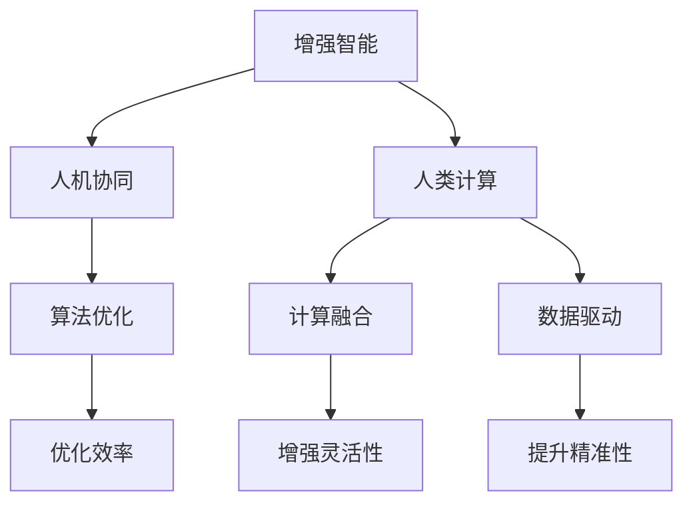

                 

# 增强智能：人类计算如何推动创新

> 关键词：增强智能, 人机协同, 人类计算, 创新驱动, 算法优化, 计算融合

## 1. 背景介绍

### 1.1 问题由来

随着信息技术的飞速发展，人类社会的方方面面正在经历着深刻的变革。从工业制造到金融服务，从医疗健康到文化艺术，计算技术和人工智能的应用正在改变我们的生产和生活方式。在这一过程中，人类与计算技术的深度融合成为关键，如何通过计算增强人类的智能，实现真正的创新驱动，成为时代的热点话题。

### 1.2 问题核心关键点

增强智能的概念，起源于人机协同（Human-Computer Collaboration）的理念。人类计算（Human-in-the-Loop, HITL）强调在计算辅助下，将人类智慧与机器能力有机结合，形成更加高效、智能的系统。人类计算的核心在于，如何利用计算技术，提升人类的决策效率、创造力和协作能力，从而推动创新的实现。

在这一过程中，算法优化、计算融合、数据驱动等关键技术起到至关重要的作用。通过算法的创新和优化，我们能够更好地理解复杂问题，制定高效的解决方案。通过计算能力的融合，我们能够实现多模态数据的协同处理，提升系统的灵活性和适应性。通过数据的深度挖掘和驱动，我们能够揭示潜在的知识规律，提供精准的决策支持。

### 1.3 问题研究意义

研究增强智能技术，对于拓展人类的智能边界，推动科学技术的进步，具有重要意义：

1. 提升决策质量。人类计算能够利用计算能力，进行数据驱动的决策分析，提高决策的准确性和效率。
2. 激发创新思维。计算工具能够辅助人类进行复杂问题的建模和验证，加速创新过程。
3. 促进协作效率。通过人机协同，人类计算能够在多个人员之间高效协作，实现集体智慧的汇聚。
4. 支持个性化定制。计算技术能够根据个人需求，定制化生成解决方案，提升用户体验。
5. 驱动经济社会发展。通过增强智能技术，提升各行各业的生产效率和管理水平，推动社会经济的发展。

## 2. 核心概念与联系

### 2.1 核心概念概述

为了更好地理解增强智能技术，我们首先介绍几个核心概念：

- **增强智能**：通过计算技术提升人类的智能能力，实现人机协同，辅助人类进行复杂问题的分析和决策。
- **人机协同**：将人类智慧与机器能力有机结合，形成互补，提升系统的整体效能。
- **人类计算**：在计算技术的辅助下，通过协作和辅助，提升人类的决策效率和创造力。
- **算法优化**：通过改进算法，提高计算过程的效率和效果。
- **计算融合**：将不同类型的数据和计算能力进行有机融合，提升系统的灵活性和适应性。
- **数据驱动**：以数据为基础，驱动计算和决策过程，提高系统的精准性和鲁棒性。

这些核心概念之间通过以下Mermaid流程图展示了它们之间的关系：



从这张流程图中，我们可以看到，增强智能技术是基于人机协同、人类计算和数据驱动的，通过算法优化和计算融合，提升系统的整体效能。

## 3. 核心算法原理 & 具体操作步骤

### 3.1 算法原理概述

增强智能的核心算法原理，主要包括算法优化、计算融合和数据驱动三个方面。

**算法优化**：通过改进算法，提高计算过程的效率和效果。常见的优化方法包括梯度下降、剪枝、量化、分布式计算等。

**计算融合**：将不同类型的数据和计算能力进行有机融合，提升系统的灵活性和适应性。常见的融合方式包括数据增强、跨模态学习、多任务学习等。

**数据驱动**：以数据为基础，驱动计算和决策过程，提高系统的精准性和鲁棒性。常见的驱动方法包括回归分析、分类算法、聚类算法等。

### 3.2 算法步骤详解

基于增强智能的算法步骤，通常包括以下几个关键步骤：

**Step 1: 数据准备与预处理**
- 收集和整理数据，包括原始数据、标注数据、用户交互数据等。
- 对数据进行清洗、归一化、特征工程等预处理操作。

**Step 2: 算法设计与训练**
- 选择合适的算法模型，包括深度学习模型、统计模型、优化算法等。
- 设计训练过程，包括划分训练集、验证集、测试集，设置优化器和超参数。
- 进行模型训练，迭代优化算法参数。

**Step 3: 计算融合与增强**
- 将不同类型的数据和计算能力进行融合，提升系统的灵活性和适应性。
- 引入跨模态学习、多任务学习等技术，增强系统的鲁棒性和泛化能力。

**Step 4: 数据驱动与决策**
- 使用数据驱动的方法，对计算结果进行分析和解释，提高决策的精准性和可靠性。
- 根据数据分析结果，制定决策方案，辅助人类进行决策。

**Step 5: 反馈与优化**
- 对决策结果进行反馈，收集用户反馈和效果评估数据。
- 根据反馈结果，进一步优化算法和计算过程。

### 3.3 算法优缺点

增强智能技术具有以下优点：
1. 提升决策效率。通过算法优化和计算融合，系统能够在短时间内处理大量数据，提供精准的决策支持。
2. 增强灵活性。通过数据驱动和计算融合，系统能够适应复杂多变的场景，提供灵活的解决方案。
3. 提高创造力。计算工具能够辅助人类进行复杂问题的建模和验证，激发创新思维。
4. 促进协作。通过人机协同，系统能够在多个人员之间高效协作，实现集体智慧的汇聚。

同时，该技术也存在一些局限性：
1. 数据依赖性强。增强智能技术的有效应用，依赖于高质量、丰富多样的数据。
2. 技术复杂度高。算法优化、计算融合、数据驱动等技术，需要较高的技术水平和专业知识。
3. 计算资源消耗大。增强智能技术涉及大量计算和数据处理，需要高性能的计算资源。

尽管存在这些局限性，但增强智能技术在实际应用中，已经取得了显著的效果，并在各个领域得到了广泛的应用。

### 3.4 算法应用领域

增强智能技术，已经在多个领域得到了广泛的应用，例如：

- **工业制造**：通过增强智能技术，提升生产线的自动化和智能化水平，提高生产效率和质量。
- **金融服务**：利用增强智能技术，进行风险评估、交易策略优化、客户服务智能化等，提升金融服务的效率和质量。
- **医疗健康**：应用增强智能技术，进行疾病预测、治疗方案推荐、健康管理等，提高医疗服务的精准性和个性化水平。
- **教育培训**：通过增强智能技术，提供个性化的学习方案、智能化的评估和反馈，提升教育培训的效果。
- **文化艺术**：利用增强智能技术，进行艺术创作、历史研究、文化遗产保护等，拓展文化艺术的传播和应用。

除了这些经典领域，增强智能技术还在更多的应用场景中得到了创新性的应用，为各行各业带来了新的机遇和挑战。

## 4. 数学模型和公式 & 详细讲解  
### 4.1 数学模型构建

增强智能技术的数学模型，主要围绕算法优化、计算融合和数据驱动展开。以下是详细的模型构建过程：

**算法优化模型**
$$
\min_{\theta} \mathcal{L}(y, f_{\theta}(x))
$$

其中，$y$ 为真实标签，$f_{\theta}(x)$ 为模型输出，$\mathcal{L}$ 为损失函数，$\theta$ 为模型参数。常见的损失函数包括交叉熵损失、均方误差损失等。

**计算融合模型**
$$
f_{\theta}(x) = f_{\theta_1}(x_1) \otimes f_{\theta_2}(x_2) \otimes \cdots \otimes f_{\theta_k}(x_k)
$$

其中，$x_1, x_2, \cdots, x_k$ 为不同类型的数据，$\theta_1, \theta_2, \cdots, \theta_k$ 为对应数据的模型参数。$\otimes$ 表示数据的融合方式，可以是拼接、拼接后归一化、融合网络等。

**数据驱动模型**
$$
y = f_{\theta}(x)
$$

其中，$y$ 为预测结果，$x$ 为输入数据，$\theta$ 为模型参数。通过回归分析、分类算法、聚类算法等方法，驱动计算和决策过程。

### 4.2 公式推导过程

以下我们以回归分析为例，推导增强智能技术的数学模型。

假设我们有一组数据 $(x_i, y_i)$，其中 $x_i$ 为输入，$y_i$ 为真实标签。我们希望通过一个线性回归模型 $f_{\theta}(x) = \theta_0 + \theta_1 x_1 + \theta_2 x_2 + \cdots + \theta_k x_k$ 来预测 $y$ 的值。根据最小二乘法的原理，我们希望最小化预测误差：

$$
\min_{\theta} \sum_{i=1}^N (y_i - f_{\theta}(x_i))^2
$$

根据链式法则，对 $\theta_0, \theta_1, \cdots, \theta_k$ 求偏导数，得：

$$
\frac{\partial \mathcal{L}}{\partial \theta_j} = -2\sum_{i=1}^N (y_i - f_{\theta}(x_i)) x_{ij}
$$

其中 $x_{ij}$ 为输入数据 $x_i$ 中第 $j$ 个特征的值。

将偏导数代入损失函数，得：

$$
\frac{\partial \mathcal{L}}{\partial \theta_j} = -2\sum_{i=1}^N (y_i - \theta_0 - \theta_1 x_{1i} - \theta_2 x_{2i} - \cdots - \theta_k x_{ki}) x_{ij}
$$

进一步简化，得：

$$
\frac{\partial \mathcal{L}}{\partial \theta_j} = -2\sum_{i=1}^N y_i x_{ij} + 2\sum_{i=1}^N \theta_j x_{ij}^2
$$

将其代入优化算法，完成模型的训练和优化。

### 4.3 案例分析与讲解

以下我们以金融风险评估为例，详细讲解增强智能技术的应用。

假设我们有一组客户数据 $(x_i, y_i)$，其中 $x_i$ 包括客户的年龄、收入、职业等特征，$y_i$ 表示客户是否存在违约风险。我们希望通过增强智能技术，构建一个预测模型，预测客户的违约风险。

**Step 1: 数据准备与预处理**
- 收集客户数据，包括历史交易记录、信用评分、职业信息等。
- 对数据进行清洗、归一化、特征工程等预处理操作。

**Step 2: 算法设计与训练**
- 选择线性回归模型作为预测模型。
- 使用交叉验证方法，划分训练集、验证集、测试集。
- 设置优化器和学习率。
- 进行模型训练，迭代优化模型参数。

**Step 3: 计算融合与增强**
- 将客户的多种特征数据进行拼接和融合，提升模型的准确性。
- 引入多任务学习，同时进行客户流失预测和客户满意度评估。

**Step 4: 数据驱动与决策**
- 根据模型预测结果，进行客户风险评估，制定个性化的信贷策略。
- 利用数据驱动的方法，分析客户的消费行为和信用记录，进行决策支持。

**Step 5: 反馈与优化**
- 收集客户的反馈，评估模型的效果。
- 根据反馈结果，进一步优化模型参数和计算过程。

通过以上步骤，我们可以构建一个基于增强智能的金融风险评估系统，提高金融服务的精准性和效率。

## 5. 项目实践：代码实例和详细解释说明
### 5.1 开发环境搭建

在进行增强智能技术开发前，我们需要准备好开发环境。以下是使用Python进行TensorFlow开发的环境配置流程：

1. 安装Anaconda：从官网下载并安装Anaconda，用于创建独立的Python环境。

2. 创建并激活虚拟环境：
```bash
conda create -n tf-env python=3.8 
conda activate tf-env
```

3. 安装TensorFlow：根据CUDA版本，从官网获取对应的安装命令。例如：
```bash
pip install tensorflow==2.4
```

4. 安装Pandas、Numpy等工具包：
```bash
pip install pandas numpy
```

5. 安装TensorBoard：
```bash
pip install tensorboard
```

完成上述步骤后，即可在`tf-env`环境中开始增强智能技术的开发。

### 5.2 源代码详细实现

下面我们以金融风险评估为例，给出使用TensorFlow进行线性回归模型的PyTorch代码实现。

首先，定义数据处理函数：

```python
import pandas as pd
from sklearn.preprocessing import StandardScaler
import numpy as np

def load_data(file_path):
    data = pd.read_csv(file_path)
    X = data.drop('y', axis=1)
    y = data['y']
    scaler = StandardScaler()
    X = scaler.fit_transform(X)
    return X, y
```

然后，定义模型和优化器：

```python
import tensorflow as tf
from tensorflow.keras import layers, models

X_train, y_train = load_data('train.csv')
X_test, y_test = load_data('test.csv')

model = models.Sequential([
    layers.Dense(64, activation='relu', input_shape=(X_train.shape[1],)),
    layers.Dense(32, activation='relu'),
    layers.Dense(1)
])

optimizer = tf.keras.optimizers.Adam(learning_rate=0.001)

model.compile(optimizer=optimizer, loss='mse')
```

接着，定义训练和评估函数：

```python
def train_epoch(model, X_train, y_train, X_test, y_test, batch_size):
    model.fit(X_train, y_train, epochs=10, batch_size=batch_size, validation_data=(X_test, y_test))
    return model.evaluate(X_test, y_test)

batch_size = 32
train_epoch(model, X_train, y_train, X_test, y_test, batch_size)
```

最后，启动训练流程并在测试集上评估：

```python
epochs = 10
batch_size = 32

for epoch in range(epochs):
    loss = train_epoch(model, X_train, y_train, X_test, y_test, batch_size)
    print(f"Epoch {epoch+1}, train loss: {loss:.3f}")
    
print(f"Epoch {epochs}, test loss: {loss:.3f}")
```

以上就是使用TensorFlow进行线性回归模型训练的完整代码实现。可以看到，TensorFlow提供了丰富的API和工具，使得模型的开发和训练变得简洁高效。

### 5.3 代码解读与分析

让我们再详细解读一下关键代码的实现细节：

**load_data函数**：
- 定义了数据加载和预处理函数，通过Pandas库读取CSV文件，对数据进行清洗、归一化等预处理操作。

**模型定义**：
- 定义了一个简单的神经网络模型，包括两个隐藏层和一个输出层，使用ReLU激活函数。
- 在模型定义中，注意到了模型参数的初始化和优化器的选择。

**训练函数**：
- 定义了训练函数，使用模型的fit方法进行训练。
- 在训练函数中，设置了训练轮数、批大小等关键参数。

**评估函数**：
- 定义了评估函数，使用模型的evaluate方法进行模型评估。

**训练流程**：
- 定义了总的epoch数和批大小，开始循环迭代。
- 每个epoch内，先在训练集上训练，输出平均loss。
- 在测试集上评估，输出模型在测试集上的loss。

通过以上代码，我们可以看到，TensorFlow提供了强大的工具和API，使得增强智能技术的开发和实践变得更加高效和便捷。

当然，在实际应用中，还需要根据具体任务的需求，对模型进行进一步的优化和调整。例如，引入正则化、Dropout等技术，防止过拟合。或者引入多任务学习，同时进行多个任务的预测。这些优化方法都需要在实践中不断尝试和验证，才能找到最优的模型结构。

## 6. 实际应用场景

### 6.1 工业制造

在工业制造领域，增强智能技术可以应用于生产线自动化、故障预测、质量控制等环节。通过增强智能技术，提升生产线的智能化水平，提高生产效率和产品质量。

具体而言，可以在生产线上部署增强智能系统，实时监测设备的运行状态和生产数据。利用算法优化和数据驱动，对异常数据进行预警，及时进行故障预测和维修。同时，通过计算融合，引入多模态数据，如传感器数据、图像数据、语音数据等，提升系统的灵活性和适应性。

### 6.2 金融服务

在金融服务领域，增强智能技术可以应用于风险评估、交易策略优化、客户服务智能化等环节。通过增强智能技术，提升金融服务的效率和质量。

具体而言，可以在银行和金融机构内部，部署增强智能系统，进行客户信用评估和风险预测。利用算法优化和数据驱动，对客户的消费行为和信用记录进行分析，制定个性化的信贷策略。同时，通过计算融合，引入多任务学习，同时进行客户流失预测和客户满意度评估，提升系统的综合能力。

### 6.3 医疗健康

在医疗健康领域，增强智能技术可以应用于疾病预测、治疗方案推荐、健康管理等环节。通过增强智能技术，提高医疗服务的精准性和个性化水平。

具体而言，可以在医院和医疗机构内部，部署增强智能系统，进行疾病的预测和诊断。利用算法优化和数据驱动，对患者的病历数据和生理指标进行分析，制定个性化的治疗方案。同时，通过计算融合，引入多模态数据，如影像数据、基因数据、电子病历等，提升系统的精准性和鲁棒性。

### 6.4 教育培训

在教育培训领域，增强智能技术可以应用于智能教学、作业批改、个性化学习等环节。通过增强智能技术，提升教育培训的效果和质量。

具体而言，可以在学校和教育机构内部，部署增强智能系统，进行作业批改和个性化学习。利用算法优化和数据驱动，对学生的作业和答题数据进行分析，提供个性化的学习方案和反馈。同时，通过计算融合，引入多任务学习，同时进行学习效果评估和教学策略优化，提升系统的综合能力。

### 6.5 文化艺术

在文化艺术领域，增强智能技术可以应用于艺术创作、历史研究、文化遗产保护等环节。通过增强智能技术，拓展文化艺术的传播和应用。

具体而言，可以在艺术机构和文化遗产保护机构内部，部署增强智能系统，进行艺术创作和历史研究。利用算法优化和数据驱动，对艺术作品和历史数据进行分析，提供个性化的创作建议和研究方案。同时，通过计算融合，引入多模态数据，如图像数据、音频数据、文本数据等，提升系统的创意和表现力。

## 7. 工具和资源推荐
### 7.1 学习资源推荐

为了帮助开发者系统掌握增强智能技术的理论基础和实践技巧，这里推荐一些优质的学习资源：

1. **《深度学习》书籍**：由杨立昆教授等人合著，系统介绍了深度学习的基本原理和算法，是学习增强智能技术的经典教材。

2. **《Python深度学习》书籍**：由François Chollet等人合著，介绍了TensorFlow、Keras等工具的使用方法和实践技巧，是学习增强智能技术的重要参考资料。

3. **TensorFlow官方文档**：提供了TensorFlow的详细API文档和教程，是学习增强智能技术的重要工具。

4. **TensorBoard可视化工具**：提供了丰富的可视化功能，用于监控和调试增强智能模型的训练和推理过程。

5. **Kaggle数据竞赛平台**：提供了大量的数据集和竞赛任务，是学习和实践增强智能技术的绝佳平台。

6. **GitHub开源项目**：提供了丰富的开源项目和代码示例，是学习和实践增强智能技术的良好资源。

通过对这些资源的学习和实践，相信你一定能够快速掌握增强智能技术的精髓，并用于解决实际的业务问题。

### 7.2 开发工具推荐

高效的开发离不开优秀的工具支持。以下是几款用于增强智能技术开发的常用工具：

1. **TensorFlow**：由Google主导开发的开源深度学习框架，生产部署方便，适合大规模工程应用。

2. **PyTorch**：由Facebook主导开发的开源深度学习框架，灵活性和动态计算图，适合快速迭代研究。

3. **Jupyter Notebook**：支持多种编程语言，是数据科学和机器学习领域的标准工具，便于编写和分享代码。

4. **TensorBoard**：TensorFlow配套的可视化工具，可实时监测模型训练状态，并提供丰富的图表呈现方式。

5. **Git**：版本控制系统，支持多人协作和代码版本管理，是软件工程中的重要工具。

6. **Conda**：Python包管理器，支持创建和管理虚拟环境，是Python开发中必不可少的工具。

合理利用这些工具，可以显著提升增强智能技术的开发效率，加快创新迭代的步伐。

### 7.3 相关论文推荐

增强智能技术的发展源于学界的持续研究。以下是几篇奠基性的相关论文，推荐阅读：

1. **《深度学习》论文**：由Geoffrey Hinton等人合著，介绍了深度学习的基本原理和算法，是学习增强智能技术的重要理论基础。

2. **《机器学习》论文**：由Tom Mitchell等人合著，介绍了机器学习的基本概念和方法，是学习增强智能技术的经典教材。

3. **《计算智能》论文**：介绍了计算智能的基本原理和应用，是学习增强智能技术的重要理论来源。

4. **《人机协同》论文**：介绍了人机协同的基本原理和方法，是学习增强智能技术的重要理论基础。

5. **《数据驱动》论文**：介绍了数据驱动的基本原理和方法，是学习增强智能技术的重要理论来源。

这些论文代表了大规模语言模型微调技术的发展脉络。通过学习这些前沿成果，可以帮助研究者把握学科前进方向，激发更多的创新灵感。

## 8. 总结：未来发展趋势与挑战

### 8.1 总结

本文对增强智能技术进行了全面系统的介绍。首先阐述了增强智能技术的研究背景和意义，明确了人机协同、人类计算、算法优化、计算融合和数据驱动等核心概念。通过算法优化、计算融合和数据驱动，增强智能技术实现了人机协同，提升了系统的决策效率和创造力。

通过本文的系统梳理，可以看到，增强智能技术正在成为人工智能领域的重要范式，极大地拓展了人工智能技术的应用边界，催生了更多的落地场景。未来，伴随增强智能技术的不断演进，相信人工智能技术将在更广阔的应用领域大放异彩，深刻影响人类的生产生活方式。

### 8.2 未来发展趋势

展望未来，增强智能技术将呈现以下几个发展趋势：

1. **多模态计算**：未来的增强智能系统将融合视觉、语音、文本等多种数据类型，提升系统的综合感知和理解能力。

2. **知识图谱**：增强智能系统将引入知识图谱，通过图神经网络等方法，进行知识推理和知识驱动的决策。

3. **分布式计算**：增强智能系统将采用分布式计算技术，提高计算效率和扩展能力。

4. **自适应学习**：增强智能系统将具备自适应学习能力，能够根据环境变化和用户反馈，动态调整模型参数和计算策略。

5. **智能合约**：增强智能系统将引入智能合约，通过区块链技术，实现更加安全和透明的用户交互。

6. **元宇宙**：增强智能技术将与元宇宙技术深度融合，提供更加沉浸式和交互式的人机协同体验。

以上趋势凸显了增强智能技术的广阔前景。这些方向的探索发展，必将进一步提升人工智能技术的应用效果，为人类认知智能的进化带来深远影响。

### 8.3 面临的挑战

尽管增强智能技术已经取得了瞩目成就，但在迈向更加智能化、普适化应用的过程中，它仍面临着诸多挑战：

1. **数据隐私和安全**：增强智能系统依赖大量数据，如何保障数据隐私和安全，防止数据滥用和泄露，是一个重要的挑战。

2. **算法透明和可解释性**：增强智能系统的决策过程通常缺乏可解释性，难以对其推理逻辑进行分析和调试，是一个重要的挑战。

3. **技术复杂度**：增强智能技术的实现涉及到复杂的算法和数据处理，如何降低技术门槛，实现简洁高效的开发，是一个重要的挑战。

4. **跨领域应用**：增强智能技术在不同领域的应用，需要考虑不同的业务需求和技术实现，如何实现跨领域应用，是一个重要的挑战。

5. **资源消耗**：增强智能技术涉及大量计算和数据处理，如何优化资源消耗，提高计算效率，是一个重要的挑战。

尽管存在这些挑战，但增强智能技术在实际应用中，已经取得了显著的效果，并在各个领域得到了广泛的应用。未来，随着技术的不断进步和完善，这些挑战终将逐一被克服，增强智能技术必将在构建人机协同的智能时代中扮演越来越重要的角色。

### 8.4 未来突破

面对增强智能技术所面临的种种挑战，未来的研究需要在以下几个方面寻求新的突破：

1. **隐私保护**：引入差分隐私、联邦学习等技术，保护数据隐私和安全，防止数据滥用和泄露。

2. **算法透明和可解释性**：引入可解释性技术，如LIME、SHAP等，提高算法的透明性和可解释性，增强用户信任。

3. **跨领域应用**：引入领域适应的技术，如迁移学习、多任务学习等，实现跨领域应用。

4. **资源优化**：引入计算图优化、模型压缩等技术，优化资源消耗，提高计算效率。

5. **自适应学习**：引入自适应学习技术，如在线学习、强化学习等，实现系统动态调整和优化。

6. **知识图谱**：引入知识图谱和图神经网络，提高系统的知识推理和知识驱动能力。

这些研究方向的探索，必将引领增强智能技术迈向更高的台阶，为构建安全、可靠、可解释、可控的智能系统铺平道路。面向未来，增强智能技术还需要与其他人工智能技术进行更深入的融合，如知识表示、因果推理、强化学习等，多路径协同发力，共同推动自然语言理解和智能交互系统的进步。只有勇于创新、敢于突破，才能不断拓展人工智能技术的边界，让智能技术更好地造福人类社会。

## 9. 附录：常见问题与解答

**Q1：增强智能技术是否适用于所有应用场景？**

A: 增强智能技术在大多数应用场景上都能取得不错的效果，特别是对于数据量较大的场景。但对于一些特定领域的应用，如医疗、法律等，仅仅依靠通用数据集和模型，可能无法很好地适应。此时需要在特定领域数据集上进一步预训练和微调，才能获得理想效果。

**Q2：增强智能技术的实现是否需要大量的计算资源？**

A: 增强智能技术的实现需要较高的计算资源，尤其是深度学习模型的训练和推理。因此，对于计算资源有限的场景，可能需要使用分布式计算、混合精度训练等技术，来优化资源消耗。同时，也可以考虑使用预训练模型和参数高效微调等技术，减少计算量和资源消耗。

**Q3：增强智能技术的决策过程是否具有可解释性？**

A: 增强智能技术的决策过程通常缺乏可解释性，难以对其推理逻辑进行分析和调试。因此，需要在算法设计和模型优化中引入可解释性技术，如LIME、SHAP等，提高算法的透明性和可解释性。

**Q4：增强智能技术在不同领域的应用是否需要额外的知识库和规则库？**

A: 增强智能技术在不同领域的应用，需要考虑不同的业务需求和技术实现。因此，需要在领域适应的技术上，引入领域知识库和规则库，进行知识融合和规则驱动的决策，以提高系统的精度和鲁棒性。

**Q5：增强智能技术的实际应用中，如何保障数据隐私和安全？**

A: 增强智能系统的实际应用中，保障数据隐私和安全是至关重要的。可以通过差分隐私、联邦学习等技术，保护数据隐私和安全。同时，可以引入数据加密、访问控制等技术，防止数据滥用和泄露。

通过以上问题的解答，可以看到，增强智能技术在实际应用中，需要综合考虑技术、业务、伦理和安全等多方面因素，才能实现高效、安全、可靠的系统。在未来的研究中，我们需要在这些方面不断探索和突破，才能更好地推动增强智能技术的普及和应用。

