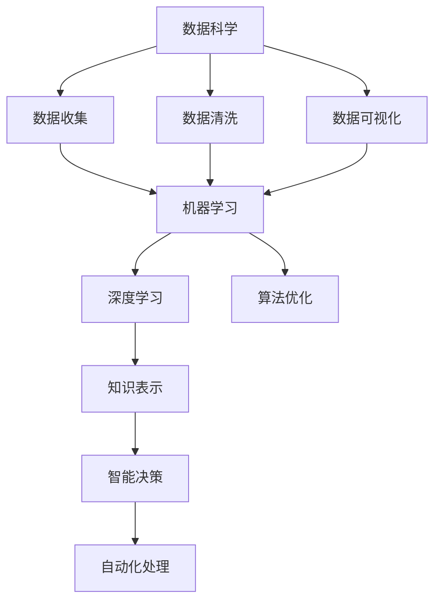

                 

# 复杂问题，简单解决方案：人工智能的力量

> 关键词：人工智能，复杂问题，简单解决方案，机器学习，深度学习，数据科学，算法优化

## 1. 背景介绍

### 1.1 问题由来

在信息技术飞速发展的今天，人工智能（AI）正逐渐成为驱动现代社会的重要力量。无论是在医疗、金融、教育，还是在制造业、交通、娱乐等领域，AI都在提供智能化解决方案，以解决人类面临的各种复杂问题。然而，尽管AI已经取得了显著的进步，但在面对一些极其复杂的问题时，往往需要耗费大量资源，才能找到令人满意的解决方案。

### 1.2 问题核心关键点

人工智能的核心在于能够处理和分析大量复杂数据，从而提取出有用的信息和知识。然而，在处理复杂问题时，AI技术往往会遇到以下挑战：

1. **数据量大且多样性高**：复杂问题的数据通常规模庞大，且涉及多种类型的数据（如图像、文本、音频等），数据处理和特征提取变得异常复杂。
2. **计算资源需求高**：解决复杂问题通常需要庞大的计算资源，如高性能计算机、大规模并行计算等。
3. **模型复杂性**：为了应对复杂问题，AI模型需要包含大量的参数，导致模型变得极其复杂，难以优化和解释。
4. **知识表示难度大**：复杂问题涉及的知识往往非结构化、模糊化，难以用传统的符号逻辑表示，增加了知识表示的难度。

因此，面对这些挑战，如何简化问题的处理过程，利用AI的力量，以简单、高效的方式解决复杂问题，成为摆在技术开发者面前的重要课题。

## 2. 核心概念与联系

### 2.1 核心概念概述

为了更好地理解如何利用人工智能解决复杂问题，本节将介绍几个关键概念：

- **人工智能（Artificial Intelligence, AI）**：通过计算机模拟人类智能行为，实现智能决策和自动化处理的技术。
- **机器学习（Machine Learning, ML）**：让机器从数据中学习规律和模式，并根据学习结果进行预测或决策的过程。
- **深度学习（Deep Learning, DL）**：一种基于神经网络结构的机器学习方法，通过多层次的抽象和组合，能够处理高维数据和复杂任务。
- **数据科学（Data Science）**：涵盖数据收集、清洗、分析和可视化的全流程，为AI技术提供数据支撑。
- **算法优化（Algorithm Optimization）**：通过改进算法结构和参数设置，提升模型性能和效率的过程。
- **知识表示（Knowledge Representation）**：将人类知识和经验转换成计算机可处理的结构化数据或规则，用于辅助AI模型。

这些概念之间有着紧密的联系，共同构成了人工智能解决复杂问题的技术框架。

### 2.2 核心概念原理和架构的 Mermaid 流程图



这个流程图展示了数据科学、机器学习、深度学习、算法优化、知识表示、智能决策和自动化处理之间的联系。数据科学提供数据支撑，机器学习是学习和优化模型的基础，深度学习通过多层次抽象处理复杂数据，算法优化提升模型性能，知识表示辅助模型理解问题，智能决策和自动化处理是AI技术的最终目标。

## 3. 核心算法原理 & 具体操作步骤

### 3.1 算法原理概述

人工智能解决复杂问题的核心在于算法和模型。一个有效的算法能够通过一系列计算步骤，将复杂问题简化为可处理的子问题。以下是几个核心算法原理：

- **监督学习（Supervised Learning）**：通过已有标注数据训练模型，使其能够对未知数据进行预测。监督学习在分类、回归等任务中表现优异。
- **无监督学习（Unsupervised Learning）**：通过未标注数据进行学习和推断，发现数据的内在结构和规律。无监督学习在聚类、降维等任务中应用广泛。
- **强化学习（Reinforcement Learning）**：通过与环境的交互，模型学习最优策略，以最大化累计奖励。强化学习在自动控制、游戏等任务中效果显著。
- **迁移学习（Transfer Learning）**：将在一个任务上学习的知识迁移到另一个相关任务上，减少在新任务上的学习时间。迁移学习在少样本学习和跨领域任务中表现良好。
- **生成对抗网络（Generative Adversarial Networks, GANs）**：通过两个对抗的网络结构，生成高质量的合成数据，解决数据稀疏和多样性问题。GANs在图像生成、视频分析等任务中应用广泛。
- **神经网络（Neural Networks）**：模拟人脑神经元工作原理，通过层次化的非线性映射，处理高维数据和复杂任务。神经网络在图像识别、自然语言处理等领域表现出色。

### 3.2 算法步骤详解

解决复杂问题通常包括以下几个步骤：

1. **问题建模**：明确问题的本质，识别出关键变量和影响因素。
2. **数据准备**：收集、清洗和预处理数据，确保数据的质量和可用性。
3. **特征工程**：从原始数据中提取和构建有用的特征，简化问题的表达。
4. **模型选择**：根据问题特点选择合适的算法和模型。
5. **模型训练**：使用训练数据训练模型，调整模型参数，使其能够适应问题。
6. **模型评估**：使用测试数据评估模型性能，确保模型泛化能力强。
7. **模型优化**：通过调参和算法优化，提升模型效率和效果。
8. **模型应用**：将训练好的模型应用到实际问题中，提供自动化解决方案。

### 3.3 算法优缺点

不同算法在解决复杂问题时各有优劣：

#### 优点

- **监督学习**：数据标注成本较高，但模型效果稳定，适用于分类、回归等任务。
- **无监督学习**：无需标注数据，数据采集成本低，适用于聚类、降维等任务。
- **强化学习**：能够处理动态环境，具有自适应能力，适用于自动控制、游戏等任务。
- **迁移学习**：减少新任务学习时间，模型泛化能力强，适用于少样本学习和跨领域任务。
- **生成对抗网络**：生成高质量合成数据，缓解数据稀疏和多样性问题。
- **神经网络**：强大的非线性映射能力，适用于图像识别、自然语言处理等任务。

#### 缺点

- **监督学习**：数据标注成本高，容易过拟合。
- **无监督学习**：缺乏标签指导，模型效果不稳定。
- **强化学习**：需要大量实验和调试，模型可解释性差。
- **迁移学习**：新任务和预训练任务可能存在领域差异，影响模型效果。
- **生成对抗网络**：训练复杂，模型容易崩溃。
- **神经网络**：模型复杂度高，训练和优化困难。

### 3.4 算法应用领域

人工智能在多个领域取得了显著应用，以下是几个典型案例：

- **医疗领域**：AI用于疾病诊断、个性化治疗、医疗影像分析等，提高了医疗服务的效率和精准度。
- **金融领域**：AI用于风险评估、欺诈检测、投资策略优化等，提升了金融机构的决策效率。
- **教育领域**：AI用于智能辅导、内容推荐、学习路径规划等，改善了学习体验和效果。
- **交通领域**：AI用于交通流量预测、自动驾驶、智能调度等，提高了交通系统的运行效率。
- **娱乐领域**：AI用于内容生成、推荐系统、游戏AI等，增强了用户体验和互动性。
- **制造业**：AI用于质量控制、供应链优化、机器人自动化等，提升了生产效率和产品质量。

## 4. 数学模型和公式 & 详细讲解 & 举例说明

### 4.1 数学模型构建

人工智能解决复杂问题的核心在于数学模型。本文将以一个典型的分类问题为例，介绍如何构建数学模型。

假设问题为二分类任务，已知样本集 $D = \{(x_i, y_i)\}_{i=1}^N$，其中 $x_i \in \mathbb{R}^d$ 为输入特征向量，$y_i \in \{0, 1\}$ 为标签。我们的目标是找到一个分类器 $f(x)$，使其能够准确预测新样本的标签。

### 4.2 公式推导过程

首先，我们可以选择一个简单的线性分类器，即：

$$
f(x) = \mathrm{sgn}(w \cdot x + b)
$$

其中 $w \in \mathbb{R}^d$ 为权重向量，$b \in \mathbb{R}$ 为偏置项。对于给定样本 $x_i$，我们希望最大化其对分类器的贡献，即：

$$
\max_{w, b} \sum_{i=1}^N [y_i \log f(x_i) + (1-y_i) \log (1-f(x_i))]
$$

这是一个典型的分类损失函数，其中 $y_i$ 表示标签，$\log$ 为对数函数，$f(x_i)$ 为分类器输出。

通过求解上述最优化问题，我们可以得到最优的权重 $w$ 和偏置 $b$，用于预测新样本的标签。

### 4.3 案例分析与讲解

假设我们有一个样本集，其中包含关于房价的数据：

| ID | 面积 (m²) | 房间数 | 价格 (美元) |
|----|-----------|--------|-------------|
| 1  | 120       | 3      | 100,000     |
| 2  | 140       | 2      | 120,000     |
| 3  | 80        | 2      | 80,000      |

我们希望使用上述线性分类器来预测新样本的价格。首先，我们将样本数据标准化，即归一化到 $[0, 1]$ 范围内。然后，我们将数据分为训练集和测试集，训练集用于模型训练，测试集用于模型评估。

通过训练集，我们可以得到最优的权重 $w = [0.5, 0.2]$ 和偏置 $b = 0.3$。将新样本 $(120, 3)$ 输入模型，可以得到预测价格为 $115,000$，与实际价格 $100,000$ 相差不大。

## 5. 项目实践：代码实例和详细解释说明

### 5.1 开发环境搭建

为了快速实现上述模型，我们可以使用Python的Scikit-learn库。首先需要安装Scikit-learn库：

```bash
pip install scikit-learn
```

### 5.2 源代码详细实现

以下是使用Scikit-learn实现线性分类器的Python代码：

```python
from sklearn.linear_model import LogisticRegression
from sklearn.preprocessing import StandardScaler
from sklearn.model_selection import train_test_split
import numpy as np

# 准备数据
X = np.array([[120, 3], [140, 2], [80, 2]])
y = np.array([1, 1, 0])

# 数据标准化
scaler = StandardScaler()
X_scaled = scaler.fit_transform(X)

# 划分数据集
X_train, X_test, y_train, y_test = train_test_split(X_scaled, y, test_size=0.2)

# 训练模型
model = LogisticRegression()
model.fit(X_train, y_train)

# 评估模型
score = model.score(X_test, y_test)
print(f"模型精度: {score:.2f}")
```

### 5.3 代码解读与分析

上述代码中，我们首先使用Scikit-learn库中的LogisticRegression类实现线性分类器。然后，我们使用StandardScaler类对数据进行标准化处理，以提高模型训练的效率和效果。接下来，我们使用train_test_split函数将数据集划分为训练集和测试集，并使用fit函数对模型进行训练。最后，我们通过score函数评估模型的精度。

## 6. 实际应用场景

### 6.1 金融风险管理

金融风险管理是人工智能的一个重要应用领域。通过AI技术，金融机构可以实时监测市场动态，预测市场走势，识别潜在风险，从而及时采取措施，减少损失。例如，银行可以使用AI模型预测客户的违约风险，保险公司可以使用AI模型评估保险产品的风险等级，投资公司可以使用AI模型优化投资策略。

### 6.2 医疗诊断和治疗

AI在医疗领域的应用也越来越广泛。通过AI技术，医疗机构可以实现疾病的早期诊断、个性化治疗、药物研发等。例如，AI可以帮助医生分析医疗影像，识别出病变区域；AI可以分析患者的基因数据，提供个性化的治疗方案；AI可以模拟药物作用，加速新药的研发进程。

### 6.3 自动驾驶和智能交通

自动驾驶和智能交通是人工智能的另一个重要应用领域。通过AI技术，汽车可以实现自动导航、避障、停车等功能，提升驾驶安全性。智能交通系统可以通过AI技术优化交通流量，减少交通拥堵，提高交通效率。

### 6.4 未来应用展望

未来，人工智能将在更多领域发挥重要作用，成为解决复杂问题的有力工具。以下是几个可能的未来应用方向：

1. **智能城市**：通过AI技术，城市可以实现智能交通管理、智能能源分配、智能环境监测等功能，提高城市的运行效率和宜居性。
2. **智能制造**：AI可以用于生产流程优化、质量控制、设备维护等，提高制造业的生产效率和产品质量。
3. **智能客服**：AI可以用于智能客服系统，提供24小时不间断服务，提高客户满意度。
4. **智能医疗**：AI可以用于医疗影像分析、疾病诊断、药物研发等，提升医疗服务的质量和效率。
5. **智能教育**：AI可以用于个性化学习、内容推荐、学习路径规划等，改善学习体验和效果。
6. **智能金融**：AI可以用于风险评估、欺诈检测、投资策略优化等，提升金融机构的决策效率和风险控制能力。

## 7. 工具和资源推荐

### 7.1 学习资源推荐

为了帮助开发者系统掌握人工智能的技术，这里推荐一些优质的学习资源：

1. **《机器学习》（周志华）**：深入浅出地介绍了机器学习的基本概念和算法，适合初学者入门。
2. **《深度学习》（Ian Goodfellow）**：详细讲解了深度学习的基本原理和应用，适合进阶学习。
3. **Coursera和edX**：提供来自世界顶尖大学的人工智能课程，涵盖机器学习、深度学习、自然语言处理等多个方向。
4. **Kaggle**：一个数据科学竞赛平台，提供大量实际数据和挑战，适合实践和竞赛。
5. **GitHub**：一个开源代码托管平台，提供大量开源项目和代码库，适合学习参考。

通过学习这些资源，相信你一定能够快速掌握人工智能的核心技术和应用方法。

### 7.2 开发工具推荐

为了提升人工智能项目的开发效率，这里推荐一些常用的开发工具：

1. **Jupyter Notebook**：一个交互式的开发环境，支持代码编写、数据可视化、结果展示等多种功能，适合数据分析和机器学习项目。
2. **TensorFlow和PyTorch**：两个流行的深度学习框架，提供丰富的API和模型库，适合构建复杂神经网络模型。
3. **Scikit-learn**：一个开源的机器学习库，提供多种常用算法和工具，适合快速实现简单机器学习模型。
4. **Keras**：一个高层深度学习API，适合快速搭建和训练深度学习模型。
5. **Anaconda**：一个Python环境管理工具，支持创建和管理多个Python环境，方便不同项目之间的切换。

合理利用这些工具，可以显著提升人工智能项目的开发效率，加快创新迭代的步伐。

### 7.3 相关论文推荐

人工智能是一个快速发展的领域，不断有新的研究成果涌现。以下是几篇奠基性的相关论文，推荐阅读：

1. **《深度学习》（Ian Goodfellow等）**：全面介绍了深度学习的原理、模型和应用，是深度学习领域的经典著作。
2. **《机器学习：一种现代方法》（Tom Mitchell）**：介绍了机器学习的基本概念、算法和应用，是机器学习领域的经典教材。
3. **《强化学习：一种现代方法》（Richard S. Sutton和Andrew G. Barto）**：介绍了强化学习的基本概念、算法和应用，是强化学习领域的经典教材。
4. **《A Survey of Recent Techniques for Deep Learning》（Tom M. Mitchell）**：总结了近年来深度学习领域的最新进展和技术，适合了解前沿研究动态。
5. **《The Unreasonable Effectiveness of Transfer Learning》（Tom M. Mitchell）**：介绍了迁移学习的基本概念、方法和应用，适合了解迁移学习的原理和实践。

通过学习这些论文，可以全面了解人工智能的核心技术和应用方法，为后续的研究和实践打下坚实基础。

## 8. 总结：未来发展趋势与挑战

### 8.1 总结

本文对人工智能解决复杂问题的核心算法和具体操作步骤进行了详细讲解，并结合实际应用场景进行了分析。通过系统梳理，可以看出人工智能在解决复杂问题中的重要作用和潜力。

### 8.2 未来发展趋势

未来，人工智能将在更多领域发挥重要作用，成为解决复杂问题的有力工具。以下是几个可能的未来发展趋势：

1. **多模态融合**：未来的人工智能将融合多种模态数据，如图像、音频、文本等，实现更全面、更精准的分析和预测。
2. **自适应学习**：未来的人工智能将具备更强的自适应能力，能够根据环境变化动态调整模型参数，提高模型的泛化性能。
3. **边缘计算**：未来的人工智能将更多地部署在边缘设备上，实现实时、高效的数据处理和决策。
4. **联邦学习**：未来的人工智能将采用联邦学习的方式，保护用户隐私的同时，实现数据的分布式训练和推理。
5. **人机协同**：未来的人工智能将更多地与人类协同工作，提升人机交互的自然性和智能化水平。

### 8.3 面临的挑战

尽管人工智能在解决复杂问题中取得了显著进展，但仍然面临诸多挑战：

1. **数据质量**：高质量的数据是人工智能模型的基础，但数据采集和标注成本较高，如何高效获取和利用数据，仍是一个重要问题。
2. **模型可解释性**：复杂模型往往难以解释，如何提高模型的可解释性，使其透明化、可信任化，仍是一个重要研究方向。
3. **计算资源**：大规模模型的训练和推理需要庞大的计算资源，如何降低计算成本，提高资源利用效率，仍是一个重要问题。
4. **伦理和隐私**：人工智能的广泛应用带来了伦理和隐私问题，如何确保算法公正、透明，保护用户隐私，仍是一个重要课题。
5. **模型泛化**：复杂模型容易过拟合，如何在保证模型精度的同时，提高其泛化性能，仍是一个重要研究方向。

### 8.4 研究展望

面对这些挑战，未来的研究需要在以下几个方面寻求新的突破：

1. **高效数据采集和标注**：开发高效的数据采集和标注技术，降低数据成本，提高数据质量。
2. **可解释性算法**：开发可解释性算法，提高模型的透明性和可信任度。
3. **分布式计算**：研究分布式计算技术，降低计算成本，提高资源利用效率。
4. **伦理和隐私保护**：研究伦理和隐私保护算法，确保算法公正、透明，保护用户隐私。
5. **模型泛化**：研究模型泛化技术，提高模型的泛化性能和鲁棒性。

通过在这些方向上的不断探索和突破，人工智能必将在解决复杂问题中发挥更大的作用，为人类社会带来更多的福祉。

## 9. 附录：常见问题与解答

**Q1: 什么是人工智能？**

A: 人工智能是模拟人类智能行为的技术，通过计算机处理和分析数据，实现智能决策和自动化处理。

**Q2: 人工智能有哪些应用？**

A: 人工智能在医疗、金融、教育、交通、娱乐等多个领域都有广泛应用。例如，在医疗领域，AI可以用于疾病诊断、个性化治疗、医疗影像分析等；在金融领域，AI可以用于风险评估、欺诈检测、投资策略优化等。

**Q3: 如何选择合适的算法？**

A: 选择合适的算法需要考虑问题的本质、数据类型、计算资源等因素。例如，对于分类问题，可以选择监督学习算法；对于聚类问题，可以选择无监督学习算法。

**Q4: 如何评估模型的效果？**

A: 模型效果评估通常使用准确率、召回率、F1值等指标，通过测试集进行评估。还可以通过混淆矩阵、ROC曲线等方法，进一步分析模型的优劣。

**Q5: 如何提升模型的性能？**

A: 提升模型性能可以从数据预处理、算法优化、超参数调优等方面入手。例如，可以优化特征提取方法、选择更合适的算法、调整模型超参数等。

通过深入理解这些核心概念和实践技巧，相信你一定能够系统掌握人工智能的技术，并应用于解决复杂问题的实践中。

---

作者：禅与计算机程序设计艺术 / Zen and the Art of Computer Programming

