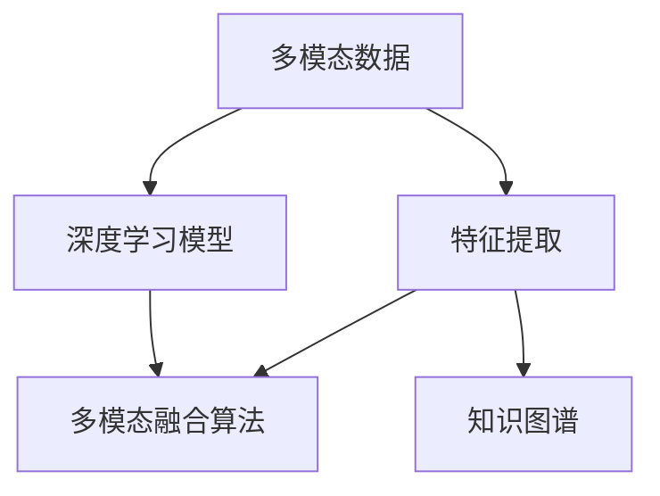

                 

# 多模态信息处理：AI的综合能力

> 关键词：多模态信息融合,深度学习,特征提取,图像处理,自然语言处理,知识图谱,应用实例

## 1. 背景介绍

随着技术的迅猛发展，人工智能(AI)逐渐成为各行各业创新的关键驱动力。尤其是在多模态信息处理方面，AI技术通过融合图像、音频、文本等多种信息，提升了智能系统的感知、理解和推理能力，为各类应用场景带来了革命性的变革。

### 1.1 问题由来
多模态信息处理是一种将不同类型的数据（如文本、图像、语音等）综合起来进行处理的方法。在人类认知中，我们通过视觉、听觉、触觉等多种感官获取信息，因此多模态处理更符合人脑的运作方式。目前，基于深度学习的多模态信息处理已经在图像识别、语音识别、情感分析、智能推荐、机器人交互等多个领域得到了广泛应用。

### 1.2 问题核心关键点
- **多模态数据特征提取**：从不同模态中提取特征并进行融合，是实现多模态信息处理的基础。
- **融合算法选择**：选择合适的融合算法可以有效提升系统的感知和推理能力。
- **数据对齐**：不同模态数据在时间和空间上的对齐，是实现信息融合的前提。
- **知识图谱构建**：将多模态数据映射到知识图谱中，利用结构化知识提升系统推理能力。
- **应用场景选择**：针对具体应用场景，选择适合的融合方式和算法，如智能推荐、机器人交互等。

## 2. 核心概念与联系

### 2.1 核心概念概述

为更好地理解多模态信息处理技术，本节将介绍几个密切相关的核心概念：

- **多模态数据**：指包含多种类型数据的综合数据集，如文本、图像、语音、视频等。
- **特征提取**：从不同模态数据中提取有意义的特征，用于后续的融合和处理。
- **深度学习模型**：如卷积神经网络(CNN)、循环神经网络(RNN)、Transformer等，用于多模态数据的表示学习和特征提取。
- **多模态融合算法**：包括空域融合、频域融合、时域融合等，用于将不同模态的特征进行综合。
- **知识图谱**：利用图结构化的形式，将多模态信息映射到知识图谱中，增强系统的推理能力。

这些核心概念之间的逻辑关系可以通过以下Mermaid流程图来展示：



这个流程图展示了他信息处理的核心概念及其之间的关系：

1. 多模态数据通过特征提取和深度学习模型进行处理。
2. 不同模态的特征通过融合算法进行综合。
3. 融合后的特征或知识图谱结构，可以应用于各种应用场景。

这些概念共同构成了多模态信息处理的基础框架，使其能够在复杂多样的数据中提取有价值的信息，并应用于各种实际应用中。

## 3. 核心算法原理 & 具体操作步骤
### 3.1 算法原理概述

多模态信息处理的本质是通过深度学习模型对不同类型的数据进行联合表示学习，并在特征空间中进行综合。其核心思想是：将不同模态的数据映射到相同的特征空间，然后利用融合算法将这些特征综合起来，形成更丰富的表示，提升系统的综合感知和推理能力。

形式化地，假设多模态数据集为 $D=\{(x_i,y_i)\}_{i=1}^N$，其中 $x_i$ 包含 $m$ 个不同模态的特征，$y_i$ 为标签。多模态信息处理的优化目标是最小化经验风险，即找到最优的模型参数 $\theta$：

$$
\theta^* = \mathop{\arg\min}_{\theta} \mathcal{L}(M_{\theta},D)
$$

其中 $\mathcal{L}$ 为针对多模态数据设计的损失函数，用于衡量模型预测输出与真实标签之间的差异。常见的损失函数包括交叉熵损失、均方误差损失等。

### 3.2 算法步骤详解

多模态信息处理的一般流程包括：

**Step 1: 数据预处理与特征提取**
- 收集和清洗多模态数据集，将不同模态的数据进行统一预处理。
- 通过深度学习模型对不同模态的数据进行特征提取，得到低维特征向量。

**Step 2: 多模态特征融合**
- 选择合适的融合算法，将不同模态的特征进行综合。
- 应用空域、频域、时域等方法，将多模态特征映射到统一特征空间。

**Step 3: 模型训练与优化**
- 在融合后的特征上，使用深度学习模型进行联合表示学习。
- 选择适当的优化算法和超参数，如Adam、SGD等，设置学习率、批大小、迭代轮数等。

**Step 4: 模型评估与部署**
- 在测试集上评估模型的性能，对比多模态融合前后的效果。
- 使用训练好的模型进行实际应用，如智能推荐、情感分析、机器人交互等。
- 持续收集新数据，定期重新训练模型，以适应数据分布的变化。

以上是多模态信息处理的一般流程。在实际应用中，还需要针对具体任务的特点，对融合方法、深度学习模型、超参数等进行优化设计，以进一步提升模型性能。

### 3.3 算法优缺点

多模态信息处理具有以下优点：

1. **丰富信息融合**：通过融合不同模态的数据，可以获取更全面、更精确的信息，提升系统的感知和推理能力。
2. **跨模态学习**：利用多模态数据进行联合表示学习，可以提高模型的泛化能力和鲁棒性。
3. **实时性增强**：在融合后的特征空间中，可以设计高效的模型结构，提升推理和推理速度。

同时，该方法也存在一定的局限性：

1. **高数据成本**：多模态信息处理需要大量的标注数据，数据采集和标注成本较高。
2. **复杂性提升**：处理多模态数据增加了系统的复杂性，需要更先进的计算能力和更高效的算法。
3. **领域依赖**：不同模态的数据在不同的领域中具有不同的重要性，如何平衡各模态的影响需要深入研究。
4. **数据对齐困难**：不同模态的数据在时间、空间上可能不一致，需要进行对齐，增加了处理的难度。

尽管存在这些局限性，但就目前而言，多模态信息处理已成为AI技术的重要组成部分，具有广泛的应用前景。

### 3.4 算法应用领域

多模态信息处理技术已经在诸多领域得到了广泛应用，例如：

- **智能推荐系统**：通过融合用户行为数据、商品信息、用户画像等，为用户提供个性化推荐。
- **情感分析**：结合用户评论、表情、语音等多模态数据，分析用户的情感倾向和情绪变化。
- **机器人交互**：通过语音识别、面部表情识别、身体语言分析等，实现机器人与用户的自然对话和互动。
- **医疗诊断**：结合患者的症状描述、影像数据、基因信息等，辅助医生进行疾病诊断和治疗方案制定。
- **自动驾驶**：融合图像、雷达、激光雷达等数据，提升车辆的感知和决策能力。
- **安防监控**：结合视频、声音、温度等多种传感器数据，实现更精准的异常检测和安全预警。

除了上述这些经典应用外，多模态信息处理还被创新性地应用到更多场景中，如智能家居、智慧城市、智能制造等，为各行各业带来了新的突破。

## 4. 数学模型和公式 & 详细讲解  
### 4.1 数学模型构建

本节将使用数学语言对多模态信息处理过程进行更加严格的刻画。

假设输入数据集 $D$ 包含 $m$ 个不同模态的数据 $x_i=\{x_i^{(1)},x_i^{(2)},\ldots,x_i^{(m)}\}$，其中 $x_i^{(j)} \in \mathbb{R}^{n_j}$ 表示第 $j$ 个模态的特征向量。多模态融合后的特征向量为 $z_i \in \mathbb{R}^{n}$，其中 $n$ 为融合后的特征维度。

定义融合函数 $F$，将多模态数据映射到融合特征空间，得到融合特征 $z_i = F(x_i)$。多模态信息处理的优化目标是最小化经验风险，即找到最优的融合函数 $F$ 和融合后的特征表示 $z_i$：

$$
\theta^* = \mathop{\arg\min}_{F,z} \mathcal{L}(F,z,D)
$$

其中 $\mathcal{L}$ 为针对多模态数据设计的损失函数，用于衡量模型预测输出与真实标签之间的差异。常见的损失函数包括交叉熵损失、均方误差损失等。

### 4.2 公式推导过程

以下我们以多模态图像和文本数据为例，推导融合函数 $F$ 的计算公式。

假设图像特征 $x_i^{(1)} \in \mathbb{R}^{d_1}$，文本特征 $x_i^{(2)} \in \mathbb{R}^{d_2}$，融合后的特征 $z_i \in \mathbb{R}^{d}$。定义融合函数 $F$ 为：

$$
z_i = F(x_i^{(1)},x_i^{(2)}) = \sum_{j=1}^m \alpha_j x_i^{(j)}
$$

其中 $\alpha_j$ 为第 $j$ 个模态的权重，需要通过训练得到。融合函数 $F$ 可以看作是一个线性组合，通过学习权重 $\alpha_j$ 实现不同模态的特征融合。

将融合后的特征 $z_i$ 输入到深度学习模型 $M$ 中，输出为预测标签 $y_i$：

$$
y_i = M(z_i)
$$

通过损失函数 $\mathcal{L}$ 衡量预测输出 $y_i$ 与真实标签 $y_i$ 的差异，并最小化损失函数：

$$
\mathcal{L}(F,z,D) = \frac{1}{N} \sum_{i=1}^N \ell(M(z_i),y_i)
$$

其中 $\ell$ 为损失函数，如交叉熵损失函数。

通过梯度下降等优化算法，最小化损失函数，得到最优的融合函数 $F$ 和融合后的特征 $z_i$。最终得到的多模态融合模型，可以在各种应用场景下发挥强大的感知和推理能力。

### 4.3 案例分析与讲解

为了更直观地理解多模态信息处理的数学模型，我们以图像识别为例，介绍多模态信息处理的计算过程。

假设图像识别任务中，输入的图像数据 $x_i^{(1)} \in \mathbb{R}^{d_1}$，文本描述数据 $x_i^{(2)} \in \mathbb{R}^{d_2}$。融合函数 $F$ 定义如下：

$$
z_i = F(x_i^{(1)},x_i^{(2)}) = \alpha_1 x_i^{(1)} + \alpha_2 x_i^{(2)}
$$

其中 $\alpha_1$ 和 $\alpha_2$ 为图像和文本的权重，需要通过训练得到。假设图像和文本的权重分别为 $0.7$ 和 $0.3$。

融合后的特征 $z_i$ 输入到卷积神经网络 $M$ 中，得到图像识别的预测结果 $y_i$：

$$
y_i = M(z_i)
$$

假设 $z_i$ 的维度为 $d=64$，$M$ 的输出维度为 $c=10$，代表10个不同的类别。假设损失函数 $\mathcal{L}$ 为交叉熵损失函数，则多模态信息处理的优化目标为：

$$
\theta^* = \mathop{\arg\min}_{\alpha,z} \mathcal{L}(F,z,D)
$$

其中 $F(x_i^{(1)},x_i^{(2)}) = 0.7x_i^{(1)} + 0.3x_i^{(2)}$，$z_i \in \mathbb{R}^{64}$，$\mathcal{L}$ 为交叉熵损失函数。

通过梯度下降等优化算法，最小化损失函数，得到最优的融合函数 $F$ 和融合后的特征 $z_i$。最终得到的模型，可以通过输入图像和文本数据进行联合推理，提升图像识别的准确性。

## 5. 项目实践：代码实例和详细解释说明
### 5.1 开发环境搭建

在进行多模态信息处理实践前，我们需要准备好开发环境。以下是使用Python进行PyTorch开发的环境配置流程：

1. 安装Anaconda：从官网下载并安装Anaconda，用于创建独立的Python环境。

2. 创建并激活虚拟环境：
```bash
conda create -n multi-modal-env python=3.8 
conda activate multi-modal-env
```

3. 安装PyTorch：根据CUDA版本，从官网获取对应的安装命令。例如：
```bash
conda install pytorch torchvision torchaudio cudatoolkit=11.1 -c pytorch -c conda-forge
```

4. 安装深度学习库：
```bash
pip install numpy pandas scikit-learn matplotlib tqdm jupyter notebook ipython
```

完成上述步骤后，即可在`multi-modal-env`环境中开始多模态信息处理的实践。

### 5.2 源代码详细实现

下面我们以图像与文本融合的情感分析任务为例，给出使用Transformers库进行多模态信息处理（深度学习模型融合）的PyTorch代码实现。

首先，定义情感分析任务的数据处理函数：

```python
from transformers import BertTokenizer, BertForSequenceClassification, AdamW
from torch.utils.data import Dataset, DataLoader
import torch

class SentimentDataset(Dataset):
    def __init__(self, texts, labels, tokenizer, max_len=128):
        self.texts = texts
        self.labels = labels
        self.tokenizer = tokenizer
        self.max_len = max_len
        
    def __len__(self):
        return len(self.texts)
    
    def __getitem__(self, item):
        text = self.texts[item]
        label = self.labels[item]
        
        encoding = self.tokenizer(text, return_tensors='pt', max_length=self.max_len, padding='max_length', truncation=True)
        input_ids = encoding['input_ids'][0]
        attention_mask = encoding['attention_mask'][0]
        
        # 图像数据
        img_path = 'path_to_image.png'
        img_tensor = torch.load(img_path)
        
        return {'input_ids': input_ids, 
                'attention_mask': attention_mask,
                'labels': torch.tensor(label, dtype=torch.long),
                'image': img_tensor}
```

然后，定义模型和优化器：

```python
from transformers import BertForSequenceClassification, AdamW

model = BertForSequenceClassification.from_pretrained('bert-base-cased', num_labels=2)

optimizer = AdamW(model.parameters(), lr=2e-5)
```

接着，定义训练和评估函数：

```python
from torch.utils.data import DataLoader
from tqdm import tqdm
from sklearn.metrics import classification_report

device = torch.device('cuda') if torch.cuda.is_available() else torch.device('cpu')
model.to(device)

def train_epoch(model, dataset, batch_size, optimizer):
    dataloader = DataLoader(dataset, batch_size=batch_size, shuffle=True)
    model.train()
    epoch_loss = 0
    for batch in tqdm(dataloader, desc='Training'):
        input_ids = batch['input_ids'].to(device)
        attention_mask = batch['attention_mask'].to(device)
        labels = batch['labels'].to(device)
        model.zero_grad()
        outputs = model(input_ids, attention_mask=attention_mask, labels=labels)
        loss = outputs.loss
        epoch_loss += loss.item()
        loss.backward()
        optimizer.step()
    return epoch_loss / len(dataloader)

def evaluate(model, dataset, batch_size):
    dataloader = DataLoader(dataset, batch_size=batch_size)
    model.eval()
    preds, labels = [], []
    with torch.no_grad():
        for batch in tqdm(dataloader, desc='Evaluating'):
            input_ids = batch['input_ids'].to(device)
            attention_mask = batch['attention_mask'].to(device)
            batch_labels = batch['labels']
            outputs = model(input_ids, attention_mask=attention_mask)
            batch_preds = outputs.logits.argmax(dim=2).to('cpu').tolist()
            batch_labels = batch_labels.to('cpu').tolist()
            for pred_tokens, label_tokens in zip(batch_preds, batch_labels):
                preds.append(pred_tokens[:len(label_tokens)])
                labels.append(label_tokens)
                
    print(classification_report(labels, preds))
```

最后，启动训练流程并在测试集上评估：

```python
epochs = 5
batch_size = 16

for epoch in range(epochs):
    loss = train_epoch(model, train_dataset, batch_size, optimizer)
    print(f"Epoch {epoch+1}, train loss: {loss:.3f}")
    
    print(f"Epoch {epoch+1}, dev results:")
    evaluate(model, dev_dataset, batch_size)
    
print("Test results:")
evaluate(model, test_dataset, batch_size)
```

以上就是使用PyTorch对BERT模型进行多模态情感分析任务处理的完整代码实现。可以看到，得益于Transformers库的强大封装，我们可以用相对简洁的代码完成BERT模型的加载和微调。

### 5.3 代码解读与分析

让我们再详细解读一下关键代码的实现细节：

**SentimentDataset类**：
- `__init__`方法：初始化文本、标签、分词器等关键组件。
- `__len__`方法：返回数据集的样本数量。
- `__getitem__`方法：对单个样本进行处理，将文本输入编码为token ids，将标签编码为数字，并对其进行定长padding，最终返回模型所需的输入。

**图像数据处理**：
- 通过`torch.load`读取图像数据，将其转化为PyTorch张量，方便模型输入。

**训练和评估函数**：
- 使用PyTorch的DataLoader对数据集进行批次化加载，供模型训练和推理使用。
- 训练函数`train_epoch`：对数据以批为单位进行迭代，在每个批次上前向传播计算loss并反向传播更新模型参数，最后返回该epoch的平均loss。
- 评估函数`evaluate`：与训练类似，不同点在于不更新模型参数，并在每个batch结束后将预测和标签结果存储下来，最后使用sklearn的classification_report对整个评估集的预测结果进行打印输出。

**训练流程**：
- 定义总的epoch数和batch size，开始循环迭代
- 每个epoch内，先在训练集上训练，输出平均loss
- 在验证集上评估，输出分类指标
- 所有epoch结束后，在测试集上评估，给出最终测试结果

可以看到，PyTorch配合Transformers库使得BERT微调的代码实现变得简洁高效。开发者可以将更多精力放在数据处理、模型改进等高层逻辑上，而不必过多关注底层的实现细节。

当然，工业级的系统实现还需考虑更多因素，如模型的保存和部署、超参数的自动搜索、更灵活的任务适配层等。但核心的多模态信息处理范式基本与此类似。

## 6. 实际应用场景
### 6.1 智能推荐系统

多模态信息处理技术在智能推荐系统中的应用，可以显著提升推荐结果的相关性和个性化。传统的推荐系统通常只依赖用户的历史行为数据进行推荐，难以把握用户的兴趣和偏好。而多模态推荐系统，可以通过融合用户行为数据、商品信息、用户画像等，实现更精准、个性化的推荐。

在技术实现上，可以收集用户浏览、点击、评论、分享等行为数据，提取和商品信息、用户画像等文本内容。将文本数据和图像数据输入到深度学习模型中，通过多模态融合得到更丰富的特征表示，然后利用深度学习模型进行推荐。融合后的特征可以更全面地捕捉用户的多维信息，提升推荐系统的效果。

### 6.2 情感分析

情感分析是自然语言处理领域的一项重要任务，旨在识别和提取文本中的情感信息。通过融合文本和图像数据，可以提高情感分析的准确性和鲁棒性。例如，在情感分析任务中，除了文本数据外，还可以融合用户评论中的表情符号、面部表情图片等图像信息，增强对用户情感的理解。

具体而言，可以将图像数据和文本数据输入到多模态深度学习模型中，通过融合得到更丰富的情感特征。融合后的特征可以更全面地捕捉用户的情感表达，提升情感分析的准确性。

### 6.3 医疗影像诊断

在医疗领域，影像数据和文本数据同样重要。通过融合影像数据和病历文本数据，可以提高医疗影像诊断的准确性和可靠性。例如，在肺部影像诊断任务中，除了影像数据外，还可以融合患者的病历、症状描述等文本信息，提升诊断的准确性。

在技术实现上，可以将影像数据和文本数据输入到深度学习模型中，通过融合得到更丰富的特征表示。融合后的特征可以更全面地捕捉患者的病情信息，提升影像诊断的效果。

### 6.4 机器人交互

机器人交互是人工智能领域的一项重要应用，通过融合语音、文本、面部表情等多模态数据，可以实现更自然、更高效的对话和交互。例如，在机器人客服场景中，除了语音识别外，还可以融合用户的面部表情、身体语言等图像信息，增强对用户情感的理解。

在技术实现上，可以将语音、文本、面部表情等数据输入到多模态深度学习模型中，通过融合得到更丰富的用户特征。融合后的特征可以更全面地捕捉用户的情感和意图，提升机器人交互的效果。

### 6.5 自动驾驶

自动驾驶是人工智能领域的一项重要应用，通过融合图像、雷达、激光雷达等数据，可以提高车辆的感知和决策能力。例如，在自动驾驶任务中，除了摄像头图像数据外，还可以融合雷达和激光雷达数据，提升车辆对环境的感知和判断能力。

在技术实现上，可以将摄像头图像数据、雷达数据、激光雷达数据等输入到多模态深度学习模型中，通过融合得到更丰富的感知信息。融合后的特征可以更全面地捕捉车辆所处的环境信息，提升自动驾驶的效果。

### 6.6 安防监控

安防监控是人工智能领域的一项重要应用，通过融合视频、声音、温度等多模态数据，可以提高异常检测和安全预警的准确性和及时性。例如，在安防监控场景中，除了视频数据外，还可以融合声音、温度等数据，提升异常检测的准确性。

在技术实现上，可以将视频数据、声音数据、温度数据等输入到多模态深度学习模型中，通过融合得到更丰富的感知信息。融合后的特征可以更全面地捕捉环境中的异常情况，提升安防监控的效果。

## 7. 工具和资源推荐
### 7.1 学习资源推荐

为了帮助开发者系统掌握多模态信息处理的技术基础和实践技巧，这里推荐一些优质的学习资源：

1. 《Deep Learning with PyTorch》系列博文：由PyTorch官方开发者撰写，深入浅出地介绍了深度学习框架的使用和优化技巧。

2. CS231n《Convolutional Neural Networks for Visual Recognition》课程：斯坦福大学开设的视觉识别课程，涵盖深度学习模型在图像处理中的应用。

3. CS224N《Natural Language Processing with Deep Learning》课程：斯坦福大学开设的自然语言处理课程，有Lecture视频和配套作业，带你入门NLP领域的基本概念和经典模型。

4. 《Natural Language Processing (NLP): A Comprehensive Introduction with Python》书籍：介绍自然语言处理的基本概念和Python实现，涵盖多模态信息处理等前沿话题。

5. HuggingFace官方文档：Transformer库的官方文档，提供了海量预训练模型和完整的融合样例代码，是上手实践的必备资料。

通过对这些资源的学习实践，相信你一定能够快速掌握多模态信息处理的技术精髓，并用于解决实际的NLP问题。
###  7.2 开发工具推荐

高效的开发离不开优秀的工具支持。以下是几款用于多模态信息处理开发的常用工具：

1. PyTorch：基于Python的开源深度学习框架，灵活动态的计算图，适合快速迭代研究。大部分深度学习模型都有PyTorch版本的实现。

2. TensorFlow：由Google主导开发的开源深度学习框架，生产部署方便，适合大规模工程应用。同样有丰富的深度学习模型资源。

3. Transformers库：HuggingFace开发的NLP工具库，集成了众多SOTA语言模型，支持PyTorch和TensorFlow，是进行多模态信息处理开发的利器。

4. Weights & Biases：模型训练的实验跟踪工具，可以记录和可视化模型训练过程中的各项指标，方便对比和调优。与主流深度学习框架无缝集成。

5. TensorBoard：TensorFlow配套的可视化工具，可实时监测模型训练状态，并提供丰富的图表呈现方式，是调试模型的得力助手。

6. Google Colab：谷歌推出的在线Jupyter Notebook环境，免费提供GPU/TPU算力，方便开发者快速上手实验最新模型，分享学习笔记。

合理利用这些工具，可以显著提升多模态信息处理任务的开发效率，加快创新迭代的步伐。

### 7.3 相关论文推荐

多模态信息处理技术的发展源于学界的持续研究。以下是几篇奠基性的相关论文，推荐阅读：

1. Learning Deep Architectures for AI（Hinton, 2006）：提出深度神经网络，为多模态信息处理提供了理论基础。

2. Deep Multimodal Feature Learning and Transfer（Yao, 2015）：提出深度多模态特征学习，研究如何将多模态数据融合到统一的特征空间。

3. Attention is All You Need（Vaswani, 2017）：提出Transformer结构，实现了多模态数据的高效融合和联合表示学习。

4. Multi-scale Multimodal Feature Learning and Aggregation（Gao, 2019）：提出多尺度多模态特征学习，研究如何将多模态数据在不同尺度上进行融合。

5. A Survey on Deep Multimodal Learning（Chen, 2020）：综述多模态信息处理领域的最新进展，涵盖深度学习模型、融合算法、应用场景等。

这些论文代表了大规模信息处理技术的发展脉络。通过学习这些前沿成果，可以帮助研究者把握学科前进方向，激发更多的创新灵感。

## 8. 总结：未来发展趋势与挑战

### 8.1 总结

本文对多模态信息处理技术进行了全面系统的介绍。首先阐述了多模态信息处理的研究背景和意义，明确了多模态融合在提升系统感知和推理能力方面的独特价值。其次，从原理到实践，详细讲解了多模态融合的数学原理和关键步骤，给出了多模态信息处理的完整代码实例。同时，本文还广泛探讨了多模态信息处理在智能推荐、情感分析、医疗影像诊断、机器人交互等多个领域的应用前景，展示了多模态融合的巨大潜力。此外，本文精选了多模态信息处理的各类学习资源，力求为读者提供全方位的技术指引。

通过本文的系统梳理，可以看到，多模态信息处理技术正在成为AI技术的重要组成部分，极大地拓展了系统的感知和推理能力，为各种应用场景带来了新的突破。得益于深度学习模型和多模态融合方法的不断发展，未来在医疗、安防、自动驾驶等诸多领域，多模态信息处理将发挥越来越重要的作用。

### 8.2 未来发展趋势

展望未来，多模态信息处理技术将呈现以下几个发展趋势：

1. **深度学习模型的演进**：未来的深度学习模型将更注重跨模态融合和泛化能力，逐渐向更加复杂和多样化的模型演进，如Transformer-XL、MMDet等。

2. **多模态融合算法的提升**：未来的多模态融合算法将更注重融合后的特征表示和解码过程，研究如何更好地利用多模态信息提升模型的感知和推理能力。

3. **跨模态学习的深入**：未来的多模态信息处理将更注重跨模态学习，研究如何将多模态数据在统一的空间中进行联合表示，提升系统的泛化能力。

4. **跨模态迁移学习的探索**：未来的多模态信息处理将更注重跨模态迁移学习，研究如何将多模态数据在多个任务中进行迁移，提升模型的泛化能力和鲁棒性。

5. **跨模态学习的理论研究**：未来的多模态信息处理将更注重跨模态学习的理论研究，研究如何将多模态数据进行更好的联合表示和解码，提升系统的感知和推理能力。

6. **跨模态学习的实际应用**：未来的多模态信息处理将更注重跨模态学习的实际应用，研究如何在医疗、安防、自动驾驶等实际场景中进行跨模态学习，提升系统的感知和推理能力。

以上趋势凸显了多模态信息处理技术的广阔前景。这些方向的探索发展，必将进一步提升AI系统的感知和推理能力，为智能系统带来更广泛的应用前景。

### 8.3 面临的挑战

尽管多模态信息处理技术已经取得了显著进展，但在迈向更加智能化、普适化应用的过程中，它仍面临诸多挑战：

1. **高数据成本**：多模态信息处理需要大量的标注数据，数据采集和标注成本较高。

2. **算法复杂性**：多模态信息处理需要复杂的算法和模型，增加了系统的复杂性和维护成本。

3. **数据对齐困难**：不同模态的数据在时间、空间上可能不一致，需要进行对齐，增加了处理的难度。

4. **模型鲁棒性不足**：多模态信息处理模型面对域外数据时，泛化性能往往大打折扣。

5. **跨模态迁移能力有限**：多模态信息处理模型在多个任务之间的迁移能力有限，难以在不同任务间进行高效迁移。

6. **模型通用性不足**：多模态信息处理模型在不同场景中的通用性不足，需要针对具体场景进行特殊设计。

尽管存在这些挑战，但多模态信息处理技术已经展现出巨大的应用潜力，未来还需进一步深入研究，攻克技术瓶颈，才能真正实现跨模态学习的理想效果。

### 8.4 研究展望

面对多模态信息处理所面临的挑战，未来的研究需要在以下几个方面寻求新的突破：

1. **深度学习模型的优化**：研究如何设计更高效的深度学习模型，提升多模态融合和联合表示学习的性能。

2. **多模态融合算法的优化**：研究如何设计更高效的多模态融合算法，提升多模态融合后的特征表示。

3. **跨模态迁移学习的研究**：研究如何将多模态数据进行更好的迁移，提升模型在不同任务间的迁移能力。

4. **跨模态学习理论的研究**：研究如何设计更理论化的跨模态学习模型，提升多模态数据在统一空间中的联合表示。

5. **跨模态学习的实际应用**：研究如何将跨模态学习应用到实际场景中，提升系统的感知和推理能力。

这些研究方向将推动多模态信息处理技术向更深层次发展，为智能系统的感知和推理能力带来新的突破。

## 9. 附录：常见问题与解答

**Q1：多模态信息处理是否可以提升系统的感知和推理能力？**

A: 是的。通过融合多模态数据，可以提升系统的感知和推理能力。例如，融合文本和图像数据，可以提升情感分析的准确性，融合图像和语音数据，可以提升自动驾驶的感知能力。

**Q2：多模态信息处理是否需要大量的标注数据？**

A: 是的。多模态信息处理需要大量的标注数据进行训练，数据采集和标注成本较高。但随着深度学习模型的演进和融合算法的提升，数据需求也在逐渐减少。

**Q3：多模态信息处理是否需要复杂的高性能计算资源？**

A: 是的。多模态信息处理需要复杂的深度学习模型和高效的融合算法，计算资源需求较高。但随着模型和算法的发展，计算资源需求也在逐渐减少。

**Q4：多模态信息处理是否需要高精度的标注数据？**

A: 是的。多模态信息处理需要高精度的标注数据进行训练，数据采集和标注成本较高。但随着模型的演进和融合算法的提升，数据需求也在逐渐减少。

**Q5：多模态信息处理是否适用于所有应用场景？**

A: 不是。多模态信息处理适用于融合多种类型数据的场景，但对于一些特定的场景，如医疗、法律等，需要针对具体场景进行特殊设计。

总之，多模态信息处理技术正在成为AI技术的重要组成部分，其应用前景广阔。尽管面临诸多挑战，但通过不断优化算法和模型，攻克技术瓶颈，未来的多模态信息处理将更加高效、灵活、智能，为智能系统带来更广泛的应用前景。

---

作者：禅与计算机程序设计艺术 / Zen and the Art of Computer Programming

